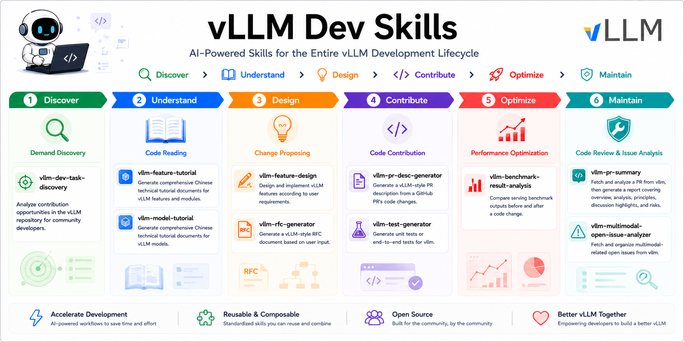

# vLLM Dev Skills

<div align='left'>
  
  
  
  
  
  
  
</div align='left'>

## 📌 Overview



A curated collection of Claude Code agent skills that accelerate the entire vLLM development lifecycle — from understanding codebases and triaging issues to designing features, contributing changes, and analyzing performance. Each skill encapsulates a specific development task as a reusable, composable workflow, enabling vLLM developers and community contributors to work more efficiently with AI-assisted tooling.

> Blog: [vLLM Dev Skills｜自动驾驶开发经验分享](https://zhuanlan.zhihu.com/p/2031696581678866733)

## 🚀 Skills
<!-- | | | | | -->

| Name | Category | Description | Rec |
| :--- | :------- | :---------- | :-- |
| [vllm-dev-task-discovery](./skills/vllm-dev-task-discovery/SKILL.md) | Demand Discovery | Analyze contribution opportunities in the vLLM repository for community developers. | ⭐️⭐️⭐️ |
| [vllm-feature-tutorial](./skills/vllm-feature-tutorial/SKILL.md) | Code Reading | Generate comprehensive Chinese technical tutorial documents for vLLM features and modules. | ⭐️⭐️⭐️⭐️⭐️ |
| [vllm-model-tutorial](./skills/vllm-model-tutorial/SKILL.md) | Code Reading | Generate comprehensive Chinese technical tutorial documents for vLLM models. | ⭐️⭐️⭐️⭐️⭐️ |
| [vllm-feature-design](./skills/vllm-feature-design/SKILL.md) | Change Proposing | Design and implement vLLM features according to user requirements. | ⭐️⭐️⭐️⭐️ |
| [vllm-rfc-generator](./skills/vllm-rfc-generator/SKILL.md) | Change Proposing | Generate a vLLM-style RFC document based on user input. | ⭐️ |
| [vllm-pr-desc-generator](./skills/vllm-pr-desc-generator/SKILL.md) | Code Contribution | Generate a vLLM-style PR description from a GitHub PR's code changes. | ⭐️⭐️⭐️⭐️ |
| [vllm-test-generator](./skills/vllm-test-generator/SKILL.md) | Code Contribution | Generate unit tests or end-to-end tests for vllm. | ⭐️⭐️⭐️ |
| [vllm-benchmark-result-analysis](./skills/vllm-benchmark-result-analysis/SKILL.md) | Performance Optimization | Compare serving benchmark outputs before and after a code change. | ⭐️⭐️ |
| [vllm-pr-summary](./skills/vllm-pr-summary/SKILL.md) | Code Review | Fetch and analyze a PR from vllm, then generate a report covering PR overview, code change analysis, technical principles, discussion highlights, and risk assessment. | ⭐️⭐️⭐️⭐️⭐️ |
| [vllm-multimodal-open-issue-analyzer](./skills/vllm-multimodal-open-issue-analyzer/SKILL.md) | Issue Analysis | Fetch and organize multimodal-related open issues from vllm. | ⭐️ |

## 📖 Usages

**📚 vllm-dev-task-discovery**

Prompt:

```text
我想了解 vLLM 的多模态模块中最近还有哪些可以给社区开发者贡献的事情。（Optional：请帮我分析并整理出当前 top 20 的 tasks）
/vllm-dev-task-discovery
```

Output: [vllm_dev_task_multimodal_20260611](./skills/vllm-dev-task-discovery/outputs/vllm_dev_task_multimodal_20260611.md).

**📚 vllm-feature-tutorial**

Prompt:

```text
我想了解 vLLM 中的 EPD（Encode-Prefill-Decode）特性，请帮我总结一份技术文档。
/vllm-feature-tutorial
```

Output: [disaggregated_encoder_epd](./skills/vllm-feature-tutorial/outputs/disaggregated_encoder_epd.md).

**📚 vllm-model-tutorial**

Prompt:

```text
我想了解 vLLM 中的 DeepSeek-OCR 模型，尤其是其 ViT 部分对多模态输入的处理流程，请帮我总结一份技术文档。
/vllm-model-tutorial
```

Output: [deepseek_ocr](./skills/vllm-model-tutorial/outputs/deepseek_ocr.md).

**📚 vllm-feature-design**

Prompt:

```text
需求背景：
vLLM 的 EPD 特性目前只支持 ExampleECConnector，我们希望集成 MooncakeECConnector，并通过 Mooncake 来统一管理多种传输后端，比如：TCP/RDMA/SHM。
相关链接：https://github.com/vllm-project/vllm/pull/33714#issuecomment-3882716972

设计目标：
请你参考 vLLM 中 MooncakeConnector 在 PD 分离场景（传输 KV Cache）中的注册和使用方式，实现 MooncakeECConnector，用于支持 EPD 特性下的 Encoder Cache 传输。
目前，你只需要实现 TCP 传输方式，但需要考虑将来可能支持更多的传输后端，比如：RDMA、SHM 等（保证接口的可扩展性），比如：你可以实现 MooncakeECConnector 基类，TCPMooncakeECConnector 继承该基类，未来需要实现其它传输后端时，可以直接添加 RDMAMooncakeECConnector、SHMMooncakeECConnector 等子类。
用户通过 vLLM 启动配置来指定使用哪种 Mooncake 传输后端，不支持启动后切换传输方式，默认使用 TCP 传输。
You also need to rethink how to manage the multi-modal embeddings internally inside vLLM (You might need to introduce "embed blocks" based on hash + position).

注意事项：
你不需要写测试用例，只写核心代码实现，并生成一份 markdown 格式的设计文档，放到当前项目的根目录下。

参考资料：
https://kvcache-ai.github.io/Mooncake/getting_started/supported-protocols.html
https://kvcache-ai.github.io/Mooncake/python-api-reference/transfer-engine.html

/vllm-feature-design
```

Output: [Support Mooncake Based ECConnector for EPD](https://github.com/vllm-project/vllm/issues/39766) (with manual adjustment and optimization).

**📚 vllm-rfc-generator**

Prompt:

```text
RFC 标题：
Support ViT Full CUDA Graph

主要内容：
Add full CUDA graph for the ViT to reduce kernel launch overheads.
需要支持图像、视频推理，需要支持 Qwen3-VL/Qwen3.5/GLM-V/Kimi K2.5 等主流 VLM 模型。

相关 PR：
https://github.com/vllm-project/vllm/pull/35963
https://github.com/vllm-project/vllm/pull/37914
https://github.com/vllm-project/vllm/pull/38040
https://github.com/vllm-project/vllm/pull/38061

/vllm-rfc-generator
```

Output: [Support ViT Full CUDA Graph](https://github.com/vllm-project/vllm/issues/38175) (with manual adjustment and optimization).

**📚 vllm-pr-desc-generator**

Prompt:

```text
https://github.com/vllm-project/vllm/pull/38061
/vllm-pr-desc-generator
```

Output: [pr-38061-desc](./skills/vllm-pr-desc-generator/outputs/pr-38061-desc.md) (related PR: [#38061](https://github.com/vllm-project/vllm/pull/38061)).

**📚 vllm-test-generator**

Prompt:

```text
请根据 https://github.com/vllm-project/vllm/pull/38061/changes 中的改动，在 tests/v1/cudagraph/test_encoder_cudagraph.py 中生成对应的测试用例。
要求尽可能复用 SimpleMockViTModel 的代码，减少冗余。
/vllm-test-generator
```

Output: [test_encoder_cudagraph](https://github.com/vllm-project/vllm/pull/38061/changes#diff-e8bf25855192d2972d13d0f0263a121462a181c4c297981d2395394666dc7979).

**📚 vllm-benchmark-result-analysis**

Prompt:

```text
Before this PR:
============ Serving Benchmark Result ============
Successful requests:                     500       
Failed requests:                         0         
Request rate configured (RPS):           10.00     
Benchmark duration (s):                  78.58     
Total input tokens:                      33418     
Total generated tokens:                  61431     
Request throughput (req/s):              6.36      
Output token throughput (tok/s):         781.78    
Peak output token throughput (tok/s):    2475.00   
Peak concurrent requests:                383.00    
Total token throughput (tok/s):          1207.07   
---------------Time to First Token----------------
Mean TTFT (ms):                          7116.24   
Median TTFT (ms):                        4295.84   
P99 TTFT (ms):                           18370.87  
-----Time per Output Token (excl. 1st token)------
Mean TPOT (ms):                          245.78    
Median TPOT (ms):                        264.03    
P99 TPOT (ms):                           334.38    
---------------Inter-token Latency----------------
Mean ITL (ms):                           246.99    
Median ITL (ms):                         117.71    
P99 ITL (ms):                            1327.55   
==================================================

After this PR:
============ Serving Benchmark Result ============
Successful requests:                     500       
Failed requests:                         0         
Request rate configured (RPS):           10.00     
Benchmark duration (s):                  77.44     
Total input tokens:                      33418     
Total generated tokens:                  61522     
Request throughput (req/s):              6.46      
Output token throughput (tok/s):         794.40    
Peak output token throughput (tok/s):    2691.00   
Peak concurrent requests:                369.00    
Total token throughput (tok/s):          1225.91   
---------------Time to First Token----------------
Mean TTFT (ms):                          6888.64   
Median TTFT (ms):                        4128.82   
P99 TTFT (ms):                           17487.94  
-----Time per Output Token (excl. 1st token)------
Mean TPOT (ms):                          240.14    
Median TPOT (ms):                        259.18    
P99 TPOT (ms):                           313.15    
---------------Inter-token Latency----------------
Mean ITL (ms):                           241.84    
Median ITL (ms):                         121.08    
P99 ITL (ms):                            1470.33   
==================================================

/vllm-benchmark-result-analysis
```

Output: [benchmark_comparison_20260323_150830](./skills/vllm-benchmark-result-analysis/outputs/benchmark_comparison_20260323_150830.md) (related PR: [#7104](https://github.com/vllm-project/vllm-ascend/pull/7104)).

**📚 vllm-pr-summary**

Prompt:

```text
https://github.com/vllm-project/vllm/pull/35963
/vllm-pr-summary
```

Output: [pr-35963-summary](./skills/vllm-pr-summary/outputs/pr-35963-summary.md).

**📚 vllm-multimodal-open-issue-analyzer**

Prompt:

```text
/vllm-multimodal-open-issue-analyzer
```

Output: [vllm_multimodal_issues_20260425_030830](./skills/vllm-multimodal-open-issue-analyzer/outputs/vllm_multimodal_issues_20260425_030830.md).

## 💡 Tricks

_Coming soon..._

## 🛠️ Configuration

- [Agent Skills](https://agentskills.io/home#why-agent-skills)
- [Extend Claude with skills](https://code.claude.com/docs/en/skills)
- [Configure Claude Code in VSCode](https://api.lingyaai.cn/model_intro/Claude-Code.html)
- [Configure Claude Code CLI with Claude HUD](https://github.com/jarrodwatts/claude-hud)
- [Awesome DeepSeek Agent](https://github.com/deepseek-ai/awesome-deepseek-agent)

## ©️ Citation

```bibtex
@misc{vllm-dev-skills@2026,
  title  = {vllm-dev-skills},
  url    = {https://github.com/shen-shanshan/vllm-dev-skills},
  note   = {Open-source software available at https://github.com/shen-shanshan/vllm-dev-skills},
  author = {shen-shanshan},
  year   = {2026}
}
```

## 📜 License

Apache-2.0 License, find more details [<u>here</u>](./LICENSE).

## ⭐ Star History

[](https://www.star-history.com/#shen-shanshan/vllm-dev-skills&Timeline)
