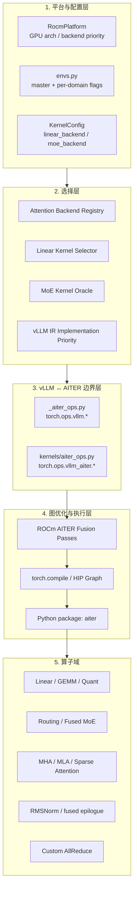
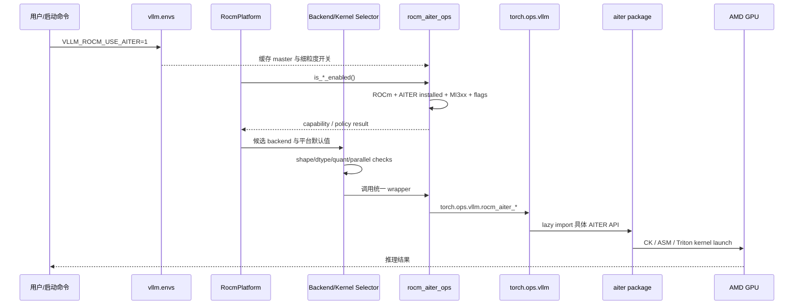
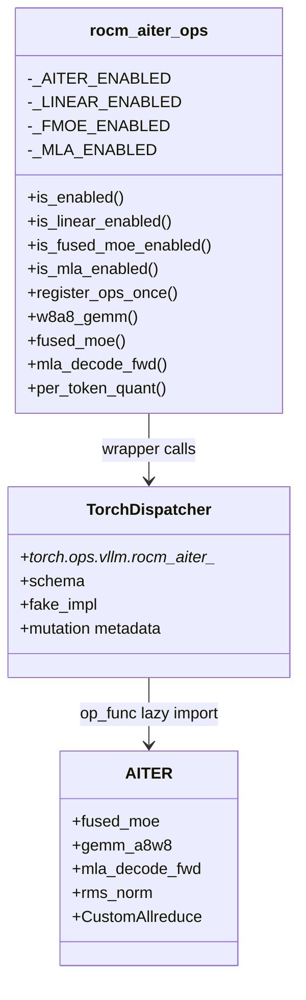
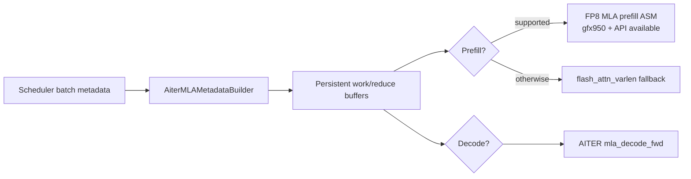
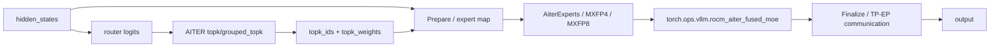

# AMD AITER 在 vLLM 中的集成与使用：代码走读技术文档

> **文档版本**: 1.0  
> **分析代码版本**: vLLM `main`，commit `190be7dad2afa6684902324e0dffa2dc0229a364`  
> **配套 AITER 版本**: `v0.1.16.post5`（当前 `Dockerfile.rocm_base` pin）  
> **最后更新**: 2026-07-27

---

## 文档概述

本文回答三个问题：

1. AMD AITER 是什么，它为何不能被简单理解成“ROCm 版 cuBLAS”；
2. AITER 如何经过能力探测、配置开关、backend/kernel 选择、custom op
   封装与图融合，最终在 vLLM 的模型 forward 中执行；
3. 若要深入掌握这套集成，应按什么顺序阅读 vLLM 源码。

目标读者是熟悉 PyTorch、vLLM 基本执行模型，并希望研究 AMD GPU
推理性能、Attention、MoE、FP8/FP4 量化或编译优化的开发者。

> **先给结论**：AITER 在 vLLM 中不是单一 backend，而是一组按算子域接入的
> provider。Attention 走 backend registry，Linear/MoE 走 kernel oracle，
> RMSNorm 走 vLLM IR implementation，复合算子走 Inductor fusion pass，
> AllReduce 则接入 device communicator。它们最终汇聚到
> `vllm/_aiter_ops.py` 或 `vllm/kernels/aiter_ops.py` 提供的边界层。

---

# 第一部分：AITER 基础与整体架构

## 1.1 AITER 是什么

AITER（AI Tensor Engine for ROCm）是 AMD 面向 AI workload 的高性能算子库。
它集中提供多种实现技术：

- CK（Composable Kernel）算子；
- hand-written assembly 算子；
- Triton 算子；
- runtime dispatch、tuning config 和 weight pre-shuffle；
- Attention、MoE、GEMM、Quantization、Normalization、Collective 等复合算子。

因此，“使用 AITER”并不表示 vLLM 所有计算都切换到同一种 kernel 技术。
例如，同一个 AITER provider 内部可能根据 shape、dtype 和 GPU architecture
在 CK、ASM、Triton 之间选择。

| 层次 | vLLM 负责 | AITER 负责 |
|---|---|---|
| 模型语义 | Linear、Attention、MoE、RMSNorm 的层定义 | 不感知完整模型 |
| 调度与内存 | continuous batching、Paged KV Cache、CUDA/HIP Graph | 执行传入 tensor/metadata |
| backend 选择 | 校验 dtype、shape、量化格式、并行模式 | 暴露 kernel 能力/API |
| 编译图 | custom op schema、fake impl、fusion pattern | 实际 fused kernel |
| 硬件优化 | 决定何时使用及 fallback | CK/ASM/Triton kernel 与 tuning |

## 1.2 集成的五层结构



五层之间的职责是刻意分离的：

- `envs.py` 只读取策略开关；
- `platforms/rocm.py` 只建立 ROCm 默认选择和候选优先级；
- kernel/backend 自己声明支持约束；
- `_aiter_ops.py` 隔离 AITER API，并让调用对 `torch.compile` 可见；
- fusion pass 把多个逻辑 op 替换为一个 AITER fused op。

## 1.3 从启动到 kernel launch 的控制流



这里最重要的区分是：

- `is_aiter_found_and_supported()` 回答“能不能用”；
- `rocm_aiter_ops.is_enabled()` 回答“默认应不应该用”；
- Attention 的显式 backend 配置可以不依赖 master flag 的自动发现策略，但仍
  必须通过 backend 自己的 configuration validation；Linear/MoE kernel 本身
  还会检查对应 AITER feature flag。

当前基础能力检查如下：

```python
# 文件: vllm/_aiter_ops.py:52-72
def is_aiter_found_and_supported() -> bool:
    if current_platform.is_rocm() and IS_AITER_FOUND:
        from vllm.platforms.rocm import on_mi3xx

        return on_mi3xx()
    return False
```

当前 `on_mi3xx()` 对应 `gfx942` 与 `gfx950`。这比 vLLM ROCm 的整体硬件支持范围
更窄：vLLM 可以支持 MI200 或 Radeon，但本文讨论的 AITER 自动集成主路径主要
面向 MI300/MI325（gfx942）和 MI350/MI355（gfx950）。

---

# 第二部分：配置、能力探测与 custom op 边界

## 2.1 主开关与细粒度开关

`VLLM_ROCM_USE_AITER` 默认是 `False`。多数子开关默认 `True`，但只有 master
开关也为真时才生效。这种设计使一条 master flag 可以打开成熟路径，同时保留
对实验性 kernel 的单独控制。

| 环境变量 | 默认值 | 控制范围 | 备注 |
|---|---:|---|---|
| `VLLM_ROCM_USE_AITER` | `False` | AITER master switch | 绝大多数路径的总门控 |
| `VLLM_ROCM_USE_AITER_LINEAR` | `True` | INT8/FP8 GEMM、quantized Linear | 与 master 相与 |
| `VLLM_ROCM_USE_AITER_LINEAR_HIPBMM` | `False` | HIPBlasLt pre-shuffled FP8 MM | 实验性细分路径 |
| `VLLM_ROCM_USE_AITER_MOE` | `True` | routing 与 fused MoE | 与 master 相与 |
| `VLLM_ROCM_AITER_MOE_DISPATCH_POLICY` | `0` | MoE sorting dispatch | 0 auto，1 single-pass，2 multi-pass |
| `VLLM_ROCM_USE_AITER_RMSNORM` | `True` | RMSNorm IR implementation | CUDA/HIP Graph 下优先 |
| `VLLM_ROCM_USE_AITER_MLA` | `True` | MLA backend | DeepSeek 类模型关键 |
| `VLLM_ROCM_USE_AITER_MHA` | `True` | MHA/Flash Attention | 普通 attention 与 ViT |
| `VLLM_ROCM_USE_AITER_UNIFIED_ATTENTION` | `False` | unified attention 自动启用 | 也可显式选择 backend |
| `VLLM_ROCM_USE_AITER_CUSTOM_AR` | `True` | AITER CustomAllreduce | 还受 custom AR 总配置约束 |
| `VLLM_ROCM_USE_AITER_FP8BMM` | `True` | FP8 batched MM | MLA 等路径可使用 |
| `VLLM_ROCM_USE_AITER_FP4BMM` | `True` | FP4 batched MM | 仅 gfx950 门控 |
| `VLLM_ROCM_USE_AITER_FP4_ASM_GEMM` | `False` | FP4 ASM dynamic GEMM | 仅 gfx950 |
| `VLLM_ROCM_USE_AITER_TRITON_ROPE` | `False` | AITER Triton RoPE | 实验性 |
| `VLLM_ROCM_USE_AITER_FUSION_SHARED_EXPERTS` | `False` | routed/shared expert fusion | 需要 AITER MoE |
| `VLLM_ROCM_USE_AITER_TRITON_GEMM` | `True` | AITER Triton unquantized GEMM | 仍受 master 控制 |

开关在 `_aiter_ops.py` import 时缓存，避免 forward hot path 反复读取环境变量：

```python
# 文件: vllm/_aiter_ops.py:1484-1503
_AITER_ENABLED = envs.VLLM_ROCM_USE_AITER
_LINEAR_ENABLED = envs.VLLM_ROCM_USE_AITER_LINEAR
_FMOE_ENABLED = envs.VLLM_ROCM_USE_AITER_MOE
_MLA_ENABLED = envs.VLLM_ROCM_USE_AITER_MLA
_MHA_ENABLED = envs.VLLM_ROCM_USE_AITER_MHA
_TRITON_UNIFIED_ATTN_ENABLED = envs.VLLM_ROCM_USE_AITER_UNIFIED_ATTENTION
```

因此，生产进程应在 import vLLM 前设置环境变量。测试中修改环境变量后，需要调用
`rocm_aiter_ops.refresh_env_variables()`。

## 2.2 `_aiter_ops.py`：最核心的兼容边界

`vllm/_aiter_ops.py` 承担四项工作：

1. 能力检测和 feature flag；
2. 将 vLLM tensor contract 转换成 AITER API contract；
3. 注册 `torch.ops.vllm.rocm_aiter_*` custom op 与 fake implementation；
4. 对不同 AITER 版本进行 feature probing 和 fallback。



custom op 注册在模块末尾自动发生：

```python
# 文件: vllm/_aiter_ops.py:1789-1809,3097
@staticmethod
@if_aiter_supported
def register_ops_once() -> None:
    direct_register_custom_op(
        op_name="rocm_aiter_fused_moe",
        op_func=_rocm_aiter_fused_moe_impl,
        mutates_args=[],
        fake_impl=_rocm_aiter_fused_moe_fake,
        dispatch_key=current_platform.dispatch_key,
    )

rocm_aiter_ops.register_ops_once()
```

为何不在模型层直接调用 `aiter.fused_moe()`？

- `torch.compile` 需要稳定的 op schema；
- fake implementation 用于 FakeTensor tracing 和 shape propagation；
- `mutates_args` 告知 functionalization 哪些参数被原地写入；
- custom op 是图中的 opaque boundary，避免 Dynamo/Inductor 进入 AITER 内部；
- AITER import 被延迟到真正执行 op 时，非 ROCm 环境可以安全 import vLLM。

## 2.3 `kernels/aiter_ops.py`：vLLM IR implementation

`vllm/kernels/aiter_ops.py` 是另一条边界。它不主要服务 Attention/MoE backend，
而是把 AITER 注册为抽象 vLLM IR op 的一种 implementation：

```python
# 文件: vllm/kernels/aiter_ops.py:46-76
@ir.ops.rms_norm.register_impl(
    "aiter", supports_args=rms_no_var_16bit_only, supported=AITER_SUPPORTED
)
def rms_norm(x, weight, epsilon, variance_size=None):
    return torch.ops.vllm_aiter.rms_norm(x, weight, epsilon)

def _rms_norm_impl(x, weight, variance_epsilon):
    from aiter import rms_norm
    return rms_norm(x, weight, variance_epsilon)
```

两种 custom op namespace 的侧重点不同：

| 边界 | namespace | 主要用途 | 典型算子 |
|---|---|---|---|
| `_aiter_ops.py` | `torch.ops.vllm` | AITER 专用 backend/fused op | MoE、MLA、quant、fused AR+RMS |
| `kernels/aiter_ops.py` | `torch.ops.vllm_aiter` | vLLM IR 的 provider implementation | `rms_norm`、`fused_add_rms_norm` |

ROCm 平台在启用 AITER 且启用 graph capture 时，将 IR 优先级设置为：

```text
rms_norm: ["aiter", "native" ...]
fused_add_rms_norm: ["aiter", "native" ...]
```

这意味着模型代码只表达 `vllm_ir.rms_norm`，具体 provider 由 IR lowering 决定。

---

# 第三部分：关键算子域的实际使用

## 3.1 Attention：backend registry 与 metadata adapter

Attention 不是通过一个布尔判断在 forward 中临时切换，而是通过标准 backend
registry 接入。关键枚举包括：

- `ROCM_AITER_FA`：AITER Flash Attention，适合 MHA 和 ViT；
- `ROCM_AITER_MLA`：AITER MLA；
- `ROCM_AITER_TRITON_MLA`：AITER/Triton MLA 组合；
- `ROCM_AITER_UNIFIED_ATTN`：AITER Triton unified attention；
- `ROCM_AITER_MLA_SPARSE`：稀疏 MLA；
- model-specific sparse backend，例如 DeepSeek V4 和 MiniMax M3。

ROCm 默认候选顺序如下：

```python
# 文件: vllm/platforms/rocm.py:407-439
if use_mla:
    if rocm_aiter_ops.is_mla_enabled():
        return [
            AttentionBackendEnum.ROCM_AITER_MLA,
            AttentionBackendEnum.TRITON_MLA,
            AttentionBackendEnum.ROCM_AITER_TRITON_MLA,
        ]

backends = [AttentionBackendEnum.ROCM_ATTN]
if rocm_aiter_ops.is_mha_enabled():
    backends.append(AttentionBackendEnum.ROCM_AITER_FA)
if is_aiter_found_and_supported():
    backends.append(AttentionBackendEnum.ROCM_AITER_UNIFIED_ATTN)
backends.append(AttentionBackendEnum.TRITON_ATTN)
```

候选列表不是最终结果。`get_valid_backends()` 还会调用每个 backend 的
`validate_configuration()`，根据 dtype、head size、block size、attention type、
KV cache dtype 等条件过滤。

### 3.1.1 Unified Attention 路径

`RocmAiterUnifiedAttentionBackend` 定义：

- block size 必须是 16 的倍数，preferred size 为 64；
- head size 至少 32；
-支持 FP16/BF16 query 与 FP8 KV Cache；
- KV Cache 采用 `(num_blocks, num_kv_heads, block_size, 2 * head_size)`；
- causal path 使用 AITER unified attention；
- non-causal encoder-decoder path fallback 到 vLLM Triton kernel。

```python
# 文件: vllm/v1/attention/backends/rocm_aiter_unified_attn.py:143-148
from aiter.ops.triton.unified_attention import unified_attention
self.unified_attention = unified_attention
```

该 backend 同时提供 fused RoPE + KV Cache update 和 fused QKNorm + RoPE +
KV Cache update 能力，使 attention 前处理也能被 AITER 复合 kernel 吸收。

### 3.1.2 MLA 路径

`AiterMLABackend` 的复杂点不只是调用 `mla_decode_fwd`，而是 metadata adapter：

- 将 vLLM block table 展开成 AITER page-size-1 视图；
- 为 persistent MLA kernel 预分配 work metadata；
- 为 CUDA/HIP Graph 保持 tensor address 和 shape 稳定；
- gfx950 + 新 AITER API 时启用 FP8 MLA prefill persistent scheduling；
- 不具备对应 API 时 fallback 到 `flash_attn_varlen_func`。



> **阅读重点**：Attention integration 最容易被忽略的是 metadata builder。
> kernel 本身可能只有一行调用，但 block table、indptr、workspace、graph capture
> buffer 的构造决定了它能否在 vLLM 的动态 batching 中正确工作。

## 3.2 Linear/GEMM：候选优先级、shape 门控与 weight transform

Linear 使用 kernel class 的两阶段校验：

1. `is_supported()`：平台、AITER package、feature flag；
2. `can_implement(config)`：具体 dtype、quant strategy、N/K alignment、tuning。

ROCm FP8 默认候选优先级：

1. `AiterHipbMMPerTokenFp8ScaledMMLinearKernel`；
2. `AiterPreshuffledPerTokenFp8ScaledMMLinearKernel`；
3. `AiterPerTokenFp8ScaledMMLinearKernel`；
4. ROCm/PyTorch fallback。

Block-scaled FP8 则优先 `AiterFp8BlockScaledMMKernel`，再 fallback 到 Triton。

| AITER Linear kernel | 量化形式 | 关键约束 | 额外处理 |
|---|---|---|---|
| `AiterInt8ScaledMMLinearKernel` | INT8 W8A8 | symmetric；PT-PT 或 PTok-PCh | weight transpose |
| `AiterPreshuffledPerToken...` | FP8 PTok-PCh | BF16 output；N/K % 16；有 tuned config | load 后 pre-shuffle weight |
| `AiterHipbMMPerToken...` | FP8 PTok-PCh | MI3xx；显式 HIPBMM flag | shuffle 并保持特殊 view |
| `AiterPerToken...` | FP8 PTok-PCh | shape 对应 tuned config | transpose weight |
| `AiterFp8BlockScaledMMKernel` | FP8 1x128 / block scale | activation group `(1,128)` | AITER Triton 或 CK dispatch |

```python
# 文件: vllm/model_executor/kernels/linear/scaled_mm/aiter.py:175-212
if not rocm_aiter_ops.is_shuffled_per_token_w8a8_gemm_tuned(N, K, fp8_dtype):
    return False, "requires a tuned configuration ..."

def process_weights_after_loading(self, layer):
    replace_parameter(
        layer,
        w_name,
        torch.nn.Parameter(
            rocm_aiter_ops.shuffle_weight(w.t().contiguous()).data,
            requires_grad=False,
        ),
    )

def apply_scaled_mm(...):
    return rocm_aiter_ops.preshuffled_per_token_w8a8_gemm(...)
```

这里体现了一个重要性能原则：只有当 AITER 对该 `(N, K, dtype)` 有 tuned config
时才优先选它。否则“能跑”并不等于“更快”，selector 会使用 fallback。

## 3.3 MoE：routing、expert kernel 与 shared expert fusion

MoE 集成横跨三个层次：

1. Router：`topk_softmax`、`grouped_topk`、`biased_grouped_topk`；
2. Experts：CK/ASM fused MoE、Tkw1、MXFP4、MXFP8；
3. Prepare/Finalize：TP/DP/EP tensor layout 与 expert map。



`FusedMoEConfig.__post_init__()` 根据 AITER flags 记录静态选择：

```python
# 文件: vllm/model_executor/layers/fused_moe/config.py:1348-1352
if self.is_act_and_mul:
    self.rocm_aiter_fmoe_enabled = rocm_aiter_ops.is_fused_moe_enabled()
    self.aiter_fmoe_shared_expert_enabled = (
        rocm_aiter_ops.is_fusion_moe_shared_experts_enabled()
    )
```

Unquantized MoE oracle 还允许显式 `--moe-backend aiter`。当使用 auto 时，
环境变量是否被用户显式设置会影响候选优先级；选中 AITER 后，weight 在 load
阶段通过 `rocm_aiter_ops.shuffle_weights()` 转换成 kernel layout。

`rocm_aiter_fused_experts()` 再把 vLLM quant config 映射为 AITER `QuantType`：

- unquantized：`NO`；
- FP8 per-tensor：`PER_TENSOR`；
- FP8 per-token/per-channel：`PER_TOKEN`；
- MXFP4：`BLOCK_1X32`；
- FP8 block scale：`BLOCK_128x128`。

Shared expert fusion 是更激进的 opt-in 优化。它预分配可复用的 top-k metadata
buffer，把 routed experts 和 shared experts 合并进同一次 AITER fused MoE。
这要求 router 与 expert kernel 对 metadata layout 达成一致，因而默认关闭。

> **注意**：AITER 版本与 MoE weight padding/layout 强耦合。当前代码中仍有针对
> pin 版本的 padding rounding 和 API feature probe；升级 AITER 不能只改安装包，
> 必须同时跑 vLLM MoE correctness 与 graph capture 测试。

## 3.4 RMSNorm、Quantization 与 Inductor Fusion

单算子 RMSNorm 通过 vLLM IR provider 选择。更高收益来自图融合：

| 原图 pattern | 替换后的 AITER op |
|---|---|
| RMSNorm → dynamic FP8 quant | `rocm_aiter_rmsnorm_fused_dynamic_quant` |
| Add + RMSNorm → dynamic quant | `rocm_aiter_rmsnorm_fused_add_dynamic_quant` |
| RMSNorm → group FP8 quant | `rocm_aiter_rmsnorm_fp8_group_quant` |
| SiLU + Mul → group FP8 quant | `rocm_aiter_act_mul_and_fp8_group_quant` |
| Add + RMSNorm → router padding | `rocm_aiter_triton_add_rmsnorm_pad` |
| MLA 双 RMSNorm | `fused_mla_dual_rms_norm*` |
| AllReduce → RMSNorm | `rocm_aiter_fused_allreduce_rmsnorm` |
| AllReduce → RMSNorm → group quant | fused AR/RMS/quant op |

一个典型 pattern：

```python
# 文件: vllm/compilation/passes/fusion/rocm_aiter_fusion.py:88-117
def pattern(input, weight):
    result_rms = torch.ops.vllm_ir.rms_norm(input, weight, self.epsilon)
    result, scale = self.quant_matcher(result_rms)
    return result, scale

def replacement(input, weight):
    return self.FUSED_OP(
        x=input,
        weight=weight,
        epsilon=self.epsilon,
        quant_dtype=self.quant_dtype,
    )
```

Pass manager 只在 AITER 启用且相应 compilation pass 配置打开时加入这些 pass。
pass 顺序也有语义：更具体的 RMSNorm + router padding 必须先于
AllReduce + RMSNorm，否则前者的 pattern 会被后者提前消费。

## 3.5 分布式：AITER CustomAllreduce

`AiterCustomAllreduce` 是 vLLM 对 AITER `CustomAllreduce` 的生命周期封装。
它持有 IPC buffer，并同时服务：

- 普通 tensor-parallel all-reduce；
- fused all-reduce + RMSNorm；
- 支持时的 fused all-reduce + RMSNorm + group quant。

`CudaCommunicator` 的大致 dispatch 顺序包括 FlashInfer、AITER Custom AR、
vLLM Custom AR、symmetric memory、PyNCCL 等。AITER 路径还必须满足
`should_custom_ar(input)`，否则继续 fallback。

```python
# 文件: vllm/distributed/device_communicators/cuda_communicator.py:302-310
if (
    aiter_ar_comm is not None
    and not aiter_ar_comm.disabled
    and aiter_ar_comm.should_custom_ar(input_)
):
    out = aiter_ar_comm.custom_all_reduce(input_)
    return out
```

版本兼容通过 capability probing 完成。例如旧版 AITER 的 fused AR kernel
只支持固定 hidden dimensions；新版以 `_pool` 等 API 特征判定动态 hidden
dimension 和 per-group quant 支持。

## 3.6 其他容易遗漏的接入点

AITER 的使用范围还包括一些不在主干 Attention/Linear/MoE 路径中的模块：

| 场景 | vLLM 入口 | 说明 |
|---|---|---|
| BF16/FP16 非量化 GEMM | `vllm/model_executor/layers/utils.py` | 在 tgemm、AITER Triton GEMM、skinny GEMM 等实现间选择 |
| Top-k/Top-p sampling | `vllm/v1/sample/ops/topk_topp_sampler.py` | ROCm 条件满足时调用 `aiter.ops.sampling` |
| mHC kernel | `vllm/model_executor/kernels/mhc/aiter.py` | 封装 AITER `mhc_pre`/`mhc_post` |
| GDN decode fast path | `vllm/model_executor/layers/mamba/gdn/qwen_gdn_linear_attn.py` | 探测 AITER Triton conv1d、Gated Delta Net 与 fused quant |
| model-specific sparse path | `vllm/models/deepseek_v4/amd/`、`vllm/models/minimax_m3/amd/` | 模型层组合 AITER sparse attention、MoE 或专用缓存布局 |

这些路径说明 AITER 集成不只发生在通用 kernel registry 中：当模型结构需要专门的
metadata、缓存布局或复合执行流程时，vLLM 也会在 model-specific AMD module 中
直接编排 AITER op。

---

# 第四部分：选择、fallback 与版本兼容

## 4.1 不是所有 AITER 路径都由同一个开关决定

| 场景 | 自动选择依据 | 显式选择方式 | fallback |
|---|---|---|---|
| MHA | ROCm backend priority + MHA flag | `--attention-backend ROCM_AITER_FA` | ROCm/Triton attention |
| MLA | model uses MLA + MLA flag | `ROCM_AITER_MLA` | Triton MLA |
| Unified Attention | AITER installed/support；backend validation | `ROCM_AITER_UNIFIED_ATTN` | Triton unified attention |
| Quantized Linear | platform candidate list + shape/tuning | `--linear-backend aiter` | ROCm/PyTorch/Triton |
| MoE | oracle + flags + quant/parallel support | `--moe-backend aiter` | Triton/其他 provider |
| RMSNorm | IR priority + graph mode | IR priority config | native/vLLM C |
| Fusion | compilation pass flags + pattern match | compilation config | 保持未融合图 |
| AllReduce | communicator config + message eligibility | AITER custom AR flag | 其他 AR backend |

## 4.2 关键限制

1. **硬件范围**：当前通用 capability gate 是 MI3xx，即 gfx942/gfx950。
2. **AITER 版本**：vLLM 当前容器 pin `v0.1.16.post5`；部分代码仍用
   `hasattr`/signature probing 兼容旧版。
3. **shape/tuning**：Linear kernel 可能因 N/K alignment 或无 tuned config
   被拒绝。
4. **量化 contract**：不同 kernel 只支持特定 per-tensor、per-token、
   per-channel 或 block shape 组合。
5. **Attention layout**：backend 的 KV Cache layout 必须与 encoder/decoder、
   KV connector 和 speculative decoding 一致。
6. **graph capture**：metadata 与 workspace 通常要预分配，不能在 captured
   forward 中产生 data-dependent CPU sync。
7. **显式 backend 不等于强制成功**：不满足 validation 时会报错，而不是
   无条件 launch。
8. **版本升级风险**：AITER Python signature、weight layout、padding 和
   generated op schema 都可能变化。

---

# 第五部分：如何深入阅读 vLLM 源码

## 5.1 推荐阅读路线

### 路线 A：先建立全局心智模型

1. `vllm/envs.py`  
   搜索 `VLLM_ROCM_USE_AITER`，了解 master/child flags 和默认值。
2. `vllm/_aiter_ops.py`  
   先读 `is_aiter_found_and_supported()`、`rocm_aiter_ops` docstring、
   `register_ops_once()`，不要一开始逐个读三千行 wrapper。
3. `vllm/platforms/rocm.py`  
   读 `_get_backend_priorities()`、`get_valid_backends()`、
   `apply_config_platform_defaults()`、`get_default_ir_op_priority()`。
4. `docker/Dockerfile.rocm_base`  
   确认 vLLM 验证过的 AITER commit/tag、build flags 和 GPU arch。

### 路线 B：沿一个普通 Attention request 向下追

1. `vllm/v1/attention/backends/registry.py`
2. `vllm/platforms/rocm.py::_get_backend_priorities`
3. `vllm/v1/attention/selector.py`
4. `vllm/v1/attention/backends/rocm_aiter_fa.py`
5. `vllm/v1/attention/backends/rocm_aiter_unified_attn.py`
6. 其中的 `from aiter...` 调用点

### 路线 C：沿 DeepSeek MLA 向下追

1. `vllm/model_executor/layers/attention/mla_attention.py`
2. `vllm/v1/attention/backends/mla/prefill/selector.py`
3. `vllm/v1/attention/backends/mla/rocm_aiter_mla.py`
4. `AiterMLAMetadataBuilder`
5. `_aiter_ops.py::_rocm_aiter_mla_decode_fwd_impl`
6. `tests/kernels/attention/test_rocm_aiter_mla_decode_metadata.py`

### 路线 D：沿 FP8 Linear 向下追

1. `vllm/config/kernel.py::KernelConfig`
2. `vllm/model_executor/kernels/linear/__init__.py`
3. `vllm/model_executor/kernels/linear/scaled_mm/aiter.py`
4. `_aiter_ops.py` 中 W8A8、blockscale、shuffle wrapper
5. `tests/kernels/quantization/test_scaled_mm_kernel_selection.py`

### 路线 E：沿 MoE 向下追

1. `vllm/model_executor/layers/fused_moe/layer.py`
2. `vllm/model_executor/layers/fused_moe/config.py`
3. `vllm/model_executor/layers/fused_moe/oracle/unquantized.py`
4. 对应 quant oracle：`oracle/fp8.py`、`oracle/mxfp4.py`、`oracle/mxfp8.py`
5. `experts/rocm_aiter_moe.py`
6. `router/grouped_topk_router.py`
7. `_aiter_ops.py::_rocm_aiter_fused_moe_impl`

### 路线 F：沿 torch.compile fusion 向下追

1. `docs/design/vllm_ir.md`
2. `docs/design/fusions.md`
3. `vllm/kernels/aiter_ops.py`
4. `vllm/compilation/passes/pass_manager.py`
5. `vllm/compilation/passes/fusion/rocm_aiter_fusion.py`
6. `vllm/compilation/passes/fusion/allreduce_rms_fusion.py`
7. `tests/compile/passes/test_double_aiter_rms_quant_fusion.py` 等测试

## 5.2 最值得精读的十个文件

| 优先级 | 文件 | 要回答的问题 |
|---:|---|---|
| 1 | `vllm/_aiter_ops.py` | vLLM 如何封装、注册和兼容 AITER API？ |
| 2 | `vllm/platforms/rocm.py` | 何时把 AITER 放进候选列表？ |
| 3 | `vllm/envs.py` | 哪些路径默认开/关，master 如何门控？ |
| 4 | `vllm/kernels/aiter_ops.py` | AITER 如何成为 vLLM IR provider？ |
| 5 | `vllm/v1/attention/backends/mla/rocm_aiter_mla.py` | 动态 batch metadata 如何适配 MLA kernel？ |
| 6 | `vllm/v1/attention/backends/rocm_aiter_unified_attn.py` | Paged KV Cache 如何传给 unified attention？ |
| 7 | `vllm/model_executor/kernels/linear/scaled_mm/aiter.py` | shape/tuning/weight layout 如何决定 GEMM？ |
| 8 | `vllm/model_executor/layers/fused_moe/experts/rocm_aiter_moe.py` | vLLM MoE contract 如何映射到 AITER？ |
| 9 | `vllm/compilation/passes/fusion/rocm_aiter_fusion.py` | 多个 op 如何融合成 AITER custom op？ |
| 10 | `vllm/distributed/device_communicators/aiter_custom_all_reduce.py` | AITER collective 如何管理生命周期和版本差异？ |

## 5.3 用测试理解 contract

读实现时应配套读以下测试，因为测试通常比 wrapper 更清楚地表达支持边界：

- Attention selection：
  `tests/v1/attention/test_rocm_attention_backends_selection.py`
- Unified Attention：
  `tests/kernels/attention/test_rocm_aiter_unified_attn.py`
- MLA metadata：
  `tests/kernels/attention/test_rocm_aiter_mla_decode_metadata.py`
- AITER Flash Attention：
  `tests/kernels/attention/test_aiter_flash_attn.py`
- Linear selection：
  `tests/kernels/quantization/test_scaled_mm_kernel_selection.py`
- MoE backend：
  `tests/kernels/moe/test_unquantized_backend_selection.py`
- MoE routing：
  `tests/kernels/moe/test_rocm_aiter_topk.py`
- Fusion：
  `tests/compile/passes/test_double_aiter_rms_quant_fusion.py`
- AllReduce：
  `tests/distributed/test_rocm_aiter_custom_ar.py`
- End-to-end AR：
  `tests/v1/e2e/general/test_rocm_aiter_custom_ar.py`

---

# 第六部分：使用与调试建议

## 6.1 基础启用

在 AITER 已安装且版本与 vLLM 匹配的 ROCm 环境中：

```bash
export VLLM_ROCM_USE_AITER=1
vllm serve <model>
```

成熟的 Linear、MoE、RMSNorm、MLA、MHA 子开关默认开启，但实际是否选中仍取决于
模型结构、GPU architecture、dtype、shape 和 backend validation。

显式调试某一 provider 时可使用：

```bash
vllm serve <model> \
  --attention-backend ROCM_AITER_MLA \
  --moe-backend aiter \
  --linear-backend aiter
```

这些参数不能机械地同时用于所有模型：没有 MLA 的模型不能选择 MLA backend，
非 MoE 模型的 `--moe-backend` 也不会产生效果。

## 6.2 判断是否真的用了 AITER

建议组合使用：

1. 查看 vLLM startup log 中的 “Using ... backend”；
2. 打开 debug log，检查被拒候选及原因；
3. 用 ROCm profiler 检查实际 kernel symbol；
4. 对比关闭单个 child flag 后的 kernel trace；
5. 检查 Inductor graph dump 中是否出现 `rocm_aiter_*` fused op。

不要只凭 `VLLM_ROCM_USE_AITER=1` 判断。该变量表示允许使用，并不保证每一层都选中
AITER。

## 6.3 AITER 升级时的最小验证矩阵

| 维度 | 至少覆盖 |
|---|---|
| GPU | gfx942、gfx950（若发布同时支持） |
| graph mode | eager、piecewise/full graph |
| phase | prefill、decode、mixed batch |
| precision | BF16、FP8；涉及时加 FP4/MX |
| model family | Dense MHA、MLA、MoE |
| parallelism | TP1、TP>1；涉及时加 EP/DP |
| correctness | kernel unit + model generation/eval |
| performance | TTFT、TPOT、throughput、kernel duration |

---

# 附录

## A. 关键代码位置索引

| 模块 | 文件 |
|---|---|
| 环境变量 | `vllm/envs.py` |
| ROCm capability 与 backend priority | `vllm/platforms/rocm.py` |
| AITER 主 wrapper/custom op | `vllm/_aiter_ops.py` |
| AITER vLLM IR implementations | `vllm/kernels/aiter_ops.py` |
| Attention backend registry | `vllm/v1/attention/backends/registry.py` |
| AITER Flash Attention | `vllm/v1/attention/backends/rocm_aiter_fa.py` |
| AITER Unified Attention | `vllm/v1/attention/backends/rocm_aiter_unified_attn.py` |
| AITER MLA | `vllm/v1/attention/backends/mla/rocm_aiter_mla.py` |
| AITER Sparse MLA | `vllm/v1/attention/backends/mla/rocm_aiter_mla_sparse.py` |
| Linear kernel 列表 | `vllm/model_executor/kernels/linear/__init__.py` |
| AITER scaled MM | `vllm/model_executor/kernels/linear/scaled_mm/aiter.py` |
| AITER Fused MoE | `vllm/model_executor/layers/fused_moe/experts/rocm_aiter_moe.py` |
| MoE oracle | `vllm/model_executor/layers/fused_moe/oracle/` |
| AITER fusion passes | `vllm/compilation/passes/fusion/rocm_aiter_fusion.py` |
| Pass 编排 | `vllm/compilation/passes/pass_manager.py` |
| AITER CustomAllreduce | `vllm/distributed/device_communicators/aiter_custom_all_reduce.py` |
| ROCm communicator dispatch | `vllm/distributed/device_communicators/cuda_communicator.py` |
| 非量化 AITER GEMM | `vllm/model_executor/layers/utils.py` |
| AITER sampling | `vllm/v1/sample/ops/topk_topp_sampler.py` |
| AITER mHC | `vllm/model_executor/kernels/mhc/aiter.py` |
| DeepSeek V4 AMD path | `vllm/models/deepseek_v4/amd/` |
| MiniMax M3 AMD path | `vllm/models/minimax_m3/amd/` |
| AITER 安装说明 | `docs/getting_started/installation/gpu.rocm.inc.md` |
| AITER pin/build | `docker/Dockerfile.rocm_base` |

## B. 术语表

| 术语 | 含义 |
|---|---|
| AITER | AMD AI Tensor Engine for ROCm |
| CK | Composable Kernel |
| MHA | Multi-Head Attention |
| MLA | Multi-head Latent Attention |
| MoE | Mixture of Experts |
| PTPC | per-token activation / per-channel weight |
| Paged KV Cache | 按 block/page 管理的 KV Cache |
| Custom Op | 注册进 PyTorch dispatcher 的外部算子 |
| Fake Impl | FakeTensor tracing 时使用的 shape/dtype 实现 |
| IR Provider | vLLM 抽象 IR op 的某个硬件/库实现 |
| Kernel Oracle | 根据配置筛选具体 kernel backend 的选择器 |

## C. 外部资料

- AITER 官方仓库：<https://github.com/ROCm/aiter>
- AITER 官方文档：<https://rocm.github.io/aiter/>
- AMD AITER 技术介绍：
  <https://rocm.blogs.amd.com/software-tools-optimization/aiter-ai-tensor-engine/README.html>
- vLLM ROCm 安装文档：
  <https://docs.vllm.ai/en/latest/getting_started/installation/gpu.html>
- AITER 集成历史追踪 issue：
  <https://github.com/vllm-project/vllm/issues/14964>
- 早期整合 PR：
  <https://github.com/vllm-project/vllm/pull/14007>
- vLLM fusion 设计：
  <https://docs.vllm.ai/en/latest/design/fusions/>

> **版本提示**：AITER 与 vLLM 都处于快速演进中。阅读外部博客或旧 PR 时，应以
> 当前 `Dockerfile.rocm_base` 的 AITER pin、当前 `_aiter_ops.py` wrapper 和
> 当前测试为准，不能直接套用旧环境变量名或旧 backend layout。
