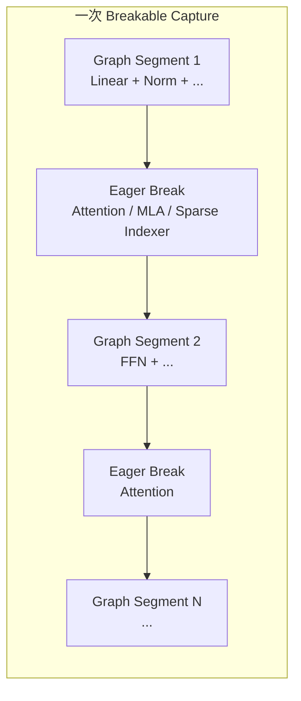
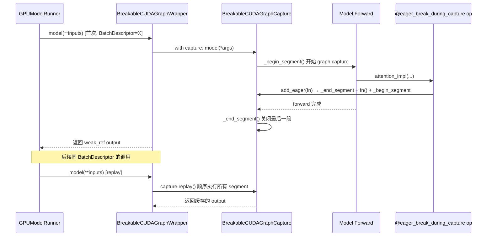
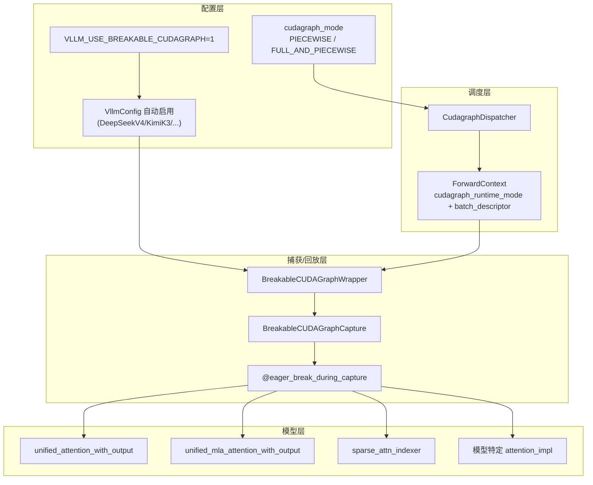
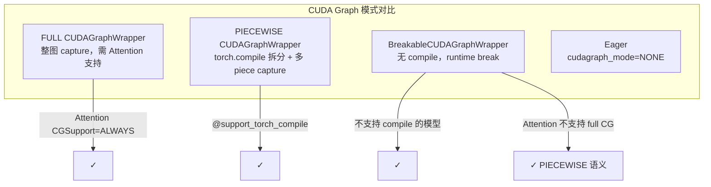
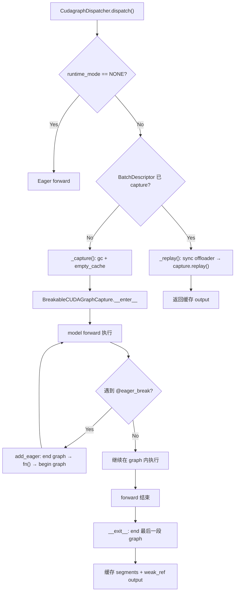
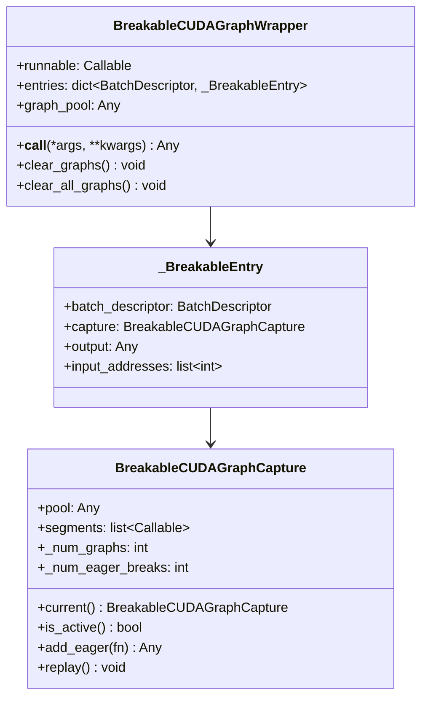

# vLLM Breakable CUDA Graph 特性代码走读技术文档

> **文档版本**: 1.0  
> **分析代码版本**: vLLM main 分支（截至 2026-08）  
> **最后更新**: 2026-08-08

---

## 文档概述

**Breakable CUDA Graph**（可中断 CUDA Graph）是 vLLM 中一种**不依赖 `torch.compile` 的 PIECEWISE CUDA Graph 实现路径**。它在一次完整的 model forward 捕获过程中，于 Attention / KV Cache 等 custom op 边界**主动打断 stream capture**，使这些算子在 eager 模式下执行，其余部分仍被 CUDA Graph 捕获，从而在**不拆分 FX Graph** 的前提下获得 PIECEWISE 模式的性能收益。

**目标读者**：
- 需要理解 vLLM CUDA Graph 体系（FULL / PIECEWISE / Breakable）的推理工程师
- 为新模型（DeepSeek V4、Kimi K3、Inkling 等）接入 CUDA Graph 的开发者
- 排查 PIECEWISE cudagraph 与 `torch.compile` 兼容性问题的维护者

**阅读建议**：
1. 先读第一部分理解「为什么需要 Breakable」及与传统 PIECEWISE 的差异
2. 第二部分梳理核心 API 与类层次
3. 第三部分跟随一次 capture/replay 的完整执行流
4. 第五部分查阅配置与典型使用场景

---

# 第一部分: Breakable CUDA Graph 基础与架构总览

## 1.1 Breakable CUDA Graph 原理

### 1.1.1 基本思想

传统 vLLM **PIECEWISE CUDA Graph** 的工作方式是：

1. 通过 `torch.compile` + FX Graph 拆分，在 Attention 边界将模型切成多个子图
2. 每个子图单独 capture 为一个 `torch.cuda.CUDAGraph`
3. Attention 等 cudagraph-incompatible 算子在子图之间 eager 执行

这种方式要求模型支持 `@support_torch_compile`，且 compile 过程可能带来较长的启动时间和复杂的 pass 交互。

**Breakable CUDA Graph** 的思路（灵感来自 [sgl-project/sglang#19102](https://github.com/sgl-project/sglang/pull/19102)）是：

> 不做 FX 预拆分，而是用**单个 capture context** 驱动整个 forward；在 Attention / KV Cache 等 custom op 的 dispatcher 处**运行时打断**当前 stream capture → eager 执行该 op → 恢复 capture。

最终产物是一个 **segment 列表**：每个 segment 要么是 `CUDAGraph.replay`（图段），要么是一个 eager callable（中断段），推理时按顺序 replay。



> **关键洞察**: Breakable 实现了与 PIECEWISE 相同的**语义**（Attention 外图内、Attention 内 eager），但**实现路径完全不同**——绕开 `torch.compile`，直接在 Python forward 路径上用 stream capture break 实现。

### 1.1.2 工作流程



**Capture 阶段**：
1. `BreakableCUDAGraphWrapper._capture()` 创建 `BreakableCUDAGraphCapture`
2. 进入 `with capture:` 后调用 `self.runnable(*args, **kwargs)`
3. 遇到 `@eager_break_during_capture` 装饰的 op 时，调用 `capture.add_eager(lambda: fn(...))`
4. `add_eager` 内部：结束当前 graph → eager 执行 fn → 将 fn 加入 segments → 开始新 graph
5. forward 结束后，segments 列表形如 `[graph.replay, eager_fn, graph.replay, eager_fn, ...]`

**Replay 阶段**：
1. 输入 tensor 必须写入与 capture 时**相同的 static buffer**（地址不变）
2. 顺序调用每个 segment 的 replay callable
3. 输出 tensor 地址与 capture 时一致

### 1.1.3 性能分析

Breakable 与 compile-based PIECEWISE 的性能权衡：

| 维度 | Compile-based PIECEWISE | Breakable PIECEWISE |
|------|-------------------------|---------------------|
| 启动时间 | 长（FX 拆分 + Inductor compile） | 短（无 compile，仅 capture） |
| Capture 时间 | 每 piece 单独 capture，有 gc 开销 | 单次 forward 多段 capture，`_begin_segment` 不重复 gc |
| 运行时开销 | Graph replay + eager attention | 相同语义 |
| 编译优化 | 可享受 Inductor fusion pass | `CompilationMode.NONE`，无 compile pass |
| 内存 | 多 piece 图 + compile artifact | 多 segment 图，无 compile artifact |

对于**不支持 `@support_torch_compile` 的新模型**（DeepSeek V4、Kimi K3 等），Breakable 是在 PIECEWISE 模式下启用 CUDA Graph 的**唯一官方路径**。

### 1.1.4 关键指标定义

| 术语 | 含义 |
|------|------|
| **Segment** | 一次 capture/replay 的基本单元，可以是 CUDA Graph 或 eager callable |
| **Break Point** | 被 `@eager_break_during_capture` 标记的算子，capture 在此处打断 |
| **BatchDescriptor** | `(num_tokens, num_reqs, uniform, has_lora)` 元组，作为 capture cache 的 key |
| **Static Buffer** | capture 时使用的固定地址 tensor buffer，replay 时必须复用 |
| **num_graphs** | 一次 capture 产生的 graph segment 数量 |
| **num_eager_breaks** | 一次 capture 产生的 eager break 数量（通常 ≈ Attention 层数） |

---

## 1.2 vLLM Breakable CUDA Graph 整体架构

### 1.2.1 系统架构总览图



### 1.2.2 核心组件与职责划分

| 组件 | 文件 | 职责 |
|------|------|------|
| `is_breakable_cudagraph_enabled()` | `vllm/compilation/breakable_cudagraph.py` | 读取 `VLLM_USE_BREAKABLE_CUDAGRAPH` 环境变量 |
| `eager_break_during_capture` | 同上 | 装饰 break point 算子，capture 时路由到 `add_eager` |
| `BreakableCUDAGraphCapture` | 同上 | 管理 segment 的 begin/end/replay |
| `BreakableCUDAGraphWrapper` | 同上 | 替代 `CUDAGraphWrapper`，按 BatchDescriptor 懒 capture/replay |
| `CudaGraphManager.use_breakable_cg` | `vllm/v1/worker/gpu/cudagraph_utils.py` | GPU worker 路径的 breakable 开关 |
| `GPUModelRunner` 包装逻辑 | `vllm/v1/worker/gpu_model_runner.py` | 在 compile 阶段用 BreakableCUDAGraphWrapper 包装 model |

### 1.2.3 数据流与控制流分析

Breakable 与标准 CUDA Graph 体系的关系：



> **注意**: 启用 Breakable 时，`VllmConfig` 会将 `compilation_config.mode` 设为 `CompilationMode.NONE`，即**主动关闭 torch.compile**。这是设计意图，而非 bug。

---

## 1.3 执行流程详解

### 1.3.1 示例：DeepSeek V4 单层 Attention 的 Break 点

以 DeepSeek V4 为例，`attention_impl` 被 `@eager_break_during_capture` 装饰，是 capture 时的 break 点：

```python
# 文件: vllm/models/deepseek_v4/attention.py

# attention_impl is wrapped with @eager_break_during_capture: this is
# where the breakable cudagraph capture breaks (the attention op runs
# eagerly between captured graph segments).
self.attention_impl(
    hidden_states, qr, kv, kv_score, indexer_kv_score,
    indexer_weights, positions, o_padded,
)

@eager_break_during_capture
def attention_impl(self, hidden_states, ...):
    # 稀疏 attention、indexer 等复杂逻辑在此 eager 执行
    ...
```

一次完整 forward（假设 60 层）大致产生：
- **60 个 eager break**（每层 attention 一次）
- **61 个 graph segment**（首尾 + 层间）

### 1.3.2 Capture → Replay 多步流程



---

# 第二部分: 核心接口与基类分析

## 2.1 核心基类详解



## 2.2 核心接口定义

### 2.2.1 `eager_break_during_capture` 装饰器

```python
# 文件: vllm/compilation/breakable_cudagraph.py

def eager_break_during_capture(fn: F) -> F:
    """Decorator that turns a custom-op Python kernel into a "break point"
    for the breakable cudagraph capture."""
    @functools.wraps(fn)
    def wrapper(*args, **kwargs):
        capture = BreakableCUDAGraphCapture.current()
        if capture is None or not capture._capturing:
            return fn(*args, **kwargs)
        if is_forward_context_available():
            mode = get_forward_context().cudagraph_runtime_mode
            if mode == CUDAGraphMode.FULL:
                return fn(*args, **kwargs)  # FULL 模式不打断
        weak_args = tuple(
            weak_ref_tensor(a) if isinstance(a, torch.Tensor) else a
            for a in args
        )
        return capture.add_eager(lambda: fn(*weak_args, **weak_kwargs))
    return wrapper
```

**关键约束**（来自 docstring）：

| 约束 | 原因 |
|------|------|
| **In-place output buffer** | 返回值若是新 tensor，replay 时地址变化会破坏后续 graph segment |
| **装饰器顺序：最外层** | `@eager_break_during_capture` 必须在 `@maybe_transfer_kv_layer` 外层，否则 PD disaggregation 的 KV 传输 side effect 会被 capture 进 graph |
| **FULL 模式跳过 break** | FULL cudagraph 整图 capture 时不需要打断 |

正确装饰顺序示例：

```python
@eager_break_during_capture   # 最外层
@maybe_transfer_kv_layer
def unified_attention_with_output(...):
    ...
```

### 2.2.2 `BreakableCUDAGraphCapture.add_eager`

```python
def add_eager(self, fn: Callable[[], Any]) -> Any:
    self._end_segment()       # 结束当前 graph capture
    result = fn()             # eager 执行
    self.segments.append(fn)  # 记录 eager callable 供 replay
    self._num_eager_breaks += 1
    self._begin_segment()     # 开始新 graph capture
    return result
```

### 2.2.3 `BreakableCUDAGraphWrapper.__call__`

与 `CUDAGraphWrapper` 的主要差异：

| 行为 | CUDAGraphWrapper | BreakableCUDAGraphWrapper |
|------|------------------|---------------------------|
| runtime_mode 匹配 | 严格匹配 FULL 或 PIECEWISE | 接受任意非 NONE 模式 |
| Capture 方式 | 单次 `torch.cuda.graph()` | 多段 `capture_begin/end` + eager breaks |
| 依赖 compile | PIECEWISE 需要 | **不需要** |
| Cache key | BatchDescriptor | BatchDescriptor（相同） |

---

## 2.3 工厂方法 / 注册机制

Breakable 的启用有两条路径：

### 2.3.1 环境变量手动启用

```bash
export VLLM_USE_BREAKABLE_CUDAGRAPH=1
```

### 2.3.2 特定模型自动启用

```python
# 文件: vllm/config/vllm.py

if (
    self.model_config is not None
    and "VLLM_USE_BREAKABLE_CUDAGRAPH" not in os.environ
    and any(a in (
        "DeepseekV4ForCausalLM", "DeepSeekV4MTPModel",
        "InklingForCausalLM", "InklingForConditionalGeneration",
        "KimiK3ForConditionalGeneration", "KimiK3MTPModel",
        "KimiLinearForCausalLM",
        "MiniMaxM3SparseForCausalLM",
        "MiniMaxM3SparseForConditionalGeneration",
    ) for a in self.model_config.architectures)
):
    os.environ["VLLM_USE_BREAKABLE_CUDAGRAPH"] = "1"
```

启用后副作用：

```python
if breakable_cudagraph_enabled:
    self.compilation_config.mode = CompilationMode.NONE
```

### 2.3.3 GPUModelRunner 包装时机

```python
# 文件: vllm/v1/worker/gpu_model_runner.py

if (
    is_breakable_cudagraph_enabled()
    and cudagraph_mode != CUDAGraphMode.NONE
    and not self.parallel_config.use_ubatching
):
    self.model = BreakableCUDAGraphWrapper(self.model, self.vllm_config)
    # speculative decoding drafter 同样包装
    if drafter is not None and hasattr(drafter, "model"):
        drafter.model = BreakableCUDAGraphWrapper(drafter.model, self.vllm_config)
```

---

# 第三部分: 核心实现深度分析

## 3.1 算法原理

Breakable capture 的核心算法可形式化为：

设 model forward 为序列 of ops $O = [o_1, o_2, \ldots, o_n]$，break point 集合为 $B \subseteq O$。

Capture 产生 segment 序列 $S = [s_1, s_2, \ldots, s_m]$，其中：
- 若 $o_i \notin B$：$o_i$ 被 record 到当前 graph segment
- 若 $o_i \in B$：当前 segment 结束，$o_i$ eager 执行并加入 $S$，新 segment 开始

Replay 时：

$$S.\text{replay}() = \forall s \in S: s()$$

## 3.2 vLLM 实现分析

### 3.2.1 Segment 生命周期

```python
# 文件: vllm/compilation/breakable_cudagraph.py

def _begin_segment(self) -> None:
    g = torch.cuda.CUDAGraph()
    if self.pool is not None:
        g.capture_begin(pool=self.pool)
    else:
        g.capture_begin()
    self._current_graph = g
    self._capturing = True

def _end_segment(self) -> None:
    self._current_graph.capture_end()
    self.segments.append(self._current_graph.replay)
    self._num_graphs += 1
    self._capturing = False

def replay(self) -> None:
    for r in self.segments:
        r()
```

### 3.2.2 Capture 前的资源准备

```python
def _capture(self, entry, args, kwargs):
    validate_cudagraph_capturing_enabled()
    entry.input_addresses = self._collect_tensor_addresses(args, kwargs)

    set_graph_pool_id(self.graph_pool)
    gc.collect()                    # 仅 _capture 调用一次，不在 _begin_segment 重复
    torch.accelerator.empty_cache()
    get_offloader().sync_prev_onload()

    capture = BreakableCUDAGraphCapture(pool=self.graph_pool)
    with capture:
        output = self.runnable(*args, **kwargs)
        get_offloader().join_after_forward()  # 必须在最后 segment 内 capture
        output = weak_ref_tensors(output)

    entry.capture = capture
    entry.output = weak_ref_tensors(output)
    return output
```

> **性能提示**: `_begin_segment` 不在内部调用 `gc.collect()`，避免多层 Attention break 导致 capture 时间爆炸——这是相对旧 piecewise 路径的优化。

### 3.2.3 已注册 Break Point 的算子

| 算子 / 方法 | 文件 | 场景 |
|-------------|------|------|
| `unified_attention_with_output` | `model_executor/layers/attention/attention.py` | 通用 Attention |
| `unified_mla_attention_with_output` | `model_executor/layers/attention/mla_attention.py` | MLA Attention |
| `sparse_attn_indexer` | `model_executor/layers/sparse_attn_indexer.py` | 稀疏 Attention 索引 |
| `rocm_aiter_sparse_attn_indexer` | `v1/attention/ops/rocm_aiter_mla_sparse.py` | ROCm sparse |
| `DeepSeekV4.attention_impl` | `models/deepseek_v4/attention.py` | DeepSeek V4 稀疏 attention |
| `DeepSeekV32._sparse_indexer_and_attn` | `models/deepseek_v32/attention.py` | DeepSeek V3.2 |
| `KimiK3._attention` / `KDA._forward` | `models/kimi_k3/` | Kimi K3 MLA/KDA |
| `Inkling._attention` | `models/inkling/` | Inkling |
| `MiniMaxM3._run_attention` | `models/minimax_m3/` | MiniMax M3 |
| `KimiGDNLinearAttn._forward` | `model_executor/layers/mamba/gdn/` | Kimi GDN linear attention |

## 3.3 关键数据结构

```python
@dataclasses.dataclass
class _BreakableEntry:
    batch_descriptor: BatchDescriptor
    capture: BreakableCUDAGraphCapture | None = None
    output: Any = None
    input_addresses: list[int] | None = None  # DEBUG 模式地址校验
```

`BreakableCUDAGraphCapture.segments` 示例（3 层模型）：

```
[
  <CUDAGraph.replay>,           # Layer0 前的 Linear/Norm
  <lambda: attention_layer0>,   # Eager: unified_attention_with_output
  <CUDAGraph.replay>,           # Layer0 FFN + Layer1 前
  <lambda: attention_layer1>,   # Eager
  <CUDAGraph.replay>,           # Layer1 FFN + Layer2 前
  <lambda: attention_layer2>,   # Eager
  <CUDAGraph.replay>,           # Layer2 FFN + LM Head
]
```

---

# 第四部分: Breakable vs 传统 PIECEWISE vs FULL 对比

## 4.1 三种 CUDA Graph 路径对比

| 特性 | FULL | Compile PIECEWISE | Breakable PIECEWISE |
|------|------|-------------------|---------------------|
| **依赖 torch.compile** | 否（可独立） | **是** | **否** |
| **Attention 执行方式** | 在 graph 内（需 backend 支持） | Graph 外 eager | Graph 外 eager |
| **Graph 拆分方式** | 无拆分，整图 | FX Graph 静态拆分 | Runtime stream break |
| **模型 compile 要求** | 无 | `@support_torch_compile` | 无 |
| **Inductor fusion** | 部分 | 完整 | 无 |
| **启动时间** | 中 | 长 | **短** |
| **适用 Attention backend** | `ALWAYS` 级别 | 任意 | 任意 |
| **Multi-stream 并行** | 支持 | 支持 | Capture 时**禁用** |
| **PD Disaggregation** | 需特殊处理 | compile 路径 | `@eager_break` 外层装饰 KV transfer |

## 4.2 为什么需要 Breakable CUDA Graph？

### 原因 1：新模型不支持 torch.compile

DeepSeek V4、Kimi K3、Inkling、MiniMax M3 等模型**未携带 `@support_torch_compile`**。传统 PIECEWISE 路径要求 `CompilationMode.VLLM_COMPILE`，这些模型无法使用 compile-based piecewise cudagraph。

Breakable 提供了**无需 compile 的 PIECEWISE 等价物**。

### 原因 2：解耦 CUDA Graph 与 Compilation

vLLM v1 的设计目标是将 CUDA Graph 与 compile **正交化**（见 `docs/design/cuda_graphs.md`）。Breakable 是这一目标的极端实现：**PIECEWISE cudagraph 完全脱离 compile**。

```python
# CudagraphDispatcher 断言：PIECEWISE 需要 compile 或 breakable
assert (
    not self.compilation_config.cudagraph_mode.requires_piecewise_compilation()
    or self.compilation_config.is_attention_compiled_piecewise()
    or is_breakable_cudagraph_enabled()
)
```

### 原因 3：复杂 Attention 算子难以被 FX Graph 正确拆分

稀疏 Attention、MLA、KDA、Multi-stream GEMM 等算子：
- 包含 host-side 逻辑、动态 shape、custom CUDA kernel
- 在 FX 层面拆分容易遗漏 side effect（如 PD KV transfer）
- Runtime break 让模型作者在**Python 层面精确控制** break 位置

### 原因 4：降低启动延迟

对于大型 MoE / 稀疏模型，compile 时间可能达数分钟。Breakable 跳过 compile，仅做 capture，显著缩短 **time-to-first-token** 中的 warmup 阶段。

---

# 第五部分: 配置与使用指南

## 5.1 关键参数说明

| 参数 / 环境变量 | 类型 | 默认值 | 说明 |
|----------------|------|--------|------|
| `VLLM_USE_BREAKABLE_CUDAGRAPH` | env | `0` | 启用 Breakable CUDA Graph |
| `--compilation-config '{"cudagraph_mode": "..."}'` | CLI | 依 optimization level | 需非 `NONE` 的 cudagraph_mode |
| `compilation_config.mode` | config | 启用 breakable 时强制 `NONE` | 关闭 torch.compile |
| `enforce_eager` | config | `False` | 设为 True 会禁用所有 cudagraph |
| `use_ubatching` | config | `False` | ubatching 模式下不使用 Breakable wrapper |

## 5.2 典型配置示例

### 5.2.1 DeepSeek V4（自动启用 Breakable）

```bash
vllm serve deepseek-ai/DeepSeek-V3 \
  --compilation-config '{"cudagraph_mode": "FULL_AND_PIECEWISE"}'
# VllmConfig 会自动设置 VLLM_USE_BREAKABLE_CUDAGRAPH=1
```

### 5.2.2 手动启用（通用模型实验）

```bash
VLLM_USE_BREAKABLE_CUDAGRAPH=1 \
vllm serve meta-llama/Llama-3.1-8B-Instruct \
  --compilation-config '{"cudagraph_mode": "PIECEWISE", "mode": 0}'
```

### 5.2.3 显式关闭自动启用

```bash
VLLM_USE_BREAKABLE_CUDAGRAPH=0 \
vllm serve deepseek-ai/DeepSeek-V3 \
  --compilation-config '{"cudagraph_mode": "NONE"}'
```

### 5.2.4 Python API

```python
import os
os.environ["VLLM_USE_BREAKABLE_CUDAGRAPH"] = "1"

import vllm
model = vllm.LLM(
    model="moonshotai/Kimi-K2-Instruct",
    compilation_config={"cudagraph_mode": "FULL_AND_PIECEWISE", "mode": 0},
)
```

## 5.3 性能调优建议

1. **优先使用自动启用**：对 DeepSeek V4 / Kimi K3 等模型，让 `VllmConfig` 自动开启，无需手动干预
2. **cudagraph_capture_sizes 调优**：Breakable 按 BatchDescriptor 分别 capture，capture size 越多内存越大
3. **DEBUG 地址校验**：设置 `VLLM_LOGGING_LEVEL=DEBUG` 可检测 replay 时 input tensor 地址漂移
4. **Multi-stream 降级**：Breakable capture 期间 multi-stream 自动串行化，这是正确行为，不影响 replay
5. **Speculative Decoding**：drafter model 同样被 `BreakableCUDAGraphWrapper` 包装，注意 drafter 的 break point 是否已注册

## 5.4 应用场景汇总

| 场景 | 说明 |
|------|------|
| **DeepSeek V4 / V3.2 稀疏 Attention** | 复杂 indexer + sparse attention，break 点在 `attention_impl` |
| **Kimi K3 MLA / KDA** | Multi-Latent Attention 和 Kimi Delta Attention |
| **Inkling 模型** | 自定义 attention 路径 |
| **MiniMax M3 Sparse** | 稀疏 MoE attention |
| **通用 Attention 层** | `unified_attention_with_output` 已全局注册 break |
| **MLA Attention** | `unified_mla_attention_with_output` |
| **Speculative Decoding Draft Model** | drafter 的 prefill/decode PIECEWISE graph |
| **PD Disaggregation** | KV layer transfer 必须在 eager segment 执行 |
| **不支持 compile 的新模型接入** | 作为 PIECEWISE cudagraph 的默认路径 |
| **快速 warmup / 低启动延迟** | 跳过 compile，仅 capture |

---

# 附录

## A. 关键代码位置索引

| 组件 | 路径 |
|------|------|
| Breakable 核心实现 | `vllm/compilation/breakable_cudagraph.py` |
| 环境变量定义 | `vllm/envs.py` (`VLLM_USE_BREAKABLE_CUDAGRAPH`) |
| 自动启用逻辑 | `vllm/config/vllm.py` (~L1227-1261) |
| GPUModelRunner 包装 | `vllm/v1/worker/gpu_model_runner.py` (~L5525-5535) |
| GPU Worker CudaGraphManager | `vllm/v1/worker/gpu/cudagraph_utils.py` |
| CudagraphDispatcher 断言 | `vllm/v1/cudagraph_dispatcher.py` (~L45-61) |
| 通用 Attention break | `vllm/model_executor/layers/attention/attention.py` (~L758) |
| MLA Attention break | `vllm/model_executor/layers/attention/mla_attention.py` (~L1221) |
| Multi-stream 降级 | `vllm/utils/multi_stream_utils.py` |
| 单元测试 | `tests/v1/cudagraph/test_breakable_cudagraph.py` |
| CUDA Graph 设计文档 | `docs/design/cuda_graphs.md` |
| 标准 CUDAGraphWrapper | `vllm/compilation/cuda_graph.py` |

## B. 术语表

| 术语 | 英文 | 解释 |
|------|------|------|
| Breakable CUDA Graph | Breakable CUDA Graph | 可在 capture 过程中运行时打断的 CUDA Graph 方案 |
| Break Point | Break Point | 被 `@eager_break_during_capture` 标记的算子位置 |
| Segment | Segment | Graph 段或 Eager 段的 replay 单元 |
| PIECEWISE | Piecewise CUDA Graph | Attention 外 capture、Attention 内 eager 的分段图模式 |
| FULL | Full CUDA Graph | 整图 capture，Attention 也在 graph 内 |
| Static Buffer | Static Buffer | Capture 时固定地址的 tensor buffer |
| BatchDescriptor | BatchDescriptor | 描述 batch 形状/均匀性的 dispatch key |
| Stream Capture Break | Stream Capture Break | 在 CUDA stream capture 中途结束当前 graph 并恢复 |
| Weak Ref Tensor | Weak Reference Tensor | 避免 strong ref 占用 cudagraph pool 内存的弱引用 tensor |

---

Q:

- 对于 deepseek-v4 模型，在 full and piecewise 模式下，在处理 decode 请求时，加了 @eager_break_during_capture 的 attention_impl() 方法还会 break 吗？
- 多流 overlap（如：launch stream / wait stream 同步）等操作可以被捕获进 cuda graph 吗？这个行为在 cuda 和 rocm 平台上有什么区别？
