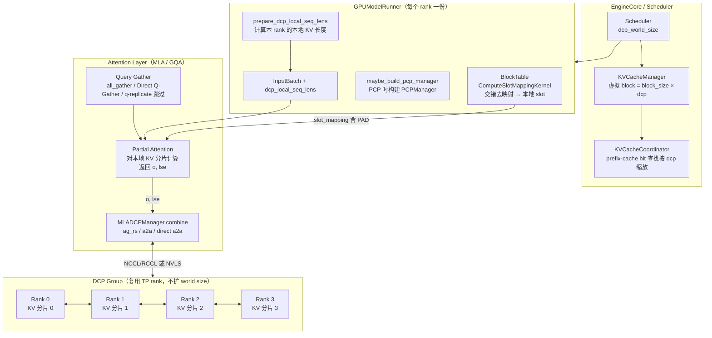
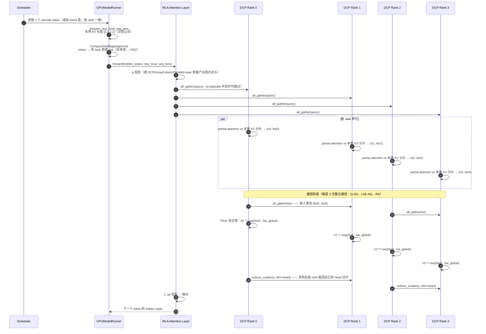
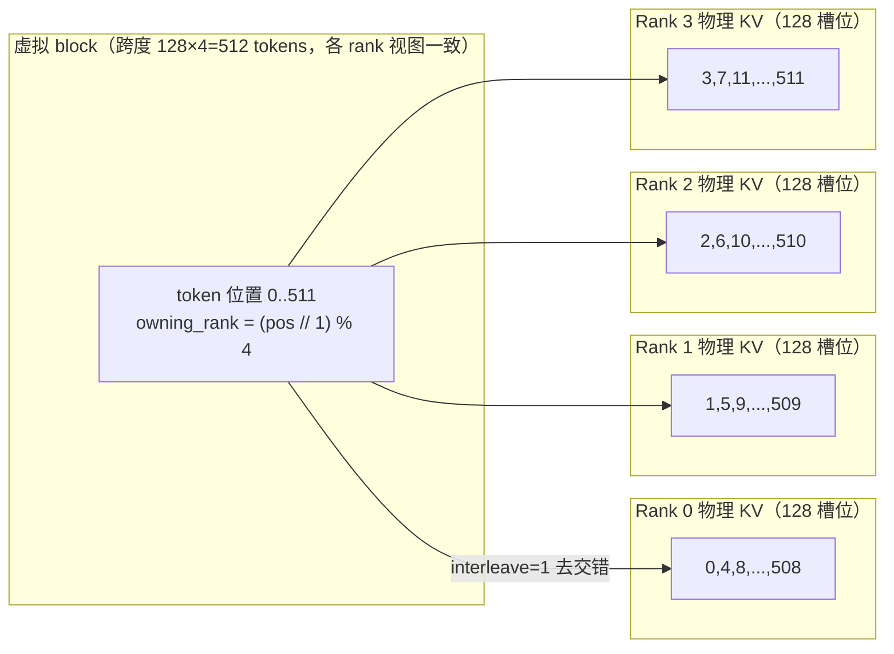
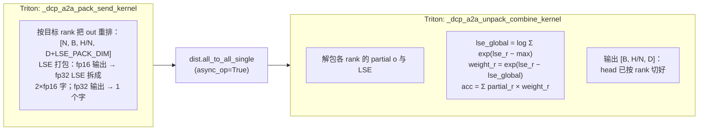
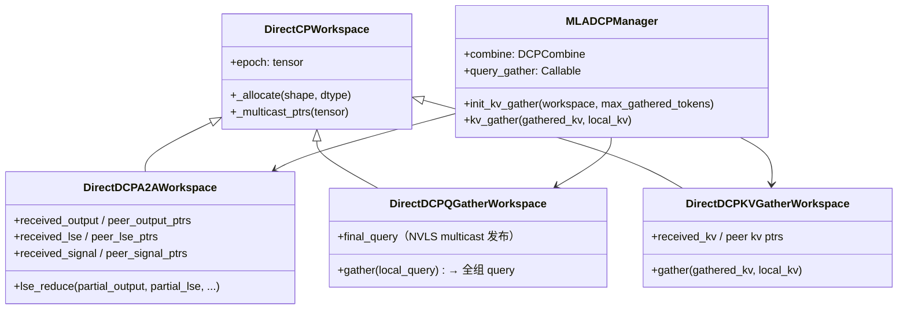
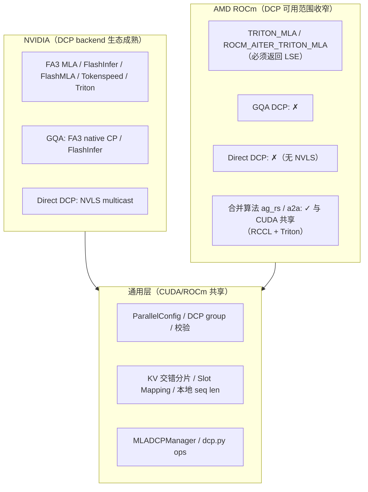

# vLLM DCP（Decode Context Parallelism）特性代码走读技术文档

> **文档版本**: 1.0
> **分析代码版本**: vLLM main 分支（截至 2026-08，commit `2c7d7dd64a` 附近）
> **最后更新**: 2026-08-30

---

## 文档概述

DCP（Decode Context Parallelism，解码上下文并行）是 vLLM V1 中面向**长上下文服务**的核心并行特性：它在 decode 阶段把 KV Cache 沿**序列（Token）维度**分片到多张 GPU 上，从而消除纯 Tensor Parallel（TP）下 KV Cache 的重复存储，大幅提升长上下文、Agentic 负载下的并发数与吞吐。

本文档涵盖以下内容：

- **第一部分**：DCP 的原理、动机（为什么 Agentic 负载尤其需要 DCP）、与 PCP/CP/SP/TP 的辨析、整体架构与 decode 一步的通信流程；
- **第二部分**：配置参数、DCP/PCP Process Group 的创建逻辑与约束校验；
- **第三部分**：核心实现深度走读——KV Cache 交错分片与 Slot Mapping、AG+RS 与 A2A 两种通信算法（含数学推导）、CUDA 上的 Direct Symmetric-Memory 加速、MLA/GQA 模型层的接入、PCP 协同；
- **第四部分**：ROCm（AMD GPU）后端上的 DCP 设计与实现现状；
- **第五部分**：支持的模型矩阵与使用指南；
- **第六部分**：官方 Roadmap 与社区贡献方向；
- **第七部分**：必读论文、博客与关键 PR 资料索引。

**目标读者**：对 vLLM 有基本了解、希望深入理解或扩展 DCP 的推理系统工程师与社区开发者。

**阅读建议**：想快速建立概念读第一部分；做部署调参读第二、五部分；要改代码/写 PR 精读第三、四部分；找贡献方向直接看第六部分。

---

# 第一部分：DCP 基础与架构总览

## 1.1 背景：长上下文 + Agentic Workload 的 KV Cache 困境

### 1.1.1 Agentic 负载的新形态

2025–2026 年，AI 负载的重心从"单轮问答"转向 **Agentic 工作流**：编码 Agent 需要把整个代码仓库塞进上下文，多轮 Agent 需要携带漫长的对话历史与工具调用记录。这类负载的典型特征是（数据来自 vLLM 官方博客使用的公开 Mooncake trace，见 [7.3](#73-数据集与基准)）：

- **输入极长**：中位数约 67K tokens，约 53% 请求超过 64K，尾部可达 1M tokens；
- **输出极短**：中位数输出仅约 400 tokens；
- **多轮、共享前缀**：Agent 在长对话中反复追加短问题，前缀缓存（Prefix Caching）命中率高。

这类负载下，推理成本与内存瓶颈几乎全部集中在 **KV Cache**：

$$\text{KV 总量} = \sum_{\text{请求}} H \times T \times d_{kv} \times 2 \quad (\text{K 与 V})$$

其中 $H$ 为 KV head 数、$T$ 为上下文长度。1M token 的请求，即使是压缩后的 MLA KV，也可能占数十 GB。**KV Cache 容量直接决定了并发数，而并发数直接决定了吞吐与服务成本。**

### 1.1.2 为什么 TP 不够用

传统 Tensor Parallelism 沿 **Head 维**切分 KV Cache——每个 TP rank 持有 $H / tp$ 个 KV head。问题在于 **Head 数是有限的**：

- **GQA 模型**（Llama、Qwen3 等）：KV head 数 $H$ 通常只有 4~8。当 $tp > H$ 时，Head 已经切无可切，KV Cache 开始在多个 rank 上**整份复制**，复制倍数为 $tp / H$；
- **MLA 模型**（DeepSeek-V2/V3/R1、Kimi K2/K2.6/K3 等）：K/V 被压缩成一个低秩 **latent 向量**（$c_{kv}$），所有 query head 共享它——等效于 $H = 1$。纯 TP 下 latent KV Cache 在**每个 TP rank 上完整复制**，TP=8 即 8 倍复制！

以 DeepSeek-R1（TP=8，单机 8 卡）为例：每张 GPU 都存一份完整的 KV Cache。8 张 GPU 的总 KV 容量 = 1 张 GPU 的容量，模型权重已经吃掉大半显存，留给 KV 的空间所剩无几——长上下文下并发数被卡死。

### 1.1.3 DCP 的答案与量化收益

DCP 换个维度切：**沿序列（Token）维把 KV Cache 切成 dcp 份**，每个 rank 只存自己负责的 token 区间的 KV。一份 200K token 的请求在 dcp=4 时，GPU 0/1/2/3 分别持有 token 0–50K / 50K–100K / 100K–150K / 150K–200K 的 KV。每张 GPU 的 KV 占用随 dcp 线性下降，省出的显存全部转化为并发能力。

vLLM 官方博客在 **8×B200 单机、Kimi K2.6（NVFP4）** 上的实测（并发 16→512 扫描）：

| 配置 | 吞吐峰值 | 卡点 |
|------|---------|------|
| 纯 TP（KV 复制） | **1,863 tok/s/GPU**，并发 64 时 KV 占用 100%，触顶 | KV 显存耗尽 |
| TP + DCP（KV 分片） | **6,091 tok/s/GPU** @ 并发 512，KV 占用仅 82% | 尚未触顶 |

> **关键洞察**: DCP 的价值不在单请求延迟，而在**并发上限**——"DCP 让系统在复制式 KV 早已 OOM 的并发区间继续线性扩展"。这正是 Agentic 负载（海量并发长上下文 Agent）最需要的性质。

Helix 论文（DCP 的理论基础，arXiv 2507.07120）的模拟结论同样如此：同等延迟预算下批量规模最高放大 **32×**（DeepSeek-R1），固定批量下 TTFT/TTL 最多降低 **1.5×**。

## 1.2 并行范式辨析：TP / SP / CP / PCP / DCP

DCP 只是"并行宇宙"的一员。用一张表把容易混淆的概念彻底区分开：

| 维度 | TP（Tensor Parallel） | SP（Sequence Parallel） | CP（Context Parallel，广义） | PCP（Prefill CP） | **DCP（Decode CP）** |
|------|----------------------|------------------------|------------------------------|-------------------|----------------------|
| 切分对象 | 权重/激活，按 **Head/隐藏维** | 激活，按 **序列维**（非注意力部分） | 注意力计算，按**序列维** | 注意力计算，按**序列维** | **KV Cache**，按**序列维** |
| 作用阶段 | Prefill + Decode | Prefill（主要） | Prefill + Decode | 仅 Prefill | 仅 Decode |
| 解决什么问题 | 单卡放不下权重/算力不够 | 消除 TP 下 LayerNorm/FFN 的冗余计算与显存 | 长序列注意力算不完/放不下 | 长 Prompt 的 **TTFT 过高** | 长上下文 Decode 的 **KV 复制导致并发上不去** |
| 是否扩大 world size | 是 | 否（复用 TP rank） | 是 | 是（vLLM PCP 扩展 world size） | **否（复用 TP rank）** |
| KV Cache 布局 | Head 切分（可能复制） | 不涉及 | 序列切分 | 序列切分（临时） | **序列切分（交错存储，持久）** |
| vLLM 入口 | `tensor_parallel_size` | `use_sequence_parallel_moe` / torch.compile 自动 SP pass | `prefill_context_parallel_size` + `decode_context_parallel_size` | `--prefill-context-parallel-size` | `--decode-context-parallel-size` |

几个要点展开：

1. **CP 是"伞"概念**：广义 Context Parallel = 把序列维切开做注意力，是 Ring Attention（arXiv 2310.01889）一脉的并行范式。vLLM V1 把它拆成 prefill 与 decode 两个阶段分别设计（SLO 不同：prefill 要控 TTFT，decode 要扩并发），即 PCP 与 DCP。vLLM 文档页 `docs/serving/context_parallel_deployment.md` 正是这样组织的。

2. **SP 在 vLLM 中有两种形态**，注意与 Megatron 经典 SP 区分：
   - **MoE 的 Sequence Parallel**（`ParallelConfig.use_sequence_parallel_moe`，`vllm/config/parallel.py:704`）：启用 EP 时，attention 输出在 TP 组内 replicated，若直接进专家层会重复计算。SP-MoE 把 token 沿序列维分给各 rank，每个 rank 只算自己那部分 token 的 FFN/专家路由，消除重复计算；
   - **torch.compile 自动 SP pass**（`vllm/compilation/passes/fusion/sequence_parallelism.py`）：长 prefill 时编译期自动在部分层插入序列维切分，仅大 hidden_size 模型且 token 数超阈值时触发（`sp_min_token_num`）。
   - 两者都不切 KV Cache——与 DCP 正交。

3. **PCP 与 DCP 是一对"孪生"设计**：
   - PCP（`prefill_context_parallel_size`）：把一条长 prompt 的 query 分块给多个 rank 并行算 prefill 注意力，摊薄 TTFT；decode 时所有 rank 都持有全部 KV（或按 DCP 布局），PCP rank 在 decode 阶段做全复制执行；
   - DCP（`decode_context_parallel_size`）：decode 时 KV 按序列分片，prefill 阶段每个 rank 写自己负责的 token；
   - 二者**可以组合**：`vllm/config/parallel.py:545-560` 的校验规定 PCP 开启时 DCP 只能取 `{1, pcp, tp×pcp}` 三种值（详见 2.3）。

4. **DCP 不扩大 world size**——这是它和 CP/PCP 最本质的工程差异。`decode_context_parallel_size` 的 docstring 写得非常直白：

```python
# 文件: vllm/config/parallel.py:349-352
decode_context_parallel_size: int = Field(default=1, ge=1)
"""Number of ranks that shard the decode KV cache. DCP does not expand
the process world size. Without PCP, DCP reuses TP ranks. With PCP, DCP
either spans the PCP axis or the full TP x PCP block."""
```

## 1.3 DCP 的核心思想：KV Cache 交错分片

### 1.3.1 基本思想

decode 每步只产生 1 个 query token，却要读整份 KV Cache——这是典型的 **memory-bound** 场景。DCP 把"读 KV"这个动作并行化：

- 每个 DCP rank 只存储/读取序列中**自己负责的 token 区间**的 KV；
- 每个 rank 独立计算 query 对自己局部 KV 分片的 **partial attention**（partial output + partial LSE）；
- 通过一次跨 rank 通信把 partial 结果**精确合并**成真实 attention 输出（LSE 加权，数学上无损）；
- 非注意力层（FFN/专家）保持原 TP 布局不动——反正 decode 时它们算的 token 数相同，与 DCP 无关。

### 1.3.2 为什么用交错（Interleave）而非连续切块

如果按连续区间切（rank 0 存 token 0–50K），KV Cache 是**动态增长**的：新 token 只会追加到最后一个 rank，导致负载不均、且每步都要决定"新 token 归谁"。vLLM 采用 **Round-Robin 交错（interleaved）存储**：token $i$ 存在 `dcp_rank = (i / interleave) % dcp_size` 上（`interleave` 为交错粒度，见 `cp_kv_cache_interleave_size`）。这样：

- 新 token 自然落到"轮到的下一个 rank"，负载天然均衡；
- 每个 rank 的本地 KV 长度有闭式公式（见 3.1.2），无需动态协商；
- 该策略由 Moonshot 的 Chao Hong 提出，详见 Helix 论文（arXiv 2507.07120）。

以 `seq_len=10, dcp=4, interleave=1` 为例：

```text
token 位置:  0  1  2  3  4  5  6  7  8  9
所属 rank:   R0 R1 R2 R3 R0 R1 R2 R3 R0 R1
```

`interleave = block_size`（如 128）时退化为 **block 级交错**：先填满 rank 0 的第 j 个 block，再填 rank 1 的第 j 个 block……block 级交错对 KV Connector（P/D 分离、KV 卸载）更友好——跨机传输按整 block 对齐。

### 1.3.3 与 TP 的关系：dcp 的上界

DCP 复用的是 TP rank，所以 dcp 不能超过"TP 下 KV 的复制倍数"，否则多出来的 rank 在非注意力层无事可做。对 $H$ 个 KV head 的模型，TP 复制倍数为 $tp / H$，因此 **$dcp \in [1, tp/H]$**（`docs/serving/context_parallel_deployment.md:29` 有完整论证）。想要更大的并行度，先加 TP 再加 DCP。

## 1.4 vLLM DCP 整体架构



**核心组件与职责**：

| 组件 | 文件 | DCP 相关职责 |
|------|------|-------------|
| `ParallelConfig` | `vllm/config/parallel.py` | `decode_context_parallel_size`、`dcp_comm_backend`、`dcp_q_replicate`、`cp_kv_cache_interleave_size` 及校验 |
| Process Group | `vllm/distributed/parallel_state.py` | 创建 `_DCP`/`_PCP` group，`get_dcp_group()`/`get_pcp_group()` |
| KV 规格解析 | `vllm/v1/core/kv_cache_utils.py` | `resolve_dcp_kv_cache_spec`：attention 层的虚拟 block 放大 dcp 倍 |
| KV 分配 | `vllm/v1/core/kv_cache_manager.py`、`kv_cache_coordinator.py` | 按 dcp 缩放 block 分配与 prefix-cache hit 查找 |
| Slot Mapping | `vllm/v1/worker/block_table.py` | Triton kernel 把 token 位置去交错映射到本 rank 的物理 slot |
| 本地 seq len | `vllm/v1/attention/backends/utils.py` | `get_dcp_local_seq_lens`：round-robin 闭式公式 |
| DCP 通信 ops | `vllm/v1/attention/ops/dcp.py` | AG+RS、A2A、Direct A2A/Q-Gather/KV-Gather、`MLADCPManager` |
| MLA 模型层 | `vllm/model_executor/layers/attention/mla_attention.py` | decode 流程编排：q gather → partial attn → combine |
| PCP 管理 | `vllm/v1/worker/gpu/pcp_manager.py` | PCP 下 batch 划分、KV 写入掩码、hidden state 恢复 |
| 兼容性检查 | `vllm/v1/worker/cp_utils.py` | `check_attention_cp_compatibility`：backend 必须能返回 LSE |

## 1.5 Decode 一步的执行流程与通信过程

以 **MLA 模型、默认 AG+RS 后端**为例，一个 decode token 从 query 到 output 的完整旅程：



数学上，合并过程就是 FlashAttention 的 **online softmax 归约**（LSE 即 log-sum-exp）：

每个 rank $r$ 对本地分片算出 partial output $o_r$ 与 $lse_r = \log \sum_{i \in S_r} e^{q \cdot k_i / \sqrt{d}}$，则：

$$
lse_{global} = \log \sum_{r} e^{lse_r} \quad (\text{base-}e, \text{或用 } \exp_2/\log_2)
$$

$$
o_{final} = \sum_r o_r \cdot e^{lse_r - lse_{global}}
$$

两步合并分别在 `_correct_attn_cp_out_kernel`（乘校正因子）和 `reduce_scatter`（跨 rank 求和并按 head 切回）中完成，**数学上与单卡全量 attention 完全一致**（浮点舍入差异除外）。

---

# 第二部分：配置与进程组

## 2.1 关键配置参数

| 参数 | 默认值 | 含义 |
|------|--------|------|
| `--decode-context-parallel-size` | 1 | DCP group 大小。**不增加 world size**，复用 TP rank（无 PCP 时） |
| `--dcp-comm-backend` | 模型默认（`ag_rs`） | decode 结果合并算法：`ag_rs` = AllGather LSE + ReduceScatter；`a2a` = All-to-All + Triton 合并（MLA 下每层 NCCL 调用从 3 次降到 2 次） |
| `--dcp-q-replicate` | 模型默认 | MLA 的 query 投影在每个 DCP 组内复制，decode 跳过 query all-gather（代价：组内冗余计算投影） |
| `--cp-kv-cache-interleave-size` | 1 | KV 交错粒度：1 = token 级；`block_size` = block 级。KV 传输场景（P/D、卸载）建议设为 block_size |
| `--prefill-context-parallel-size` | 1 | PCP：prefill 序列计算分片 rank 数。**会扩大 world size**；与 DCP 组合时 dcp ∈ {1, pcp, tp×pcp} |
| 环境变量 `VLLM_DCP_Q_REPLICATE` | 未设置 | 旧入口，显式设置时优先于 `--dcp-q-replicate`（见 `deepseek_v2.py:1058-1062`） |
| 环境变量 `VLLM_USE_DIRECT_DCP_A2A` / `_Q_GATHER` / `_KV_GATHER` | 未设置 | 启用 CUDA/NVLS 的 Direct Symmetric-Memory 路径（详见 3.4） |

```python
# 文件: vllm/config/parallel.py:361-370（dcp_comm_backend 的完整语义）
dcp_comm_backend: DCPCommBackend | None = None
"""Communication backend for Decode Context Parallel (DCP).
- "ag_rs": AllGather + ReduceScatter (existing behavior)
- "a2a": All-to-All exchange of partial outputs + LSE, then
  combine with Triton kernel. Reduces NCCL calls from 3 to 2
  per layer for MLA models.

`None` selects the model default, which is "ag_rs" unless the model
overrides it via [`set_dcp_defaults`][vllm.config.ParallelConfig.set_dcp_defaults].
"""
```

模型可以在 `verify_and_update_config` 钩子里设置自己的 DCP 偏好：

```python
# 文件: vllm/model_executor/models/config.py:43-50
class GlmMoeDsaForCausalLM(VerifyAndUpdateConfig):
    @staticmethod
    def verify_and_update_config(vllm_config: "VllmConfig") -> None:
        # For Glm-Moe-DSA, qrep + a2a is better than the default all-gather + ag-rs
        # in most cases.
        vllm_config.parallel_config.set_dcp_defaults(
            comm_backend="a2a", q_replicate=True
        )
```

## 2.2 DCP/PCP Process Group 的创建

DCP 组在 `initialize_model_parallel` 中构建，rank 布局为 `[DP, PP, PCP, TP]`：

```python
# 文件: vllm/distributed/parallel_state.py:1826-1867（节选）
all_ranks = torch.arange(world_size).reshape(
    -1,
    data_parallel_size,
    pipeline_model_parallel_size,
    prefill_context_model_parallel_size,
    tensor_model_parallel_size,
)

# ... TP group 创建 ...

# Build the DCP model-parallel groups.
global _DCP
assert _DCP is None, "decode context model parallel group is already initialized"
dcp_size = decode_context_model_parallel_size or 1
dcp_ranks = local_all_ranks if enable_elastic_ep else all_ranks
if dcp_size > 1:
    # DCP spans PCP first, then TP for full TP x PCP groups.
    dcp_ranks = dcp_ranks.transpose(-1, -2)
group_ranks = dcp_ranks.reshape(-1, dcp_size).unbind(0)
group_ranks = [x.tolist() for x in group_ranks]
_DCP = init_model_parallel_group(
    group_ranks,
    get_world_group().local_rank,
    backend,
    use_message_queue_broadcaster=True,
    group_name="dcp",
)
```

要点：

1. **`transpose(-1, -2)` 后 reshape**：把 `[..., PCP, TP]` 变成 `[..., TP, PCP]` 再按 `dcp_size` 分组——"DCP 先跨 PCP 轴、再跨 TP 轴"。无 PCP 时 PCP 维为 1，DCP 组自然落在 TP 轴内；
2. **`use_message_queue_broadcaster=True`**：DCP 组与 TP 组一样使用 message-queue broadcaster（NCCL 组的广播优化）；
3. PCP group 单独创建（`all_ranks.transpose(3,4).reshape(-1, pcp_size)`，即 PCP 组横跨 TP 维内部），通过 `get_pcp_group()` 获取；
4. 访问入口：`get_dcp_group()`（`parallel_state.py:1394-1399`），底层 backend 是 NCCL（CUDA）/ RCCL（ROCm）——DCP 组就是一个普通的 torch 进程组，通信后端与 TP 一致。

## 2.3 配置校验与约束

```python
# 文件: vllm/config/parallel.py:545-560（model_validator）
tp = self.tensor_parallel_size
pcp = self.prefill_context_parallel_size
dcp = self.decode_context_parallel_size
if pcp > 1 and self.data_parallel_size > 1:
    raise ValueError("PCP does not support data parallelism yet.")
if pcp == 1:
    # DCP reuses the TP ranks when PCP is disabled.
    if tp % dcp != 0:
        raise ValueError(f"tp_size={tp} must be divisible by dcp_size={dcp}.")
elif dcp not in (1, pcp, tp * pcp):
    raise ValueError(
        "When PCP is enabled, DCP must be disabled, span the PCP "
        "axis, or span the full TP x PCP axis. "
        f"Got TP={tp}, PCP={pcp}, DCP={dcp}; valid DCP sizes are "
        f"{sorted({1, pcp, tp * pcp})}."
    )
```

| 场景 | 约束 | 示例 |
|------|------|------|
| 纯 DCP（无 PCP） | `tp % dcp == 0`；且受 backend 能力约束（见下） | DeepSeek-R1: `tp=8, dcp=8` ✓ |
| MLA 模型 | `tp >= dcp` 且 `tp % dcp == 0`（官方博客口径） | Kimi K2.6: `tp=16, dcp=16` 或 `dcp=8` |
| GQA 模型 | `(tp // num_kv_heads) >= dcp` 且 `(tp // num_kv_heads) % dcp == 0` | Qwen3-235B（4 KV heads）: `tp=8, dcp=2` ✓，`dcp=4` ✗ |
| PCP + DCP | `dcp ∈ {1, pcp, tp×pcp}`；PCP 暂不支持 DP | `tp=8, pcp=2, dcp=2` 或 `dcp=16` |
| Backend 能力 | `check_attention_cp_compatibility`：DCP 要求 attention impl 的 `need_to_return_lse_for_decode` 为 True（见 3.5） | AiterMLABackend ✗；TRITON_MLA ✓ |

---

# 第三部分：核心实现深度分析

## 3.1 KV Cache 交错分片与 Slot Mapping

### 3.1.1 虚拟 Block 放大

DCP 下每个 rank 的物理 KV 张量**大小不变**（`bytes_per_block` 不变），但调度器的"逻辑 block"覆盖 `block_size × dcp` 个 token——其中每个 rank 只存 `block_size` 个槽位：

```python
# 文件: vllm/v1/core/kv_cache_utils.py:651-675（节选）
def resolve_dcp_kv_block_size(spec: KVCacheSpec, dcp_world_size: int) -> int:
    """Return the token span of a cache block under DCP."""
    layer_specs = iter_layer_specs(spec)
    if len(layer_specs) > 0 and all(
        isinstance(layer_spec, AttentionSpec) for layer_spec in layer_specs
    ):
        return spec.block_size * dcp_world_size
    return spec.block_size
```

- **纯 attention 组**：block 跨度放大 dcp 倍；**混合组**（如 Mamba + attention，见 `#49964`）不放大非 attention 层——`resolve_kv_cache_block_sizes` 对多组取 LCM；
- 所有 rank 的 block 编号、block hash、prefix-cache 命中结果**完全一致**（hash 基于完整虚拟 block 的 token 序列），KVCacheCoordinator 把 `dcp_world_size` 传下去做缩放（`vllm/v1/core/kv_cache_coordinator.py:510-513` 放大 `self.block_size`；`:838-851` hit 查找对齐）。

### 3.1.2 交错布局与本地序列长度

token → rank 的映射是纯函数：`owning_rank = (pos // interleave) % dcp_size`。每个 rank 的本地 KV 长度由闭式公式得出：

```python
# 文件: vllm/v1/attention/backends/utils.py:1091-1128（节选）
def get_dcp_local_seq_lens(
    seq_lens: torch.Tensor,
    dcp_size: int = 1,
    dcp_rank: int | None = None,
    cp_kv_cache_interleave_size: int = 1,
) -> torch.Tensor:
    """While using dcp, kv_cache size stored on each rank may be different,
    use this function to calculate split decode seq_lens of each dcp rank."""
    seq_lens_i32 = seq_lens.to(torch.int32)
    if dcp_rank is None:
        rank_offsets = torch.arange(dcp_size, dtype=torch.int32,
                                    device=seq_lens.device).view(
            *((1,) * seq_lens_i32.dim()), dcp_size)
        seq_lens_tiled = seq_lens_i32.unsqueeze(-1)
    else:
        rank_offsets = torch.tensor(dcp_rank, dtype=torch.int32,
                                    device=seq_lens.device)
        seq_lens_tiled = seq_lens_i32
    base = (seq_lens_tiled // cp_kv_cache_interleave_size
            // dcp_size * cp_kv_cache_interleave_size)
    remainder = seq_lens_tiled - base * dcp_size
    remainder = torch.clip(
        remainder - rank_offsets * cp_kv_cache_interleave_size,
        0, cp_kv_cache_interleave_size)
    dcp_local_seq_lens = base + remainder
    return dcp_local_seq_lens
```

数值示例（`seq_len=10, dcp=4, interleave=1`）：

| rank | base | remainder | 本地长度 | 持有的 token 位置 |
|------|------|-----------|---------|------------------|
| 0 | 2 | 1 | **3** | 0, 4, 8 |
| 1 | 2 | 1 | **3** | 1, 5, 9 |
| 2 | 2 | 0 | **2** | 2, 6 |
| 3 | 2 | 0 | **2** | 3, 7 |

GPU 侧有 Triton 版本 `_dcp_local_seq_lens_kernel`（`vllm/v1/worker/gpu/cp_utils.py:36-61`），供 CUDA graph capture 使用；结果随 `InputBatch` 传入 attention metadata。

### 3.1.3 Slot Mapping Kernel：位置 → 本地物理槽位

`ComputeSlotMappingKernel`（`vllm/v1/worker/block_table.py:400-529`）在每步把每个 token 的全局位置映射为本 rank 的物理 slot，非本地 token 映射为 `PAD_SLOT_ID`：

```python
# 文件: vllm/v1/worker/block_table.py:445-474（kernel 内核心逻辑，节选）
virtual_block_size = KV_CACHE_BLOCK_SIZE * TOTAL_CP_WORLD_SIZE
row_offset = req_idx * block_table_stride
for i in range(start_idx, end_idx, BLOCK_SIZE):
    offsets = i + tl.arange(0, BLOCK_SIZE)
    mask = offsets < end_idx
    pos = tl.load(positions_ptr + offsets, mask=mask, other=0)
    virtual_block_indices = pos // virtual_block_size
    virtual_block_offsets = pos - virtual_block_indices * virtual_block_size
    is_local = (
        virtual_block_offsets // CP_KV_CACHE_INTERLEAVE_SIZE
    ) % TOTAL_CP_WORLD_SIZE == TOTAL_CP_RANK
    local_block_offsets = (
        virtual_block_offsets
        // (TOTAL_CP_WORLD_SIZE * CP_KV_CACHE_INTERLEAVE_SIZE)
    ) * CP_KV_CACHE_INTERLEAVE_SIZE + (
        virtual_block_offsets % CP_KV_CACHE_INTERLEAVE_SIZE
    )

    block_indices = (
        virtual_block_indices * BLOCKS_PER_KV_BLOCK
        + local_block_offsets // block_size
    )
    block_numbers = tl.load(
        block_table_ptr + row_offset + block_indices,
        mask=mask & is_local,
        other=0,
    ).to(tl.int64)
    slot_offsets = local_block_offsets % block_size
    slot_ids = block_numbers * block_size + slot_offsets
    slot_ids = tl.where(is_local, slot_ids, PAD_ID)
    tl.store(slot_mapping_ptr + offsets, slot_ids, mask=mask)
```

这正是 interleave 公式的 kernel 化：`is_local` 判定 token 是否归本 rank，`local_block_offsets` 把交错位置"压实"成本地连续布局，再叠加 block_table 查出物理 block 号。attention kernel 只对非 PAD 槽位读写 KV，从而实现"每个 rank 只碰自己的 KV 分片"。



## 3.2 通信算法一：AllGather + ReduceScatter（`ag_rs`，默认）

`cp_lse_ag_out_rs`（`vllm/v1/attention/ops/dcp.py:275-305`）实现三步合并：

```python
# 文件: vllm/v1/attention/ops/dcp.py:275-305
def cp_lse_ag_out_rs(
    cp_attn_out: torch.Tensor,      # [B, H, D] 本 rank 的 partial output
    cp_attn_lse: torch.Tensor,      # [B, H] 本 rank 的 partial LSE
    cp_group: GroupCoordinator,
    ...
):
    out, lse = _cp_lse_common(
        cp_attn_out, cp_attn_lse, cp_group, ctx=ctx,
        is_lse_base_on_e=is_lse_base_on_e,
        seq_lens=seq_lens, query_start_loc=query_start_loc,
    )
    out = cp_group.reduce_scatter(out, dim=1)
    if return_lse:
        cp_num_heads = lse.shape[1] // cp_group.world_size
        cp_rank = cp_group.rank_in_group
        lse = lse[:, cp_num_heads * cp_rank : cp_num_heads * (cp_rank + 1)]
        return out, lse
    return out
```

1. **`_cp_lse_common`**：先 `mask_dcp_empty_shards_` 把空分片（无本地 KV 的请求）的 LSE 置 `-inf`（否则空分片的 LSE=0 会污染合并）；然后 `all_gather` 所有 rank 的 LSE（形状 `[N, B, H]`）；再调 Triton kernel `_correct_attn_cp_out_kernel`（`dcp.py:68-154`）：
   - 数值稳定：`lse_max = max(lse)`；`lse_global = log(Σ exp(lse − lse_max)) + lse_max`；
   - 校正：`out *= exp(lse_local − lse_global)`；
2. **`reduce_scatter(out, dim=1)`**：沿 head 维求和并把结果**按 head 切回各 rank**——因为模型 head 原本就是 TP 切分的，DCP 合并后每个 rank 只需要自己那份 head 的输出继续算 `o_proj`。

> **关键洞察**: AG+RS 下 `H % dcp == 0` 是硬约束——reduce_scatter 沿 head 维切，head 数必须能被 DCP 组大小整除。这也是 DCP 受 `tp/H` 上界约束的底层原因之一（每个 rank 在 TP 下只有 `H/tp` 个 head，DCP 组内必须有整数个 head 可切）。

PCP 组合场景改用 `cp_lse_ag_out_ar`（`dcp.py:308-335`）：合并后 `all_reduce` 而不是 reduce_scatter——PCP 下每个 rank 需要完整的输出用于后续 all_gather 恢复全局 batch。

## 3.3 通信算法二：All-to-All（`a2a`）

`dcp_a2a_lse_reduce`（`dcp.py:704-776`）用**一次 All-to-All 同时完成"LSE 归约 + 输出合并 + head 切分"**，把 MLA 每层的集合通信从 3 次降到 2 次（省掉 LSE-AG 和 RS）：



实现细节（均为 `dcp.py` 内）：

- **打包**（`_dcp_a2a_pack_send_kernel`，`:440-500`）：每个 rank 把"属于目标 rank 的 head 切片 + 对应 LSE"写进 send buffer。LSE 打包宽度由输出 dtype 决定（`_dcp_a2a_lse_pack_dim`，`:410-416`）：fp16/bf16 输出时把 fp32 LSE 的 bits 拆成 lo/hi 两个 fp16 字；fp32 输出时占 1 个字——**零额外字节开销**；
- **交换**：`dist.all_to_all_single(recv.view(-1), send.view(-1), group=cp_group.device_group, async_op=True)`——每 rank 收到"别人算好的、属于我的 head 切片的部分结果"；
- **合并**（`_dcp_a2a_unpack_combine_kernel`，`:503-625`）：解包 → 求 `lse_global` → 按权重 `exp(lse_r − lse_global)` 加权求和。与 AG+RS 数学等价，但合并直接在目标 rank 上完成，**不需要 reduce_scatter**。

两个工程坑（代码注释即教材）：

1. **CUDA graph 与 buffer 生命周期**（`_dcp_a2a_send_recv_buffers`，`:419-437`）：不能用可增长的 WorkspaceManager 分配 send/recv buffer——full cudagraph 会把地址烘焙进图里，eager 大 batch 触发 workspace 扩容后旧地址失效，回放即 IMA（非法内存访问）。改用 `torch.empty` 让 buffer 落在图的私有内存池；
2. **LSE 基数统一**（`is_lse_base_on_e`）：不同 attention backend 的 LSE 可能以 e 或 2 为底，合并 kernel 必须与 backend 一致，否则产生静默精度错误（历史 bug 见 `#47079`、`#47801`）。

`MLADCPManager._init_combine`（`dcp.py:1263-1301`）的选路逻辑：

```python
# 文件: vllm/v1/attention/ops/dcp.py:1263-1301（节选）
def _init_combine(self, num_heads, head_dim, dtype, is_lse_base_on_e, use_pcp):
    direct_workspace = None
    if self.use_a2a:
        direct_workspace = get_direct_dcp_a2a_workspace(
            self.group, self.device, self.max_num_tokens,
            num_heads, head_dim, dtype, self.num_ubatches)
    if direct_workspace is not None:
        logger.info_once("Using direct symmetric-memory DCP A2A for MLA.")
        return functools.partial(self._direct_workspace_combine,
                                 direct_workspace, is_lse_base_on_e=...)
    combine_fn = (dcp_a2a_lse_reduce if self.use_a2a
                  else cp_lse_ag_out_ar if use_pcp
                  else cp_lse_ag_out_rs)
    return functools.partial(combine_fn, cp_group=self.group,
                             is_lse_base_on_e=is_lse_base_on_e)
```

优先 direct A2A → 否则 a2a / ag_rs（PCP 时 ag_ar）。

## 3.4 Direct Symmetric-Memory DCP（CUDA/NVLS 专属）

NCCL 集合通信有 kernel 启动与同步开销。CUDA 上 vLLM 提供 **Direct DCP**：利用 NVLink SHARP / CUDA Multicast（NVLS symmetric memory）让各 rank 直接写对端内存 + 轻量 signal 同步，把通信延迟压到最低。三组实现（C++ 在 `csrc/libtorch_stable/attention/dcp_utils/`，Python workspace 在 `dcp.py:812-1203`）：



- **Direct A2A**（`torch.ops._C.direct_dcp_a2a_lse_reduce`，`dcp.py:879`）：对端写 partial output + LSE + signal，本 rank 轮询 signal 后直接合并——无 NCCL 调用；
- **Direct Q-Gather**（`direct_dcp_q_gather`，`dcp.py:1043`）：用 **NVLS multicast** 一次写广播 query 到全组 buffer（要求 16 字节对齐的 query 行，`_q_gather_layout_supported`）；
- **Direct KV-Gather**（`direct_dcp_kv_gather`，`dcp.py:1163`）：chunked-context 场景下用 multicast 汇聚各 rank 的 KV 分片。

三个 workspace 的 `__init__` 里都有 `assert` 级检查：**不满足 NVLS multicast 直接抛异常**（如 `dcp.py:1011-1016`），启用条件统一走 `direct_cp_enabled`/`direct_cp_multicast_enabled`（`vllm/v1/attention/ops/cp_common.py`）——**它们都要求 `current_platform.is_cuda()`，ROCm 上不可用**（详见 4.4）。此外 direct path 的 buffer 容量有限（`max_num_tokens`），超限时 `_direct_workspace_combine` 自动回退 NCCL A2A（`dcp.py:1303-1330`）。

## 3.5 MLA 模型层的 DCP 接入（含 q-replicate）

MLA（Multi-head Latent Attention）是 DCP 的"主场"（等效 1 个 KV head，TP 全复制）。decode 流程编排在 `mla_attention.py:954-1000`：

```python
# 文件: vllm/model_executor/layers/attention/mla_attention.py:954-999（节选，重排注释）
# 1) query 投影 + 组内汇聚
if self.impl.dcp_world_size > 1:
    assert self.dcp_manager is not None
    if self.use_pcp:
        if self.impl.dcp_world_size > self.impl.pcp_world_size:
            if isinstance(mqa_q, tuple):
                mqa_q = torch.cat(mqa_q, dim=-1)
            mqa_q = get_tp_group().all_gather(mqa_q, dim=1)
    else:
        if isinstance(mqa_q, tuple):
            mqa_q = torch.cat(mqa_q, dim=-1)
        if not qrep_decode:
            assert self.dcp_manager.query_gather is not None
            mqa_q = self.dcp_manager.query_gather(mqa_q)

# 2) 对本地 KV 分片做 partial attention（返回 partial o 与 LSE）
attn_out, lse = self.impl.forward_mqa(mqa_q, kv_cache, attn_metadata, self)

# 3) LSE 合并
if self.impl.dcp_world_size > 1:
    assert lse is not None
    assert self.dcp_manager is not None
    ...
    attn_out = self.dcp_manager.combine(
        attn_out, lse,
        seq_lens=seq_lens, query_start_loc=query_start_loc)
    if self.use_pcp:
        attn_out = finalize_mla_pcp_decode(attn_out, self.num_heads)

# 4) v_up 投影
self._v_up_proj(attn_out, out=mqa_output_slice)
```

**Query Gather 的三种形态**：

1. **all_gather**（默认）：每个 rank 投影出组内的 head 切片，再 `all_gather` 拼出全组 head 集。decode 时 query 只有 1 个 token，通信量极小；
2. **q-replicate（`dcp_q_replicate` / `VLLM_DCP_Q_REPLICATE`）**：用 `DCPGroupColumnParallelLinear`（`vllm/model_executor/layers/linear.py:611`）替代 `ColumnParallelLinear` 做 q 投影——权重按 **DCP 组**（而非每个 rank）切分，组内每个 rank 直接算出**全组 head 集**，decode 完全跳过 query all-gather。代价是组内冗余投影计算（query 投影很小，通常划算）。由 PR #45964 引入，DeepSeek-V2/R1 + Kimi K2.5 与 GLM-MoE（默认开启）受益；
3. **Direct Q-Gather**（CUDA/NVLS）：见 3.4。

```python
# 文件: vllm/model_executor/models/deepseek_v2.py:1057-1067（节选）
# The env var predates the config field and still wins if set explicitly.
qrep_requested = (
    envs.VLLM_DCP_Q_REPLICATE
    if envs.is_set("VLLM_DCP_Q_REPLICATE")
    else bool(vllm_config.parallel_config.dcp_q_replicate)
)
qrep_enabled = (
    qrep_requested
    and vllm_config.parallel_config.decode_context_parallel_size > 1
    and vllm_config.parallel_config.prefill_context_parallel_size <= 1
)
q_proj_cls = (
    DCPGroupColumnParallelLinear if qrep_enabled else ColumnParallelLinear
)
```

**Backend 硬性要求——必须返回 LSE**。启动时的兼容性检查：

```python
# 文件: vllm/v1/worker/cp_utils.py:45-52（check_attention_cp_compatibility 内）
if dcp_size > 1:
    assert layer_impl.need_to_return_lse_for_decode, (
        "Decode Context Parallelism (DCP) requires attention "
        "implementations to return the softmax LSE during decode, "
        f"but {layer_impl.__class__.__name__} does not. "
        "Try a different backend by setting "
        "--attention-backend or disable DCP."
    )
```

这是 DCP 生态的"入口关卡"：任何 backend 想支持 DCP，decode kernel 必须额外输出 softmax 的 log-sum-exp。FlashAttention-3 原生支持（`flashattn_mla.py:338-362` 把 `cp_world_size/cp_rank/cp_tot_seqused_k` 直接透传给 FA3 的 CP 模式）；FlashInfer MLA（#43729）与原生 CP（#54012）、FlashMLA（#46514 稀疏路径）、Tokenspeed MLA（#48180，含 DCP+EAGLE）均已支持。

## 3.6 GQA 模型的 DCP 路径

GQA（如 Qwen3-235B-A22B、Llama 系）的 DCP 思路相同但多一步 **head 广播**：

- TP 先把 KV head 切到每 rank 1 个；`tp/H > 1` 产生的副本 rank 组成 DCP 组，各自存**不同的序列区间**；
- decode 时，每个 KV head 的分片要先 `tensor_broadcast` 给共享它的 query head，再按 DCP 流程做 partial attention + LSE 合并；
- CUDA 上由 **FA3 原生 CP 模式**承接（`vllm/v1/attention/backends/flash_attn.py:941-1056` 的 `_forward_with_dcp` 路径），FlashInfer 亦有 DCP 支持（`flashinfer.py:747`）；
- 约束：`(tp // H) >= dcp` 且 `(tp // H) % dcp == 0`。

另外 vLLM 为 **hybrid 模型**（attention 层与线性注意力/Mamba 层混合，如 GatedDeltaNet 系）实现了 FA2 的 split-context DCP 路径（PR #40996，`vllm/v1/worker/cp_utils.py:171-290`：`split_dcp_context_queries`、`run_split_fa2_dcp_context_attention` 等），decode 时把"上下文 attention"与"新 token attention"拆分处理以兼容 DCP 分片。

## 3.7 PCP 与 DCP 的协同

PCP（`vllm/v1/worker/gpu/pcp_manager.py`）与 DCP 可以同开（约束见 2.3）。`PCPManager` 的关键职责：

- **`partition_batch`**：把全局 InputBatch 重写为 rank-local batch——每个 PCP rank 只算 prefill 序列的一部分 chunk（2×PCP 交错分块，`:196-230`），decode token 则复制到所有 rank；
- **`prepare_attn` / `gathered_kv_write_mask`**：保证 prefill 写入的 KV 只有 rank 0 执行（`:315-318`），其他 rank 从 all_gather 恢复；
- **`restore_hidden_states`**：prefill 后 `get_pcp_group().all_gather` + `hidden_restore_idx` 恢复全局顺序（`:653-657`）；
- **DCP 联动**：构造时接收 `dcp_world_size/dcp_rank/cp_interleave`（`:56-65`），partition 时调 `prepare_dcp_local_seq_lens`（`:540-550`）保证 decode 在 DCP 分片上正确执行。

MLA decode 在 PCP+DCP 下的合并走 `cp_lse_ag_out_ar`（all_reduce 变体），最后 `finalize_mla_pcp_decode`（`vllm/v1/attention/ops/pcp.py:83`）恢复输出布局。

---

# 第四部分：ROCm 后端上的 DCP

## 4.1 总览：通用层与后端层的分工

ROCm 上 DCP 的设计哲学是**最大化复用通用层**：进程组（RCCL）、KV 交错分片（slot mapping kernel）、本地 seq len 公式、`MLADCPManager` 及 ag_rs/a2a 的 Triton 合并 kernel **全部与 CUDA 共享同一套代码**（`vllm/v1/attention/ops/dcp.py` 是纯 torch/Triton 实现，无 CUDA 专属依赖）。差异集中在 attention backend 层：

| 层 | CUDA（NVIDIA） | ROCm（AMD） |
|----|---------------|-------------|
| Process Group / 集合通信 | NCCL | RCCL（同一 `init_model_parallel_group` 代码路径） |
| MLA decode backend | FLASH_ATTN(FA3)/FLASHINFER/FLASHMLA/TOKENSPEED/TRITON | **TRITON_MLA / ROCM_AITER_TRITON_MLA**（AITER 纯 asm MLA 不支持 DCP，见下） |
| GQA decode backend | FA3 native CP、FlashInfer DCP | **暂不支持**（`rocm_attn.py`/`triton_attn.py` 无 DCP 代码） |
| Direct DCP（NVLS symmetric memory） | ✓（`VLLM_USE_DIRECT_DCP_*`） | ✗（`direct_cp_enabled` 要求 `is_cuda()`） |
| 稀疏注意力 indexer 的 DCP merge | ✓ CuteDSL（`dsa/dcp_indexer_cutedsl.py`） | ✗（CUDA-only），Triton indexer 的拓扑部分可用 |
| CUDA graph | full graph 支持（有专门修复 #45487、#36070） | DCP 强制降级 **PIECEWISE** |

## 4.2 ROCm 上可用的 DCP Attention Backend

ROCm 的 MLA backend 优先级（`vllm/platforms/rocm.py:459-479`）：

```text
aiter 可用且为 MLA:  [ROCM_AITER_MLA, TRITON_MLA, ROCM_AITER_TRITON_MLA]
sparse MLA:          [ROCM_AITER_MLA_SPARSE]
```

**关键事实：AiterMLABackend 的 decode 路径全部 `return o, None`——不返回 LSE**（`rocm_aiter_mla.py:1411/1474/1528`），因此默认优先级最高的 AITER MLA 与 DCP **不兼容**（启动时被 `check_attention_cp_compatibility` 的 assert 拦下）。ROCm 上实际可用的 DCP backend：

1. **TRITON_MLA**（`vllm/v1/attention/backends/mla/triton_mla.py`）：`can_return_lse_for_decode: bool = True`（`:183`），decode 走 Triton paged attention kernel 并返回 `(o, lse)`（`:344`），随后由 `MLADCPManager.combine` 用 RCCL AG+RS 或 A2A 完成合并；
2. **ROCM_AITER_TRITON_MLA**（`aiter_triton_mla.py:50-65`）：包一层 AITER 的 Triton PA kernel（`return_lse=return_softmax_lse`），LSE 转置后返回——性能介于纯 Triton 与纯 AITER asm 之间，同时满足 DCP 的 LSE 要求。



## 4.3 MLA Indexer（稀疏注意力）的 DCP

DeepSeek-V3.2+/V4 等稀疏注意力模型有一个 **indexer**（lightning indexer / sparse attention indexer）：先算一小块 query 对所有 key 的近似分数选出 top-k token，attention 只对这些 token 精确计算。与 DCP 组合时：

- **indexer 的 top-k 是"全局 top-k = 各 rank 局部 top-k 的并集"**（`sparse_attn_indexer.py:84-94` 注释）——每个 DCP rank 在本地 KV 分片上选局部 top-k，跨 rank 合并成全局候选；
- Triton 版 indexer（`vllm/v1/attention/backends/mla/indexer.py`，ROCm 用它）内建 DCP 拓扑：`dcp_world_size/dcp_rank`（`:535-536`）、kernel 内 `DCP_RANK/WORLD/INTERLEAVE` 去交错（`:233-334`）、`_dcp_localize_decode_seq_lens`（`:651-665`）；`triton_filter_and_convert_dcp_index`（`sparse_utils.py:302`）把全局 top-k 位置过滤/转换为本 rank 物理槽位；
- 合并 kernel 的**高性能版本是 CUDA-only**：`vllm/model_executor/kernels/attention/dsa/dcp_indexer_cutedsl.py`（CuteDSL 稳定 top-k merge，`pack_dcp_topk_candidates_cutedsl` + DCP all_gather + CuteDSL radix-sort 式 top-k），`_assert_cutedsl_dcp_merge_supported` 要求 CUDA tensor；
- **限制**：ROCm 上 `ROCMAiterMLASparseImpl.forward_mqa` 同样返回 `(attn_out, None)`（`rocm_aiter_mla_sparse.py:750-799`），因此 **ROCm 稀疏 MLA + DCP 目前实际不可用**；且 indexer 的 `compress_ratio > 1`（DSV4 压缩模式）与 DCP 组合被显式拒绝（`indexer.py:629-632`）。

## 4.4 ROCm 平台的限制与特殊处理

1. **Direct DCP 不可用**：`direct_cp_enabled` 要求 `current_platform.is_cuda()`（`cp_common.py:69`），Q/KV gather 还需 NVLS multicast（`dcp.py:1011-1016` 断言）。ROCm 没有 NVLS 对等物，direct 路径整体关闭，通信全部走 RCCL；
2. **Full CUDA graph 强制降级**（`vllm/platforms/rocm.py:900-916`）：DCP 与 full cudagraph 不兼容时自动覆盖为 `PIECEWISE`（CUDA 上 full graph 有专门适配，见 #36070/#45487）；PCP 同理；
3. **稀疏注意力 custom op**：ROCm 下编译配置自动追加 `+sparse_attn_indexer`（`rocm.py:885-887`）；
4. **AITER 的 agentic 负载优化是正交方向**（SemiAnalysis/InferenceX 报道）：AITER 侧针对长上下文的 64-bit 地址修复（>4GB prefill、>2GB MLA 偏移）、DSV4 常驻 MLA decode kernel 等——这些优化 AITER MLA decode 本身，但 **DCP 组合仍需 LSE 支持**，目前只能借道 ROCM_AITER_TRITON_MLA。

## 4.5 ROCm 上的 DCP 实践建议

- MI300X/MI325X/MI355X 上部署 DeepSeek-R1 单机 8 卡：`--tensor-parallel-size 8 --decode-context-parallel-size 8` 可消除 8× KV 复制（长上下文下并发提升显著）；注意 AITER MLA backend 与 DCP 冲突时，选 `--attention-backend TRITON_MLA`（或 `ROCM_AITER_TRITON_MLA`）并确认日志无兼容性 assert；
- 通信后端：XGMI 互联下单机 AG+RS 即可；`--dcp-comm-backend a2a` 每层少一次 RCCL 调用，值得在 MI300X 上 A/B；
- 若显存/带宽允许，`--cp-kv-cache-interleave-size` 保持默认 1（token 级）负载最均衡；只有接 KV Connector（P/D 分离、卸载）时才需要设为 `block_size`。

---

# 第五部分：支持的模型与使用指南

## 5.1 支持的模型与后端矩阵

| 类别 | 模型 | DCP 支持 | 备注 |
|------|------|---------|------|
| MLA（官方推荐） | DeepSeek-V2 / V2.5 / V3 / R1 | ✓（CUDA + ROCm） | `tp=8, dcp=8` 经典部署；q-replicate 可选（#45964） |
| MLA | DeepSeek-V3.2(-exp)（稀疏） | ✓（CUDA） | FP8 KV Cache + DCP（#44044）；稀疏 DCP（#46076） |
| MLA | DeepSeek-V4 | ✓（CUDA） | 稀疏/压缩 indexer + DCP；ROCm 上压缩模式与 DCP 互斥 |
| MLA | Kimi K2 / K2.5 / K2.6 | ✓ | `tp=16, dcp=16` 或 `dcp=8`（单节点） |
| MLA | Kimi K3 | ✓（新增） | #50484；支持 DCP 部分前缀命中（#50493）、DSpark（#52188） |
| MLA | GLM-4.5-MoE / GLM-4.6 / GLM-MoE-DSA | ✓ | 默认 `a2a + q_replicate`（models/config.py:43-50）；GLM-5.2 社区在推进 |
| MLA | MiniMax M2/M3（Tokenspeed） | ✓（CUDA） | Tokenspeed MLA + DCP/EAGLE（#48180） |
| MLA | Qwen3-Next 等（hybrid） | ✓（部分 backend） | DCP + hybrid attention（#40996） |
| GQA | Qwen3-235B-A22B | ✓（CUDA） | `tp=8, dcp=2`（4 KV heads，2× 复制可消除） |
| GQA | Llama 系 / Qwen2.5 等 | ✓（CUDA，FA3/FlashInfer） | 约束 `(tp//H) >= dcp` 且可整除 |
| GQA | 全部 GQA/MHA | ✗（ROCm） | ROCm 侧 GQA DCP 尚无 backend 支持 |
| MTP / Spec Decode | MLA + MTP（FA3/FlashInfer/FlashMLA 部分组合） | 部分 ✓ | FlashInfer MLA DSpark drafting（#54277）；`cp_kv_cache_interleave_size>1` 与 MTP 的组合受限 |
| 其他平台 | vllm-ascend（昇腾） | ✓ | DCP 采用 all2all 通信后端（社区实现） |

> **注意**: DCP 的支持矩阵由 **attention backend × 模型 × 平台** 三维决定，且随版本快速演进。部署前建议先以 `--decode-context-parallel-size N` 启动一次，看 `check_attention_cp_compatibility` 是否通过、日志中 `MLADCPManager` 选择了哪种 combine。

## 5.2 典型配置示例

**MLA（DeepSeek-R1，单机 8 卡，消除 8× KV 复制）**：

```bash
vllm serve deepseek-ai/DeepSeek-R1 \
    --tensor-parallel-size 8 \
    --decode-context-parallel-size 8
```

**GQA（Qwen3-235B-A22B，TP8 下消除 2× 复制）**：

```bash
vllm serve Qwen/Qwen3-235B-A22B-Instruct-2507 \
    --tensor-parallel-size 8 \
    --decode-context-parallel-size 2
```

**PCP + DCP 组合（长 Prompt 压 TTFT + 长 Context 扩并发）**：

```bash
vllm serve deepseek-ai/DeepSeek-R1 \
    --tensor-parallel-size 8 \
    --prefill-context-parallel-size 2 \
    --decode-context-parallel-size 2      # 或 16（跨 TP×PCP 全轴）
```

**KV 传输场景（P/D 分离 / KV 卸载，block 级交错）**：

```bash
vllm serve kimi/Kimi-K2-Instruct \
    --tensor-parallel-size 16 \
    --decode-context-parallel-size 16 \
    --cp-kv-cache-interleave-size 128     # 与 --block-size 128 对齐
```

**ROCm（MI300X，DeepSeek-R1）**：

```bash
vllm serve deepseek-ai/DeepSeek-R1 \
    --tensor-parallel-size 8 \
    --decode-context-parallel-size 8 \
    --attention-backend TRITON_MLA        # AITER MLA 不返回 LSE，与 DCP 互斥
```

## 5.3 性能调优建议

1. **先 TP 后 DCP**：decode 算力需求低，先把 TP 加到"单机互联上限"（NVLink/XGMI 岛内，一般 ≤8），再用 DCP 消 KV 复制；文档原文："try to increase `-tp` size until you get satisfactory performance, and then add `-dcp`"；
2. **dcp 不是越大越好**：dcp 增大 → 每 rank KV 更少（并发更高），但每次 combine 的通信量/延迟上升。跨节点部署时优先让 DCP 组**落在单节点内**（如 Kimi K2.6 的 `tp=16, dcp=8` 方案，DCP 通信不跨机）；
3. **长上下文收益最大**：请求越短，DCP 的 KV 节约越不明显而通信开销占比越高；官方博客显示 DCP 在 200K+ 区间吞吐前沿几乎与短序列重合（TP 基线则 OOM）；
4. **q-replicate 与 a2a**：MLA 模型可试 `--dcp-q-replicate --dcp-comm-backend a2a`（GLM-MoE 已设为默认），减少 decode 关键路径上的集合通信次数；
5. **CUDA graph**：CUDA 上 DCP 支持 full graph（配合 MTP 时注意 capture 大小）；ROCm 上自动降级 PIECEWISE，属预期行为；
6. **前缀缓存**：DCP 下 prefix-cache hit 查找按虚拟 block（`block_size × dcp`）进行，命中粒度变粗是正常现象；K3 等新模型已支持 DCP 下的部分前缀命中。

---

# 第六部分：Roadmap 与社区贡献方向

## 6.1 官方 Roadmap

vLLM 官方博客（2026-08-07）列出的 DCP 未来工作：

| 方向 | 内容 | 进展 |
|------|------|------|
| 更细粒度并行配置 | TP/DCP 尺寸更灵活的组合（超越 `tp/H` 上界） | 规划中（Helix RFC #34018 的目标） |
| 更好的 A2A kernel | 单节点与多节点的 A2A 通信优化、与计算 overlap | 基础版已合并（#34883）；优化进行中 |
| MTP / Spec Decode | DCP 与多 token 预测、投机解码的组合覆盖 | 持续扩展（#54277 DSpark、#48180 EAGLE） |
| P/D 分离加固 | DCP + Nixl PD（#50611）、Mooncake hybrid DCP 前缀缓存（#53324） | 已支持，继续加固 |
| Backend 覆盖扩展 | 更多 backend、hybrid 模型、DCPP（Dynamic Chunked Pipeline Parallelism） | 进行中 |
| PCP 路线图 | Prefill Context Parallel 的长期规划（TTFT 优化） | 规划中 |
| 社区模型 | GLM-5.2、Kimi K3 的 DCP 扩展与基准测试 | 社区推进中 |

Helix RFC（#34018，已由 #34883 落地第一阶段）：MLA 的 A2A + LSE 精确合并；后续阶段为 **GQA 突破 `tp/H` 约束**（Helix 的 attention 阶段用 KVP×TPA 组合，A2A 把 Q 分散到各 rank 而非全 gather，**无 KV 复制**）与优化 A2A 实现。

## 6.2 社区贡献方向（给开发者的任务清单）

**ROCm 方向（当前机会最多）**：

1. **AITER MLA decode 返回 LSE**：在 `mla_decode_fwd`/gluon decode 路径（`rocm_aiter_mla.py:1397-1528`）增加 LSE 输出，让 ROCM_AITER_MLA 直接支持 DCP——这是 ROCm DCP 性能的最大短板（1.2–1.6× 的 AITER decode 优势目前与 DCP 无缘）；
2. **ROCm 稀疏 MLA + DCP**：`ROCMAiterMLASparseImpl.forward_mqa` 返回 LSE + indexer DCP merge 的 ROCm 路径（当前 CuteDSL merge CUDA-only）；
3. **ROCm GQA DCP**：在 AITER FA / Triton attention 后端实现 FA3 CP 等价物（local seq len + LSE 返回），打通 Qwen3-235B 类模型；
4. **ROCm 上的 Direct DCP 探索**：评估用 XGMI 原子写 + signal 能否实现 NVLS multicast 的替代（AITER 团队已有 64-bit 寻址等先例）；
5. **ROCm DCP 基准**：MI300X/MI355X 上 DCP vs TP 的并发-吞吐前沿数据（官方博客目前只有 B200 数据）；
6. **ROCm PCP**：`pcp_manager.py` 的 ROCm 验证与 CUDA graph 适配。

**通用方向**：

7. **DCP × Spec Decode 组合矩阵**：目前 MTP/DSpark 与 DCP 的组合按 backend allowlist 放行（`check_attention_cp_compatibility`），扩展覆盖 + 修 `cp_kv_cache_interleave_size > 1` 与 MTP 的组合（当前 assert 拒绝）；
8. **多节点 A2A 优化**：跨机 DCP 通信与计算 overlap、与 PD 分离/EP 通信的调度协同；
9. **KV Connector 生态**：DCP 下 Mooncake/Nixl/CPU offload 的边界 case（部分前缀命中 #50493 已开先例）；
10. **DCP 与 DBO/ubatching**：`dcp.py` 中 direct workspace 已带 `num_ubatches` 支持，验证与压测；
11. **测试与文档**：DCP 的 e2e 测试覆盖（interleave>1、PCP×DCP 组合、prefix caching）、部署文档与 benchmark 脚本贡献。

---

# 第七部分：参考资料

## 7.1 必读论文

| 论文 | 链接 | 说明 |
|------|------|------|
| **Helix Parallelism: Rethinking Sharding Strategies for Interactive Multi-Million-Token LLM Decoding**（Moonshot, 2025） | https://arxiv.org/abs/2507.07120 | DCP 的理论基础：attention 阶段 KV 并行 + FFN 阶段 TP/EP 的"扭曲"执行；提出交错 KV 分片（Chao Hong 提出，vLLM 文档直接引用） |
| Ring Attention with Blockwise Transformers for Near-Infinite Context | https://arxiv.org/abs/2310.01889 | Prefill CP 的经典方案（vLLM 文档中 PCP 策略 2 的来源） |

## 7.2 官方博客与文档

| 资料 | 链接 | 说明 |
|------|------|------|
| vLLM 官方博客：Efficient Decode Context Parallelism with vLLM for Long Context Workloads（2026-08-07） | https://vllm.ai/blog/2026-08-07-decode-context-parallelism | **DCP 入门必读**：动机、AG+RS 流程、GQA/MLA 细节、8×B200 Kimi K2.6 基准、用法与 roadmap |
| vLLM 文档：Context Parallel Deployment | https://docs.vllm.ai/en/latest/serving/context_parallel_deployment/ | PCP/DCP 部署指南、dcp 上界论证、DeepSeek-R1/Kimi-K2/Qwen3-235B 案例 |
| vLLM 官方博客：Beyond Porting: How vLLM Orchestrates High-Performance Inference on AMD ROCm（2026-02-27） | https://vllm.ai/blog/2026-02-27-rocm-attention-backend | ROCm attention backend 全景（AITER MLA 等），与本文第四部分配合阅读 |
| NVIDIA TensorRT-LLM 技术博客：Helix Parallelism | https://github.com/NVIDIA/TensorRT-LLM/blob/main/docs/source/blogs/tech_blog/blog22_Helix_Parallelism_Scaling_Multi_Million_Token_Decoding_with_KV_Cache_Sharding.md | Helix 在 TensorRT-LLM 的工程解读 |
| vLLM Helix RFC（Issue #34018） | https://github.com/vllm-project/vllm/issues/34018 | DCP 演进方向：A2A 通信、Q 复制、attention/FFN 分离 TP 的设计讨论 |
| SGLang DCP Roadmap（Issue #29736） | https://github.com/sgl-project/sglang/issues/29736 | 跨项目对比：SGLang 的 DCP/Helix 实现计划 |
| SemiAnalysis InferenceX：ROCm AITER 智能体负载优化 | https://inferencex.semianalysis.com/zh/agentx/optimizations/aiter | AITER 长上下文（64-bit 寻址、常驻 MLA kernel）与 DCP 的关系（可能需订阅） |

## 7.3 关键 PR 与时间线

| PR | 内容 |
|----|------|
| #23734（Moonshot AI） | **DCP 首次上游**：交错 KV 分片 + AG+RS 合并 |
| #34883 | **A2A 通信后端**（Helix RFC 第一阶段落地） |
| #45964 | MLA decode **query replication**（`VLLM_DCP_Q_REPLICATE` / `DCPGroupColumnParallelLinear`） |
| #40996 | DCP 支持 hybrid attention |
| #43729 / #54012 | FlashInfer MLA 的 DCP / **原生 CP decode** |
| #44044 | DCP + FP8 KV Cache |
| #46076 / #46514 | 稀疏 MLA（DSA）的 DCP（FLASHINFER_MLA_SPARSE、FlashMLA 混合批） |
| #48180 | Tokenspeed MLA 的 DCP + EAGLE |
| #50484 / #50493 | Kimi K3 DCP 支持 / DCP 部分前缀缓存命中 |
| #50611 | Nixl PD 分离的 MLA DCP 支持 |
| #53324 | Mooncake KV Connector 的 hybrid DCP 前缀缓存 |
| #54277 | FlashInfer MLA 用于 DSpark drafting（DCP × spec decode） |
| #36070 / #45487 | DCP 下 full CUDA graph 的修复（capture、IMA） |
| #50382 | GLM 稀疏注意力默认开启 query replication |

**数据集与基准**：Mooncake trace 格式的 Agentic 长上下文 trace（含 `input_length/output_length/hash_ids` 字段，前缀缓存友好）：https://github.com/ai-dynamo/dynamo/blob/main/recipes/kimi-k2.6/perf/traces/64k_400_90kv_agent_new_noschedule_short_15perc.jsonl （说明见同目录 `README.md#dataset`）。

**社区渠道**：vLLM Slack 的 `#sig-context-parallel` 频道是 DCP/PCP 设计讨论的主阵地（见官方部署文档）。

---

# 附录

## A. 关键代码位置索引

| 组件 | 路径 |
|------|------|
| DCP/PCP 配置与校验 | `vllm/config/parallel.py:126-127, 349-394, 545-578` |
| `set_dcp_defaults`（模型偏好入口） | `vllm/config/parallel.py:564-577` |
| DCP/PCP process group 创建 | `vllm/distributed/parallel_state.py:1394-1447, 1826-1890` |
| DCP 通信 ops（AG+RS / A2A / Direct / Manager） | `vllm/v1/attention/ops/dcp.py` |
| Direct DCP C++ 实现 | `csrc/libtorch_stable/attention/dcp_utils/*.cu` |
| direct CP 开关（CUDA 判定） | `vllm/v1/attention/ops/cp_common.py:69-86` |
| PCP 通信/恢复辅助 | `vllm/v1/attention/ops/pcp.py`（`finalize_mla_pcp_decode` 等） |
| KV 规格 DCP 缩放 | `vllm/v1/core/kv_cache_utils.py:651-707` |
| KV 分配/前缀命中缩放 | `vllm/v1/core/kv_cache_coordinator.py:79,144,461,510-513,806-851` |
| Slot Mapping Kernel（交错去映射） | `vllm/v1/worker/block_table.py:137-155, 400-529` |
| 本地 seq len（CPU + GPU kernel） | `vllm/v1/attention/backends/utils.py:1091-1128`；`vllm/v1/worker/gpu/cp_utils.py:8-82` |
| DCP 兼容性检查 | `vllm/v1/worker/cp_utils.py:45-52`（另有 FA2 split-context 路径 `:171-290`） |
| MLA decode 流程编排 | `vllm/model_executor/layers/attention/mla_attention.py:954-1000` |
| MLA DCP backend（FA3 透传 CP 参数） | `vllm/v1/attention/backends/mla/flashattn_mla.py:338-362` |
| Triton MLA（ROCm DCP 可用） | `vllm/v1/attention/backends/mla/triton_mla.py:84-183, 282-344` |
| AITER MLA（ROCm，暂不支持 DCP） | `vllm/v1/attention/backends/mla/rocm_aiter_mla.py:1397-1528` |
| AITER Triton MLA（ROCm DCP 可用） | `vllm/v1/attention/backends/mla/aiter_triton_mla.py:50-65` |
| GQA DCP（FA3 native CP） | `vllm/v1/attention/backends/flash_attn.py:941-1056`；FlashInfer `flashinfer.py:747` |
| 稀疏 indexer DCP merge（CuteDSL，CUDA） | `vllm/model_executor/kernels/attention/dsa/dcp_indexer_cutedsl.py`；`vllm/model_executor/layers/sparse_attn_indexer.py:48-94, 520, 669` |
| Triton indexer DCP（ROCm 可用） | `vllm/v1/attention/backends/mla/indexer.py:535-546, 629-665`；`sparse_utils.py:92-101, 302` |
| PCPManager | `vllm/v1/worker/gpu/pcp_manager.py:56-65, 196-230, 315-318, 540-588, 653-664` |
| q-replicate 线性层 | `vllm/model_executor/layers/linear.py:611-671`；模型侧开关 `vllm/model_executor/models/deepseek_v2.py:1057-1067` |
| 模型 DCP 默认值（GLM-MoE） | `vllm/model_executor/models/config.py:43-50` |
| ROCm CUDA graph 降级/backend 优先级 | `vllm/platforms/rocm.py:459-479, 582-610, 885-916` |
| Scheduler 接入 | `vllm/v1/core/sched/scheduler.py:185, 296, 365-369` |
| ModelRunner 接入 | `vllm/v1/worker/gpu/model_runner.py:232-235, 535, 554-619, 1261-1349` |
| 官方部署文档 | `docs/serving/context_parallel_deployment.md` |

## B. 术语表

| 术语 | 全称 | 含义 |
|------|------|------|
| DCP | Decode Context Parallelism | decode 阶段沿序列维分片 KV Cache |
| PCP | Prefill Context Parallelism | prefill 阶段沿序列维分片 query 计算 |
| CP | Context Parallelism | 沿序列维做注意力的并行范式总称（PCP+DCP） |
| SP | Sequence Parallelism | 沿序列维分片激活（非注意力部分）；vLLM 中有 SP-MoE 与 torch.compile 自动 SP 两种形态 |
| TP | Tensor Parallelism | 沿 head/隐藏维分片权重与激活 |
| EP | Expert Parallelism | MoE 专家分片 |
| MLA | Multi-head Latent Attention | DeepSeek 系低秩 KV 注意力（等效 1 个 KV head） |
| GQA | Grouped Query Attention | 分组 query 注意力（KV head 数少） |
| LSE | Log-Sum-Exp | softmax 的分母对数，DCP 合并通信的"货币" |
| AG+RS | AllGather + ReduceScatter | DCP 默认合并算法：AG LSE → 校正 → RS 求和切头 |
| A2A | All-to-All | DCP 合并算法：partial output+LSE 打包后一次交换，Triton 合并 |
| Direct DCP | — | NVLS symmetric memory 直写 + signal 的通信免 NCCL 路径（CUDA-only） |
| interleave | 交错 | KV 按 round-robin 分片；`cp_kv_cache_interleave_size` 控制 token 级/block 级粒度 |
| q-replicate | Query Replication | 每个 DCP 组内复制 q 投影权重，decode 跳过 Q all-gather |
| virtual block | 虚拟 block | DCP 下跨 `block_size × dcp` 个 token 的逻辑块（各 rank 视图一致） |
| PAD_SLOT_ID | — | Slot Mapping 中"非本 rank 负责的 token"的占位符 |
| MRV2 / PCPManager | Model Runner V2 | vLLM V1.5 的 runner 重构，PCP 在其上实现 |
| Helix | — | Moonshot 提出的 decode 并行框架（arXiv 2507.07120），DCP 的理论基础 |
| RCCL | ROCm Communication Collectives Library | AMD 的集合通信库（NCCL 对等物） |
| NVLS | NVLink SHARP | CUDA multicast 能力，Direct DCP 的硬件基础 |
