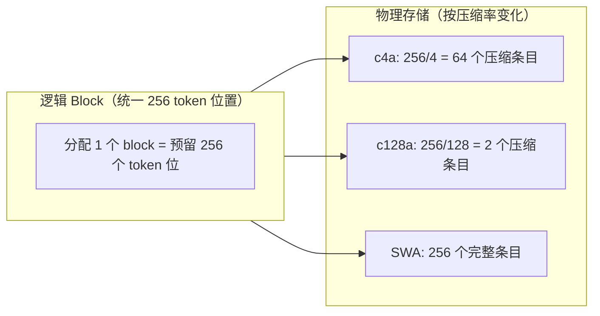
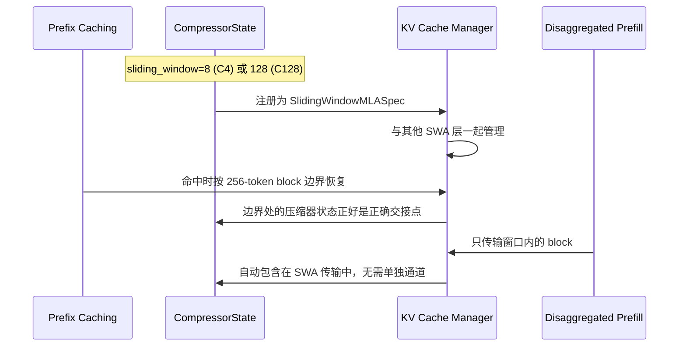
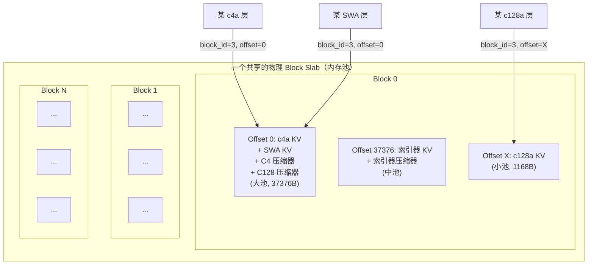
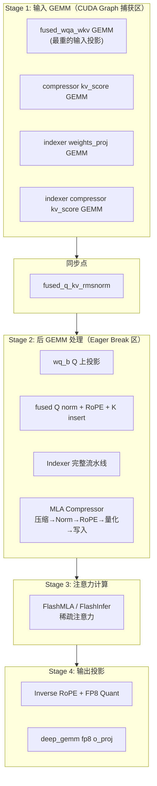
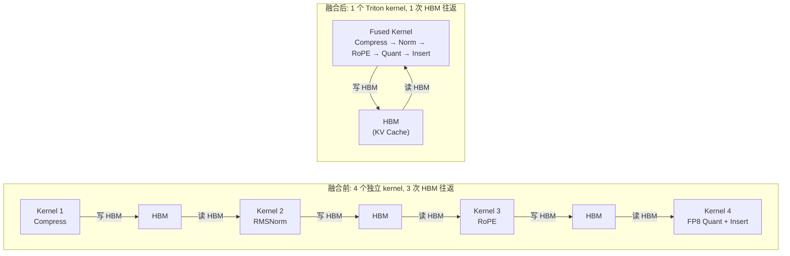
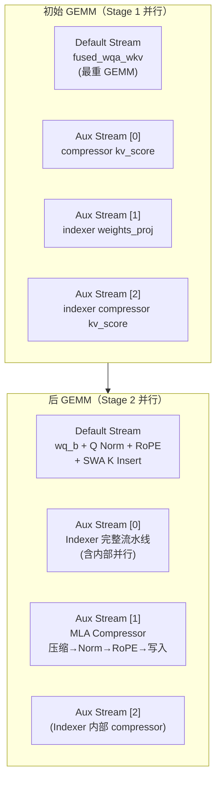
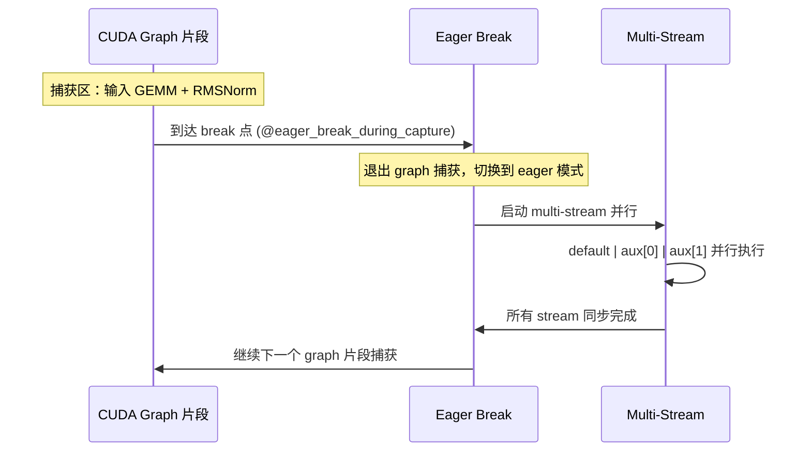
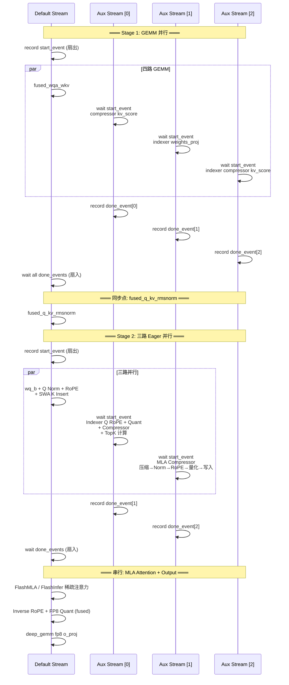
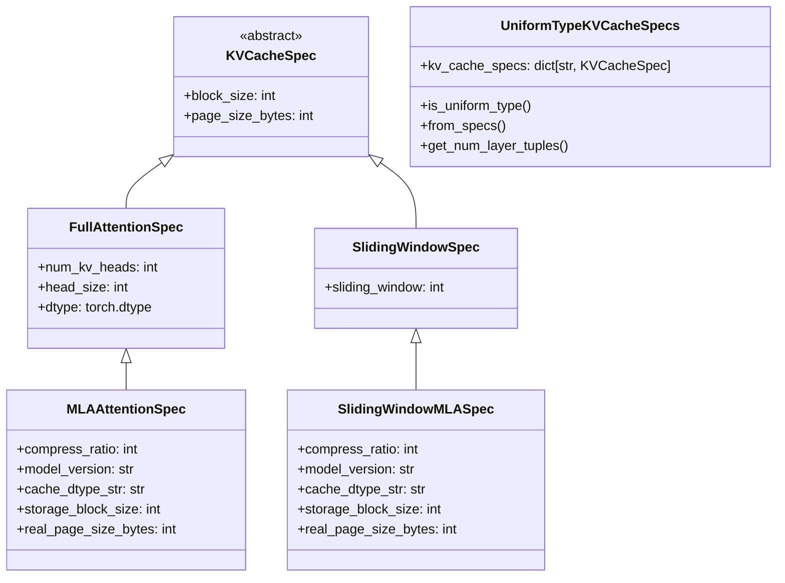

# vLLM DeepSeek-V4 KV Cache 内存压缩与 Multi-Stream 并行设计 技术文档

> **文档版本**: 1.0
> **分析代码版本**: vLLM main 分支（截至 2026-08）
> **最后更新**: 2026-08-02
> **参考博文**: [vLLM Blog: DeepSeek V4](https://vllm.ai/blog/2026-04-24-deepseek-v4)

---

## 文档概述

本文档深入分析 vLLM 为 DeepSeek-V4 模型设计的两项关键推理优化：

1. **Keeping the KV Cache Memory Packed**（KV Cache 内存紧凑打包）：如何将五种不同压缩率的 KV Cache 统一管理，避免内存碎片和重复分配
2. **Keeping the GPU Busy**（让 GPU 保持忙碌）：如何通过 Kernel 融合 + Multi-Stream 并行减少 HBM 访存并隐藏延迟

**目标读者**：对 vLLM 推理系统有一定了解、希望深入理解 DeepSeek-V4 优化细节的工程师和研究者。

**阅读建议**：建议先阅读 [DeepSeek-V4 博客原文](https://vllm.ai/blog/2026-04-24-deepseek-v4) 了解模型整体架构，再结合本文档理解底层实现。

---

# 第一部分: KV Cache 内存紧凑打包

## 1.1 问题背景：为什么 DeepSeek-V4 的 KV Cache 管理特别难？

DeepSeek-V4 的注意力层使用了**混合压缩策略**，不同层的 KV Cache 压缩率差异巨大：

| 层类型 | 压缩率 | 说明 |
|--------|--------|------|
| `c4a` 注意力 | 1/4 | 稀疏注意力层，每 4 个 token 压缩为 1 个 |
| `c128a` 注意力 | 1/128 | 极深压缩的注意力层 |
| SWA (Sliding Window) | 1/1 | 滑动窗口注意力，不压缩 |
| C4 压缩器状态 | — | C4 压缩器的滚动残差状态（窗口=8） |
| C128 压缩器状态 | — | C128 压缩器的滚动残差状态（窗口=128） |
| C4 索引器 KV | 1/4 | 索引器注意力缓存 |

如果为每种缓存分别分配独立的内存池，会出现五个不同形状的 page 池，互相之间无法复用，导致严重的内存碎片。vLLM 用三个巧妙的设计统一了这个多态的 KV Cache 空间。

## 1.2 设计一：统一逻辑 Block 大小为 256

### 核心思想

所有压缩层的**逻辑 block** 都以 **256 个原生 token 位置**为单元。物理存储量 = `256 / compress_ratio` 个压缩条目。



### 代码实现

Block 大小由后端 kernel 的 `get_supported_kernel_block_sizes()` 决定：

```python
# 文件: vllm/models/deepseek_v4/sparse_mla.py
class DeepseekV4FlashMLABackend:
    @staticmethod
    def get_supported_kernel_block_sizes() -> list[int | MultipleOf]:
        return [256]  # 强制使用 256 作为 block size

# 文件: vllm/v1/attention/backends/mla/sparse_swa.py
class DeepseekSparseSWABackend:
    @classmethod
    def get_preferred_block_size(cls, default_block_size: int) -> int:
        return 256  # SWA 也统一为 256
```

关键属性 `storage_block_size` 计算压缩后的物理条目数：

```python
# 文件: vllm/v1/kv_cache_interface.py (line 404)
class MLAAttentionSpec(FullAttentionSpec):
    compress_ratio: int = 1  # c4a=4, c128a=128

    @property
    def storage_block_size(self) -> int:
        return self.block_size // self.compress_ratio
        # c4a:  256 // 4   = 64
        # c128a: 256 // 128 = 2
```

> **关键洞察**: 统一 block size 的收益在于：slot mapping、调度器记账、prefix 命中检测全部使用同一套 256-token 单元。调度器不需要根据 `compress_ratio` 做分支判断，prefix caching 的 hash 计算也无需按层区分粒度。

## 1.3 设计二：压缩器状态伪装成滑动窗口 KV

### 问题

压缩器（Compressor）在压缩过程中需要维护一个**滚动残差状态**：
- C4 压缩器：维护最近 8 个 token 的部分状态
- C128 压缩器：维护最近 128 个 token 的部分状态

如果为每个请求单独分配 side buffer，会引发两个严重问题：
- **Prefix Caching**：需要在每个可缓存边界快照这个滚动状态，和 prefix hash 一起存储，命中时再恢复
- **Disaggregated Prefill**：需要第二条传输通道，在传输 KV block 之外单独传输残差状态

### vLLM 的设计

将压缩器状态**伪装成 SWA KV Cache**，纳入统一的 Hybrid KV Cache Manager 管理：

```python
# 文件: vllm/models/deepseek_v4/compressor.py (line 155-203)
class CompressorStateCache(torch.nn.Module, AttentionLayerBase):
    def __init__(self, state_dim, dtype, compress_ratio, prefix):
        coff = 1 + (compress_ratio == 4)  # C4: coff=2, C128: coff=1
        self.sliding_window = coff * compress_ratio
        # C4:  2 * 4   = 8   ← 窗口大小
        # C128: 1 * 128 = 128 ← 窗口大小

        # Block size 受限于与 KV block 共享物理 tensor 的约束
        if compress_ratio == 4:
            self.block_size = 4     # C4 压缩器状态 block
        elif compress_ratio == 128:
            self.block_size = 8     # C128 压缩器状态 block

    def get_kv_cache_spec(self, vllm_config):
        return SlidingWindowMLASpec(  # 返回 SWA 类型的 spec！
            block_size=self.block_size,
            num_kv_heads=1,           # 只有一个向量（非 K+V）
            head_size=self.state_dim,
            dtype=torch.float32,
            sliding_window=self.sliding_window,
        )
```



> **关键洞察**: 这个设计让压缩器状态可以**零成本**地复用 vLLM 已有的 prefix caching、disaggregated prefill、CUDA graph 等基础设施。不需要为压缩器状态写任何特殊分支代码。

## 1.4 设计三：统一 Page Size 到三个物理池

### 问题

即使逻辑 block 统一了，物理 page 的大小仍然因压缩率和条目大小而异。五种缓存的 `page_bytes = block_size × compress_factor × per_entry_size` 各不相同。

### vLLM 的解法

通过精心选择 block_size、compress_ratio 和 per_entry_size 的组合，将五种缓存**折叠**到三个物理 page 大小：

| 物理池 | Page 大小 (bytes) | 包含的缓存类型 | 物理 Shape |
|--------|-------------------|---------------|-----------|
| **大池** | `64 × 584 = 37,376` | c4a 主 KV、SWA KV、C4 压缩器状态、C128 压缩器状态 | `[64, 584]` |
| **中池** | `64 × head_dim_indexer` | C4 索引器 KV、索引器压缩器状态 | `[64, 68~132]` |
| **小池** | `2 × 584 = 1,168` | c128a 主 KV | `[2, 584]` |

其中 `584 = 448(NoPE) + 128(RoPE) + 8(fp8 scale)` 是每个 token 的 KV 字节数。

### 代码实现：Packed Layout

```python
# 文件: vllm/v1/core/kv_cache_utils.py (line 1283-1358)

def _get_packed_kv_cache_layout(kv_cache_groups):
    """将各 cache group 密集排列在同一个共享 block slab 中"""
    block_stride = 0
    layers_by_offset = defaultdict(list)

    for group in kv_cache_groups:
        byte_offset = 0
        for layer_name in group.layer_names:
            page_size = group.kv_cache_spec.kv_cache_specs[layer_name].page_size_bytes
            layers_by_offset[byte_offset].append(layer_name)
            byte_offset += page_size
        block_stride = max(block_stride, byte_offset)

    return block_stride, layers_by_offset

def _get_kv_cache_config_packed(vllm_config, kv_cache_groups, available_memory):
    """所有 cache 类型共享一块物理内存，通过 offset+stride 访问"""
    block_stride, layers_by_offset = _get_packed_kv_cache_layout(kv_cache_groups)
    num_blocks = available_memory // block_stride

    kv_cache_tensors = []
    for byte_offset in sorted(layers_by_offset):
        kv_cache_tensors.append(KVCacheTensor(
            size=total_size,        # 所有 tensor 共享同一个物理分配
            shared_by=layers_by_offset[byte_offset],
            offset=byte_offset,     # 每种类型在 block 内的偏移
            block_stride=block_stride,  # 跨 block 的步长
        ))
    return num_blocks, kv_cache_tensors
```



> **关键洞察**: 所有缓存类型共享同一个 block ID 空间，一次分配即可覆盖所有层。不存在运行时重新分区、按类型的独立记账、或不同缓存种类之间的碎片问题。`block_stride` 在加载时计算一次，之后通过 `offset + block_id × block_stride` 即可定位任意层的任意 block。

### Pool 归组流程

```python
# 文件: vllm/v1/core/kv_cache_utils.py (line 1592-1632)
def group_and_unify_kv_cache_specs(kv_cache_spec):
    """将 DSV4 的所有层按 (block_size, sliding_window) 分组"""
    mla_specs = {}       # MLAAttentionSpec: c4a + c128a + indexer
    grouped_swa_specs = defaultdict(dict)  # SlidingWindowMLASpec，按窗口分组

    for name, spec in kv_cache_spec.items():
        if isinstance(spec, SlidingWindowMLASpec):
            # 按 (block_size, sliding_window) 分组 → 自动分离
            #   - SWA 层 (block=64, window=4096)
            #   - C4 压缩器 (block=4, window=8)
            #   - C128 压缩器 (block=8, window=128)
            grouped_swa_specs[(spec.block_size, spec.sliding_window)][name] = spec
        elif isinstance(spec, MLAAttentionSpec):
            mla_specs[name] = spec

    return [mla_uniform_spec, *swa_uniform_specs]
```

---

# 第二部分: 让 GPU 保持忙碌

## 2.1 问题背景

DeepSeek-V4 的 decode 路径由**大量小 kernel** 组成，且大多是 memory-bound 操作（element-wise、norm、RoPE、量化）。如果每个操作独立启动 kernel，每次都需要：
1. 从 HBM 读取数据
2. 执行少量计算
3. 写回 HBM

这种 "读-算-写" 循环产生了大量不必要的 HBM 往返。vLLM 通过 **Kernel 融合** 和 **Multi-Stream 并行** 两个策略来压缩这些开销。

## 2.2 Decode 路径总览



## 2.3 Kernel 融合：消灭 HBM 往返

vLLM 为 DSV4 实现了三类关键融合，在 decode 计算图中用不同颜色标识。

### 融合一：Compressor + RMSNorm + RoPE + KV Cache 写入

**这是最关键的融合**。压缩器的输出需要经过 RMSNorm、RoPE、FP8 量化、写入 KV Cache 四个步骤。传统做法是四个独立 kernel，三次 HBM 往返。vLLM 将其融合为一个 Triton kernel：

```python
# 文件: vllm/models/deepseek_v4/common/ops/fused_compress_quant_cache.py
"""
三个专用 Triton kernel，按 head_dim 选择：
  - head=512 (c4a/c128a): 448 NoPE dims → FP8 + 64 RoPE dims → bf16
  - head=128 (indexer FP8): 全 FP8，单个 quant block
  - head=128 (indexer MXFP4): 32 元素 block，2 nibbles/byte
"""

@triton.jit
def _fused_kv_compress_norm_rope_insert_sparse_attn(...):
    """单 kernel 内完成五个操作:
    1. state-cache gather → 从滚动状态中读取
    2. softmax 加权压缩 → 注意力分数融合
    3. RMSNorm (fp32) → 归一化
    4. GPT-J RoPE (寄存器内) → 旋转位置编码
    5. UE8M0 FP8 量化 + paged cache insert → 写入 KV Cache
    """
    # 每个 token 一个 program，非边界位置直接 early-exit
    ...
```



**效果**: 相比未融合基线提升 **1.4-3x**。索引器 K cache 和主注意力 K cache 保持独立 kernel，以便针对不同 head_dim 分别调优并行度。

### 融合二：Inverse RoPE + FP8 量化

主注意力输出后需要先做 Inverse RoPE，再量化为 FP8 送入 `o_lora` 投影矩阵乘法。融合避免了一次 HBM 写入-读取往返：

```python
# 文件: vllm/models/deepseek_v4/common/ops/fused_inv_rope_fp8_quant.py
@triton.jit
def _fused_inv_rope_fp8_quant_per_head(...):
    """
    融合 Inverse GPT-J RoPE + block-scaled FP8 quant:
    - 128 个元素一个 quant group
    - RoPE 旋转: x_partner = x[offsets ^ 1]（GPT-J 风格的奇偶交换）
    - Scale = 2^ceil(log2(absmax / fp8_max))
    """
```

**效果**: 提升 **2-3x**，同时通过减少中间结果提升了算术强度。

### 融合三：Fused Q Norm + KV RoPE + K Insert

Query 侧的 RMSNorm、RoPE 和 SWA Key 的 RoPE + 量化 + cache 写入合并为一个 C++ kernel，使用 `warpID` 静态分发：

```cuda
// 文件: csrc/libtorch_stable/fused_deepseek_v4_qnorm_rope_kv_insert_kernel.cu
// fusedDeepseekV4QNormRopeKVRopeQuantInsertKernel

// 一个 kernel，一个 grid，按 head-slot 分派 warp:
// - Q 侧: per-head RMSNorm + GPT-J RoPE on last 64 dims
// - KV 侧: GPT-J RoPE + UE8M0 FP8 quant (448 NoPE dims) + paged cache insert
// 576B/token = 448 fp8 + 128 bf16 + 8 scale bytes
```

**效果**: 相比未融合 kernel 提升 **10-20x**。因为每个 warp 独立工作（Q head 或 K head），完全不需要跨 warp 通信，扩展性极佳。

### 融合四：Q RoPE + Quant + Weight Multiply

索引器的 Query 处理融合了 RoPE、FP8 量化和权重折叠：

```python
# 文件: vllm/models/deepseek_v4/common/ops/fused_indexer_q.py
def fused_indexer_q_rope_quant(...):
    """
    每个 (token, head) 融合:
    1. GPT-J RoPE on indexer Q
    2. FP8/MXFP4 量化
    3. 权重折叠: index_weights *= q_scale * softmax_scale * head_scale
    """
```

> **关键洞察**: 权重折叠将 per-token 的 FP8 Q scale 直接折入权重矩阵，使下游的 logits kernel 不需要 companion scale tensor，减少了一次显式的 scale 传递。

## 2.4 Multi-Stream 并行：隐藏延迟

### 整体架构

DeepSeek-V4 的 pre-attention 操作在初始投影后会分裂为三条几乎独立的支线：
1. **索引器计算**（indexer pipeline）
2. **主注意力 KV 压缩**
3. **滑动窗口 token 插入**

vLLM 使用多个 CUDA stream 并行执行这些支线。blog 中的图用蓝色表示 default stream，琥珀色表示 indexer stream。



### Stage 1: 四路 GEMM 并行

四个输入投影 GEMM 在不同 stream 上并行执行：

```python
# 文件: vllm/models/deepseek_v4/attention.py (line 403-459)
def attn_gemm_parallel_execute(self, hidden_states):
    aux_streams = self.aux_stream_list[:3]  # 取前 3 个 aux stream

    aux_fns = [None, None, None]
    if self.compressor is not None:
        aux_fns[0] = lambda: torch.mm(hidden_states,
            compressor.fused_wkv_wgate.weight.T, out_dtype=torch.float32)
    if self.indexer is not None:
        aux_fns[1] = lambda: indexer.weights_proj(hidden_states)
        aux_fns[2] = lambda: torch.mm(hidden_states,
            indexer.compressor.fused_wkv_wgate.weight.T, out_dtype=torch.float32)

    qr_kv, (kv_score, indexer_weights, indexer_kv_score) = execute_in_parallel(
        fused_wqa_wkv,  # default stream: 最重的 GEMM
        aux_fns,        # aux stream 0/1/2: 三个较轻的 GEMM
        start_event, done_events, aux_streams,
        enable=num_tokens <= VLLM_MULTI_STREAM_GEMM_TOKEN_THRESHOLD,  # 默认 1024
    )
```

> **性能提示**: Stage 1 的 multi-stream 仅在小 batch（`num_tokens <= 1024`）时启用。大 batch 时 GEMM 本身已经能打满 GPU，stream 切换的开销反而会拖慢速度。

### Stage 2: 三路后 GEMM 并行（Eager Break 区）

Stage 2 对应 TRT-LLM PR #14142 的 "Level 1" 方案：

- **Default stream**: `wq_b` Q 上投影 + `fused_qnorm_rope_kv_insert`（Q Norm + KV RoPE + SWA K 写入）
- **Aux[0]**: 完整的 Indexer 流水线（含内部的 Q RoPE+quant、compressor、topk 计算）
- **Aux[1]**: MLA Compressor（压缩→Norm→RoPE→FP8 量化→KV Cache 写入）

对于 C4A 层（有 indexer 的层），Aux[2] 被 indexer 内部使用：

```python
# 文件: vllm/models/deepseek_v4/attention.py (line 461-540)
@eager_break_during_capture
def attention_impl(self, hidden_states, qr, kv, ...):
    if self.indexer is not None:
        # 3-way 并行: default | indexer | compressor
        q, _ = execute_in_parallel(
            wq_b_kv_insert,               # default: Q 投影 + K 写入
            [
                lambda: indexer(...),      # aux[0]: 完整 Indexer
                lambda: compressor(...),    # aux[1]: MLA Compressor
            ],
            start_event,
            [done_events[0], done_events[1]],
            [aux_streams[0], aux_streams[1]],
        )
    elif self.compressor is not None:
        # c128a 层（无 indexer）: 2-way 并行
        q, _ = maybe_execute_in_parallel(
            wq_b_kv_insert,                # default
            lambda: compressor(...),        # aux[0]
            start_event, done_event, aux_stream,
        )
    else:
        # SWA-only 层: 串行
        q = self._fused_qnorm_rope_kv_insert(q, kv, positions, attn_metadata)
```

### 多 Stream 同步机制

```python
# 文件: vllm/utils/multi_stream_utils.py
def execute_in_parallel(default_fn, aux_fns, start_event, done_events, aux_streams):
    """
    同步协议:
    1. default stream 记录 start_event（扇出点）
    2. 每个 aux stream: start_event.wait() → 执行 aux_fn → 记录 done_event
    3. default stream 执行 default_fn
    4. default stream 等待所有 done_event（扇入点）
    """
    start_event.record()
    for i, fn in enumerate(aux_fns):
        if fn is None:
            continue
        with torch.cuda.stream(aux_streams[i]):
            start_event.wait()      # 等待 default stream 到达扇出点
            aux_results[i] = fn()
            done_events[i].record()  # 标记完成
        pending.append(done_events[i])

    default_result = default_fn()

    for ev in pending:
        ev.wait()  # default stream 等待所有 aux 完成
```

### 与 CUDA Graph 的协作

Multi-stream 不能直接在 CUDA graph 捕获中使用（event/stream switch 无法 capture）。vLLM 使用 **Breakable CUDA Graph** 机制解决：



```python
# 文件: vllm/utils/multi_stream_utils.py (line 49-53)
def maybe_execute_in_parallel(fn0, fn1, event0, event1, aux_stream):
    if aux_stream is not None:
        from vllm.compilation.breakable_cudagraph import BreakableCUDAGraphCapture
        if BreakableCUDAGraphCapture.is_active():
            aux_stream = None  # 自动回退到串行！
    ...
```

### 整体效果

- Stage 1（GEMM 并行）+ Stage 2（后 GEMM 并行）联动，在低 batch size 时端到端延迟降低 **5-6%**
- CUDA Graphs 进一步消除 decode 路径上的 kernel launch 开销

## 2.5 完整 Decode 路径时序图



---

# 第三部分: 关键数据结构总览

## 3.1 Cache Spec 类层次



## 3.2 Page Size 计算对比

| 缓存类型 | block_size | compress_ratio | storage_block_size | per_entry(bytes) | page_size(bytes) | 物理池 |
|---------|-----------|----------------|-------------------|-----------------|-----------------|--------|
| c4a 主 KV | 256 | 4 | 64 | 584 | 37,376 | 大池 |
| SWA KV | 64 | 1 | 64 | 584 | 37,376 | 大池 |
| C4 压缩器状态 | 4 | — | 4 | state_dim × 4B | — | 大池 |
| C128 压缩器状态 | 8 | — | 8 | state_dim × 4B | — | 大池 |
| 索引器 KV | 256 | 4 | 64 | 68~132 | 4,352~8,448 | 中池 |
| c128a 主 KV | 256 | 128 | 2 | 584 | 1,168 | 小池 |

---

# 第四部分: 配置与使用指南

## 4.1 关键环境变量

| 环境变量 | 默认值 | 说明 |
|---------|--------|------|
| `VLLM_MULTI_STREAM_GEMM_TOKEN_THRESHOLD` | 1024 | Stage 1 GEMM 并行的 token 数阈值。超过此值串行执行 |
| `VLLM_USE_BREAKABLE_CUDAGRAPH` | 未设置 | 启用 Breakable CUDA Graph，使 multi-stream 能在 graph 中工作 |

## 4.2 平台兼容性

| 特性 | NVIDIA | AMD (ROCm) |
|------|--------|------------|
| Packed KV Cache Layout | ✓ | ✓ |
| Multi-Stream Stage 1 (GEMM) | ✓ | ✗ (显式禁用) |
| Multi-Stream Stage 2 (Eager) | ✓ | ✗ (串行回退) |
| Compressor Kernel Fusion | ✓ (Triton + cutedsl) | ✓ (Triton, 两阶段) |
| Fused Q Norm + RoPE + Insert | ✓ (CUDA C++) | ✓ (XPU Triton) |
| FlashMLA | ✓ | ✗ (使用 FlashInfer) |

> **注意**: ROCm 平台关闭 multi-stream 是因为 "hang issues"。所有 `aux_stream_list = None` 时，`execute_in_parallel` 和 `maybe_execute_in_parallel` 自动退化为串行执行，功能不受影响。

## 4.3 性能调优建议

1. **Batch Size 较小（1-32）**: Multi-stream 收益最大（5-6% 延迟降低），建议启用 `VLLM_USE_BREAKABLE_CUDAGRAPH`
2. **Batch Size 较大（> 1024 tokens）**: GEMM 已充分占用 GPU，建议关闭 Stage 1 并行（默认行为）
3. **内存受限场景**: Packed layout 消除了 page 池碎片，通常可以在同 GPU 显存下服务更多请求

---

# 附录

## A. 关键代码位置索引

| 模块 | 文件路径 | 说明 |
|------|---------|------|
| KV Cache Spec 定义 | `vllm/v1/kv_cache_interface.py` | `MLAAttentionSpec`, `SlidingWindowMLASpec`, `UniformTypeKVCacheSpecs` |
| Packed Layout 逻辑 | `vllm/v1/core/kv_cache_utils.py` | `_get_packed_kv_cache_layout`, `_get_kv_cache_config_packed`, `group_and_unify_kv_cache_specs` |
| Compressor + 状态管理 | `vllm/models/deepseek_v4/compressor.py` | `CompressorStateCache`, `DeepseekCompressor` |
| 注意力层主逻辑 | `vllm/models/deepseek_v4/attention.py` | `DeepseekV4Attention.forward`, `attn_gemm_parallel_execute`, `attention_impl` |
| Multi-Stream 工具 | `vllm/utils/multi_stream_utils.py` | `execute_in_parallel`, `maybe_execute_in_parallel` |
| 融合压缩+量化 kernel | `vllm/models/deepseek_v4/common/ops/fused_compress_quant_cache.py` | Triton 融合 kernel |
| Inverse RoPE + FP8 Quant | `vllm/models/deepseek_v4/common/ops/fused_inv_rope_fp8_quant.py` | Triton 融合 kernel |
| Fused Q Norm + RoPE + Insert | `csrc/libtorch_stable/fused_deepseek_v4_qnorm_rope_kv_insert_kernel.cu` | C++ CUDA kernel |
| Indexer Q 融合 | `vllm/models/deepseek_v4/common/ops/fused_indexer_q.py` | Triton 融合 kernel |
| SWA Cache 后端 | `vllm/v1/attention/backends/mla/sparse_swa.py` | `DeepseekV4SWACache`, `DeepseekSparseSWABackend` |
| FlashMLA 后端 | `vllm/models/deepseek_v4/sparse_mla.py` | `DeepseekV4FlashMLABackend` |
| Indexer 后端 | `vllm/v1/attention/backends/mla/indexer.py` | `DeepseekV4IndexerBackend` |
| NVIDIA 模型入口 | `vllm/models/deepseek_v4/nvidia/model.py` | Stream 创建与分发 |
| AMD 模型入口 | `vllm/models/deepseek_v4/amd/model.py` | ROCm 适配（禁用 multi-stream） |
| Breakable CUDA Graph | `vllm/compilation/breakable_cudagraph.py` | `eager_break_during_capture`, `BreakableCUDAGraphCapture` |

## B. 术语表

| 术语 | 英文 | 说明 |
|------|------|------|
| 压缩率 | Compress Ratio | KV Cache 压缩比例，如 c4a=4 表示每 4 个 token 压缩为 1 个 |
| 压缩器状态 | Compressor State | 压缩器维护的滚动残差状态，用于增量压缩 |
| 逻辑 Block | Logical Block | 以 token 位置为单位的虚拟 block（256 token 位） |
| 存储 Block | Storage Block | 以压缩条目为单位的物理 block（c4a=64, c128a=2） |
| Packed Layout | Packed Layout | 多种 cache 类型共享同一物理内存的布局方案 |
| Block Stride | Block Stride | 同一组内所有层 page 大小的总和，跨 block 的步长 |
| Multi-Stream | Multi-Stream | 使用多个 CUDA stream 并行执行独立操作 |
| Eager Break | Eager Break | CUDA graph 中的断点，断点内代码以 eager 模式执行 |
| HBM Round-trip | HBM Round-trip | GPU 内存的一次读取+写入往返 |
| UE8M0 | UE8M0 | FP8 的一种 scale 格式，用于 block-scaled 量化 |
| MTP | Multi-Token Prediction | DeepSeek-V4 的多 token 预测投机解码机制 |
