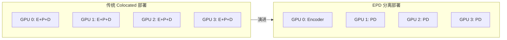
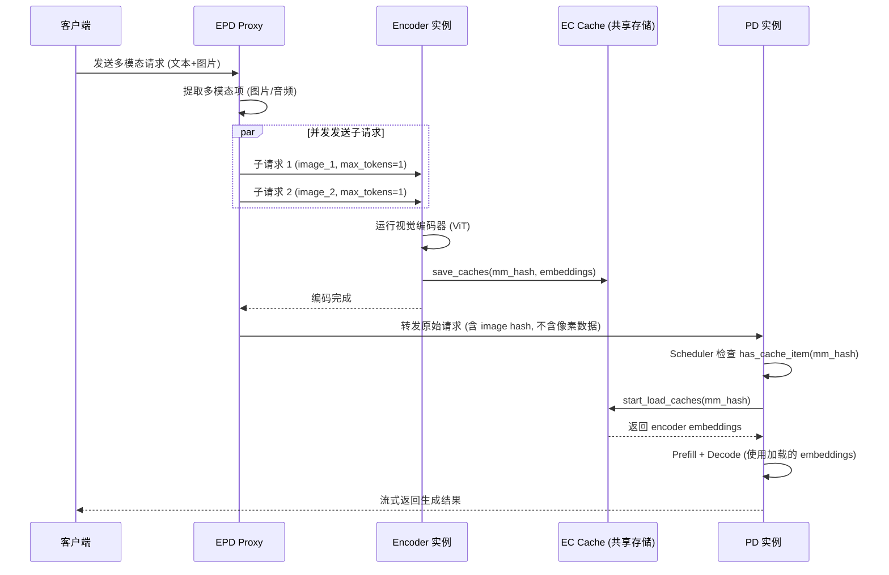
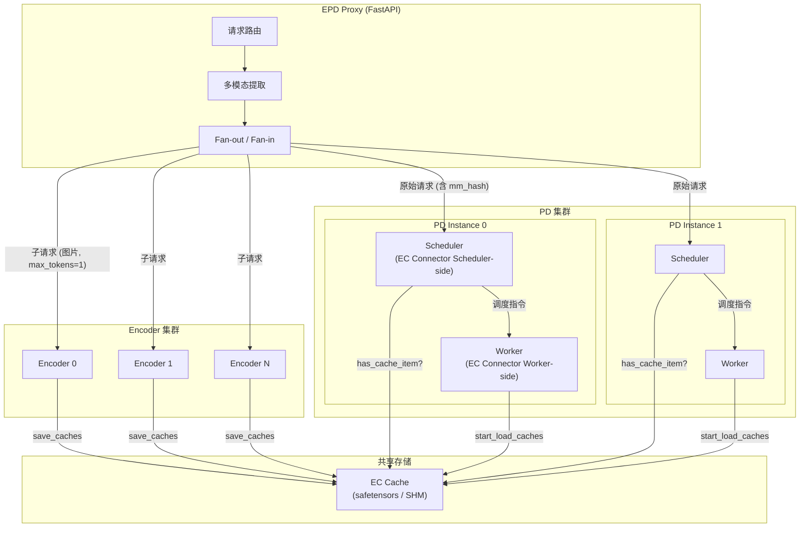
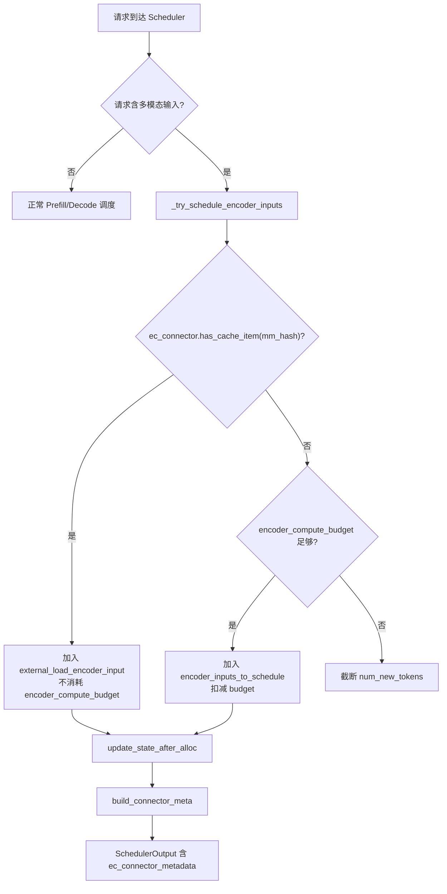
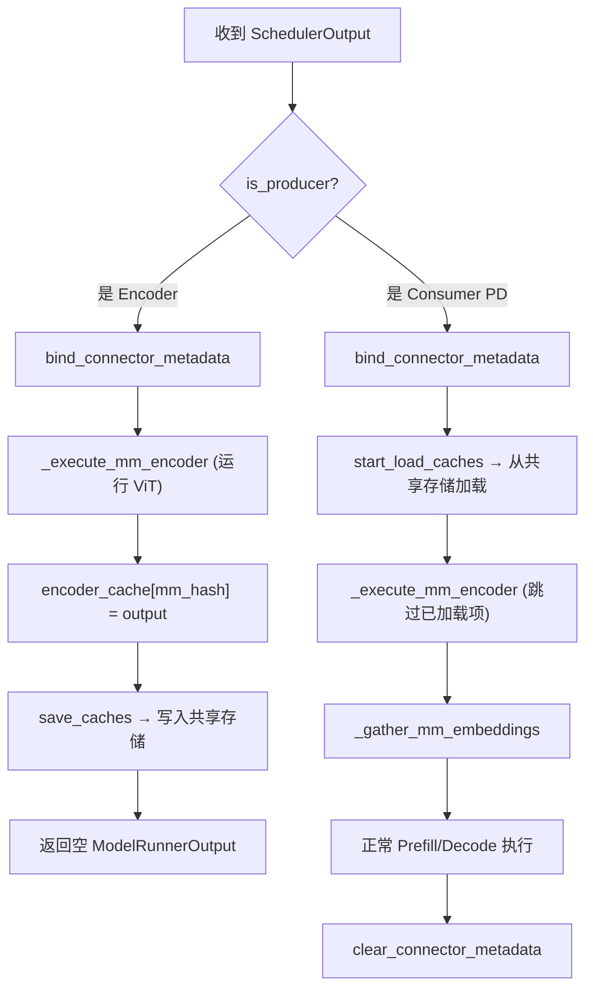
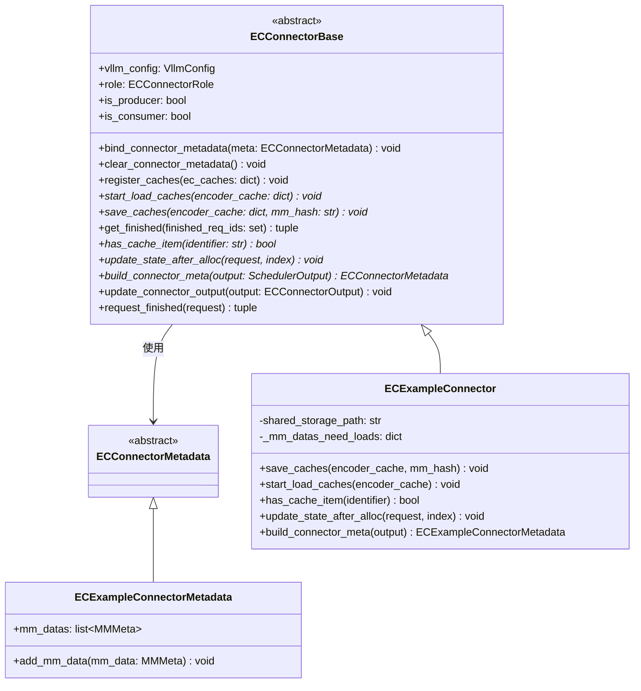
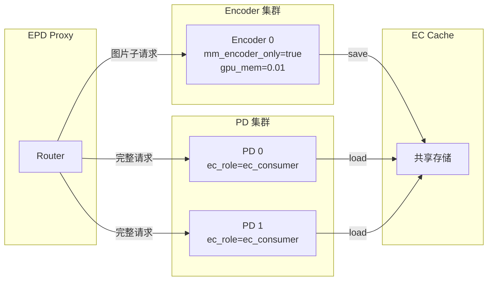
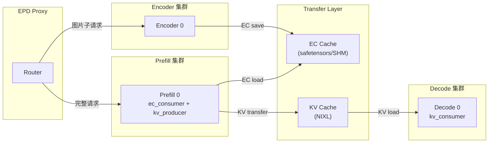

# vLLM Disaggregated Encoder (EPD) 特性代码走读技术文档

> **文档版本**: 1.0
> **分析代码版本**: vLLM main 分支（截至 2026-04）
> **最后更新**: 2026-04-02

---

## 文档概述

本文档深入分析 vLLM 的 **Disaggregated Encoder（EPD 分离）** 特性。EPD 将多模态大模型推理拆分为 **Encoder (E)、Prefill (P)、Decode (D)** 三个独立阶段，分别运行在不同的 GPU 实例上，从而实现细粒度的资源调度与弹性扩展。

**目标读者**: 对 vLLM 推理引擎有一定了解，希望深入理解多模态模型服务化部署优化的工程师。

**阅读指南**:

| 部分 | 内容 | 建议读者 |
|------|------|----------|
| 第一部分 | EPD 原理与架构总览 | 所有读者 |
| 第二部分 | 核心接口与基类分析 | 开发者、定制化需求者 |
| 第三部分 | 核心实现深度分析 | 引擎开发者 |
| 第四部分 | 部署拓扑与连接器对比 | 运维工程师、架构师 |
| 第五部分 | 配置与使用指南 | 所有用户 |

---

# 第一部分: EPD 基础与架构总览

## 1.1 EPD 原理

### 1.1.1 基本思想

多模态大模型（如 Qwen2.5-VL、InternVL2）的推理包含三个计算特征截然不同的阶段：

| 阶段 | 计算特征 | 资源瓶颈 | 持续时间 |
|------|----------|----------|----------|
| **Encoder** | 视觉编码器（ViT）处理图像/视频 | 计算密集（Compute-bound） | 一次性、可高度并行 |
| **Prefill** | 语言模型预填充所有输入 Token | 内存带宽密集（Memory-bandwidth bound） | 一次性、大矩阵运算 |
| **Decode** | 逐 Token 自回归生成 | 内存带宽密集 | 持续、串行 |

传统的 colocated 部署将三个阶段绑定在同一组 GPU 上，导致以下问题：

1. **资源配比失调**: 视觉编码器通常远小于语言模型（如 ViT-L 仅 0.3B 参数 vs LLM 可达数十 B），却需要占用与 LLM 相同规格的 GPU
2. **队头阻塞**: 处理图像的慢请求会阻塞后续纯文本请求的 Prefill/Decode
3. **无法独立扩缩**: 图片密集的工作负载需要更多 Encoder 算力，但无法单独扩展

**EPD 的核心思想**：将三个阶段解耦为独立的微服务实例，通过高效的缓存传输机制连接，各阶段可独立扩缩。



### 1.1.2 工作流程

EPD 的核心工作流程如下：



### 1.1.3 性能分析

EPD 分离带来的性能提升主要体现在以下方面：

**延迟优化**:

$$\text{TTFT}_{\text{colocated}} = T_{\text{encoder}} + T_{\text{prefill}}$$

$$\text{TTFT}_{\text{EPD}} = \max(T_{\text{encoder}}, T_{\text{prefill\_queue}}) + T_{\text{EC\_transfer}} + T_{\text{prefill}}$$

当 Encoder 实例提前完成编码并缓存结果时，PD 实例可直接加载缓存，TTFT 显著降低。对于纯文本请求，完全跳过 Encoder 阶段。

**吞吐量优化**:

| 指标 | Colocated (4-way DP) | 1E + 3PD | 提升幅度 |
|------|---------------------|----------|----------|
| Goodput (单图, 短文本) | 23 QPS | 24 QPS | ~4% |
| Goodput (四图, 短文本) | 6 QPS | 12 QPS | **100%** |
| Goodput (单图, 长文本) | 8 QPS | 18 QPS | **125%** |
| P99 TTFT 降低 | - | - | 30-50% |
| P99 TPOT 降低 | - | - | 20-40% |

> **关键洞察**: EPD 的收益随图片数量和文本长度增加而显著增大。在多图场景下，Goodput 可提升 2-2.5 倍。

**学术论文结果** (ICML 2025, arxiv 2501.05460):
- TTFT 降低最高 **71.9%** (MiniCPM-V 2.6)
- 峰值内存利用降低最高 **15 倍**
- 批大小提升最高 **22 倍**
- 单请求可支持的图片数量提升 **10 倍**

### 1.1.4 关键指标定义

| 指标 | 定义 |
|------|------|
| **TTFT** (Time To First Token) | 从请求到达到生成第一个 Token 的延迟 |
| **TPOT** (Time Per Output Token) | 每个输出 Token 的平均生成时间 |
| **Goodput** | 同时满足 P99 TTFT < 20s 和 P99 TPOT < 100ms SLO 的最大可持续 QPS |
| **mm_hash** | 多模态数据的哈希标识符，用于唯一标识缓存的 encoder 输出 |
| **EC (Encoder Cache)** | 视觉编码器的输出 embeddings 缓存 |

## 1.2 vLLM EPD 整体架构

### 1.2.1 系统架构总览图



### 1.2.2 核心组件与职责划分

| 组件 | 职责 | 关键文件 |
|------|------|----------|
| **EPD Proxy** | 请求路由、多模态提取、Fan-out/Fan-in | `examples/online_serving/disaggregated_encoder/disagg_epd_proxy.py` |
| **ECConnectorBase** | EC 传输的抽象基类，定义 save/load/has_cache 接口 | `vllm/distributed/ec_transfer/ec_connector/base.py` |
| **ECExampleConnector** | 基于 safetensors + 共享文件系统的参考实现 | `vllm/distributed/ec_transfer/ec_connector/example_connector.py` |
| **ECConnectorFactory** | 连接器的工厂模式注册与创建 | `vllm/distributed/ec_transfer/ec_connector/factory.py` |
| **ECTransferConfig** | EC 传输配置数据类 | `vllm/config/ec_transfer.py` |
| **ECTransferState** | 全局单例管理，创建 Worker-side connector | `vllm/distributed/ec_transfer/ec_transfer_state.py` |
| **Scheduler (EC 集成)** | 检查 EC 缓存存在性，管理编码器计算预算 | `vllm/v1/core/sched/scheduler.py` |
| **ECConnectorModelRunnerMixin** | Worker 侧生命周期管理 (save/load 触发) | `vllm/v1/worker/ec_connector_model_runner_mixin.py` |
| **GPUModelRunner** | 集成 Mixin，在执行路径中调用 save/load | `vllm/v1/worker/gpu_model_runner.py` |

### 1.2.3 数据流与控制流分析

**控制流** (Scheduler 侧):



**数据流** (Worker 侧):



## 1.3 执行流程详解

### 1.3.1 示例场景设定

假设用户发送一个包含 2 张图片的请求：

```json
{
  "model": "Qwen/Qwen2.5-VL-7B-Instruct",
  "messages": [
    {"role": "user", "content": [
      {"type": "image_url", "image_url": {"url": "image1.jpg"}},
      {"type": "image_url", "image_url": {"url": "image2.jpg"}},
      {"type": "text", "text": "描述这两张图片的区别"}
    ]}
  ]
}
```

部署拓扑: **1 Encoder + 1 PD**。

### 1.3.2 Proxy 处理阶段

1. Proxy 接收请求，`MMExtractor` 提取 2 个 image_url
2. 创建 2 个子请求，每个仅包含一张图片（移除文本），`max_tokens=1`
3. 通过 Round-Robin 分发到 Encoder 集群
4. 等待所有子请求返回（Fan-in）
5. 将原始请求（图片 URL 替换为 hash 标识）转发到 PD 实例

### 1.3.3 Encoder 处理阶段

1. Encoder 实例收到子请求，Scheduler 调度 encoder 计算
2. `GPUModelRunner.execute_model()` 检测到 `is_producer` 角色
3. 进入 `maybe_get_ec_connector_output` 上下文管理器
4. 执行 `_execute_mm_encoder` 运行 ViT，产出 embeddings
5. 调用 `save_caches` 将 embeddings 序列化为 safetensors 写入共享存储
6. 返回空的 `ModelRunnerOutput`（不执行语言模型）

### 1.3.4 PD 处理阶段

1. PD 实例收到原始请求（含 mm_hash）
2. Scheduler 调用 `has_cache_item(mm_hash)` 确认缓存存在
3. 将 item 标记为 `external_load_encoder_input`，不消耗编码器计算预算
4. Worker 收到 `SchedulerOutput`，进入 `maybe_get_ec_connector_output`
5. 调用 `start_load_caches` 从共享存储加载 embeddings 到 GPU
6. `_gather_mm_embeddings` 从 `encoder_cache` 获取已加载的 embeddings
7. 正常执行 Prefill 和 Decode，流式返回生成结果

---

# 第二部分: 核心接口与基类分析

## 2.1 核心基类详解

### 2.1.1 ECConnectorRole 枚举

```python
# 文件: vllm/distributed/ec_transfer/ec_connector/base.py
class ECConnectorRole(enum.Enum):
    SCHEDULER = 0  # 运行在 Scheduler 进程中
    WORKER = 1     # 运行在 Worker 进程中
```

每个 EC Connector 实例会根据所在进程被赋予不同角色。Scheduler-side 负责元数据管理（缓存存在性检查、构建调度指令），Worker-side 负责实际的数据传输。

### 2.1.2 ECConnectorBase 抽象基类



**构造函数**:

```python
# 文件: vllm/distributed/ec_transfer/ec_connector/base.py
class ECConnectorBase(ABC):
    def __init__(self, vllm_config: "VllmConfig", role: ECConnectorRole):
        self.vllm_config = vllm_config
        self.role = role
```

**角色判断属性**:

```python
    @property
    def is_producer(self) -> bool:
        return self.vllm_config.ec_transfer_config.is_ec_producer

    @property
    def is_consumer(self) -> bool:
        return self.vllm_config.ec_transfer_config.is_ec_consumer
```

> **关键洞察**: `is_producer` / `is_consumer` 由 `ECTransferConfig` 的 `ec_role` 字段决定，不同于 `role`（ECConnectorRole）。`role` 决定连接器运行在 Scheduler 还是 Worker 进程；`is_producer`/`is_consumer` 决定该实例是编码器（产出缓存）还是 PD（消费缓存）。

## 2.2 核心接口定义

### 2.2.1 Worker 侧接口

| 方法 | 签名 | 职责 |
|------|------|------|
| `bind_connector_metadata` | `(meta: ECConnectorMetadata) -> None` | 在每步 forward 前绑定 Scheduler 下发的元数据 |
| `clear_connector_metadata` | `() -> None` | forward 完成后清理元数据 |
| `register_caches` | `(ec_caches: dict[str, Tensor])` | 初始化注册 EC 缓存（预留 P2P 用途） |
| **`start_load_caches`** | `(encoder_cache: dict[str, Tensor]) -> None` | **[抽象]** 从连接器加载 embeddings 到 vLLM encoder_cache |
| **`save_caches`** | `(encoder_cache: dict[str, Tensor], mm_hash: str) -> None` | **[抽象]** 将 encoder_cache 保存到连接器 |
| `get_finished` | `(finished_req_ids: set[str]) -> tuple` | 报告异步传输完成状态 |

### 2.2.2 Scheduler 侧接口

| 方法 | 签名 | 职责 |
|------|------|------|
| **`has_cache_item`** | `(identifier: str) -> bool` | **[抽象]** 检查指定 mm_hash 的 EC 缓存是否存在 |
| **`update_state_after_alloc`** | `(request: Request, index: int) -> None` | **[抽象]** 分配 encoder cache 后更新状态 |
| **`build_connector_meta`** | `(output: SchedulerOutput) -> ECConnectorMetadata` | **[抽象]** 构建传给 Worker 的每步元数据 |
| `update_connector_output` | `(output: ECConnectorOutput) -> None` | 从 Worker 反馈更新状态 |
| `request_finished` | `(request: Request) -> tuple[bool, dict]` | 请求结束时回调 |

## 2.3 工厂方法与注册机制

### 2.3.1 ECConnectorFactory

```python
# 文件: vllm/distributed/ec_transfer/ec_connector/factory.py
class ECConnectorFactory:
    _registry: dict[str, Callable[[], type[ECConnectorBase]]] = {}

    @classmethod
    def register_connector(cls, name: str, module_path: str, class_name: str):
        """惰性注册：仅保存模块路径和类名，不立即导入"""
        def loader():
            module = importlib.import_module(module_path)
            return getattr(module, class_name)
        cls._registry[name] = loader

    @classmethod
    def create_connector(cls, config, role) -> ECConnectorBase:
        """根据配置名称创建连接器实例"""
        loader = cls._registry[config.ec_connector]
        connector_cls = loader()
        return connector_cls(config, role)
```

**预注册的连接器**:

```python
# 文件: vllm/distributed/ec_transfer/ec_connector/factory.py
ECConnectorFactory.register_connector(
    "ECExampleConnector",
    "vllm.distributed.ec_transfer.ec_connector.example_connector",
    "ECExampleConnector",
)
```

> **注意**: 用户可通过 `ec_connector_module_path` 配置项指定自定义模块路径，实现第三方连接器的动态加载，无需修改 vLLM 核心代码。

### 2.3.2 全局单例管理

```python
# 文件: vllm/distributed/ec_transfer/__init__.py

# 全局单例
_ec_transfer: Optional[ECTransferState] = None

def get_ec_transfer() -> ECTransferState:
    """获取全局 ECTransferState 实例"""
    ...

def has_ec_transfer() -> bool:
    """检查 EC Transfer 是否已初始化"""
    ...

def ensure_ec_transfer_initialized(vllm_config: VllmConfig) -> None:
    """确保全局 EC Transfer 初始化（幂等）"""
    ...
```

---

# 第三部分: 核心实现深度分析

## 3.1 ECExampleConnector 实现分析

### 3.1.1 初始化与存储路径

```python
# 文件: vllm/distributed/ec_transfer/ec_connector/example_connector.py
class ECExampleConnector(ECConnectorBase):
    def __init__(self, vllm_config, role):
        super().__init__(vllm_config, role)
        ec_config = vllm_config.ec_transfer_config
        self.shared_storage_path = ec_config.ec_connector_extra_config["shared_storage_path"]
        self._mm_datas_need_loads: dict[str, int] = {}  # mm_hash -> num_encoder_tokens

    def _generate_filename_debug(self, mm_hash: str) -> str:
        """生成存储路径: /<shared_path>/<mm_hash>/encoder_cache.safetensors"""
        path = os.path.join(self.shared_storage_path, mm_hash)
        os.makedirs(path, exist_ok=True)
        return os.path.join(path, "encoder_cache.safetensors")
```

### 3.1.2 Producer 侧: 保存缓存

```python
# 文件: vllm/distributed/ec_transfer/ec_connector/example_connector.py
def save_caches(self, encoder_cache: dict[str, torch.Tensor],
                mm_hash: str, **kwargs) -> None:
    """将 encoder 输出保存为 safetensors 文件"""
    filename = self._generate_filename_debug(mm_hash)
    tensors = {"ec_cache": encoder_cache[mm_hash].detach().cpu()}
    safetensors.torch.save_file(tensors, filename)
```

> **性能提示**: 参考实现使用 CPU-side safetensors 序列化 + 共享文件系统，适合开发测试。生产环境建议使用 SHMConnector (共享内存) 或自定义高性能连接器。

### 3.1.3 Consumer 侧: 加载缓存

```python
# 文件: vllm/distributed/ec_transfer/ec_connector/example_connector.py
def start_load_caches(self, encoder_cache: dict[str, torch.Tensor],
                      **kwargs) -> None:
    """从共享存储加载 embeddings 到 GPU"""
    metadata = self._get_connector_metadata()
    for mm_data in metadata.mm_datas:
        if mm_data.mm_hash not in encoder_cache:
            filename = self._generate_filename_debug(mm_data.mm_hash)
            ec_cache = safetensors.torch.load_file(
                filename, device=str(self.vllm_config.device))
            encoder_cache[mm_data.mm_hash] = ec_cache["ec_cache"]
```

### 3.1.4 缓存存在性检查

```python
# 文件: vllm/distributed/ec_transfer/ec_connector/example_connector.py
def has_cache_item(self, identifier: str) -> bool:
    """通过检查文件是否存在判断缓存是否就绪"""
    return os.path.exists(self._generate_filename_debug(identifier))
```

### 3.1.5 元数据构建流程

```python
# 文件: vllm/distributed/ec_transfer/ec_connector/example_connector.py
def update_state_after_alloc(self, request: "Request", index: int) -> None:
    """Scheduler 分配 encoder cache 后，记录需要加载的项"""
    mm_hash = request.mm_hashes[index]
    if self.is_consumer and self.has_cache_item(mm_hash):
        num_encoder_tokens = request.mm_positions[index].num_encoder_tokens
        self._mm_datas_need_loads[mm_hash] = num_encoder_tokens

def build_connector_meta(self, scheduler_output) -> ECExampleConnectorMetadata:
    """构建传给 Worker 的元数据，包含所有待加载项"""
    meta = ECExampleConnectorMetadata()
    for mm_hash, num_token in self._mm_datas_need_loads.items():
        meta.add_mm_data(MMMeta.make_meta(mm_hash, num_token))
    self._mm_datas_need_loads.clear()
    return meta
```

## 3.2 Scheduler 集成分析

### 3.2.1 编码器输入调度

Scheduler 的 `_try_schedule_encoder_inputs` 方法是 EPD 调度的核心。其关键逻辑：

```python
# 文件: vllm/v1/core/sched/scheduler.py (简化)
def _try_schedule_encoder_inputs(self, request, num_new_tokens, ...):
    encoder_inputs_to_schedule = []
    external_load_encoder_input = []
    
    for i, mm_position in enumerate(request.mm_positions):
        mm_hash = request.mm_hashes[i]
        
        # 跳过已本地缓存的项
        if mm_hash in self.encoder_cache_manager:
            continue
        
        # 跳过当前步已调度的项 (去重)
        if mm_hash in current_step_scheduled:
            continue
        
        # 关键: 检查 EC Connector 中是否存在缓存
        if (self.ec_connector is not None 
            and self.ec_connector.has_cache_item(mm_hash)):
            # 从外部加载，不消耗计算预算
            external_load_encoder_input.append(item)
            continue
        
        # 需要本地计算
        if encoder_compute_budget >= required_tokens:
            encoder_inputs_to_schedule.append(item)
            encoder_compute_budget -= required_tokens
        else:
            # 预算不足，截断 num_new_tokens
            num_new_tokens = truncated_value
            break
    
    return (encoder_inputs_to_schedule, num_new_tokens,
            encoder_compute_budget, external_load_encoder_input)
```

> **关键洞察**: `external_load_encoder_input` 列表中的项不消耗 `encoder_compute_budget`。这意味着当 Encoder Cache 命中时，PD 实例可以处理更多请求，因为编码器计算预算被释放。

### 3.2.2 调度完成后的状态更新

```python
# 文件: vllm/v1/core/sched/scheduler.py (简化)
# 调度完成后
for request in scheduled_requests:
    for i in range(len(request.mm_positions)):
        self.ec_connector.update_state_after_alloc(request, i)

# 构建 Worker 侧元数据
scheduler_output.ec_connector_metadata = (
    self.ec_connector.build_connector_meta(scheduler_output)
)
```

## 3.3 Worker 集成分析

### 3.3.1 ECConnectorModelRunnerMixin

```python
# 文件: vllm/v1/worker/ec_connector_model_runner_mixin.py
class ECConnectorModelRunnerMixin:
    
    @staticmethod
    def maybe_save_ec_to_connector(encoder_cache, mm_hash):
        """Producer: 编码完成后保存到连接器"""
        if has_ec_transfer():
            connector = get_ec_transfer().connector
            connector.save_caches(encoder_cache=encoder_cache, mm_hash=mm_hash)
    
    @staticmethod
    @contextmanager
    def maybe_get_ec_connector_output(scheduler_output, encoder_cache, **kwargs):
        """上下文管理器: 管理 EC Connector 的完整生命周期"""
        if not has_ec_transfer():
            yield None
            return
        
        connector = get_ec_transfer().connector
        ec_output = ECConnectorOutput()
        
        # 1. 绑定元数据
        connector.bind_connector_metadata(
            scheduler_output.ec_connector_metadata)
        
        try:
            # 2. Consumer: 加载缓存
            if connector.is_consumer:
                connector.start_load_caches(encoder_cache=encoder_cache)
            
            yield ec_output
            
        finally:
            # 3. 获取完成状态
            finished = connector.get_finished(set())
            if finished[0]:
                ec_output.finished_sending = finished[0]
            if finished[1]:
                ec_output.finished_recving = finished[1]
            
            # 4. 清理元数据
            connector.clear_connector_metadata()
```

### 3.3.2 GPUModelRunner 集成

**Encoder 实例 (Producer)**:

```python
# 文件: vllm/v1/worker/gpu_model_runner.py (简化, ~line 3805)
def execute_model(self, scheduler_output):
    if has_ec_transfer() and not get_ec_transfer().is_consumer:
        # Encoder-only 模式: 只运行视觉编码器
        with self.maybe_get_ec_connector_output(
            scheduler_output, encoder_cache=self.encoder_cache,
        ) as ec_connector_output:
            self._execute_mm_encoder(scheduler_output)
            return make_empty_encoder_model_runner_output(scheduler_output)
```

**PD 实例 (Consumer)**:

```python
# 文件: vllm/v1/worker/gpu_model_runner.py (简化, ~line 3211)
def _preprocess(self, scheduler_output):
    with self.maybe_get_ec_connector_output(
        scheduler_output, encoder_cache=self.encoder_cache,
    ) as ec_connector_output:
        # start_load_caches 已在上下文管理器中被调用
        self._execute_mm_encoder(scheduler_output)  # 跳过已从 EC 加载的项
        mm_embeds, is_mm_embed = self._gather_mm_embeddings(scheduler_output)
```

**编码器执行中的保存逻辑**:

```python
# 文件: vllm/v1/worker/gpu_model_runner.py (简化, ~line 2889)
def _execute_mm_encoder(self, scheduler_output):
    for mm_hash, output in zip(mm_hashes, encoder_outputs):
        self.encoder_cache[mm_hash] = output
        # Producer: 保存到共享存储
        self.maybe_save_ec_to_connector(self.encoder_cache, mm_hash)
```

## 3.4 关键数据结构

### 3.4.1 ECTransferConfig

```python
# 文件: vllm/config/ec_transfer.py
@config
class ECTransferConfig:
    ec_connector: str | None = None            # 连接器类名 (如 "ECExampleConnector")
    engine_id: str | None = None               # 自动生成的 UUID
    ec_buffer_device: str | None = "cuda"      # 缓冲区设备
    ec_buffer_size: float = 1e9                # 缓冲区大小 (~1GB)
    ec_role: ECRole | None = None              # "ec_producer" | "ec_consumer" | "ec_both"
    ec_rank: int | None = None                 # 实例 rank (0=encoder, 1=pd)
    ec_parallel_size: int = 1                  # 并行实例数
    ec_ip: str = "127.0.0.1"                   # 连接 IP
    ec_port: int = 14579                       # 连接端口
    ec_connector_extra_config: dict = {}       # 额外配置 (如 shared_storage_path)
    ec_connector_module_path: str | None = None  # 自定义模块路径

    @property
    def is_ec_transfer_instance(self) -> bool:
        return self.ec_connector is not None and self.ec_role is not None

    @property
    def is_ec_producer(self) -> bool:
        return self.ec_role in ("ec_producer", "ec_both")

    @property
    def is_ec_consumer(self) -> bool:
        return self.ec_role in ("ec_consumer", "ec_both")
```

### 3.4.2 ECConnectorOutput

```python
# 文件: vllm/v1/outputs.py
@dataclass
class ECConnectorOutput:
    finished_sending: set[str] | None = None   # 发送完成的请求 ID
    finished_recving: set[str] | None = None   # 接收完成的请求 ID
```

### 3.4.3 SchedulerOutput 中的 EC 字段

```python
# 文件: vllm/v1/core/sched/output.py
@dataclass
class SchedulerOutput:
    ...
    ec_connector_metadata: Optional[ECConnectorMetadata] = None
```

---

# 第四部分: 部署拓扑与连接器对比

## 4.1 部署拓扑对比

EPD 支持两种主要部署拓扑：

### 4.1.1 E + PD 拓扑



**适用场景**: 中等规模部署，Prefill 和 Decode 负载相对均衡。

### 4.1.2 E + P + D 拓扑



**适用场景**: 大规模部署，长文本输入（Prefill 密集）与高并发 Decode 需要独立扩展。

### 4.1.3 拓扑对比

| 特性 | E + PD | E + P + D |
|------|--------|-----------|
| 部署复杂度 | 低 | 高 |
| 实例类型 | 2 种 | 3 种 |
| 传输机制 | EC 仅 | EC + KV (NIXL) |
| 扩展粒度 | Encoder 独立 | 三阶段均独立 |
| 适用场景 | 中等规模 | 大规模、高并发 |
| 额外依赖 | 共享存储 | 共享存储 + NIXL |

## 4.2 EC Connector 实现对比

| 特性 | ECExampleConnector | SHMConnector (PR #33714) |
|------|-------------------|--------------------------|
| 传输介质 | 共享文件系统 (NFS/tmpfs) | 共享内存 (torch.multiprocessing) |
| 序列化格式 | safetensors | 零拷贝 (PyTorch RPC) |
| 延迟 | 较高 (磁盘 I/O) | 极低 (内存直接访问) |
| 跨节点支持 | 是 (NFS) | 仅限同节点 |
| 生产就绪度 | 参考实现 | 开发中 |
| 状态 | 已合并 | PR Open |

> **性能提示**: 对于同节点部署，SHMConnector 可显著降低 EC 传输延迟。跨节点场景则需要使用基于网络的连接器或高性能共享文件系统 (如 RDMA-backed NFS)。

---

# 第五部分: 配置与使用指南

## 5.1 关键参数说明

### 5.1.1 Encoder 实例参数

| 参数 | 值 | 说明 |
|------|-----|------|
| `--ec-transfer-config` | JSON 字符串 | EC 传输配置 |
| `--mm-encoder-only` | 无值 flag | 跳过语言模型初始化，降低显存占用 |
| `--enforce-eager` | 无值 flag | **必须**，当前实现要求 |
| `--no-enable-prefix-caching` | 无值 flag | **必须**，Encoder 不使用 KV Cache |
| `--gpu-memory-utilization` | `0.01` | Encoder-only 模式下极低显存 |
| `--max-num-batched-tokens` | `114688` | 绕过 Scheduler 限制 |

### 5.1.2 PD 实例参数

| 参数 | 值 | 说明 |
|------|-----|------|
| `--ec-transfer-config` | JSON 字符串 | EC 传输配置 (ec_consumer 角色) |
| `--kv-transfer-config` | JSON 字符串 | 仅 E+P+D 模式需要 |
| `--gpu-memory-utilization` | `0.9` (默认) | 正常显存分配 |

### 5.1.3 Proxy 参数

| 参数 | 说明 |
|------|------|
| `--encode-servers-urls` | Encoder 端点列表 (逗号分隔) |
| `--prefill-servers-urls` | Prefill 端点列表 ("disable" 表示 E+PD 模式) |
| `--decode-servers-urls` | Decode / PD 端点列表 |
| `--host`, `--port` | Proxy 绑定地址 (默认 0.0.0.0:8000) |

## 5.2 典型配置示例

### 5.2.1 E + PD 部署 (1 Encoder + 1 PD)

**启动 Encoder 实例**:

```bash
vllm serve Qwen/Qwen2.5-VL-7B-Instruct \
    --port 8001 \
    --enforce-eager \
    --no-enable-prefix-caching \
    --gpu-memory-utilization 0.01 \
    --max-num-batched-tokens 114688 \
    --mm-encoder-only \
    --ec-transfer-config '{
        "ec_connector": "ECExampleConnector",
        "ec_role": "ec_producer",
        "ec_connector_extra_config": {
            "shared_storage_path": "/tmp/ec_cache"
        }
    }'
```

**启动 PD 实例**:

```bash
vllm serve Qwen/Qwen2.5-VL-7B-Instruct \
    --port 8002 \
    --ec-transfer-config '{
        "ec_connector": "ECExampleConnector",
        "ec_role": "ec_consumer",
        "ec_connector_extra_config": {
            "shared_storage_path": "/tmp/ec_cache"
        }
    }'
```

**启动 Proxy**:

```bash
python examples/online_serving/disaggregated_encoder/disagg_epd_proxy.py \
    --encode-servers-urls http://localhost:8001 \
    --prefill-servers-urls disable \
    --decode-servers-urls http://localhost:8002 \
    --host 0.0.0.0 --port 8000
```

### 5.2.2 E + P + D 部署 (完全三阶段分离)

**启动 Encoder 实例** (同上)

**启动 Prefill 实例**:

```bash
VLLM_NIXL_SIDE_CHANNEL_PORT=5557 \
UCX_TLS=all UCX_NET_DEVICES=all \
vllm serve Qwen/Qwen2.5-VL-7B-Instruct \
    --port 8002 \
    --ec-transfer-config '{
        "ec_connector": "ECExampleConnector",
        "ec_role": "ec_consumer",
        "ec_connector_extra_config": {
            "shared_storage_path": "/tmp/ec_cache"
        }
    }' \
    --kv-transfer-config '{
        "kv_connector": "NixlConnector",
        "kv_role": "kv_producer"
    }'
```

**启动 Decode 实例**:

```bash
VLLM_NIXL_SIDE_CHANNEL_PORT=5558 \
UCX_TLS=all UCX_NET_DEVICES=all \
vllm serve Qwen/Qwen2.5-VL-7B-Instruct \
    --port 8003 \
    --kv-transfer-config '{
        "kv_connector": "NixlConnector",
        "kv_role": "kv_consumer"
    }'
```

**启动 Proxy**:

```bash
python examples/online_serving/disaggregated_encoder/disagg_epd_proxy.py \
    --encode-servers-urls http://localhost:8001 \
    --prefill-servers-urls http://localhost:8002 \
    --decode-servers-urls http://localhost:8003 \
    --host 0.0.0.0 --port 8000
```

## 5.3 性能调优建议

| 场景 | 建议 |
|------|------|
| **图片密集工作负载** | 增加 Encoder 实例数，E:PD 比例可从 1:3 开始调整 |
| **长文本输入** | 考虑 E+P+D 拓扑，独立扩展 Prefill |
| **低延迟要求** | 使用 SHMConnector 替代文件系统连接器 (同节点) |
| **跨节点部署** | 使用高性能 NFS 或自定义网络连接器 |
| **显存受限** | Encoder 实例使用 `--mm-encoder-only` + `--gpu-memory-utilization 0.01` |
| **高吞吐场景** | 增加 PD 实例数；Encoder 实例可共享一个低规格 GPU |

> **注意**: 当前 EPD 实现要求 Encoder 实例使用 `--enforce-eager` 模式。CUDA Graph 支持正在开发中。

---

# 附录

## A. 关键代码位置索引

| 组件 | 文件路径 |
|------|----------|
| EC Connector 抽象基类 | `vllm/distributed/ec_transfer/ec_connector/base.py` |
| EC Connector 参考实现 | `vllm/distributed/ec_transfer/ec_connector/example_connector.py` |
| EC Connector 工厂 | `vllm/distributed/ec_transfer/ec_connector/factory.py` |
| EC Transfer 全局管理 | `vllm/distributed/ec_transfer/__init__.py` |
| EC Transfer 状态管理 | `vllm/distributed/ec_transfer/ec_transfer_state.py` |
| EC Transfer 配置 | `vllm/config/ec_transfer.py` |
| Scheduler EC 集成 | `vllm/v1/core/sched/scheduler.py` |
| Worker Mixin | `vllm/v1/worker/ec_connector_model_runner_mixin.py` |
| GPU Model Runner 集成 | `vllm/v1/worker/gpu_model_runner.py` |
| Scheduler Output 定义 | `vllm/v1/core/sched/output.py` |
| EC Connector Output | `vllm/v1/outputs.py` |
| mm_encoder_only 配置 | `vllm/config/multimodal.py` |
| CLI 参数注册 | `vllm/engine/arg_utils.py` |
| EPD Proxy | `examples/online_serving/disaggregated_encoder/disagg_epd_proxy.py` |
| E+PD 部署脚本 | `examples/online_serving/disaggregated_encoder/disagg_1e1pd_example.sh` |
| E+P+D 部署脚本 | `examples/online_serving/disaggregated_encoder/disagg_1e1p1d_example.sh` |
| 正确性测试 | `tests/v1/ec_connector/integration/test_epd_correctness.py` |

## B. 术语表

| 术语 | 全称 | 说明 |
|------|------|------|
| **EPD** | Encoder-Prefill-Decode | 三阶段分离推理架构 |
| **EC** | Encoder Cache | 视觉编码器输出的 embeddings 缓存 |
| **EC Connector** | Encoder Cache Connector | 在实例间传输 EC 的抽象组件 |
| **KV Cache** | Key-Value Cache | Transformer 注意力层的键值缓存 |
| **NIXL** | - | NVIDIA 高性能数据传输库 (UCX/GDS) |
| **mm_hash** | Multimodal Hash | 多模态数据的唯一哈希标识符 |
| **Goodput** | - | 满足 SLO 约束的最大可持续吞吐量 |
| **TTFT** | Time To First Token | 首 Token 生成延迟 |
| **TPOT** | Time Per Output Token | 每 Token 生成延迟 |
| **ViT** | Vision Transformer | 视觉编码器架构 |
| **SHM** | Shared Memory | 共享内存 |
| **DP** | Data Parallelism | 数据并行 |
| **SLO** | Service Level Objective | 服务等级目标 |
| **Fan-out/Fan-in** | - | 请求扇出/聚合模式 |

## C. 参考资料

| 资源 | 链接 |
|------|------|
| vLLM 官方文档 - Disaggregated Encoder | https://docs.vllm.ai/en/latest/features/disagg_encoder/ |
| vLLM Blog - EPD | https://blog.vllm.ai/2025/12/15/vllm-epd.html |
| ICML 2025 论文 | https://arxiv.org/abs/2501.05460 |
| 核心 PR #25233 | https://github.com/vllm-project/vllm/pull/25233 |
| SHMConnector PR #33714 | https://github.com/vllm-project/vllm/pull/33714 |
| 部署示例 | https://docs.vllm.ai/en/latest/examples/online_serving/disaggregated_encoder/ |
