# vLLM DSpark 与 DFlash 特性代码走读技术文档

> **文档版本**: 1.0
> **分析代码版本**: vLLM main 分支（截至 2026-08）
> **最后更新**: 2026-08-30

---

## 文档概述

DSpark 是 DeepSeek 与北京大学联合提出的推测解码（Speculative Decoding）加速框架，论文 *《DSpark: Confidence-Scheduled Speculative Decoding with Semi-Autoregressive Generation》*（arXiv: 2607.05147，2026 年 6 月发布）。vLLM 已在 V1 引擎中完整实现了 DSpark，并将其用于 DeepSeek-V4 的生产推理服务。作为 DSpark 的直接前身与骨干复用对象，**DFlash**（*《DFlash: Block Diffusion for Flash Speculative Decoding》*，arXiv: 2602.06036，Z Lab / MIT）在 vLLM 中同样有完整实现，本文档对其做了深度走读。

本文档面向对 vLLM 推理引擎和推测解码有一定了解的读者，通过代码走读的方式完整剖析 DSpark 的设计思想与实现细节：

- **第一部分** 从原理出发，回顾推测解码与 MTP/DFlash 的演进脉络，解释 DSpark 要解决的两大痛点（草稿质量与验证开销），并给出整体架构；
- **第二部分** 分析核心接口与类层次：Speculator 继承体系、草稿模型类、配置项；
- **第三部分** 深入实现：从 `propose()` 入口逐步追踪并行骨干前向、顺序 Markov 采样、非因果 Sparse MLA、置信度调度验证等关键算法；
- **第四部分** 系统对比 DSpark 与 MTP、DFlash、通用 Speculative Decoding 的异同，回答"它们到底有什么区别"；
- **第五部分** 对 **DFlash 本身的完整设计走读**：Block Diffusion 原理、1+N query 布局、`_prepare_dflash_inputs_kernel` 输入准备、fused context-KV 预计算、DFlashCudaGraphManager、模型侧实现与 DFlash2 变体，并总结 DFlash 与 DSpark/MTP 的区别；
- **第六部分** 给出配置方法与调优建议。

阅读建议：第一、四、五部分适合建立整体认知；第二、三部分适合带着问题查阅代码；附录 A 的代码位置索引可配合本地 vLLM 仓库使用。

---

# 第一部分: DSpark 基础与架构总览

## 1.1 背景：推测解码的演进与 DSpark 的定位

### 1.1.1 推测解码的基本思想

LLM 推理的 decode 阶段是严格自回归的：每生成一个 token 都要做一次完整的模型前向。受限于内存带宽（memory-bound），单 token 前向无法充分利用 GPU 算力。Speculative Decoding（推测解码）的核心思想是"**用便宜的模型起草（draft），用目标模型并行验证（verify）**"：

1. **起草阶段**：草稿模型（draft model / proposer）一次生成 $N$ 个候选 token；
2. **验证阶段**：目标模型对这 $N$ 个 token 做一次并行前向（相当于一次 prefill），与草稿逐 token 对比；采用 rejection sampling 保证输出分布与目标模型完全一致；
3. **收益来源**：验证阶段一次前向的代价约等于一次 decode，若平均接受 $k$ 个 token（即 average acceptance length），吞吐提升约 $k$ 倍。

> **关键洞察**: 推测解码的收益上限取决于两个指标——**草稿接受率**（草稿质量，决定 $k$ 的大小）和**起草开销**（草稿生成速度，决定分母）。历史上各类方法的演进，本质上都是在这两个维度之间做权衡。

### 1.1.2 三类草稿生成范式及其问题

| 范式 | 代表 | 草稿生成方式 | 块内依赖建模 | 问题 |
|------|------|-------------|-------------|------|
| **自回归草稿**（autoregressive） | EAGLE / EAGLE3、MTP | 草稿模型逐 token 串行前向 $N$ 次 | 完整（每步用上一步的真实输出） | 草稿质量高但生成慢，$N$ 次前向的延迟开销大 |
| **并行草稿**（parallel） | DFlash、Medusa、PaSS | 一次前向并行输出 $N$ 个 token 的 logits | 无（各位置相互独立） | 起草极快，但存在 **multi-modal collision**（多模态碰撞）与 **suffix decay**（后缀衰减） |
| **半自回归草稿**（semi-autoregressive） | **DSpark** | 并行骨干一次前向 + 轻量串行输出头 | 一阶 Markov 近似 | 兼顾两者，见下文 |

**multi-modal collision 与 suffix decay** 是 DFlash 类并行方法的核心缺陷。由于块内各 token 相互独立，草稿可能把两条互斥的续写路径混在一起：例如语料中 "of course" 和 "no problem" 都是高频搭配，并行草稿可能产出 "of problem"。这类碰撞在目标模型验证时会被拒绝，且**越靠后的草稿位置碰撞概率越高**，导致接受率随草稿位置衰减（suffix decay）。

### 1.1.3 DSpark 的两大创新

DSpark 针对上述问题提出两个机制：

1. **Semi-Autoregressive Generation（半自回归生成）**：保留 DFlash 的并行骨干（context-KV 预计算 + 非因果 query-block 前向），仅在末端附加一个**轻量级的串行 Markov 头**：按从左到右的顺序，用"上一个已采样 token"的低秩嵌入为当前 logits 加一个转移 bias。骨干并行保证了起草速度，Markov 头以极小的计算代价注入块内依赖，缓解 suffix decay。

2. **Confidence-Scheduled Verification（置信度调度验证）**：训练一个 **confidence head** 估计每个草稿位置的"前缀存活概率"（即验证到该位置仍被接受的概率），再结合硬件感知的代价模型（起草耗时曲线 + 验证耗时曲线），**按全局预算动态决定每个请求验证多少个草稿 token**，只把验证算力分配给预期回报最高的位置，并在不影响目标输出分布的前提下最大化 tokens/s。

### 1.1.4 效果（论文数据）

- **离线基准**（Qwen3-4B/8B/14B）：平均接受长度相比自回归草稿 EAGLE3 提升 **30.9% / 26.7% / 30.0%**，相比并行草稿 DFlash 提升 **16.3% / 18.4% / 18.3%**；
- **生产部署**：DeepSeek-V4 线上服务用 DSpark 替代 MTP-1 基线，相同吞吐下单用户生成速度提升 **60%–85%**（V4-Flash）与 **57%–78%**（V4-Pro）；
- **开源**：草稿模型 checkpoint 发布于 HuggingFace（如 `deepseek-ai/dspark_qwen3_4b_block7`），训练栈 **DeepSpec** 开源在 GitHub（deepseek-ai/DeepSpec，涵盖 EAGLE3 / DFlash / DSpark 的数据准备、训练、评估全流程）。

## 1.2 vLLM DSpark 整体架构

### 1.2.1 系统架构总览图

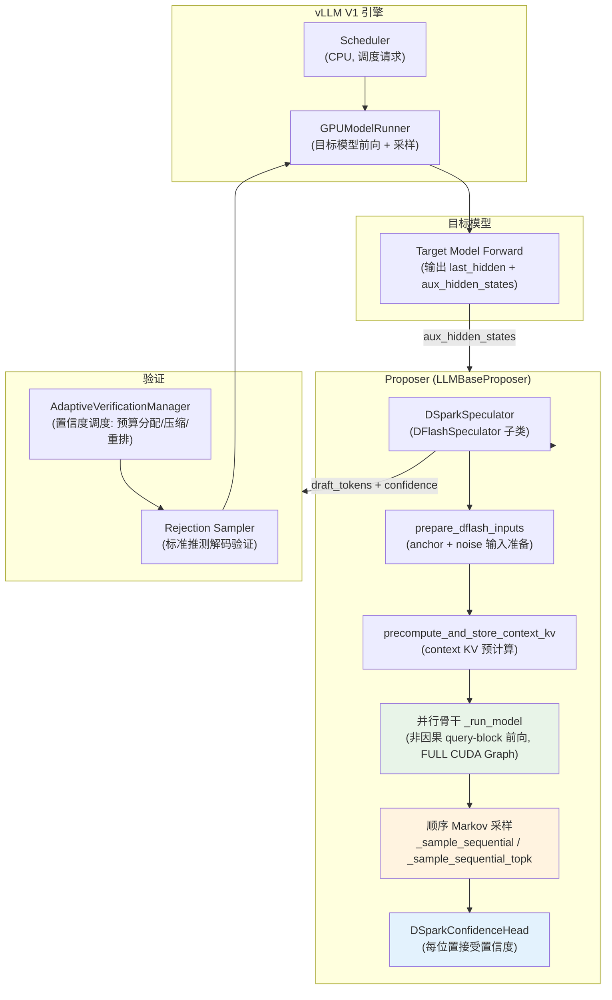

### 1.2.2 核心组件与职责划分

| 组件 | 文件 | 职责 |
|------|------|------|
| `DSparkSpeculator` | `vllm/v1/worker/gpu/spec_decode/dspark/speculator.py` | 草稿生成调度：输入准备 → 并行骨干 → 顺序 Markov 采样 → 置信度计算 |
| `DFlashSpeculator` | `vllm/v1/worker/gpu/spec_decode/dflash/speculator.py` | DSpark 的父类，提供并行起草的基础设施（query 布局、context KV 预计算、CUDA Graph 管理） |
| `DSparkMarkovHead` | `vllm/model_executor/models/qwen3_dspark.py` | 低秩转移头 $V \times r$ → $r \times V$，为 base logits 注入一阶 Markov bias |
| `DSparkConfidenceHead` | `vllm/model_executor/models/qwen3_dspark.py` | 接受置信度估计头，sigmoid 输出每位置存活概率 |
| `AdaptiveVerificationManager` | `vllm/v1/worker/gpu/spec_decode/adaptive_verification.py` | 置信度调度验证：预算决策（CPU）、batch 压缩、草稿 slot 重排（GPU） |
| 非因果 Sparse MLA | `vllm/v1/attention/backends/mla/sparse_swa.py` | DeepSeek-V4 上实现 block 内非因果注意力的索引驱动 kernel |
| 草稿模型 | `qwen3_dspark.py` / `gemma4_dspark.py` / `models/deepseek_v4/*/dspark.py` | 各架构的 DSpark 草稿模型（DFlash 骨干 + Markov/Confidence 头） |

### 1.2.3 数据流与控制流分析

一个完整 decode step 的数据流如下（详细代码走读见第三部分）：

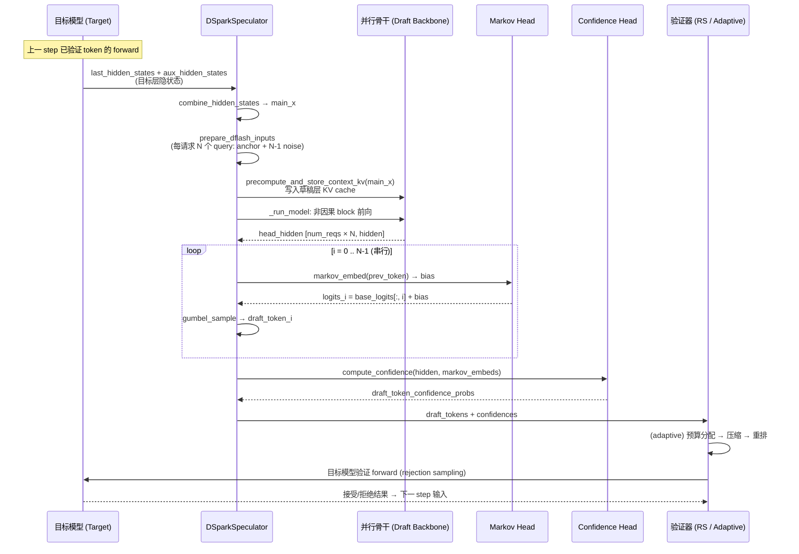

## 1.3 关键指标定义

| 指标 | 定义 | DSpark 中的角色 |
|------|------|----------------|
| **Acceptance rate** | 草稿 token 被目标模型接受的比例 | 草稿质量的核心度量；Markov 头旨在提升它 |
| **Average acceptance length ($k$)** | 每次验证平均接受的 token 数 | 推测解码吞吐增益的近似倍数 |
| **Survival probability** | 验证进行到第 $i$ 个草稿位置仍被接受的概率（= 前 $i$ 个位置置信度的连乘，$\prod_{j \le i} c_j$） | 置信度调度的打分依据 |
| **Draft budget** | 本 step 全局允许验证的草稿 token 总数 | Adaptive verification 的决策变量 |
| **Draft cost / Verify cost** | 起草与验证的耗时曲线（按请求数/token 数查表） | 调度器优化的目标函数 $\max \frac{\text{accepted tokens}}{\text{cost}}$ |

---

# 第二部分: 核心接口与基类分析

## 2.1 Speculator 类层次

DSpark 在 vLLM V1 的 speculator 继承体系中处于"并行起草"分支，与 MTP / EAGLE 的自回归分支平行：

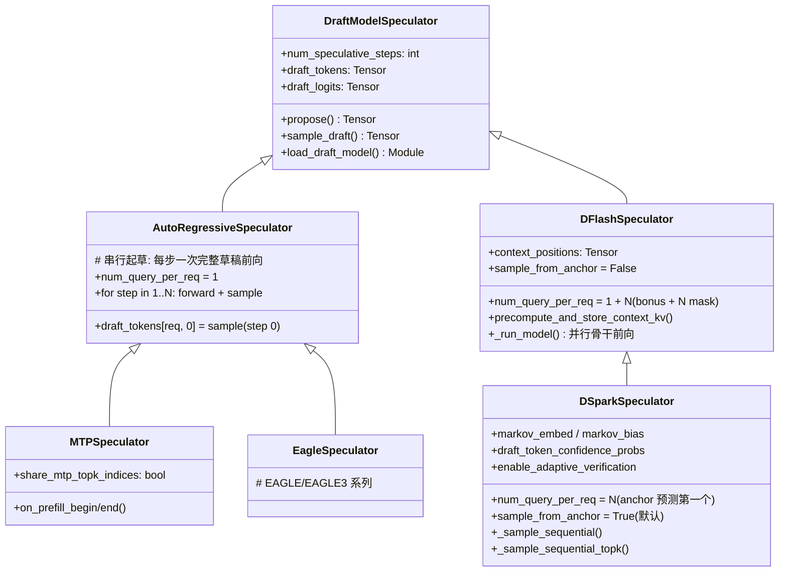

> **关键洞察**: DSpark **不是** MTP 或 EAGLE 的变体，而是 DFlash 的增强——它完整复用了 DFlash 的并行起草基础设施（context-KV 预计算、非因果 query-block 前向、FULL CUDA Graph 捕获），只在"采样阶段"引入了串行 Markov 头和置信度头。这与 MTP/EAGLE 的"串行前向"路线有本质区别。

## 2.2 核心类定义

```python
# 文件: vllm/v1/worker/gpu/spec_decode/dspark/speculator.py
"""DSpark speculator: semi-autoregressive parallel drafting.

DSpark drafts a block of ``num_speculative_tokens`` tokens in one parallel pass
(reusing the DFlash machinery: context-KV precompute + a query-block forward),
then injects intra-block dependency with a lightweight sequential Markov head.

Differences from DFlash:
  * Anchor-as-first-prediction: each request emits exactly ``N =
    num_speculative_tokens`` query tokens (anchor + N-1 noise), NOT ``1 + N``.
    Every query position is a prediction (the anchor predicts the first draft
    token), so we sample at all N positions and ``sample_pos = query_pos + 1``
    (standard next-token), whereas DFlash's masks sit AT the predicted position.
  * Sequential Markov sampling: instead of DFlash's single parallel sample, we
    sample left-to-right, adding a prefix-dependent Markov bias derived from the
    previously sampled token at each step.
"""

class DSparkSpeculator(DFlashSpeculator):
    _speculator_name = "DSpark"

    def __init__(self, vllm_config: VllmConfig, device: torch.device):
        super().__init__(vllm_config, device)

        # Whether to sample from the anchor position. When True, uses anchor-as-first
        # (N slots, each position predicts the next token). When False, uses 1+N
        # fill-in block (anchor is a bonus token).
        self.sample_from_anchor = getattr(
            self.draft_model_config.hf_config, "sample_from_anchor", True
        )
        if self.sample_from_anchor:
            self.num_query_per_req = self.num_speculative_steps
        else:
            self.num_query_per_req = 1 + self.num_speculative_steps

        # DSpark consumes mean-pooled target aux hidden states at the target
        # layers, combined to hidden_size via main_proj.
        self.hidden_states = torch.zeros(
            self.max_num_tokens, draft_hidden, dtype=self.dtype, device=device
        )

        # Reduced-vocab probabilistic drafting only; set in load_draft_model.
        self._draft_topk: int | None = getattr(
            self.draft_model_config.hf_config, "dspark_draft_topk", None
        )

        self.draft_token_confidence_probs = torch.empty_like(
            self.draft_tokens, dtype=torch.float32
        )
        self.enable_adaptive_verification = (
            self.speculative_config.enable_adaptive_verification
        )
```

**query 布局是理解 DSpark 的关键**，两种模式对比：

| 布局 | `sample_from_anchor` | `num_query_per_req` | 语义 | 使用场景 |
|------|---------------------|---------------------|------|---------|
| **anchor-as-first-prediction** | `True`（默认） | $N$ | anchor 位置的 hidden 预测第 1 个草稿 token，其余 $N-1$ 个 noise 位置预测第 2..N 个；每个 query 位置都是预测 | DSpark 标准 checkpoint（如 `dspark_qwen3_*`） |
| **1+N fill-in** | `False` | $1+N$ | anchor 是"奖励 token"（bonus），只有 $N$ 个 mask/noise 位置预测 | Speculators-format checkpoint，沿用 DFlash 布局 |

DFlash 固定使用 1+N 布局（`DFlashSpeculator.__init__` 中直接 `raise ValueError` 拒绝 `sample_from_anchor=True`），因此"anchor 也是预测"是 DSpark 相对 DFlash 的独有设计——它让同样数量的 query token 多产出一次预测，等价于在相同计算量下把草稿块拉长 1 个 token。

## 2.3 草稿模型类层次（以 Qwen3 为例）

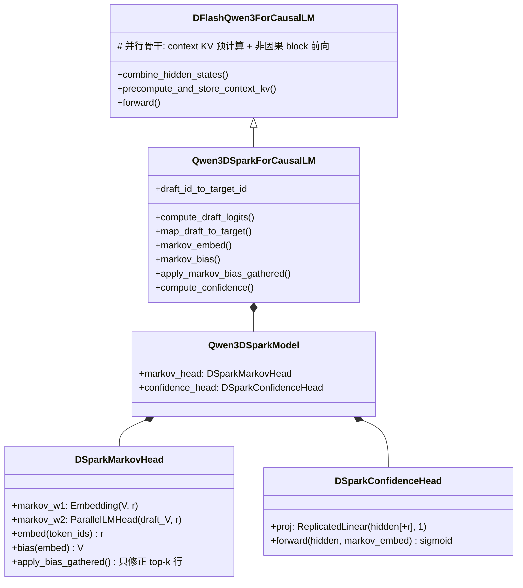

Markov 头是低秩分解的转移矩阵：

```python
# 文件: vllm/model_executor/models/qwen3_dspark.py
class DSparkMarkovHead(nn.Module):
    """Sequential transition-bias head (low-rank V x r, r x V).

    ``markov_w1[token]`` embeds the previously sampled token (target vocab,
    ``vocab_size``); ``markov_w2`` projects it to a draft-vocab bias
    (``draft_vocab_size``) added to the base draft logits.
    """
    def __init__(self, vocab_size, draft_vocab_size, markov_rank, prefix,
                 quant_config=None):
        super().__init__()
        self.markov_w1 = nn.Embedding(vocab_size, markov_rank)
        self.markov_w2 = ParallelLMHead(
            draft_vocab_size, markov_rank, bias=False,
            quant_config=quant_config,
            prefix=maybe_prefix(prefix, "markov_w2"),
            disable_tp=True,   # 复制而非切分: 每步串行,切分会引入 all-reduce
        )
```

数学上，第 $i$ 个位置的采样分布为：

$$p_i(t) = \mathrm{softmax}\big(\underbrace{\mathrm{Backbone}(x)[i]}_{\text{并行骨干 base logits}} + \underbrace{\mathbf{W}_2\, \mathbf{e}(t_{i-1})}_{\text{一阶 Markov bias}}\big)$$

其中 $\mathbf{e}(t_{i-1}) \in \mathbb{R}^r$ 是上一个已采样 token 的低秩嵌入（$r$ 即 `markov_rank`，典型值为 16~64），$\mathbf{W}_2 \in \mathbb{R}^{V \times r}$。**骨干前向只需一次**，$N$ 步串行采样只涉及 embedding 查表和一个 $r \to V$ 的小矩阵乘，开销远小于自回归草稿的 $N$ 次完整前向。

## 2.4 配置接口

```python
# 文件: vllm/config/speculative.py
DSparkModelTypes = Literal["dspark"]

class SpeculativeConfig(VllmConfigBaseModel):
    method: SpeculativeMethod  # 含 "dspark"
    ...
    enable_adaptive_verification: bool = False
    """Whether to enable adaptive verification, which uses the DSpark draft model's
    confidence. Currently only supported for method="dspark"."""
    ...
    dspark_draft_topk: int | None = Field(default=None, ge=1)
    """For Qwen3 DSpark drafting, evaluate the Markov projection only for the
    top-k candidates of the base draft logits."""
```

工厂方法按 checkpoint 自动推断方法（`speculative.py` 的 `__post_init__`）：

```python
# 文件: vllm/config/speculative.py (节选)
if "dspark" in self.draft_model_config.model.lower() \
        or "Qwen3DSparkModel" in self.draft_model_config.architectures \
        or "Gemma4DSparkModel" in self.draft_model_config.architectures \
        or "DSparkDraftModel" in self.draft_model_config.architectures:
    self.method = "dspark"
```

另一个关键能力：**DeepSeek-V4 的 DSpark 权重可以直接内嵌在目标 checkpoint 中**（`speculative.py` 中 `elif self.method == "dspark":` 分支处理 `target_model_config`），生产部署时无需额外的草稿模型仓库。

---

# 第三部分: 核心实现深度分析

## 3.1 一个 decode step 的完整执行流程

DSpark 起草的入口是 `propose()`（继承自 DFlash，`vllm/v1/worker/gpu/spec_decode/dflash/speculator.py:316`）。按执行顺序拆解：

### 3.1.1 步骤 1：目标隐状态合并

目标模型在验证前向中输出指定层（`target_layer_ids`）的 aux hidden states。DSpark 将其拼接并投影，得到草稿骨干的输入 `main_x`：

```python
# 文件: vllm/v1/worker/gpu/spec_decode/dflash/speculator.py (propose 内)
if aux_hidden_states:
    hidden_states = self.model.combine_hidden_states(
        torch.cat(aux_hidden_states, dim=-1)
    )
else:
    hidden_states = last_hidden_states
self.hidden_states[:num_target_tokens].copy_(hidden_states[:num_target_tokens])
```

```python
# 文件: vllm/models/deepseek_v4/nvidia/dspark.py
def combine_hidden_states(self, aux_hidden_states: torch.Tensor) -> torch.Tensor:
    """main_x = main_norm(main_proj(concat of target aux hidden states)).

    ``aux_hidden_states`` is [T, hidden_size * len(target_layer_ids)].
    """
    return self.main_norm(self.main_proj(aux_hidden_states))
```

> **注意**: 与 DeepSeek-V4 MTP 不同，DSpark 的 `main_x` 是目标层隐状态**拼接后经 `main_proj` 线性压缩**的结果（MTP 使用的是目标模型最后一层 hidden state，不经过拼接投影）。因此 DSpark 在 speculator 里单独分配了 `self.hidden_states` 缓冲区，而不是复用 MTP 的预分配缓冲（见 `DSparkSpeculator.__init__` 注释）。

### 3.1.2 步骤 2：输入准备（anchor + noise 布局）

`prepare_dflash_inputs`（kernel 实现于 worker spec_decode utils）为每个请求准备 $N$（或 $1+N$）个 query token：

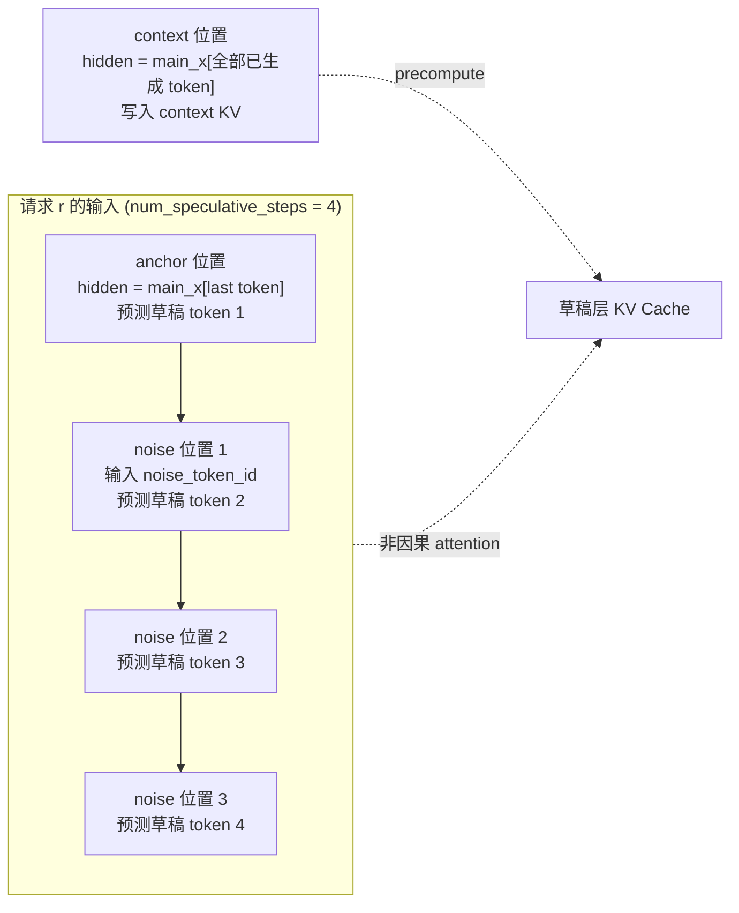

- **context 位置**：该请求全部已生成 token 对应的 `main_x` 行，用于预计算 context KV；
- **anchor 位置**：最后一个已生成 token 的 `main_x` 行，`sample_from_anchor=True` 时它就是第一个预测位置；
- **noise 位置**：$N-1$ 个占位 token（`dspark_noise_token_id`，作用类似 DFlash 的 mask token），由并行骨干非因果地"看到"整块上下文后输出各自的 hidden。

token id 解析逻辑（`vllm/v1/worker/gpu/spec_decode/utils.py:55`）：

```python
def get_parallel_drafting_token_id(hf_config) -> int:
    """Checks (in order): `dflash_config.mask_token_id`, top-level `mask_token_id`,
    `dspark_noise_token_id`, `pard_token`, `ptd_token_id`. Raises ValueError if
    none is set."""
```

### 3.1.3 步骤 3：Context KV 预计算

并行骨干的注意力**只对 query token 计算**，其 KV cache 中"上下文"部分由目标隐状态预先投影写入。DeepSeek-V4 的实现展示了这一设计：

```python
# 文件: vllm/models/deepseek_v4/nvidia/dspark.py
@torch.inference_mode()
def precompute_and_store_context_kv(
    self, main_x, context_positions, context_slot_mappings=None,
) -> None:
    """Insert the sliding-window context KV for every draft layer.

    Mirrors the reference DSparkAttention: each layer derives its context KV
    from the SAME projected target hidden ``main_x``, via that layer's own
    ``wkv`` + ``kv_norm`` + RoPE + quant, then writes it at the
    layer's context slots.
    """
    for i, layer in enumerate(self.layers):
        slot_mapping = (
            None if context_slot_mappings is None else context_slot_mappings[i]
        )
        attn = layer.attn
        # Optimized DSV4 MLA path: wkv part of the fused wq_a|wkv projection
        # (q_lora part discarded), then RoPE/quant/insert via the fused op.
        qr_kv, _ = attn.fused_wqa_wkv(main_x)
        kv = qr_kv[..., attn.q_lora_rank :]
        kv = attn.kv_norm(kv)
        if slot_mapping is None:
            continue
        _insert_context_kv(attn, kv, context_positions, slot_mapping)
```

这一步骤**在 CUDA Graph 之外 eager 执行**（context 形状每步变化），而 query-block 前向与顺序采样则被 FULL CUDA Graph 完整捕获。

### 3.1.4 步骤 4：并行骨干前向

```python
# 文件: vllm/v1/worker/gpu/spec_decode/dspark/speculator.py
def _generate_draft(self, num_reqs, num_tokens_padded, attn_metadata,
                    slot_mappings, num_tokens_across_dp,
                    cudagraph_runtime_mode=CUDAGraphMode.NONE) -> None:
    # Full draft step (captured under CUDA graph): parallel backbone forward
    # then sequential Markov sampling over its hidden state outputs.
    head_hidden = self._run_model(
        num_tokens_padded, attn_metadata, slot_mappings,
        num_tokens_across_dp, cudagraph_runtime_mode,
    )
    self._sample_sequential(num_reqs, head_hidden)
```

骨干前向 `_run_model` 就是一次标准的 decoder 前向，输入为全部请求的 anchor + noise token（共 `num_reqs × N` 行）。**块内注意力是非因果的**：每个 query token 同时 attend 到滑动窗口 context 和块内所有 token（包括未来的 noise 位置），这正是并行草稿能"一次看清整块"的基础。

### 3.1.5 步骤 5：顺序 Markov 采样（DSpark 的核心增量）

```python
# 文件: vllm/v1/worker/gpu/spec_decode/dspark/speculator.py
def _sample_sequential(self, num_reqs: int, head_hidden: torch.Tensor) -> None:
    if self._draft_topk is not None:
        self._sample_sequential_topk(num_reqs, head_hidden)
        return

    # Sequential Markov sampling over the backbone's output hidden states.
    n_spec = self.num_speculative_steps
    num_sample = num_reqs * n_spec
    # Per-(req, position) head hidden, ordered (req, step).
    sample_hidden = head_hidden[self.sample_indices[:num_sample]]
    # Draft-vocab logits; sampled ids are remapped to target vocab below.
    base_logits = self.model.compute_draft_logits(sample_hidden)
    vocab_size = base_logits.shape[-1]
    base_logits = base_logits.view(num_reqs, n_spec, vocab_size)

    idx_map = self.sample_idx_mapping[:num_sample].view(num_reqs, n_spec)
    sample_pos = self.sample_pos[:num_sample].view(num_reqs, n_spec)
    confidence_markov_embeds = []

    # Anchor (bonus) token per request = the input id at query offset 0,
    # read via the precomputed persistent index (fixed buffer for capture).
    prev = self.input_buffers.input_ids[self._anchor_idx[:num_reqs]]

    for i in range(n_spec):
        # Sequential stage: Markov bias from the previously sampled token.
        markov_embed = self.model.markov_embed(prev)
        if self.enable_adaptive_verification:
            confidence_markov_embeds.append(markov_embed)
        bias = self.model.markov_bias(markov_embed)
        logits_i = base_logits[:, i] + bias
        draft_sampled_i = self._sample_logits(
            logits_i, idx_map[:, i], sample_pos[:, i], i
        )
        self.draft_tokens[:num_reqs, i] = draft_sampled_i
        prev = draft_sampled_i

    if self.enable_adaptive_verification:
        confidence = self.model.compute_confidence(
            sample_hidden,
            torch.stack(confidence_markov_embeds, dim=1).flatten(0, 1),
        )
        self.draft_token_confidence_probs[:num_reqs] = confidence.view(
            num_reqs, n_spec
        )
```

要点解析：

1. **`base_logits` 一次性算完**（所有请求 × 所有位置），来自并行骨干的 `head_hidden`，这就是"半自回归"中"并行"的部分；
2. **循环只做轻量计算**：`markov_embed` 是 embedding 查表（$V \to r$），`markov_bias` 是 $r \to V$ 的小矩阵乘——没有 attention、没有 MLP；
3. **块内依赖通过 `prev` 传播**：第 $i$ 步采出的 token 成为第 $i+1$ 步 Markov 头的输入，形成一阶马尔可夫链；
4. **`sample_pos = query_pos + 1`**：anchor-as-first 布局下，位置 $i$ 的 query 预测的是第 $i+1$ 个 token，采样种子以 `sample_pos - 1`（即 query 自身位置）为 key；
5. 整个循环（连同骨干前向）被 **FULL CUDA Graph 捕获**（`DFlashCudaGraphManager`，`decode_query_len=num_query_per_req`），eager 模式只有 context KV 预计算。

**采样函数**还处理了 draft vocab 与 target vocab 不一致的情况：

```python
# 文件: vllm/v1/worker/gpu/spec_decode/dspark/speculator.py
def _sample_logits(self, logits, idx_map, sample_pos, step):
    if self.draft_logits is None:
        return self.model.map_draft_to_target(logits.argmax(dim=-1))

    # Probabilistic sampling and rejection operate in target-vocabulary
    # space. A reduced draft vocabulary is scattered into its target rows.
    if self._d2t_scatter_index is not None:
        buf = self._draft_scatter_buf[: logits.shape[0]]
        buf.index_copy_(1, self._d2t_scatter_index, logits.to(buf.dtype))
        logits = buf

    # sample_pos is the predicted token's position P. Sampling keys a draw
    # by the position before the sampled token, P-1.
    return gumbel_sample(
        logits, idx_map, self.temperature, self.seeds, sample_pos - 1,
        apply_temperature=True, is_drafting=True,
        logits_cache=self.draft_logits, logits_cache_col=self._step_cols[step],
        use_fp64=self.use_fp64_gumbel,
    )
```

减词表草稿（`draft_vocab_size < target_vocab_size`，如 512 个高频 token）通过 checkpoint 中的 `d2t`（draft-id → target-id）映射把 logits scatter 回目标词表再采样，rejection sampling 全程在目标词表空间进行。

### 3.1.6 步骤 6：top-k 优化（`dspark_draft_topk`）

对 Qwen3 类草稿，`markov_bias` 是 $r \to V$ 的稠密投影，$V \approx 150k$ 时每步仍有可观开销。`dspark_draft_topk` 开启后，Markov 修正只作用于 base logits 的 top-k 候选：

```python
# 文件: vllm/v1/worker/gpu/spec_decode/dspark/speculator.py
def _sample_sequential_topk(self, num_reqs: int, head_hidden: torch.Tensor) -> None:
    """Apply the sequential Markov head only to top-k base-logit candidates.

    Candidate selection is done once for all draft positions. At each
    sequential step, the selected logits are corrected in place and every
    other entry is set to ``-inf``. The normal dense sampling and rejection
    paths then consume that truncated distribution unchanged.
    """
    ...
    base_logits = self.model.compute_draft_logits(sample_hidden)
    base_logits = base_logits.view(num_reqs, n_spec, -1)
    base_values, draft_indices = base_logits.topk(self._draft_topk, dim=-1)
    # Reuse the dense backbone output as the normal sampler's input. Fill
    # once for all positions, then scatter only the corrected candidates
    # during the sequential loop.
    base_logits.fill_(float("-inf"))
    ...
    for i in range(n_spec):
        markov_embed = self.model.markov_embed(prev)
        logits_i = self.model.apply_markov_bias_gathered(
            markov_embed,
            base_logits[:, i],
            base_values[:, i],
            draft_indices[:, i],
        )
        draft_sampled_i = self._sample_logits(logits_i, idx_map[:, i], sample_pos[:, i], i)
        ...
```

```python
# 文件: vllm/model_executor/models/qwen3_dspark.py
def apply_bias_gathered(self, markov_embed, logits, values, index, scale=1.0):
    """Apply the Markov bias only to selected rows of ``logits``.

    The caller initializes ``logits`` to ``-inf`` once for all draft
    positions. This method scatters the corrected candidate values into
    that dense buffer so the normal sampler sees the truncated proposal.
    """
    weight = self.markov_w2.weight[index]
    corrected = values.unsqueeze(-1)
    corrected.baddbmm_(weight, markov_embed.unsqueeze(-1), beta=1.0, alpha=scale)
    return logits.scatter_(1, index, corrected.squeeze(-1))
```

只对 top-k 行做 batched 矩阵乘（`baddbmm`），其余置 `-inf`——修正后的分布被截断到 top-k 候选上。测试 `tests/v1/spec_decode/test_dspark_topk.py` 验证了该路径与稠密全词表计算的结果一致性。

### 3.1.7 步骤 7：置信度计算

```python
# 文件: vllm/model_executor/models/qwen3_dspark.py
class DSparkConfidenceHead(nn.Module):
    """DSpark acceptance-confidence head."""
    def __init__(self, input_dim, prefix, bias=False, with_markov=True):
        super().__init__()
        self.with_markov = with_markov
        self.proj = ReplicatedLinear(
            input_dim, 1, bias=bias, return_bias=False,
            params_dtype=torch.float32,   # 置信度对数值精度敏感,用 fp32
            prefix=maybe_prefix(prefix, "proj"),
        )

    def forward(self, hidden: torch.Tensor, markov_embed: torch.Tensor) -> torch.Tensor:
        x = (
            torch.cat([hidden, markov_embed], dim=-1) if self.with_markov else hidden
        ).float()
        return self.proj(x).squeeze(-1)

# Qwen3DSparkForCausalLM
def compute_confidence(self, head_hidden, markov_embed):
    """Per-position acceptance probability for each drafted token."""
    return torch.sigmoid(self.model.confidence_head(head_hidden, markov_embed))
```

置信度头输入 = 骨干 head hidden（可选拼接当前 Markov 嵌入），输出 sigmoid 后的 $\hat{c} \in [0,1]$，代表"验证进行到该位置仍被接受"的概率估计。训练时用实际验证结果作为标签（DeepSpec 训练栈）。

## 3.2 非因果 Sparse MLA：DeepSeek-V4 的注意力实现

DeepSeek-V4 使用 sparse MLA（滑动窗口 + 索引 top-k），天然无法用稠密 attention mask 表达"块内非因果"。DSpark 的做法是**扩展索引宽度**：每个 query 的索引列表 = 滑动窗口 context（`window_size` 项）+ 块内全部其他 token（`block_size - 1` 项）：

```python
# 文件: vllm/v1/attention/backends/mla/compressor_utils.py
_DSPARK_SWA_INDEX_ALIGNMENT = 64

def get_dspark_swa_index_width(window_size: int, num_speculative_tokens: int) -> int:
    """Return the padded width of non-causal DSpark SWA indices."""
    width = max(int(window_size), 0) + max(int(num_speculative_tokens), 0)
    return cdiv(width, _DSPARK_SWA_INDEX_ALIGNMENT) * _DSPARK_SWA_INDEX_ALIGNMENT
```

```python
# 文件: vllm/v1/attention/backends/mla/sparse_swa.py (DeepseekV4SWAMetadataBuilder.build 内)
non_causal = not common_attn_metadata.causal
decode_swa_width = (
    self.noncausal_index_width if non_causal else self.window_size
)
...
if non_causal:
    assert self.is_dspark, (
        "Non-causal DeepseekV4 SWA is only supported for the DSpark "
        "speculation mode, but causal=False was set without DSpark."
    )
    if self.decode_swa_indices_noncausal is None:
        self.decode_swa_indices_noncausal = torch.zeros(
            self._max_tokens, 1, self.noncausal_index_width,
            dtype=torch.int32, device=self.device,
        )
    decode_swa_indices = self.decode_swa_indices_noncausal
    _compute_dspark_noncausal_swa_indices_kernel[(num_decode_tokens,)](
        decode_swa_indices, decode_swa_indices.stride(0),
        self.decode_swa_lens, self.window_size, self.noncausal_index_width,
        query_start_loc, seq_lens, token_to_req_indices, is_valid_token,
        block_table, block_table.stride(0), self.block_size, ...
    )
```

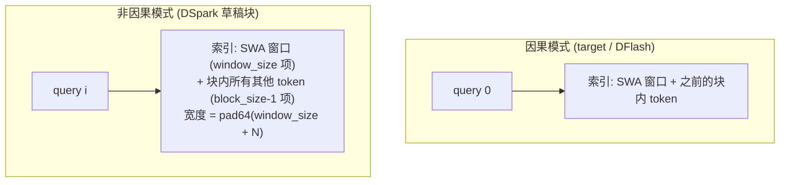

索引宽度从 `window_size` 扩到 `pad64(window_size + num_speculative_tokens)`（对齐 64 以满足 kernel 的 B_TOPK 约束），由索引驱动的 sparse attention kernel 自然实现"attend 到未来"。对 FlashInfer MLA 后端则声明 `supports_non_causal_multi_token_decode = True`，非因果 DSpark 块在 forward 中被展平为单 token 行处理。

> **注意**: 非因果注意力**只用于草稿模型的 query-block 前向**。目标模型验证与正常 decode 完全保持因果，因此输出分布不受任何影响。

## 3.3 Adaptive Verification：置信度调度验证

### 3.3.1 动机

传统推测解码每步固定验证 $N$ 个草稿。但在高并发生产中，验证低接受概率的草稿位置会挤占 batch capacity——**验证 4 个大概率存活 1 个的草稿，不如验证 2 个高置信度草稿**。DSpark 的置信度头让"按预期收益分配验证算力"成为可能。

### 3.3.2 三步调度流程

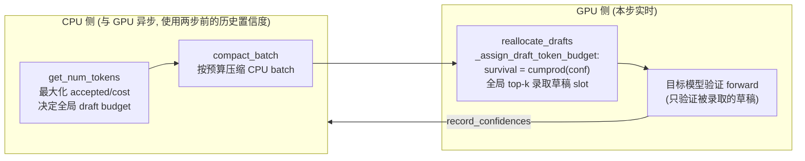

**CPU 侧预算决策**（`get_num_tokens`，`vllm/v1/worker/gpu/spec_decode/adaptive_verification.py:269`）：

```python
scheduled_drafts = np.fromiter(
    (len(draft_tokens.get(req_id, ())) for req_id in req_ids), dtype=np.int32, ...)
num_non_draft_tokens = scheduled_tokens - scheduled_drafts
...
stale_confidences = self._stale_confidences[self._stale_idx].np[slots]
survival_probability = np.cumprod(stale_confidences.astype(np.float64), axis=1)
steps = np.arange(self.num_speculative_steps)
valid = steps[None, :] < scheduled_drafts[:, None]
scores = np.sort(survival_probability[valid])[::-1]   # 所有草稿 slot 按存活率排序
...
draft_cost_ms, verify_cost_ms = self.cost_tables
# 期望接受 token 数: 1 (bonus) + 前 k 个 slot 存活率之和
num_tokens_to_estimated_accepted_tokens = np.concatenate(
    ([num_sampling_requests], num_sampling_requests + np.cumsum(scores))
)
costs = (draft_cost_ms[len(req_ids)]
         + verify_cost_ms[num_non_draft_tokens_total : num_non_draft_tokens_total + max_draft_budget + 1])
draft_budget = int(np.argmax(num_tokens_to_estimated_accepted_tokens / costs))
```

核心优化目标：

$$\text{budget}^* = \arg\max_b \frac{\text{expected accepted tokens}(b)}{\text{draft cost}(n_{\text{reqs}}) + \text{verify cost}(n_{\text{non-draft}} + b)}$$

**GPU 侧重排**（`_assign_draft_token_budget`，torch.compile 编译的 kernel）：

```python
def _assign_draft_token_budget(confidence_probs, idx_mapping, capacities,
                               draft_budget, num_steps):
    """Admit the globally best `draft_budget` draft slots, in place.

    Every (request, step) slot is scored by its survival probability, the running
    product of that request's per-position confidences, and the highest scores win.
    Survival only decreases along a request, so a global top-k always admits
    continuously along steps with a request.
    """
    survival = confidence_probs[idx_mapping].cumprod(dim=1)
    steps = torch.arange(num_steps, device=survival.device)
    out_of_range = steps[None, :] >= capacities[:, None]
    survival = survival.masked_fill(out_of_range, -float("inf"))
    flat = survival.flatten()
    winners = flat.topk(draft_budget).indices
    admitted = torch.zeros_like(flat, dtype=torch.bool).index_fill_(0, winners, True)
    torch.sum(admitted.view_as(survival), dim=1, dtype=capacities.dtype, out=capacities)
```

由于 survival 沿位置单调递减，全局 top-k 录取天然保证"每个请求被录取的是连续前缀"——不会出现"跳过第 1 个草稿验证第 3 个"的非法布局。

**异步设计**：CPU 决策使用**两步前**的置信度（`_stale_confidences` 双缓冲 + copy stream + event 同步），把 D2H 拷贝和 CPU 计算完全隐藏在 GPU 执行之后，兼容零开销调度（ZOS）与连续 CUDA Graph 回放。

**代价表**（`build_cost_tables_from_curves`）：启动时对各个 batch 尺寸做 profiling（`batches_to_profile` 生成 dummy-run 尺寸，含 capture limit 之外的 tail 尺寸做 JIT 预热），按中位数拟合 draft/verify 耗时曲线；在 CUDA Graph capture limit 之下耗时是"填充到捕获尺寸"的阶梯函数，之上才是连续曲线（线性插值/外推）。

### 3.3.3 验证与目标分布无损性

无论是否开启 adaptive verification，最终验证都是标准 **rejection sampling**：以目标模型 logits 与草稿分布逐位置比较，按 $\min(1, p_{\text{target}}/q_{\text{draft}})$ 概率接受。置信度调度只决定"验证哪些位置"，不改变每个被验证位置的接受判定规则，因此**目标模型输出分布严格无损**（这也是论文强调的 lossless 属性）。

## 3.4 模型加载与权重共享

```python
# 文件: vllm/v1/worker/gpu/spec_decode/dspark/utils.py
def load_dspark_model(target_model: nn.Module, vllm_config: VllmConfig) -> nn.Module:
    ...
    draft_attention_backend = _resolve_dspark_attention_backend(
        draft_model_config,
        speculative_config.attention_backend,
        vllm_config.attention_config.backend,
    )
    # DeepSeek-V4 draft layers share the target's KV-cache layout.
    if draft_model_config.hf_config.model_type == "deepseek_v4":
        if target_backend is not None:
            logger.info_once("Using the target model's %s attention backend "
                             "for the DeepSeek-V4 DSpark drafter.", ...)
        return target_backend
    ...
    draft_vllm_config = replace(
        vllm_config,
        attention_config=replace(vllm_config.attention_config,
            use_non_causal=dflash_has_any_non_causal(draft_model_config.hf_config),
            backend=draft_attention_backend),
        cache_config=replace(..., cache_dtype=speculative_config.kv_cache_dtype) ...,
    )
    with set_model_tag("dspark_head"):
        draft_model = get_model(vllm_config=draft_vllm_config, model_config=draft_model_config)

    # embed_tokens / lm_head 共享: 与目标模型别名,不占额外显存
    target_inner = target_language_model.model
    draft_inner = draft_model.model
    if (target_embed is not None and draft_model_config.get_vocab_size() <= target_vocab_size
            and _should_share(draft_model, "has_own_embed_tokens", draft_embed, target_embed)):
        del draft_inner.embed_tokens
        draft_inner.embed_tokens = target_embed   # 直接别名目标模型的权重
    ...
    if (target_lm_head is not None and draft_output_vocab_size == target_vocab_size
            and _should_share(draft_model, "has_own_lm_head", draft_lm_head, target_lm_head)):
        del draft_model.lm_head
        draft_model.lm_head = target_lm_head
    return draft_model
```

与 EAGLE 系相同的共享机制（`_should_share` / `get_target_lm_head` 复用自 `eagle/utils.py`）：草稿 checkpoint 若不带 embed/lm_head 权重，则直接别名目标模型的对应模块（`has_own_*` 标志由 `process_eagle_weight` 在加载时设置）。DeepSeek-V4 的 DSpark 还共享目标模型的 KV-cache 布局，草稿层写入与目标层相同格式的 cache。

---

# 第四部分: DSpark vs MTP vs Spec Decode 全面对比

## 4.1 三者关系定位

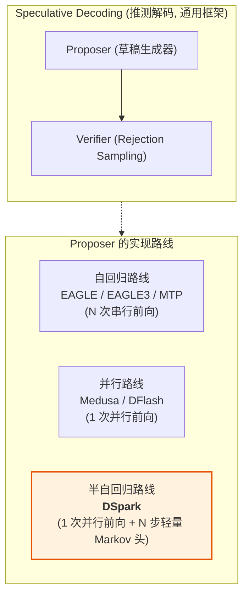

- **Speculative Decoding** 是框架：proposer 起草 + 目标模型 rejection sampling 验证，任何草稿生成器都可接入；
- **MTP** 和 **DSpark** 都是**特定架构的 proposer 实现**，且都与目标模型深度耦合（共享 embedding/lm_head、使用目标隐状态），属于 "self-speculative decoding"（自推测解码）家族；
- vLLM 中三者共用同一套验证基础设施（`rejection_sampler.py`），差异完全在 proposer 侧。

## 4.2 核心对比表

| 维度 | MTP (Multi-Token Prediction) | DFlash (并行草稿) | **DSpark (半自回归草稿)** |
|------|------------------------------|-------------------|--------------------------|
| **草稿生成方式** | 目标模型训练时附带 $N$ 个 MTP 模块，逐模块**串行前向** $N$ 次 | 1 次**并行** query-block 前向，$N$ 位置独立 | 1 次并行骨干前向 + $N$ 步**轻量 Markov 头串行采样** |
| **块内依赖** | 完整：模块 $i$ 以上一模块的**完整输出 hidden** 为输入 | 无（各位置独立） | 一阶 Markov 近似：只依赖上一个采样 token 的低秩嵌入 |
| **起草前向代价** | 高：$N$ 次草稿前向（含 attention/MLP） | 低：1 次前向 | 低：1 次前向 + 每步 1 次 embedding 查表 + $r \to V$ 小矩阵乘 |
| **草稿质量（后缀位置）** | 高，无 suffix decay | 低，multi-modal collision / suffix decay 严重 | 中高，Markov bias 缓解 suffix decay |
| **平均接受长度（论文, Qwen3-4B）** | 基线（EAGLE3 同族） | −16.3%（相对 DSpark） | 比自回归草稿 +30.9%，比 DFlash +16.3% |
| **额外训练** | 与目标模型**联合训练**（MTP loss，改动目标模型训练） | 独立蒸馏（DeepSpec） | 独立蒸馏（DeepSpec，含 Markov 头 + confidence 头） |
| **vLLM 实现类** | `MTPSpeculator(AutoRegressiveSpeculator)` | `DFlashSpeculator(DraftModelSpeculator)` | `DSparkSpeculator(DFlashSpeculator)` |
| **query 布局** | 每步 1 个 query token | $1+N$（bonus + $N$ mask） | $N$（anchor 预测第 1 个 + $N-1$ noise） |
| **草稿 KV cache** | 复用目标 KV 或自产（每步串行写） | context KV 由目标隐状态预计算一次 | 同 DFlash（每层用自己的 wkv 从 main_x 投影） |
| **注意力因果性** | 因果 | 非因果 block | 非因果 block（DSV4 用 sparse MLA 索引扩展实现） |
| **验证方式** | 固定 $N$ 个 rejection sampling | 固定 $N$ 个 | 固定 $N$ 个，或 **adaptive verification**（置信度调度预算，仅 DSpark 支持） |
| **典型部署** | DeepSeek-V3/R1 的 MTP-1 | 研究/基线 | **DeepSeek-V4 生产环境（替代 MTP-1）**，单用户提速 60–85% |

## 4.3 架构细节对比

### 4.3.1 输入来源

| 方法 | 草稿模型输入 |
|------|-------------|
| MTP (DeepSeek 系列) | 目标模型**最后一层** hidden state（`last_hidden_states`），共享 embedding |
| EAGLE3 | 目标**指定层** hidden state（`target_layer_ids`），可能带投影 |
| DFlash | 目标指定层 aux hidden states **拼接 + main_proj 投影** → `main_x` |
| DSpark | 同 DFlash：`main_norm(main_proj(concat(aux_hidden_states)))` |

### 4.3.2 执行时间线对比（`num_speculative_steps = 4`）

```mermaid
gantt
    title 起草阶段执行时间线对比 (示意)
    dateFormat X
    axisFormat %s

    section MTP (自回归)
    MTP 模块 0 前向 :a0, 0, 1
    MTP 模块 1 前向 :a1, 1, 1
    MTP 模块 2 前向 :a2, 2, 1
    MTP 模块 3 前向 :a3, 3, 1

    section DFlash (并行)
    context KV 预计算 :b0, 0, 0.3
    query-block 前向 (4 位置) :b1, 0.3, 0.7
    一次并行采样 :b2, 1, 0.1

    section DSpark (半自回归)
    context KV 预计算 :c0, 0, 0.3
    并行骨干前向 (4 位置) :c1, 0.3, 0.7
    Markov 采样 × 4 (仅轻量头) :c2, 1, 0.4
    置信度头 :c3, 1.4, 0.1
```

> **关键洞察**: 三者的延迟差异本质上是"串行前向 vs 并行前向 + 串行轻量头"。MTP 的每步前向都包含 attention 和 MLP；DSpark 的每步串行只有 embedding 查表和小矩阵乘，串行部分的计算量比 MTP 小 2~3 个数量级，因此能以接近 DFlash 的起草延迟获得接近自回归草稿的质量。

### 4.3.3 验证侧差异

| 验证特性 | MTP / DFlash | DSpark |
|---------|-------------|--------|
| Rejection sampling | ✓ | ✓ |
| 验证长度 | 固定 $N$ | 固定 $N$（默认） |
| Adaptive verification | ✗ | ✓（`enable_adaptive_verification=true`） |
| 置信度来源 | — | confidence head（sigmoid 输出，fp32 投影） |
| 预算决策 | — | CPU 异步：$\max \frac{\text{expected accepted}}{\text{draft cost} + \text{verify cost}}$ |
| 目标分布 | 无损 | 无损（调度只裁剪验证范围，不改判定规则） |

---

# 第五部分: DFlash 设计与实现

DFlash 是 DSpark 的"母体"——本文档第一至三部分中 DSpark 复用的并行起草基础设施（context-KV 预计算、非因果 query-block 前向、FULL CUDA Graph 捕获）全部来自 DFlash。本部分独立走读 DFlash 的设计与实现，并在最后总结它与 DSpark、MTP 的区别。

## 5.1 DFlash 原理: Block Diffusion 并行起草

### 5.1.1 论文背景与核心思想

DFlash（*DFlash: Block Diffusion for Flash Speculative Decoding*，arXiv: 2602.06036，Z Lab / MIT）提出用轻量级 **block diffusion 草稿模型**在**一次前向**中预测整个 token 块：离线报告最高 6.1× 无损加速（Qwen3-8B Math500），约为自回归 EAGLE-3 基线的 2.5 倍。

其核心是"把整个草稿块当作一次并行去噪"：

1. 用 **mask token** 占位所有待预测位置（充当扩散模型中的"噪声"）；
2. 草稿模型对 mask 位置做**非因果注意力**，每个位置同时看到目标上下文与块内所有其他位置；
3. 一次前向输出全部位置的 logits，一次并行采样得到整块草稿。

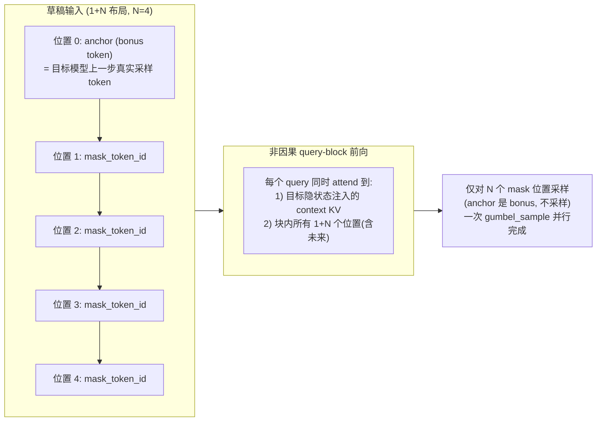

- **anchor（bonus token）**：块的第 0 个输入位置，内容为目标模型上一步真实采样的 token。它不参与采样；验证阶段若至少接受 1 个草稿，anchor 作为"奖励 token"直接计入吞吐（因此每次验证最多产出 N+1 个新 token）；
- **mask token**：`mask_token_id` 占位符（论文默认 id 0），其 embedding 行被训练成"噪声嵌入"，让草稿模型学会在未知位置上做预测；
- **非因果注意力**：草稿前向使用非因果掩码——这是"一次前向出整块"的前提，代价是块内各位置相互独立，造成第一部分所述的 multi-modal collision / suffix decay。

### 5.1.2 KV Injection（目标隐状态注入）

DFlash 草稿层的 K/V 并非逐层自产自用：目标模型约 5 个均匀选取层的 hidden states 被拼接、投影（RMSNorm）后，**注入到草稿每一层的 K/V 投影**，为草稿提供持续的目标模型条件化。vLLM 中 `precompute_and_store_context_kv` 即源于此。

### 5.1.3 训练要点（论文）

| 训练要素 | 做法 | 目的 |
|---------|------|------|
| Random anchor sampling | 随机切块、随机 anchor 位置 | 让模型适应任意起点的块预测 |
| Flex Attention 稀疏掩码 | 块内双向 + 目标特征，跨块掩码 | 显存与速度 |
| 位置依赖损失权重 | $w_k = \exp(-(k-1)/\gamma)$ 指数衰减 | 与 suffix decay 的现实对齐 |
| 权重共享 | 冻结共享目标模型的 embedding / lm_head | 省显存、分布对齐 |

## 5.2 vLLM 实现架构

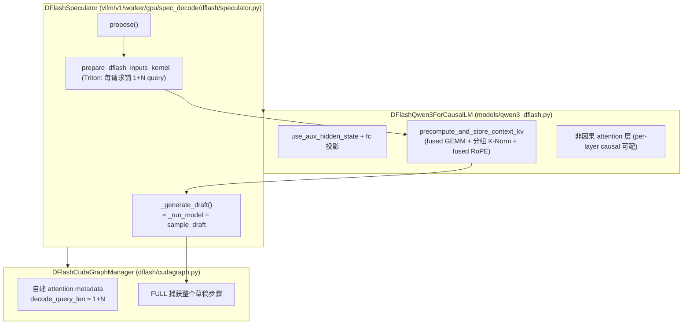

| 组件 | 文件 | 职责 |
|------|------|------|
| `DFlashSpeculator` | `vllm/v1/worker/gpu/spec_decode/dflash/speculator.py` | 起草编排：输入准备、context KV 预计算、并行前向 + 并行采样 |
| `DFlashCudaGraphManager` | `vllm/v1/worker/gpu/spec_decode/dflash/cudagraph.py` | 为草稿 query forward 自建 attention metadata 并 FULL 捕获 |
| `load_dflash_model` | `vllm/v1/worker/gpu/spec_decode/dflash/utils.py` | 草稿模型加载：RoPE 风格对齐、共享 embed/lm_head、选择支持非因果的后端 |
| `DFlashQwen3ForCausalLM` | `vllm/model_executor/models/qwen3_dflash.py` | 草稿模型：aux hidden 投影、mask embedding、fused context-KV 预计算 |
| `DFlash2Speculator` + `CandidateSelector` | `dflash2/speculator.py`、`qwen3_dflash2.py` | 演进变体（见 5.6） |

## 5.3 执行流程详解

### 5.3.1 输入准备: _prepare_dflash_inputs_kernel

每个 decode step，目标模型验证前向结束后，`propose()` 用一个 Triton kernel 为每个请求铺开 1+N 个 query 位置。kernel 为每请求输出三组数据：

```python
# 文件: vllm/v1/worker/gpu/spec_decode/dflash/speculator.py (_prepare_dflash_inputs_kernel 节选)
req_idx = tl.program_id(0)
block_idx = tl.program_id(1)
num_reqs = tl.num_programs(0)
req_state_idx = tl.load(idx_mapping_ptr + req_idx)

ctx_start = tl.load(target_query_start_loc_ptr + req_idx)
ctx_end = tl.load(target_query_start_loc_ptr + req_idx + 1)
num_ctx = ctx_end - ctx_start

num_rejected = tl.load(num_rejected_ptr + req_idx)
valid_ctx_end = ctx_end - num_rejected   # 本步被拒绝的 token 不再是有效 context
num_valid_ctx = valid_ctx_end - ctx_start

num_sampled = tl.load(num_sampled_ptr + req_idx)
if num_sampled > 0:
    bonus_token = tl.load(last_sampled_ptr + req_state_idx).to(tl.int32)
else:
    # Chunked prefilling: splice in the next prefill token.
    bonus_token = tl.load(next_prefill_tokens_ptr + req_state_idx).to(tl.int32)

last_valid_pos = tl.load(target_positions_ptr + valid_ctx_end - 1)
query_base = req_idx * num_query_per_req

j = block_idx * BLOCK_SIZE + tl.arange(0, BLOCK_SIZE)
is_ctx = j < num_ctx
is_valid_ctx = j < num_valid_ctx
is_query = (j >= num_valid_ctx) & (j < num_valid_ctx + num_query_per_req)
query_off = j - num_valid_ctx
```

| 输出组 | 内容 | 用途 |
|--------|------|------|
| context positions / slots | 全部有效历史 token 的位置与 KV slot（被拒后缀行位置写 0、slot 写 PAD） | `precompute_and_store_context_kv` 的写入目标 |
| query input_ids / positions / slots | `bonus_token + mask_token_id × N`，位置为 `last_valid_pos + 1 + off` | 草稿骨干前向输入 |
| sample indices / pos / mapping | 仅 mask 位置（`query_off >= 1`）参与采样，`sample_pos = query_pos` | 采样输出散射到 `draft_tokens[req, step]` |

三个值得注意的细节：

1. **bonus token 的来源分叉**：正常 decode 用 `last_sampled`（上一步采样结果）；chunked prefill 中途用 `next_prefill_tokens` 拼接下一个 prefill token——保证 prefill 与 decode 阶段都能起草；
2. **被拒 token 的 context 处理**：`num_rejected` 之后的行不写 KV（slot = PAD_SLOT_ID），但 span 保持完整初始化，防止 CUDA Graph replay 读到陈旧值；
3. **padding 语义**：所有 padding 行的 sample idx mapping 写 -1（采样时忽略），query slot 写 PAD_SLOT_ID（不产生 KV 写入），这是 FULL CUDA Graph 捕获的固定缓冲契约。

### 5.3.2 Context KV 预计算（fused 实现）

context 形状每步变化，无法进 CUDA Graph，因此单独 eager 执行并做了极致融合（Qwen3 系）：

```python
# 文件: vllm/model_executor/models/qwen3_dflash.py (_project_context_kv 节选)
def _project_context_kv(self, context_states, num_ctx, num_layers,
                        num_kv_heads, head_dim):
    # --- Fused KV projection (one GEMM for all layers) ---
    normed_context_states = torch.empty_like(context_states)
    ops.rms_norm(normed_context_states, context_states,
                 self._hidden_norm_weight, self._rms_norm_eps)
    all_kv_flat = F.linear(
        normed_context_states, self._fused_kv_weight, self._fused_kv_bias
    )
    # Single contiguous copy that separates K/V and transposes to
    # layer-major layout.  Result: [2, L, num_ctx, nkv, hd] contiguous.
    all_kv = (all_kv_flat.view(num_ctx, num_layers, 2, num_kv_heads, head_dim)
              .permute(2, 1, 0, 3, 4).contiguous())
    all_k = all_kv[0]  # [L, num_ctx, nkv, hd]
    all_v = all_kv[1]
    return all_k, all_v
```

优化链条：所有层的 K/V 投影权重 `qkv_proj.weight[q_size:]` 被拼接成**一个 fused 权重**（`_build_fused_kv_buffers`，加载权重后构建）→ 一次 GEMM 算完所有层 → 分组 RMSNorm（K-norm 权重按层堆叠）→ fused RoPE（`[L * num_ctx, kv]` 大 batch 一次旋转）→ 逐层 `do_kv_cache_update` 写入 cache。整个预计算只有约 4 个 kernel 调用。

DeepSeek-V4 的 DSpark 版本（第三部分 3.1.3）沿用同一接口，但走各自平台的 MLA 融合算子（`fused_wqa_wkv` + `kv_norm` + `_insert_context_kv`）。

### 5.3.3 Query-block 前向与一次并行采样

```python
# 文件: vllm/v1/worker/gpu/spec_decode/dflash/speculator.py
def _generate_draft(self, num_reqs, num_tokens_padded, attn_metadata,
                    slot_mappings, num_tokens_across_dp,
                    cudagraph_runtime_mode=CUDAGraphMode.NONE) -> None:
    last_hidden_states = self._run_model(
        num_tokens_padded, attn_metadata, slot_mappings,
        num_tokens_across_dp, cudagraph_runtime_mode,
    )
    num_sample = num_reqs * self.num_speculative_steps
    sample_hidden_states = last_hidden_states[self.sample_indices[:num_sample]]
    # sample_pos is the predicted token's position P. Sampling keys a draw
    # by the position before the sampled token, P-1.
    draft_tokens = self.sample_draft(
        sample_hidden_states,
        self.sample_pos[:num_sample] - 1,
        self.sample_idx_mapping[:num_sample],
        self.temperature,
        self.seeds,
        self.sample_col[:num_sample],
        self.draft_logits,
    )
    self.draft_tokens[:num_reqs] = draft_tokens.view(
        num_reqs, self.num_speculative_steps
    )
```

与 DSpark 的 `_generate_draft` 对照：**DFlash 没有循环**。基类 `sample_draft`（`vllm/v1/worker/gpu/spec_decode/speculator.py:364`）对所有 `num_reqs × N` 行做**一次并行** `gumbel_sample`，各位置互不依赖。这正是 DSpark 在第三部分 3.1.5 用 `_sample_sequential` 替换掉的部分。

## 5.4 CUDA Graph 集成

```python
# 文件: vllm/v1/worker/gpu/spec_decode/dflash/speculator.py
def init_cudagraph_manager(self, cudagraph_mode: CUDAGraphMode) -> None:
    wants_full = cudagraph_mode.decode_mode() == CUDAGraphMode.FULL
    supports_full = (
        self.attn_cg_support.min_cg_support.value
        >= AttentionCGSupport.UNIFORM_BATCH.value
    )
    if wants_full and not supports_full:
        logger.warning("%s draft attention (%s) does not support full CUDA graphs; "
                       "running the draft eagerly.", ...)
    # PIECEWISE cudagraphs are not supported for dflash.
    if wants_full and supports_full:
        cudagraph_mode = CUDAGraphMode.FULL_DECODE_ONLY
    else:
        cudagraph_mode = CUDAGraphMode.NONE

    self.query_cudagraph_manager = DFlashCudaGraphManager(
        self.vllm_config, self.device, cudagraph_mode,
        decode_query_len=self.num_query_per_req,   # 每请求固定 1+N 个 query
    )
```

DFlash 每步恰好 `num_query_per_req = 1+N` 个 query token，天然满足 uniform-batch 条件，可用 FULL 图捕获整个起草步骤。`DFlashCudaGraphManager` 与普通 `CudaGraphManager` 的差别在于它为草稿前向**自建 attention metadata**（`_prepare_dflash_inputs_to_capture`，用 dummy InputBatch / block tables / slot mappings 构造），不依赖目标模型执行态。

CUDA Graph 边界划分：**eager 区** = `prepare_dflash_inputs` + `precompute_and_store_context_kv`（形状每步变化）；**图内区** = `_generate_draft`（骨干前向 + 采样，形状固定）。

## 5.5 模型侧实现要点

### 5.5.1 aux hidden state 投影

```python
# 文件: vllm/model_executor/models/qwen3_dflash.py
drafter_config = getattr(self.config, "eagle_config", {})
drafter_config.update(getattr(self.config, "dflash_config", {}))
self.use_aux_hidden_state = drafter_config.get(
    "use_aux_hidden_state", getattr(self.config, "use_aux_hidden_state", True))
...
if self.use_aux_hidden_state:
    self.fc = ReplicatedLinear(
        input_size=_get_dflash_fc_input_size(vllm_config),  # 目标层 hidden 拼接宽度
        output_size=self.config.hidden_size, bias=False, ...)
self.hidden_norm = RMSNorm(self.config.hidden_size, ...)
```

`combine_hidden_states`（3.1.1 节同款）把目标层 aux hidden 拼接、经 `fc` 投影、RMSNorm，得到草稿骨干输入。

### 5.5.2 mask embedding 替换

```python
# 文件: vllm/model_executor/models/qwen3_dflash.py
def embed_input_ids(self, input_ids: torch.Tensor) -> torch.Tensor:
    embeds = self.embed_tokens(input_ids)
    if self.has_separate_mask_embedding and self.mask_token_id is not None:
        # Replace masked slots with the dedicated mask embedding.
        is_mask = (input_ids == self.mask_token_id).unsqueeze(-1)
        embeds = torch.where(is_mask, self.mask_embedding.to(embeds.dtype), embeds)
    return embeds
```

大多数 checkpoint 直接使用 embedding 表 `mask_token_id` 行的噪声嵌入；个别（MiMo 系）附带独立 mask embedding 张量，加载时置 `has_separate_mask_embedding` 并在嵌入阶段替换。

### 5.5.3 RoPE 风格对齐与后端选择

```python
# 文件: vllm/v1/worker/gpu/spec_decode/dflash/utils.py
# The drafter must rotate Q/K the way its target does. Take that from the
# built target before super() constructs the draft.
is_neox_style = dflash_target_rope_is_neox_style(target_model)
if is_neox_style is not None:
    draft_model_config.hf_config.is_neox_style = is_neox_style
# Select an attention backend that supports the drafter's attention: mixing
# a non-causal layer onto a causal-only backend would fail.
draft_vllm_config = replace(
    vllm_config,
    attention_config=replace(
        vllm_config.attention_config,
        use_non_causal=dflash_has_any_non_causal(draft_model_config.hf_config),
        backend=speculative_config.attention_backend,
    ), ...)
```

两个容易踩坑的点都被显式处理：草稿的 RoPE 布局必须与目标一致（interleaved-RoPE 目标蒸馏出的草稿若按 neox 旋转，接受率会静默崩塌）；非因果层必须落到支持非因果的 attention 后端（`dflash_has_any_non_causal` 从 `dflash_config` 解析逐层因果性，`get_draft_attn_causal()` 提供逐层列表，支持 causal / non-causal 混合层）。

## 5.6 演进变体: DFlash2

vLLM 中还有 `DFlash2Speculator`（`vllm/v1/worker/gpu/spec_decode/dflash2/speculator.py`），可视为"DFlash → DSpark"路线之外的另一个块内依赖注入尝试：

```python
class DFlash2Speculator(DFlashSpeculator):
    _speculator_name = "DFlash2"

    def __init__(self, vllm_config: VllmConfig, device: torch.device):
        super().__init__(vllm_config, device)
        draft_config = self.draft_model_config.hf_config.dflash_config
        self.selector_top_k = int(draft_config["selector_top_k"])
        ...

    def _generate_draft(self, ...):
        last_hidden_states = self._run_model(...)
        hidden_states = last_hidden_states[self.sample_indices[:num_sample]].view(
            num_reqs, self.num_speculative_steps, -1)
        candidate_ids, unary_logits = self.model.compute_candidates(
            hidden_states.flatten(0, 1))                       # top-k 候选
        ...
        anchor_token_ids = self.input_buffers.input_ids[self._anchor_indices[:num_reqs]]
        scores = self.model.model.candidate_selector(
            candidate_ids, unary_logits, hidden_states, anchor_token_ids)
        self._sample_path(candidate_ids, scores, num_reqs)     # selector walk 串行采样
```

`CandidateSelector`（`qwen3_dflash2.py:188`）用两个低秩 codebook（`predecessor_codebook` / `successor_codebook`，$V \times r$）对"前一位置选中的候选 → 当前位置候选"的**边**打分，叠加 unary logits 后在 top-k 候选图上做 `_selector_walk_kernel` 串行游走采样。

| 变体 | 块内依赖注入方式 | 采样空间 |
|------|----------------|---------|
| DFlash | 无 | 全词表稠密，一次并行 |
| **DFlash2** | selector 边打分（双 codebook）+ 游走采样 | top-k 候选（`selector_top_k`） |
| **DSpark** | Markov 转移 bias（低秩 $V \times r \to r \times V$） | 全词表稠密（或 `dspark_draft_topk` 截断） |

三者共享同一并行骨干与 1+N / N query 布局，差异只在"采样阶段如何引入块内依赖"。

## 5.7 DFlash 与 DSpark、MTP 的区别总结

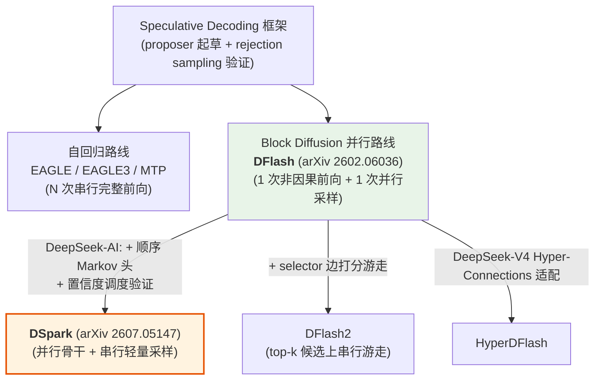

### 5.7.1 DFlash vs DSpark（最易混淆的一对）

DSpark **继承** `DFlashSpeculator`，两者共用：`propose()` 骨架、`_prepare_dflash_inputs_kernel`（`SAMPLE_FROM_ANCHOR` 编译期开关切换两种布局）、context-KV 预计算、非因果注意力、DFlashCudaGraphManager。真正的差异收敛在两点：

| 维度 | DFlash | DSpark |
|------|--------|--------|
| query 布局 | $1+N$：anchor 是 bonus，只有 mask 位置采样 | $N$：anchor 预测第 1 个草稿，所有位置采样 |
| 采样方式 | `sample_draft` **一次并行** gumbel（位置独立） | `_sample_sequential` **串行 N 步**（Markov bias 注入一阶依赖） |
| 采样阶段计算量 | 最小 | 每步 +1 次 embedding 查表 + $r \to V$ 小矩阵乘 |
| 置信度/自适应验证 | 无 | confidence head + `AdaptiveVerificationManager` |
| 草稿质量 | suffix decay 明显 | 平均接受长度 +16~18%（论文） |

一句话：**DSpark = DFlash 的并行骨干 + 采样阶段的顺序化改造 + 验证阶段的置信度调度**。

### 5.7.2 DFlash vs MTP

| 维度 | MTP | DFlash |
|------|-----|--------|
| 起草结构 | 目标模型附带的 MTP 模块，**串行** $N$ 次完整前向 | 独立草稿模型，**1 次**非因果前向 |
| 注意力 | 因果 | 非因果（块内双向 + 目标 context） |
| 输入 token | 真实 token（自回归） | anchor + mask 占位 token |
| KV 写入 | 每步串行写入 | context KV 由目标隐状态**一次性预计算注入** |
| 训练 | 目标模型联合训练（MTP loss） | 独立蒸馏（DFlash / DeepSpec） |
| 加速比 | DeepSeek-V3/R1 生产基线 | 最高 6.1×（Qwen3-8B，约 2.5× EAGLE-3） |

### 5.7.3 DFlash vs 通用 Speculative Decoding

DFlash 是推测解码框架下的一个 **proposer 实现**，不改变框架本身：

- **验证侧完全复用**标准 rejection sampling（`rejection_sampler.py`），与 draft_model / EAGLE / MTP 相同，目标输出分布无损；
- 与 `draft_model` 方法（外部独立小模型）的区别：DFlash 草稿**共享目标 embedding / lm_head**、以目标隐状态为条件（self-speculative 家族），不需要独立的 tokenizer / 词表对齐；
- 与 Medusa 类多头并行预测的区别：Medusa 在目标模型上加多个预测头（每个位置独立），DFlash 用独立草稿模型 + mask 占位 + 非因果注意力，块内信息交互更强。

---

# 第六部分: 配置与使用指南

## 6.1 关键参数说明

| 参数 | 位置 | 说明 | 典型值 |
|------|------|------|--------|
| `method` | speculative config | 推理方法，DSpark 取 `"dspark"`（也可由 checkpoint 自动推断） | `"dspark"` |
| `model` | speculative config | 草稿模型路径（DeepSeek-V4 可内嵌于目标 checkpoint 而省略） | `deepseek-ai/dspark_qwen3_4b_block7` |
| `num_speculative_tokens` | speculative config | 草稿块长度 $N$；须与 checkpoint 的 block size 匹配 | 7（block7 系列） |
| `enable_adaptive_verification` | speculative config | 置信度调度验证；要求 checkpoint 含 confidence head | `true`（生产）/ `false`（调试） |
| `dspark_draft_topk` | speculative config | Markov 修正只作用于 base logits top-k 候选（Qwen3 类） | `null` 或 64/128 |
| `draft_tensor_parallel_size` | 顶层参数 | 草稿模型 TP 并行度 | = 目标 TP |
| `sample_from_anchor` | 草稿 checkpoint 配置 | `true`：N 布局（标准 DSpark）；`false`：1+N 布局 | `true` |
| `dspark_noise_token_id` | 草稿 checkpoint 配置 | 非预测位置的占位 token id | checkpoint 自带 |

## 6.2 典型配置示例

**Qwen3 目标模型 + 独立 DSpark 草稿 checkpoint**：

```bash
vllm serve Qwen/Qwen3-8B \
  --speculative-config '{
    "method": "dspark",
    "model": "deepseek-ai/dspark_qwen3_8b_block7",
    "num_speculative_tokens": 7,
    "enable_adaptive_verification": true
  }'
```

**DeepSeek-V4（权重内嵌目标 checkpoint，自动检测方法）**：

```bash
vllm serve deepseek-ai/DeepSeek-V4-Flash \
  --speculative-config '{
    "method": "dspark",
    "num_speculative_tokens": 3,
    "enable_adaptive_verification": true
  }'
```

**关闭 adaptive verification 用固定长度验证**（当草稿 checkpoint 无 confidence head 时**必须**如此，否则 `load_draft_model` 直接抛错）：

```json
{"method": "dspark", "model": "...", "num_speculative_tokens": 7,
 "enable_adaptive_verification": false}
```

## 6.3 性能调优建议

1. **`num_speculative_tokens` 必须与 checkpoint 匹配**：`_validate_qwen3_omni_dspark` 等校验逻辑强制 `block_size == num_speculative_tokens`，不匹配会拒绝启动；
2. **生产环境优先开启 `enable_adaptive_verification`**：这是 DSpark 相对其他方法的独特收益来源，但要求目标 attention backend 支持 varlen decode CUDA Graph（`AttentionCGSupport.ALWAYS`）与 on-device 裁剪（`get_query_lens_mismatch_unsupported_backend` 检查），不满足时启动即报错并给出回退提示；
3. **小 batch / 单用户场景**：adaptive verification 收益有限，可用固定 $N$ 验证减少复杂度；
4. **`dspark_draft_topk`**：当 Markov bias 投影成为 profile 热点时开启，用轻微的质量损失（截断分布）换取采样延迟下降；参考 `tests/v1/spec_decode/test_dspark_topk.py` 验证等价性；
5. **CUDA Graph**：草稿步骤（骨干 + 顺序采样）支持 FULL 捕获（`DFlashCudaGraphManager`），eager 部分只有 context KV 预计算，务必保持 FULL 模式以获得最大收益；
6. **限制**：当前不支持 pipeline parallelism（`load_dspark_model` 中 `get_pp_group().world_size != 1` 直接 `NotImplementedError`），不支持多模态输入（`supports_mm_inputs = False`）。

---

# 附录

## A. 关键代码位置索引

| 组件 | 文件路径 | 关键符号 |
|------|---------|---------|
| DSpark speculator | `vllm/v1/worker/gpu/spec_decode/dspark/speculator.py` | `DSparkSpeculator`、`_sample_sequential`、`_sample_sequential_topk`、`_generate_draft` |
| DSpark 模型加载 | `vllm/v1/worker/gpu/spec_decode/dspark/utils.py` | `load_dspark_model`、`_resolve_dspark_attention_backend` |
| DFlash speculator | `vllm/v1/worker/gpu/spec_decode/dflash/speculator.py` | `DFlashSpeculator.propose`、`_prepare_dflash_inputs_kernel`、`prepare_dflash_inputs`、`_run_model`、`init_cudagraph_manager` |
| DFlash CUDA Graph | `vllm/v1/worker/gpu/spec_decode/dflash/cudagraph.py` | `DFlashCudaGraphManager`、`_prepare_dflash_inputs_to_capture` |
| DFlash 模型加载 | `vllm/v1/worker/gpu/spec_decode/dflash/utils.py` | `load_dflash_model` |
| DFlash2 speculator | `vllm/v1/worker/gpu/spec_decode/dflash2/speculator.py` | `DFlash2Speculator`、`_selector_walk_kernel` |
| DFlash2 selector 模型 | `vllm/model_executor/models/qwen3_dflash2.py` | `CandidateSelector`、`DFlash2Qwen3ForCausalLM.compute_candidates` |
| 置信度调度验证 | `vllm/v1/worker/gpu/spec_decode/adaptive_verification.py` | `AdaptiveVerificationManager`、`_assign_draft_token_budget`、`build_cost_tables_from_curves` |
| 配置 | `vllm/config/speculative.py` | `DSparkModelTypes`、`enable_adaptive_verification`、`dspark_draft_topk`、`use_dspark()` |
| Proposer 基类 | `vllm/v1/spec_decode/llm_base_proposer.py` | `LLMBaseProposer`（noise token 解析 L356-372） |
| 并行起草 token id | `vllm/v1/worker/gpu/spec_decode/utils.py` | `get_parallel_drafting_token_id` |
| Qwen3 DSpark 模型 | `vllm/model_executor/models/qwen3_dspark.py` | `DSparkMarkovHead`、`DSparkConfidenceHead`、`Qwen3DSparkForCausalLM` |
| Qwen3 DFlash 骨干 | `vllm/model_executor/models/qwen3_dflash.py` | `DFlashQwen3ForCausalLM`、`precompute_and_store_context_kv`、`_project_context_kv`、`_build_fused_kv_buffers` |
| Gemma4 DSpark | `vllm/model_executor/models/gemma4_dspark.py` | `Gemma4DSparkForCausalLM` |
| DeepSeek-V4 DSpark | `vllm/models/deepseek_v4/nvidia/dspark.py`（另有 `amd/`、`xpu/`） | `DSparkDeepseekV4Model`、`combine_hidden_states`、`precompute_and_store_context_kv` |
| 非因果 sparse MLA | `vllm/v1/attention/backends/mla/sparse_swa.py` | `is_dspark`、`_compute_dspark_noncausal_swa_indices_kernel` |
| SWA 索引宽度 | `vllm/v1/attention/backends/mla/compressor_utils.py` | `get_dspark_swa_index_width` |
| MTP speculator（对比参照） | `vllm/v1/worker/gpu/spec_decode/mtp/speculator.py` | `MTPSpeculator(AutoRegressiveSpeculator)` |
| 测试 | `tests/v1/spec_decode/test_dspark_topk.py`、`tests/v1/attention/test_dspark_noncausal_sparse_mla.py`、`tests/v1/e2e/spec_decode/acceptance_rates/dspark/test_dspark.py` | top-k 等价性 / 非因果 MLA 与 SDPA 对齐 / e2e 接受率 |

## B. 术语表

| 术语 | 说明 |
|------|------|
| **Speculative Decoding** | 推测解码：草稿模型生成候选，目标模型并行验证 |
| **Proposer / Speculator** | 草稿生成器（vLLM V1 中 speculator 是其 GPU worker 侧实现） |
| **Semi-Autoregressive Generation** | 半自回归生成：并行骨干 + 串行轻量输出头 |
| **Markov head** | 一阶马尔可夫转移头：$V \times r$ embedding + $r \times V$ 投影，注入块内依赖 |
| **markov_rank ($r$)** | Markov 嵌入的秩，控制转移头的容量 |
| **anchor-as-first-prediction** | DSpark 的 query 布局：anchor 位置本身是第一个预测 |
| **noise token** | 非 anchor 位置的占位输入 token（`dspark_noise_token_id`） |
| **context KV precompute** | 用目标隐状态为草稿层预计算并写入 KV cache |
| **non-causal block attention** | 块内无因果掩码：每个 query attend 到块内所有 token |
| **suffix decay** | 并行草稿接受率随位置衰减的现象 |
| **multi-modal collision** | 并行草稿混入互斥续写路径导致的碰撞 |
| **Survival probability** | 前缀存活概率：$\prod_{j \le i} c_j$，置信度连乘 |
| **Adaptive Verification** | 置信度调度验证：按预算裁剪每请求验证长度 |
| **draft budget** | 每步全局允许验证的草稿 token 数 |
| **Rejection Sampling** | 拒绝采样验证：按 $\min(1, p_t/q_d)$ 接受草稿，保证目标分布无损 |
| **Block Diffusion** | DFlash 的并行起草范式：mask 占位 + 非因果一次前向 + 一次并行采样 |
| **mask token** | DFlash 的占位 token（`mask_token_id`），其 embedding 行被训练为噪声嵌入 |
| **bonus / anchor token** | 草稿块第 0 个位置的输入 token（目标模型真实采样），验证时作为奖励 token 计入吞吐 |
| **KV Injection** | 目标层 hidden states 拼接投影后注入草稿每层 K/V 投影（context KV 预计算） |
| **DFlash** | Z Lab 提出的 Block Diffusion 并行草稿方法（arXiv: 2602.06036，DSpark 的前身与骨干复用对象） |
| **DFlash2** | DFlash 的演进变体：selector 双 codebook 边打分 + top-k 候选游走采样 |
| **DeepSpec** | DeepSeek 开源的 EAGLE3/DFlash/DSpark 训练栈 |
