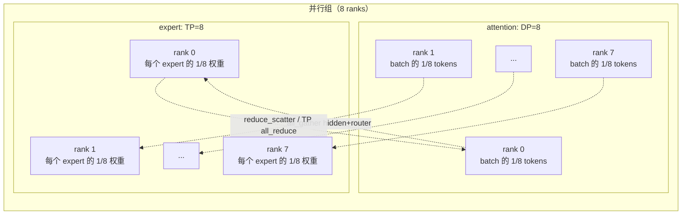
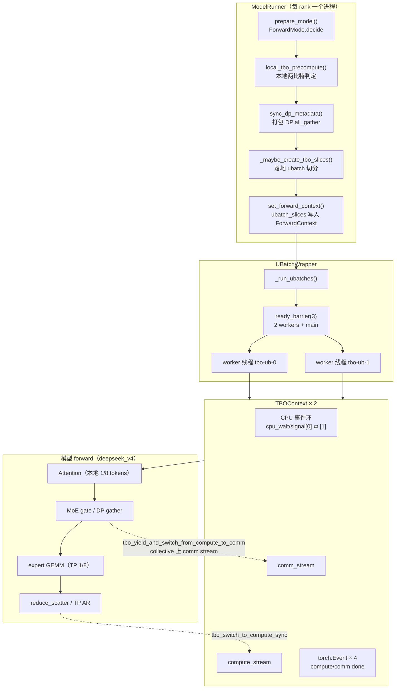
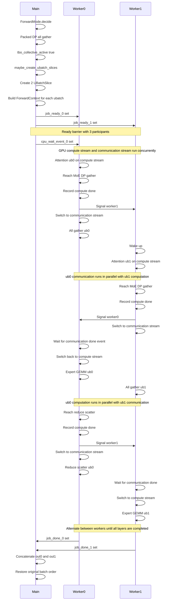
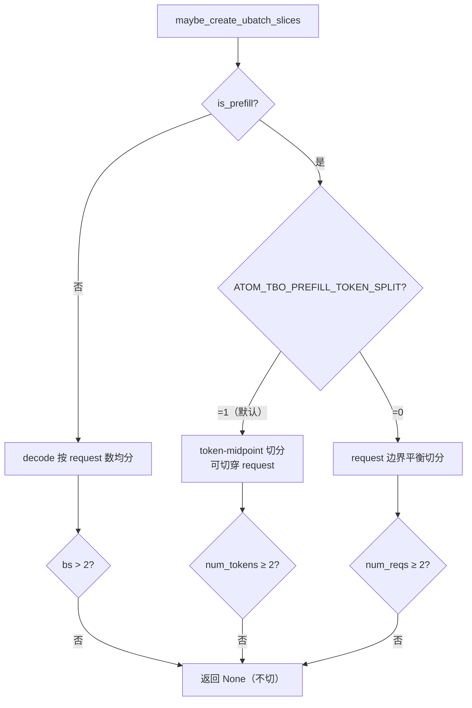

# ATOM dual-batch-overlap（TBO）通算融合特性代码走读技术文档

> **文档版本**: 1.0
> **分析代码版本**: ATOM main 分支（截至 2026-09）
> **最后更新**: 2026-09-28
> **部署背景**: DeepSeek-V4-Pro，attention DP=8 + expert TP=8，prefill 阶段

---

## 文档概述

本文档深入分析 ATOM 推理引擎中 **dual-batch-overlap**（代码中称为 **TBO**，即 *Two/Token Batch Overlap*）在 prefill 阶段的实现细节。TBO 将单个 prefill batch 切分为两个 micro-batch（ubatch），由两个 Python 线程交替驱动，利用独立的 comm stream 与 compute stream，把 **一个 ubatch 的集合通信（通）与另一个 ubatch 的矩阵计算（算）在 GPU 上重叠执行（融合）**，从而隐藏 DP/TP 集合通信延迟。

**适用读者**：
- 对 ATOM 模型执行路径（`ModelRunner` → `UBatchWrapper` → 模型 forward）有基本了解的开发者
- 部署 DeepSeek-V4-Pro（或 DeepSeek V3.x、GLM-5 等 MLA+MoE 模型）并关心 prefill 吞吐的工程师
- 想理解"通信计算重叠"如何在双线程 + 双 CUDA stream 下落地实现的系统研究者

**阅读指南**：
- 第一部分从部署形态出发讲清"为什么需要 TBO"，并给出整体架构
- 第二部分分析核心类与接口
- 第三部分是最深入的实现走读：决策算法、切分算法、双线程执行引擎、通信融合点、straddle 几何、CUDAGraph 捕获
- 第四部分对比各变体，第五部分给出配置指南
- 附录提供代码索引与术语表

---

# 第一部分: dual-batch-overlap 基础与架构总览

## 1.1 背景: DeepSeek-V4-Pro 的 attention DP=8 + expert TP=8 部署形态

DeepSeek-V4-Pro 采用 MLA（Multi-head Latent Attention）+ DeepSeekMoE 架构。在推理部署中，attention 与 MoE 的计算/访存特征差异巨大，业界普遍采用**异构并行**部署：attention 用 DP（Data Parallel）切 batch，expert 用 TP（Tensor Parallel）切权重。

本文分析的部署形态为 **attention DP=8 + expert TP=8**，即一个并行组内有 8 个 rank：



**每一层的通信模式**（单 rank 视角）：

1. Attention 在本地 1/8 tokens 上完成（DP 切分，无 attention 内通信）；
2. 进入 MoE 前，需要 **DP all_gather**：把 8 个 rank 各自的 `hidden_states [N/8, 7168]` 与 `router_logits` 聚合为 `[N, 7168]`（`dp_gather_hidden_and_router`）；
3. 每个 rank 用自己持有的 1/8 expert 权重对**全部 N 个 token** 计算部分和；
4. expert 输出通过 **reduce_scatter** 回到各 rank 的 1/8 行（或 TP all_reduce 合并部分和）。

问题随之而来：prefill 是典型的大 token 量场景，每层都有 1 次 all_gather（体积 ≈ N×7168×dtype）与 1 次 reduce_scatter。**这些集合通信与计算串行执行时，GPU 的 SM 在通信期间大量空闲**，prefill 吞吐受通信延迟拖累。这就是 TBO 要解决的问题。

> **关键洞察**: attention DP 化之后，attention 部分**没有任何集合通信**，通信完全集中在 MoE 入口/出口。这使 TBO 的融合点非常集中：只要把 MoE 的 DP gather/scatter 挪到 comm stream 上与另一批数据的计算重叠，就能覆盖该部署形态下几乎全部的通信开销。

## 1.2 通算融合的核心思想

### 1.2.1 术语

- **dual-batch（双 batch）**: 把一个物理 batch 切成 2 个 ubatch（micro-batch）；
- **overlap（重叠）**: GPU 上 comm stream 与 compute stream 并发执行；
- **通算融合**: 通信（collective）与计算（GEMM/attention kernel）时间上重叠、互相填充 GPU 空闲期。

### 1.2.2 基本思想

串行执行时的时间线（以 MoE 为例）：

```
|-- attn(ub0) --|-- gather(ub0) --|-- moe(ub0) --|-- scatter(ub0) --|-- attn(ub1) --|-- gather(ub1) --|...
                   ↑ GPU 空闲：通信期间没有计算可跑
```

dual-batch-overlap 的执行时间线：

```
compute stream: |-- attn(ub0) --|-- moe(ub0) --|-- attn(ub1) --|-- moe(ub1) --|
comm stream:             |-- gather(ub0) --|-- scatter(ub0) --|-- gather(ub1) --|
                          ↑ ub0 的通信与 ub1 的 attention 计算重叠
```

实现要点：

1. **两个 ubatch 各由一个常驻 Python 线程驱动**，线程在集合通信边界用 CPU 事件"击鼓传花"（ping-pong）；
2. **两条 CUDA stream**：`compute_stream`（主线程当前流，跑 GEMM/attention）与 `comm_stream`（专用流，跑 collective）；
3. 线程 A 在遇到 collective 时：在 compute stream 上 record event → **唤醒线程 B** → 切到 comm stream 等 event → 发起 collective；线程 B 被唤醒后在 compute stream 上继续发计算 kernel。GPU 调度器即可并发执行两条流上的工作；
4. 所有跨流依赖用 `torch.Event` 的 record/wait 表达，**全程无 CPU 阻塞式 `synchronize()`**。

> **关键洞察**: 双线程不是为了让两个 ubatch 的计算并行（它们共享同一条 compute stream，本质串行），而是为了让**一个 ubatch 的通信时刻，GPU 总有另一个 ubatch 的计算可以执行**。CPU 侧的双线程保证了"任何时候都有人给两条流喂工作"。

### 1.2.3 性能收益分析

设一层内计算时间 $T_{comp}$、通信时间 $T_{comm}$：

- 串行：$T_{layer} = T_{comp} + T_{comm}$
- 理想重叠：$T_{layer} \approx \max(T_{comp}, T_{comm})$

当 $T_{comm} \approx T_{comp}$ 时收益最大（近 2×）。prefill 大 token 量下 DP all_gather 的字节量（N×7168×2B，N=8192 时约 117MB/rank）与 expert GEMM 时间在同一量级，重叠收益显著。TBO 的额外开销：一次 ubatch 切分的 metadata 构建（CPU 侧 numpy 运算）+ 线程切换（CPU event 唤醒，微秒级），相对 GPU 毫秒级通信/计算可忽略。

## 1.3 整体架构

### 1.3.1 模块职责划分

TBO 实现集中在 `atom/utils/tbo/` 目录（约 1900 行），并接入 `ModelRunner`、模型 forward 与通信算子：

| 模块 | 职责 |
|------|------|
| `atom/utils/tbo/ubatching.py` | 核心：`TBOContext`（双线程上下文）、`local_tbo_precompute`（本地判定）、`sync_dp_metadata`（跨 DP 打包 all_gather 决策）、`make_tbo_contexts`、per-ubatch pynccl TP communicator |
| `atom/utils/tbo/ubatch_wrapper.py` | `UBatchWrapper`：包装模型，管理常驻 worker 线程池、构建 per-ubatch `ForwardContext`、decode CUDAGraph 捕获（`capture_tbo_graph`） |
| `atom/utils/tbo/ubatch_splitting.py` | `UBatchSlice`、`maybe_create_ubatch_slices`（三种切分算法）、`split_attn_metadata`（metadata 切片）、CPU 长度副本机制 |
| `atom/utils/tbo/prefill_token_split.py` | token-midpoint 切分"切穿请求"时的 straddle 几何计算 |
| `atom/model_engine/model_runner.py` | `ForwardMode.decide` 内发起 TBO 决策与跨 DP 同步、`_maybe_create_tbo_slices` 落地切分、CUDAGraph 捕获/回放 |
| `atom/models/deepseek_v4.py` | 模型 forward 中通信点的 TBO yield/切换（PCP 路径、MoE 边界） |
| `atom/model_ops/moe.py` | MoE DP gather/scatter 的 TBO 融合（`dp_gather_hidden_and_router` / `reduce_scatterv` 前后） |
| `atom/model_ops/module_dispatch_ops.py` | `tbo_all_reduce` custom op：纯 TP all_reduce 挪到 comm stream + per-ubatch communicator |
| `atom/model_ops/fused_moe/modular_kernel.py` | MORI all2all 的 async recv hook 融合（EP 部署变体） |
| `atom/model_ops/attentions/deepseek_v4_attn.py` | V4 attention builder 的 `build_ubatch_prefill_metadata`：straddle 几何的 metadata 重建 |

### 1.3.2 系统架构总览图



### 1.3.3 数据流与控制流分析

**控制流**（CPU 侧）：

1. 每个 step，`ModelRunner.prepare_model()` 在 `ForwardMode.decide` 中调用 `_local_tbo_eligibility` → `local_tbo_precompute`，得到本 rank 的 `(meets_min_tokens, can_split, ub0, ub1)`；
2. `sync_dp_metadata` 发起**一次打包的 DP all_gather**（7 个 int32 字段），规约出集体结论 `tbo_collective_active`；
3. 若激活，`_maybe_create_tbo_slices(force=True)` 生成 `[UBatchSlice, UBatchSlice]` 并写入 `ForwardContext.ubatch_slices`；
4. `UBatchWrapper.forward` 检测到 `ubatch_slices` 非空 → 进入 `_run_ubatches` 双线程路径。

**数据流**（GPU 侧）：

- 两个 ubatch 共享同一条 compute stream 与同一条 comm stream；
- 每个线程持有自己的 `ForwardContext`（通过线程本地 `_forward_context_local.ctx` 切换），看到的 attn metadata / token 切片互不重叠；
- KV cache 写入按 token 偏移天然分片（两个 ubatch 写不同 token 的 KV），无写冲突；
- 输出在双线程完成后按 ubatch 顺序 `torch.cat` 恢复全 batch 顺序。

## 1.4 执行流程详解：一次 prefill step 的完整走读

以下序列图展示一次 TBO prefill step 中 main 线程与两个 worker 线程的协作（假设 rank 判定 TBO 激活，batch 8000 tokens 被切成 ub0/ub1 各约 4000）：



---

# 第二部分: 核心接口与基类分析

## 2.1 `TBOContext` — 双线程执行上下文

```python
# 文件: atom/utils/tbo/ubatching.py
class TBOContext:
    """Context manager for micro-batch dual-thread overlap.

    Modelled after vLLM's ``UBatchContext``. Each ubatch thread enters its own
    ``TBOContext``; synchronisation between threads uses threading events
    arranged in a circular ring:

        cpu_signal_event[i] == cpu_wait_event[(i+1) % N]
    """
    def __init__(
        self,
        ubatch_id: int,
        compute_stream: torch.cuda.Stream,
        comm_stream: torch.cuda.Stream,
        forward_context,          # 本 ubatch 的 ForwardContext
        ready_barrier: threading.Barrier,
        cpu_wait_event: threading.Event,
        cpu_signal_event: threading.Event,
        gpu_comm_done_event: torch.Event,
        gpu_compute_done_event: torch.Event,
    ):
        ...
```

关键成员与方法：

| 成员/方法 | 说明 |
|-----------|------|
| `cpu_wait_event` / `cpu_signal_event` | CPU ping-pong 环上的一对事件；signal 下一个线程，wait 睡自己 |
| `gpu_comm_done_event` / `gpu_compute_done_event` | GPU 跨流排序用的 `torch.Event` |
| `compute_stream` / `comm_stream` | 所有 ubatch **共享**的两条流 |
| `done: bool` | 本 ubatch forward 是否已返回；partner 在 `_cpu_yield` 时检查，避免对方异常退出后自己永久睡眠 |
| `partner: TBOContext \| None` | 指向环上的下一个 context |
| `__enter__/__exit__` | 注册线程→ubatch 映射（`_THREAD_ID_TO_CONTEXT`）、过 barrier、等唤醒；退出时标记 done 并 signal |
| `yield_()` | 纯 CPU 让渡：signal 下一个、wait 自己，**保留当前 stream** |
| `yield_and_switch_from_compute_to_comm()` | record compute-done → CPU yield → 切 comm stream → comm 等 compute-done event（四步合一） |
| `switch_to_compute_sync()` | record comm-done → 切回 compute stream → compute 等 comm-done event |
| `_restore_context()` | 恢复线程本地的 `ForwardContext` |

## 2.2 `UBatchWrapper` — 模型包装器

```python
# 文件: atom/utils/tbo/ubatch_wrapper.py
class UBatchWrapper(nn.Module):
    """Wraps a model to split decode batches into micro-batches."""

    def __init__(self, model, attn_metadata_builder=None, dp_gather_scatter=False):
        self.model = model
        self.attn_metadata_builder = attn_metadata_builder
        self.dp_gather_scatter = dp_gather_scatter   # dp>1 且无 EP all2all 时为 True
        self.comm_stream: torch.cuda.Stream | None = None
        self.ready_barrier = threading.Barrier(3)     # 2 ubatch threads + 1 main
        self.tbo_graphs: dict[tuple, TBOGraphData] = {}  # decode CUDAGraph 存储
        # 常驻 worker 线程池
        self._num_workers = 2
        self._worker_jobs: list[callable | None] = [None] * 2
        self._worker_job_ready = [threading.Event() for _ in range(2)]
        self._worker_job_done = [threading.Event() for _ in range(2)]
```

入口：

```python
def forward(self, input_ids, positions):
    ctx = get_forward_context()
    if ctx.ubatch_slices is None:
        return self.model(input_ids, positions)   # 非 TBO step：直通
    return self._run_ubatches(input_ids, positions, ctx)
```

`forward` 只在 `ForwardContext.ubatch_slices` 非空时进入双线程路径，**非 TBO step 零开销直通**。

其余关键方法：

| 方法 | 职责 |
|------|------|
| `_run_ubatches()` | 构建 per-ubatch ForwardContext → 投递给 2 个常驻 worker → barrier 握手 → 等 done → cat 输出 |
| `_make_ubatch_context()` | 从父 ForwardContext 切片出一个 ubatch 的 Context + attn metadata |
| `_make_ubatch_dp_metadata()` | 为每个 ubatch 构造独立的 `DPMetadata`（每 ubatch 一次 CPU all_reduce，保证 MoE DP collective 尺寸一致） |
| `_compute_ub_running_tokens()` | 计算每个 ubatch 的 MoE 填充宽度（跨 DP MAX 对齐） |
| `capture_tbo_graph()` | decode 路径的双线程 CUDAGraph 捕获 |
| `__getattr__` | 未覆盖的属性透传给内层 model（`compute_logits` 等） |

## 2.3 `UBatchSlice` 与切分接口

```python
# 文件: atom/utils/tbo/ubatch_splitting.py
@dataclass
class UBatchSlice:
    """Describes which portion of a batch belongs to a micro-batch."""
    request_slice: slice  # 属于该 ubatch 的 request 区间
    token_slice: slice    # 属于该 ubatch 的 token 区间（prefill 关键）
```

```python
def maybe_create_ubatch_slices(
    num_reqs, num_tokens, num_ubatches=2, is_prefill=False,
    num_scheduled_tokens=None, max_tokens_per_ubatch=None, force=False,
) -> list[UBatchSlice] | None:
    """For decode: split by request count. For prefill: token-balanced split."""
```

`force=True` 是跨 DP 场景的关键参数：绕过本地 `ATOM_TBO_PREFILL_MIN_TOKENS` 门槛（详见 3.1）。

## 2.4 决策与同步接口

```python
# 文件: atom/utils/tbo/ubatching.py
def local_tbo_precompute(config, batch, is_prefill, num_scheduled_tokens
    ) -> tuple[bool, bool, int, int]:
    """(meets_min_tokens, can_split, ub0_tokens, ub1_tokens)"""

@dataclass
class DPSyncResult:
    num_tokens_across_dp: torch.Tensor      # [dp_size] 各 rank token 数
    max_bs_across_dp: int                   # DP-MAX 的序列数
    any_rank_has_prefill: bool              # OR
    tbo_collective_active: bool             # 集体结论（唯一权威开关）
    ub_max_tokens_across_dp: tuple | None   # (ub0_max, ub1_max) DP-MAX
    ub_tokens_across_dp: tuple | None       # 未规约的两行原始值
    max_seqlen_q_across_dp: int | None      # DSpark 附带字段

def sync_dp_metadata(*, dp_group, dp_size, scheduled_tokens, scheduled_bs,
    is_prefill, tbo_on, local_meets_min_tokens, local_can_split,
    local_ub_tokens, max_seqlen_q) -> DPSyncResult:
    """一次打包 DP all_gather 完成一个 step 所需的全部跨 DP 标量同步。"""
```

---

# 第三部分: 核心实现深度分析

## 3.1 决策算法: 两比特契约 + 打包 DP all_gather

### 3.1.1 本地判定 `local_tbo_precompute`

每个 rank 先在本地回答两个问题（两比特契约）：

```python
# 文件: atom/utils/tbo/ubatching.py
def _precompute_prefill_token_split(num_scheduled_tokens, num_pref_reqs, min_pref):
    """Prefill, token-midpoint split (ATOM_TBO_PREFILL_TOKEN_SPLIT=1).

    Cut at the exact token midpoint — this can slice THROUGH a request, so
    request count is irrelevant (bs==1 still splits).
    """
    num_pref_tokens = int(np.asarray(num_scheduled_tokens[:num_pref_reqs]).sum())
    if num_pref_tokens < 2:
        return False, False, 0, 0
    # meets_min_tokens: 本 rank prefill 是否达到最低 token 门槛（默认 8192）
    meets_min_tokens = not (min_pref > 0 and num_pref_tokens < min_pref)
    ub0 = num_pref_tokens // 2
    ub1 = num_pref_tokens - ub0
    return meets_min_tokens, True, ub0, ub1
```

- **`can_split`**：结构上能否切成 2 份。token-midpoint 路径只看 token 总数 ≥ 2（可以切穿 request，bs=1 也能切）；
- **`meets_min_tokens`**：是否"值得切"。默认门槛 `ATOM_TBO_PREFILL_MIN_TOKENS=8192`（per rank），小 prefill 切分得不偿失。

### 3.1.2 跨 DP 同步 `sync_dp_metadata`

TBO 是**跨 rank 锁步**的执行模式：所有 rank 必须同时切/不切、切成同样数量的 ubatch，否则 per-ubatch 集合通信的尺寸不对齐 → RCCL hang。因此本地两比特必须做跨 DP 规约。ATOM 把它打包进**一次 all_gather**（Plan-B 之前要 3 次独立 all_reduce）：

```python
# 文件: atom/utils/tbo/ubatching.py
    """Layout (``sync`` is ``[n_fields, dp_size]``):

      row 0 : scheduled_tokens         -> num_tokens_across_dp
      row 1 : scheduled_bs             -> max_bs_across_dp (MAX)
      row 2 : is_prefill (0/1)         -> any_rank_has_prefill (OR)
      row 3 : meets_min_tokens (0/1)   -> OR  -> any rank reached the min-token bar
      row 4 : can_split (0/1)          -> AND -> every rank can split
      row 5 : ub0_tokens               -> ub_{max,total}_tokens_across_dp[0]
      row 6 : ub1_tokens               -> ub_{max,total}_tokens_across_dp[1]
      row k+0 : max_seqlen_q           -> max_seqlen_q_across_dp (MAX)  [DSpark only]
    """
    tbo_fields = 7 if tbo_on else 3   # TBO 关时只传前 3 行（省 57% 载荷）
    ...
    torch.distributed.all_gather(gathered, local, group=dp_group)
```

**规约语义表**（TBO 正确性的核心）：

| 字段 | 本地含义 | 规约 | 语义 |
|------|----------|------|------|
| `meets_min_tokens` | 本 rank 达到最低 token 门槛 | **OR** | 一个 rank 过线，全员开启 TBO |
| `can_split` | 本 rank 结构上可切 | **AND** | 任一 rank 不可切，全员关闭 |
| `ub0/ub1_tokens` | 本 rank 的切点 | **MAX** | 所有 rank 取同一个 per-ubatch CUDAGraph 缓冲宽度 |
| `is_prefill` | 本 rank 是否 prefill | 一致性检查 | 必须全 prefill 或全 decode（uniform mode） |

```python
        # OR(meets_min_tokens): one rank reaching the min-token bar turns TBO on
        # for all. AND(can_split): but EVERY rank must be structurally splittable,
        # else that rank would run 1 ubatch while peers run 2 → per-ubatch
        # collective size mismatch → RCCL hang. Under-filled-but-splittable ranks
        # are then force-split (see maybe_create_ubatch_slices force=True).
        tbo_collective_active = bool(sync[3].any()) and bool(sync[4].all())
        # Mixed-mode guard: ALWAYS require a uniform batch mode (all prefill or
        # all decode) across DP.
        if tbo_collective_active:
            prefill_rank_count = int(sync[2].sum())
            uniform_mode = prefill_rank_count == 0 or prefill_rank_count == dp_size
            tbo_collective_active = uniform_mode
```

最终开关：

$$\text{tbo\_collective\_active} = \text{OR(meets\_min\_tokens)} \wedge \text{AND(can\_split)} \wedge \text{uniform\_mode}$$

> **注意（RCCL hang 风险）**: OR 规约意味着"低 token 的 rank 被强制切分"。落地点在 `_maybe_create_tbo_slices(force=True)` —— force 绕过本地 `ATOM_TBO_PREFILL_MIN_TOKENS` 门槛。注释明确警告："It MUST split anyway to keep the per-ubatch collectives size-aligned, or RCCL will hang."

### 3.1.3 一致性约束汇总

| 约束 | 原因 |
|------|------|
| `can_split` AND 规约 | 任一 rank 跑 1 个 ubatch 而 peer 跑 2 个 → collective 尺寸不匹配 → hang |
| `meets_min_tokens` OR 规约 + force-split | 低 token rank 也必须切成 2 份保持对齐 |
| uniform mode（全 prefill 或全 decode） | prefill rank 与 decode rank 的 per-ubatch collective 种类不同 → hang |
| `ub0/ub1` MAX 规约 | per-ubatch MoE 填充宽度与 CUDAGraph 缓冲大小全 rank 一致 |
| decode ubatch `running_bs` 由 `ub_max_tokens_across_dp // max_seqlen_q` 反推 | 本地切分在 drain 等场景下各 rank decode batch 不同 → 必须用 DP 统一值（`_decode_ub_running_bs`） |

## 3.2 切分算法

`maybe_create_ubatch_slices` 按场景分派三种算法：



### 3.2.1 prefill token-midpoint 切分（默认）

```python
# 文件: atom/utils/tbo/ubatch_splitting.py
def _split_prefill_token_midpoint(num_reqs, num_scheduled_tokens,
                                  num_ubatches, max_tokens_per_ubatch):
    """split prefill at the exact token midpoint."""
    toks = np.asarray(num_scheduled_tokens[:num_reqs], dtype=np.int64)
    total_tokens = int(toks.sum())
    cu = np.zeros(num_reqs + 1, dtype=np.int64)   # 排他前缀和：cu[i] = req i 首 token
    np.cumsum(toks, out=cu[1:])
    split_points = [(total_tokens * i) // num_ubatches for i in range(1, num_ubatches)]
    ...
    for tok_end in split_points + [total_tokens]:
        req_start = int(np.searchsorted(cu, tok_start, side="right") - 1)
        req_stop = int(np.searchsorted(cu, tok_end - 1, side="right"))
        slices.append(UBatchSlice(slice(req_start, req_stop),
                                  slice(tok_start, tok_end)))
        tok_start = tok_end
```

以 8000 tokens、3 个 request（长度 3000/4000/1000）为例：

- `split_points = [4000]`
- ub0: `token_slice=[0, 4000)`，`request_slice=[0, 2)` —— **切穿了 req 1**（3000+4000，req 1 的 1000 token 在 ub0，3000 在 ub1）；
- ub1: `token_slice=[4000, 8000)`，`request_slice=[1, 3)` —— req 1 后半 + req 2 全部。

**切穿请求是本算法的核心难点**，straddle 处理见 3.5。

### 3.2.2 prefill request-boundary 切分（`ATOM_TBO_PREFILL_TOKEN_SPLIT=0`）

在 request 边界上找最接近 token 中点的一刀，要求 `num_reqs ≥ 2`。语义与 `local_tbo_precompute` 中的 `_precompute_prefill_req_split` **必须逐位镜像**（ub0/ub1 计数要一致，否则跨 DP MAX 规约值与实际切片不符 → all_gather 尺寸不匹配 → hang，见其 docstring 警告）。

### 3.2.3 decode 切分

decode 每 request 等长（1 token 或 MTP 的 k+1），直接按 request 数均分；门槛 `bs > 2`（与 CUDAGraph 捕获门槛一致，见 3.6）。

## 3.3 双线程执行引擎

### 3.3.1 常驻 worker 线程池

```python
# 文件: atom/utils/tbo/ubatch_wrapper.py
    def _worker_loop(self, idx: int):
        # Bind this long-lived thread to the device ONCE — the HIP per-thread
        # context (and its getprops storm) is paid here, not every forward.
        if self._workers_device is not None:
            torch.cuda.set_device(self._workers_device)
        while True:
            self._worker_job_ready[idx].wait()
            self._worker_job_ready[idx].clear()
            job = self._worker_jobs[idx]
            ...
            job()
            ...
            self._worker_job_done[idx].set()
```

早期实现每个 forward spawn + join 两个线程；现在改为**常驻池**：HIP per-thread context 初始化只付一次，forward 只做事件投递/唤醒。main 线程投递任务 → `ready_barrier(3)` 三方握手 → main 唤醒线程 0 → 等 `job_done`。

### 3.3.2 CPU ping-pong 环

```python
# 文件: atom/utils/tbo/ubatching.py
    cpu_events = [threading.Event() for _ in range(num_micro_batches)]
    ...
    for i in range(num_micro_batches):
        ctx = TBOContext(
            ubatch_id=i,
            cpu_wait_event=cpu_events[i],
            cpu_signal_event=cpu_events[(i + 1) % num_micro_batches],  # 环！
            ...
        )
```

`cpu_signal_event[i] == cpu_wait_event[(i+1) % N]`：每个线程 set 自己的 signal 即唤醒下一个线程，wait 自己则睡眠。配合 `partner.done` 短路：

```python
    def _cpu_yield(self):
        self.cpu_signal_event.set()
        if self.partner is not None and self.partner.done:
            self.cpu_wait_event.clear()
            self._restore_context()
            return          # partner 已退出（含异常）：不睡眠，否则幸存者永久卡死
        self.cpu_wait_event.wait()
        ...
```

### 3.3.3 双流 + GPU event 同步（无 CPU synchronize）

```python
# 文件: atom/utils/tbo/ubatching.py
    def yield_and_switch_from_compute_to_comm(self):
        """Record compute-done, yield, switch to comm stream."""
        self._signal_compute_done()   # compute_stream.record(compute_done_event)
        self._cpu_yield()             # CPU 让渡给 partner
        self.update_stream(self.comm_stream)
        self._wait_compute_done()     # comm_stream.wait_event(compute_done_event)

    def switch_to_compute_sync(self):
        """Record comm-done, switch back to compute stream with event ordering."""
        self._signal_comm_done()      # comm_stream.record(comm_done_event)
        self.update_stream(self.compute_stream)
        self._wait_comm_done()        # compute_stream.wait_event(comm_done_event)
```

关键点：**切换瞬间只做 GPU 侧 event record/wait，从不调 `torch.cuda.synchronize()`**。CPU 的阻塞点只有 `cpu_wait_event.wait()`（partner 唤醒），这让 CPU 永远跑在 GPU 前面发指令。

### 3.3.4 ForwardContext 线程本地恢复

```python
    def __enter__(self):
        global _CURRENT_CONTEXTS, _THREAD_ID_TO_CONTEXT
        _THREAD_ID_TO_CONTEXT[threading.get_ident()] = self.ubatch_id
        _CURRENT_CONTEXTS[self.ubatch_id] = self
        self.ready_barrier.wait()
        self.cpu_wait_event.wait(); self.cpu_wait_event.clear()
        self._restore_context()       # _forward_context_local.ctx = self.forward_context
        self.update_stream(self.compute_stream)
```

模型代码中大量 `get_forward_context()` 调用依赖线程本地变量，TBO 通过 `_restore_context()` 在每个线程内换上自己的切片上下文。main 线程在投递前把 `_forward_context_local.ctx` 置 None，防止 worker 继承父线程的上下文（threading 的线程本地变量默认继承创建线程的值）。

## 3.4 通算融合点: 集合通信的 TBO 包裹

模型 forward 中每个 collective 都被以下模式包裹：

```python
if _tbo_active():
    tbo_yield_and_switch_from_compute_to_comm()   # record + yield + 切 comm stream
<collective 在 comm stream 上发起>
if _tbo_active():
    tbo_switch_to_compute_sync()                  # record + 切回 + event 排序
```

非 TBO step 时 `tbo_active()` 为 False，走原路零开销。

### 3.4.1 MoE DP gather/scatter（attention DP=8 部署的主融合点）

```python
# 文件: atom/model_ops/moe.py（DP-gather/scatter 路径）
        use_dp_gather_scatter = (
            self.dp_size > 1
            and not self.moe_parallel_config.use_all2all_kernels
            and get_current_atom_config().enable_dp_attention
        )
        if use_dp_gather_scatter:
            ...
            _tbo = tbo_active()
            if _tbo:
                tbo_yield_and_switch_from_compute_to_comm()
            (hidden_states, router_logits, local_tokens, sizes,
            ) = dp_gather_hidden_and_router(hidden_states, router_logits,
                                            dp_eager_mode, ctx, dp_group)
            ...
            if _tbo:
                tbo_switch_to_compute_sync()
        # expert GEMM（compute stream）
        final_hidden_states = self.quant_method.apply(...)
        if use_dp_gather_scatter:
            ...
            if _tbo:
                tbo_yield_and_switch_from_compute_to_comm()
            final_hidden_states = reduce_scatterv(final_hidden_states, sizes, dp_group)
            if _tbo:
                tbo_switch_to_compute_sync()
```

这是 dp=8 + expert tp=8 部署下 TBO 收益的主要来源：**all_gatherv（入口）与 reduce_scatterv（出口）被挪到 comm stream，与 partner ubatch 的 attention/expert GEMM 重叠**。

配套的尺寸对齐机制（`UBatchWrapper`）：

- `_make_ubatch_dp_metadata()`：每个 ubatch 用**自己的** per-rank token 计数构建 `DPMetadata`（各做一次 CPU all_reduce），使每 ubatch 的 all_gatherv / reduce_scatterv 尺寸按 ubatch 实际 token 数对齐；
- `_compute_ub_running_tokens()`：prefill 下取 `ctx.ub_max_tokens_across_dp`（决策阶段已 MAX 规约），使每 ubatch 的 MoE 填充宽度跨 rank 一致。

### 3.4.2 纯 TP 的 `tbo_all_reduce`（per-ubatch pynccl communicator）

attention DP + expert TP 部署下，expert 部分和还需要 TP all_reduce。纯 TP（dp≤1）+ TBO 场景由 `tbo_all_reduce` custom op 融合：

```python
# 文件: atom/model_ops/module_dispatch_ops.py
def tbo_all_reduce(x: torch.Tensor) -> torch.Tensor:
    if not tbo_active():
        return tensor_model_parallel_all_reduce(x)     # 非 TBO：直通
    if envs.ATOM_TBO_TP_AR_MODE != "overlap":
        return tensor_model_parallel_all_reduce(x)     # 保守回退（inline，永不 hang）
    ubatch_id = tbo_current_ubatch_id()
    ub_comm = tbo_get_ubatch_tp_comm(ubatch_id)        # 本 ubatch 专属 pynccl communicator
    if ub_comm is None:
        return x                                       # tp==1：无需规约
    tbo_yield_and_switch_from_compute_to_comm()
    x = ub_comm.all_reduce(x, stream=tbo_get_comm_stream())
    tbo_switch_to_compute_sync()
    return x
```

为什么要 **per-ubatch 独立 communicator**？pynccl 通信器内部维护排队状态，两个 ubatch 的 AR 若共用同一个 communicator 会互相串扰（一个 ubatch 的 AR 被另一个的收尾阶段阻塞）。`tbo_get_ubatch_tp_comm` 懒构建两个独立 `PyNcclCommunicator`（构建时各做一次 warmup all_reduce，因此**所有 rank 必须锁步构建同样数量**——TBO 锁步执行保证了这一点）。

路由选择在 `communication_op.py` 集中处理：

```python
# 文件: atom/model_ops/communication_op.py
def _tbo_aware_tp_reduce(tp_size: int) -> bool:
    """Only the pure TP+TBO case (tp>1, TBO on, no DP) benefits..."""
    return (getattr(cfg, "enable_tbo", False)
            and cfg.parallel_config.data_parallel_size <= 1)
```

### 3.4.3 MORI async recv hook（EP 部署变体）

EP + MORI all2all 部署下，通信是异步非阻塞的（dispatch/combine 各一个异步 recv）。TBO 用 **recv hook 注册 + 跨 ubatch 触发** 的模式融合：

```python
# 文件: atom/model_ops/fused_moe/modular_kernel.py
            tbo_maybe_run_recv_hook()          # 先执行 partner 上个 ubatch 注册的 hook
            result = self.prepare_finalize.prepare_async(...)
            if isinstance(result, tuple):
                hook, receiver = result
                tbo_register_recv_hook(hook)   # 把 recv 完成回调挂到 NEXT ubatch 的 ctx 上
                tbo_yield()                    # 让渡 CPU：recv 在后台进行
            (a1q, ..., _expert_topk_ids, ...) = receiver()
```

```python
# 文件: atom/utils/tbo/ubatching.py
def tbo_register_recv_hook(hook: Callable):
    """Register a recv completion hook on the NEXT ubatch's context."""
    ctx_idx = _THREAD_ID_TO_CONTEXT[threading.get_ident()]
    next_ctx = _CURRENT_CONTEXTS[(ctx_idx + 1) % _NUM_UBATCHES]
    next_ctx.recv_hook = hook
```

语义：ub0 发起异步 recv 后 yield，**ub1 计算期间 recv 在后台完成**；当 ub1 进入自己的 prepare 时，`tbo_maybe_run_recv_hook()` 触发 ub0 遗留的完成回调（把数据搬进 ub0 的缓冲），ub0 下次被唤醒时 `receiver()` 直接取用。注意 hook 注册在**下一个** ubatch 的 ctx 上——因为下一个被唤醒的线程一定是 partner。

### 3.4.4 PCP 通信

PCP（prefill context parallel）激活时的全序列 all-gather（`pcp_allgather_rerange` / `pcp_allgather_rankmajor` / `pcp_reduce_scatter`）同样被 TBO 包裹，例如 `moe_pcp_merge_forward`（deepseek_v4.py:4200-4224）与 attention 的 extend-K 全量 gather（deepseek_v4.py:3193-3211）。

## 3.5 Straddle 切分: token-midpoint 切穿请求的几何处理

### 3.5.1 几何定义

```python
# 文件: atom/utils/tbo/prefill_token_split.py
@dataclass
class StraddleSplitInfo:
    """Geometry of a token-midpoint prefill cut for one micro-batch."""
    is_straddling: bool    # 本 ubatch 首个 request 是否被上一 ubatch 切过
    first_req: int         # 该 request 在全 batch 中的下标
    ub_num_reqs: int
    ub_num_tokens: int     # 本 ubatch 的"新" token 数
    prefix_len: int        # first_req 已被上一 ubatch 处理（且已写 KV）的 token 数
    req_global_start: int  # first_req 在全 batch token 轴上的起点
```

```
req R, tokens [0 ........ M ......... L)
              |---- ubatch 0 ----|---- ubatch 1 ----|
                     (prefix)          (本 ubatch)
```

对 ub1：`prefix_len = ts.start - req_global_start = M`。req R 的 block_tables 跨两个 ubatch，两段 token 写 KV cache 的**不同槽位**（按 token offset），无冲突；但 ub1 的 attention 必须"看得到" prefix 已写入的 KV。

### 3.5.2 V4 attention metadata 的 clamp/rebuild

`build_ubatch_prefill_metadata`（deepseek_v4_attn.py:3026）对 straddle 的核心处理：

```python
# 文件: atom/model_ops/attentions/deepseek_v4_attn.py
        # 每个 request 的 token 区间与本 ubatch 的 token 窗口求交
        clamped_starts = np.maximum(req_global_starts, ts.start)
        clamped_ends = np.minimum(req_global_ends, ts.stop)
        extend_lens_np = (clamped_ends - clamped_starts).astype(np.int32)  # 本 ubatch 的新 token 数
        ub_cu = np.zeros(ub_num_reqs + 1, dtype=np.int32)
        np.cumsum(extend_lens_np, dtype=np.int32, out=ub_cu[1:])
        ub_start_pos_for_ctx = positions_np[ub_cu[:ub_num_reqs]].astype(np.int32)
        context_lens_np = (ub_start_pos_for_ctx + extend_lens_np).astype(np.int32)
```

- **`extend_lens`**：只算落在本 ubatch token 窗口内的部分（straddle req 的 extend = 本 ubatch 段长）；
- **`context_lens`**：`positions` 是**绝对位置**（straddle req 的首 token 位置 = 全局绝对位置），`start_pos + extend_len` = prefix + 本段 = 该 request 的完整可见长度。稀疏注意力（SWA/CSA/HCA）的 ring 寻址依赖绝对位置，所以 context_lens 必须保留绝对前缀长度，**不能**把 ubatch 当作独立 prompt 重建；
- **`cu_seqlens_q` 覆盖**：`split_attn_metadata` 按 request 原始边界切出的 `cu_seqlens_q` 对 straddle req 是错的（会算进该 req 的完整长度 → `cu_seqlens_q[-1] > ub_num_tokens` → 越界 SIGABRT），必须用上面 clamp 出的 `ub_cu` 覆盖：

```python
        # `split_attn_metadata` computed ub_attn.cu_seqlens_q/k from RAW request
        # boundaries ... which is WRONG for a straddling request ... Overwrite
        # with the token-window-clamped `ub_cu` already computed above.
        ub_attn.cu_seqlens_q = ub_cu_gpu
        if ub_attn.cu_seqlens_k is not None:
            ub_attn.cu_seqlens_k = ub_cu_gpu   # V4 prefill prefix KV 走 per-ratio kv_indices_prefix_*
```

- **压缩计划**（compress_plans）与 state_slot 按 per-ubatch 重建，且 `_unique_compress_ratios_overlap` 时使用 per-ubatch 独立 plan buffer（防止 ub1 的 CPU 构建覆盖 ub0 尚未 launch 的 kernel 输入）；
- 共享 `CpuGpuBuffers` 的视图 tensor 需 `clone()`（ub1 构建会覆写同一底层缓冲）。

### 3.5.3 KV 依赖与流序保证

ub1 中 straddle req 的 attention 要读 ub0 写入的 prefix KV。保证来自 **compute stream 的 FIFO 顺序**：ub0 的 KV 写 kernel 在 compute stream 上先入队，ub1 的 attention kernel 后入队（中间隔若干次 yield 切换，但都在同一条流上），同流即有序，无需额外同步。comm stream 上的 collective 则通过 event 与 compute stream 建立 happens-before。

## 3.6 Decode TBO 与 CUDAGraph 捕获

decode 同样支持 TBO（`--enable-tbo all`）。与 prefill（eager-only）不同，decode 依赖 CUDAGraph 捕获：

```python
# 文件: atom/utils/tbo/ubatch_wrapper.py
    def capture_tbo_graph(self, input_ids, positions, graph_pool,
                          capture_stream, output_buffer=None):
        """Capture a CUDAGraph for TBO ubatch execution.

        Threads are started and cuBLAS is initialized BEFORE graph capture
        begins (following vLLM's _capture_ubatches pattern)."""
        ...
        @torch.inference_mode()
        def _capture_thread(idx):
            torch.cuda.set_device(device)
            # Initialize cuBLAS on both streams BEFORE barrier — prevents
            # workspace allocation during graph capture.
            with torch.cuda.stream(tbo_ctxs[idx].compute_stream):
                _ = torch.cuda.current_blas_handle()
            with torch.cuda.stream(tbo_ctxs[idx].comm_stream):
                _ = torch.cuda.current_blas_handle()
            ...
        ...
        graph = torch.cuda.CUDAGraph()
        with torch.cuda.graph(graph, pool=graph_pool, stream=capture_stream):
            tbo_ctxs[0].cpu_wait_event.set()   # 捕获区内唤醒线程 0
            for t in threads: t.join()
            output = self._concat_ubatch_outputs(sorted_results)  # cat 也被捕获
        self.tbo_graphs[graph_key] = TBOGraphData(graph, tbo_ctxs, output)  # 保活 torch.Event
```

要点：

- **线程在捕获前启动**、cuBLAS 在 barrier 前初始化（避免捕获期间 workspace 分配）；
- `TBOGraphData` 保活 `tbo_ctxs`——回放时线程不再运行，但 graph 内的 stream event 对象必须存活；
- 捕获键为 `(running_bs, max_seqlen_q)`，回放时按当前 batch 形状取图；
- **TBO graph 不捕获 `compute_logits`**（`logits_in_graph = ... and not is_tbo`，model_runner.py:3730）；
- 捕获门槛 `bs > 2`（与运行期 `_precompute_decode` 的 `scheduled_bs > 2` 严格一致，否则"报告可切但无对应图"触发 assert）；
- TBO decode 下 `combined`（wkv_gate 输出）需拷贝进固定地址缓冲，保证 capture/replay 指针稳定（deepseek_v4.py:1321-1339）。

## 3.7 PCP+TBO 变体

PCP（prefill context parallel）与 TBO 组合时**不能**用 token-midpoint（PCP 的 round-robin 需要完整序列压缩），改为 **request 边界切成 2 组**，每组作为独立 non-TBO PCP mini-batch 执行：

- `ModelRunner._local_tbo_eligibility` 中 PCP 分支：`eligible = num_reqs >= 2 and local_tokens >= 2`，切点 = local tokens 中点；
- `_build_pcp_balanced_slices` 生成 `PcpBalGroup`（req/token 全局区间），attention builder 走 `_build_ubatch_prefill_metadata_balanced`：对组内做完整 PCP reindex；
- `ForCausalLM.forward` 的 PCP 入口/出口在 TBO 下跳过 round-robin 拆分与 all-gather 重组（run_model 已按组预切），ubatch 输出 cat 后由 run_model 一次性 `pcp_allgather_rerange`（deepseek_v4.py:4537-4605）。

---

# 第四部分: 实现变体对比

## 4.1 切分策略对比

| 特性 | token-midpoint（默认） | request-boundary | decode 均分 |
|------|------------------------|------------------|-------------|
| 启用条件 | `ATOM_TBO_PREFILL_TOKEN_SPLIT=1` | `=0` | `enable_tbo_decode` |
| 切分单位 | 精确 token 中点 | 最接近中点的 request 边界 | request 数 |
| 最小规模 | tokens ≥ 2（bs=1 可切） | reqs ≥ 2 | bs > 2 |
| 是否切穿 request | **是**（需 straddle 几何处理） | 否 | 否 |
| 负载均衡 | 精确（两半 token 相等） | 近似 | 精确 |
| metadata 复杂度 | 高（clamp/rebuild、绝对位置、per-ubatch plan） | 低 | 低 |
| 适用 | 大 token 量、少 request 的 prefill | PCP+TBO、语义敏感的 prefill | decode |

## 4.2 通信融合路径对比

| 路径 | 触发条件 | 融合机制 | 说明 |
|------|----------|----------|------|
| MoE DP gather/scatter | `enable_dp_attention` + dp>1 + 无 MORI all2all | yield + 切 comm stream 执行 `dp_gather_hidden_and_router` / `reduce_scatterv` | **dp=8+tp=8 部署的主收益路径** |
| `tbo_all_reduce`（纯 TP） | tp>1 且 dp≤1 + `ATOM_TBO_TP_AR_MODE=overlap` | per-ubatch pynccl communicator + comm stream | 两个 ubatch 的 TP AR 互不串扰 |
| MORI async recv | EP + MORI all2all | `prepare_async`/`finalize_async` 返回 `(hook, receiver)`，hook 挂到 partner ctx | recv 在 partner 计算期间后台完成 |
| PCP all-gather | PCP 激活 | 同 yield/切流模式 | 入口/出口均融合 |
| DP input_ids gather | DP-attention 哈希 MoE | **刻意不融合** | 注入额外 yield 会打乱 ping-pong 环导致精度崩塌（实测 GSM8K 0.95→0.87）；tensor 极小，inline 代价可忽略（deepseek_v4.py:4564-4577） |

## 4.3 prefill vs decode TBO 对比

| 特性 | prefill TBO | decode TBO |
|------|-------------|------------|
| 执行模式 | eager | CUDAGraph 捕获 + 回放 |
| 切分 | token-midpoint / request 边界 | request 均分 |
| 门槛 | `ATOM_TBO_PREFILL_MIN_TOKENS=8192`（OR 规约） | bs > 2 |
| 开关 | `--enable-tbo prefill` | `--enable-tbo all` |
| 图捕获 | 无 | `capture_tbo_graph`，键 `(bs, max_q)` |
| logits | 正常 | 不在图内（`logits_in_graph=False`） |
| spec decode | 不支持（`spec_decode_metadata=None`） | 不支持 |

---

# 第五部分: 配置与使用指南

## 5.1 关键参数说明

| 参数 | 默认值 | 说明 |
|------|--------|------|
| `--enable-tbo [prefill\|all]` | 关闭 | 开启 prefill TBO；`all` 额外开启 decode TBO |
| `ATOM_TBO_PREFILL_TOKEN_SPLIT` | `1` | `1`=token-midpoint 切分（可切穿 request）；`0`=request 边界切分 |
| `ATOM_TBO_PREFILL_MIN_TOKENS` | `8192` | per-rank prefill 最低 token 门槛（跨 DP OR 规约） |
| `ATOM_TBO_TP_AR_MODE` | `overlap` | 纯 TP all_reduce 融合模式；`overlap`=挪 comm stream；其他值=inline（Plan-A 保守基线，永不 hang） |

自动降级条件（config.py）：

- `moe_all2all_backend == "rccl"` 时自动禁用 TBO（首个实现是同步的，与 TBO 重叠语义冲突）。

## 5.2 典型配置示例（DeepSeek-V4-Pro，attention DP=8 + expert TP=8）

```bash
python -m atom.entrypoints.openai_server \
    --model DeepSeek-V4-Pro \
    -tp 8 \
    --enable-dp-attention \          # attention DP=8（batch 按 8 份切，expert 走 TP=8）
    --enable-tbo prefill \
    --kv-cache-dtype fp8
```

对应的 `--enable-tbo` 参数解析（arg_utils.py:714-717）：

```python
        # --enable-tbo [prefill|all] → enable_tbo + enable_tbo_decode
        tbo_mode = kwargs.pop("enable_tbo", None)
        kwargs["enable_tbo"] = tbo_mode is not None
        kwargs["enable_tbo_decode"] = tbo_mode == "all"
```

## 5.3 性能调优建议

1. **门槛调优**：若线上流量以短 prompt（<8k）为主，可下调 `ATOM_TBO_PREFILL_MIN_TOKENS`；反之长文档场景可上调，避免小 batch 切分得不偿失；
2. **保守回退**：遇到 RCCL hang 或数值异常时，先设 `ATOM_TBO_TP_AR_MODE=inline` 排除 TP AR 融合；再 `ATOM_TBO_PREFILL_TOKEN_SPLIT=0` 排除 straddle 路径；
3. **验证方式**：TBO 只影响调度与重叠，**不应改变数值结果**。验证时用 batch-invariance bisect（同一 token 在任意 batch 位置输出 bitwise 一致）对比开/关 TBO 的 logits；
4. **与其他特性的交互**：spec decode 与 TBO 互斥（`spec_decode_metadata=None`）；PCP+TBO 只支持 request 边界切分；RCCL routed MoE 后端自动禁用 TBO；
5. **注意编译缓存**：修改 TBO 相关代码后重启 server 前清除 `/root/.cache/atom/*`，防止 stale 编译缓存导致静默失败。

---

# 附录

## A. 关键代码位置索引

| 组件 | 文件 | 关键符号 |
|------|------|----------|
| TBO 决策与 DP 同步 | `atom/utils/tbo/ubatching.py` | `local_tbo_precompute`, `sync_dp_metadata`, `DPSyncResult` |
| 双线程上下文 | `atom/utils/tbo/ubatching.py` | `TBOContext`, `make_tbo_contexts`, `tbo_yield_and_switch_from_compute_to_comm`, `tbo_switch_to_compute_sync` |
| Per-ubatch TP communicator | `atom/utils/tbo/ubatching.py` | `tbo_get_ubatch_tp_comm` |
| 模型包装器 | `atom/utils/tbo/ubatch_wrapper.py` | `UBatchWrapper._run_ubatches`, `capture_tbo_graph`, `_make_ubatch_context`, `_compute_ub_running_tokens` |
| 切分算法 | `atom/utils/tbo/ubatch_splitting.py` | `maybe_create_ubatch_slices`, `_split_prefill_token_midpoint`, `_split_prefill_balanced`, `split_attn_metadata` |
| Straddle 几何 | `atom/utils/tbo/prefill_token_split.py` | `StraddleSplitInfo`, `compute_straddle_split_info` |
| 决策接入 | `atom/model_engine/model_runner.py` | `_local_tbo_eligibility` (~2047), `_maybe_create_tbo_slices` (~2011), `ForwardMode.decide` 调用点 (~2461) |
| UBatchWrapper 装配 | `atom/model_engine/model_runner.py` | ~788-797 |
| MoE DP gather/scatter 融合 | `atom/model_ops/moe.py` | ~4382-4462 |
| 纯 TP AR 融合 | `atom/model_ops/module_dispatch_ops.py` | `tbo_all_reduce` (~220) |
| TP AR 路由 | `atom/model_ops/communication_op.py` | `_tbo_aware_tp_reduce` |
| MORI async recv 融合 | `atom/model_ops/fused_moe/modular_kernel.py` | `_prepare` / `_finalize` 的 async 分支 (~203-288) |
| V4 attention straddle metadata | `atom/model_ops/attentions/deepseek_v4_attn.py` | `build_ubatch_prefill_metadata` (~3026) |
| PCP+TBO | `atom/model_engine/model_runner.py` + `atom/models/deepseek_v4.py` | `_build_pcp_balanced_slices`, `ForCausalLM.forward` (~4510-4606) |
| 环境变量 | `atom/utils/envs.py` | `ATOM_TBO_PREFILL_TOKEN_SPLIT`, `ATOM_TBO_PREFILL_MIN_TOKENS`, `ATOM_TBO_TP_AR_MODE` (~635-660) |

## B. 术语表

| 术语 | 含义 |
|------|------|
| TBO | Two/Token Batch Overlap，ATOM 中 dual-batch-overlap 的代码名 |
| ubatch | micro-batch：从完整 batch 切出的子批，TBO 固定为 2 个 |
| straddle | token-midpoint 切分时"切穿"单个 request，该 request 跨两个 ubatch |
| ping-pong | 两个 ubatch 线程在 collective 边界交替唤醒的 CPU 控制传递 |
| comm stream / compute stream | 专用通信流 / 计算流；双流并发是重叠的硬件基础 |
| 两比特契约 | `(meets_min_tokens, can_split)` 本地判定，分别 OR/AND 跨 DP 规约 |
| packed all_gather | 把 DP padding、prefill 判定、TBO 门、DSpark 形状同步合并为一次 all_gather（7~8 个 int32 字段） |
| force-split | OR 规约下低 token rank 被强制切分以保持 collective 尺寸对齐 |
| P2 overlap | ping-pong overlap：comment 中对"yield 给 partner，让其计算与本 collective 重叠"的简称 |
| recv hook | MORI 异步 recv 的完成回调，注册在 partner ubatch 的 ctx 上延迟触发 |
