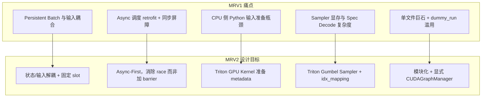
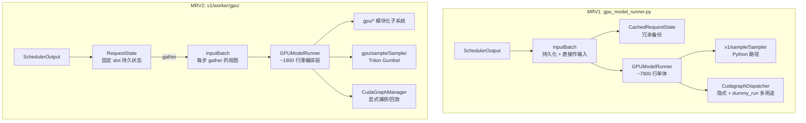
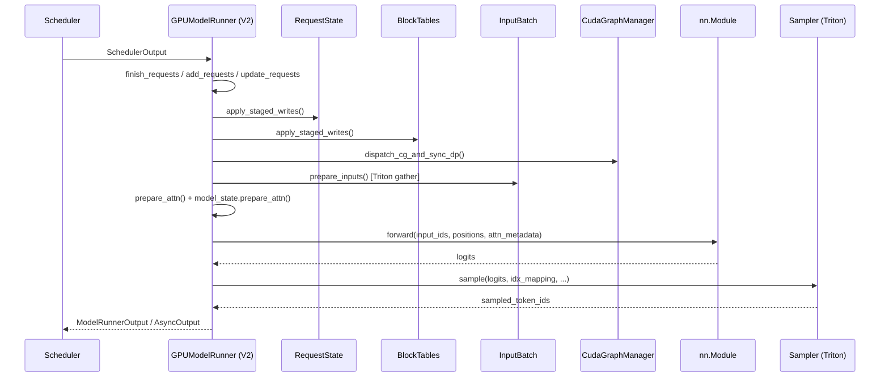
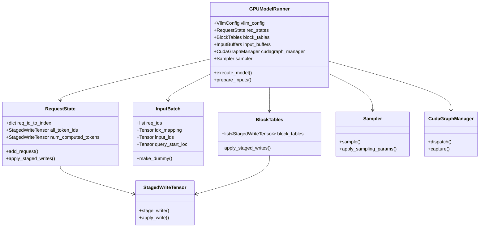
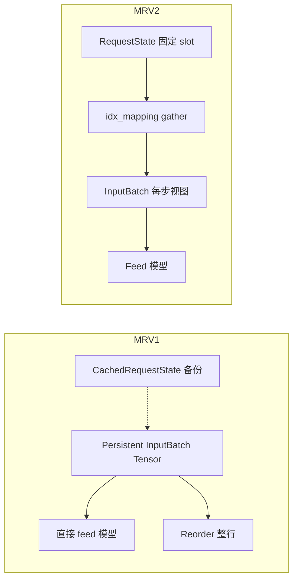

# vLLM Model Runner V2 特性代码走读技术文档

> **文档版本**: 1.0  
> **分析代码版本**: vLLM main 分支（截至 2026-08）  
> **最后更新**: 2026-08-08

---

## 文档概述

Model Runner（模型执行器）是 vLLM V1 引擎中 **Worker 侧的核心组件**：它接收 Scheduler 的调度结果，准备 Attention / Sampling 所需的张量，驱动模型 forward，并返回采样结果。自 V1 引擎上线以来，原始 `GPUModelRunner`（下称 **MRV1**）在 `gpu_model_runner.py` 中持续膨胀，积累了大量技术债。

**Model Runner V2**（下称 **MRV2**）是一次 **从第一性原理重写** 的实验性实现，代码位于 `vllm/v1/worker/gpu/` 目录。它与 MRV1 共享同一套 Scheduler、KV Cache 和 Attention Backend 接口，但在 Persistent Batch、Async Scheduling、Sampler、CUDA Graph 等关键路径上采用了截然不同的设计。

**目标读者**：熟悉 vLLM 基本 Serving 流程、希望理解 MRV2 设计动机与实现细节的开发者。

**阅读建议**：
1. 先读 **第一部分** 理解「为什么要做 V2」以及 V1/V2 架构差异；
2. 再读 **第二、三部分** 对照核心类与执行流程；
3. 最后读 **第四、五部分** 了解功能覆盖与启用方式。

> **关键洞察**：MRV2 并非简单的「重构换皮」，而是围绕 **Async-First**、**GPU-Native 元数据准备** 和 **状态/输入解耦** 三条主线，重新设计了 Worker 侧 hottest path。

---

# 第一部分: Model Runner V2 基础与架构总览

## 1.1 背景：MRV1 遇到了什么问题？

官方设计文档 [`docs/design/model_runner_v2.md`](https://github.com/vllm-project/vllm/blob/main/docs/design/model_runner_v2.md) 开宗明义：

> Since vLLM V1 was first implemented, we discovered several fundamental design mistakes and accumulated significant technical debt. Many features were bolted on that were not considered in the original design.

归纳起来，MRV1 的核心痛点包括：

| 问题域 | MRV1 表现 | 带来的后果 |
|--------|-----------|------------|
| **Persistent Batch** | 持久化状态张量 **直接作为** 模型/Sampler 输入 | 请求增删需整表 reorder；需维护冗余的 `CachedRequestState` |
| **Async Scheduling** | 后期 retrofit，用 `prepare_inputs_event` 做 CPU-GPU 同步屏障 | 易漏保护 buffer；CPU/GPU overlap 受限 |
| **Sampler** | Python + 全词表 logprobs materialization | 峰值显存高；与 Spec Decode 的 per-logit 映射复杂 |
| **CUDA Graph** | 隐式捕获，`dummy_run` 承担过多职责 | 行为分叉、难以推理 graph 生命周期 |
| **代码组织** | 单文件 ~7900 行 `gpu_model_runner.py` | 新特性难以模块化；Review 与测试成本高 |

MRV2 的目标：**更干净、更高效、更模块化**——即便当前尚未 feature-complete，也被认为是相对 MRV1 的实质性改进。

## 1.2 为什么要做 V2？设计动机总结



### 1.2.1 新工具与新认知

MRV2 的实现充分利用了 V1 时代尚未成熟或未被充分应用的能力：

- **Triton**：输入 metadata 准备、StagedWrite diff 应用、Gumbel-max 采样
- **UVA（Universal Virtual Addressing）**：大 CPU 驻留张量（如 `all_token_ids`）可被 GPU Kernel 直接访问
- **Gumbel-max 采样**：无状态 RNG + 避免显式 softmax materialization

## 1.3 MRV1 vs MRV2 整体架构对比



### 1.3.1 核心差异一览表

| 维度 | MRV1 | MRV2 |
|------|------|------|
| **代码位置** | `vllm/v1/worker/gpu_model_runner.py` | `vllm/v1/worker/gpu/model_runner.py` + 80+ 子模块 |
| **Persistent Batch** | 持久张量 = 模型输入；需 reorder | 持久状态与每步 `InputBatch` 解耦；固定 row slot |
| **请求状态** | `CachedRequestState` + `InputBatch` 双份维护 | `RequestState` 统一管理；无 `CachedRequestState` |
| **Block Table 更新** | 整表或复杂 CPU 路径 | `StagedWriteTensor` 增量 diff + Triton kernel |
| **Async 安全** | `synchronize_input_prep()` + `prepare_inputs_event` | `UvaBufferPool` 轮转 + 临时 pin_memory 副本 |
| **输入准备** | 大量 Python/NumPy | Triton kernels（`input_ids`, `positions`, `query_start_loc` 等） |
| **Sampler** | `vllm/v1/sample/sampler.py` | `gpu/sample/sampler.py` + Triton Gumbel |
| **CUDA Graph** | 与 `dummy_run` 耦合 | `CudaGraphManager` 独立管理；`execute_model(dummy_run=True)` 简化 |
| **默认状态** | 非默认 V2 架构时 fallback | 对 dense 非 MoE 模型及特定架构 **默认启用** |
| **成熟度** | 生产默认（fallback） | **Experimental**，功能仍在补齐 |

## 1.4 执行流程：一步 Forward 的数据流

以下走读一个典型的 decode step（非 dummy run）：



### 1.4.1 示例：`execute_model` 主路径

MRV2 的 `execute_model` 清晰地将「状态更新 → batch 描述符 → 输入准备 → forward → sample」分段：

```python
# 文件: vllm/v1/worker/gpu/model_runner.py
@torch.inference_mode()
def execute_model(
    self,
    scheduler_output: SchedulerOutput,
    intermediate_tensors: IntermediateTensors | None = None,
    dummy_run: bool = False,
    skip_attn_for_dummy_run: bool = False,
    is_profile: bool = False,
) -> ModelRunnerOutput | IntermediateTensors | None:
    if not dummy_run:
        self.update_pp_decode_requests()
        self.finish_requests(scheduler_output)
        self.free_states(scheduler_output)
        self.add_requests(scheduler_output)
        self.update_requests(scheduler_output)
        self.block_tables.apply_staged_writes()
        # ...

    batch_desc, num_tokens_across_dp = dispatch_cg_and_sync_dp(
        self.cudagraph_manager, num_reqs, num_toks, ...
    )

    if not dummy_run:
        input_batch = self.prepare_inputs(scheduler_output, batch_desc)
        block_tables, slot_mappings = self.prepare_attn(input_batch)
    else:
        input_batch = InputBatch.make_dummy(...)
        # dummy run 用于 profiling / DP 空转 / warmup
```

> **注意**：MRV2 中 `dummy_run=True` 时 **不会修改请求状态**（除非显式走真实 batch 路径），这与 MRV1 中 `dummy_run` 承担 profiling、capture、warmup、EP+DP 空转等多重职责形成对比。

---

# 第二部分: 核心接口与基类分析

## 2.1 类层次与职责



## 2.2 MRV1 的 Persistent Batch 问题（对照理解）

MRV1 在 `gpu_input_batch.py` 中维护 `CachedRequestState`，作为 `InputBatch` 持久化行的 **备份副本**：

```python
# 文件: vllm/v1/worker/gpu_input_batch.py
@dataclass
class CachedRequestState:
    req_id: str
    prompt_token_ids: list[int] | None
    block_ids: tuple[list[int], ...]
    num_computed_tokens: int
    output_token_ids: list[int]
    # ... 大量 per-request 字段
```

MRV1 的 `gpu_model_runner.py` 同时维护：

```python
# 文件: vllm/v1/worker/gpu_model_runner.py
self.requests: dict[str, CachedRequestState] = {}
self.input_batch = InputBatch(...)  # 持久化张量直接喂给模型
```

当请求 finish/join 时，持久化 tensor 的行顺序必须与 batch 顺序一致，导致 **整表 reorder**；而 GPU 异步读 persistent buffer 时，行可能被新请求覆盖，因此需要 `CachedRequestState` 做备份。

Async 场景下，MRV1 用 **显式同步屏障** 保护 reused CPU tensor：

```python
# 文件: vllm/v1/worker/gpu_model_runner.py
@contextmanager
def synchronize_input_prep(self):
    if self.prepare_inputs_event is None:
        yield
        return
    # 确保上一步 GPU 已读完 reused CPU tensor
    self.prepare_inputs_event.synchronize()
    try:
        yield
    finally:
        self.prepare_inputs_event.record()
```

## 2.3 MRV2 的 RequestState：固定 Slot + Gather

MRV2 为每个 request 分配 **永久 row index**（直到 finish 或 preemption），preemption 视为 finish，resume 时重新 add：

```python
# 文件: vllm/v1/worker/gpu/states.py
class RequestState:
    def __init__(self, max_num_reqs, max_model_len, ...):
        self.req_id_to_index: dict[str, int] = {}
        self.free_indices = list(range(max_num_reqs))

        # 大 tensor 用 UVA 节省 GPU 显存
        self.all_token_ids = StagedWriteTensor(
            (self.max_num_reqs, self.max_model_len),
            dtype=torch.int32, device=device,
            uva_instead_of_gpu=True,
        )
        self.num_computed_tokens = StagedWriteTensor(
            self.max_num_reqs, dtype=torch.int32, device=device
        )

    def add_request(self, req_id, prompt_len, all_token_ids, ...):
        req_idx = self.free_indices.pop()
        self.req_id_to_index[req_id] = req_idx
        self.all_token_ids.stage_write(req_idx, 0, all_token_ids)
        # ...
```

每步根据 Scheduler 给出的 **batch 顺序**，通过 `idx_mapping` gather 出 `InputBatch`——持久状态 layout 与 batch ordering **解耦**。

## 2.4 InputBatch：每步视图，而非持久输入

MRV2 的 `InputBatch` 是 **dataclass 视图**，持有本 step 的 gather 结果：

```python
# 文件: vllm/v1/worker/gpu/input_batch.py
@dataclass
class InputBatch:
    req_ids: list[str]
    idx_mapping: torch.Tensor          # batch_idx -> req_state_idx
    expanded_idx_mapping: torch.Tensor # Spec Decode 时扩展
    num_scheduled_tokens: np.ndarray
    query_start_loc: torch.Tensor
    seq_lens: torch.Tensor
    input_ids: torch.Tensor
    positions: torch.Tensor
    logits_indices: torch.Tensor
    # ...
```

Speculative Decoding 下，每个 logit 向量通过 `expanded_idx_mapping` 映射到正确的 request sampling state，避免 MRV1 中将 per-request state **expand 成与 logits 同 shape** 的做法。

## 2.5 工厂与选型：`use_v2_model_runner`

Worker 在初始化时根据配置选择 V1 或 V2：

```python
# 文件: vllm/v1/worker/gpu_worker.py
if self.use_v2_model_runner:
    from vllm.v1.worker.gpu.model_runner import (
        GPUModelRunner as GPUModelRunnerV2,
    )
    self.model_runner = GPUModelRunnerV2(self.vllm_config, self.device)
else:
    from vllm.v1.worker.gpu_model_runner import (
        GPUModelRunner as GPUModelRunnerV1,
    )
    self.model_runner = GPUModelRunnerV1(self.vllm_config, self.device)
```

`VllmConfig.use_v2_model_runner` 的决策逻辑（简化）：

```python
# 文件: vllm/config/vllm.py
@property
def use_v2_model_runner(self) -> bool:
    # 1. 环境变量 VLLM_USE_V2_MODEL_RUNNER 显式覆盖
    if envs.VLLM_USE_V2_MODEL_RUNNER is not None:
        return envs.VLLM_USE_V2_MODEL_RUNNER

    # 2. 强制 V2 的场景
    if self.parallel_config.prefill_context_parallel_size > 1:
        return True  # PCP 仅 V2 实现
    if self.speculative_config and self.speculative_config.method == "dspark":
        return True
    if self.model_config and self.model_config.is_diffusion:
        return True

    # 3. 默认架构判断
    if not self._is_default_v2_model_runner_model():
        return False
    if not HAS_TRITON:
        return False
    if self._get_v2_model_runner_unsupported_features():
        return False
    return True
```

**默认启用 V2 的模型类型**（`_is_default_v2_model_runner_model`）：
- `runner_type == "generate"`
- **非** hybrid（非默认 V2 架构时）、**非** attention-free
- 满足：`architectures` 在 `DEFAULT_V2_MODEL_RUNNER_ARCHITECTURES` 中 **或** `not model_config.is_moe`（即 **dense 模型默认 V2**）

默认 V2 架构白名单包括：`DeepseekV2ForCausalLM`、`Qwen2MoeForCausalLM`、`GraniteMoeForCausalLM` 等（见 `vllm/config/vllm.py`）。

---

# 第三部分: 核心实现深度分析

## 3.1 StagedWriteTensor：增量 Block Table 更新

Block Table 是 persistent batch 中最大的 CPU 热点之一。MRV2 避免每步全量 H2D，而是 **stage diff → pack → 一次 kernel apply**：

```python
# 文件: vllm/v1/worker/gpu/buffer_utils.py
class StagedWriteTensor:
    def stage_write(self, index: int, start: int, x: Iterable[int]) -> None:
        self._staged_write_indices.append(index)
        self._staged_write_starts.append(start)
        self._staged_write_contents.extend(x)
        self._staged_write_cu_lens.append(len(self._staged_write_contents))

    def apply_write(self) -> None:
        # 将 staged indices/starts/contents 拷到 GPU，launch Triton kernel
        _apply_write_kernel[(n,)](self.gpu, ...)
```

`BlockTables` 对每个 KV cache group 维护一个 `StagedWriteTensor`：

```python
# 文件: vllm/v1/worker/gpu/block_table.py
class BlockTables:
    def __init__(self, block_sizes, max_num_reqs, ...):
        self.block_tables: list[StagedWriteTensor] = []
        for i in range(self.num_kv_cache_groups):
            block_table = StagedWriteTensor(
                (self.max_num_reqs, max_num_blocks),
                dtype=torch.int32, device=device,
            )
            self.block_tables.append(block_table)
```

## 3.2 消除 Async Race：UvaBufferPool 轮转

MRV2 的核心思路：**CPU 写入源 buffer，GPU 读取临时副本**，二者生命周期不重叠：

```python
# 文件: vllm/v1/worker/gpu/buffer_utils.py
def async_copy_to_gpu(x, out=None, device=None):
    pinned = x.pin_memory()  # 每次 copy 前 pin 临时副本
    return out.copy_(pinned, non_blocking=True)

class UvaBufferPool:
    def copy_to_uva(self, x):
        self._curr = (self._curr + 1) % self.max_concurrency
        buf = self._uva_bufs[self._curr]
        dst[:n] = x
        return buf.uva[:n]
```

`max_concurrency` 默认与 engine 的 `max_concurrent_batches` 对齐（至少 2），支持 step N 的 GPU 读与 step N+1 的 CPU 写 **无 barrier 并行**。

对比 MRV1：pinned 的 persistent CPU buffer 被 in-place 修改，必须 `prepare_inputs_event.synchronize()` 等待 GPU 读完。

## 3.3 GPU-Native 输入 Metadata：Triton Kernels

MRV2 在 `input_batch.py` 中用多个 `@triton.jit` kernel 准备：

| Kernel | 作用 |
|--------|------|
| `prepare_prefill_inputs` | 从 token 历史 gather `input_ids` |
| `prepare_pos_seq_lens` | 计算 `positions`、`seq_lens` |
| `post_update` | forward 后更新 `num_computed_tokens` 等 |
| `combine_sampled_and_draft_tokens` | Spec Decode token 合并 |

优势：
1. **Async 友好**：Spec Decode 下 GPU 侧可推导 CPU 尚不可知的 token 值
2. **低 CPU 开销**：避免 Python 循环构造大张量

## 3.4 Triton-Native Sampler 与 Gumbel-max

MRV2 Sampler 位于 `vllm/v1/worker/gpu/sample/sampler.py`，核心采样路径：

```python
# 文件: vllm/v1/worker/gpu/sample/sampler.py
def sample(self, logits, expanded_idx_mapping, idx_mapping, ...):
    processed_logits = self.apply_sampling_params(...)
    if use_flashinfer:
        sampled = flashinfer_sample(processed_logits, top_k, top_p)
    else:
        processed_logits = apply_top_k_top_p(processed_logits, top_k, top_p)
        sampled = gumbel_sample(
            processed_logits,
            expanded_idx_mapping,
            self.sampling_states.temperature.gpu,
            self.sampling_states.seeds.gpu,
            pos,
            apply_temperature=False,
        )
    return sampled, processed_logits
```

Gumbel kernel（`gumbel.py`）特点：
- Kernel 内 **stateless RNG**（seed + offset）
- 避免显式 softmax 全词表 materialization
- 通过 `expanded_idx_mapping` 支持 **per-logit 映射到 per-request state**（Spec Decode 友好）

**Top-K Logprobs 优化**：先选 top-k token，再 **仅对选中 token** 计算 logprobs，降低峰值显存（MRV1 常 materialize 全词表 logprobs）。

## 3.5 显式 CUDA Graph 管理

MRV2 的 `CudaGraphManager`（`cudagraph_utils.py`）用 `BatchExecutionDescriptor` 描述 capture/runtime 形状匹配：

```python
@dataclass(frozen=True)
class BatchExecutionDescriptor:
    cg_mode: CUDAGraphMode
    num_tokens: int
    num_reqs: int | None
    uniform_token_count: int | None = None
    num_active_loras: int = 0
```

与 MRV1 对比：

| 方面 | MRV1 | MRV2 |
|------|------|------|
| Graph 选择 | `CudagraphDispatcher` + 隐式逻辑 | `CudaGraphManager.dispatch()` 显式匹配 |
| Capture 入口 | 常经 `dummy_run` 分叉 | 独立 capture path |
| Dummy run | profiling / warmup / EP+DP / capture 混合 | `execute_model(dummy_run=True)` 委托，**不改状态** |
| 扩展性 | 难捕获 multi-step draft graph | 可捕获多个 draft forward 到同一 graph |

## 3.6 模块化目录结构

MRV2 将 MRV1 巨石中的特性拆到独立模块：

| 子目录/文件 | 职责 |
|-------------|------|
| `gpu/states.py` | Request 持久状态 |
| `gpu/input_batch.py` | 每步输入视图 + Triton prep |
| `gpu/buffer_utils.py` | StagedWrite / UVA / async H2D |
| `gpu/block_table.py` | KV block table |
| `gpu/sample/` | Triton sampler、penalties、logprob、Gumbel |
| `gpu/spec_decode/` | EAGLE / MTP / DFlash / DSpark 等 |
| `gpu/cudagraph_utils.py` | CUDA Graph 生命周期 |
| `gpu/model_states/` | 模型类型相关状态（default / mamba / encoder-decoder） |
| `gpu/pool/` | Pooling / Embedding runner |
| `gpu/mm/` | 多模态 encoder |

`model_runner.py` 文件头注释明确要求 **保持极简、稳定**——模型特有逻辑必须下沉到子模块。

---

# 第四部分: MRV1 与 MRV2 能力对比

## 4.1 功能支持矩阵（截至 2026-08）

以下摘自 `VllmConfig._get_v2_model_runner_unsupported_features()`，当检测到 unsupported feature 时 **自动 fallback 到 MRV1**（除非用户 `VLLM_USE_V2_MODEL_RUNNER=1` 强制启用，此时 validate 报错）：

| 功能 | MRV1 | MRV2 |
|------|:----:|:----:|
| Dense LLM 生成（默认） | ✅ | ✅ **默认** |
| MoE 模型（非白名单架构） | ✅ | ❌ fallback V1 |
| PCP（Prefill Context Parallel） | ❌ | ✅ **强制 V2** |
| DSpark Spec Decode | ❌ | ✅ **强制 V2** |
| Diffusion 模型 | ❌ | ✅ **强制 V2** |
| EAGLE / EAGLE3 / MTP / DFlash | ✅ | ✅ |
| ngram / ngram_gpu Spec Decode | ✅ | ❌ |
| Medusa / 其他 spec method | ✅ | ❌ |
| Parallel drafting (P-Eagle) | ✅ | ❌ |
| EAGLE3 + PP | ✅ | ❌ |
| Custom logits processors | ✅ | ❌ |
| Prompt embeds | ✅ | ❌ |
| Dual batch overlap (DBO) | ✅ | ❌ |
| Elastic EP | ✅ | ❌ |
| Sequence parallelism | ✅ | ❌ |
| PP + external_launcher | ✅ | ❌ |
| KV sharing fast prefill | ✅ | ❌ |
| Pooling / Embedding | ✅ | ✅（独立 `PoolingRunner`） |
| CPU Worker V2 | — | ✅（`cpu_worker.py` 可选 V2） |
| XPU V2 | — | ✅（继承 `GPUModelRunnerV2`） |

## 4.2 Persistent Batch 设计对比（核心差异图解）



## 4.3 性能与设计预期

MRV2 预期收益（需结合具体 workload 实测）：

| 指标 | 预期变化 | 原因 |
|------|----------|------|
| CPU overhead（大 batch） | ↓ | Triton 输入准备 + StagedWrite 增量更新 |
| Async 调度 overlap | ↑ | 无全局 input prep barrier |
| 采样峰值显存 | ↓ | Top-K logprobs 按需计算 |
| 长 prompt logprobs | ↓ 内存尖峰 | 更细粒度 chunking |
| 代码可维护性 | ↑ | 模块化 + 显式 abstractions |
| 功能覆盖 | 暂 ↓ | 仍在补齐 MRV1 特性 |

> **性能提示**：MRV2 对 **Triton 有硬依赖**。无 Triton 时自动 fallback MRV1。ROCm 上部分架构默认排除 V2（见 `ROCM_EXCLUDED_V2_MODEL_RUNNER_ARCHITECTURES`）。

---

# 第五部分: 配置与使用指南

## 5.1 启用 / 禁用 MRV2

| 方式 | 说明 |
|------|------|
| **自动（默认）** | 满足架构 + 无 unsupported feature → 启用 V2 |
| `VLLM_USE_V2_MODEL_RUNNER=1` | 强制启用（unsupported 时启动报错） |
| `VLLM_USE_V2_MODEL_RUNNER=0` | 强制使用 MRV1 |
| 未设置 env | 走 `VllmConfig.use_v2_model_runner` 启发式 |

启动日志（rank 0）：
```
Using V2 Model Runner
```

## 5.2 典型配置示例

```bash
# 强制 MRV2（调试 / 对比测试）
export VLLM_USE_V2_MODEL_RUNNER=1

# 启动服务（dense 模型通常已默认 V2）
vllm serve meta-llama/Llama-3.1-8B-Instruct

# 强制回退 MRV1（使用 V2 尚未支持的特性时）
export VLLM_USE_V2_MODEL_RUNNER=0
vllm serve my-model --speculative-config '{"method": "ngram", ...}'
```

## 5.3 开发注意事项

1. **Experimental**：`vllm/v1/worker/gpu/README.md` 标注 under active development，大改需联系维护者。
2. **Modularity 优先**：新特性应加入对应子模块，避免继续膨胀 `model_runner.py`。
3. **First-principles**：从 V1 port 特性时，应重新审视是否适配 MRV2 的 gather / async / Triton 模型，而非机械翻译。
4. **测试**：CI 有独立 `model_runner_v2` test area（`.buildkite/test_areas/model_runner_v2.yaml`），变更应跑相关测试。

## 5.4 何时仍应使用 MRV1？

- 依赖 **custom logits processors**、**prompt embeds**、**ngram spec decode** 等 V2 未支持特性
- **MoE + 非白名单架构** 且未显式 force V2
- 需要 **DBO / Elastic EP / Sequence Parallelism** 等并行特性
- 生产环境要求 **最大功能兼容性**，可接受 MRV1 的成熟路径

---

# 附录

## A. 关键代码位置索引

| 组件 | 文件路径 |
|------|----------|
| MRV2 设计文档 | `docs/design/model_runner_v2.md` |
| MRV2 主入口 | `vllm/v1/worker/gpu/model_runner.py` |
| MRV1 主入口 | `vllm/v1/worker/gpu_model_runner.py` |
| Worker 选型 | `vllm/v1/worker/gpu_worker.py` |
| V2 配置逻辑 | `vllm/config/vllm.py` (`use_v2_model_runner`) |
| Request 持久状态 | `vllm/v1/worker/gpu/states.py` |
| 每步 InputBatch | `vllm/v1/worker/gpu/input_batch.py` |
| StagedWrite / UVA | `vllm/v1/worker/gpu/buffer_utils.py` |
| Block Table | `vllm/v1/worker/gpu/block_table.py` |
| Triton Sampler | `vllm/v1/worker/gpu/sample/sampler.py` |
| Gumbel Kernel | `vllm/v1/worker/gpu/sample/gumbel.py` |
| CUDA Graph | `vllm/v1/worker/gpu/cudagraph_utils.py` |
| Async 输出 | `vllm/v1/worker/gpu/async_utils.py` |
| MRV1 CachedRequestState | `vllm/v1/worker/gpu_input_batch.py` |
| MRV1 Async 屏障 | `gpu_model_runner.py` → `synchronize_input_prep()` |
| 环境变量 | `vllm/envs.py` → `VLLM_USE_V2_MODEL_RUNNER` |
| CI 测试区 | `.buildkite/test_areas/model_runner_v2.yaml` |

## B. 术语表

| 术语 | 说明 |
|------|------|
| **Model Runner** | Worker 内执行模型 forward + sampling 的组件 |
| **MRV1 / MRV2** | Model Runner V1 / V2 的简称 |
| **Persistent Batch** | 跨 step 复用 batch 级张量、增量更新而非全量重建的优化 |
| **RequestState** | MRV2 中按固定 slot 存储的请求持久状态 |
| **InputBatch** | 单 step 的模型输入视图（V2 为 gather 结果；V1 为持久输入） |
| **idx_mapping** | batch 内位置 → RequestState slot 的映射 |
| **StagedWriteTensor** | 先 stage diff、再一次 kernel 应用到 GPU 的增量写抽象 |
| **UVA** | Universal Virtual Addressing，GPU 可直接访问 pinned CPU 内存 |
| **Async Scheduling** | Scheduler 在 GPU 执行 step N 时并行准备 step N+1 |
| **Gumbel-max** | 通过 Gumbel 噪声 + argmax 等价于从 categorical 分布采样 |
| **CUDAGraphManager** | MRV2 中显式管理 CUDA Graph capture/replay 的组件 |

---

## 总结：一句话回答「V2 和 V1 的区别 & 为什么做 V2」

**区别**：MRV2 将 Persistent Batch **解耦为 RequestState + 每步 InputBatch gather**，以 **Triton + UVA + StagedWrite** 实现 Async-First 的 GPU-native 输入与采样路径，并用 **模块化 + 显式 CUDAGraphManager** 替代 MRV1 的单体文件与隐式 graph/dummy_run 逻辑。

**为什么**：MRV1 在 Persistent Batch、Async Scheduling、Sampler 和 CUDA Graph 等核心路径上积累了 **根本性设计债务**；随着 Spec Decode、Async Scheduling、PCP 等特性叠加，retrofit 成本已超过重写。MRV2 从第一性原理出发，目标是在保持 vLLM V1 引擎架构的前提下，提供 **更低 CPU 开销、更好 async overlap、更低采样显存、更易扩展** 的 Worker 实现。

完整教程已保存至 skill outputs 目录，可直接打开阅读或分享。
