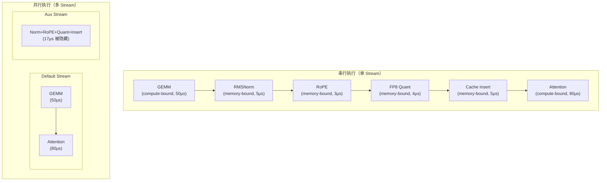
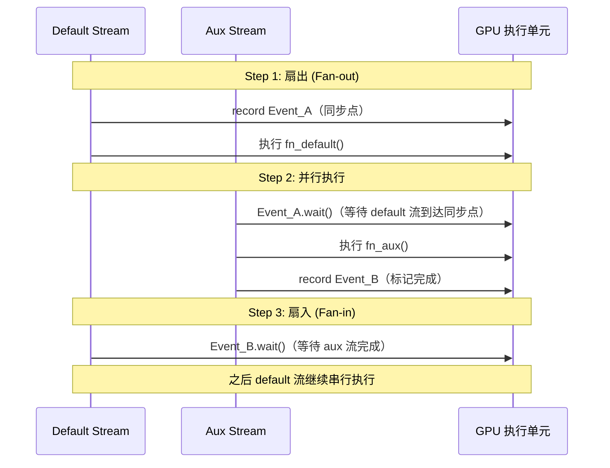
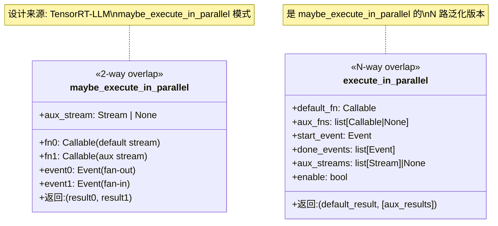
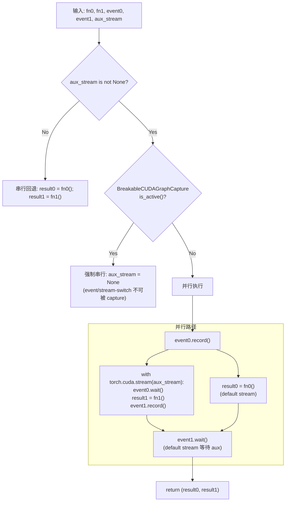
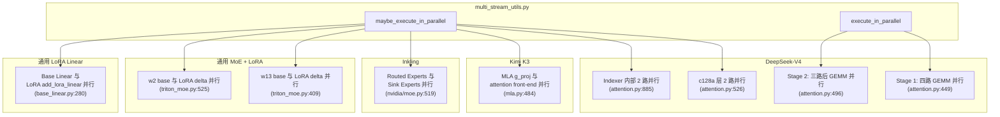
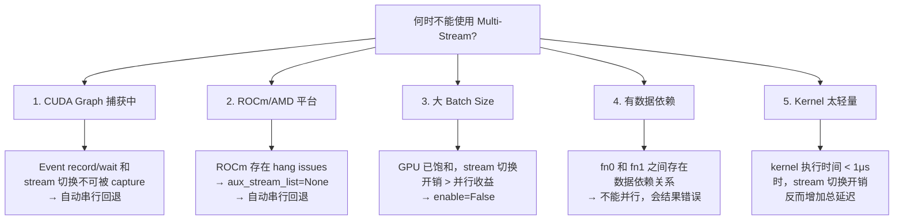
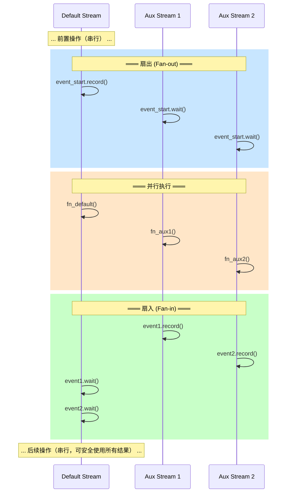

# vLLM Multi-Stream Overlap 多流并行机制 技术文档

> **文档版本**: 1.0
> **分析代码版本**: vLLM main 分支（截至 2026-08）
> **最后更新**: 2026-08-02

---

## 文档概述

本文档深入分析 vLLM 中 `vllm/utils/multi_stream_utils.py` 的多流并行（Multi-Stream Overlap）机制，包括核心 API 的设计原理、全仓库的使用场景、以及在大模型推理中为什么需要多流并行、什么时候不能使用多流并行。

**目标读者**：对 GPU 推理优化有一定了解、希望理解 vLLM 中多流并行设计的工程师和研究者。

**阅读建议**：建议先阅读第一部分理解 GPU 推理的瓶颈和 Multi-Stream 的基本原理，再结合第二部分的核心 API 分析，最后通过第三部分的使用场景深入理解实际应用。

---

# 第一部分: 为什么大模型推理需要 Multi-Stream Overlap？

## 1.1 GPU 推理的"空闲等待"问题

大模型推理（尤其是 decode 阶段）有一个核心特征：**操作多而小，大多是 memory-bound**。



**关键问题**：当 GPU 在执行 memory-bound 操作（如 RMSNorm、RoPE）时，计算单元（Tensor Cores）几乎空闲，因为瓶颈在 HBM 带宽而非计算。如果将这些操作串行排列，GPU 大量时间浪费在"等待数据从 HBM 搬运到寄存器"上。

**Multi-Stream 的核心思路**：将**没有数据依赖**的操作放到不同的 CUDA Stream 上并行执行。当一个 Stream 上的 kernel 在等待 HBM 数据时，另一个 Stream 上的 kernel 可以同时使用计算单元，从而"隐藏" memory-bound 操作的延迟。

## 1.2 为什么 decode 阶段 Multi-Stream 收益最大？

| 阶段 | Batch Size | GPU 利用率 | Multi-Stream 收益 |
|------|-----------|-----------|-------------------|
| Prefill (大 batch) | 数百~数千 tokens | 高（compute-bound） | **低** — GPU 已饱和 |
| Decode (小 batch) | 1~32 tokens | 低（memory-bound） | **高** — 大量空闲计算单元 |

在 decode 阶段，每次只处理少量 token（通常等于当前 running requests 数），单个 GEMM 远不足以打满 GPU。此时存在大量**横向并行空间**：多个独立的细碎操作可以同时在不同 Stream 上执行。

## 1.3 Multi-Stream 的基本原理

CUDA 提供了 **Stream（流）** 的抽象：同一 Stream 内的操作严格按序执行，不同 Stream 间的操作可以并行。



核心同步原语：
- **`torch.cuda.Event`**: 轻量级同步标记，用于跨 Stream 协调
- **`event.record()`**: 在当前 Stream 的所有排队操作完成后记录一个标记
- **`event.wait()`**: 当前 Stream 暂停直到指定 Event 被记录
- **`torch.cuda.Stream`**: 独立的命令队列，各 Stream 间的 kernel 可以并发执行

---

# 第二部分: 核心 API 设计分析

## 2.1 整体设计

文件 `vllm/utils/multi_stream_utils.py` 提供两个核心函数，形成 2-way 到 N-way 的能力梯级：



## 2.2 `maybe_execute_in_parallel` — 2 路并行

```python
# 文件: vllm/utils/multi_stream_utils.py (line 20-66)
def maybe_execute_in_parallel(
    fn0: Callable[[], Any],       # default stream 上执行
    fn1: Callable[[], Any],       # aux stream 上执行
    event0: torch.cuda.Event,     # 扇出事件: fn0 之前记录
    event1: torch.cuda.Event,     # 扇入事件: fn1 之后记录
    aux_stream: torch.cuda.Stream | None = None,
) -> tuple[Any, Any]:
```

**执行流程**：



> **关键洞察**: `event0.record()` 在 `fn0()` 之前执行，这意味着 aux stream 可以在 default stream 真正启动 `fn0` 之前就开始等待。这是有意为之：它保证 aux stream 不会在 default stream 尚未到达同步点时提前执行，且 `event0.record()` 本身开销极小（仅记录一个时间戳）。

**自动串行回退的三个条件**：

| 条件 | 触发场景 | 原因 |
|------|---------|------|
| `aux_stream is None` | ROCm 平台、未初始化 | 无辅助 Stream 可用 |
| `BreakableCUDAGraphCapture.is_active()` | CUDA Graph 捕获中 | Event/Stream 切换不可被 capture |
| 调用方显式传 `None` | 大 batch 时性能反而下降 | 切换开销 > 并行收益 |

## 2.3 `execute_in_parallel` — N 路并行

```python
# 文件: vllm/utils/multi_stream_utils.py (line 69-136)
def execute_in_parallel(
    default_fn: Callable[[], Any],                    # default stream
    aux_fns: list[Callable[[], Any] | None],          # N 个 aux callable
    start_event: torch.cuda.Event,                     # 公用扇出事件
    done_events: list[torch.cuda.Event],               # 每路独立扇入事件
    aux_streams: list[torch.cuda.Stream] | None = None, # N 个 aux stream
    enable: bool = False,                              # 显式启停开关
) -> tuple[Any, list[Any]]:
```

**与 `maybe_execute_in_parallel` 的关键差异**：

| 特性 | `maybe_execute_in_parallel` | `execute_in_parallel` |
|------|---------------------------|----------------------|
| 并行路数 | 固定 2 路 | 任意 N 路 |
| 自动禁用逻辑 | 内置（CUDA Graph 检测） | 通过 `enable` 参数由调用方控制 |
| None slot 支持 | 无（两路都执行） | 有（`aux_fns[i]=None` 跳过该 slot） |
| 返回值 | `(r0, r1)` | `(default_result, [r0, r1, ...])` |

**`enable` 参数的设计意图**：

```python
# 调用方负责控制是否启用，而非 execute_in_parallel 内部自动判断
qr_kv, (kv_score, indexer_weights, indexer_kv_score) = execute_in_parallel(
    fused_wqa_wkv,
    aux_fns,
    self.ln_events[0],
    self.ln_events[1:4],
    aux_streams,
    enable=hidden_states.shape[0]
    <= envs.VLLM_MULTI_STREAM_GEMM_TOKEN_THRESHOLD,  # 调用方决定！
)
```

这种设计的优点是**策略与控制解耦**：`execute_in_parallel` 只负责执行机制，启用条件（token 数阈值、platform 判断等）完全由调用方根据场景定制。

---

# 第三部分: 全仓库使用场景分析

`multi_stream_utils.py` 在整个 vLLM 仓库中有 **6 种使用场景**，覆盖了从 MoE 到 Attention 到 LoRA 的多个子系统。

## 3.1 场景总览



## 3.2 DeepSeek-V4: 最复杂的 Multi-Stream 设计

已在[前一篇文档](./deepseek_v4_kv_cache_multistream.md)中详细分析，这里简要总结三级并行：

| 层级 | 函数 | 并行路数 | 启用条件 |
|------|------|---------|---------|
| Stage 1: GEMM 并行 | `execute_in_parallel` | 4 路 | `num_tokens <= 1024` |
| Stage 2: 后 GEMM 并行 | `execute_in_parallel` + `maybe_execute_in_parallel` | 3 路 / 2 路 | 有 indexer 时 3 路，仅 compressor 时 2 路 |
| Indexer 内部 | `maybe_execute_in_parallel` | 2 路 | C4A 层时 Q quant 与 compressor 并行 |

```python
# 文件: vllm/models/deepseek_v4/attention.py (line 449)
# Stage 1: 四路 GEMM 并行
qr_kv, (kv_score, indexer_weights, indexer_kv_score) = execute_in_parallel(
    fused_wqa_wkv,        # default: 最重 GEMM
    aux_fns,              # aux[0]: compressor kv_score
                          # aux[1]: indexer weights_proj
                          # aux[2]: indexer compressor kv_score
    self.ln_events[0],    # 扇出事件
    self.ln_events[1:4],  # 每路独立扇入事件
    aux_streams,
    enable=hidden_states.shape[0] <= envs.VLLM_MULTI_STREAM_GEMM_TOKEN_THRESHOLD,
)
```

## 3.3 Kimi K3: Attention + Gating 并行

Kimi K3 的 MLA 注意力层将注意力前向计算与 `g_proj`（输出门控投影）放在不同 Stream 上并行：

```python
# 文件: vllm/models/kimi_k3/nvidia/mla.py (line 484)
# g_proj 的 GEMM 在 aux stream 上，与 attention 前端计算重叠
attn_out, gate = maybe_execute_in_parallel(
    lambda: self._forward_attn(positions, hidden_states),  # default
    lambda: g_proj(hidden_states)[0],                       # aux stream
    events[0],
    events[1],
    self.aux_stream,
)
```

**设计精妙之处**：`g_proj` 和 `attention` 的输出在后续步骤才需要汇合（`gate_sigmoid_mul`），在此之前二者完全独立，是天然的并行候选。

## 3.4 Inkling: Routed vs Sink Expert 并行

Inkling 的 MoE 层包含两类专家：路由专家（routed experts）和沉没专家（sink experts），它们的计算相互独立：

```python
# 文件: vllm/models/inkling/nvidia/moe.py (line 519)
out, sink_out = maybe_execute_in_parallel(
    lambda: self.experts(hidden_states=x, router_logits=router_logits),  # default
    lambda: self.sink_experts(x, gammas),                                 # aux stream
    self._sink_events[0],
    self._sink_events[1],
    self._sink_stream
    if num_tokens <= envs.VLLM_SHARED_EXPERTS_STREAM_TOKEN_THRESHOLD  # 默认 256
    else None,
)
```

> **关键洞察**: Inkling 的阈值（256）比 DeepSeek-V4 Stage 1 的阈值（1024）更小，因为 MoE 的 routed experts 比 DSV4 的单个 GEMM 重得多，更早达到 GPU 饱和。

## 3.5 Triton MoE + LoRA: Base 与 LoRA Delta 并行

在支持 LoRA 的 MoE 层中，base expert 的 `w13`/`w2` GEMM 与 LoRA delta 修正可以并行计算：

```python
# 文件: vllm/model_executor/layers/fused_moe/experts/triton_moe.py (line 409)
# w13: base expert GEMM 与 LoRA delta 并行
_, lora_meta = maybe_execute_in_parallel(
    _base_w13_fn,     # default: base expert w13 forward
    _lora_w13_fn,     # aux: LoRA delta 计算
    lora_context.events[0],
    lora_context.events[1],
    lora_context.aux_stream,
)

# 文件: vllm/model_executor/layers/fused_moe/experts/triton_moe.py (line 525)
# w2: 同样的模式
maybe_execute_in_parallel(
    _base_w2_fn,      # default: base expert w2 forward
    _lora_w2_fn,      # aux: LoRA delta 计算
    lora_context.events[2],
    lora_context.events[3],
    lora_context.aux_stream,
)
```

## 3.6 LoRA BaseLinear: 通用 LoRA 并行

最通用的 LoRA 场景——将 base 层的 linear 计算与 LoRA adapter 的 `add_lora_linear` 放在不同 Stream 上：

```python
# 文件: vllm/lora/layers/base_linear.py (line 280)
output, lora_result = maybe_execute_in_parallel(
    base_fn,             # default: base 层的量化 linear
    lora_fn,             # aux: LoRA A×B 低秩修正
    self._events[0],
    self._events[1],
    self._lora_stream,
)
# 两路结果汇合
output.add_(lora_result)  # base output + LoRA delta
```

**启用条件**: `VLLM_LORA_ENABLE_DUAL_STREAM=1`（默认关闭，需显式开启）。

---

# 第四部分: 什么时候不能使用 Multi-Stream？

Multi-Stream 不是银弹。以下场景**必须串行执行**：

## 4.1 限制总览



## 4.2 限制一：CUDA Graph 捕获期间

**这是最重要的"自动禁用"场景**。CUDA Graph 的工作原理是将一系列 GPU 操作**预先录制**为一个静态图，然后可以**回放**。录制期间不能包含动态行为（条件分支、event 同步、stream 切换）。

```python
# 文件: vllm/utils/multi_stream_utils.py (line 49-53)
# maybe_execute_in_parallel 内部的自动检测
if aux_stream is not None:
    from vllm.compilation.breakable_cudagraph import BreakableCUDAGraphCapture
    if BreakableCUDAGraphCapture.is_active():
        aux_stream = None  # 强制串行！
```

**vLLM 的解决方案**：使用 Breakable CUDA Graph 机制。将 decode 路径拆分为"可捕获段"和"Eager 段"：

- **捕获段**：输入 GEMM + RMSNorm（与 metadata 无关的纯计算）
- **Eager 段**：Multi-Stream 并行部分（依赖 metadata 的操作）

```python
# 文件: vllm/models/deepseek_v4/attention.py (line 461)
@eager_break_during_capture  # 这个装饰器标记了 Graph 的断点
def attention_impl(self, ...):
    # 此方法内的代码以 eager 模式执行，可以安全使用 multi-stream
    q, _ = execute_in_parallel(...)
```

## 4.3 限制二：ROCm/AMD 平台

AMD GPU 上的 CUDA Stream 行为与 NVIDIA 不完全一致，vLLM 在 ROCm 上显式禁用 multi-stream：

```python
# 文件: vllm/models/deepseek_v4/amd/model.py (line ~556)
# ROCm 构建时 aux_stream_list 设为 None
aux_stream_list = None if current_platform.is_rocm() else [...]

# 文件: vllm/models/deepseek_v4/attention.py (line 405-407)
# 调用方已做好回退准备
if aux_streams is not None:
    aux_streams = aux_streams[:3]
# 若 aux_streams 是 None，execute_in_parallel 自动串行执行
```

同时，NVIDIA 平台在 `maybe_execute_in_parallel` 调用处也做防御：

```python
aux_stream_list[0] if self.aux_stream_list is not None else None
```

> **注意**: 串行回退不影响功能正确性，仅损失并行性能收益。

## 4.4 限制三：大 Batch Size

当 batch size 增大到一定程度，单个 GEMM 本身已经足够打满 GPU，此时 multi-stream 的并行收益消失，stream 切换的开销（约数微秒）反而成为负面因素。

vLLM 通过环境变量控制不同场景的阈值：

| 场景 | 环境变量 | 默认阈值 | 原因 |
|------|---------|---------|------|
| DSV4 Stage 1 GEMM 并行 | `VLLM_MULTI_STREAM_GEMM_TOKEN_THRESHOLD` | 1024 | 多个中等 GEMM 并行，阈值较高 |
| Inkling Sink Expert 并行 | `VLLM_SHARED_EXPERTS_STREAM_TOKEN_THRESHOLD` | 256 | MoE 更重，更早饱和 |

```python
# DeepSeek-V4 Stage 1: token 数超过 1024 时关闭
enable=hidden_states.shape[0] <= envs.VLLM_MULTI_STREAM_GEMM_TOKEN_THRESHOLD

# Inkling Sink Experts: token 数超过 256 时关闭
self._sink_stream if num_tokens <= envs.VLLM_SHARED_EXPERTS_STREAM_TOKEN_THRESHOLD else None
```

## 4.5 限制四：有数据依赖的操作

Multi-Stream 的前提是并行操作之间**无数据依赖**。如果 fn0 的输出是 fn1 的输入，放到不同 Stream 上会导致不确定的执行顺序，结果错误。

```
错误示例:
  fn0 = lambda: compute_A(x)   # 输出 A
  fn1 = lambda: compute_B(A)   # 输入 A ← 依赖 fn0 的输出！
  # 如果 fn0 和 fn1 在不同 Stream 上，fn1 可能在 fn0 完成前就读取了 A

正确示例:
  fn0 = lambda: compute_A(x)   # 输出 A（与 B 无关）
  fn1 = lambda: compute_B(x)   # 输出 B（与 A 无关）
  # A 和 B 独立计算，后续再汇合：result = combine(A, B)
```

## 4.6 限制五：Kernel 过轻量时的开销

Stream 切换本身有开销（CUDA Event 的 record/wait 约 0.5~2μs）。如果一个 kernel 的执行时间只有 1~2μs，将其放到独立 Stream 上反而得不偿失——切换开销超过了并行节省的时间。

> **经验法则**：只有 kernel 执行时间 > 5μs 时才值得使用 Multi-Stream。这也是为什么 vLLM 倾向于使用 kernel 融合（如融合 Norm+RoPE+Quant）——融合后的大 kernel 才值得放到独立 Stream 上。

---

# 第五部分: 设计模式总结

## 5.1 两类"可并行"模式

vLLM 仓库中的 multi-stream 使用可以归纳为两种模式：

| 模式 | 典型场景 | 核心特征 |
|------|---------|---------|
| **计算+计算并行** | GEMM ∥ GEMM（DSV4 Stage 1）、Routed ∥ Sink Expert（Inkling） | 两个独立的 compute-bound 操作 |
| **计算+旁路并行** | Base Linear ∥ LoRA Delta（LoRA）、Attention ∥ Gating（Kimi K3） | 主路径 compute-bound + 旁路轻量修正 |

## 5.2 扇出-扇入模型

所有 multi-stream 使用都遵循统一的"扇出-扇入"模型：



## 5.3 性能收益量化

| 场景 | 条件 | 延迟降低 |
|------|------|---------|
| DSV4 Stage 1+2 Multi-Stream | 低 batch size (1-32) | **5-6%** 端到端 |
| DSV4 Fused Q Norm + KV Insert | 对比未融合 baseline | **10-20x**（融合 + 并行） |
| DSV4 Compressor 融合 | 对比未融合 baseline | **1.4-3x** |
| LoRA Base+Delta 并行 | `VLLM_LORA_ENABLE_DUAL_STREAM=1` | 视 LoRA rank 而定，如 rank=16 时约 3-8% |

---

# 第六部分: 配置与使用指南

## 6.1 关键环境变量

| 环境变量 | 默认值 | 作用 |
|---------|--------|------|
| `VLLM_MULTI_STREAM_GEMM_TOKEN_THRESHOLD` | 1024 | DSV4 Stage 1 GEMM 并行的 token 数上限 |
| `VLLM_SHARED_EXPERTS_STREAM_TOKEN_THRESHOLD` | 256 | Inkling Sink/Routed Expert 并行的 token 数上限 |
| `VLLM_DISABLE_SHARED_EXPERTS_STREAM` | 0 | 全局禁用 Shared Experts multi-stream |
| `VLLM_LORA_ENABLE_DUAL_STREAM` | 0 | 启用 LoRA Base+Delta 双流并行 |
| `VLLM_USE_BREAKABLE_CUDAGRAPH` | 未设置 | 启用 Breakable CUDA Graph 以支持 multi-stream |

## 6.2 新场景接入指南

如果要为新的操作引入 multi-stream overlap，遵循以下步骤：

1. **确认无数据依赖**: 验证两个操作之间没有读写冲突
2. **创建 Stream 和 Events**: 在模块 `__init__` 中创建（复用而非每次 forward 创建）
3. **选择合适的 API**: 2 路用 `maybe_execute_in_parallel`，3+ 路用 `execute_in_parallel`
4. **设置阈值**: 根据操作的 compute 特征选择合理的 token 数阈值
5. **处理回退**: 确保 `aux_stream=None` 时功能正确
6. **处理 CUDA Graph**: 要么用 `@eager_break_during_capture` 标记，要么在调用链中保证 capture 时自动回退

---

# 附录

## A. 关键代码位置索引

| 模块 | 文件路径 | 说明 |
|------|---------|------|
| **Multi-Stream 核心** | `vllm/utils/multi_stream_utils.py` | `maybe_execute_in_parallel`, `execute_in_parallel` |
| DeepSeek-V4 Attention | `vllm/models/deepseek_v4/attention.py` | Stage 1+2 multi-stream、Indexer 内部并行 |
| Kimi K3 MLA | `vllm/models/kimi_k3/nvidia/mla.py` | g_proj 与 attention 并行 |
| Inkling MoE (NVIDIA) | `vllm/models/inkling/nvidia/moe.py` | Routed vs Sink Expert 并行 |
| Inkling MoE (AMD) | `vllm/models/inkling/amd/moe.py` | (ROCm 回退串行) |
| Triton MoE + LoRA | `vllm/model_executor/layers/fused_moe/experts/triton_moe.py` | w13/w2 base 与 LoRA delta 并行 |
| LoRA BaseLinear | `vllm/lora/layers/base_linear.py` | Base Linear 与 LoRA 并行 |
| Breakable CUDA Graph | `vllm/compilation/breakable_cudagraph.py` | `eager_break_during_capture` 装饰器 |
| 环境变量定义 | `vllm/envs.py` | 所有 MULTI_STREAM 相关环境变量 |

## B. 术语表

| 术语 | 英文 | 说明 |
|------|------|------|
| CUDA Stream | CUDA Stream | GPU 上的独立命令队列，不同 Stream 的操作可并行 |
| CUDA Event | CUDA Event | 轻量级时间戳标记，用于跨 Stream 同步 |
| 扇出 | Fan-out | 从串行切换到并行的同步点 |
| 扇入 | Fan-in | 从并行切换回串行的同步点 |
| Memory-Bound | Memory-Bound | 受限于 HBM 带宽而非计算能力的操作 |
| Compute-Bound | Compute-Bound | 受限于计算能力（Tensor Cores）而非带宽的操作 |
| Breakable CUDA Graph | Breakable CUDA Graph | vLLM 的机制，允许在 Graph 中插入 eager 执行段 |
