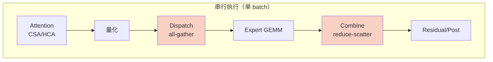
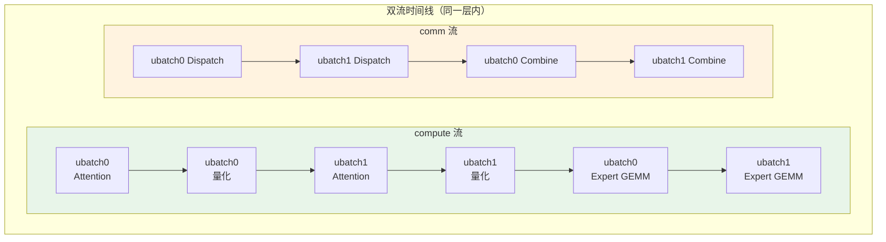
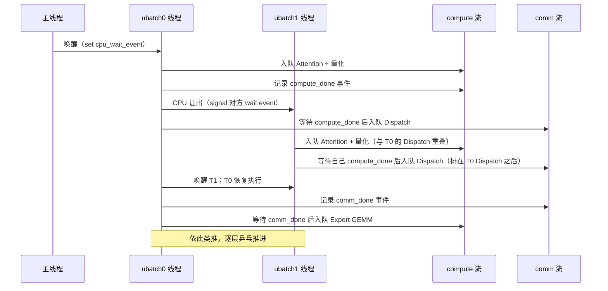
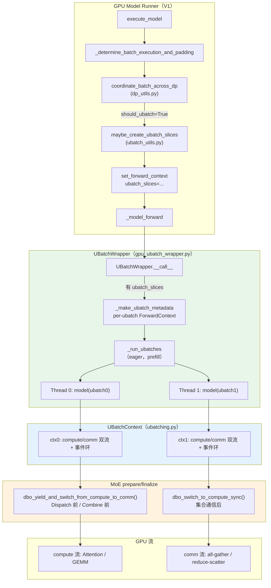
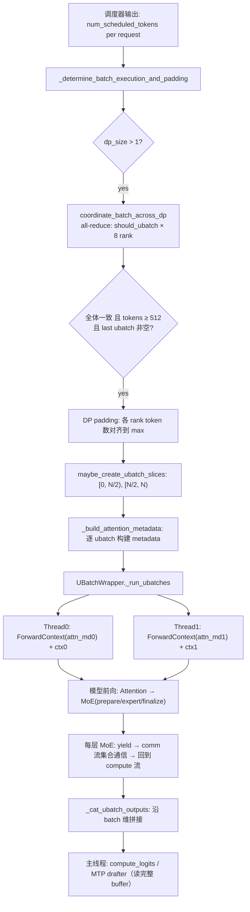

# vLLM Prefill Dual-Batch-Overlap（DBO）通算融合代码走读技术文档

> **文档版本**: 1.0
> **分析代码版本**: vLLM main 分支（commit `cc09352e5c`，2026-09）
> **最后更新**: 2026-09-19

---

## 文档概述

本文档深入剖析 vLLM 中 **Dual-Batch-Overlap（DBO，双 batch 重叠）** 机制及其在 **DeepSeek-V4 ROCm prefill** 场景下的应用。DBO 将一个大 batch 拆成两个 micro-batch（ubatch），用两个 Python 线程分别在 **compute 流**和 **comm 流**上乒乓执行，使一个 ubatch 的 MoE 集合通信与另一个 ubatch 的 Attention/MoE 计算在 GPU 上重叠，消除 prefill 阶段的通信气泡。

**目标读者**：对 vLLM v1 引擎、MoE 通信模式有基础了解，希望理解 DBO 原理、vLLM 现有 DBO 基础设施（`UBatchWrapper` / `UBatchContext` / `WorkspaceManager`）以及如何在 naive DP/EP 路径上扩展通算重叠的开发者。

**阅读指南**：
- 第一部分从原理出发，理解"为什么需要双 batch 重叠"以及 ping-pong 调度模型；
- 第二部分聚焦核心接口（`UBatchContext` 同步原语与 `dbo_*` API）；
- 第三部分走读具体实现代码，包括 DeepEP-HT 已有接入与 naive DP/EP 路径的扩展；
- 第四、五部分为方案对比与实战配置。

---

# 第一部分: DBO 基础与架构总览

## 1.1 DBO 原理

### 1.1.1 基本思想：用"另一个 batch"填满通信气泡

在 attention DP + expert TP（无 EP）的部署下（本文以 DeepSeek-V4 在 8 卡、attention dp=8、expert 展平 TP=8 为例），每个 MoE 层的前向包含两次横跨全部 8 个 DP rank 的集合通信：

1. **Dispatch（派发）**：`all-gather` hidden states、router logits 与量化 scale——每个 rank 拿到全部 8 个 rank 的 token；
2. **Combine（合并）**：`reduce-scatter` 各 rank 计算的 expert 部分和——每个 rank 取回属于自己的 token 结果。

串行执行时，这两段通信期间 compute 流完全空闲：



DBO 的核心思想是：**当 batch X 在等待集合通信时，让 batch Y 的计算在 compute 流上继续推进**。把原始 batch 对半切成两个 ubatch，各自跑完整的模型前向；两个线程通过 CPU/GPU 双层同步乒乓交接，GPU 上只有两条流：



观察上图：ubatch0 的 Dispatch 在 comm 流上执行时，ubatch1 的 Attention 与量化在 compute 流上执行——**通信与计算完全重叠**。这正是 "dual-batch-overlap" 名称的由来：重叠不是发生在一个 batch 内部，而是发生在两个 batch 之间。

### 1.1.2 工作流程：两线程乒乓（ping-pong）

DBO 的执行模型可以概括为"**一个 CPU 上任何时刻只有一个线程在跑**"的乒乓调度：



关键设计决策：

1. **CPU 互斥、GPU 并行**：`_cpu_yield` 保证同一时刻只有一个线程在 CPU 上发 kernel，避免 Python 层的竞争；GPU 上两条流各自推进，重叠由事件（event）保证。
2. **两条流、两个方向**：compute 流（即 runner 主流的 current stream）承载所有计算 kernel；comm 流承载集合通信。两个线程共享这两条流——每个 ubatch 的通信在 comm 流上**串行排队**，这正是上图 `D0 → D1 → R0 → R1` 的由来。
3. **yield 点即重叠窗口的边界**：线程在"量化之后、派发之前"和"expert GEMM 之后、合并之前"两个位置让出，把集体通信交给 comm 流。

### 1.1.3 性能分析

设一个 MoE 层中单 batch 的通信时间为 $T_{comm}$（Dispatch + Combine），计算时间为 $T_{comp}$。串行执行时每层耗时 $T_{serial} = T_{comp} + T_{comm}$。

DBO 双 batch 流水线下（忽略事件同步开销与两条流之间的尾部效应），每层的稳态耗时近似：

$$T_{dbo} \approx \max(T_{comp}^{u}, T_{comm}^{u}) + \epsilon$$

其中 $T^{u}$ 为单个 ubatch（约半个 batch）的对应时间。prefill 场景下 batch 越大，$T_{comm}$ 占比越高，重叠收益越显著：

$$\text{speedup} \approx \frac{T_{comp} + T_{comm}}{\max(T_{comp}^{u}, T_{comm}^{u})} = \frac{2(T_{comp}^{u} + T_{comm}^{u})}{\max(T_{comp}^{u}, T_{comm}^{u})}$$

当 $T_{comp}^{u} \approx T_{comm}^{u}$ 时理论上限接近 2×。

### 1.1.4 关键指标定义

| 指标 | 含义 |
|------|------|
| TTFT（Time To First Token） | 请求首 token 时延；DBO 直接作用于 prefill 阶段，主要优化该指标 |
| 重叠窗口（Overlap Window） | comm 流上集合通信与 compute 流上计算 kernel 并发执行的时间区间 |
| ubatch 阈值（`dbo_prefill_token_threshold`） | batch token 数达到该值才启用 DBO 拆分，避免小 batch 拆分得不偿失 |
| 事件同步开销 $\epsilon$ | 每次 yield 的记录/等待事件及 CPU 线程切换成本 |

---

## 1.2 vLLM DBO 整体架构

### 1.2.1 系统架构总览图



### 1.2.2 核心组件与职责划分

| 组件 | 文件 | 职责 |
|------|------|------|
| `ParallelConfig`（`enable_dbo` 等） | `vllm/config/parallel.py:226-236` | 开关与阈值配置（`dbo_prefill_token_threshold=512` 等） |
| `coordinate_batch_across_dp` | `vllm/v1/worker/dp_utils.py:190` | 跨 DP rank all-reduce 协商：全体一致才拆分；同时负责 DP padding 使各 rank token 数对齐 |
| `maybe_create_ubatch_slices` | `vllm/v1/worker/ubatch_utils.py:165` | 按 token 中点把 batch 切成 2 个 `UBatchSlice`（request 边界自动吸附） |
| `UBatchWrapper` | `vllm/v1/worker/gpu_ubatch_wrapper.py:65` | 模型外包一层：建 per-ubatch forward context、起两个 Python 线程、拼接输出；持有共享 `comm_stream` |
| `UBatchContext` | `vllm/v1/worker/ubatching.py:20` | 单线程的同步上下文：CPU 事件环 + GPU 事件对 + 流切换原语 |
| `dbo_*` 全局 API | `vllm/v1/worker/ubatching.py:168-181` | 模型内部（MoE prepare/finalize）调用的 yield 接口；无 DBO 上下文时为 no-op |
| `WorkspaceManager` | `vllm/v1/worker/workspace.py:47` | 按 `(ubatch_id, lane)` 分槽的工作区分配器，避免两线程互相踩踏 scratch buffer |
| `MoEPrepareAndFinalize*` | `vllm/model_executor/layers/fused_moe/prepare_finalize/` | MoE 的派发/合并实现；DBO 的 yield 点埋在这里（DeepEP-HT 已有，naive DP/EP 为本文扩展点） |

### 1.2.3 数据流与控制流分析

一个 prefill step 从调度到完成的完整链路：



---

## 1.3 执行流程详解：一个具体场景

**场景设定**：8 卡，`--data-parallel-size 8 --enable-dbo`，某 prefill step 每个 rank 调度到 4096 tokens（DP padding 后各 rank 对齐），`dbo_prefill_token_threshold=512`。则每个 ubatch 为 2048 tokens。

**Step 1：DP 协调**（`dp_utils.py:_synchronize_dp_ranks`）

8 个 rank 各自把 `(orig_tokens, padded_tokens, should_ubatch, cudagraph_mode)` 写入一个 `4×8` 的 int32 tensor，经 DP 组 all-reduce 汇聚。三个判定：

- `should_ubatch = all(tensor[2] == 1)`——全体 rank 都愿意拆；
- `is_last_ubatch_empty(...)`——防止 padding 导致第二个 ubatch 为空；
- `should_dp_pad = synced_cudagraph_mode != 0 or should_ubatch`——DBO 要求各 rank token 数一致，否则跨 rank 的 all-gather 尺寸断言失败。

**Step 2：切片**（`ubatch_utils.py:maybe_create_ubatch_slices`）

`split_point = 4096 // 2 = 2048`。token 切片 `[0, 2048)` 与 `[2048, 4096)`；request 切片用 `np.searchsorted` 按 `cu_num_tokens` 吸附到 request 边界。末尾 `_pad_out_ubatch_slices` 把最后一个切片扩到 padded 总数（奇数 token 时两片不等长，尾片多 1 token）。

**Step 3：双线程执行**（`gpu_ubatch_wrapper.py:_run_ubatches`）

主线程起两个线程后阻塞在 `ready_barrier`（`Barrier(3)`）；两个线程各自 `__enter__` 自己的 `UBatchContext` 后也阻塞在 barrier。齐备后主线程唤醒线程 0（`ctx0.cpu_wait_event.set()`），乒乓开始。

**Step 4：逐层乒乓**（模型前向内）

线程 0 在 compute 流上依次入队 Attention、MoE 量化，然后执行 `dbo_yield_and_switch_from_compute_to_comm()`：
1. 在 compute 流上记录 `gpu_compute_done_event[0]`；
2. CPU 让出（signal 线程 1 的 wait 事件，自身睡眠）；
3. 被唤醒后切到 comm 流，让 comm 流等待 `gpu_compute_done_event[0]`，入队 Dispatch all-gather。

此时线程 1 已被唤醒，在 compute 流上入队自己的 Attention/量化——**与线程 0 的 Dispatch 重叠**。线程 0 的 Dispatch 完成后 `dbo_switch_to_compute_sync()`：comm 流记录 `gpu_comm_done_event[0]`，compute 流等待之，随后入队 Expert GEMM。Combine 前的 yield 同理。如此逐层推进，直到最后一层。

**Step 5：输出拼接**：两个线程各自返回 `[2048, hc, dim]` 的 residual，主线程 `torch.cat` 成 `[4096, hc, dim]`。由于两个线程的最终 work 都经事件链序化进 compute 流（主线程的 current stream），cat 天然有序。

> **关键洞察**：DBO 不需要模型提供"阶段函数"——两个线程各自完整地跑一遍模型前向，流水线完全由埋在集合通信两端的 yield 点自然涌现。

---

# 第二部分: 核心接口与基类分析

## 2.1 核心基类：`UBatchContext`

```python
# 文件: vllm/v1/worker/ubatching.py
class UBatchContext:
    """Context manager for micro-batching synchronization using threading events."""

    def __init__(
        self,
        id: int,
        comm_stream: torch.cuda.Stream,
        compute_stream: torch.cuda.Stream,
        forward_context: ForwardContext,
        ready_barrier: threading.Barrier,
        cpu_wait_event: threading.Event,
        cpu_signal_event: threading.Event,
        gpu_comm_done_event: torch.Event,
        gpu_compute_done_event: torch.Event,
        schedule: str = "default",
    ):
        ...
        self.current_stream = compute_stream
```

每个 context 持有三组同步对象：

| 同步对象 | 类型 | 作用 |
|----------|------|------|
| `ready_barrier` | `threading.Barrier(3)` | 主线程 + 2 个 ubatch 线程的启动齐步 |
| `cpu_wait_event` / `cpu_signal_event` | `threading.Event` | CPU 乒乓环：`ctx[i].cpu_signal_event == ctx[(i+1)%N].cpu_wait_event`（`make_ubatch_contexts` 中构造） |
| `gpu_comm_done_event` / `gpu_compute_done_event` | `torch.Event` | GPU 跨流依赖：comm 流等待 compute 完成、compute 流等待 comm 完成 |

四个核心原语（`ubatching.py:105-145`）：

```python
    def switch_to_comm_sync(self):
        self._signal_compute_done()      # comm 流 ← compute 流尾部
        self.update_stream(self.comm_stream)
        self._wait_compute_done()        # comm 流等待事件

    def switch_to_compute_sync(self):
        self._signal_comm_done()         # compute 流 ← comm 流尾部
        self.update_stream(self.compute_stream)
        self._wait_comm_done()           # compute 流等待事件

    def yield_(self):                    # 纯 CPU 让出（GPU 上不切换流）
        self.current_stream = current_stream()
        self._cpu_yield()
        self.update_stream(self.current_stream)

    def yield_and_switch_from_compute_to_comm(self):
        assert current_stream() == self.compute_stream
        self._signal_compute_done()
        self._cpu_yield()                # 唤醒对方线程后睡眠
        assert self.current_stream == self.compute_stream
        self.update_stream(self.comm_stream)
        self._wait_compute_done()
```

> **注意**：`yield_and_switch_from_compute_to_comm` 的断言 `current_stream() == compute_stream` 是免费的护栏——若某个 kernel 意外把当前流改走（例如层内 aux stream 未恢复），这里会 loudly 崩溃而不是静默产生错误依赖。

`_cpu_yield` 的互斥不变量（`ubatching.py:92-103`）：**任何时刻只有一个线程在运行**，且运行线程的 `forward_context` 与当前流都已恢复为本线程自己的：

```python
    def _cpu_yield(self):
        # It is critical for correctness that only one thread is running
        # at a time. These asserts just make sure that this is the only
        # thread running before waking the other one up and going to sleep
        assert forward_context._forward_context == self.forward_context
        assert current_stream() == self.current_stream
        assert not self.cpu_wait_event.is_set()

        self.cpu_signal_event.set()
        self.cpu_wait_event.wait()
        self.cpu_wait_event.clear()
        self._restore_context()
```

## 2.2 `dbo_*` 全局 API：模型侧的开关

模型代码（MoE prepare/finalize）通过全局函数调用上述原语。全局注册表 `_THREAD_ID_TO_CONTEXT` 按线程 id 索引当前 context：

```python
# 文件: vllm/v1/worker/ubatching.py
def dbo_enabled() -> bool:
    return len(_THREAD_ID_TO_CONTEXT) > 0

def dbo_current_ubatch_id() -> int:
    if len(_THREAD_ID_TO_CONTEXT) == 0:
        return 0
    return _THREAD_ID_TO_CONTEXT[threading.get_ident()]

def _register_ubatch_function(func):
    def wrapper(*args, **kwargs):
        if len(_THREAD_ID_TO_CONTEXT) > 0:
            ctx_idx = _THREAD_ID_TO_CONTEXT[threading.get_ident()]
            ctx = _CURRENT_CONTEXTS[ctx_idx]
            func(ctx, *args, **kwargs)
    return wrapper

dbo_yield = _register_ubatch_function(UBatchContext.yield_)
dbo_yield_and_switch_from_compute_to_comm = _register_ubatch_function(
    UBatchContext.yield_and_switch_from_compute_to_comm
)
dbo_switch_to_compute_sync = _register_ubatch_function(
    UBatchContext.switch_to_compute_sync
)
# ... switch_to_comm / switch_to_comm_sync / yield_and_switch_from_comm_to_compute
```

> **关键洞察**：`_register_ubatch_function` 使所有 `dbo_*` 调用在**无 DBO 上下文时成为 no-op**。这意味着在共享的 prepare/finalize 代码里埋 yield 点，对非 DBO 运行（包括 CUDA 默认路径）零影响——这也是 DBO 能渐进式接入各类 MoE 后端的原因。

## 2.3 工厂方法 / 注册机制

### 2.3.1 MoE prepare/finalize 的工厂

```python
# 文件: vllm/model_executor/layers/fused_moe/all2all_utils.py
def maybe_make_prepare_finalize(
    moe: FusedMoEConfig,
    quant_config: FusedMoEQuantConfig | None,
    routing_tables: ... = None,
    allow_new_interface: bool = False,
    use_monolithic: bool = False,
    all2all_manager: Any | None = None,
) -> FusedMoEPrepareAndFinalize | None:
    if not moe.moe_parallel_config.use_all2all_kernels:
        if not allow_new_interface:
            return None
        ...
        # For DP/TP case, fall back to naive P/F.
        if moe.moe_parallel_config.dp_size > 1:
            logger.info_once(
                "Detected DP deployment with no --enable-expert-parallel. "
                "Falling back to AllGather+ReduceScatter dispatch/combine."
            )
            ...
            return make_moe_prepare_and_finalize_naive_dp_ep(
                is_sequence_parallel=...,
                num_dispatchers=all2all_manager.world_size,
                use_monolithic=use_monolithic,
            )
```

注意 `use_all2all_kernels` 的属性定义（`fused_moe/config.py`）：

```python
    @property
    def use_all2all_kernels(self):
        return self.use_ep and (
            self.dp_size > 1 or self.pcp_size > 1 or self.is_sequence_parallel
        )
```

本文的部署（attention dp=8 + expert 展平 TP、无 EP）中 `use_ep=False`，因此必然落入 naive DP/EP 分支——all-gather 派发 + reduce-scatter 合并。

### 2.3.2 modular kernel 的 async 协议

modular 路径（`FusedMoEKernelModularImpl`）对 DBO 有一个**硬约束**：

```python
# 文件: vllm/model_executor/layers/fused_moe/modular_kernel.py
        if not self.prepare_finalize.supports_async():
            # We shouldn't be running an a2a kernel that doesn't
            # support async prepare/finalize
            # TODO(lucas): enable in follow-up
            assert not dbo_enabled()
            (...) = self.prepare_finalize.prepare(...)
        else:
            dbo_maybe_run_recv_hook()
            prepare_ret = self.prepare_finalize.prepare_async(...)
            hook, receiver = (
                prepare_ret if isinstance(prepare_ret, tuple) else (None, prepare_ret)
            )
            ...
            (...) = receiver()
```

即：modular 后端在 DBO 激活时要求 `supports_async() == True`，否则直接 assert。`prepare_async` 返回一个 `ReceiverType = Callable[[], PrepareResultType]`（或 `(hook, receiver)` 对），kernel 拿到后同步调用 `receiver()`。**因此任何接入 DBO 的 modular prepare/finalize 必须覆写 `supports_async()`（DBO 激活时返回 True，否则返回 False 以保持非 DBO 路径完全不变）并提供（哪怕是同步包装的）`prepare_async`/`finalize_async`**——这是本文扩展点中最容易遗漏的一环。

---

# 第三部分: 核心实现深度分析

## 3.1 算法原理：双流事件序

GPU 侧的跨流依赖完全由两对 `torch.Event` 表达。令 $C$ 为 compute 流、$M$ 为 comm 流，一个 ubatch 在某一层的完整事件序为：

$$C:\underbrace{\text{Attn} \to \text{Quant}}_{w_1} \xrightarrow{\text{record } e_c} M:\underbrace{\text{wait } e_c \to \text{Dispatch}}_{c_1} \xrightarrow{\text{record } e_m} C:\underbrace{\text{wait } e_m \to \text{GEMM}}_{w_2} \xrightarrow{\text{record } e'_c} M:\underbrace{\text{wait } e'_c \to \text{Combine}}_{c_2} \xrightarrow{\text{record } e'_m} C:\underbrace{\text{wait } e'_m \to \text{Post}}_{w_3}$$

两个 ubatch 交错后，跨流依赖保证了：
- $c_1$ 依赖 $w_1$（自己的量化），但不依赖对方的任何 work；
- $w_2$ 依赖 $c_1$（自己的 GEMM 需要 gathered 输入）；
- comm 流上 $c_1^{u1}$ 排在 $c_1^{u0}$ 之后（同流天然串行）；
- compute 流上 $w_1^{u1}$ 排在 $w_1^{u0}$ 之后（同流天然串行）。

于是重叠窗口 = $c_1^{u0}$ 与 $w_1^{u1}$ 的并发区间。**张量生命周期也由事件序保证**：comm 流写 gathered 输出前，compute 流对该区域的上一次读（事件 $e_c$ 之前的 work）已完成；compute 流消费 gathered 结果前，comm 流已通过 $e_m$ 宣告完成。因此无需额外的 `record_stream` 调用。

## 3.2 vLLM 实现分析

### 3.2.1 线程与上下文装配：`UBatchWrapper._run_ubatches`

```python
# 文件: vllm/v1/worker/gpu_ubatch_wrapper.py
    def _run_ubatches(self, ubatch_metadata, model) -> torch.Tensor:
        @torch.inference_mode()
        def _ubatch_thread(results, model, ubatch_metadata):
            with ubatch_metadata.context:
                model_output = model(
                    input_ids=ubatch_metadata.input_ids,
                    positions=ubatch_metadata.positions,
                    intermediate_tensors=ubatch_metadata.intermediate_tensors,
                    inputs_embeds=ubatch_metadata.inputs_embeds,
                )
            results.append((ubatch_metadata.context.id, model_output))

        results: list[tuple[int, torch.Tensor]] = []

        # Ubatch threads will manually manage the forward context, so we
        # override it to None here so we can have it restored correctly
        # after both threads have finished
        with override_forward_context(None):
            ubatch_threads = []
            for metadata in ubatch_metadata:
                thread = threading.Thread(
                    target=_ubatch_thread,
                    args=(results, metadata, model),
                )
                ubatch_threads.append(thread)
                thread.start()
            self.ready_barrier.wait()  # Wait for all ubatch threads to be ready
            ubatch_metadata[0].context.cpu_wait_event.set()
            for thread in ubatch_threads:
                thread.join()
        sorted_results = [value for position, value in sorted(results)]
        result = _cat_ubatch_outputs(sorted_results)
        return result
```

要点：
- `with ubatch_metadata.context:` 使每个线程拥有独立的 `ForwardContext`（per-ubatch 的 attention metadata、`cudagraph_runtime_mode=NONE`、DP metadata）；
- `comm_stream` 是 wrapper 唯一的成员（`torch.cuda.Stream(device=device)`），compute 流即主线程的 current stream；
- 输出按 context id 排序后 `torch.cat` 拼接。

per-ubatch metadata 装配（`_make_ubatch_metadata`）：为每个切片创建独立 forward context，并把模型输入（`input_ids`/`positions` 等）按 `ubatch_slice.token_slice` 切片：

```python
# 文件: vllm/v1/worker/gpu_ubatch_wrapper.py
        for i, ubatch_slice in enumerate(ubatch_slices):
            forward_contexts.append(
                create_forward_context(
                    attn_metadata[i] if attn_metadata is not None else None,
                    self.vllm_config,
                    dp_metadata=dp_metadata[i],
                    batch_descriptor=batch_descriptor,
                    cudagraph_runtime_mode=cudagraph_runtime_mode,
                    slot_mapping=slot_mapping[i] if has_slot_mapping else None,
                    is_padding=(...),
                )
            )

        ubatch_ctxs = make_ubatch_contexts(
            num_micro_batches=len(ubatch_slices),
            comm_stream=self.comm_stream,
            compute_stream=compute_stream,
            forward_contexts=forward_contexts,
            ready_barrier=self.ready_barrier,
        )
```

其中 `dp_metadata[i]` 由 wrapper 现场构造（`DPMetadata.make`），各 rank 的 per-ubatch token 数一致（DP padding 保证），从而 naive DP/EP 的 `_get_sizes` 走"等长"快路径。

### 3.2.2 事件环构造：`make_ubatch_contexts`

```python
# 文件: vllm/v1/worker/ubatching.py
def make_ubatch_contexts(
    num_micro_batches: int,
    compute_stream: torch.cuda.Stream,
    comm_stream: torch.cuda.Stream,
    forward_contexts: list[ForwardContext],
    ready_barrier: threading.Barrier,
    schedule: str = "default",
) -> list[UBatchContext]:
    ...
    cpu_events = [threading.Event() for _ in range(num_micro_batches)]
    gpu_comm_done_events = [torch.Event() for _ in range(num_micro_batches)]
    gpu_compute_done_events = [torch.Event() for _ in range(num_micro_batches)]

    ctxs = []
    for i in range(num_micro_batches):
        ctx = UBatchContext(
            id=i,
            compute_stream=compute_stream,
            comm_stream=comm_stream,
            forward_context=forward_contexts[i],
            ready_barrier=ready_barrier,
            cpu_wait_event=cpu_events[i],
            cpu_signal_event=cpu_events[(i + 1) % num_micro_batches],
            gpu_comm_done_event=gpu_comm_done_events[i],
            gpu_compute_done_event=gpu_compute_done_events[i],
            schedule=schedule,
        )
        ctxs.append(ctx)
    return ctxs
```

注意 `cpu_signal_event = cpu_events[(i+1) % N]`：线程 $i$ 唤醒的是线程 $i+1$ 的 wait 事件——一个环形令牌传递网络，`N=2` 时即为双线程乒乓。

### 3.2.3 线程安全的 Workspace

两个线程并发前向时，任何共享 scratch buffer 都是竞态源。`WorkspaceManager` 按 `(ubatch_id, lane)` 分槽：

```python
# 文件: vllm/v1/worker/workspace.py
    def _ensure_workspace_size(self, required_bytes: int) -> torch.Tensor:
        ubatch_id = dbo_current_ubatch_id()
        lane = _workspace_lane.get()
        ...
        workspace_id = ubatch_id * self._num_lanes + lane
        current_workspace = self._current_workspaces[workspace_id]
        ...
```

`gpu_worker.py` 初始化时按 `enable_dbo` 传 `num_ubatches=2`，使两线程各占一槽，互不踩踏。

## 3.3 关键数据结构

### 3.3.1 `UBatchSlice`

```python
# 文件: vllm/v1/worker/ubatch_utils.py（节选）
@dataclass
class UBatchSlice:
    request_slice: slice   # request 维切片
    token_slice: slice     # token 维切片
```

拆分逻辑（`maybe_create_ubatch_slices`）以 token 中点切割，request 边界由 `np.searchsorted(cu_num_tokens, ...)` 吸附——一个 request 的 tokens 不会横跨两个 ubatch 被重复/遗漏，但可以整体落入某一片。

### 3.3.2 DBO 相关 `ParallelConfig` 字段

| 字段 | 默认值 | 说明 |
|------|--------|------|
| `enable_dbo` | `False` | 总开关（CLI: `--enable-dbo`） |
| `ubatch_size` | `0` | 自定义 ubatch 数量；`enable_dbo` 时固定为 2 |
| `dbo_decode_token_threshold` | `32` | 纯 decode batch 的启用阈值 |
| `dbo_prefill_token_threshold` | `512` | 含 prefill 的 batch 的启用阈值 |

校验（`parallel.py:1100-1105`）：两个阈值都不得小于 `num_ubatches`，防止切出空片。

## 3.4 与 DeepSeek-V4 ROCm 的结合点

### 3.4.1 attention metadata 的 per-ubatch 构建

runner 在 `_build_attention_metadata` 中对每个 ubatch 调用 attention group 的 metadata builder（`gpu_model_runner.py:2631-2633`），因此 DSV4 ROCm 的自定义 dict metadata（`DeepseekV4AiterMLASparseMetadata`）逐 ubatch 各建一份，两线程互不共享。

### 3.4.2 层内多流自动关闭

DSV4 ROCm 注意力自带层内多流 overlap（CSA/HCA 压缩器侧流），其开关 gate 为：

```python
# 文件: vllm/models/deepseek_v4/amd/rocm.py
    def _enable_multi_stream_overlap(self) -> bool:
        attn_metadata = get_forward_context().attn_metadata
        return self.aux_stream_list is not None and (
            torch.cuda.is_current_stream_capturing()
            or not isinstance(attn_metadata, dict))
```

eager DBO prefill 下，per-ubatch forward context 的 metadata 是 dict 且不在捕获期 → gate 返回 False → **层内多流自动关闭**。这既是正确性要求（`yield_and_switch_from_compute_to_comm` 断言当前流必须是 compute 流，层内 aux 流会破坏该前提），也与"重叠交给跨 batch 流水线、层内保持简单"的设计一致。

### 3.4.3 MTP hidden 缓冲的偏移

DSV4 主模型 forward 末尾会把最终 hidden states 拷入供 MTP draft model 读取的缓冲：

```python
# 文件: vllm/models/deepseek_v4/amd/model.py
        if self._mtp_hidden_buffer is not None:
            num_tokens = hidden_states.shape[0]
            self._mtp_hidden_buffer[:num_tokens].copy_(hidden_states.flatten(1))
```

两个 ubatch 线程都从 row 0 写会互相覆盖——这是 DBO 接入时**必须修复**的共享状态竞态：需要按 ubatch 在父 batch 中的 token 偏移写入（ubatch 大小可能不等，不能用 `ubatch_id × num_tokens` 推算）。MTP drafter 由主线程在 wrapper 之外执行、按父 batch 行序读取，因此只要写入偏移正确，消费端无需改动。

### 3.4.4 其余共享状态排查结论

| 状态 | 位置 | 结论 |
|------|------|------|
| `topk_indices_buffer` | `amd/model.py:959` | 单次 attention 调用内写读，位于两次 yield 之间，同流有序 → 安全 |
| `_wqa_wkv_scale` / `_fused_compressor_weight` | `amd/rocm.py:814-854` | 仅权重加载期一次性赋值 → 安全 |
| Workspace | `vllm/v1/worker/workspace.py` | 按 ubatch 分槽 → 安全 |
| AITER 自定义 AG/RS 快路径 | `cuda_communicator.py:672-698` | 要求 `cudagraph_runtime_mode == FULL`；DBO 下 per-ubatch context 强制 `NONE` → 自动绕行至 pynccl（当前流语义，可在 comm 流执行） |

---

# 第四部分: 不同实现方法对比

## 4.1 MoE 通算重叠方案对比

| 维度 | 串行（现状） | DeepEP-HT DBO（已合入） | naive DP/EP DBO（本文扩展） |
|------|-------------|------------------------|---------------------------|
| 通信后端 | pynccl/AITER AR，compute 流 | DeepEP-HT kernel，comm 流 | pynccl，comm 流 |
| 重叠窗口 | 无 | dispatch/combine 与对侧 compute 重叠 | 同左 |
| 捕获（decode FULL graph） | 单流 | 跨流捕获（`_capture_ubatches`） | 保持单流（capture 期不 yield） |
| 适用部署 | 全部 | EP + DeepEP-HT | attention DP + expert TP（无 EP，`dp_size>1`） |
| yield 位置 | — | `prepare_async`/`finalize_async` 内部 | prepare/finalize 内 `_comm_region` 包裹 collective |

DeepEP-HT 的既有接入（对照参考）：

```python
# 文件: vllm/model_executor/layers/fused_moe/prepare_finalize/deepep_ht.py
        # We yield before launching the dispatch kernel since the dispatch
        # kernel will block the CPU so we want to queue up all the compute
        # for the other ubatch before the dispatch kernel starts.
        dbo_yield_and_switch_from_compute_to_comm()

        (...dispatch 布局与 kernel 入队...)

        dbo_switch_to_compute_sync()

        return lambda: self._receiver(event, has_scales, token_data, ...)
```

naive DP/EP 路径的扩展采取**同一模式**：在 `prepare`/`finalize` 中用可覆写的 `_comm_region()` 上下文包裹 collective——基类返回 `nullcontext()`（行为不变），ROCm 子类覆写为 yield/switch 对：

```python
# 概念示意: naive DP/EP 的 DBO 扩展（ROCm 子类）
    @contextmanager
    def _comm_region(self) -> Iterator[None]:
        if not dbo_enabled() or torch.cuda.is_current_stream_capturing():
            yield
            return
        # Release the CPU to the peer ubatch so it can enqueue compute while
        # this ubatch's collective runs; the compute stream waits on exit.
        dbo_yield_and_switch_from_compute_to_comm()
        try:
            yield
        finally:
            dbo_switch_to_compute_sync()
```

> **性能提示**：capture 期不 yield 是刻意为之——decode 的 FULL cudagraph 若把 collective 挪到侧流，会改变捕获图拓扑，带来未验证的 decode 风险；eager prefill 才启用重叠，零回归。去掉该 gate 让 decode 也重叠是后续一行实验。

## 4.2 DBO 支持矩阵

| 阶段 | 执行模式 | 是否重叠 | 说明 |
|------|---------|---------|------|
| Prefill（token ≥ 阈值） | eager `_run_ubatches` | ✅ | 本特性的目标场景 |
| Prefill（token < 阈值） | 单 batch 直跑 | ❌ | 小 batch 拆分无益 |
| Decode（FULL cudagraph） | `_capture_ubatches` | DeepEP-HT ✅ / naive 路径 ❌（capture gate） | 拓扑保持现状 |
| 单请求 batch（`num_reqs < 2`） | 单 batch 直跑 | ❌ | `_allow_microbatching` 否决 |
| 级联 attention（cascade） | 自动关闭 | — | `gpu_model_runner.py:4283-4284` 显式禁用 |

---

# 第五部分: 配置与使用指南

## 5.1 关键参数说明

| 参数 | 类型 | 说明 |
|------|------|------|
| `--enable-dbo` | bool | 启用双 batch overlap（隐含 `num_ubatches=2`） |
| `--dbo-prefill-token-threshold` | int（默认 512） | prefill batch 启用拆分的最低 token 数；太小则拆分与同步开销超过收益 |
| `--dbo-decode-token-threshold` | int（默认 32） | 纯 decode batch 的阈值 |
| `--ubatch-size` | int（默认 0） | 显式指定 ubatch 数（不使用 `--enable-dbo` 时） |

## 5.2 典型配置示例（DeepSeek-V4 ROCm，attention dp=8 + expert TP、无 EP）

```bash
vllm serve <checkpoint> \
    --data-parallel-size 8 \
    --enable-dbo \
    --dbo-prefill-token-threshold 512 \
    --max-num-batched-tokens 8192
```

预期日志确认（启动时）：

```text
Detected DP deployment with no --enable-expert-parallel. Falling back to AllGather+ReduceScatter dispatch/combine.
Using MoEPrepareAndFinalizeNaiveDPEPModularROCmDBO
Using AiterExperts
```

## 5.3 性能调优建议

1. **阈值扫描**：`dbo_prefill_token_threshold` 在 {256, 512, 1024, 2048} 间扫描，取 TTFT 拐点；
2. **与 `VLLM_ROCM_USE_AITER_CUSTOM_AR` 的权衡**：DBO 下 AITER 自定义 AG/RS 快路径自动绕行（要求 FULL graph），通信走 pynccl；虽然单次集合通信可能变慢，但被重叠收益覆盖，建议开/关各测一轮；
3. **峰值显存观察**：两个 ubatch 的中间张量同时存活，峰值显存高于串行，必要时调低 `--max-num-batched-tokens`；
4. **MTP 验证**：若部署启用了 MTP，必须对比 DBO 开/关的 draft 接受率（mean acceptance length）——接受率骤降是 hidden 缓冲偏移错误的特征信号；
5. **Profiler 取证**：`VLLM_TORCH_PROFILER_DIR` 抓 trace，确认 `AllGather`/`ReduceScatter` 位于第二流且与主流 attention/GEMM 水平重叠。

---

# 附录

## A. 关键代码位置索引

| 组件 | 文件:行 |
|------|---------|
| DBO 配置字段 | `vllm/config/parallel.py:226-236, 600-605, 1100-1105` |
| CLI 参数 | `vllm/engine/arg_utils.py:1204` |
| DP 跨 rank 协调 | `vllm/v1/worker/dp_utils.py:190-263` |
| ubatch 切片 | `vllm/v1/worker/ubatch_utils.py:129-216` |
| 阈值判定 | `vllm/v1/worker/ubatch_utils.py:140-148` |
| 双线程 wrapper | `vllm/v1/worker/gpu_ubatch_wrapper.py:65-454` |
| 同步原语 | `vllm/v1/worker/ubatching.py:20-239` |
| `dbo_*` API | `vllm/v1/worker/ubatching.py:148-198` |
| DBO-aware workspace | `vllm/v1/worker/workspace.py:47-225` |
| workspace 初始化（num_ubatches） | `vllm/v1/worker/gpu_worker.py:466` |
| runner 侧接入点 | `vllm/v1/worker/gpu_model_runner.py:3920-4076, 4283-4335` |
| naive DP/EP prepare/finalize | `vllm/model_executor/layers/fused_moe/prepare_finalize/naive_dp_ep.py:71-297` |
| DeepEP-HT yield 参照 | `vllm/model_executor/layers/fused_moe/prepare_finalize/deepep_ht.py:126, 177, 372-401` |
| modular kernel async 协议 | `vllm/model_executor/layers/fused_moe/modular_kernel.py:1161-1253, 1360-1412` |
| prepare/finalize 工厂 | `vllm/model_executor/layers/fused_moe/all2all_utils.py:162-198, 353` |
| DSV4 ROCm MoE | `vllm/models/deepseek_v4/amd/model.py:515-684` |
| DSV4 ROCm 层内多流 gate | `vllm/models/deepseek_v4/amd/rocm.py:570-585` |
| MTP hidden 缓冲 | `vllm/models/deepseek_v4/amd/model.py:1024-1035, 1127-1129` |

## B. 术语表

| 术语 | 说明 |
|------|------|
| DBO（Dual-Batch-Overlap） | 把 batch 拆成两个 ubatch，用双流使一个 ubatch 的通信与另一个 ubatch 的计算重叠 |
| ubatch（micro-batch） | 拆分后的子 batch（默认 2 个） |
| compute 流 / comm 流 | 计算 kernel 所在流 / 集合通信所在流；后者由 `UBatchWrapper` 持有，两线程共享 |
| yield | 线程在指定位置让出 CPU 并（可选）切换 GPU 流；DBO 流水线的节拍器 |
| ping-pong | 双线程通过 `threading.Event` 环交替执行的调度模型 |
| Dispatch / Combine | MoE 的派发（all-gather）与合并（reduce-scatter）集合通信 |
| flattened TP | `FusedMoEParallelConfig.make` 将 TP 组展平横跨 DP×TP 设备的机制；attention dp=8 + expert tp=8 无 EP 部署即 `dp=8, tp=8(flattened), use_ep=False` |
| `ReceiverType` | modular kernel 的 async 协议：`prepare_async`/`finalize_async` 返回的零参 callable |
| 捕获 gate | `torch.cuda.is_current_stream_capturing()` 判定：捕获期不 yield，保持 decode 图拓扑不变 |
