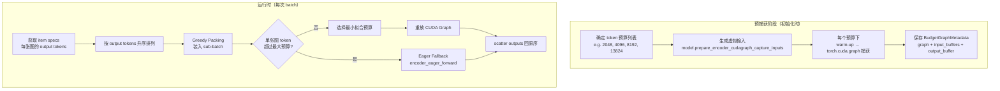
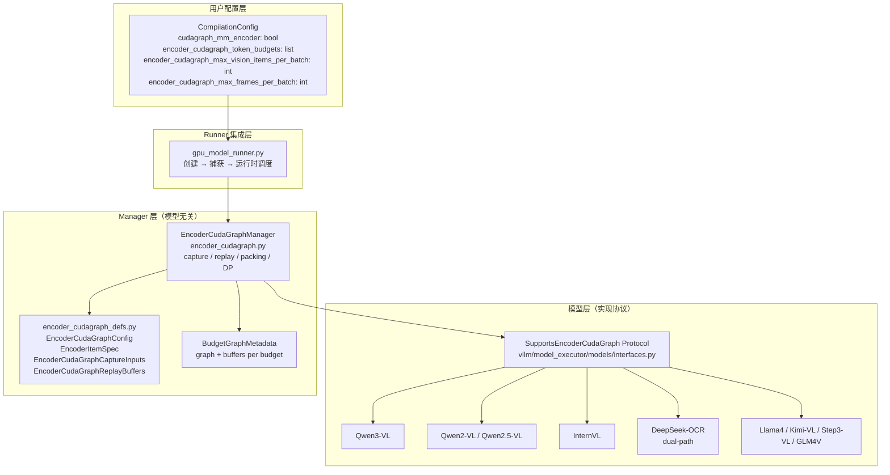
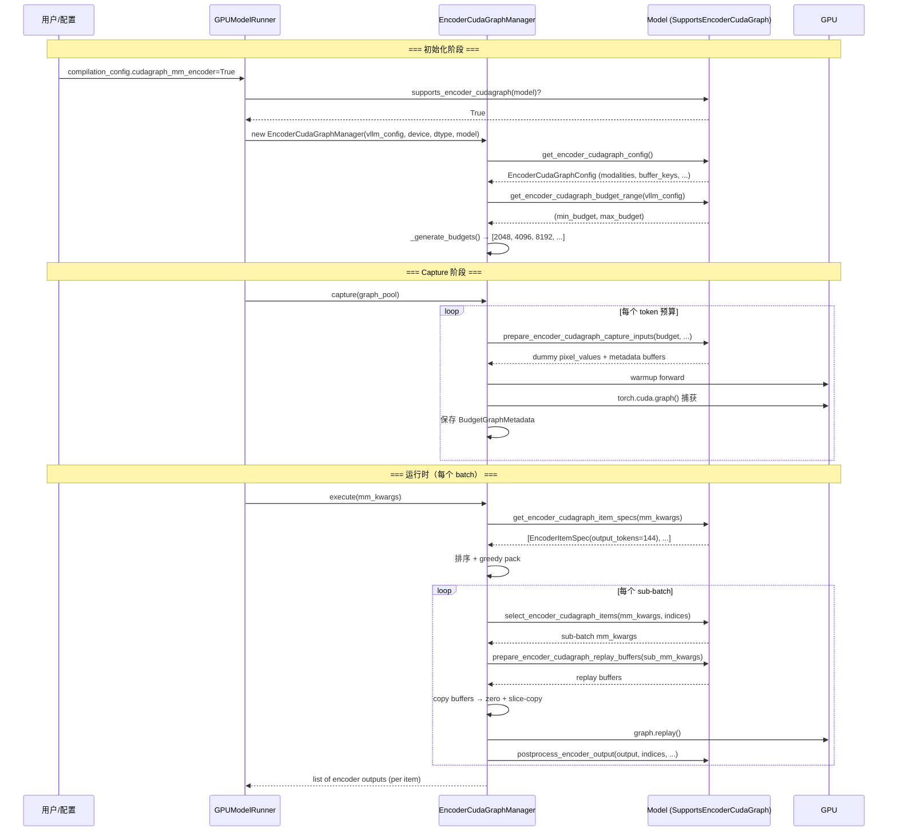
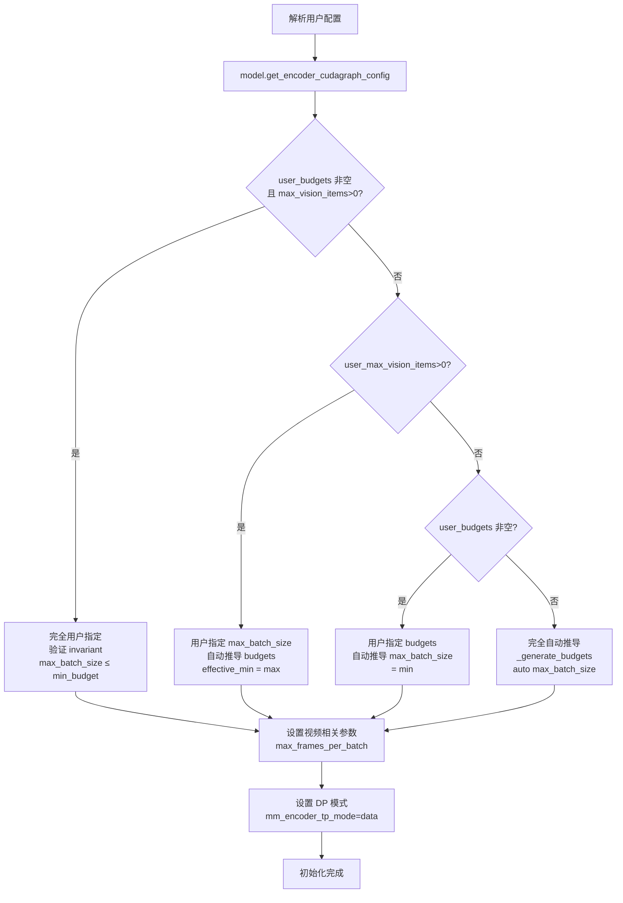
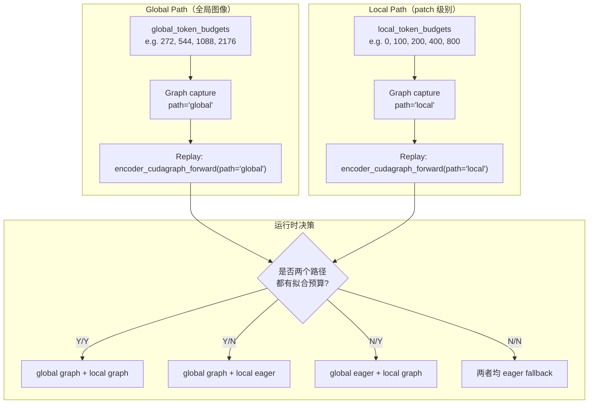
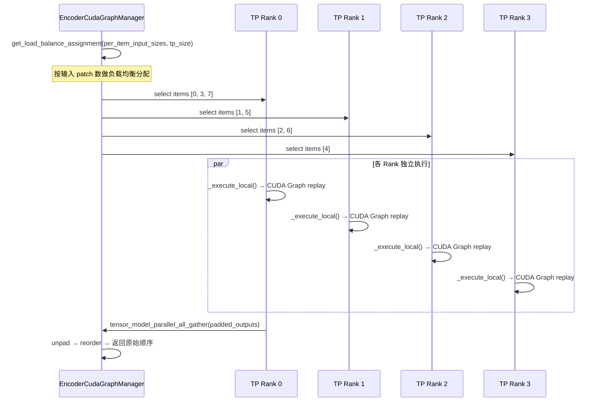

# vLLM ViT Full CUDA Graph 特性代码走读技术文档

> **文档版本**: 1.0
> **分析代码版本**: vLLM main 分支（截至 2026-06）
> **最后更新**: 2026-06-22

---

## 文档概述

本文档深入分析 vLLM 中 **ViT Full CUDA Graph** 特性的设计与实现。该特性将 Vision Transformer (ViT) 视觉编码器的完整前向传播过程捕获为 CUDA Graph，从而消除宿主端 CUDA kernel 启动开销，显著降低多模态模型在图像和视频推理场景下的延迟。

**目标读者**：对 vLLM 多模态推理有一定了解，希望深入理解 ViT CUDA Graph 机制的开发者。阅读前建议先了解 CUDA Graph 基本原理和 vLLM V1 引擎架构。

**阅读指南**：
- 第一部分介绍背景原理与整体架构
- 第二部分解析核心接口与协议定义
- 第三部分深入 Manager 实现细节（greedy packing、dual-path、DP）
- 第四部分展示模型侧集成方式
- 第五部分提供配置与调优指南

---

# 第一部分：ViT Full CUDA Graph 基础与架构总览

## 1.1 背景与原理

### 1.1.1 基本思想

在多模态大模型的推理过程中，ViT 视觉编码器需要处理大量的图像/视频 patch。以 Qwen3-VL 为例，一张 336×336 的图像会产生约 576 个 patch tokens，多图或视频场景下 patch 数量更是成倍增长。传统 eager 模式下，每个 CUDA kernel 的启动都需要宿主端 CPU 发起，kernel launch overhead 在 patch 数量多但每个 kernel 计算量相对较小的场景下尤为显著。

**CUDA Graph** 是 NVIDIA 提供的一种机制，可以将一系列 CUDA 操作预先录制为一张"计算图"，后续只需一次 API 调用即可重放整张图上的所有操作，从而消除重复的 kernel launch overhead。

vLLM 的 **decoder CUDA Graph**（即 `FULL` / `PIECEWISE` 模式）早已广泛应用，但它仅覆盖语言模型的 decode 阶段，不涉及视觉编码器。**ViT Full CUDA Graph** 将 CUDA Graph 的覆盖范围扩展到视觉编码器的完整前向传播，两者相互独立、可以同时启用。

> **关键洞察**: ViT CUDA Graph 与 decoder CUDA Graph 解决的问题不同。Decoder CUDA Graph 主要优化 decode 阶段的 memory-bound 小 batch 场景；而 ViT CUDA Graph 优化的是视觉编码器前向传播中 patch 数量多变导致的 kernel launch 开销。两者协同工作可获得最大收益。

### 1.1.2 核心挑战

ViT 编码器的输入形状取决于图像分辨率：

| 图像分辨率 | patch 数（patch_size=14） | merge 后 token 数（spatial_merge=2） |
|-----------|--------------------------|-------------------------------------|
| 224×224 | 16×16 = 256 | 8×8 = 64 |
| 336×336 | 24×24 = 576 | 12×12 = 144 |
| 672×672 | 48×48 = 2304 | 24×24 = 576 |
| 1344×896 | 96×64 = 6144 | 48×32 = 1536 |

CUDA Graph 要求 **输入张量的形状在 capture 和 replay 时完全一致**。每个 batch 可能包含不同分辨率的图像，token 总数动态变化，无法直接用一张固定 shape 的 CUDA Graph 覆盖所有场景。

### 1.1.3 解决方案：Budget-Based 多图捕获策略

vLLM 采用 **Budget-Based（预算驱动）** 策略：

1. **预捕获多张图**：在不同的 token 预算级别（如 `[2048, 4096, 8192, 13824]`）分别捕获 CUDA Graph，每张图有固定的 token 容量和最大 batch 大小。
2. **Greedy Bin-Packing**：运行时将图像按输出 token 数升序排列，然后贪心地将尽可能多的图像装入一个 sub-batch（不超过最大 token 预算和最大 batch 数）。
3. **选择最小匹配预算**：对每个 finalize 的 sub-batch，选择能容纳其总 token 数的**最小**预算级别，重放对应的 CUDA Graph。
4. **Eager Fallback**：单张图像的 token 数超过所有预算时，回退到 eager 模式执行。



### 1.1.4 性能收益

来自 PR #35963 在 Blackwell GB200 上的基准测试结果：

**单 GPU（Qwen3-VL-30B-A3B，VisionArena-Chat，3000 prompts）**：

| Attention Backend | Mean Latency 改善 | P99 Latency 改善 |
|-------------------|------------------|------------------|
| FLASH_ATTN | **+11.8%**（5.13→4.52ms） | **+31.6%**（9.16→6.26ms） |
| FLASHINFER | **+19.6%**（5.42→4.36ms） | **+40.3%**（10.87→6.49ms） |

**多 GPU DP 模式（Qwen3-VL-32B，4×GB200 TP=4 DP=4，1000 prompts）**：

| Attention Backend | Mean Latency 改善 | P99 Latency 改善 |
|-------------------|------------------|------------------|
| FLASH_ATTN | **+18.4%**（28.39→23.16ms） | **+14.0%**（238.78→205.28ms） |
| FLASHINFER | **+44.4%**（23.24→12.91ms） | **+84.9%**（172.41→26.05ms） |

> **关键洞察**: FLASHINFER backend 在 ViT CUDA Graph 下收益最大（单 GPU +19.6%，多 GPU +44.4%），尤其在多 GPU DP 模式下 P99 延迟改善高达 84.9%。这是因为 FLASHINFER 的 attention kernel 本身较细粒度，kernel launch overhead 占比更高。

## 1.2 vLLM ViT CUDA Graph 整体架构

### 1.2.1 系统架构总览



### 1.2.2 核心组件与职责划分

| 组件 | 文件 | 职责 |
|------|------|------|
| `SupportsEncoderCudaGraph` | `vllm/model_executor/models/interfaces.py` | 定义模型必须实现的 10+ 协议方法，封装所有模型特定逻辑 |
| `EncoderCudaGraphManager` | `vllm/v1/worker/encoder_cudagraph.py` | 核心管理器：预算生成、graph capture/replay、greedy packing、DP shard/gather |
| `BudgetGraphMetadata` | `vllm/v1/worker/encoder_cudagraph.py` | 单个预算级别的 CUDA Graph 元数据（graph 实例 + 输入/输出 buffer） |
| `EncoderCudaGraphConfig` | `vllm/v1/worker/encoder_cudagraph_defs.py` | 模型提供的静态配置（modalities、buffer_keys、dual-path 参数等） |
| `EncoderItemSpec` | `vllm/v1/worker/encoder_cudagraph_defs.py` | 描述单个输入 item（图像/视频）的尺寸和输出 token 数 |
| `CompilationConfig` | `vllm/config/compilation.py` | 用户配置入口：`cudagraph_mm_encoder` 等 4 个开关 |
| `GPUModelRunner` | `vllm/v1/worker/gpu_model_runner.py` | 将 Manager 集成到 V1 引擎生命周期中 |

### 1.2.3 数据流与控制流



---

# 第二部分：核心接口与基类分析

## 2.1 SupportsEncoderCudaGraph 协议

`SupportsEncoderCudaGraph` 是一个 `Protocol` 类（结构化 Duck Typing），定义在 `vllm/model_executor/models/interfaces.py:1544`。任何模型只要实现了协议中定义的全部方法，即可接入 `EncoderCudaGraphManager`。

```python
# 文件: vllm/model_executor/models/interfaces.py

class SupportsEncoderCudaGraph(Protocol):
    """Interface for models whose vision encoder supports CUDA graph
    capture/replay.

    Models implement these methods to provide the
    EncoderCudaGraphManager with all model-specific logic
    (input handling, metadata computation, forward pass) without the
    manager needing to know model internals.
    """

    supports_encoder_cudagraph: ClassVar[Literal[True]] = True
```

### 2.1.1 协议方法全景

| 方法 | 返回值 | 职责 | 调用时机 |
|------|--------|------|---------|
| `get_encoder_cudagraph_config()` | `EncoderCudaGraphConfig` | 提供静态配置 | Manager 初始化时 |
| `get_encoder_cudagraph_budget_range(vllm_config)` | `tuple[int, int]` | 提供预算范围 | Manager 自动推导预算时 |
| `get_encoder_cudagraph_item_specs(mm_kwargs)` | `list[EncoderItemSpec]` | 描述 batch 中每个 item | 每次运行时 |
| `get_input_modality(mm_kwargs)` | `str` | 识别输入模态 | 模态路由 |
| `get_max_frames_per_video()` | `int` | 模型最大帧数 | 视频 buffer 大小计算 |
| `select_encoder_cudagraph_items(mm_kwargs, indices)` | `dict[str, Any]` | 按索引提取子 batch | Greedy packing / DP shard |
| `prepare_encoder_cudagraph_capture_inputs(...)` | `EncoderCudaGraphCaptureInputs` | 生成虚拟输入 | 每次 capture 时 |
| `prepare_encoder_cudagraph_replay_buffers(mm_kwargs, ...)` | `EncoderCudaGraphReplayBuffers` | 计算 replay buffer | 每次 replay 前 |
| `encoder_cudagraph_forward(inputs, path)` | `torch.Tensor` | 固定 shape 的前向传播 | Capture & replay 中 |
| `encoder_eager_forward(mm_kwargs, path)` | `torch.Tensor` | 常规 eager 前向传播 | Fallback 时 |
| `postprocess_encoder_output(output, ...)` | `None` | 后处理输出 | Replay 后 |

> **关键洞察**: Manager 完全不理解模型内部的 input format，所有模型特定逻辑（grid_thw 解析、pixel_values 切片、RoPE 计算）都封装在协议方法中。从 `EncoderCudaGraphManager` 的视角看，它只需要知道"哪些 buffer 需要更新"和"如何重放 graph"。

### 2.1.2 协议类型守卫

vLLM 还提供了 `supports_encoder_cudagraph()` 类型守卫函数：

```python
# 文件: vllm/model_executor/models/interfaces.py

@overload
def supports_encoder_cudagraph(
    model: type[object],
) -> TypeIs[type[SupportsEncoderCudaGraph]]: ...

@overload
def supports_encoder_cudagraph(
    model: object,
) -> TypeIs[SupportsEncoderCudaGraph]: ...

def supports_encoder_cudagraph(
    model: type[object] | object,
) -> TypeIs[type[SupportsEncoderCudaGraph]] | TypeIs[SupportsEncoderCudaGraph]:
    return isinstance(model, SupportsEncoderCudaGraph)
```

这个函数在 `gpu_model_runner.py` 中用于判断当前模型是否支持 ViT CUDA Graph。

## 2.2 EncoderCudaGraph 数据类体系

### 2.2.1 EncoderCudaGraphConfig

模型在初始化时一次性提供，Manager 在其整个生命周期中使用：

```python
# 文件: vllm/v1/worker/encoder_cudagraph_defs.py

@dataclass
class EncoderCudaGraphConfig:
    modalities: list[str]           # 支持的模态 ["image"] 或 ["image", "video"]
    buffer_keys: list[str]          # 需要录制到 CUDA Graph 的 buffer 名称列表
    out_hidden_size: int            # 编码器输出 hidden dim（用于 DP gather 缓冲区分配）
    padding_logics: dict[str, Callable] = field(default_factory=dict)
                                    # 每个 buffer 的自定义 padding/copy 逻辑
    max_frames_per_video: int = 1   # 每视频最大帧数（仅视频模型需要）
    enable_dual_path_graph: bool = False      # 是否启用 dual-path（双塔编码器）
    global_token_per_image: int = 0           # global 路径每图 tokens（dual-path）
    local_token_per_patch: int = 0            # local 路径每 patch tokens（dual-path）
```

### 2.2.2 EncoderItemSpec

描述 batch 中单个输入 item 的规格：

```python
# 文件: vllm/v1/worker/encoder_cudagraph_defs.py

@dataclass
class EncoderItemSpec:
    input_size: int                  # 输入 patch 数（用于 DP 负载均衡）
    output_tokens: int               # 编码器输出 token 数（用于 greedy packing）
    global_output_tokens: int = 0    # global 路径输出 tokens（dual-path 专用）
    local_output_tokens: int = 0     # local 路径输出 tokens（dual-path 专用）
```

### 2.2.3 BudgetGraphMetadata

Manager 内部使用，每个预算级别对应一个实例：

```python
# 文件: vllm/v1/worker/encoder_cudagraph.py

@dataclass
class BudgetGraphMetadata:
    token_budget: int                     # 本图的 token 预算
    max_batch_size: int                   # 最大图像/视频数
    max_frames_per_batch: int             # 最大总帧数（视频）
    graph: torch.cuda.CUDAGraph           # CUDA Graph 实例
    input_buffers: dict[str, torch.Tensor] # 录制到 graph 中的输入 buffer
    output_buffer: torch.Tensor           # graph 写入的输出 buffer
```

> **关键洞察**: `input_buffers` 中的 tensor 对象引用在 capture 和 replay 之间保持不变（**buffer identity invariant**）。Manager 通过 in-place 修改这些 tensor 的内容来注入新数据，然后调用 `graph.replay()`。这避免了重新分配 tensor 的开销。

### 2.2.4 Capture 与 Replay 的输入/输出 DTO

```python
# 文件: vllm/v1/worker/encoder_cudagraph_defs.py

@dataclass
class EncoderCudaGraphCaptureInputs:
    values: dict[str, torch.Tensor]  # 虚拟 tensor（warmup + graph capture 共用）

@dataclass
class EncoderCudaGraphReplayBuffers:
    values: dict[str, torch.Tensor | None]  # 实际数据；None 表示该 buffer 保持不变
```

---

# 第三部分：核心实现深度分析

## 3.1 EncoderCudaGraphManager 初始化

```python
# 文件: vllm/v1/worker/encoder_cudagraph.py

class EncoderCudaGraphManager:
    """Budget-based CUDA graph capture/replay for vision encoders."""

    def __init__(
        self,
        vllm_config: VllmConfig,
        device: torch.device,
        dtype: torch.dtype,
        model: SupportsEncoderCudaGraph,
    ):
```

初始化过程涉及四个关键决策分支：



**关键约束（Invariant）**：`max_batch_size ≤ min(token_budgets)`。这保证了 `per_item_output = budget // max_batch_size >= 1`，防止 CUDA Graph capture 时因空 tensor 导致 reshape 崩溃。

### 3.1.1 预算自动生成算法

```python
# 文件: vllm/v1/worker/encoder_cudagraph.py

@staticmethod
def _generate_budgets(min_budget: int, max_budget: int) -> list[int]:
    """Generate power-of-2 token budgets from min_budget to max_budget."""
    budgets: list[int] = []
    b = min_budget
    while b <= max_budget:
        budgets.append(b)
        b *= 2
    # Always include max_budget if it's not already a power-of-2 boundary
    if not budgets or budgets[-1] < max_budget:
        budgets.append(max_budget)
    return budgets
```

例如 `min_budget=64, max_budget=13824` 会生成：`[64, 128, 256, 512, 1024, 2048, 4096, 8192, 13824]`。

## 3.2 CUDA Graph Capture 流程

```python
# 文件: vllm/v1/worker/encoder_cudagraph.py

def _capture_budget_graph(self, token_budget: int, path: str = "default"):
    # Step 1: 让模型生成虚拟输入
    capture_inputs = self.model.prepare_encoder_cudagraph_capture_inputs(
        token_budget,
        self.max_batch_size,
        self.max_frames_per_batch,
        self.device,
        self.dtype,
        path,
    )

    values = capture_inputs.values

    # Step 2: Warmup 前向传播（非 graph 模式），确定输出 shape
    with torch.inference_mode():
        output = self.model.encoder_cudagraph_forward({**values}, path=path)
        output_buffer = torch.empty_like(output)

    # Step 3: 正式 CUDA Graph 捕获
    graph = torch.cuda.CUDAGraph()
    with torch.inference_mode(), torch.cuda.graph(graph, pool=self.graph_pool):
        output = self.model.encoder_cudagraph_forward({**values}, path=path)
        output_buffer.copy_(output)

    # Step 4: 保存元数据
    graph_set[token_budget] = BudgetGraphMetadata(
        token_budget=token_budget,
        max_batch_size=self.max_batch_size,
        max_frames_per_batch=self.max_frames_per_batch,
        graph=graph,
        input_buffers=values,
        output_buffer=output_buffer,
    )
```

**Capture 顺序**：Manager 按预算从大到小依次 capture（`sorted(self.token_budgets, reverse=True)`）。对于 dual-path 模型，先 capture 所有 global 预算，再 capture 所有 local 预算。

## 3.3 Greedy Bin-Packing 执行算法

这是运行时的核心算法，实现在 `_execute_local_single_path()` 中：

```python
# 文件: vllm/v1/worker/encoder_cudagraph.py

def _execute_local_single_path(
    self,
    mm_kwargs: dict[str, Any],
) -> list[torch.Tensor]:
    item_specs = self._get_item_specs(mm_kwargs)
    num_items = len(item_specs)
    max_budget = self.token_budgets[-1]

    per_item_out_tokens = [spec.output_tokens for spec in item_specs]

    # Step 1: 按输出 token 数升序排列（最小优先）
    sorted_indices = sorted(
        range(num_items), key=lambda i: per_item_out_tokens[i]
    )

    # Step 2: Greedy pack —— 在不超过 max_budget 和 max_batch_size
    # 的前提下尽可能多地 pack 图像
    batches: list[tuple[list[int], int | None]] = []
    current_batch: list[int] = []
    current_batch_tokens = 0

    for orig_idx in sorted_indices:
        item_tokens = per_item_out_tokens[orig_idx]
        if (
            current_batch_tokens + item_tokens <= max_budget
            and len(current_batch) < self.max_batch_size
        ):
            current_batch.append(orig_idx)
            current_batch_tokens += item_tokens
        else:
            if current_batch:
                batches.append((
                    current_batch,
                    self._find_smallest_fitting_budget_given_tokens(
                        current_batch_tokens
                    ),
                ))
            current_batch = [orig_idx]
            current_batch_tokens = item_tokens

    if current_batch:
        batches.append((
            current_batch,
            self._find_smallest_fitting_budget_given_tokens(
                current_batch_tokens
            ),
        ))

    # Step 3: 对每个 sub-batch 重放 CUDA Graph（或 fallback）
    outputs_by_orig_idx: dict[int, torch.Tensor] = {}
    for batch_orig_indices, token_budget in batches:
        batch_mm_kwargs = self.model.select_encoder_cudagraph_items(
            mm_kwargs, batch_orig_indices
        )

        if token_budget is None:
            # 单张超预算图像 → eager fallback
            self.graph_misses += len(batch_orig_indices)
            with torch.inference_mode():
                raw = self.model.encoder_eager_forward(batch_mm_kwargs)
            scatter_output_slices(raw, batch_orig_indices,
                                  per_item_out_tokens, outputs_by_orig_idx)
        else:
            # 重放 CUDA Graph
            output = self._run_budget_graph(batch_mm_kwargs, token_budget)
            self.model.postprocess_encoder_output(
                output, batch_orig_indices, per_item_out_tokens,
                outputs_by_orig_idx, clone=True,
                batch_mm_kwargs=batch_mm_kwargs,
            )

    # Step 4: 按原始顺序返回
    return [outputs_by_orig_idx[i] for i in range(num_items)]
```

### 3.3.1 Greedy Packing 的最优性

> **关键洞察**: 按 output tokens 升序排列后进行贪心打包，通过**交换论证（exchange argument）**可以证明能最小化 eager fallback 的数量。任何非升序排列都会导致某个 batch 中有更高的 token 总和，使该 batch 更可能超过预算。

### 3.3.2 预算选择

```python
def _find_smallest_fitting_budget_given_tokens(
    self, total_tokens: int, budgets: list[int] | None = None
) -> int | None:
    budgets = budgets if budgets is not None else self.token_budgets
    for budget in budgets:
        if budget >= total_tokens:
            return budget
    return None
```

选择**最小**的能满足 total_tokens 的预算，最大化 GPU 利用率（减少 padding waste）。

## 3.4 Graph Replay 细节

```python
# 文件: vllm/v1/worker/encoder_cudagraph.py

def _run_budget_graph(
    self,
    mm_kwargs: dict[str, Any],
    token_budget: int,
    path: str = "default",
) -> torch.Tensor | None:
    graph_set = self._get_graph_set(path)
    num_items = len(self._get_item_specs(mm_kwargs))

    if token_budget not in graph_set:
        self.graph_misses += num_items
        return None

    graph_meta = graph_set[token_budget]

    # Step 1: 模型计算实际 batch 的 replay buffer 值
    replay = self.model.prepare_encoder_cudagraph_replay_buffers(
        mm_kwargs, self.max_batch_size, self.max_frames_per_batch, path,
    )

    # Step 2: 将 replay buffer 复制到 capture 时的 input_buffers 中
    for key, buf in graph_meta.input_buffers.items():
        src = replay.values.get(key)
        if src is None:
            continue
        if src.ndim == 0:
            buf.copy_(src)  # 标量直接拷贝
        else:
            padding_logic = self.config.padding_logics.get(
                key, self._copy_padded_buffer
            )
            padding_logic(buf, src)  # 张量：zero + slice-copy

    # Step 3: 重放 CUDA Graph
    graph_meta.graph.replay()

    self.graph_hits += num_items
    return graph_meta.output_buffer
```

**默认的 padding 逻辑**：

```python
@staticmethod
def _copy_padded_buffer(dst: torch.Tensor, src: torch.Tensor) -> None:
    dst.zero_()                    # Step 1: 清零整个 buffer
    dst[: src.shape[0]].copy_(src) # Step 2: 只拷贝有效的 prefix
```

模型可以通过 `EncoderCudaGraphConfig.padding_logics` 提供自定义 padding 逻辑（例如需要特殊 padding 值的 embedding 计算）。

## 3.5 Dual-Path 模式（双塔编码器）

对于像 DeepSeek-OCR 这样使用双塔视觉编码器（SAM + CLIP）的模型，`enable_dual_path_graph=True` 启用独立的两套 CUDA Graph：



**dual-path 模式下的 greedy packing** 需要同时考虑两个路径的 token 预算约束：

```python
# 文件: vllm/v1/worker/encoder_cudagraph.py

# 每个 item 同时检查 global 和 local 两个预算维度
if (
    current_global_tokens + global_token <= max_global_budget
    and current_local_tokens + local_token <= max_local_budget
    and len(current_batch) < self.max_batch_size
):
    current_batch.append(orig_idx)
    current_global_tokens += global_token
    current_local_tokens += local_token
```

Local 路径的 budgets 中包含 `0`，用于处理只有 global image 而没有 local patches 的小图像（`width ≤ 640 and height ≤ 640`）。

## 3.6 Data-Parallel 支持

当 `mm_encoder_tp_mode="data"` 且 `tensor_parallel_size > 1` 时，Manager 采用数据并行模式：



**负载均衡**使用 `get_load_balance_assignment()`（定义在 `vllm/model_executor/models/vision.py`），按每个 item 的 `input_size`（patch 数量）分配，确保各 rank 的计算量尽可能平衡。

**DP Gather 流程**：

```python
# 文件: vllm/v1/worker/encoder_cudagraph.py

def _dp_gather(self, local_outputs, per_item_out_tokens,
               image_rank_assignment, images_per_rank,
               max_output_tokens_per_rank):
    # 1. 本地 concat 所有输出
    local_concat = torch.cat(local_outputs, dim=0)  # [local_tokens, hidden]

    # 2. Pad 到 max_output_tokens_per_rank（各 rank 输出长度一致）
    if current_len < max_output_tokens_per_rank:
        padding = torch.empty(...)
        local_padded = torch.cat([local_concat, padding], dim=0)

    # 3. All-gather
    gathered = tensor_model_parallel_all_gather(local_padded, dim=0)

    # 4. Unpad + 按 rank 拆分 + reorder 回原始顺序
    for rank in range(tp_size):
        start = rank * max_output_tokens_per_rank
        rank_count = images_per_rank[rank]
        rank_outputs.append(gathered[start : start + rank_tokens])

    # Reorder to original sequence
    ...
```

## 3.7 统计跟踪

Manager 维护累积统计信息，每 100 个请求记录一次：

```python
# 文件: vllm/v1/worker/encoder_cudagraph.py

def get_cumulative_stats(self) -> dict[str, Any]:
    total_requests = self.graph_hits + self.graph_misses
    hit_rate = self.graph_hits / total_requests if total_requests > 0 else 0.0
    return {
        "graph_hits": self.graph_hits,
        "graph_misses": self.graph_misses,
        "hit_rate": hit_rate,
        "num_budgets": sum(len(g) for g in self.budget_graphs.values()),
        "token_budgets": self.token_budgets,
    }
```

---

# 第四部分：模型集成分析

## 4.1 Qwen3-VL 实现案例

Qwen3-VL 是首个实现 `SupportsEncoderCudaGraph` 的模型，也是其他 Qwen 系列模型（Qwen2-VL、Qwen2.5-VL、Qwen3.5）的参考实现。

### 4.1.1 类声明

```python
# 文件: vllm/model_executor/models/qwen3_vl.py

class Qwen3VLForConditionalGeneration(
    nn.Module,
    SupportsMultiModal,
    SupportsEncoderCudaGraph,  # <-- 混入协议
    SupportsLoRA,
    SupportsPP,
    SupportsMRoPE,
    SupportsEagle,
    SupportsEagle3,
):
```

### 4.1.2 配置提供

```python
# 文件: vllm/model_executor/models/qwen3_vl.py

def get_encoder_cudagraph_config(self):
    # EVS pruning 开启时禁用 CUDA Graph（因为 encoder 输出
    # 后处理路径不一致）
    modalities = (
        [] if self.is_multimodal_pruning_enabled
        else ["image", "video"]
    )
    max_frames = (
        self.get_max_frames_per_video() if "video" in modalities else 1
    )

    return EncoderCudaGraphConfig(
        modalities=modalities,
        buffer_keys=[
            "pixel_values",
            "pos_embeds",
            "rotary_pos_emb_cos",
            "rotary_pos_emb_sin",
            "cu_seqlens",
            "max_seqlen",
            "sequence_lengths",
        ],
        out_hidden_size=self.visual.out_hidden_size,
        max_frames_per_video=max_frames,
    )
```

Qwen3-VL 的 `buffer_keys` 包含 7 个 tensor buffer，比其他模型更多，因为它需要预计算 MRoPE（Multimodal Rotary Position Embedding）相关的旋转位置编码。

### 4.1.3 预算范围

```python
# 文件: vllm/model_executor/models/qwen3_vl.py

def get_encoder_cudagraph_budget_range(self, vllm_config) -> tuple[int, int]:
    min_budget = 64   # 224x224 → 16×16 patches → merge(2) → 64 tokens
    max_budget = min(
        vllm_config.scheduler_config.max_num_batched_tokens,
        self.model_config.max_model_len,
    )
    return (min_budget, max_budget)
```

### 4.1.4 Item Specs 生成

```python
# 文件: vllm/model_executor/models/qwen3_vl.py

def get_encoder_cudagraph_item_specs(self, mm_kwargs):
    m = self.visual.spatial_merge_size  # spatial_merge_size = 2 for Qwen3-VL
    grid_thw = self._get_grid_thw_by_modality(mm_kwargs)
    return [
        EncoderItemSpec(
            input_size=t * h * w,          # patch 总数（用于 DP 负载均衡）
            output_tokens=t * (h // m) * (w // m),  # merge 后 token 数
        )
        for t, h, w in grid_thw
    ]
```

### 4.1.5 子 Batch 提取

```python
# 文件: vllm/model_executor/models/qwen3_vl.py

def select_encoder_cudagraph_items(
    self, mm_kwargs, indices: list[int]
) -> dict[str, Any]:
    grid_thw = self._get_grid_thw_by_modality(mm_kwargs)
    pixel_values = self._get_pixel_values_by_modality(mm_kwargs)

    if len(indices) == 0:
        # 空 batch（DP sharding 时可能发生）
        return {"pixel_values": pixel_values[:0], "image_grid_thw": []}

    # 计算每个 item 的 patch 偏移量
    patches_per_item = [t * h * w for t, h, w in grid_thw]
    cum_patches = [0]
    for p in patches_per_item:
        cum_patches.append(cum_patches[-1] + p)

    # 按累积偏移量切片拼接 pixel_values
    selected_pv = torch.cat([
        pixel_values[cum_patches[i] : cum_patches[i + 1]]
        for i in indices
    ])
    selected_grid = [grid_thw[i] for i in indices]

    return {"pixel_values": selected_pv, "image_grid_thw": selected_grid}
```

**Qwen 系列模型的特殊性**：pixel_values 是所有图像的 patch 展平后拼接成的大一维 tensor，不是 batched 格式的 `[B, C, T, P, P]`。因此选择子 batch 需要按累积 patch 偏移量进行切片。

### 4.1.6 Capture 输入生成

```python
# 文件: vllm/model_executor/models/qwen3_vl.py

def prepare_encoder_cudagraph_capture_inputs(
    self, token_budget, max_batch_size, max_frames_per_batch,
    device, dtype, path="default",
):
    spatial_merge_size = self.visual.spatial_merge_size
    per_mm_item_output = (
        (token_budget + max_batch_size - 1) // max_batch_size
    )

    frames_per_item = max_frames_per_batch // max_batch_size
    if frames_per_item > 1:
        # 视频模式：构造 T>1 的 grid_config
        tokens_per_frame = (
            (per_mm_item_output + frames_per_item - 1) // frames_per_item
        )
        grid_config = [[
            frames_per_item, spatial_merge_size,
            tokens_per_frame * spatial_merge_size
        ] for _ in range(max_batch_size)]
    else:
        # 图像模式：T=1
        grid_config = [[
            1, spatial_merge_size,
            per_mm_item_output * spatial_merge_size
        ] for _ in range(max_batch_size)]

    # 构造虚拟 pixel_values
    total_patches = sum(t * h * w for t, h, w in grid_config)
    dummy_pixel_values = torch.randn(
        total_patches, flattened_patch_size, device=device, dtype=dtype
    )

    # 预计算 metadata（含固定 max_seqlen_override）
    metadata = self.visual.prepare_encoder_metadata(
        grid_config,
        max_batch_size=max_batch_size,
        max_frames_per_batch=max_frames_per_batch,
        max_seqlen_override=token_budget * (spatial_merge_size ** 2),
        device=device,
    )

    return EncoderCudaGraphCaptureInputs(values=metadata | {
        "pixel_values": dummy_pixel_values
    })
```

> **注意**: `max_seqlen_override` 被设置为 `token_budget * spatial_merge_size²`。`max_seqlen.item()` 的值会被 bake 到 CUDA Graph 中（在 replay 时不能改变），所以 capture 时的值必须覆盖所有可能的 replay 场景。

### 4.1.7 前向传播

```python
# 文件: vllm/model_executor/models/qwen3_vl.py

def encoder_cudagraph_forward(
    self, values: dict[str, torch.Tensor], path: str = "default"
) -> torch.Tensor:
    pixel_values = values.pop("pixel_values")
    metadata = values  # 剩余的都是 metadata（pos_embeds, cu_seqlens 等）
    return self.visual(pixel_values, None, encoder_metadata=metadata)


def encoder_eager_forward(
    self, mm_kwargs: dict[str, Any], path: str = "default"
) -> torch.Tensor:
    pixel_values = self._get_pixel_values_by_modality(mm_kwargs)
    grid_thw = self._get_grid_thw_by_modality(mm_kwargs)
    return self.visual(pixel_values, grid_thw)
```

**CUDA Graph 路径与 eager 路径的关键区别**：
- `encoder_cudagraph_forward`：接收**固定 shape** 的 dummy pixel_values + 预计算的 metadata；`grid_thw=None` 表示不需要动态计算 metadata。
- `encoder_eager_forward`：接收**真实** pixel_values + grid_thw；内部会动态计算 metadata。

## 4.2 InternVL 实现（对比）

InternVL 的视觉编码器更简单，不需要 RoPE：

```python
# 文件: vllm/model_executor/models/internvl.py（简化）

def get_encoder_cudagraph_config(self):
    return EncoderCudaGraphConfig(
        modalities=["image", "video"],
        buffer_keys=["pixel_values_flat"],  # 仅一个 buffer
        out_hidden_size=self.vision_model.output_hidden_size,
    )
```

InternVL 的 visual encoder 接收 batched 格式的 `[B, C, H, W]` 输入，其 `select_encoder_cudagraph_items` 直接按 batch 维度索引：

```python
def select_encoder_cudagraph_items(self, mm_kwargs, indices):
    return {"pixel_values_flat": mm_kwargs["pixel_values_flat"][indices]}
```

## 4.3 不同模型实现的参数对比

| 特性 | Qwen3-VL | InternVL | DeepSeek-OCR | Llama4 |
|------|----------|----------|-------------|--------|
| 输入格式 | flattened 1D `[P, CTPP]` | batched `[B, C, H, W]` | flattened + batched | batched |
| buffer_keys 数量 | 7 | 1 | 2（分路径） | 3 |
| RoPE 支持 | MRoPE（cos+sin） | 无 | 无 | 无 |
| 视频支持 | ✅ | ✅ | ❌ | ❌ |
| dual-path | ❌ | ❌ | ✅ | ❌ |
| EVS pruning 禁用 CG | ✅ | N/A | N/A | N/A |
| `postprocess_encoder_output` | 默认（scatter） | 默认 | 自定义（merge global+local） | 默认 |

## 4.4 已支持模型完整列表

| 模型架构 | 模型类文件 | Image CG | Video CG | Dual-Path |
|---------|-----------|:--------:|:--------:|:---------:|
| Qwen3-VL | `qwen3_vl.py` | ✅ | ✅ | ❌ |
| Qwen2.5-VL | `qwen2_5_vl.py` | ✅ | ✅ | ❌ |
| Qwen2-VL | `qwen2_vl.py` | ✅ | ✅ | ❌ |
| Qwen3.5 | `qwen3_5`（复用 Qwen2.5-VL） | ✅ | ✅ | ❌ |
| InternVL | `internvl.py` | ✅ | ✅ | ❌ |
| DeepSeek-OCR | `deepseek_ocr.py` | ✅ | ❌ | ✅ |
| Llama4 | `mllama4.py` | ✅ | ❌ | ❌ |
| Kimi-VL | `kimi_vl.py` | ✅ | ❌ | ❌ |
| Step3-VL | `step3_vl.py` | ✅ | ❌ | ❌ |
| GLM4V | `glm4_1v.py` | ✅ | ✅ | ❌ |
| LFM2-VL | `lfm2_vl.py` | ✅ | ❌ | ❌ |

---

# 第五部分：配置与使用指南

## 5.1 关键配置参数

所有参数通过 `CompilationConfig` 传入（CLI 使用 `--compilation-config` JSON 字符串）：

| 参数 | 类型 | 默认值 | 说明 |
|------|------|--------|------|
| `cudagraph_mm_encoder` | `bool` | `False` | 主开关，启用 ViT CUDA Graph |
| `encoder_cudagraph_token_budgets` | `list[int]` | `[]`（自动推导） | Token 预算列表，空则自动推导为 2 的幂次 |
| `encoder_cudagraph_max_vision_items_per_batch` | `int` | `0`（自动推导） | 每 batch 最大图像/视频数 |
| `encoder_cudagraph_max_frames_per_batch` | `int \| None` | `None`（自动推导） | 每 batch 最大视频帧数 |

## 5.2 典型配置示例

### 5.2.1 最简单用法（全部自动推导）

```bash
vllm serve Qwen/Qwen3-VL-32B \
  --compilation-config '{"cudagraph_mm_encoder": true}'
```

### 5.2.2 图像推理（显式指定预算）

```bash
vllm serve Qwen/Qwen3-VL-32B \
  --compilation-config '{
    "cudagraph_mm_encoder": true,
    "encoder_cudagraph_token_budgets": [2048, 4096, 8192, 13824],
    "encoder_cudagraph_max_vision_items_per_batch": 8
  }'
```

### 5.2.3 视频推理

```bash
vllm serve Qwen/Qwen3-VL-32B \
  --compilation-config '{
    "cudagraph_mm_encoder": true,
    "encoder_cudagraph_token_budgets": [2048, 4096, 8192, 13824],
    "encoder_cudagraph_max_vision_items_per_batch": 8,
    "encoder_cudagraph_max_frames_per_batch": 64
  }'
```

### 5.2.4 多 GPU 数据并行

```bash
vllm serve Qwen/Qwen3-VL-32B \
  --tensor-parallel-size 4 \
  --mm-encoder-tp-mode data \
  --compilation-config '{
    "cudagraph_mm_encoder": true,
    "encoder_cudagraph_token_budgets": [512, 1024, 1536, 2048, 2560, 3072, 3584, 4096, 4864],
    "encoder_cudagraph_max_vision_items_per_batch": 8
  }'
```

### 5.2.5 Python API

```python
import vllm

model = vllm.LLM(
    model="Qwen/Qwen3-VL-32B",
    compilation_config={
        "cudagraph_mm_encoder": True,
        "encoder_cudagraph_token_budgets": [2048, 4096, 8192, 13824],
        "encoder_cudagraph_max_vision_items_per_batch": 8,
    },
)
```

### 5.2.6 Offline 示例脚本

```bash
python examples/generate/multimodal/vision_language_offline.py \
  -m qwen3_vl --modality "image" --enable-vit-cuda-graph
```

## 5.3 性能调优建议

### 5.3.1 预算选择策略

| 场景 | 推荐预算配置 | 原因 |
|------|------------|------|
| 低分辨率（≤336px） | `[256, 512, 1024, 2048]` | 单图 token 数少，细粒度预算减少 padding waste |
| 高分辨率（≥672px） | `[2048, 4096, 8192, 13824]` | 单图 token 数大，预算间隔可以更大 |
| 混合分辨率 | `[512, 1024, 1536, 2048, 2560, 3072, 3584, 4096, 4864]` | 细粒度预算适应多样性 |
| 视频（多帧） | 预算 × frame 数 | 视频每帧独立产生 tokens |

> **性能提示**: 预算数量越多，GPU 显存占用越大（每张 CUDA Graph 都需要独立的 buffer），但 hit rate 越高。建议在显存允许的前提下使用更多预算级别来减少 eager fallback。

### 5.3.2 max_vision_items_per_batch 选择

- **较小值**（如 4）：每个 sub-batch 图像数少，CUDA Graph 大小小，但需要更多次 replay（更多 kernel launch）。
- **较大值**（如 16）：每个 sub-batch 可容纳更多图像，减少 replay 次数，但 CUDA Graph 更大且 padding 浪费更多。
- **推荐**：从 8 开始，根据实际 batch 中的平均图像数调整。

### 5.3.3 显存考虑

每张 captured budget graph 占用显存：

$$\text{Memory} \approx \text{token\_budget} \times \text{hidden\_size} \times \text{dtype\_bytes} + \text{graph\_metadata\_overhead}$$

例如 Qwen3-VL-32B（hidden_size=3584，dtype=bfloat16），9 个预算级别：
- 每个最大预算（13824 tokens）的 graph：~13824 × 3584 × 2 ≈ 99 MB
- 9 个预算总计：约 500-800 MB（取决于预算分布）

### 5.3.4 Hit Rate 监控

Manager 内部维护 `graph_hits` 和 `graph_misses` 计数器，可通过日志查看：

```
DEBUG: Encoder CUDA graph cumulative stats: hits=2850, misses=150, hit_rate=95.0%
```

- **hit_rate > 95%**：配置合理，eager fallback 很少。
- **hit_rate < 80%**：可能需要增加更多预算级别或调整 `max_vision_items_per_batch`。

### 5.3.5 与 EVS Pruning 的冲突

当启用 Efficient Video Sampling (EVS) pruning 时，Qwen3-VL 模型会自动禁用 ViT CUDA Graph（因为 EVS 使 token 数量变为 data-dependent，不兼容固定 shape 的 CUDA Graph）。检查日志中的 `modalities=[]` 可确认此行为。

---

# 附录

## A. 关键代码位置索引

| 组件 | 文件路径 | 关键行号 |
|------|---------|---------|
| `EncoderCudaGraphManager` | `vllm/v1/worker/encoder_cudagraph.py` | :53 |
| `BudgetGraphMetadata` | `vllm/v1/worker/encoder_cudagraph.py` | :30 |
| `_generate_budgets` | `vllm/v1/worker/encoder_cudagraph.py` | :191 |
| `_capture_budget_graph` | `vllm/v1/worker/encoder_cudagraph.py` | :252 |
| `_run_budget_graph` | `vllm/v1/worker/encoder_cudagraph.py` | :323 |
| `_execute_local_single_path` | `vllm/v1/worker/encoder_cudagraph.py` | :406 |
| `_execute_local_dual_path` | `vllm/v1/worker/encoder_cudagraph.py` | :512 |
| `_dp_shard` | `vllm/v1/worker/encoder_cudagraph.py` | :672 |
| `_dp_gather` | `vllm/v1/worker/encoder_cudagraph.py` | :736 |
| `execute` | `vllm/v1/worker/encoder_cudagraph.py` | :803 |
| `EncoderItemSpec` | `vllm/v1/worker/encoder_cudagraph_defs.py` | :10 |
| `EncoderCudaGraphConfig` | `vllm/v1/worker/encoder_cudagraph_defs.py` | :25 |
| `EncoderCudaGraphCaptureInputs` | `vllm/v1/worker/encoder_cudagraph_defs.py` | :70 |
| `EncoderCudaGraphReplayBuffers` | `vllm/v1/worker/encoder_cudagraph_defs.py` | :80 |
| `SupportsEncoderCudaGraph` | `vllm/model_executor/models/interfaces.py` | :1544 |
| `supports_encoder_cudagraph` | `vllm/model_executor/models/interfaces.py` | :1697 |
| `CUDAGraphMode` | `vllm/config/compilation.py` | :53 |
| `cudagraph_mm_encoder` 配置 | `vllm/config/compilation.py` | :524 |
| Qwen3-VL 协议实现 | `vllm/model_executor/models/qwen3_vl.py` | :1831 |
| InternVL 协议实现 | `vllm/model_executor/models/internvl.py` | — |
| DeepSeek-OCR 协议实现 | `vllm/model_executor/models/deepseek_ocr.py` | — |
| GPU Model Runner 集成 | `vllm/v1/worker/gpu_model_runner.py` | — |
| 单元测试 | `tests/v1/cudagraph/test_encoder_cudagraph.py` | — |
| 端到端测试 | `tests/models/multimodal/generation/test_vit_cudagraph.py` | — |
| 离线示例脚本 | `examples/generate/multimodal/vision_language_offline.py` | :2534 |
| 设计文档 | `docs/design/cuda_graphs_multimodal.md` | — |
| 官网上线页面 | `https://docs.vllm.ai/en/latest/design/cuda_graphs_multimodal/` | — |

## B. 术语表

| 术语 | 英文 | 说明 |
|------|------|------|
| CUDA Graph | CUDA Graph | NVIDIA GPU 上用于批量录制和重放 CUDA 操作的机制 |
| Vision Transformer | ViT | 视觉 Transformer，多模态模型中的图像/视频编码器 |
| Token Budget | Token Budget | 每张 CUDA Graph 能容纳的最大 token 数 |
| Greedy Bin-Packing | Greedy Bin-Packing | 将图像按 token 数贪心装入 sub-batch 的算法 |
| Budget-Based Capture | Budget-Based Capture | 在多个 token 预算级别上分别捕获 CUDA Graph 的策略 |
| Buffer Identity Invariant | Buffer Identity Invariant | Capture 和 replay 之间 buffer tensor 对象引用不变的原则 |
| Dual-Path | Dual-Path | 双塔编码器（如 SAM+CLIP）的 global 和 local 两个独立 CUDA Graph 路径 |
| Eager Fallback | Eager Fallback | 当输入超出所有 CUDA Graph 预算时回退到常规 eager 执行 |
| Data Parallel (DP) | Data Parallel | 将图像分布到多个 TP rank 上并行处理的模式 |
| MRoPE | Multimodal Rotary Position Embedding | 多模态旋转位置编码（Qwen 系列模型使用） |
| EVS Pruning | Efficient Video Sampling Pruning | 高效视频采样剪枝，动态调整视频帧数 |
| Spatial Merge | Spatial Merge | ViT 中通过 2×2 卷积将相邻 patch 合并以减少 token 数的操作 |
| Hit Rate | Hit Rate | CUDA Graph 成功处理的比例 = hits / (hits + misses) |
