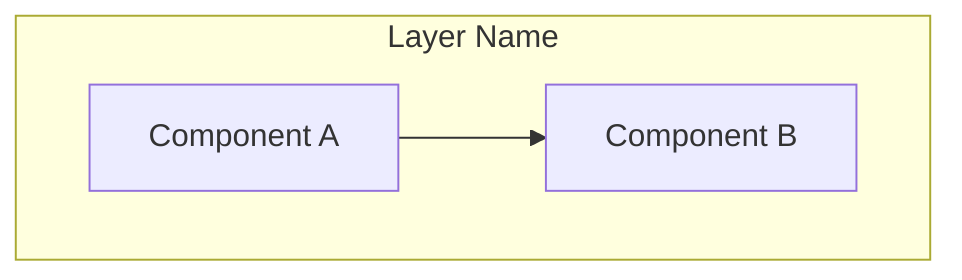
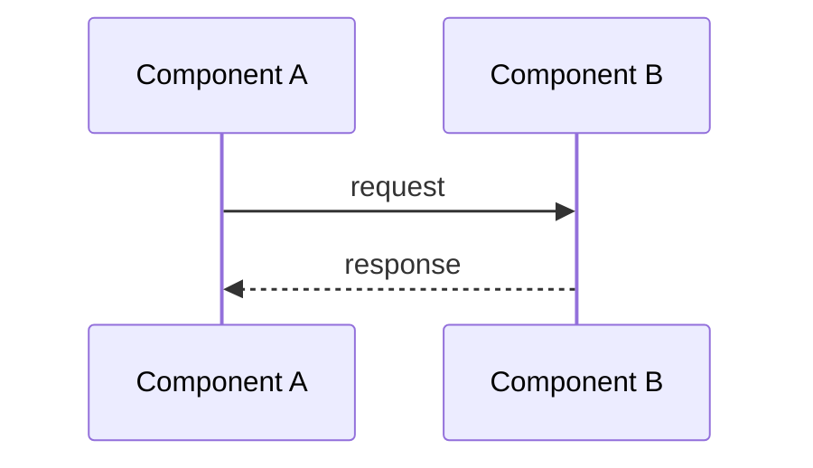
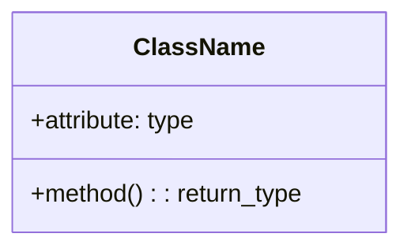

# vLLM Feature Tutorial Style Guide

This reference defines the document structure, formatting conventions, and content patterns to follow when generating vLLM feature tutorial documents.

## Document Structure

A complete tutorial follows this multi-part structure:

```
# vLLM [Feature Name] 特性代码走读技术文档

> **文档版本**: 1.0
> **分析代码版本**: vLLM main 分支（截至 YYYY-MM）
> **最后更新**: YYYY-MM-DD

---

## 文档概述
(Brief overview of scope, target audience, reading guide)

# 第一部分: [Feature] 基础与架构总览
## 1.1 [Feature] 原理
### 1.1.1 基本思想
### 1.1.2 工作流程
### 1.1.3 性能分析（如有）
### 1.1.4 关键指标定义
## 1.2 vLLM [Feature] 整体架构
### 1.2.1 系统架构总览图
### 1.2.2 核心组件与职责划分
### 1.2.3 数据流与控制流分析
## 1.3 执行流程详解
### 1.3.x 示例场景设定 + 多步流程走读

# 第二部分: 核心接口与基类分析
## 2.1 核心基类详解
## 2.2 核心接口定义
## 2.3 工厂方法 / 注册机制

# 第三部分: 核心实现深度分析
## 3.1 算法原理
## 3.2 vLLM 实现分析
## 3.3 关键数据结构

# 第四部分: 不同实现方法对比（如适用）
## 4.x 各方法原理与架构对比

# 第五部分: 配置与使用指南
## 5.1 关键参数说明
## 5.2 典型配置示例
## 5.3 性能调优建议

# 附录
## A. 关键代码位置索引
## B. 术语表
```

Note: Not all parts are mandatory. Adjust the number of parts based on feature complexity. Small features may only need 2-3 parts; complex features may need more.

## Formatting Conventions

### Mermaid Diagrams

Use extensively for architecture, flow, and sequence diagrams:







### Tables

Use tables for comparisons, parameter references, and step summaries:

```markdown
| 特性 | 方法A | 方法B | 方法C |
|------|-------|-------|-------|
| 原理 | ... | ... | ... |
| 优点 | ... | ... | ... |
| 缺点 | ... | ... | ... |
| 适用场景 | ... | ... | ... |
```

### Code Snippets

Include real vLLM code with file path annotations:

```python
# 文件: vllm/path/to/file.py
class ClassName:
    def method(self):
        # 关键逻辑注释
        pass
```

### Callout Blocks

Use blockquotes for key insights:

```markdown
> **关键洞察**: Important insight about the feature.

> **注意**: Warning or important note.

> **性能提示**: Performance-related tip.
```

### Mathematical Formulas

Use LaTeX for formulas when explaining algorithms:

```markdown
$$\text{metric} = \frac{numerator}{denominator}$$
```

## Language

- Write in Chinese (简体中文)
- Technical terms keep English original (e.g., KV Cache, Token, Attention, Prefill, Decode)
- Code identifiers keep original English names
- Section titles use Chinese with English terms where needed

## Content Depth

- Start from basic principles, then dive into implementation
- Include actual code snippets from vLLM source
- Explain the "why" behind design decisions
- Provide concrete numerical examples where applicable
- Cross-reference related components and files
