# vLLM DeepSeek-OCR 模型技术教程

> **文档版本**: 1.0
> **分析代码版本**: vLLM main 分支（截至 2025-10）
> **最后更新**: 2026-05-17
> **模型系列**: DeepSeek-OCR / DeepSeek-OCR2
> **模型类型**: VLM-MoE (视觉语言模型 + 混合专家)

---

## 文档概述

本文档深入分析 DeepSeek-OCR 模型在 vLLM 中的架构设计、计算流程与代码实现。DeepSeek-OCR 是 DeepSeek AI 推出的专为 OCR 和文档解析优化的视觉语言模型，核心创新在于 **"Contexts Optical Compression"（上下文光学压缩）** 技术——通过独特的 DeepEncoder 双流视觉编码器设计，在极高压缩比下仍保持优秀的文字识别精度。

**目标读者**：
- 希望理解 DeepSeek-OCR 架构原理的算法工程师
- 需要在 vLLM 中部署或调优 DeepSeek-OCR 的系统工程师
- 对 vLLM 多模态模型实现感兴趣的研究者

**推荐阅读顺序**：第一部分（模型概览）→ 第二部分（架构详解）→ 第五部分（ViT/视觉编码器）→ 第六部分（vLLM 代码实现）。第三、四部分可在需要了解具体计算细节时查阅。

---

# 第一部分: DeepSeek-OCR 模型系列概述与演进

## 1.1 模型系列发展历史

DeepSeek-OCR 模型的发展脉络如下：

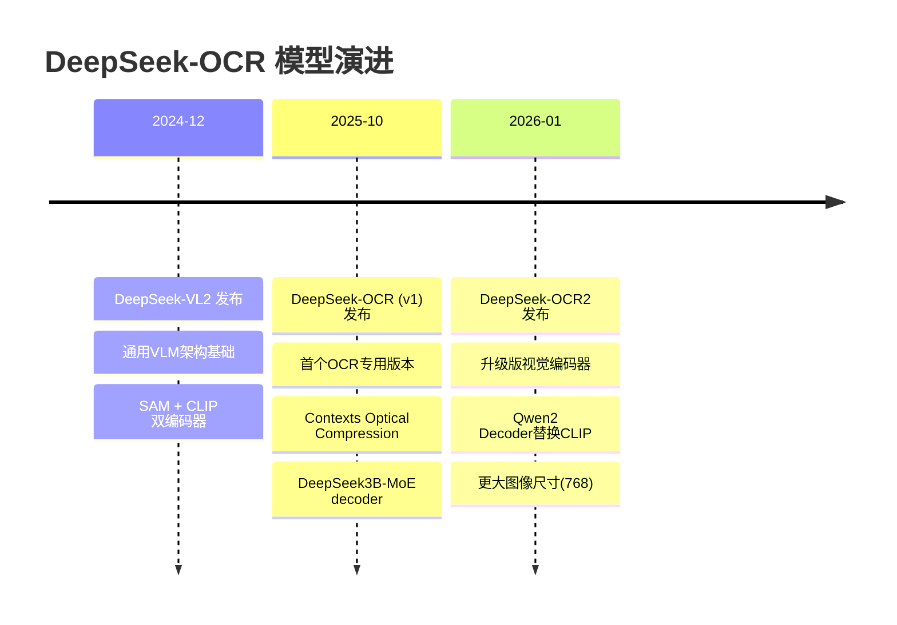

DeepSeek-OCR 的第一代基于 DeepSeek-VL2 的视觉编码架构演进而来。DeepSeek-VL2 是 DeepSeek 的通用视觉语言模型系列，其核心架构包含 SAM (Segment Anything Model) 和 CLIP 的双流视觉编码器设计。DeepSeek-OCR 将这一架构针对 OCR 场景进行了专门优化，引入了**多尺度分块处理**（Dynamic Tiling）和**光学压缩**（Optical Compression）机制。

2026 年 1 月发布的 DeepSeek-OCR2 对视觉编码器进行了重大升级：将 CLIP 编码器替换为基于 **Qwen2 架构的解码器式编码器**（Decoder-as-Encoder），增强了视觉特征的表征能力。

## 1.2 同系列模型对比

| 模型名称 | 参数量 | 发布日期 | 核心创新点 | 架构类型 | 图像尺寸 | 论文/报告 | HuggingFace | GitHub |
|---------|--------|---------|-----------|---------|---------|-----------|------------|--------|
| DeepSeek-VL2 | 3B | 2024-12 | SAM+CLIP双编码器, 动态分块 | VLM (Dense) | 384 | [Paper](https://arxiv.org/abs/2412.10302) | [HF](https://huggingface.co/deepseek-ai/deepseek-vl2) | [GitHub](https://github.com/deepseek-ai/DeepSeek-VL2) |
| DeepSeek-OCR | 3B (MoE, ~570M active) | 2025-10 | Contexts Optical Compression, DeepEncoder, Gundam动态分辨率 | VLM-MoE | 640/1024 | [Paper](https://arxiv.org/abs/2510.18234) | [HF](https://huggingface.co/deepseek-ai/DeepSeek-OCR) | [GitHub](https://github.com/deepseek-ai/DeepSeek-OCR) |
| DeepSeek-OCR2 | 3B (MoE, ~570M active) | 2026-01 | Qwen2 Decoder-as-Encoder, 更大图像尺寸 | VLM-MoE | 768/1024 | [Paper](https://arxiv.org/abs/2510.18234) | [HF](https://huggingface.co/deepseek-ai/DeepSeek-OCR2) | [GitHub](https://github.com/deepseek-ai/DeepSeek-OCR-2) |

## 1.3 各模型能力对比

| 能力维度 | DeepSeek-VL2 | DeepSeek-OCR (v1) | DeepSeek-OCR2 |
|---------|-------------|-------------------|---------------|
| 通用图像理解 | 强 | 中 | 中 |
| OCR 精度 | 中 | 极高 | 极高 |
| 文档解析 (Markdown) | 弱 | 强 | 强 |
| 表格识别 | 中 | 强 | 强 |
| 图表解析 | 弱 | 中 | 中 |
| 视觉 token 压缩率 | 无 | 最高 20× | 最高 20× |
| 吞吐量 (A100, pages/day) | N/A | 200k+ | 200k+ |
| 动态分辨率 | 支持 | 支持 (Gundam) | 支持 (改进) |
| 结构化输出 (ngram) | 不支持 | 支持 | 支持 |

## 1.4 技术报告与论文汇总

| 标题 | 类型 | 链接 | 简要说明 |
|------|------|------|---------|
| DeepSeek-OCR: Contexts Optical Compression | arXiv 论文 | [arXiv:2510.18234](https://arxiv.org/abs/2510.18234) | 提出光学压缩理论和 DeepEncoder 架构 |
| DeepSeek-VL2: Mixture-of-Experts Vision-Language Models | arXiv 论文 | [arXiv:2412.10302](https://arxiv.org/abs/2412.10302) | DeepSeek-VL2 基础架构，双编码器设计起源 |
| DeepSeek-OCR GitHub | 官方代码库 | [GitHub](https://github.com/deepseek-ai/DeepSeek-OCR) | 模型权重、推理代码、vLLM 集成 |
| DeepSeek-OCR2 GitHub | 官方代码库 | [GitHub](https://github.com/deepseek-ai/DeepSeek-OCR-2) | OCR2 版本代码和权重 |

---

# 第二部分: DeepSeek-OCR 模型架构详解

## 2.1 整体架构概览

DeepSeek-OCR 采用 **双流视觉编码器 + MoE 语言模型** 的架构设计：

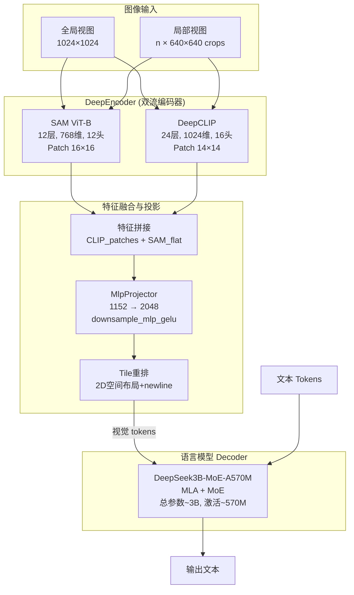

> **关键洞察**: DeepSeek-OCR 为什么能实现高压缩？关键在于 DeepEncoder 将高分辨率图像（如文档扫描件）通过双流编码压缩为少量视觉 token，显著减少了输入 LLM 的序列长度。相比 GOT-OCR2.0 的 256 tokens/page，DeepSeek-OCR 仅需 ~100 tokens 即可达到更高精度。

## 2.2 核心超参数

### 视觉编码器参数

| 参数 | DeepSeek-OCR (v1) | DeepSeek-OCR2 | 说明 |
|------|-------------------|---------------|------|
| SAM 层数 | 12 | 12 | SAM ViT-B encoder depth |
| SAM 嵌入维度 | 768 | 768 | SAM hidden size |
| SAM 注意力头数 | 12 | 12 | SAM attention heads |
| SAM Patch Size | 16 | 16 | SAM patch embedding |
| SAM 输入尺寸 | 1024 | 1024 | SAM input image size |
| CLIP/Qwen2 层数 | 24 (CLIP) | 24 (Qwen2) | 第二编码器深度 |
| CLIP/Qwen2 隐藏维度 | 1024 (CLIP) | 896 (Qwen2) | 第二编码器 hidden size |
| CLIP/Qwen2 注意力头数 | 16 | 14 | 第二编码器 attention heads |
| CLIP/Qwen2 KV 头数 | 16 (MHA) | 2 (GQA) | KV heads |
| 全局视图尺寸 | 1024 | 1024 | base_size for global view |
| 局部裁剪尺寸 | 640 | 768 | image_size for local crops |
| Projector 输入维度 | 1152 | 1152 | input_dim |
| Projector 输出维度 | 2048 | 2048 | n_embed |
| Projector 下采样比例 | 2 | 2 | downsample_ratio |

### 语言模型参数 (DeepSeek3B-MoE)

| 参数 | 值 | 说明 |
|------|-----|------|
| 总参数量 | ~3B | Total parameters |
| 激活参数量 | ~570M | Active parameters per token |
| 注意力机制 | MLA (Multi-head Latent Attention) | 低秩 KV 压缩 |
| FFN 类型 | MoE (Mixture of Experts) | 稀疏激活 |
| 专家数量 | 待确认 (通常 64-256) | 含共享专家 |
| Top-K 激活 | 待确认 (通常 6-8) | 每 token 激活专家数 |
| 上下文长度 | 8K / 32K | 与 DeepSeek-V2 系列一致 |
| 词汇量 | ~152K | 含特殊视觉 token |

### 图像 Token 数量计算

| 模式 | base_size | image_size | crop_mode | 视觉 Token 数 |
|------|-----------|------------|-----------|---------------|
| Tiny | 512 | 512 | False | ~64 |
| Small | 640 | 640 | False | ~100 |
| Base | 1024 | 1024 | False | ~256 |
| Large | 1280 | 1280 | False | ~400 |
| **Gundam (默认)** | **1024** | **640** | **True** | **动态: ~100-800** |

## 2.3 Attention 机制详解

### 技术原理: MLA (Multi-head Latent Attention)

DeepSeek-OCR 的语言模型部分采用与 DeepSeek-V2/V3 相同的 **MLA（多头潜在注意力）** 机制。MLA 的核心思想是通过低秩压缩来大幅减少 KV Cache 的显存占用。

**标准 MHA vs MLA**：

在标准 MHA 中，KV Cache 的每个 token 存储完整的 K 和 V 矩阵：
$$
\text{KV Cache (MHA)} =
2 \times n_{\text{layers}}
\times d_{\text{model}}
\times \text{seq\_len}
\times \text{bytes}
$$

MLA 引入低秩压缩矩阵 $W^{DKV}$ 和上投影矩阵 $W^{UK}, W^{UV}$：

$$c_t^{KV} = W^{DKV} \cdot h_t \in \mathbb{R}^{d_c}$$

$$k_t^C = W^{UK} \cdot c_t^{KV}, \quad v_t^C = W^{UV} \cdot c_t^{KV}$$

其中 $d_c \ll d_{\text{model}}$，KV Cache 仅需存储压缩后的潜在向量 $c_t^{KV}$，实现大幅内存节省。

**MLA 架构图**：

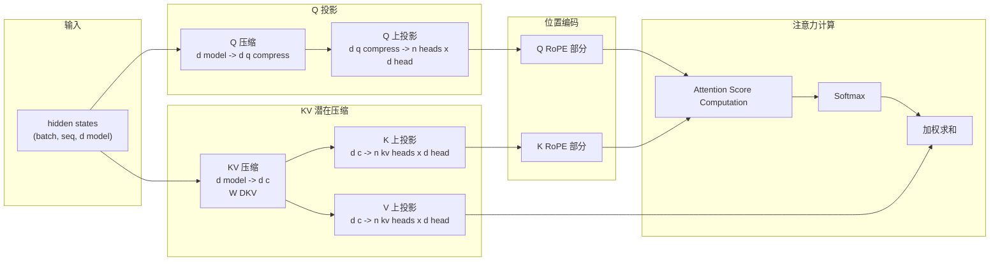

> **性能提示**: MLA 使 DeepSeek-OCR 在长文档 OCR（数千 vision tokens）场景下的 KV Cache 内存消耗远低于同等规模使用标准 MHA/GQA 的模型，这对于在单卡 A100 上实现 200k+ pages/day 的吞吐量至关重要。

## 2.4 FFN / MoE 机制详解

### 技术原理: MoE (Mixture of Experts)

DeepSeek-OCR 使用 **DeepSeek3B-MoE-A570M** 作为语言解码器，总参数约 3B，但每个 token 仅激活约 570M 参数，通过 MoE 实现高效的推理。

**MoE 路由机制**：

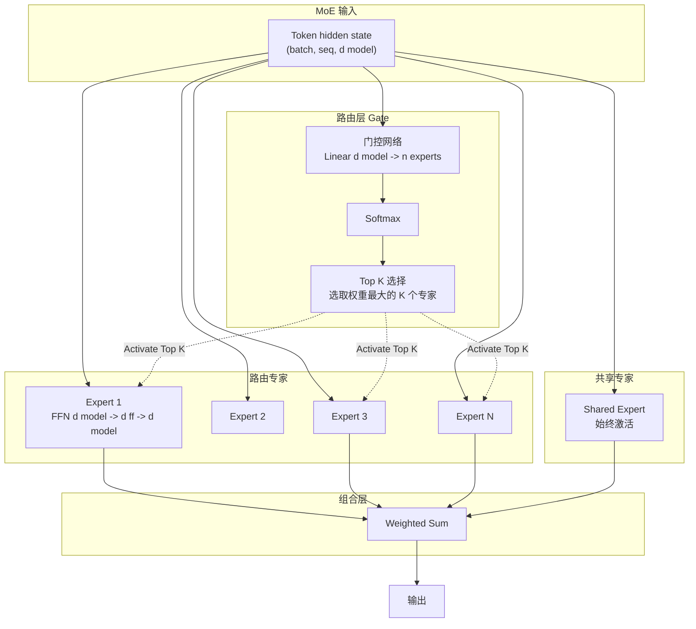

**MoE 核心公式**：

$$\text{MoE}(x) = \sum_{i \in \text{TopK}} g_i(x) \cdot E_i(x) + SE(x)$$

其中：

- $g_i(x) = \text{Softmax}(\text{TopKFilter}(W_g \cdot x))_i$ 为第 $i$ 个专家的路由权重
- $E_i(x) = W_2 \cdot \text{SwiGLU}(W_1 \cdot x)$ 为专家 FFN
- $SE(x)$ 为共享专家输出（始终激活，不经过路由）
- TopK 通常为 6-8，实际激活专家数远小于总专家数

**DeepSeek MoE 的设计特点**：

| 设计维度 | 说明 |
|---------|------|
| 共享专家 | 1 个固定激活的共享专家，捕获通用知识 |
| 路由专家 | N 个通过门控选择的专家，负责特定领域 |
| 门控机制 | Top-K Softmax 路由，仅激活最高分专家 |
| 负载均衡 | 辅助损失函数确保专家均匀使用 |
| 专家并行 | 在 vLLM 中通过 Expert Parallelism 分布在多 GPU |

## 2.5 其他关键技术组件

### 归一化层 (RMSNorm)

DeepSeek-OCR 继承 DeepSeek-V2 的设计，使用 **RMSNorm**（Root Mean Square Layer Normalization）：

$$\text{RMSNorm}(x) = \frac{x}{\sqrt{\frac{1}{d}\sum_{i=1}^{d} x_i^2 + \epsilon}} \cdot \gamma$$

相比 LayerNorm，RMSNorm 移除了均值中心化步骤，计算更高效。

### 激活函数 (SwiGLU)

FFN/MoE 专家内部使用 **SwiGLU** 激活：

$$\text{SwiGLU}(x) = (x \cdot W_{\text{gate}}) \odot \text{SiLU}(x \cdot W_{\text{up}}) \cdot W_{\text{down}}$$

其中 $\text{SiLU}(x) = x \cdot \sigma(x)$ 为 Sigmoid Linear Unit。

### 位置编码 (RoPE)

使用 **旋转位置编码 (Rotary Position Embedding)** 为 Attention 注入位置信息，支持通过插值扩展到更长的上下文长度。

### 2D Tile Tag 与布局标记

DeepSeek-OCR 在视觉特征中使用特殊的 **2D 布局标记**：
- `<|view_separator|>`: 分隔全局视图和局部视图
- `<|\n|>` (image_newline): 在局部 tile 的行之间插入换行标记
- 这些可学习的 embedding 帮助 LLM 理解视觉 token 的 2D 空间排列关系

---

# 第三部分: 输入预处理流程

## 3.1 文本预处理

DeepSeek-OCR 的文本预处理流程遵循 DeepSeek-V2 的 tokenization 规范：

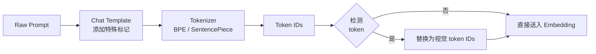

### 典型 OCR Prompt 模板：

| 任务类型 | Prompt 格式 |
|---------|------------|
| 通用 OCR | `<image>\nFree OCR.` |
| 文档转 Markdown | `<image>\n<|grounding|>Convert the document to markdown.` |
| 图表解析 | `<image>\nParse the figure.` |
| 图像描述 | `<image>\nDescribe this image in detail.` |
| 定位文本 | `<image>\nLocate <|ref|>text<|/ref|> in the image.` |

## 3.2 多模态输入处理

DeepSeek-OCR 的图像预处理是其核心能力的关键。它支持两种分辨率模式：**原生分辨率**和**动态分辨率（Gundam）**。

### 3.2.1 图像处理 Pipeline

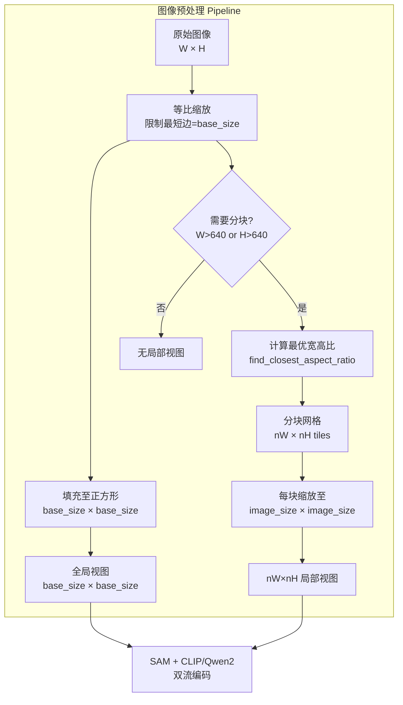

### 3.2.2 动态分块算法

Gundam 模式下的分块策略：

```python
# 简化版分块逻辑 - 来自 deepseek_ocr.py
def count_tiles(orig_width, orig_height, min_num=2, max_num=6, image_size=640):
    aspect_ratio = orig_width / orig_height
    target_ratios = calculate_aspect_ratios(min_num, max_num)
    # 找到最接近原始宽高比的 tile 配置
    target_aspect_ratio = find_closest_aspect_ratio(
        aspect_ratio, target_ratios, orig_width, orig_height, image_size
    )
    return target_aspect_ratio  # (num_width_tiles, num_height_tiles)
```

### 3.2.3 视觉 Token 数量计算

以 Gundam 模式为例（v1: base_size=1024, image_size=640, patch_size=16, downsample=4）：

$$h = w = \lceil(1024 / 16) / 4\rceil = \lceil 64/4 \rceil = 16$$

$$h_2 = w_2 = \lceil(640 / 16) / 4\rceil = \lceil 40/4 \rceil = 10$$

$$
\text{global\_tokens} = h \times (w + 1) = 16 \times 17 = 272
$$

$$
\text{local\_tokens} = (n_H \times h_2) \times (n_W \times w_2 + 1)
$$

$$
\text{total} = \text{global\_tokens} + \text{local\_tokens} + 1\ \text{(view\_separator)}
$$

对于单 tile（不触发分块），token 数固定约 272 + 1 = 273。对于大图（如 3×2 = 6 tiles），token 数可达 ~800。

## 3.3 Tokenizer 配置

| 配置项 | 值 | 说明 |
|--------|-----|------|
| Tokenizer 类型 | LlamaTokenizerFast | 基于 LLaMA tokenizer |
| 词汇量 | ~151,936 | 含视觉特殊 token |
| 图像 token | `<image>` (token_id 可变) | 视觉占位符 |
| 特殊 token | `<|view_separator|>`, `<|\n\|>` | 2D 空间布局标记 |
| Chat Template | 不使用标准 ChatML | 简单 prompt 格式 |
| 表格 token | `<td>` (128821), `</td>` (128822) | NGram 处理器白名单 |

---

# 第四部分: 模型前向传播流程

## 4.1 整体 Forward 流程

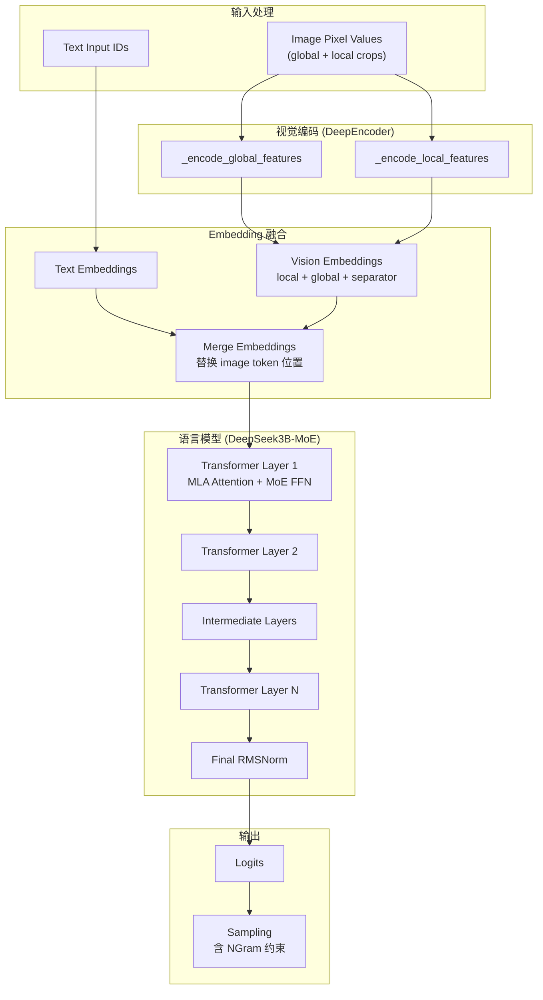

## 4.2 视觉编码流程详解

### Step 1: SAM 编码（底层特征提取）

```python
# 文件: vllm/model_executor/models/deepseek_ocr.py
def _encode_global_features(self, image_tensor: torch.Tensor) -> torch.Tensor:
    # image_tensor: [1, 3, 1024, 1024]
    
    # Step 1a: SAM ViT-B 编码
    global_features_1 = self.sam_model(image_tensor)
    # 输出: [1, 1024, 16, 16]  (经过 2 次 stride-2 卷积下采样)
    
    # Step 1b: DeepCLIP 编码 (用 SAM 特征作为输入)
    global_features_2 = self.vision_model(image_tensor, global_features_1)
    # CLIP 输出: [1, 257, 1024]  (CLS token + 16×16 patches)
    
    # Step 1c: 特征拼接
    features = torch.cat(
        (
            global_features_2[:, 1:],    # CLIP patches: [1, 256, 1024]
            global_features_1.flatten(2).permute(0, 2, 1),  # SAM features: [1, 256, 256]
        ),
        dim=-1,  # 在最后一维拼接 → [1, 256, 1024+256] = [1, 256, 1280]
    )
    
    # Step 1d: 投影到 LLM 空间
    features = self.projector(features)  # [1, 256, 2048]
    
    # Step 1e: 重塑为 2D 布局并插入换行 token
    features = features.view(side, side, dim)  # [16, 16, 2048]
    newline = self.image_newline[None, None, :].expand(side, 1, dim)  # [16, 1, 2048]
    features = torch.cat([features, newline], dim=1)  # [16, 17, 2048]
    return features.view(-1, dim)  # [272, 2048]
```

**张量形状变化追踪**：

| 步骤 | 操作 | 输入形状 | 输出形状 |
|------|------|---------|---------|
| SAM 编码 | `sam_model()` | `[1, 3, 1024, 1024]` | `[1, 1024, 16, 16]` |
| CLIP 编码 | `vision_model()` | `[1, 3, 1024, 1024]` + SAM feat | `[1, 257, 1024]` |
| 特征拼接 | `cat()` | `[1,256,1024]` + `[1,256,256]` | `[1, 256, 1280]` |
| 投影 | `projector()` | `[1, 256, 1152]` | `[1, 256, 2048]` |
| 2D 重塑 | `view()` | `[1, 256, 2048]` | `[16, 16, 2048]` |
| 插入换行 | `cat()` | `[16,16,2048]` + `[16,1,2048]` | `[16, 17, 2048]` |
| 展开 | `view(-1, dim)` | `[16, 17, 2048]` | `[272, 2048]` |

### Step 2: 局部视图编码（Tiled Processing）

```python
# 文件: vllm/model_executor/models/deepseek_ocr.py
def _encode_local_features(self, patches, crop_shape):
    # patches: [n_tiles, 3, 640, 640]
    # crop_shape: [num_width_tiles, num_height_tiles]
    
    local_features_1 = self.sam_model(patches)
    local_features_2 = self.vision_model(patches, local_features_1)
    features = torch.cat((local_features_2[:, 1:], 
                          local_features_1.flatten(2).permute(0, 2, 1)), dim=-1)
    features = self.projector(features)
    
    # 2D 空间重组: 按 tile 网格排列
    features = features.view(height_tiles, width_tiles, patch_side, patch_side, dim)
    features = features.permute(0, 2, 1, 3, 4)  # 穿插排列
    features = features.reshape(height_tiles * patch_side, width_tiles * patch_side, dim)
    
    # 每行末尾插入换行 token
    newline = self.image_newline.expand(height_tiles * patch_side, 1, dim)
    features = torch.cat([features, newline], dim=1)
    return features.view(-1, dim)
```

### Step 3: 视觉 Token 组装

```python
# 文件: vllm/model_executor/models/deepseek_ocr.py
def _pixel_values_to_embedding(self, pixel_values, images_crop, images_spatial_crop):
    for jdx in range(images_spatial_crop.size(0)):
        global_features = self._encode_global_features(image_ori)
        local_features = self._encode_local_features(patches, crop_shape)
        
        if local_features is not None:
            # 顺序: 局部视图 → 全局视图 → view_separator
            combined = torch.cat(
                [local_features, global_features, self.view_seperator[None, :]], dim=0
            )
        else:
            combined = torch.cat(
                [global_features, self.view_seperator[None, :]], dim=0
            )
```

> **关键洞察**: 视觉 token 的顺序是 **local → global → separator**，这确保了局部细节（高分辨率文字）在序列中先出现，全局上下文（文档结构理解）作为补充。

## 4.3 单层 Transformer 计算流程

```mermaid
flowchart TB

    subgraph Layer["Single Transformer Layer (Pre-Norm)"]

        Input["Input Hidden States<br/>(batch, seq, 2048)"]


        subgraph Attn["MLA Attention Block"]

            Norm1["RMSNorm"]

            QKV["QKV Latent Projection"]

            AttnCalc["MLA Attention Computation"]

            OutProj["Output Projection"]

            Res1["Residual Add"]

        end


        subgraph MoE["MoE FFN Block"]

            Norm2["RMSNorm"]

            Gate["Gate Router"]

            SharedE["Shared Expert"]

            RoutedE["Routed Expert Top-K"]

            Combine["Weighted Combine"]

            Res2["Residual Add"]

        end


        Output["Output Hidden States<br/>(batch, seq, 2048)"]

    end


    Input --> Norm1
    Norm1 --> QKV
    QKV --> AttnCalc
    AttnCalc --> OutProj
    OutProj --> Res1

    Input --> Res1

    Res1 --> Norm2

    Norm2 --> Gate
    Norm2 --> SharedE

    Gate --> RoutedE

    SharedE --> Combine
    RoutedE --> Combine

    Combine --> Res2

    Res1 --> Res2

    Res2 --> Output
```

## 4.4 vLLM 中的优化

| 优化技术 | 描述 | DeepSeek-OCR 中的应用 |
|---------|------|----------------------|
| **PagedAttention** | 分页 KV Cache 管理 | 对文档级长序列 OCR 场景效果显著 |
| **Chunked Prefill** | 分块预填充 | 长 prompt（大量视觉 token）的高效处理 |
| **Prefix Caching** | 前缀缓存 | 建议**关闭**（`enable_prefix_caching=False`） |
| **Tensor Parallelism** | 张量并行 | MoE 专家可分布到多 GPU |
| **Expert Parallelism** | 专家并行 | 路由专家分布在不同 GPU |
| **Multi-Modality Cache** | 多模态处理器缓存 | 建议设为 0（`mm_processor_cache_gb=0`） |
| **NGram Logits Processor** | N-gram 约束输出 | 确保结构化输出（如表格 HTML 标签） |

> **注意**: DeepSeek-OCR 官方推荐关闭 prefix caching 和 mm_processor_cache，这是因为其动态分块（Gundam mode）导致每次请求的图像处理结果随图像尺寸变化，缓存命中率极低且浪费显存。

---

# 第五部分: ViT / DeepEncoder 计算流程

## 5.1 DeepEncoder 架构概览

DeepEncoder 是 DeepSeek-OCR 的核心创新，由 **SAM ViT-B** 和 **DeepCLIP (v1) / Qwen2 Decoder (v2)** 组成双流编码器：

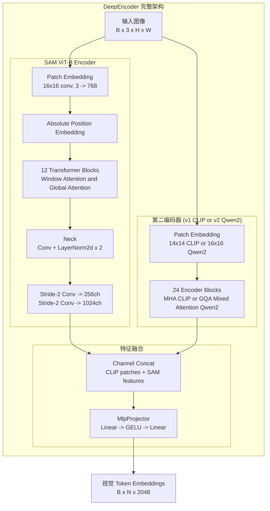

## 5.2 SAM ViT-B 详解

SAM (Segment Anything Model) ViT-B 是 Meta 提出的视觉编码器，在 DeepSeek-OCR 中被用作底层特征提取器：

### 架构参数

| 参数 | 值 | 说明 |
|------|-----|------|
| Patch Embedding | `Conv2d(3, 768, kernel=16, stride=16)` | 16×16 不重叠 patch |
| Depth | 12 | Transformer block 数量 |
| Embed Dim | 768 | 隐层维度 |
| Num Heads | 12 | 每头维度 64 |
| Window Size | 14 | 窗口注意力大小 |
| Global Attention | 索引 [2, 5, 8, 11] | 这些层使用全局注意力 |
| Neck Conv1 | `Conv2d(768 → 256, kernel=1)` | 降维投影 |
| Neck Conv2 | `Conv2d(256 → 256, kernel=3, pad=1)` | 特征精炼 |
| Stride Conv1 | `Conv2d(256 → 512, kernel=3, stride=2)` | 下采样 |
| Stride Conv2 | `Conv2d(512 → 1024, kernel=3, stride=2)` | 最终下采样 |

### SAM 前向流程

```
Input: [B, 3, 1024, 1024]
  → Patch Embedding: [B, 768, 64, 64]
  → + Position Embed: [B, 768, 64, 64]
  → 12× Transformer Blocks (window/global attention 交替)
  → Neck: Conv1d(768→256) + LayerNorm + Conv(256→256) + LayerNorm
  → [B, 256, 64, 64]
  → Stride-2 Conv: [B, 512, 32, 32]
  → Stride-2 Conv: [B, 1024, 16, 16]  ← 最终输出
```

SAM 使用**窗口注意力（Window Attention）** 和**全局注意力（Global Attention）** 的混合策略，在 [2, 5, 8, 11] 层使用全局注意力处理全局信息，其余层使用窗口注意力降低计算复杂度。

## 5.3 DeepCLIP Vision Encoder (v1)

DeepCLIP 是基于 CLIP 架构优化的大规模视觉编码器：

| 参数 | 值 |
|------|-----|
| Hidden Size | 1024 |
| Intermediate Size | 4096 |
| Num Hidden Layers | 24 |
| Num Attention Heads | 16 |
| Patch Size | 14 |
| Image Size | 224 (通过位置编码插值支持任意尺寸) |

在 DeepSeek-OCR 中，`DeepCLIPVisionTransformer` 接收原始图像和 SAM 的输出特征作为额外输入，这种**串联编码**（cascaded encoding）设计使 CLIP 能够在 SAM 提供的底层特征基础上提取高层语义信息。

## 5.4 Qwen2 Decoder-as-Encoder (v2, DeepSeek-OCR2)

DeepSeek-OCR2 用 Qwen2 解码器替换 CLIP，这是架构上的一个重大变化：

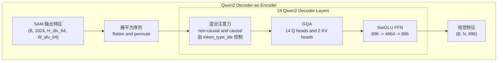

### Qwen2 Encoder 架构参数

| 参数 | 值 |
|------|-----|
| Hidden Dim | 896 |
| Num Layers | 24 |
| Num Q Heads | 14 |
| Num KV Heads | 2 (GQA, 7:1 ratio) |
| Intermediate Size | 4864 |
| RoPE Theta | 1,000,000 |
| RMS Norm Eps | 1e-6 |
| Activation | SiLU (SwiGLU 内部) |

Qwen2 Encoder 的一个关键创新是**混合注意力机制**：部分 token 使用 non-causal（双向）注意力，部分 token 使用 causal（单向）注意力，由 `token_type_ids` 控制（0=non-causal, 1=causal）。这种设计使其既能作为编码器（双向）理解上下文，又能保留解码器的序列建模能力。

## 5.5 v1 vs v2 视觉编码差异对比

| 维度 | DeepSeek-OCR (v1) | DeepSeek-OCR2 |
|------|-------------------|---------------|
| 第二编码器 | DeepCLIP (1024-dim, MHA) | Qwen2 Decoder (896-dim, GQA) |
| 图像尺寸 (local) | 640×640 | 768×768 |
| 局部特征格式 | 带换行 token 的 2D 布局 | 展平序列（无换行 token） |
| 全局特征格式 | `[CLS+1:, SAM]: 16×(16+1)` | `[Qwen2_output]: 展平` |
| Token type 混合注意力 | 不支持 | 支持 (token_type_ids) |
| 视觉 token 数 (global) | 272 (16×17) | 256 (16×16, 无额外 newline 列) |

---

# 第六部分: vLLM 中的代码实现

## 6.1 模型注册与配置

DeepSeek-OCR 在 vLLM 中通过 `MULTIMODAL_REGISTRY` 注册：

```python
# 文件: vllm/model_executor/models/deepseek_ocr.py

@MULTIMODAL_REGISTRY.register_processor(
    DeepseekOCRMultiModalProcessor,
    info=DeepseekOCRProcessingInfo,
    dummy_inputs=DeepseekOCRDummyInputsBuilder,
)
class DeepseekOCRForCausalLM(nn.Module, SupportsMultiModal, SupportsPP, SupportsLoRA):
    ...
```

模型配置继承自 `DeepseekVLV2Config`：

```python
# 文件: vllm/transformers_utils/configs/deepseek_vl2.py

class DeepseekVLV2Config(PretrainedConfig):
    model_type = "deepseek_vl_v2"  # 或 "deepseek_ocr" / "deepseek_ocr2"
    tile_tag: str = "2D"
    global_view_pos: str = "head"
    
    def __init__(self, ...):
        self.vision_config = VisionEncoderConfig(...)
        self.projector_config = MlpProjectorConfig(...)
        self.text_config = DeepseekVLV2TextConfig(...)  # DeepSeek3B-MoE 配置
```

## 6.2 核心模型类分析

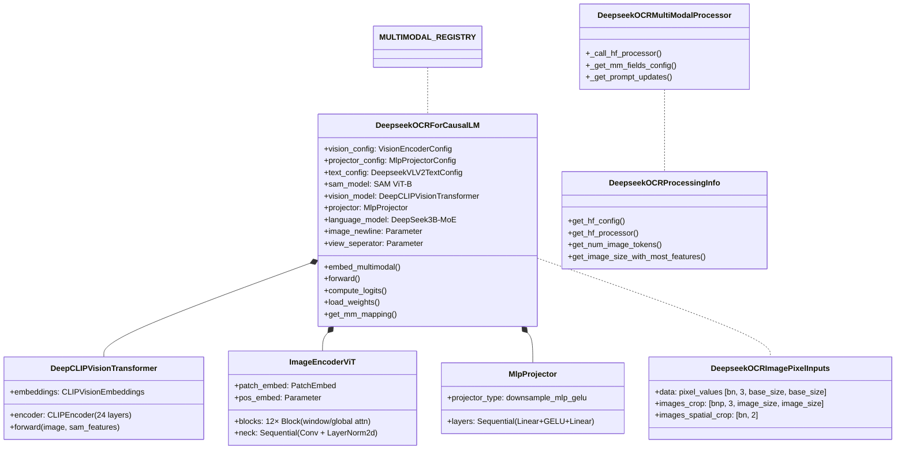

## 6.3 关键计算流程代码分析

### 6.3.1 多模态 Embedding 入口

```python
# 文件: vllm/model_executor/models/deepseek_ocr.py

def embed_multimodal(self, **kwargs: object) -> MultiModalEmbeddings | None:
    image_input = self._parse_and_validate_image_input(**kwargs)
    if image_input is None:
        return None
    vision_embeddings = self._process_image_input(image_input)
    return vision_embeddings
```

### 6.3.2 图像前向传播 (完整 Pipeline)

```python
# 文件: vllm/model_executor/models/deepseek_ocr.py

def _process_image_input(
    self, image_input: DeepseekOCRImagePixelInputs
) -> torch.Tensor:
    # image_input:
    #   .data:           [B, 3, 1024, 1024]  - 全局视图
    #   .images_crop:    [N_crops, 3, 640, 640]  - 局部裁剪
    #   .images_spatial_crop: [B, 2]  - 每张图的 tile 网格 (nW, nH)
    
    vision_features = self._pixel_values_to_embedding(
        pixel_values=image_input.data,
        images_crop=image_input.images_crop,
        images_spatial_crop=image_input.images_spatial_crop,
    )
    # 返回: List[Tensor], 每个元素是单张图的视觉 embeddings
    # 每个元素形状: [num_vision_tokens, 2048]
    return vision_features
```

### 6.3.3 Forward 方法

```python
# 文件: vllm/model_executor/models/deepseek_ocr.py

def forward(
    self,
    input_ids: torch.Tensor | None,
    positions: torch.Tensor,
    intermediate_tensors: IntermediateTensors | None = None,
    inputs_embeds: torch.Tensor | None = None,
    **kwargs: object,
):
    # 如果有中间张量（PP 场景），跳过 embedding 层
    if intermediate_tensors is not None:
        inputs_embeds = None

    # language_model 处理多模态 embedding + text tokens
    hidden_states = self.language_model(
        input_ids, positions, intermediate_tensors, 
        inputs_embeds=inputs_embeds
    )
    return hidden_states
```

### 6.3.4 DeepSeek-OCR2 的差异

```python
# 文件: vllm/model_executor/models/deepseek_ocr2.py

class DeepseekOCR2ForCausalLM(nn.Module, SupportsMultiModal, SupportsPP, SupportsLoRA):
    def __init__(self, *, vllm_config: VllmConfig, prefix: str = ""):
        # OCR2 使用 Qwen2 Decoder 替换 CLIP
        self.sam_model = ImageEncoderViT(...)
        self.qwen2_model = build_qwen2_decoder_as_encoder()  # 不同!
        
    def _encode_global_features(self, image_tensor):
        global_features_1 = self.sam_model(image_tensor)
        global_features_2 = self.qwen2_model(global_features_1)  # Qwen2 编码
        features = self.projector(global_features_2)
        return features.view(-1, dim)  # 无 2D newline 布局
    
    def get_mm_mapping(self) -> MultiModelKeys:
        return MultiModelKeys.from_string_field(
            language_model="language_model",
            connector="projector",
            tower_model=["sam_model", "qwen2_model"],  # 不同!
        )
```

### 6.3.5 NGram Logits Processor

DeepSeek-OCR 特有的结构化输出约束机制：

```python
# 文件: vllm/model_executor/models/deepseek_ocr.py

class NoRepeatNGramLogitsProcessor:
    def __init__(self, ngram_size: int, window_size: int, 
                 whitelist_token_ids: set[int] | None = None):
        self.ngram_size = ngram_size
        self.window_size = window_size
        self.whitelist_token_ids = whitelist_token_ids or set()

    def __call__(self, output_ids: list[int], logits: torch.Tensor) -> torch.Tensor:
        # 获取当前 n-1 前缀
        current_prefix = tuple(output_ids[-(self.ngram_size - 1):])
        
        # 在 window 内搜索匹配的 n-gram，禁止重复出现
        search_start = max(0, len(output_ids) - self.window_size)
        search_end = len(output_ids) - self.ngram_size + 1
        
        banned_tokens = set()
        for i in range(search_start, search_end):
            ngram = tuple(output_ids[i : i + self.ngram_size])
            if ngram[:-1] == current_prefix:
                banned_tokens.add(ngram[-1])
        
        banned_tokens = banned_tokens - self.whitelist_token_ids
        if banned_tokens:
            logits[list(banned_tokens)] = -float("inf")
        return logits
```

该处理器防止在固定窗口内出现相同的 n-gram 序列，同时通过白名单机制保证 HTML 标签（如 `<td>`, `</td>`）的正常重复使用。

## 6.4 vLLM 特有优化

### 6.4.1 多模态处理器缓存管理

vLLM 对 DeepSeek-OCR 的特殊处理：
- 关闭多模态处理器缓存 (`mm_processor_cache_gb=0`)：Gundam 模式下每次图像处理结果因尺寸而异
- 关闭 Prefix Caching：视觉 token 的高度动态性使前缀缓存无效果

### 6.4.2 权重加载映射

```python
# 文件: vllm/model_executor/models/deepseek_ocr.py

hf_to_vllm_mapper = WeightsMapper(
    orig_to_new_prefix={
        # LLM 权重: model.xxx → language_model.model.xxx
        "model.embed_tokens.": "language_model.model.embed_tokens.",
        "model.layers.": "language_model.model.layers.",
        "model.norm.": "language_model.model.norm.",
        "lm_head.": "language_model.lm_head.",
        # 视觉权重: model.xxx → xxx (移除 model 前缀)
        "model.": "",
    }
)
```

### 6.4.3 Pipeline Parallelism 支持

DeepSeek-OCR 支持 Pipeline Parallelism (PP)，通过 `SupportsPP` 接口：
- Vision encoder 和 language model 可以分布在不同的 PP stage
- `forward()` 中的 `intermediate_tensors` 处理跨 stage 通信

### 6.4.4 LoRA 支持

通过 `SupportsLoRA` 接口支持 Low-Rank Adaptation，可以对语言模型部分进行微调。

---

# 附录

## A. 关键代码位置索引

| 组件 | 文件路径 | 关键类/函数 |
|------|---------|------------|
| 模型入口 (v1) | `vllm/model_executor/models/deepseek_ocr.py` | `DeepseekOCRForCausalLM` |
| 模型入口 (v2) | `vllm/model_executor/models/deepseek_ocr2.py` | `DeepseekOCR2ForCausalLM` |
| SAM ViT Encoder | `vllm/model_executor/models/deepencoder.py` | `ImageEncoderViT`, `Block` |
| Qwen2 Decoder Encoder | `vllm/model_executor/models/deepencoder2.py` | `CustomQwen2Decoder` |
| CLIP Encoder | `vllm/model_executor/models/deepencoder.py` | `DeepCLIPVisionTransformer` |
| MLP Projector | `vllm/model_executor/models/deepseek_vl2.py` | `MlpProjector` |
| 模型配置 | `vllm/transformers_utils/configs/deepseek_vl2.py` | `DeepseekVLV2Config`, `VisionEncoderConfig`, `MlpProjectorConfig` |
| 图像处理器 | `vllm/transformers_utils/processors/deepseek_ocr.py` | `DeepseekOCRProcessor`, `count_tiles` |
| 多模态注册 | `vllm/model_executor/models/deepseek_ocr.py` | `DeepseekOCRMultiModalProcessor`, `DeepseekOCRProcessingInfo` |
| NGram 处理器 | `vllm/model_executor/models/deepseek_ocr.py` | `NoRepeatNGramLogitsProcessor`, `NGramPerReqLogitsProcessor` |
| Pipeline Parallelism | `vllm/model_executor/models/deepseek_ocr.py` | `SupportsPP` (interface) |
| 视觉编码基准 | `vllm/model_executor/models/clip.py` | `CLIPEncoder`, `CLIPVisionEmbeddings` |

## B. 术语表

| 术语 | 英文 | 说明 |
|------|------|------|
| 上下文光学压缩 | Contexts Optical Compression | 将长文本通过 2D 光学映射压缩为少量视觉 token |
| 双流编码器 | Dual-Stream Encoder | SAM + CLIP/Qwen2 双编码器并联设计 |
| 深层编码器 | DeepEncoder | DeepSeek-OCR 的核心视觉编码模块 |
| 混合专家 | MoE (Mixture of Experts) | 稀疏激活的 FFN 架构 |
| 多头潜在注意力 | MLA (Multi-head Latent Attention) | DeepSeek 的低秩 KV 压缩注意力机制 |
| 动态分块 | Dynamic Tiling / Gundam Mode | 根据图像宽高比自适应分割为多个 tile |
| 窗口注意力 | Window Attention | 限制 attention 在局部窗口内计算 |
| 分组查询注意力 | GQA (Grouped-Query Attention) | 多 Q 头共享 KV 头 |
| 旋转位置编码 | RoPE (Rotary Position Embedding) | 通过旋转矩阵注入位置信息 |
| 视觉 Token | Vision Token | 图像经视觉编码器处理后的特征向量 |
| 视图分隔符 | View Separator | `<\|view_separator\|>` 分隔全局/局部视图 |
| 管道并行 | PP (Pipeline Parallelism) | 按层切分模型到不同 GPU |
| 张量并行 | TP (Tensor Parallelism) | 按张量维度切分到不同 GPU |
| 专家并行 | EP (Expert Parallelism) | 将 MoE 专家分布到不同 GPU |

## C. GPU 显存估算

### 单卡 A100-40G 部署估算

| 组件 | 显存占用 (BF16) | 备注 |
|------|----------------|------|
| SAM ViT-B | ~180 MB | 12 层, 768 维 |
| DeepCLIP | ~600 MB | 24 层, 1024 维 |
| MlpProjector | ~10 MB | 2 层 MLP |
| DeepSeek3B-MoE (语言模型) | ~6 GB | 3B params, BF16 |
| KV Cache (8K seq, MLA 压缩) | ~500 MB | MLA 大幅减少 KV Cache |
| 其他开销 | ~300 MB | 激活值, 临时缓冲 |
| **总计** | **~7.6 GB** | 远小于 40GB 限制 |

> **性能提示**: 在 A100-40G 上，DeepSeek-OCR 可处理 200k+ pages/day。MLA 对 KV Cache 的压缩是这一吞吐量的关键支撑——若使用标准 MHA，KV Cache 将增长 4-6 倍，显著限制并发数。

## D. vLLM 推理示例

### 基本用法

```python
from vllm import LLM, SamplingParams
from vllm.model_executor.models.deepseek_ocr import NGramPerReqLogitsProcessor

llm = LLM(
    model="deepseek-ai/DeepSeek-OCR",
    enable_prefix_caching=False,     # 建议关闭
    mm_processor_cache_gb=0,         # 建议关闭
    logits_processors=[NGramPerReqLogitsProcessor],
)

sampling_params = SamplingParams(
    temperature=0.0,
    max_tokens=8192,
    extra_args=dict(
        ngram_size=30,
        window_size=90,
        whitelist_token_ids={128821, 128822},  # <td>, </td>
    ),
    skip_special_tokens=False,
)

outputs = llm.generate({
    "prompt": "<image>\n<|grounding|>Convert the document to markdown.",
    "multi_modal_data": {
        "image": "document.jpg"
    },
}, sampling_params)
```

### 高级配置（分辨率模式切换）

```python
# 通过 processor kwargs 切换模式
# Tiny: base_size=512, image_size=512, crop_mode=False
# Small: base_size=640, image_size=640, crop_mode=False
# Base: base_size=1024, image_size=1024, crop_mode=False
# Large: base_size=1280, image_size=1280, crop_mode=False
# Gundam (default): base_size=1024, image_size=640, crop_mode=True
```

## E. 参考资料

- [DeepSeek-OCR Paper: Contexts Optical Compression](https://arxiv.org/abs/2510.18234)
- [DeepSeek-OCR GitHub Repository](https://github.com/deepseek-ai/DeepSeek-OCR)
- [DeepSeek-OCR2 GitHub Repository](https://github.com/deepseek-ai/DeepSeek-OCR-2)
- [DeepSeek-OCR HuggingFace Model](https://huggingface.co/deepseek-ai/DeepSeek-OCR)
- [DeepSeek-VL2 Paper](https://arxiv.org/abs/2412.10302)
- [DeepSeek-V2 Paper (MLA + MoE Architecture)](https://arxiv.org/abs/2405.04434)
- [vLLM DeepSeek-OCR Source](https://github.com/vllm-project/vllm/blob/main/vllm/model_executor/models/deepseek_ocr.py)
- [vLLM DeepSeek-OCR2 Source](https://github.com/vllm-project/vllm/blob/main/vllm/model_executor/models/deepseek_ocr2.py)
- [LLM Architecture Gallery](https://sebastianraschka.com/llm-architecture-gallery/)
- [SAM: Segment Anything Model](https://arxiv.org/abs/2304.02643)
- [Qwen2 Technical Report](https://arxiv.org/abs/2407.10671)
