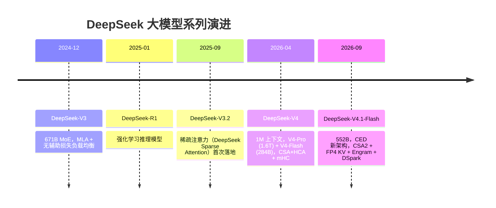
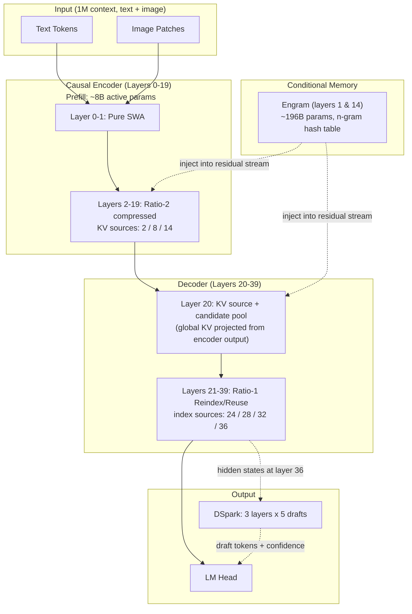
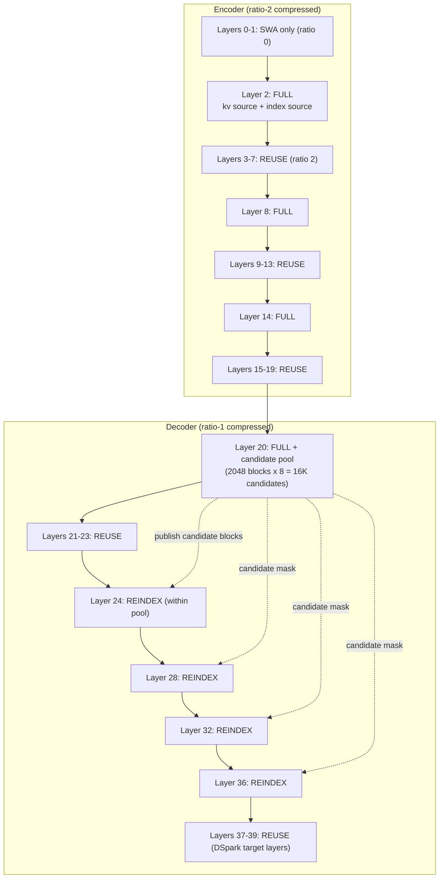
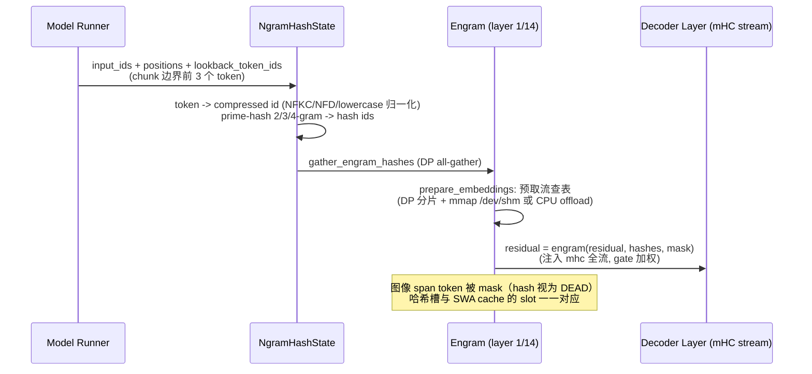
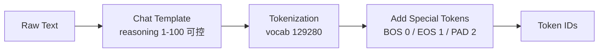
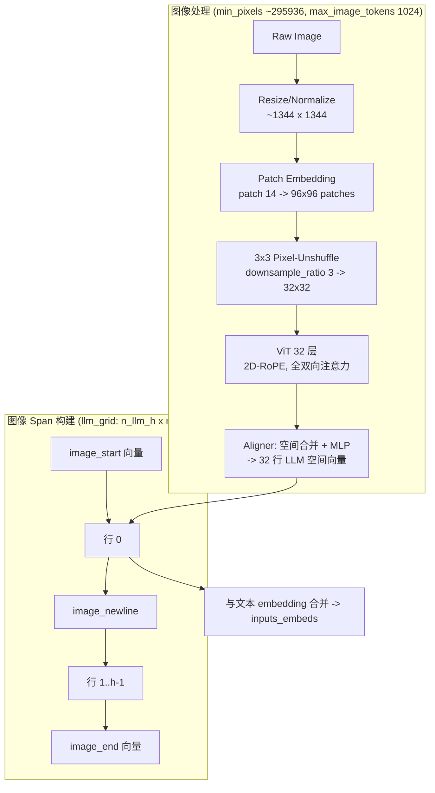
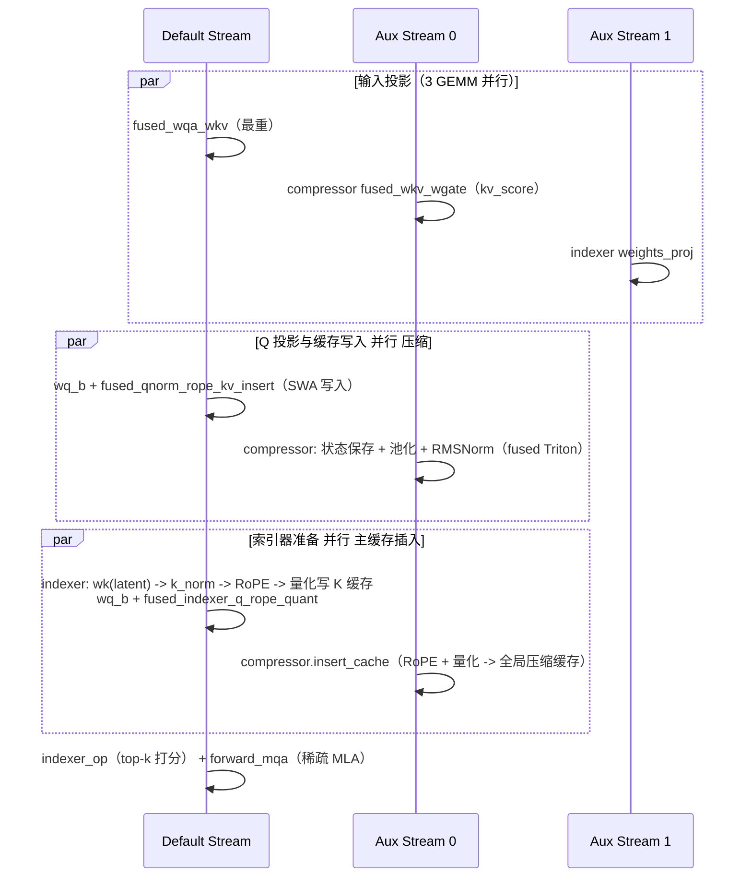
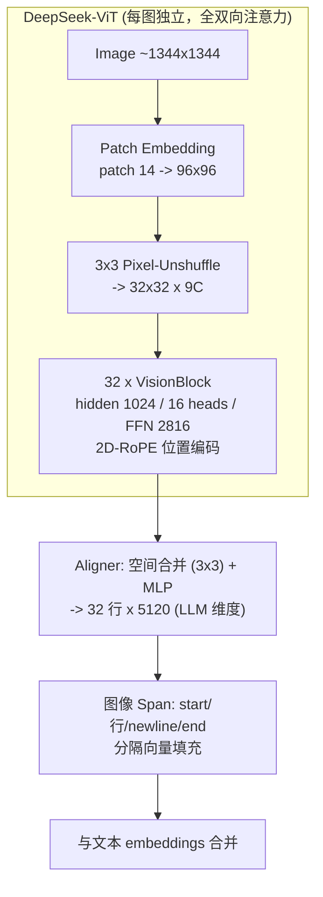
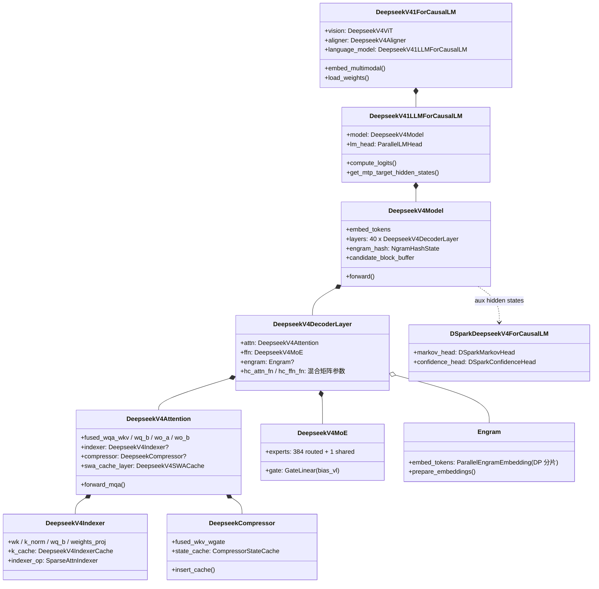

# vLLM DeepSeek-V4.1-Flash 模型技术教程
# ——重点对比 DeepSeek-V4-Pro 的设计与实现差异

> **文档版本**: 1.0
> **分析代码版本**: vLLM main 分支（截至 2026-09）
> **最后更新**: 2026-09-14
> **模型系列**: DeepSeek-V4（含 V4-Pro / V4-Flash / V4.1-Flash）
> **模型类型**: VLM-MoE（MoE + MLA + 稀疏注意力 + 原生视觉）
> **代码位置**: `vllm/models/deepseek_v4/`（V4 家族）与 `vllm/models/deepseek_v4_1/`（V4.1）

---

## 文档概述

2026 年 9 月 10 日，DeepSeek 发布了 **DeepSeek-V4.1-Flash**（MIT 许可），这是一个 552B 参数的 MoE 模型。它不是 V4 系列的"小改款"，而是 **全新一代架构家族的首个成员**：抛弃了自 V1 以来的 decoder-only 路线，改用 **Causal Encoder-Decoder（CED）** 非对称架构；用 **CSA2（Compressed Sparse Attention 2）** 取代 V4 的 CSA+HCA 混合注意力；引入了 **Engram** n-gram 条件记忆模块与 **DSpark** 投机解码；主 KV 缓存进一步压缩到 FP4，达到约 **890 字节/token**——官方称其为"探索 KV 缓存压缩极限"的技术报告。

本文档以 **vLLM 源码为第一视角**，结合官方技术报告，系统讲解 V4.1-Flash 的设计与实现，并在每个环节与 DeepSeek-V4-Pro（2026 年 4 月发布，arXiv 2606.19348）做逐项对比。

**目标读者**：对 vLLM 模型实现感兴趣、希望深入理解 DeepSeek-V4 系列架构演进的工程师与研究者。建议具备 MLA、MoE、稀疏注意力、KV Cache 的基础概念。

**推荐阅读顺序**：

1. **只想快速了解差异**：直接读 [1.2 同系列模型对比](#12-同系列模型对比) 与 [2.2 核心超参数对比](#22-核心超参数对比-v41-flash-vs-v4-pro)。
2. **想理解 CSA2 稀疏注意力**：读 [2.3 Attention 机制](#23-attention-机制-mla--csa2--csahca)（本文档篇幅最大的部分）。
3. **想看 vLLM 代码**：读 [第六部分](#第六部分-vllm-中的代码实现) 与 [附录 A](#a-关键代码位置索引)。
4. **想做二次开发**：重点读 5.3 关键计算流程代码分析与 5.4 权重加载与量化。

> **关键洞察**：V4.1-Flash 与 V4-Pro 共享大量基础设施（MLA、mHC、MoE、稀疏注意力框架），但 V4.1 在**注意力拓扑**上做了一次彻底的简化与重构——V4-Pro 的 CSA/HCA 双轨压缩（ratio 4/128 交替）被替换为 V4.1 的"**单一缓存 + 分层复用**"（ratio 0/1/2 + Full/Reindex/Reuse），并把 indexer K 的计算从"每层独立压缩"改为"从主 KV 条目直接投影"。在 vLLM 代码中，这一差异体现为 `deepseek_v4` 与 `deepseek_v4_1` 两个并存的模型目录。

---

# 第一部分: DeepSeek-V4 模型系列概述与演进

## 1.1 模型系列发展历史



**关键节点解读**：

- **DeepSeek-V3/V3.2（2024-12 / 2025-09）**：确立了 DeepSeekMoE + MLA 的基本盘。V3.2 是首个把稀疏注意力（Lightning Indexer + 4× 压缩）用于生产模型（DeepSeek-V3.2-Exp）的版本，vLLM 中的 `SparseAttnIndexer` 基础设施即源于此。
- **DeepSeek-V4（2026-04-24）**：里程碑式的 1M 上下文模型。技术报告 *DeepSeek-V4: Towards Highly Efficient Million-Token Context Intelligence*（arXiv 2606.19348）。V4-Pro 为 1.6T 参数（49B 激活），V4-Flash 为 284B（13B 激活）。架构上引入了 CSA（4× 压缩 + 稀疏 top-1024）与 HCA（128× 重度压缩 + 稠密注意力）交替的混合注意力、mHC 超连接、Muon 优化器、hash-routed MoE。
- **DeepSeek-V4.1-Flash（2026-09-10）**：**新架构家族的首个模型**，552B 主干（含视觉 763B），MIT 许可。核心变化：
  - **CED 非对称架构**：40 层 = 20 层因果编码器 + 20 层解码器；prefill 激活 ~8B 参数/token，decode 激活 ~16B；
  - **CSA2**：三模式（Full/Reindex/Reuse）静态层拓扑 + 分层索引器候选池；
  - **FP4 主 KV 缓存**：E2M1 格式，~890 字节/token；
  - **Engram**：~196B 参数的 n-gram 条件记忆（2/3/4-gram），注入两层残差流；
  - **DSpark**：3 个 Transformer 块一次前向预测 5 个 draft token 的投机解码；
  - **原生视觉**：DeepSeek-ViT + 3×3 Pixel-Unshuffle，首个非实验版的多模态 DeepSeek 模型。
  - 从 2026-09-14 起，`deepseek-v4-pro` API 流量被官方重路由至 V4.1-Flash（Flash 定价）。

## 1.2 同系列模型对比

| 模型名称 | 参数量 | 激活参数 | 发布日期 | 核心创新点 | 架构类型 | 上下文长度 | 技术报告 | HuggingFace |
|---------|--------|---------|---------|-----------|---------|-----------|---------|------------|
| DeepSeek-V3 | 671B | 37B | 2024-12 | MLA + 无辅助损失 MoE | MoE Decoder-only | 128K | [Paper](https://arxiv.org/abs/2412.19437) | [HF](https://huggingface.co/deepseek-ai/DeepSeek-V3) |
| DeepSeek-V3.2-Exp | 671B | 37B | 2025-09 | Lightning Indexer 稀疏注意力 | MoE + Sparse Attn | 128K | [Report](https://huggingface.co/deepseek-ai/DeepSeek-V3.2-Exp) | [HF](https://huggingface.co/deepseek-ai/DeepSeek-V3.2-Exp) |
| **DeepSeek-V4-Pro** | 1.6T | 49B | 2026-04 | CSA+HCA 混合稀疏注意力、mHC、Muon | MoE Decoder-only | 1M | [arXiv 2606.19348](https://arxiv.org/html/2606.19348) | [HF](https://huggingface.co/deepseek-ai/DeepSeek-V4-Pro) |
| DeepSeek-V4-Flash | 284B | 13B | 2026-04 | V4 架构的轻量版（43 层） | MoE Decoder-only | 1M | 同上 | [HF](https://huggingface.co/deepseek-ai/DeepSeek-V4-Flash) |
| **DeepSeek-V4.1-Flash** | 552B（+~196B Engram） | 8B prefill / 16B decode | 2026-09-10 | CED、CSA2、FP4 KV、Engram、DSpark、原生视觉 | **Causal Encoder-Decoder** MoE-VLM | 1M（输出 384K） | [Tech Report (HF)](https://huggingface.co/deepseek-ai/DeepSeek-V4.1-Flash/blob/main/DeepSeek_V41_Tech_Report.pdf) | [HF](https://huggingface.co/deepseek-ai/DeepSeek-V4.1-Flash) |

## 1.3 各模型能力对比

官方报告与独立评测（Vals AI 等）的关键基准（注意：部分为厂商自报值）：

| 能力维度 | V4-Flash-Max | V4-Pro-Max | V4.1-Flash | 说明 |
|---------|-------------|-----------|-----------|------|
| 通用知识 MMLU-Pro | 86.2 | 87.5 | — | V4.1 报告未单列此项 |
| GPQA Diamond | — | — | **90.9** | V4.1 自报 |
| 代码 LiveCodeBench | 91.6 | 93.5 | — | |
| SWE Verified | 79.0 | 80.6 | — | |
| DeepSWE v1.1 | — | 62.7 | **74.2** | V4.1 自报；Opus 5 为 74.0 |
| Terminal-Bench 2.1 | — | — | 90.6（自报）/ 74.53（Vals 独立） | 独立评测显著低于自报 |
| Codeforces rating | — | 3206 | **3471** | V4.1 自报 |
| Vals Index | — | — | **57.86**（56 款中第 15，开放权重第一） | 较 V4-Flash-0731 提升 4.3 分 |
| Automation-Bench | — | — | 54.8 | 复杂工作流约半数失败，仍需人工监督 |

> **关键洞察**：V4.1-Flash 以 V4-Pro 约 **1/3 的总参数量**在长程 agentic 任务（DeepSWE、Terminal-Bench 2.1）上实现**两位数百分点的反超**，但在更难的 Terminal-Bench 3.0/4.0 上仍落后于前沿闭源模型（Opus 5、GPT-6 Astra 等）。DeepSeek 官方定位是"**输入密集的 agent 负载**"——这正是 CED 非对称激活（轻 prefill、重 decode）所服务的场景：agent 工作流中提示词（工具结果、代码库、轨迹）远长于输出。

## 1.4 技术报告与论文汇总

| 文档 | 链接 | 内容简介 |
|------|------|---------|
| DeepSeek-V4 技术报告 | [arXiv 2606.19348](https://arxiv.org/html/2606.19348) | V4-Pro/V4-Flash：CSA+HCA、mHC、Muon、1M 上下文训练 |
| DeepSeek-V4.1-Flash 技术报告 | [HF PDF](https://huggingface.co/deepseek-ai/DeepSeek-V4.1-Flash/blob/main/DeepSeek_V41_Tech_Report.pdf) | CED、CSA2、FP4 KV、Engram、DSpark、45T token 训练 |
| DeepSeek API 公告 | [api-docs.deepseek.com](https://api-docs.deepseek.com/news/news260910/) | 发布公告与定价、流量迁移 |
| SemiAnalysis InferenceX | [deepseek-v4](https://inferencex.semianalysis.com/model/deepseek-v4) | V4-Pro 架构与推理性能第三方分析 |
| vLLM 官方支持 | [vllm models registry](https://github.com/vllm-project/vllm/tree/main/vllm/models/deepseek_v4_1) | 本文档分析的代码本体 |

---

# 第二部分: V4.1-Flash 模型架构详解

## 2.1 整体架构概览：Causal Encoder-Decoder（CED）

V4.1-Flash 是 DeepSeek 首次离开 decoder-only 路线：40 层 Transformer 被切分为**前 20 层因果编码器（causal encoder）**与**后 20 层解码器（decoder）**，受 YoCo 启发并做了结构改进。这一设计带来**非对称的激活参数**：



**CED 的核心机制**（技术报告 + 代码交叉验证）：

1. **解码器的全局 KV 不来自本层隐藏状态**：解码器各层的全局 KV 缓存，是**从编码器最后一层（第 20 层）的隐藏状态投影得到**的，而不是每个解码器层自己计算。在 vLLM 代码中，这体现为第 20 层是解码器唯一的 `kv_source` 层（见 2.3.3），它的 compressor 输出被所有后续解码器层复用。
2. **大多数 prompt token 不需要穿过全部 40 层**：由于解码器层的全局注意力全部走编码器投影出的共享缓存，prefill 时大部分 token 只需经过前 20 层（编码器），prefill 复杂度从 O(NL) 降到约 **O(NL/2)**。这正是官方推理栈中"prefill 只激活 8B、decode 激活全模型 16B"的来源——**输出生成被视为比输入理解更难的任务，计算量向 decode 倾斜**。
3. **vLLM 当前实现说明**：vLLM 的 `DeepseekV4Model.forward`（`deepseek_v4_1/nvidia/model.py`）目前仍是**标准 40 层统一前向**——每一层处理每一个 token。vLLM 已落地的收益是 CSA2 的 **KV 复用**（解码器层不再各自构建全局缓存）与稀疏注意力本身；"prefill 只跑编码器"的层跳过属于官方推理栈（报告所述）的系统级优化，尚未在 vLLM 中实现。

## 2.2 核心超参数对比（V4.1-Flash vs V4-Pro）

以下数据直接取自两个模型在 HuggingFace 上的官方 `config.json`：

| 参数 | DeepSeek-V4-Pro | DeepSeek-V4.1-Flash | 说明 |
|------|----------------|---------------------|------|
| `model_type` | `deepseek_v4` | `deepseek_v41` | 在 vLLM 中对应两个目录 |
| `hidden_size` | 7168 | 5120 | |
| `num_hidden_layers` | 61 | 40 | +1 MTP / +3 DSpark 层 |
| `num_attention_heads` | 128 | 64 | MQA：KV head 均为 1 |
| `head_dim` | 512 | 512 | 448 NoPE + 64 RoPE |
| `q_lora_rank` | 1536 | 1280 | MLA Q 低秩压缩维度 |
| `o_lora_rank` / `o_groups` | 1024 / 16 | 1024 / 8 | MLA 输出低秩维度/分组数 |
| `moe_intermediate_size` | 3072 | 2304 | 单个专家 FFN 中间维度 |
| `n_routed_experts` / `n_shared_experts` | 384 / 1 | 384 / 1 | 相同 |
| `num_experts_per_tok` | 6 | 6 | 相同（top-6） |
| `routed_scaling_factor` | 2.5 | 1.5 | 路由输出缩放 |
| `scoring_func` / `topk_method` | `sqrtsoftplus` / `noaux_tc` | 同左 | 相同 |
| `num_hash_layers` | 3 | 0 | V4-Pro 前 3 层为 hash-routed MoE，V4.1 取消 |
| `sliding_window` | 128 | 128 | SWA 窗口相同 |
| `compress_ratios` | 128/4 交替（CSA+HCA） | 0/2（编码器）、1（解码器） | **注意力拓扑完全不同** |
| `index_topk` / `index_n_heads` | 1024 / 64 | 512 / 32 | 索引器规模减半 |
| `kv_source_layer_ids` | 无（每层独立缓存） | [2, 8, 14, 20] | V4.1 独有 |
| `index_source_layer_ids` | 无 | [2, 8, 14, 20, 24, 28, 32, 36] | V4.1 独有 |
| `candidate_source_layer_id` / `candidate_topk_blocks` | 无 | 20 / 2048 | V4.1 分层索引器 |
| `hc_mult` / `hc_sinkhorn_iters` | 4 / 20 | 4 / 20 | mHC 相同 |
| `hc_head` | 有（可学习参数） | **无**（用最后层 ffn pre-mix 折叠） | 见 2.5 |
| `engram_layer_ids` | 无 | [1, 14] | V4.1 独有（~196B 参数） |
| `num_nextn_predict_layers` | 1 | 3（DSpark，`dspark_block_size=5`） | MTP vs DSpark |
| 主 KV 缓存格式 | FP8（V4-Flash 3514 B/token） | **FP4 E2M1（~890 B/token）** | 见 2.3.4 |
| 视觉 | 无（仅实验版） | 32 层 ViT，patch 14，3×3 unshuffle | V4.1 原生视觉 |
| `max_position_embeddings` | 1048576（1M） | 1048576（1M） | YaRN factor 16，自 64K 扩展 |

> **关键洞察**：两个模型共享 MLA（MQA，head_dim 512）、DeepSeekMoE（384+1 专家、top-6、noaux_tc）、mHC（4 流 + Sinkhorn）、SWA（窗口 128）这四大基座。真正的代际差异集中在三点：**(1) 层拓扑**（decoder-only 61 层 vs CED 40 层）、**(2) 注意力压缩策略**（CSA/HCA 双轨 vs CSA2 单缓存复用）、**(3) 记忆与投机组件**（V4.1 新增 Engram 与 DSpark）。这解释了为什么 vLLM 中 `deepseek_v4_1` 能大量复用 `deepseek_v4` 的代码（MoE、mHC kernel、SWA cache 等），差异集中在 attention 拓扑与新增模块。

## 2.3 Attention 机制：MLA + CSA2 vs CSA/HCA

### 2.3.1 共同的底座：MLA（Multi-head Latent Attention）

两代模型都沿用自 V3 的 MLA。核心思想是把 KV 压缩到极低维度，并将 Q 与输出也做低秩分解：

```mermaid
flowchart LR
    subgraph Proj["Latent Projections"]
        H[Hidden States<br/>[T, hidden]]
        QA["fused_wqa_wkv<br/>-> [T, q_lora_rank + head_dim]"]
        QB["wq_b<br/>q_lora -> n_heads x 512"]
    end
    subgraph Attn["Attention (MQA, head_dim 512)"]
        Q[Q: n_heads x 512<br/>448 NoPE + 64 RoPE]
        KV["KV: 1 head x 512<br/>kv_norm -> SWA cache / compressor"]
        S[Sparse Top-K Selection]
    end
    subgraph Out["Output Low-rank"]
        OA["wo_a: heads -> o_groups x o_lora_rank"]
        OB["wo_b: o_lora -> hidden"]
    end
    H --> QA --> QB --> Q
    QA --> KV
    Q & KV --> S --> OA --> OB
```

MLA 的关键点：

- **KV 只有 1 个头（MQA）**，head_dim 512（448 NoPE + 64 RoPE），经 `kv_norm`（RMSNorm）后直接写入 KV 缓存；
- **Q 低秩化**：`fused_wqa_wkv`（ReplicatedLinear）将 hidden 投影为 `[q_lora_rank, head_dim]` 两部分，`wq_b` 再把 q_lora 展开为 64 个 512 维的 Q 头；
- **输出低秩化**：`wo_a`（按 `o_groups` 分组做 BMM）+ `wo_b`，两代均如此；
- 均带 **attention sink**（`attn_sink` 参数，默认 -inf 关闭）与 GPT-J 风格的 partial RoPE。

vLLM 侧两代 MLA 的 KV 缓存布局一致：`fp8_ds_mla`（UE8M0 block-scaled FP8，packed uint8）为默认格式，每 token 行 = 448B NoPE + 128B RoPE + 8B scale = **584 字节**（ratio-1 状态），详见 `DeepseekV4Attention.get_kv_cache_spec`（`deepseek_v4_1/attention.py:930`）。

### 2.3.2 V4-Pro：CSA + HCA 双轨压缩

V4-Pro 的 61 层中，`compress_ratios` 呈现 **128 / 4 交替**模式（`[128, 128, 4, 128, 4, ..., 4, 0]`，最后一层与 MTP 层为 SWA-only）：

- **CSA 层（ratio 4，C4A）**：每 4 个连续 token 经 softmax 门控池化压缩为 1 个 KV 状态（4× 序列压缩），配备 Lightning Indexer：用 FP4 量化的 QK 打分，在压缩后的序列上选出 top-1024 个块，再在块内恢复原始 token 做精确 MLA；同时保留 128 窗口的 SWA 分支保证局部新鲜度。
- **HCA 层（ratio 128，C128A）**：128× 的激进压缩，压缩后的序列直接做**稠密**注意力（不再选 top-k），同样带 SWA 分支。
- 每层都有自己的 compressor 与压缩 KV 缓存，**indexer K 由该层自己的 compressor（对 hidden states 的独立压缩）产生**。

vLLM 实现要点（`vllm/models/deepseek_v4/attention.py`）：

```python
# vllm/models/deepseek_v4/attention.py
# NOTE(zyongye) Compress ratio can't be 0
# we do this for because MTP layer is not included
# in the compress ratio list
if layer_id < config.num_hidden_layers:
    self.compress_ratio = max(1, config.compress_ratios[layer_id])
else:
    self.compress_ratio = 1
...
self.indexer = None
if self.compress_ratio == 4:
    # Only C4A uses sparse attention and hence has indexer.
    self.indexer = DeepseekV4Indexer(...)   # indexer K: 独立的 hidden-states 压缩
...
if self.compress_ratio > 1:
    self.compressor = DeepseekCompressor(   # 支持 ratio 4 与 128
        compress_ratio=self.compress_ratio, ...)
```

### 2.3.3 V4.1-Flash：CSA2 单缓存 + 三层复用拓扑

CSA2 取代了 V4 的 CSA+HCA 混合，从**条目大小、序列、层**三个维度同时压缩。每层被静态指定为三种模式之一：

| 模式 | 定义 | 缓存 | 索引 | 对应代码配置 |
|------|------|------|------|------------|
| **Full** | 构建新的全局 KV 缓存，并计算自己的 Top-K 索引 | 新建 | 自算 | `layer_id ∈ kv_source_layer_ids ∩ index_source_layer_ids`（层 2/8/14/20） |
| **Reindex** | 复用已有全局 KV 缓存，但重新评分选出自己的 Top-K | 复用 | 重算 | `layer_id ∈ index_source_layer_ids \ kv_source_layer_ids`（层 24/28/32/36） |
| **Reuse** | 直接复用 KV 缓存与前序层的稀疏索引 | 复用 | 复用 | 其余 ratio>0 层 |
| （SWA） | 纯滑动窗口，无全局缓存 | — | — | `compress_ratio = 0`（层 0/1 与 DSpark 层） |

官方 config 中的拓扑定义：

```json
// deepseek-ai/DeepSeek-V4.1-Flash config.json（节选）
"compress_ratios": [0,0, 2,2,...,2,  1,1,...,1,  0,0,0],   // 2-19 为 2；20-39 为 1；后 3 个为 DSpark 层
"kv_source_layer_ids":       [2, 8, 14, 20],               // Full：全局 KV 的构建者
"index_source_layer_ids":    [2, 8, 14, 20, 24, 28, 32, 36], // Full + Reindex：索引器所在层
"candidate_source_layer_id": 20,                            // 分层索引器：候选池发布层
"candidate_topk_blocks":     2048,                          // 候选池大小（块）
"candidate_block_size":      8,                             // 每块 8 个压缩位置 -> 16K 候选
"index_topk":                512                             // 最终 Top-K
```

**CSA2 相比 V4 的关键简化**（报告原文）：

1. **去掉相邻压缩条目的重叠**（V4 的压缩条目之间有重叠窗口，V4.1 取消）；
2. **去掉压缩条目上的绝对位置嵌入**；
3. **indexer K 改为从主 KV 条目投影得到**——不再为索引器单独压缩 hidden states。

第 3 点在 vLLM 代码中体现得非常直接（`deepseek_v4_1/attention.py` 的 `DeepseekV4Indexer` docstring）：

```python
# vllm/models/deepseek_v4_1/attention.py
class DeepseekV4Indexer(nn.Module):
    """DeepSeek V4.1 sparse-attention indexer.

    Exists only on ``index_source_layer_ids``; consumers reuse the topk
    indices it publishes into the shared ``topk_indices_buffer``. Unlike v4.0
    the index key is derived from the kv-source layer's compressor latent
    (``k = k_norm(wk(latent))``, ``owns_k``) instead of an indexer-local
    compressor over hidden states, so there is no hidden-state K GEMM here.
    Non-owning index sources share the kv source's paged K cache.
    """
```

**分层索引器（hierarchical sparse indexer）**：层 20（Full 层）额外把 top-2048 个候选块（每块 8 个压缩位置 = 16,384 个候选）发布到共享的 `candidate_block_buffer`；后续的 Reindex 层（24/28/32/36）**只在候选池内评分**选出自己的 top-512。因此深层索引器的每查询成本**不随上下文长度增长**——这是从 4K 扩到 1M 上下文、单 token 解码 FLOPs 仅增加 ~25% 的关键。该机制在训练时就施加了相同的候选约束（training-aware）。

```python
# vllm/models/deepseek_v4/nvidia/model.py（v4.1 的 DeepseekV4Model.__init__）
# Two-level candidate filtering: the indexer at
# candidate_source_layer_id publishes the top candidate blocks of
# compressed positions here; later ratio-1 indexers (24/28/32/36)
# mask their scores with it.
candidate_source_layer = getattr(config, "candidate_source_layer_id", -1)
candidate_topk_blocks = getattr(config, "candidate_topk_blocks", 0)
if candidate_source_layer >= 0 and candidate_topk_blocks > 0:
    self.candidate_block_buffer = torch.empty(
        vllm_config.scheduler_config.max_num_batched_tokens,
        candidate_topk_blocks, dtype=torch.int32)
```

CSA2 的层拓扑图：



**vLLM 中拓扑解析的实现**（`deepseek_v4_1/attention.py:244`）：

```python
# vllm/models/deepseek_v4_1/attention.py
# ---- v4.1 sparse-attention topology ----
# compress_ratios has one entry per layer (MTP layers included):
# 0 = pure sliding window, 1 = full-length compressed cache,
# 2 = ratio-2 compressed. Compressors and compressed-KV caches live
# only on ``kv_source_layer_ids``; indexers only on
# ``index_source_layer_ids``. Consumers reuse the most recently
# published source below them.
compress_ratios = getattr(config, "compress_ratios", None)
if compress_ratios is not None and layer_id < len(compress_ratios):
    self.compress_ratio = int(compress_ratios[layer_id])
...
self.kv_source_layers = tuple(getattr(config, "kv_source_layer_ids", None) or ())
self.index_source_layers = tuple(getattr(config, "index_source_layer_ids", None) or ())
...
is_backbone = layer_id < config.num_hidden_layers
self.is_kv_source = is_backbone and layer_id in self.kv_source_layers
self.is_index_source = is_backbone and layer_id in self.index_source_layers
if self.compress_ratio > 0:
    self.kv_source_layer_id = max(s for s in self.kv_source_layers if s <= layer_id)
    self.index_source_layer_id = max(s for s in self.index_source_layers if s <= layer_id)
```

`DeepseekV4Compressor`（`deepseek_v4_1/compressor.py`）只支持 ratio 1/2，且明确注释 ratio-4/128 的 CuTe-DSL kernel 是 v4.0 专属：

```python
# vllm/models/deepseek_v4_1/compressor.py
class DeepseekCompressor(nn.Module):
    """DeepSeek V4.1 KV/score compressor.

    Pools ``compress_ratio`` consecutive tokens into one KV latent with a
    learned softmax gate (ratio 1 has no gate and no pooling). Owns the
    linear, norm and state cache. State saving, compression and RMSNorm share
    one Triton kernel. The emitted latent feeds independent main-cache and
    indexer K kernels, which the attention layer can schedule concurrently.
    """
    def __init__(self, vllm_config, compress_ratio, ...):
        if compress_ratio not in (1, 2):
            raise NotImplementedError(
                "DeepSeek V4.1 compressor supports compress_ratio 1 (full-length "
                f"compressed cache) and 2; got {compress_ratio}. The ratio-4/128 "
                "CuTe-DSL kernels are v4.0-specific and not wired here.")
```

> **性能提示**：ratio-2 压缩在 decode 场景需要跨 step 的状态暂存——`CompressorStateCache`（`compressor.py:132`）为每个请求维护一个"未闭合分组"的 `[kv, score]` 环形缓存（`state_dim = 2 * head_dim`，float32），由 Triton kernel `fused_save_compress_norm` 保存状态、执行池化与归一化。这解释了为什么 vLLM 为 compressor 单独实现了 `CompressorBackend` / `CircularBufferSpec`——它不是普通的分页 KV 缓存，而是每请求的临时环形缓冲区。

### 2.3.4 KV 缓存量化对比：FP4 E2M1 vs FP8

| 维度 | V4 系列（Pro/Flash） | V4.1-Flash |
|------|---------------------|-----------|
| 主（全局）KV 格式 | FP8 | **FP4（E2M1）**，每 16 通道一个 E4M3 分组 scale |
| 量化方式 | 训练后/推理时量化 | **QAT（quantization-aware training）**，量化直接作用于缓存 |
| SWA KV 格式 | FP8 | FP8（对量化更敏感，保持 FP8） |
| 全局 KV 每 token | V4-Flash 约 3514 B | 约 **890 B**（约 1/4） |
| HBM 需求 | 1× | 上一代的 **1/4** |
| SSD 存储 | 1× | 上一代的 **1/8** |
| vs DeepSeek-V1 | — | 缩小约 **437 倍** |
| 持久化缓存 | 分层 KV 缓存 + 磁盘 offload | SSD 持久化全局缓存（小时~天级）+ 分布式 host-DRAM SWA 池（分钟级 TTL）+ SWA Bounded Replay |

**vLLM 中的实现现状**：vLLM 当前为两代模型提供的主缓存 dtype 为 `fp8_ds_mla`（UE8M0 block-scaled FP8）或 bf16/plain FP8（`_resolve_dsv4_kv_cache_dtype`，`deepseek_v4_1/attention.py:112`），压缩状态行 584 字节（ratio-1）。**indexer K 缓存**则支持 MXFP4（`dsa_indexer_uses_fp4`，每 32 值一个 UE8M0 scale，128 维 K = 68 字节/状态）或 FP8。官方报告的 890 B/token 是原生 FP4 E2M1 全局缓存系统的指标；vLLM 侧的 FP4 主缓存支持仍在演进中，运行时以 `--kv-cache-dtype` 与后端选择为准。

### 2.3.5 SWA 分支与注意力执行

两代模型的稀疏注意力均带 128 窗口的 SWA 分支（`DeepseekV4SWACache`，`vllm/v1/attention/backends/mla/sparse_swa.py`），保证局部信息的新鲜度。V4.1 的部署创新是 **SWA Bounded Replay**：prefill 时若命中持久化的全局缓存，SWA 状态不需要从磁盘读取，而是**只回放最近一个窗口的 token 近似重建**——因此 SWA 缓存可以完全放在分布式 host-DRAM（分钟级 TTL），不必进 SSD。

在 vLLM 中，SWA 与全局稀疏注意力的 metadata 由 `DeepseekV41SparseSWAMetadataBuilder`（`deepseek_v4_1/sparse_mla.py:53`）统一构建，它按 v4.1 的 ratio 语义（0/1/2）重新分类层类型：

```python
# vllm/models/deepseek_v4_1/sparse_mla.py
# v4.1 per-layer compress ratios: 0 = pure sliding window, 1 = full-length
# compressed cache, 2 = ratio-2 compressed cache. Ratio-1 and ratio-2 layers
# both attend over indexer topk indices into a shared compressed cache but
# differ in compressed page block size (block_size // ratio), so each needs its
# own FlashMLA tile-scheduler plan.
_V41_LAYER_TYPES: dict[int, str] = {
    0: _LAYER_TYPE_SWAONLY,
    1: _LAYER_TYPE_C1A,
    2: _LAYER_TYPE_C2A,
}
```

## 2.4 FFN / MoE 机制详解

两代模型共用 DeepSeekMoE 框架（384 路由专家 + 1 共享专家，top-6，`scoring_func=sqrtsoftplus`，`topk_method=noaux_tc` 无辅助损失、偏差校正路由，`norm_topk_prob` 归一化）：

$$\text{MoE}(x) = \text{Shared}(x) + s \cdot \sum_{i \in \text{TopK}(\text{gate}(x))} w_i \cdot E_i(x)$$

其中 $s$ 为 `routed_scaling_factor`（V4-Pro 为 2.5，V4.1 为 1.5），$w_i$ 为归一化后的路由权重。

**关键差异**：

1. **V4-Pro 前 3 层为 hash-routed MoE**（`num_hash_layers=3`）：不学习 gate，直接用 token id 查表 `tid2eid [vocab, topk]` 路由到专家（节省最早几层的 gate 计算与通信）；V4.1 **完全取消**了 hash 路由（`num_hash_layers=0`），全部 40 层都用可学习 gate。
2. **视觉路由偏置**：V4.1 的 MoE gate 带 `bias_vl`——图像 span 内的 token（`input_ids == image_token_id`）路由时加视觉偏置。这正是 `DeepseekV41ForCausalLM.requires_raw_input_tokens = True` 的原因：即使 embedding 已经被视觉 token 替换，MoE 路由仍需要原始 token id 来识别图像 token。
3. **量化**：两代专家权重均为 FP4（`expert_dtype=fp4`，MXFP4，UE8M0 scale）；线性层 V4-Pro 用 128×128 block FP8，V4.1 用 32×32 block 的 MXFP8。DSpark 的草稿模型专家更小（128 专家、top-3）。

vLLM 中 V4.1 直接**继承 V4 的 MoE 类**：

```python
# vllm/models/deepseek_v4_1/nvidia/model.py
class DeepseekV4MoE(DeepseekV4MoEBase):
    def __init__(self, vllm_config, prefix="", use_sequence_parallel=False):
        config = vllm_config.model_config.hf_config
        n_routed_experts = config.n_routed_experts
        n_activated_experts = config.num_experts_per_tok
        if extract_layer_index(prefix) >= config.num_hidden_layers:
            # DSpark 草稿层使用更小的 MoE 配置
            n_routed_experts = getattr(config, "dspark_n_routed_experts", 0) or n_routed_experts
            n_activated_experts = getattr(config, "dspark_num_experts_per_tok", 0) or n_activated_experts
        super().__init__(
            vllm_config, prefix=prefix, use_sequence_parallel=use_sequence_parallel,
            n_routed_experts=n_routed_experts,
            n_activated_experts=n_activated_experts,
            num_hash_layers=0,                        # V4.1 无 hash 路由
            image_sentinel_lo=IMAGE_SENTINEL_BASE_ID, # 视觉 token 路由偏置
        )
```

## 2.5 mHC 超连接与 hc_head 差异

两代模型都用 **Manifold-Constrained Hyper-Connections（mHC）** 取代普通残差连接：hidden states 被扩展为 `hc_mult=4` 份流（`[T, 4, hidden]`），混合矩阵被投影到 Birkhoff 多面体（双随机矩阵，经 20 次 Sinkhorn-Knopp 迭代）保证谱范数 ≤ 1，从而让超深网络稳定训练。vLLM 中用 TileLang/Triton kernel 实现（`mhc_pre_delayed_tilelang` / `mhc_post_tilelang`，`vllm/model_executor/kernels/mhc/`）。

V4.1 的改进是 **Single-Pass mHC**：将输入混合系数偏移一个块，消除数据依赖，配合融合的 Mega-mHC kernel 将激活内存流量减半。

**两代的收尾差异**：V4-Pro 在最后一层后用**可学习的 `hc_head`** 折叠 4 条流：

```python
# vllm/models/deepseek_v4/nvidia/model.py（V4-Pro）
self.hc_head_fn = nn.Parameter(...)   # 可学习折叠矩阵
self.hc_head_base = nn.Parameter(...)
self.hc_head_scale = nn.Parameter(...)
...
hidden_states = hc_head_fused_kernel_tilelang(
    hidden_states, self.hc_head_fn, self.hc_head_scale, self.hc_head_base, ...)
```

V4.1 **没有** `hc_head`，直接用最后一层 FFN 的 pre-mix 折叠流（`hc_collapse_triton`）：

```python
# vllm/models/deepseek_v4_1/nvidia/model.py（DeepseekV4Model.forward 尾部）
# Collapse the hc copies with the pre-mix from the last layer's FFN
# mixes — the mix the reference applies via
# ``last_layer.hc_pre(h, pre_mix)`` (v4.1 has no learned hc_head).
assert pre_mix is not None
hidden_states = hc_collapse_triton(hidden_states, pre_mix)
hidden_states = self.norm(hidden_states)
```

> **注意**：mHC 多流形态会贯穿整个前向（包括 PP 的 intermediate tensors——跨 rank 传输 `[T, 4, hidden]` 而非 `[T, hidden]`），直到最后才折叠。MTP/DSpark 草稿模型拿到的也是**折叠前**的完整 hc 流（`_mtp_hidden_buffer` 保存 `hc_mult * hidden_size` 的 flatten 张量）。

## 2.6 Engram：n-gram 条件记忆（V4.1 独有）

Engram 是 V4.1 最具争议也最独特的组件：一个 **n-gram（2/3/4-gram）哈希查找表**，把"记忆"从 Transformer 计算中分离出来。两张表分别挂在**第 1 层与第 14 层**的输入处，直接注入 mHC 残差流：

| 配置项 | 值 | 说明 |
|--------|-----|------|
| `engram_layer_ids` | [1, 14] | 注入层 |
| `engram_num_embeddings` | [384,006,168; 384,016,682] | 每表 ~3.84 亿行 |
| `engram_head_dim` / `engram_n_heads` | 256 / 8 | 每行 8 个 256 维 head |
| `engram_max_ngram_size` | 4 | 2/3/4-gram 混合哈希 |
| `engram_vocab_size` | 16,000,000 | 哈希桶数 |
| `engram_compressed_vocab_size` | 99,092 | 归一化后的 token 空间 |
| 存储精度 | FP8（带 scale） | ~196B 参数（FP8） |

**为什么能放得下 196B 参数？** 哈希表的**确定性寻址**（prime-multiplier 哈希）让 embedding 的读取地址可以在计算前预知，从而支持从 host 内存 **RDMA 预取**——不需要常驻 GPU 显存。vLLM 的实现（`deepseek_v4_1/nvidia/engram.py`）支持三种存储策略：

1. **DP 分片 + mmap 共享内存**（`DPSharedEngramStorage`，`/dev/shm` 文件映射）：哈希表的 head 维度按 DP rank 分片，节点内进程共享同一份物理内存；
2. **CPU offload + 异步预取流**：`prepare_embeddings` 在独立 CUDA stream 上提前查表（`_start_prefetch` / `_finish_prefetch`，配合 `eager_break_during_capture` 把查表放在 CUDA Graph 的 eager 边界）；
3. **常规 GPU 常驻**。

**前向数据流**：



关键实现细节（`deepseek_v4_1/common/engram.py` 模块 docstring + `nvidia/model.py` 注入点）：

- **压缩词表**：所有 token 先经 NFKC/NFD/去重音/小写/空白归一化映射到 99,092 个压缩 id（"The"/"the"/"THE" 哈希到同一行），再对 2/3/4-gram 做 prime-multiplier 哈希；
- **跨 chunk 状态**：vLLM 按 chunk 流式处理 token，而位置 p 的 n-gram 需要 p-1..p-3 的 id。`NgramHashState` 在**第一个本地层的 SWA cache 的每个 KV slot** 上维护一个 int32 哈希槽（slot 与 (request, position) 稳定对应，prefix-cache 命中、spec-decode 回滚都能正确重写）；对 chunk 起始（如 P/D 分离、offload 加载的 KV）则依赖 runner 传入的 `lookback_token_ids`；
- 注入发生在 `DeepseekV4DecoderLayer.forward` 中上一子层 post 与本块 pre 之间，作用于完整 hc 流：

```python
# vllm/models/deepseek_v4_1/nvidia/model.py（DeepseekV4DecoderLayer.forward）
residual = mhc_post_tilelang(x, residual, post_mix, res_mix)
if self.engram is not None and engram_hashes is not None:
    # Engram injection happens between the previous sublayer's
    # post and this block's pre, on the full hc stream, so the
    # mix coefficients see the injected stream.
    residual = self.engram(
        residual, engram_hashes[:, self.engram.layer_hash_index], engram_mask)
```

## 2.7 DSpark 投机解码 vs V4 的 MTP

| 维度 | V4-Pro（MTP） | V4.1-Flash（DSpark） |
|------|--------------|---------------------|
| 草稿层数 | 1（`num_nextn_predict_layers=1`） | 3（`dspark_target_layer_ids=[37,38,39]`） |
| 一次前向草稿数 | 1 | **5**（`dspark_block_size=5`） |
| 依赖建模 | 无 | **Markov head**（`dspark_markov_rank=256`）：用已草拟 token 的 Markov 嵌入对后续 draft 位置加 bias |
| 接受率预测 | 无 | **Confidence head**（sigmoid）：预测每个 draft 被接受的概率，用于动态选择验证长度 |
| 草稿 MoE | 与主模型同配置 | 更小：128 专家 / top-3 |
| 目标隐藏状态 | 主模型 pre-hc_head 残差流 | 主模型**折叠前完整 hc 流**（`_mtp_hidden_buffer`） |
| 噪音 token | 无 | `dspark_noise_token_id=128799` |
| 训练方式 | 与主模型联训 | **独立训练**（冻结主模型），验证长度动态选择 |

vLLM 实现（`deepseek_v4_1/nvidia/dspark.py`）：草稿模型复用主模型的 embedding、hc_mult=4 流、mhc kernel 与 MoE 框架；`DSparkMarkovHead` 提供 `markov_embed(token_ids)` 与 `markov_bias(markov_embed)` 两个接口（`SupportsEagle3` 协议），confidence head 输入为 `[head_hidden + markov_embed]` 输出 sigmoid 接受概率。草稿层还需要把"上下文 KV"插入 SWA 缓存（`_insert_context_kv`，用 dummy Q 复用主 attention 的融合插入算子）。

## 2.8 视觉编码器（DeepSeek-ViT）

V4.1-Flash 是 DeepSeek 首个非实验版的原生多模态模型（V4 只有实验版 V4-Flash-Vision-Exp）。视觉部分（`vision_config`）：

| 配置项 | 值 |
|--------|-----|
| `num_hidden_layers` | 32 |
| `hidden_size` | 1024 |
| `num_attention_heads` | 16 |
| `intermediate_size` | 2816 |
| `patch_size` | 14 |
| `downsample_ratio` | 3（3×3 Pixel-Unshuffle，视觉 token 降到 1/9） |
| `max_image_tokens` | 1024（约 1344×1344 输入） |
| 位置编码 | **2D-RoPE**（每图全双向注意力） |

vLLM 实现（`deepseek_v4/common/vision.py`，两代共用）：

```python
# vllm/models/deepseek_v4/common/vision.py
class DeepseekV4ViT(nn.Module):
    """DeepSeek-V4 ViT: full bidirectional attention per image, 2D RoPE."""

class DeepseekV4Aligner(nn.Module):
    """Spatial merge (downsample_ratio x downsample_ratio) + MLP projector."""
```

视觉-语言融合策略：图像 span 由 aligner 输出的行向量 + 三个可学习分隔向量组成——`image_start` / `image_newline` / `image_end`（每行之间插 newline，首尾插 start/end）。合并后的 embeddings 通过 `inputs_embeds` 在 mHC 流展开**之前**进入语言模型；原始 `input_ids` 仍然保留（所有图像位置携带 `image_token_id=129264`），供 MoE 路由施加 `bias_vl`。ViT 支持 DP 分片（`run_dp_sharded_vision_tower`，按图分片 + all-gather）。

---

# 第三部分: 输入预处理流程

## 3.1 文本预处理



V4.1 的后训练采用 SFT → RL → on-policy distillation（OPD）流程，推理强度在 1–100 连续可调（通过推理 effort token 控制）。词表与 V4 一致（129,280，含 4 个图像占位与 1 个噪音 token `128799`）。

## 3.2 多模态图像处理



代码路径（`deepseek_v4_1/nvidia/vl_model.py`）：

```python
# vllm/models/deepseek_v4_1/nvidia/vl_model.py
def _build_image_span(self, image_embeds, types):
    """Full image span: aligner rows at IMAGE slots, the learned
    delimiter vectors at IMAGE_START/IMAGE_NEW_LINE/IMAGE_END."""
    span[types == IMAGE_START] = self.image_start.to(dtype)
    span[types == IMAGE_END] = self.image_end.to(dtype)
    span[types == IMAGE_NEW_LINE] = self.image_newline.to(dtype)
    span[types == IMAGE] = image_embeds
    return span
```

每个图像的 span 长度为 `n_llm_h * (n_llm_w + 1) + 2`（每行末尾换行符 + 首尾分隔符）。`types` 张量由 `DeepseekV4VLMultiModalProcessor`（`common/mm_preprocess.py`）生成，逐位置标记角色。

## 3.3 Tokenizer 配置

| 配置项 | 值 | 说明 |
|--------|-----|------|
| Vocab Size | 129,280 | 与 V4 相同 |
| BOS / EOS / PAD | 0 / 1 / 2 | |
| `image_token_id` | 129,264 | 图像 span 所有位置的 input_id |
| `dspark_noise_token_id` | 128,799 | DSpark 草稿噪音 token |
| 图像哨兵区间 | `IMAGE_SENTINEL_BASE_ID` 起 5 个连续 id | MoE gate 的视觉路由偏置识别 |
| Chat Template | DeepSeek 对话模板（含 reasoning effort 控制） | 1–100 连续推理强度 |
| 归一化 | NFKC/NFD/小写/空白折叠（Engram 压缩词表） | 99,092 个压缩 id |

---

# 第四部分: 模型前向传播流程

## 4.1 整体 Forward 流程

```mermaid
flowchart TB
    E[Embedding<br/>[T, 5120]] --> HC["mHC 流扩展<br/>[T, 4, 5120]（首层 broadcast + identity pre-mix）"]
    HC --> L0["Layers 0-1: SWA-only"]
    L0 --> L1["Layers 2-19: ratio-2 压缩<br/>Engram@1/14 注入"]
    L1 --> L2["Layers 20-39: ratio-1 复用层 20 缓存<br/>分层索引器 24/28/32/36"]
    L2 --> COL["hc_collapse_triton + final RMSNorm<br/>[T, 5120]"]
    COL --> HEAD["ParallelLMHead -> logits"]
    L2 -.->|"aux hidden states<br/>(layers 37-39 区间)"| DS["DSpark: 3 层 x 5 drafts<br/>Markov + confidence heads"]
    DS -.->|"draft logits + 接受概率"| HEAD
```

`DeepseekV4Model.forward` 中还有两个值得注意的环节：

1. **Engram 哈希前置计算**：在进入层循环之前，为整个（flatten）batch 一次性计算 n-gram 哈希并 `prepare_embeddings` 预取，所有 Engram 层共享一次 gather（`deepseek_v4_1/nvidia/model.py:562-617`）；profile run（KV 缓存未绑定）时跳过。
2. **PP 中间张量**：跨 pipeline rank 传输 `[T, 4, hidden]` 的 hidden_states 与 float32 的 `pre_mix`（`make_empty_intermediate_tensors`）。

## 4.2 单层 Transformer 计算流程（mHC 两子层）

V4.1 每层 = mHC pre → Attention → mHC post → mHC pre → MoE，状态在 4 条流之间混合：

```python
# vllm/models/deepseek_v4_1/nvidia/model.py（DeepseekV4DecoderLayer.forward 核心）
# --- Attention 子层 ---
post_mix, res_mix, x, attn_pre = mhc_pre_delayed_tilelang(
    residual, self.hc_attn_fn, self.hc_attn_scale, self.hc_attn_base,
    ..., pre_mix=pre_mix, norm_weight=self.attn_norm.weight, ...)
x = self.attn(positions, x, None)                     # sparse MLA
residual = mhc_post_tilelang(x, residual, post_mix, res_mix)
# --- FFN 子层 ---
post_mix, res_mix, x, ffn_pre = mhc_pre_delayed_tilelang(
    residual, self.hc_ffn_fn, ..., pre_mix=attn_pre,
    norm_weight=self.ffn_norm.weight, ...)
x = self.ffn(x, input_ids)                            # DeepSeekMoE (384+1, top-6)
```

**形状追踪**（单 token，TP=1）：输入 `[T, 4, 5120]` → pre 折叠后 `[T, 5120]` → attention（Q `[T, 64, 512]`；KV `[T, 512]` 经 kv_norm 写 SWA cache，kv 源层额外经 compressor 写全局缓存与 indexer K）→ post 恢复 `[T, 4, 5120]` → FFN（每 token 走 1 共享 + top-6 of 384 专家）。

## 4.3 稀疏注意力的执行时序（多流重叠）

`DeepseekV4Attention._prepare_and_attn`（`deepseek_v4_1/attention.py:652`）是延迟敏感的 decode 路径核心，利用 3 条 aux CUDA stream 重叠计算：



> **性能提示**：这套重叠只在小 token 数（`<= VLLM_MULTI_STREAM_GEMM_TOKEN_THRESHOLD`）时启用（`_run_parallel_input_projections`）；V4.1 相比 V4 **少了一条 GEMM 链**——indexer K 不再对 hidden states 做独立压缩投影，而是复用 kv-source compressor 的 latent（`k = k_norm(wk(latent))`），节省的不仅是算力，还有一次跨流同步。

## 4.4 vLLM 特有优化

| 优化 | 机制 | 适用 |
|------|------|------|
| Paged KV Cache | 压缩缓存按 `MLAAttentionSpec` 分页（fp8_ds_mla 需 576B 对齐） | 主缓存 + indexer K + SWA |
| Chunked Prefill / Prefix Caching | 压缩缓存与 SWA 缓存均支持前缀复用（Engram 哈希槽随 slot 稳定） | 长上下文 agent 场景 |
| CUDA Graph | `UNIFORM_BATCH` / `ALWAYS` 支持；indexer/MLA 在 eager break 中执行；DSpark 预取与查表跨 piecewise 段 | decode 加速 |
| Sequence Parallel | `sp_shard / sp_all_gather / sp_reduce_scatter`，与 EP/MegaMoE 组合 | TP>1 |
| MegaMoE / FlashInfer MoE | FP4 专家、EP 通信重叠；`make_deepseek_v4_expert_params_mapping` 统一权重映射 | MoE 后端 |
| Multi-stream GEMM | 3 条 aux stream 重叠投影/压缩/索引 | decode 延迟 |
| Engram 异步预取 | 独立 stream 查表 + mmap /dev/shm 共享 + CPU offload | 196B 参数不出显存 |
| DSpark | Eagle3 协议：草稿 5 位/步，confidence 动态验证长度 | 投机解码 |

---

# 第五部分: 视觉编码器（ViT）计算流程

## 5.1 ViT 架构概览



## 5.2 Patch Embedding 与 Pixel-Unshuffle

与传统 ViT 的"patch 14 + 线性投影"不同，V4.1 在 patch 嵌入后立即做 **3×3 Pixel-Unshuffle**（`downsample_ratio=3`），把 96×96 的 patch 网格折叠为 32×32×9C 的张量——视觉 token 数降到 **1/9**（96²/9 = 1024 = `max_image_tokens`）。`DeepseekV4Aligner` 再对 3×3 邻域做空间合并 + MLP，输出 LLM 维度（5120）的行向量。这种"先打 patch 再 unshuffle"的设计把降采样放在注意力之前，使 ViT 的注意力计算量也降为 1/9 网格。

## 5.3 ViT 编码器计算流程

- **全双向注意力**：每张图独立做双向 attention（非因果 mask），QK 用 **2D-RoPE**（`get_vision_cos_sin(n_vit_h, n_vit_w, rope_dim, rope_theta)` 按行/列坐标生成 cos/sin）；
- **MLP**：SiLU + 2816 中间维度的标准 FFN；
- **并行策略**：ViT 权重全量复制到每个 rank，图按 DP 分片处理（`run_dp_sharded_vision_tower`：TP>1 时按图切分、all-gather 每图 embedding），`supports_encoder_tp_data = True`。

## 5.4 视觉-语言融合策略

融合发生在**文本 embedding 之后、mHC 流展开之前**：`DeepseekV41ForCausalLM.embed_input_ids` 调用 `_merge_multimodal_embeddings` 把图像 span 覆盖到对应位置。注意 `input_ids` 原样保留并传入模型——两条信息流并行存在：embeddings 走视觉塔，token ids 走 MoE 路由（`bias_vl` 偏置）与 Engram 哈希（图像 token 被 mask 为 DEAD，防止破坏 n-gram）。

---

# 第六部分: vLLM 中的代码实现

## 6.1 模型注册与硬件隔离入口

vLLM 中 V4.1 的入口 `vllm/models/deepseek_v4_1/__init__.py` 按平台选择实现（nvidia 为默认分支，ROCm/XPU 各自覆盖）：

```python
# vllm/models/deepseek_v4_1/__init__.py
"""DeepSeek V4.1 hardware-isolated model entry point."""

from vllm.platforms import current_platform
from .quant_config import DeepseekV4FP8Config

if current_platform.is_rocm():
    from .amd.dspark import DSparkDeepseekV4ForCausalLM
    from .amd.vl_model import DeepseekV41ForCausalLM
else:
    from .nvidia.dspark import DSparkDeepseekV4ForCausalLM
    from .nvidia.vl_model import DeepseekV41ForCausalLM

__all__ = [
    "DSparkDeepseekV4ForCausalLM",
    "DeepseekV4FP8Config",
    "DeepseekV41ForCausalLM",
]
```

`DeepseekV41ForCausalLM` 是**多模态包装类**（`deepseek_v4_1/nvidia/vl_model.py`），持有一个 `DeepseekV41LLMForCausalLM` 文本模型 + ViT + aligner；即使纯文本使用，V4.1 checkpoint 也声明 VL 架构（权重映射中直接丢弃 `vision./aligner./image_` 权重）。

## 6.2 核心模型类层次



## 6.3 关键计算流程代码分析

**（1）注意力层构造**（`deepseek_v4_1/attention.py:__init__`）：每个 layer 依据 config 拓扑决定是否构建 compressor（仅 kv 源层）、indexer（仅 index 源层）与各自的缓存。非 kv 源层的 `_compressed_kv_cache()` 通过 `static_forward_context` 直接引用其下方最近 kv 源层的缓存张量——**这是 CSA2 "层间共享缓存"的代码落地**：

```python
# vllm/models/deepseek_v4_1/attention.py
def _compressed_kv_cache(self) -> torch.Tensor:
    """The compressed-KV cache tensor of this layer's kv source (own
    cache for kv-source layers)."""
    if self.is_kv_source:
        return self.kv_cache
    assert self.compressed_cache_prefix is not None
    source = self._static_forward_context[self.compressed_cache_prefix]
    return source.kv_cache
```

**（2）compressor 前向**（`deepseek_v4_1/compressor.py:246`）：`forward` 保存状态并输出 bf16 latent（ratio-2 时在组边界 token 处才产生有效行），`insert_cache` 随后将 latent 经 RoPE + 量化写入分页缓存。两者被 attention 层调度在不同 stream 上重叠执行。

**（3）indexer 前向**（`deepseek_v4_1/attention.py:1158`）：`_produce_k` 只在**组边界 token**（ratio 对齐位置）产生 K——`wk(latent)` → `k_norm` → RoPE → MXFP4/FP8 量化写入 K 缓存；Q 侧 `fused_indexer_q_rope_quant` 融合 RoPE 与量化；短上下文（候选数 ≤ topk）时走 `_fill_short_context_topk_indices` Triton 快速路径，直接全选候选。

**（4）短上下文快速路径**（`deepseek_v4_1/attention.py:1170`）：

```python
# vllm/models/deepseek_v4_1/attention.py（DeepseekV4Indexer.forward）
if (indexer_metadata.max_seq_len // self.compress_ratio <= self.topk_tokens
        and not torch.cuda.is_current_stream_capturing()):
    # candidates num smaller than topk, every candidate is selected
    # but we still need to build k cache
    ...
    _fill_short_context_topk_indices[(num_tokens,)](
        self.topk_indices_buffer, positions, ...)
    return None, None, None
```

**（5）Engram 查表与预取**（`deepseek_v4_1/nvidia/engram.py`）：

```python
# vllm/models/deepseek_v4_1/nvidia/engram.py
class Engram(BaseEngram):
    """NVIDIA Engram with asynchronous offload and node-local DP lookup."""
    def prepare_embeddings(self, hash_ids: torch.Tensor) -> None:
        """Prefetch local shared rows or the DP group's gathered hash IDs."""
        if self._prefetch_stream is None:
            return super().prepare_embeddings(hash_ids)
        rows = self.staged_rows[: hash_ids.shape[0]]
        self._start_prefetch(hash_ids, rows, self._prefetch_stream)

    @eager_break_during_capture
    def _start_prefetch(self, hash_ids, rows, stream):
        # Eager boundaries let the lookup span piecewise graph segments.
        stream.wait_stream(torch.cuda.current_stream())
        hash_ids.record_stream(stream)
        with torch.cuda.stream(stream):
            self.embed_tokens.lookup(hash_ids, rows, background=True)
```

**（6）DSpark 草稿前向**（`deepseek_v4_1/nvidia/dspark.py:188`）：草稿模型复用 hc 流（`inputs_embeds.unsqueeze(-2).repeat(1, self.hc_mult, 1)`），3 个草稿层跑完 5 个位置后经 Markov head 建模位置间依赖、confidence head 输出接受概率。

## 6.4 权重加载与量化

V4.1 的量化体系（`deepseek_v4_1/quant_config.py`）：

- **量化方法名** `deepseek_v4_fp8`（`QuantizationMethods`），继承 `Fp8Config`；
- **专家权重**：`expert_dtype=fp4` → MXFP4（`Mxfp4MoEMethod`，scale 名为 `w{1,2,3}_weight_scale` 无 `_inv` 后缀）；`fp8` → block-FP8（`w{13,2}_weight_scale_inv`）；
- **线性层**：32×32 block MXFP8（UE8M0 scale）走 `ModelOptLinearMethod`（`weight_scale`），普通 block-FP8 走 `weight_scale_inv`——`_linear_scale_param_name` 按 `[32,32] + fp4` 判定；
- **E8M0 字节序陷阱**：checkpoint 中 E8M0 scale 存为 `float8_e8m0fnu` 而 MoE 参数为 uint8，直接 `copy_()` 会做数值转换（如 2⁻⁷ → 0）破坏原始指数字节，加载器需先 `view(torch.uint8)`；
- **权重映射**：`_make_deepseek_v4_weights_mapper` 处理 checkpoint → vLLM 命名（`layers.` → `model.layers.`、`embed.weight` → `embed_tokens.weight`、`.ffn.gate.bias` → `.ffn.gate.e_score_correction_bias` 等），并丢弃 `vision./aligner./image_` 与 `mtp.` 权重（VL 包装类中 DSpark 头不加载）；
- **Engram FP8 表**：`engram.embed.scale` 显式路由到 `engram.embed_tokens.weight_scale_inv`。

## 6.5 平台后端

| 平台 | 目录 | 特点 |
|------|------|------|
| NVIDIA | `nvidia/` | FlashMLA / FlashInfer（SM120）稀疏 MLA 后端、MegaMoE/FI-MoE、CuTe-DSL 算子（o_proj、indexer Q、dequant-gather） |
| AMD (ROCm) | `amd/` | aiter 后端（`ROCM_FLASHMLA_SPARSE_DSV4`）、ROCM 专属 Q 量化路径 |
| CPU | `cpu/`（仅 deepseek_v4） | CPU 版 compressor / MLA / sparse 算子 |
| XPU | `xpu/` | XPU 稀疏算子 + VL stub（V4.1 视觉暂不支持） |

---

# 附录

## A. 关键代码位置索引

| 组件 | 文件路径 | 关键类/函数 |
|------|---------|------------|
| V4.1 入口（硬件分派） | `vllm/models/deepseek_v4_1/__init__.py` | `DeepseekV41ForCausalLM` |
| V4.1 多模态包装 | `vllm/models/deepseek_v4_1/nvidia/vl_model.py` | `DeepseekV41ForCausalLM` |
| V4.1 文本模型 | `vllm/models/deepseek_v4_1/nvidia/model.py` | `DeepseekV41LLMForCausalLM` / `DeepseekV4Model` / `DeepseekV4DecoderLayer` / `DeepseekV4MoE` |
| V4.1 注意力（拓扑解析） | `vllm/models/deepseek_v4_1/attention.py` | `DeepseekV4Attention` / `DeepseekV4Indexer` / `DeepseekV4IndexerCache` |
| V4.1 压缩器 | `vllm/models/deepseek_v4_1/compressor.py` | `DeepseekCompressor` / `CompressorStateCache` |
| V4.1 稀疏 MLA 后端 | `vllm/models/deepseek_v4_1/sparse_mla.py` | `DeepseekV41SparseSWAMetadataBuilder` / `DeepseekV4SparseMLABackend` |
| V4.1 FlashMLA / FlashInfer 实现 | `vllm/models/deepseek_v4_1/nvidia/flashmla.py` / `flashinfer_sparse.py` | `DeepseekV4FlashMLAAttention` / `DeepseekV4FlashInferSM120Attention` |
| Engram（公共逻辑） | `vllm/models/deepseek_v4_1/common/engram.py` | `EngramLayout` / `NgramHashState` / `build_compressed_token_map` |
| Engram（NVIDIA 存储/预取） | `vllm/models/deepseek_v4_1/nvidia/engram.py` | `Engram` / `ParallelEngramEmbedding` / `DPSharedEngramStorage` |
| DSpark | `vllm/models/deepseek_v4_1/nvidia/dspark.py` | `DSparkDeepseekV4ForCausalLM` / `DSparkMarkovHead` / `DSparkConfidenceHead` |
| 量化配置 | `vllm/models/deepseek_v4_1/quant_config.py` | `DeepseekV4FP8Config`（`deepseek_v4_fp8`） |
| ViT / Aligner | `vllm/models/deepseek_v4/common/vision.py` | `DeepseekV4ViT` / `DeepseekV4Aligner` |
| 多模态预处理 | `vllm/models/deepseek_v4_1/common/mm_preprocess.py` | `DeepseekV4VLMultiModalProcessor` |
| mHC kernel | `vllm/model_executor/kernels/mhc/` | `mhc_pre_delayed_tilelang` / `mhc_post_tilelang` / `hc_collapse_triton` |
| SWA 缓存 / 稀疏 metadata | `vllm/v1/attention/backends/mla/sparse_swa.py` | `DeepseekV4SWACache` / `DeepseekSparseSWAMetadataBuilder` |
| 索引器后端 | `vllm/v1/attention/backends/mla/indexer.py` | `DeepseekV41IndexerBackend` |
| V4-Pro 对应实现 | `vllm/models/deepseek_v4/`（`nvidia/model.py`、`attention.py`、`compressor.py`） | `DeepseekV4ForCausalLM` / CSA(4)+HCA(128) / `hc_head` |

## B. 术语表

| 术语 | 英文 | 说明 |
|------|------|------|
| 因果编码器-解码器 | CED (Causal Encoder-Decoder) | 40 层 = 20 编码器 + 20 解码器的非对称架构 |
| 压缩稀疏注意力 2 | CSA2 | V4.1 的 Full/Reindex/Reuse 三模式注意力拓扑 |
| 压缩稀疏注意力 / 重度压缩注意力 | CSA / HCA | V4-Pro 的 ratio-4 稀疏 / ratio-128 稠密双轨压缩 |
| 多头潜在注意力 | MLA | KV 单头 512 维、Q/O 低秩化的注意力 |
| 滑动窗口注意力 | SWA | 128 token 窗口的局部注意力分支 |
| Lightning Indexer | — | 对压缩序列做 top-k 选择的轻量索引器 |
| 流形约束超连接 | mHC | 4 流 + Sinkhorn 投影的残差替代方案 |
| 记忆痕迹 / 条件记忆 | Engram | n-gram 哈希查表注入的 ~196B 参数记忆模块 |
| 投机解码 | DSpark | 3 块 × 5 draft 的投机解码（Markov + confidence head） |
| 多令牌预测 | MTP | V4 的单层 1-draft 投机模块 |
| 双随机矩阵 | Birkhoff polytope | mHC 混合矩阵的约束空间 |
| 像素反洗牌 | Pixel-Unshuffle | 3×3 空间折叠，视觉 token 降至 1/9 |

## C. 参考资料

**官方报告与模型**：

- [DeepSeek-V4.1-Flash 技术报告（HF PDF）](https://huggingface.co/deepseek-ai/DeepSeek-V4.1-Flash/blob/main/DeepSeek_V41_Tech_Report.pdf)
- [DeepSeek-V4.1-Flash 模型卡（HF）](https://huggingface.co/deepseek-ai/DeepSeek-V4.1-Flash)
- [DeepSeek-V4 技术报告（arXiv 2606.19348）](https://arxiv.org/html/2606.19348)
- [DeepSeek API 公告：V4.1-Flash 发布](https://api-docs.deepseek.com/news/news260910/)
- [DeepSeek-V4-Pro（HF）](https://huggingface.co/deepseek-ai/DeepSeek-V4-Pro)

**第三方分析**：

- [SemiAnalysis InferenceX: DeepSeek V4 Pro](https://inferencex.semianalysis.com/model/deepseek-v4)
- [Baseten: DeepSeek-V4.1-Flash — more efficient prefill for coding agents](https://www.baseten.co/blog/deepseek-v41-flash-more-efficient-prefill-for-coding-agents/)
- [NYU RITS: 552B Params, 890 Bytes of KV Cache Per Token](http://rits.shanghai.nyu.edu/ai/deepseek-v4-1-flash-890-byte-kv-cache/)
- [OrcaRouter: DeepSeek V4.1 Flash — New Base Model, Not a Point Release](https://www.orcarouter.ai/blog/deepseek-v4-1-new-base-model)
- [腾讯云开发者：CSA2 把 KV 缓存压到 890 字节/token 意味着什么](https://cloud.tencent.com.cn/developer/article/2742163)
- [InfoQ：参数几乎翻倍，推理反而更省：DeepSeek V4.1-Flash 重构 KV Cache](https://www.infoq.cn/news/sbaJrAa8VTIRKIPCpKlo)
- [Zhihu：DeepSeek-V4.1-Flash 技术报告全文翻译](https://zhuanlan.zhihu.com/p/2081402603120718567)

**代码**：

- [vLLM: vllm/models/deepseek_v4_1/](https://github.com/vllm-project/vllm/tree/main/vllm/models/deepseek_v4_1)
- [vLLM: vllm/models/deepseek_v4/](https://github.com/vllm-project/vllm/tree/main/vllm/models/deepseek_v4)
- [vLLM: sparse_swa attention backend](https://github.com/vllm-project/vllm/tree/main/vllm/v1/attention/backends/mla)
- [LLM Architecture Gallery](https://sebastianraschka.com/llm-architecture-gallery/)

> **免责声明**：本文档中的 benchmark 数据部分为 DeepSeek 官方自报值（独立评测如 Vals AI 的结果可能显著不同，已在文中标注）；890 字节/token 等系统指标来自官方技术报告，其精确构成以报告附录为准；vLLM 代码分析基于 2026-09 main 分支快照，后续版本可能调整（例如原生 FP4 主缓存的落地）。
