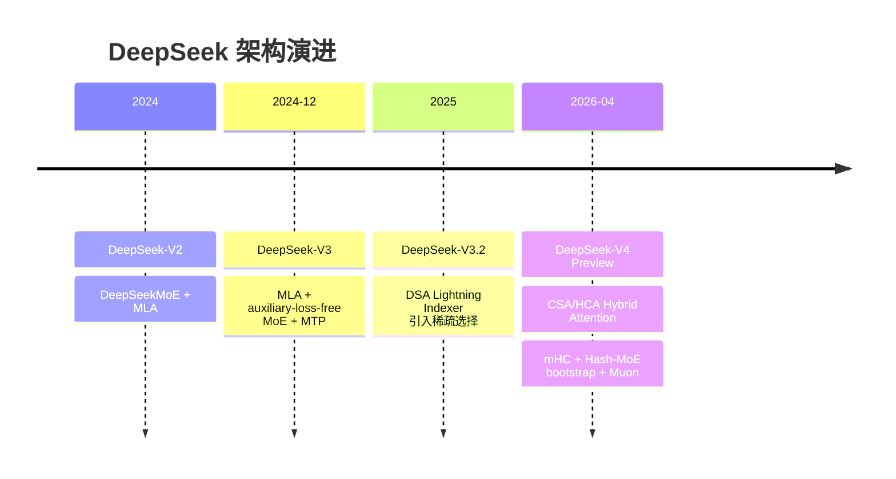
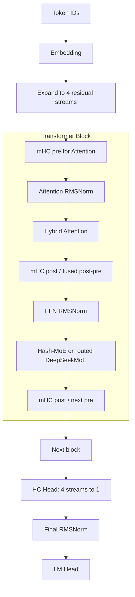
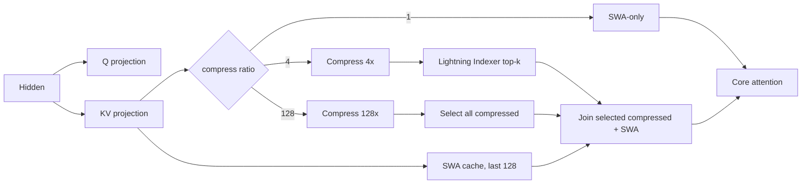
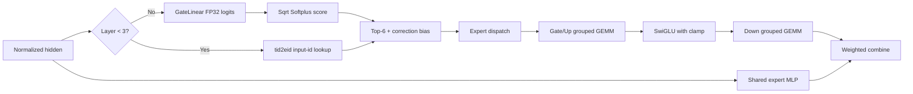
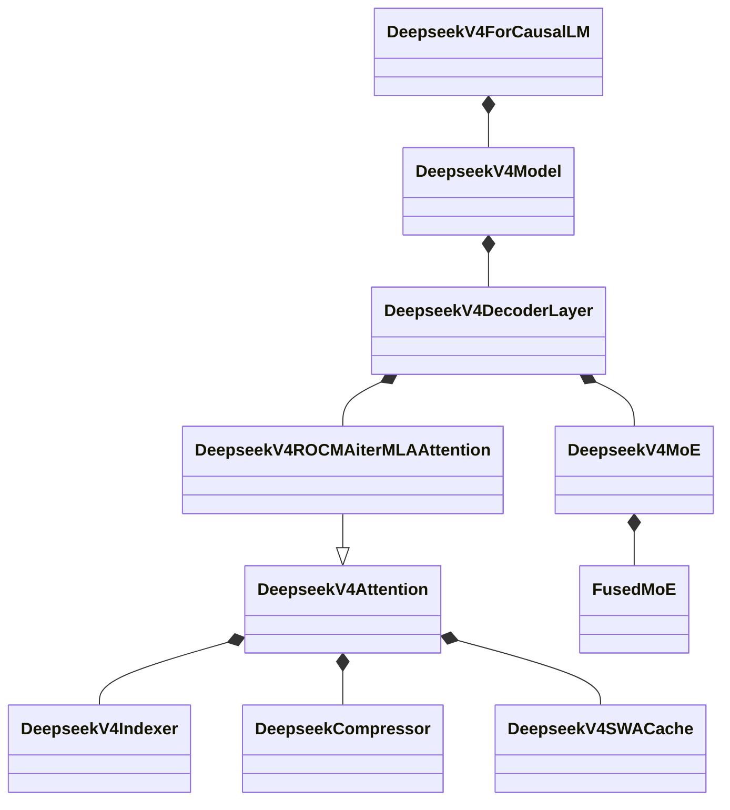
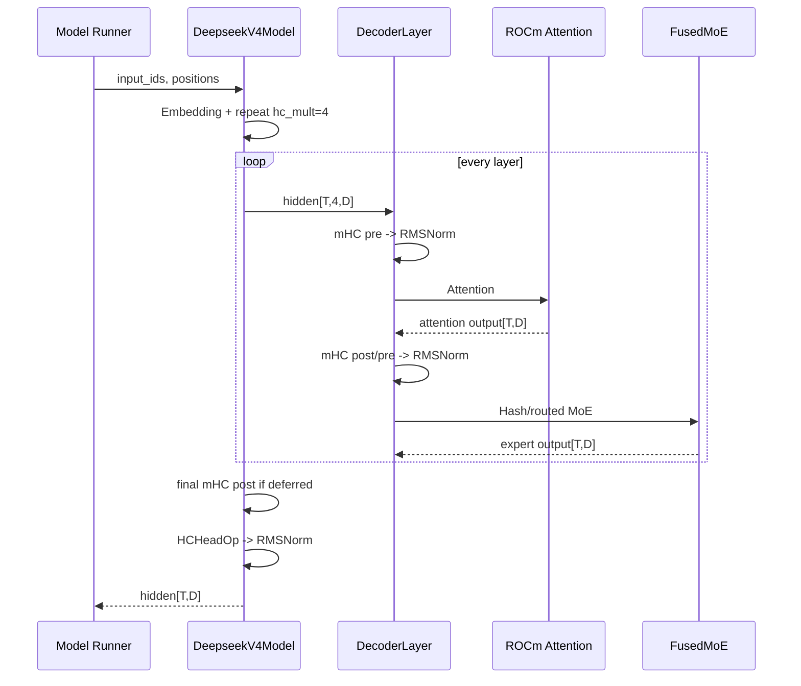
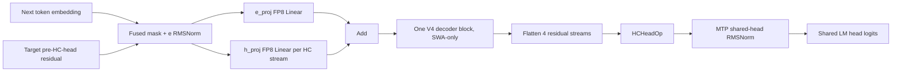
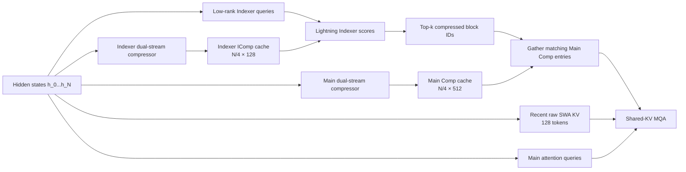
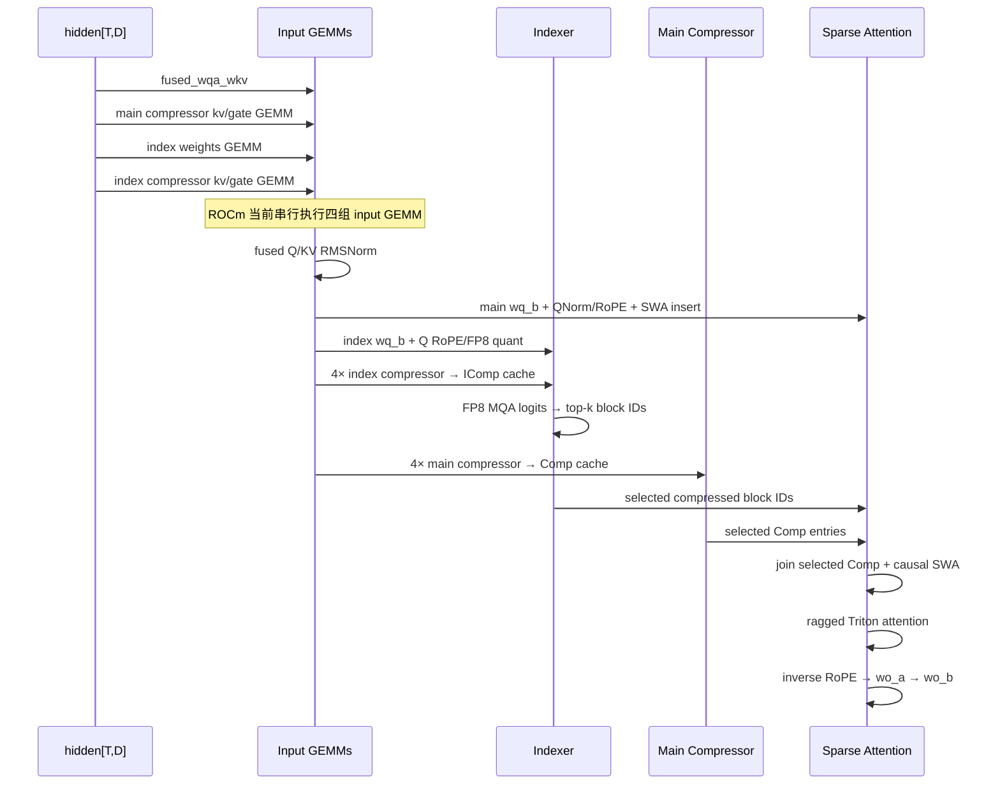

# vLLM DeepSeek-V4 与 AMD ROCm 算子实现技术教程

> **文档版本**：1.2  
> **分析代码版本**：vLLM `main`，commit `190be7dad2afa6684902324e0dffa2dc0229a364`  
> **代码时间点**：2026-07-25  
> **最后更新**：2026-07-25  
> **模型系列**：DeepSeek-V4 Preview  
> **模型类型**：Decoder-only MoE LLM，Hybrid CSA/HCA Attention，mHC，MTP  
> **重点平台**：AMD ROCm（主要面向 gfx950/MI355X，同时说明 gfx942/MI300X/MI325X 差异）

---

## 文档概述

本文面向希望理解或优化 DeepSeek-V4 ROCm 推理路径的 vLLM、ROCm、AITER
和 Triton 开发者。重点不是简单复述模型结构，而是回答以下工程问题：

1. DeepSeek-V4 的 CSA、HCA、SWA、mHC、MoE 和 MTP 如何串成一次 forward；
2. AMD 路径实际调用哪些 Python、CustomOp、Triton、AITER/CK/FlyDSL 算子；
3. 同一操作有哪些候选实现，按什么平台、dtype、模型配置、shape 和环境变量分派；
4. prefill 与 decode 的算子顺序有何不同；
5. 当前主线实现与早期 ROCm fallback、公开论文中的训练 mega-kernel 有何边界。

> **最重要的术语澄清**：vLLM 代码仍大量使用 `MLA`、`SparseMLA`、
> `FlashMLA` 命名，但 DeepSeek-V4 论文中的核心注意力已经不是
> DeepSeek-V2/V3 的 Multi-head Latent Attention。V4 使用的是
> **CSA（4× 压缩 + 稀疏选择）与 HCA（128× 压缩 + 全选）交替，
> 再叠加 128-token SWA 分支**。这些 `MLA` 名称主要来自 vLLM
> 既有的单 KV-head、paged cache 和 sparse backend 抽象。

### 推荐阅读顺序

- 只关心模型原理：第一、二部分；
- 关心 vLLM forward：第三、四部分；
- 关心 ROCm 算子选择：第五至第七部分；
- 准备部署或调优：第八、九部分和附录 A。

---

# 第一部分：模型系列与架构演进

## 1.1 DeepSeek 系列演进



V4 保留了 DeepSeekMoE 与 MTP，但改变了三个关键位置：

- 将 V3/V3.2 的 MLA/DSA 主干改为 CSA/HCA 混合注意力；
- 将普通 residual connection 改为四路 residual stream 的 mHC；
- 将最前面的若干 dense FFN 改为 Hash-MoE，官方 checkpoint 为前三层。

Muon 是训练优化器，不属于 vLLM 推理图；部署时不会出现 “Muon 算子”。

## 1.2 V4 模型家族

DeepSeek-V4 Preview 于 2026-04-24 正式公开。官方发布 API、模型卡、
四组权重和技术报告，但截至本文时间点尚未宣布 GA/正式版日期。

| 模型 | 发布日期 | 总参数 / 激活参数 | 层数 / Hidden | Experts（激活） | Context | 权重与入口 |
|---|---|---:|---:|---:|---:|---|
| V4-Flash-Base | 2026-04-24 | 284B / 13B | 43 / 4096 | 256（6） | 1M | FP8 mixed；[HF](https://huggingface.co/deepseek-ai/DeepSeek-V4-Flash-Base) / [ModelScope](https://modelscope.cn/models/deepseek-ai/DeepSeek-V4-Flash-Base) |
| V4-Flash | 2026-04-24 | 284B / 13B | 43 / 4096 | 256（6） | 1M | Routed experts MXFP4，其余主要 FP8；[HF](https://huggingface.co/deepseek-ai/DeepSeek-V4-Flash) / [ModelScope](https://modelscope.cn/models/deepseek-ai/DeepSeek-V4-Flash) |
| V4-Pro-Base | 2026-04-24 | 1.6T / 49B | 61 / 7168 | 384（6） | 1M | FP8 mixed；[HF](https://huggingface.co/deepseek-ai/DeepSeek-V4-Pro-Base) / [ModelScope](https://modelscope.cn/models/deepseek-ai/DeepSeek-V4-Pro-Base) |
| V4-Pro | 2026-04-24 | 1.6T / 49B | 61 / 7168 | 384（6） | 1M | Routed experts MXFP4，其余主要 FP8；[HF](https://huggingface.co/deepseek-ai/DeepSeek-V4-Pro) / [ModelScope](https://modelscope.cn/models/deepseek-ai/DeepSeek-V4-Pro) |

共同创新是 CSA/HCA、四路 mHC、Hash-MoE bootstrap、MTP depth 1 与
原生 1M context；统一技术报告见
[arXiv:2606.19348](https://arxiv.org/abs/2606.19348)。
官方透明度模型卡曾把 Flash 写成 285B，而技术报告与四个官方模型页面
均为 284B，本文采用后者。

共同配置：

| 配置 | 值 | 推理含义 |
|---|---:|---|
| `head_dim` | 512 | 448 NoPE + 64 RoPE |
| `sliding_window` | 128 | 所有 Attention 层均有局部未压缩分支 |
| `hc_mult` | 4 | residual stream 形状为 `[T, 4, D]` |
| `hc_sinkhorn_iters` | 20 | mHC doubly-stochastic 投影迭代 |
| `num_hash_layers` | 3 | 前三层按 token id 查表选 expert |
| `num_nextn_predict_layers` | 1 | checkpoint 含一个 MTP layer |
| `index_n_heads` | 64 | CSA Lightning Indexer query heads |
| `index_head_dim` | 128 | Indexer Q/K 维度 |
| `qk_rope_head_dim` | 64 | Q/K 与输出反向 RoPE 的维度 |
| `n_shared_experts` | 1 | 每层一个 shared expert |

Flash 的 `index_topk=512`；Pro 当前官方配置为 `index_topk=1024`。

## 1.3 Attention 层序列

官方 legacy `compress_ratios` 中：

- `0` 在 vLLM 中经 `max(1, ratio)` 变成 `1`，表示 SWA-only；
- `4` 表示 CSA；
- `128` 表示 HCA；
- MTP 层不在列表内，vLLM 强制 ratio=1。

现代 Transformers 默认配置采用两层 HCA bootstrap，随后交替布置 CSA/HCA：

```text
layer 0-1: HCA (128× compress + all compressed blocks)
layer 2:   HCA
layer 3:   CSA (4× compress + top-k)
layer 4:   HCA
layer 5:   CSA
...:       HCA/CSA 交替
MTP layer: SWA-only
```

实际 checkpoint 的显式 `layer_types` 或 legacy `compress_ratios` 优先于默认模式，
因此运行时应以加载后的配置为准，不能只由层号推断。

## 1.4 官方效率结论

官方技术报告给出的 1M context 估算：

| 模型 | 相对 V3.2 单 token FLOPs | 相对 V3.2 KV cache |
|---|---:|---:|
| V4-Pro | 27% | 10% |
| V4-Flash | 10% | 7% |

这些是模型架构层面的估算，不等同于某一 ROCm SKU 上的实测端到端吞吐。

---

# 第二部分：DeepSeek-V4 核心技术

## 2.1 整体架构



## 2.2 CSA、HCA 与 SWA

### CSA

CSA 每 4 个原始 token 压缩成一个 KV entry，并用 Lightning Indexer
从压缩序列中选 top-k：

$$
\operatorname{CSA}(q_t)
= \operatorname{Attention}\left(
q_t,\; K_{\mathrm{topk(compress4)}} \cup K_{\mathrm{SWA128}}
\right)
$$

Indexer score 使用 64 个 128-d head，经 ReLU 后按权重聚合：

$$
s(t,j)=\sum_h w_{t,h}\operatorname{ReLU}
\left(q_{t,h}^{T}k_j\right)
$$

### HCA

HCA 每 128 个 token 压成一个 entry，不运行 Lightning Indexer，
而是选择当前可见的全部压缩 entry：

$$
\operatorname{HCA}(q_t)
= \operatorname{Attention}\left(
q_t,\; K_{\mathrm{all(compress128)}} \cup K_{\mathrm{SWA128}}
\right)
$$

### SWA

SWA 分支保存最近 128 个未压缩 KV，既补足压缩 block 内的因果可见性，
也保留最近 token 的高分辨率信息。SWA-only 层则只执行这个分支。



## 2.3 压缩器

对每个压缩 block，模型先计算 KV state 与 score state，再对时间维做
softmax-gated pooling：

$$
\bar{k}=\sum_{i=1}^{r}
\operatorname{softmax}(s_i + a_i)\,k_i
$$

其中 CSA 的 `r=4` 且 overlap 开启，HCA 的 `r=128` 且无 overlap。
压缩结果经过 RMSNorm、partial RoPE 和量化后写入 paged cache。

## 2.4 partial RoPE 与 Attention Sink

512 维 attention head 中：

- 前 448 维 NoPE，以 UE8M0 block-scaled FP8 保存；
- 后 64 维应用 GPT-J interleaved RoPE，并以 BF16 保存；
- attention 输出在进入 `wo_a` 前对后 64 维执行 inverse RoPE；
- 每个 head 还有一个可学习 `attn_sink` logit，加入 softmax 分母。

这也是每个 `fp8_ds_mla` cache token 的核心数据布局：

```text
448 bytes NoPE FP8
+ 128 bytes RoPE BF16 (64 elements)
+ 8 bytes UE8M0 scales (7 used + 1 pad)
= 584 bytes semantic storage
```

部分代码中的 576B 指 token data 区，不含独立 scale 区；不要与完整
584B cache slot 混淆。

## 2.5 mHC

mHC 将 residual 从 `[T,D]` 扩展为 `[T,4,D]`。每个子层前动态产生：

- `pre_mix`：四路 residual 如何聚成子层输入；
- `post_mix`：子层输出注入每一路的系数；
- `comb_mix`：四路 residual 间的混合矩阵。

`comb_mix` 经 Sinkhorn-Knopp 投影到 doubly-stochastic matrix：

$$
\mathcal{B}_4=\{M\ge0\mid M\mathbf{1}=\mathbf{1},
M^T\mathbf{1}=\mathbf{1}\}
$$

因此其谱范数受限，深层传播更稳定。最终 `HCHeadOp` 再将四路压回 `[T,D]`。

## 2.6 DeepSeekMoE 与 Hash-MoE



V4 将 V3 的 sigmoid affinity 改为 `sqrt(softplus(x))`。前三层的
Hash-MoE 使用 checkpoint 中的 `tid2eid[vocab, top_k]` 决定 expert id，
但 expert 权重组合仍由 MoE 执行路径完成。

---

# 第三部分：vLLM 代码组织与模型注册

## 3.1 平台隔离

模型注册只指向一个逻辑入口：

```python
# vllm/model_executor/models/registry.py:95
"DeepseekV4ForCausalLM": (
    "vllm.models.deepseek_v4",
    "DeepseekV4ForCausalLM",
)
```

入口再按平台选择实现：

```python
# vllm/models/deepseek_v4/__init__.py:17-32
if current_platform.is_rocm():
    from .amd.dspark import DSparkDeepseekV4ForCausalLM
    from .amd.model import DeepseekV4ForCausalLM
    from .amd.mtp import DeepSeekV4MTP
elif current_platform.is_xpu():
    ...
else:
    from .nvidia.model import DeepseekV4ForCausalLM
```

因此 AMD 并非在 NVIDIA 类中插入少量条件分支，而是拥有独立的
`amd/model.py`、`amd/rocm.py`、`amd/mtp.py` 与 `amd/dspark.py`。

## 3.2 类关系



## 3.3 量化配置

`DeepseekV4FP8Config` 根据 `hf_config.expert_dtype` 分派：

```python
# vllm/models/deepseek_v4/quant_config.py:169-190
if isinstance(layer, RoutedExperts):
    if self.expert_dtype == "fp4":
        if self.moe_quant_algo == "NVFP4":
            return ModelOptNvFp4FusedMoE(...)
        return Mxfp4MoEMethod(layer.moe_config)
    # expert_dtype == "fp8" falls through to Fp8Config
return super().get_quant_method(layer, prefix)
```

因此：

- Instruct checkpoint：通常走 MXFP4 routed expert；
- Base checkpoint：走 block-FP8 expert；
- linear/attention：继续走 block-FP8 linear；
- AMD Quark MXFP4-OCP schema 会被转换为 DeepSeek-V4 FP8 config 接口。

---

# 第四部分：AMD 主模型 Forward 与算子顺序

## 4.1 模型级调用顺序



Embedding 后的关键代码：

```python
# vllm/models/deepseek_v4/amd/model.py:622-653
hidden_states = self.embed_input_ids(input_ids)
hidden_states = hidden_states.unsqueeze(-2).repeat(1, self.hc_mult, 1)
for idx, layer in enumerate(...):
    hidden_states, residual, post_mix, res_mix = layer(
        hidden_states, positions, input_ids,
        post_mix, res_mix, residual,
    )
```

## 4.2 单层 mHC 顺序

ROCm 有两种层级顺序。

### AITER unfused 路径

```text
mhc_pre(attn) → attn_norm → attention → mhc_post(attn)
→ mhc_pre(ffn) → ffn_norm → MoE → mhc_post(ffn)
```

### TileLang fused post-pre 路径

```text
first layer: mhc_pre(attn)
attn_norm → attention
→ fused[mhc_post(attn) + mhc_pre(ffn)]
→ ffn_norm → MoE
→ next layer fused[mhc_post(ffn) + mhc_pre(next attn)]
```

分派条件：

```python
# vllm/models/deepseek_v4/amd/model.py:361-366
self.use_fused_mhc = HAS_TILELANG_MHC and not (
    HAS_AITER_MHC and self.hidden_size % 256 == 0
)
```

Flash 的 4096 与 Pro 的 7168 都可被 256 整除，所以安装并启用受支持
AITER 时，当前代码选择 AITER pre/post，而不是 TileLang fused post-pre。

## 4.3 Attention 顶层顺序

```python
# vllm/models/deepseek_v4/attention.py:360-391
qr_kv, kv_score, indexer_kv_score, indexer_weights = (
    self.attn_gemm_parallel_execute(hidden_states)
)
qr, kv = qr_kv.split(...)
qr, kv = fused_q_kv_rmsnorm(...)
self.attention_impl(..., o_padded)
o = o_padded[:, :self.n_local_heads, :]
return self._o_proj(o, positions)
```

ROCm 明确禁用了这部分的 auxiliary streams：

```python
# vllm/models/deepseek_v4/amd/model.py:510-519
aux_stream_list = (
    None if current_platform.is_rocm()
    else [torch.cuda.Stream() for _ in range(3)]
)
```

`execute_in_parallel` 在 `aux_streams=None` 时严格执行：

1. `fused_wqa_wkv(hidden)`；
2. compressor `kv_score` GEMM（若有）；
3. indexer `weights_proj` GEMM（CSA）；
4. indexer compressor `kv_score` GEMM（CSA）。

也就是说，CUDA 注释中的多流 overlap 在当前 ROCm 路径上是串行的，
这是一个明确的后续优化空间，但也是为规避 ROCm hang 主动做出的选择。

## 4.4 Attention eager-break 内部顺序

### CSA（ratio=4）

```text
wq_b(qr)
→ fused Q RMSNorm + RoPE + SWA KV quant/insert
→ Lightning Indexer
   → indexer wq_b
   → fused indexer Q RoPE + FP8 quant
   → indexer compressor writes compressed K
   → MQA logits + top-k
→ main compressor writes 4× compressed KV
→ sparse attention over [top-k compressed + SWA]
→ inverse RoPE
→ wo_a grouped BF16 einsum
→ wo_b RowParallelLinear
```

### HCA（ratio=128）

```text
wq_b + fused SWA insert
→ 128× compressor
→ metadata enumerates every visible compressed block
→ sparse kernel over [all compressed + SWA]
→ inverse RoPE → wo_a → wo_b
```

### SWA-only（ratio=1）

```text
wq_b + fused SWA insert
→ sparse kernel over SWA indices only
→ inverse RoPE → wo_a → wo_b
```

---

# 第五部分：ROCm Attention 算子分派

## 5.1 KV 插入：一个水平融合 C++/HIP Custom Op

`_fused_qnorm_rope_kv_insert` 根据 SWA cache dtype 选择：

| Cache dtype/layout | 算子 | ROCm V4 当前可达性 |
|---|---|---|
| `uint8`, `fp8_ds_mla` | `_C.fused_deepseek_v4_qnorm_rope_kv_rope_quant_insert` | 主路径 |
| `bfloat16` plain row | `_C.fused_deepseek_v4_qnorm_rope_kv_rope_full_cache_bf16_insert` | 可用 fallback/layout |
| `float8_e4m3fn` plain row | `_C...full_cache_fp8_insert` | 注释明确主要为 FlashInfer/NVIDIA，ROCm AITER 不可达 |

主路径一次完成：

- Q 每 head RMSNorm；
- Q partial RoPE；
- Q padding head 清零；
- KV partial RoPE；
- 448 NoPE 维 UE8M0 FP8 quant；
- 64 RoPE 维 BF16 保存；
- paged SWA cache insert。

## 5.2 压缩器：单阶段与双阶段

```python
# vllm/models/deepseek_v4/compressor.py:431-443
if current_platform.is_cuda() and self.head_dim == 512:
    fn = compress_norm_rope_store_cutedsl
elif self._use_two_stage_fused_compressor:
    fn = compress_norm_rope_store_two_stage_triton
else:
    fn = compress_norm_rope_store_triton
```

ROCm 选择：

| 条件 | 实现 |
|---|---|
| head=512、ratio=128、prefill token | two-stage Triton |
| head=512、ratio=128、decode token | single-stage Triton |
| head=512、ratio=4 | single-stage Triton |
| indexer head=128、FP8 cache | single-stage Triton indexer kernel |
| indexer head=128、MXFP4 cache | 代码有 Triton kernel，但 AMD indexer 当前显式拒绝 FP4 cache |

HCA prefill 的 two-stage：

1. `_compress_gather_split_sparse_attn` 按 head 维拆分，目标是填满 CU；
2. `_finalize_norm_rope_quant_store_sparse_attn` 做 RMSNorm、RoPE、quant、store。

拆分数由 `num_actual`、`compress_ratio`、`head_dim` 和设备 CU 数动态决定。

## 5.3 Lightning Indexer：AITER 是硬条件

AMD `SparseAttnIndexer.forward_hip`：

```python
# vllm/model_executor/layers/sparse_attn_indexer.py:818-849
assert not self.use_fp4_cache
if rocm_aiter_ops.is_enabled():
    return torch.ops.vllm.rocm_aiter_sparse_attn_indexer(...)
raise RuntimeError(
    "Please enable aiter with VLLM_ROCM_USE_AITER=1"
)
```

所以 `VLLM_ROCM_USE_AITER=1` 对包含 CSA 层的 V4 不是纯性能开关，
而是当前 AMD Lightning Indexer 路径的功能要求。

### Prefill Indexer

1. Triton 从 paged indexer K cache gather FP8 K 与 scale；
2. `rocm_fp8_mqa_logits`：
   - gfx942 + AITER：使用 vLLM vendored `fp8_mqa_logits_gfx942` workaround；
   - 其他受支持架构 + AITER module：AITER Triton `fp8_mqa_logits`；
   - module 不存在：PyTorch `einsum + ReLU + weighted sum` fallback；
3. `_C.top_k_per_row_prefill` 写 top-k。

### Decode Indexer

1. Q 根据 speculative `next_n` pack；
2. `rocm_fp8_paged_mqa_logits`：
   - gfx942/gfx950：AITER `deepgemm_fp8_paged_mqa_logits` 单阶段；
   - 其他架构：AITER stage1，随后 `sum(dim=0)`；
   - AITER module 不存在：PyTorch paged loop fallback；
3. `_C.top_k_per_row_decode`；
4. 需要时 unpack speculative padding。

短上下文若压缩候选数不超过 `index_topk`，不会计算 MQA logits/top-k，
而由 `_fill_short_context_topk_indices` 直接选择全部候选，但仍写 indexer K cache。

## 5.4 Core sparse attention

当前主线 ROCm core attention 本身是 vLLM Triton，不是 AITER attention kernel。

### Prefill

1. 以 `PREFILL_CHUNK_SIZE=4` 个请求分块；
2. 仅反量化当前 chunk 所需的 compressed cache 与 SWA cache；
3. Triton `combine_topk_swa_indices` 拼出每个 query 的索引；
4. dense indices 转 ragged；
5. `_sparse_attn_prefill_ragged_kernel` 执行 online softmax attention。

这取代了早期“把整个 KV pool 反量化为 BF16”的 OOM 路径。

### Decode

输入直接是 `fp8_ds_mla` paged cache，不做全量 BF16 materialization：

- 非 gfx942/gfx950：单 kernel `_sparse_attn_decode_ragged_kernel`；
- gfx942/gfx950：动态 split-K：
  1. `_sparse_attn_decode_partial_kernel`；
  2. `_sparse_attn_decode_reduce_kernel`。

split 数在 1..16 中搜索，考虑：

- query 数；
- head block 数；
- CU 数；
- 平均 SWA 长度与 compressed/top-k 长度；
- 每个 workgroup 的 `BLOCK_K` 迭代数。

这使小 batch decode 也能向更多 CU 发射 workgroup。

## 5.5 gfx942 与 gfx950 的 FP8 差异

| Cache 来源 | gfx942 | gfx950 |
|---|---|---|
| SWA C++ encoder | FNUZ | OCP |
| Compressed Triton encoder | OCP | OCP |
| Indexer FP8 dtype | `e4m3fnuz` | `e4m3fn`/OCP |

decode kernel 因此分别携带 `IS_FNUZ_MAIN` 与 `IS_FNUZ_EXTRA`；
不能用一个 flag 同时解释 SWA 和 compressed cache，否则 scale 会出现约 1.87×
偏差。

## 5.6 输出投影

ROCm `_o_proj`：

```python
# vllm/models/deepseek_v4/amd/rocm.py:449-460
z = rocm_inv_rope_einsum(
    self.rotary_emb, o, positions,
    self.rope_head_dim, self.n_local_groups,
    self.o_lora_rank, self.wo_a,
)
return self.wo_b(z.flatten(1))
```

`rocm_inv_rope_einsum` 的顺序：

1. `_inverse_rope_gptj_kernel`：一个 Triton kernel 替代约十个小 op；
2. `_get_cached_wo_a_bf16`：首次调用将 FP8 block-scaled `wo_a`
   反量化并缓存为 BF16；
3. `torch.einsum("tgd,grd->tgr")`；
4. `wo_b` 走 RowParallelLinear，并按 TP 配置执行 reduce。

缓存 `wo_a` 消除了每个 decode step 重复的 FP8→FP32→scale→BF16 开销。

---

# 第六部分：ROCm mHC、Norm、Linear 与 MoE 选择

## 6.1 mHC 决策矩阵

| 条件 | `mhc_pre/post` | `fused_post_pre` | `hc_head` |
|---|---|---|---|
| AITER 可用，hidden % 256 == 0 | AITER | 不使用 | TileLang 若可用，否则 Triton |
| 无 AITER，TileLang 可用 | TileLang | TileLang | TileLang |
| AITER/TileLang 都不可用 | Torch | Torch 分解 post+pre | Triton |
| gfx942 | TileLang 被禁；优先 AITER，否则 Torch | 不使用/分解 | Triton |

注意：`HAS_AITER_MHC` 表示 AITER package 与平台受支持，不只看一个模型 flag。
`HAS_TILELANG_MHC` 在 ROCm gfx942 上被强制设为 false，因为已有错误结果记录。

## 6.2 RMSNorm

V4 自有融合 Triton：

- `fused_q_kv_rmsnorm`：同一 launch 的 grid-y 任务分别处理 QR 与 KV；
- `fused_mtp_input_rmsnorm`：mask position 0，并同时处理 embedding 与四路 hidden；
- `mtp_shared_head_rmsnorm`：MTP logits 前的 2D RMSNorm。

通用 `RMSNorm` 层的 ROCm IR 优先级则由以下条件决定：

```text
CUDAGraph enabled
AND VLLM_ROCM_USE_AITER=1
AND VLLM_ROCM_USE_AITER_RMSNORM=1
→ ["aiter", default]
otherwise
→ ["native"] with Inductor, else ["vllm_c", "native"]
```

## 6.3 FP8 Linear

Attention 与普通 MLP 的 linear 通过 vLLM quantized linear dispatcher。
ROCm 平台在：

```text
VLLM_ROCM_USE_AITER=1
AND VLLM_ROCM_USE_AITER_LINEAR=1
```

时可启用 AITER FP8 linear；若再设置
`VLLM_ROCM_USE_AITER_LINEAR_HIPBMM=1` 且运行在 MI3xx，
平台会在 hipBLASLt 初始化前设置 `HIP_ONLINE_TUNING=1`。

精确 GEMM kernel 仍由 linear method 根据矩阵 shape、dtype 和 AITER tuned
config 选择；不能仅由 “模型是 DeepSeek-V4” 推导出固定 kernel 名。

对未量化的 BF16 GEMM，例如部分 compressor projection，ROCm 通用
`dispatch_unquantized_gemm` 还会按顺序尝试：

1. gfx950 skinny shape 的 `wvSplitKrc`；
2. AITER Triton `gemm_a16w16`；
3. `wvSplitK` / `LLMM1` skinny GEMM；
4. AITER tuned GEMM；
5. 最终 `F.linear`。

这条阶梯受 token 数、M/N/K、GPU arch 与 AITER 开关共同影响，尤其是 decode
小 batch，不能与 block-FP8 linear 路径混为一谈。

## 6.4 MoE Router 与 top-k

ROCm 的 V4 router 不使用 CUDA-only 的 `dsv4_topk` Triton kernel。
`scoring_func="sqrtsoftplus"` 最终进入：

```text
GateLinear FP32 logits
→ fused_topk_bias
→ vllm_topk_softplus_sqrt
→ torch.ops._moe_C.topk_softplus_sqrt
→ HIP topk_softplus_sqrt kernel
```

该 kernel 一次完成 softplus、平方根 affinity、correction bias、分组选择、
Top-6 与 routing weight 计算。前 3 个 Hash-MoE layer 则从 `tid2eid`
获得 expert id，但仍复用后续 expert dispatch/GEMM/combine 基础设施。

## 6.5 Instruct：MXFP4 MoE backend

DeepSeek-V4 + ROCm + auto 的当前优先级：

```python
# vllm/model_executor/layers/fused_moe/oracle/mxfp4.py:604-613
priority_backends = [
    Mxfp4MoeBackend.AITER_MXFP4_BF16,
    Mxfp4MoeBackend.TRITON_UNFUSED,
]
```

选择过程：

1. 若用户显式传 `--moe-backend`，先映射并严格校验该 backend；
2. auto 时先调用 AITER kernel class 的 `is_supported_config`；
3. AITER 不支持当前 package/arch/shape/parallel layout 时，尝试 Triton unfused；
4. 两者都不支持则抛出 `NotImplementedError`，不会悄悄跑任意 Torch MoE。

AITER MXFP4 BF16 的权重准备会：

- 将 w13 从 checkpoint 布局调整为 gate/up 连续区域；
- 转为 native packed FP4 view；
- 用 AITER shuffle weight/scale；
- 设置临时兼容变量 `AITER_BF16_FP8_MOE_BOUND=0`；
- 运行 AITER/CK/FlyDSL fused MoE，activation 为 BF16。

Triton unfused 是功能 fallback，仍执行 routing、expert GEMM、SwiGLU、
down GEMM 与 combine，但没有同等的 AITER 融合程度。

## 6.6 Base：FP8 MoE backend

`expert_dtype="fp8"` 落入通用 `Fp8MoEMethod`。候选包含 AITER、Triton
等；显式 `--moe-backend aiter` 会严格要求 AITER 支持。

若环境中显式设置：

```text
VLLM_ROCM_USE_AITER=1
VLLM_ROCM_USE_AITER_MOE=1
```

FP8 oracle 会直接尝试 AITER；其中任一显式为 false，则从候选中移除 AITER。

## 6.7 Shared expert 融合

当前已合入路径只在以下条件全部满足时把 shared expert 作为追加 expert
塞入 routed MXFP4 grouped GEMM：

```text
ROCm
AND n_shared_experts exists
AND VLLM_ROCM_USE_AITER_FUSION_SHARED_EXPERTS=1
AND expert parallel disabled
AND 当前层 shared expert 本身也是 FP4
```

若 shared expert 是 checkpoint 原生 FP8，而 routed experts 是 MXFP4，
当前 commit 保持 shared MLP 独立执行。异构 MXFP4/FP8 fused shared expert
PR #48728 在本文代码时间点仍为 open，不能作为已发布行为描述。

## 6.8 TP All-Reduce

`wo_b`、普通 MLP `down_proj` 和未融合 shared expert 由
`RowParallelLinear` 产生局部结果；当 `tp_size > 1` 且
`reduce_results=True` 时调用 `tensor_model_parallel_all_reduce`。

ROCm 通用层还可由 `VLLM_ROCM_USE_AITER_CUSTOM_AR=1` 选择 AITER custom
all-reduce，但这不是 DeepSeek-V4 专用算子，最终是否替代 RCCL/NCCL
路径还受拓扑、world size 和 custom-AR 支持检查影响。Expert Parallel
与本文所述 homogeneous shared-expert fusion 当前互斥。

---

# 第七部分：MTP 与 DSpark

## 7.1 MTP forward



ROCm MTP 的 V4 专用点：

- `e_proj` 与 `h_proj` 分开做 FP8 linear，而非 V3 的 fused `eh_proj`；
- 使用 `fused_mtp_input_rmsnorm`；
- draft block 复用 AMD `DeepseekV4DecoderLayer`；
- MTP layer ratio 强制为 1，因此只用 SWA；
- 多个 speculative step 循环使用 checkpoint 中的 MTP layer。

## 7.2 DSpark

DSpark 在 AMD 路径复用：

- AMD decoder layer；
- ROCm attention 与 mHC CustomOp；
- Triton sliding-window context KV insert；
- Markov head。

但不包含 NVIDIA `mega-MoE` 权重路径。上下文 KV 预计算中根据 cache dtype
选择同一组 fused DeepSeek-V4 insert op。

---

# 第八部分：完整 ROCm 算子选择速查

| 操作 | 首选实现 | 备选实现 | 关键选择条件 |
|---|---|---|---|
| Model implementation | `amd/*` | 无跨平台 fallback | `current_platform.is_rocm()` |
| CSA Indexer Q quant | vLLM Triton FP8 | FP4 Triton 代码存在但 AMD 禁用 | ROCm 当前 `use_fp4_indexer_cache=False` |
| Indexer MQA prefill | gfx942 workaround / AITER Triton | PyTorch einsum | arch、AITER enabled、module 可导入 |
| Indexer MQA decode | AITER DeepGEMM paged | AITER stage1 / PyTorch | gfx942/gfx950、AITER module |
| Indexer top-k | `_C.top_k_per_row_*` | 短上下文直接 fill all | 候选数是否超过 top-k |
| SWA QNorm+RoPE+insert | fused C++/HIP op | BF16 fused variant | cache dtype/layout |
| CSA compressor | single-stage Triton | 无 Torch hot-path | ratio=4 |
| HCA compressor prefill | two-stage Triton | single-stage for decode | ROCm、ratio=128、prefill/decode |
| Core sparse prefill | vLLM ragged Triton | dense→ragged wrapper | metadata 是否已提供 ragged |
| Core sparse decode | split-K Triton | single Triton | gfx942/gfx950 vs other arch |
| inverse RoPE | fused Triton | 无通用 op 链 | ROCm `_o_proj` 固定 |
| `wo_a` | cached BF16 + einsum | 初次 FP8 dequant | 是否已有 module cache |
| mHC pre/post | AITER | TileLang / Torch | AITER、hidden%256、gfx942 |
| mHC fused post-pre | TileLang | Torch 分解 | 无优先 AITER 且 TileLang 可用 |
| HC head | TileLang | Triton | TileLang 可用性 |
| MoE sqrt-softplus top-k | `_moe_C` HIP kernel | 无 DSV4 Triton ROCm 路径 | scoring function |
| MXFP4 MoE | AITER MXFP4-BF16 | Triton unfused | DSV4 routing、support check、CLI |
| FP8 MoE | AITER when enabled/supported | Triton 等 | env、dtype、shape、parallel config |
| Shared expert fusion | homogeneous AITER FSE | separate MLP | FP4 shared、无 EP、env |
| General RMSNorm | AITER under graph | vllm_c/native | graph + AITER flags |
| General FP8 Linear | AITER | quant linear fallback | AITER linear flags与 support |
| BF16 skinny GEMM | wvSplitKrc/wvSplitK/LLMM1 | AITER tuned / `F.linear` | gfx950、shape、token 数 |
| TP reduction | AITER custom AR when supported | RCCL/NCCL path | topology、world size、env |

---

# 第九部分：部署、限制与调优建议

## 9.1 建议的最小 ROCm 配置思路

```bash
export VLLM_ROCM_USE_AITER=1
export VLLM_ROCM_USE_AITER_LINEAR=1
export VLLM_ROCM_USE_AITER_MOE=1

vllm serve deepseek-ai/DeepSeek-V4-Flash \
  --tensor-parallel-size 8 \
  --kv-cache-dtype fp8 \
  --moe-backend auto \
  --tokenizer-mode deepseek_v4 \
  --reasoning-parser deepseek_v4
```

这是理解配置关系的基线，不是对所有 GPU、AITER 版本和内存容量都最优的
通用命令。应以所安装 vLLM/AITER image 的 release notes 与实测为准。

## 9.2 调优优先级

1. **先确认 arch**：gfx950 与 gfx942 的 FP8、MHC、decode kernel 路径不同；
2. **确认 AITER 版本**：Indexer 是功能依赖，MoE/MHC 还依赖具体 API；
3. **观察启动日志**：记录实际 quant method、MoE backend、KV layout；
4. **分别 profile prefill/decode**：两者 compressor 和 sparse attention kernel 不同；
5. **比较 `auto` 与显式 `triton_unfused`**：用于隔离 AITER MoE 问题；
6. **谨慎打开 shared-expert fusion**：当前只保证同精度、无 EP 条件；
7. **不要在 ROCm 强行复用 CUDA 多流假设**：当前代码主动串行化 input GEMM。

## 9.3 官方 recipe 验证边界

截至 2026-07-25，可公开交叉验证的边界如下：

| 模型 / GPU | 已公开验证 | 不应外推的范围 |
|---|---|---|
| V4-Pro / MI355X | 8 卡 ROCm/AITER，含 GSM8K 验证 | 其他 MI3xx、跨节点 TP、完整 1M workload |
| V4-Flash / MI355X | 4 卡验证 | 所有 TP/EP、KV offload 组合 |
| V4-Flash / MI325X | vLLM 0.25.0、TP1、eager、4K context | TP2+、Think Max、长上下文生产稳定性 |

因此，“AMD 路径已合入”不等于所有 MI300/MI325/MI350、并行拓扑和
1M context 均达到生产级验证。初始 AMD 支持 PR #40871 的主要验证平台
是 MI355X；ROCm 跟踪 issue #41820 在本文时间点仍包含未完成项。

## 9.4 已知边界

- ROCm FP4 Lightning Indexer cache 当前被显式拒绝；
- 当前 core sparse attention 是 vLLM Triton，不应误称为 AITER FlashMLA；
- gfx942 TileLang mHC 因正确性问题禁用；
- 非 gfx942/gfx950 的 decode 有功能 fallback，但主要调优针对 gfx950；
- DCP 的 sparse indexer global merge 依赖 CuteDSL/CUDA，不能从 CUDA 文档推断
  ROCm DCP 可用；
- 早期 MI325X 的 96KB LDS 与全量 KV 反量化 OOM 报告对应旧实现；
  当前主线已用 gfx942 workaround 和 direct paged/ragged Triton 路径替代，
  但仍应在目标 SKU 上重新验证；
- 官方论文的 MegaMoE 2 训练/推理 infrastructure 主要在 CUDA/Ascend 上验证，
  不等同于本文件分析的 vLLM ROCm FusedMoE 路径。

## 9.5 如何验证“实际调了哪个算子”

静态代码只能给出候选与条件。运行时建议同时收集：

```bash
VLLM_LOGGING_LEVEL=DEBUG \
VLLM_ROCM_USE_AITER=1 \
vllm serve ...
```

重点检查：

- `DeepSeek V4 expert_dtype resolved to ...`
- `Using ... Mxfp4/Fp8 MoE backend`
- `Using DeepSeek's fp8_ds_mla KV cache format`
- `Using FP8 indexer cache for Lightning Indexer`
- AITER tuned GEMM/MoE 配置加载日志

随后用 `rocprofv3` 或 PyTorch Profiler 核对 kernel symbol；因为 linear/MoE
最终选择还受 shape 和安装包内 tuned config 影响，日志与 profile 才是运行时真相。

---

# 附录

## A. 关键代码位置索引

| 组件 | 文件 | 关键类/函数 |
|---|---|---|
| 平台入口 | `vllm/models/deepseek_v4/__init__.py` | ROCm/NVIDIA/XPU import dispatch |
| AMD 主模型 | `vllm/models/deepseek_v4/amd/model.py` | `DeepseekV4Model`, `DecoderLayer`, `MoE` |
| AMD Attention | `vllm/models/deepseek_v4/amd/rocm.py` | prefill/decode、metadata、output projection |
| 通用 V4 Attention | `vllm/models/deepseek_v4/attention.py` | Q/KV、Indexer、Compressor 调度 |
| Sparse backend metadata | `vllm/models/deepseek_v4/sparse_mla.py` | ratio=128 metadata |
| ROCm sparse kernels | `vllm/v1/attention/ops/rocm_aiter_mla_sparse.py` | Indexer、prefill/decode Triton |
| Compressor | `vllm/models/deepseek_v4/compressor.py` | state cache 与 kernel 选择 |
| Compressor kernels | `vllm/models/deepseek_v4/common/ops/fused_compress_quant_cache.py` | single/two-stage Triton |
| Indexer Q fusion | `vllm/models/deepseek_v4/common/ops/fused_indexer_q.py` | RoPE + FP8/MXFP4 quant |
| Q/KV norm | `vllm/models/deepseek_v4/common/ops/fused_qk_rmsnorm.py` | fused Triton RMSNorm |
| mHC dispatch | `vllm/model_executor/layers/mhc.py` | AITER/TileLang/Torch/Triton |
| MoE Router | `vllm/model_executor/layers/fused_moe/router/fused_topk_bias_router.py` | sqrt-softplus top-k dispatch |
| MoE top-k HIP | `csrc/libtorch_stable/moe/topk_softplus_sqrt_kernels.cu` | `topk_softplus_sqrt` |
| MXFP4 MoE oracle | `vllm/model_executor/layers/fused_moe/oracle/mxfp4.py` | backend priority |
| FP8 MoE oracle | `vllm/model_executor/layers/fused_moe/oracle/fp8.py` | AITER/Triton dispatch |
| V4 quant config | `vllm/models/deepseek_v4/quant_config.py` | expert dtype dispatch |
| AMD MTP | `vllm/models/deepseek_v4/amd/mtp.py` | MTP forward/logits |
| AMD DSpark | `vllm/models/deepseek_v4/amd/dspark.py` | semi-autoregressive draft |
| ROCm platform | `vllm/platforms/rocm.py` | backend priority与 IR op priority |

## B. 关键 PR 时间线

| PR | 状态（截至 2026-07-25） | 作用 |
|---|---|---|
| [#40871](https://github.com/vllm-project/vllm/pull/40871) | merged | AMD V4 初始支持 |
| [#41812](https://github.com/vllm-project/vllm/pull/41812) | merged | Triton sparse attention，替换 Torch reference |
| [#41946](https://github.com/vllm-project/vllm/pull/41946) | merged | AITER mHC 与 CustomOp 分派 |
| [#42595](https://github.com/vllm-project/vllm/pull/42595) | merged | AITER MXFP4 权重加载与 shuffle 修复 |
| [#42810](https://github.com/vllm-project/vllm/pull/42810) | merged | 高并发准确率与 top-k buffer 修复 |
| [#43385](https://github.com/vllm-project/vllm/pull/43385) | merged | ROCm V4 MTP |
| [#43679](https://github.com/vllm-project/vllm/pull/43679) | merged | ROCm TileLang mHC |
| [#46122](https://github.com/vllm-project/vllm/pull/46122) | merged | DSV4 AITER MXFP4-BF16 MoE 优化 |
| [#48728](https://github.com/vllm-project/vllm/pull/48728) | open | 异构 MXFP4 routed + FP8 shared expert fusion |

## C. 术语表

| 术语 | 含义 |
|---|---|
| CSA | Compressed Sparse Attention，4× 压缩后 top-k |
| HCA | Heavily Compressed Attention，128× 压缩后全选 |
| SWA | Sliding Window Attention，局部 128 token |
| mHC | Manifold-Constrained Hyper-Connections |
| DSA | DeepSeek Sparse Attention；V4 Indexer 思想来源 |
| MTP | Multi-Token Prediction，用于 speculative decoding |
| DSpark | semi-autoregressive draft model |
| UE8M0 | 只保存指数的 power-of-two block scale |
| OCP FP8 | 通常指 `e4m3fn` 语义 |
| FNUZ FP8 | AMD `e4m3fnuz` 变体 |
| AITER | AMD inference kernel library，含 CK/ASM/Triton/FlyDSL 路径 |
| gfx942 | MI300X/MI325X 所属架构族 |
| gfx950 | MI350/MI355X 所属架构族 |

## D. 参考资料

- [DeepSeek-V4 Technical Report](https://arxiv.org/abs/2606.19348)
- [DeepSeek-V4 Hugging Face Collection](https://huggingface.co/collections/deepseek-ai/deepseek-v4)
- [DeepSeek-V4-Pro Config](https://huggingface.co/deepseek-ai/DeepSeek-V4-Pro/blob/main/config.json)
- [DeepSeek-V4-Flash Config](https://huggingface.co/deepseek-ai/DeepSeek-V4-Flash/blob/main/config.json)
- [Transformers DeepSeek-V4 Documentation](https://huggingface.co/docs/transformers/main/en/model_doc/deepseek_v4)
- [vLLM Supported Models](https://docs.vllm.ai/en/latest/models/supported_models/)
- [ROCm AITER](https://github.com/ROCm/aiter)

## E. CSA 计算过程、设计原理与 Indexer/DSA 关系

### E.1 一句话定义

CSA（Compressed Sparse Attention）可以写成：

$$
\boxed{
\text{CSA}
=
\text{Sequence Compression}_{m=4}
+
\text{DSA Top-k Selection}
+
\text{SWA}_{128}
+
\text{Shared-KV MQA}
}
$$

它先把序列方向的候选 KV 数量缩短到约 $N/4$，再使用 Lightning Indexer
从这些**压缩 block**中选择 $k$ 个，最后把它们与最近 128 个原始 token 的
SWA KV 一起送入真正的 softmax attention。



这里存在两套独立的压缩表示：

- `Comp`：512 维，作为 core attention 的 K 和 V；
- `IComp`：128 维，只供 Indexer 估计相关性。

Indexer 返回的是 **block id**。该 id 在 `IComp` 与 `Comp` 两个 cache
之间一一对应，因此用低成本 `IComp` 排名后，可以直接索引高保真 `Comp`。
Indexer 的 128 维向量本身不会作为最终 attention 的 value。

### E.2 符号与生产配置

| 符号 | 含义 | V4 配置 |
|---|---|---:|
| $N$ | 原始上下文长度 | 最大 1,048,576 |
| $d$ | 主 compressed KV / attention head dim | 512 |
| $m$ | CSA compression ratio | 4 |
| $W$ | SWA window | 128 |
| $H_I$ | Indexer query head 数 | 64 |
| $d_I$ | Indexer head / compressed key dim | 128 |
| $r_q$ | query latent rank | checkpoint 配置；代码注释常见 1536 |
| $k$ | 每个 query 保留的 compressed blocks | Flash 512；Pro 1024 |
| $H$ | core attention query heads | checkpoint 配置 |

### E.3 第一步：双流、重叠的 token-level compression

#### E.3.1 为什么不是普通 4-token average pooling

对输入 hidden state $h_t\in\mathbb{R}^{D}$，CSA 产生两套候选向量和两套
逐通道 gate logits：

$$
\begin{aligned}
c_t^{(0)} &= h_tW_C^{(0)}, &
z_t^{(0)} &= h_tW_Z^{(0)},\\
c_t^{(1)} &= h_tW_C^{(1)}, &
z_t^{(1)} &= h_tW_Z^{(1)}.
\end{aligned}
$$

其中 $c,z\in\mathbb{R}^{d}$。vLLM 将四个投影融合在一个
`fused_wkv_wgate` GEMM 中。CSA 的 `coff=2`，所以主 compressor 的输出为：

```text
kv_score: [T, 2 * coff * d] = [T, 2048]
kv:       [T, coff * d]     = [T, 1024]
score:    [T, coff * d]     = [T, 1024]
```

这意味着 gate 不是每个 token 一个标量，而是**每个 token、每个输出通道**
一个 logit。不同通道可以从同一个 8-token receptive field 中选择不同信息。

#### E.3.2 一个 compressed entry 看哪些 token

令第 $b$ 个基本 block 为：

$$
B_b=\{bm,\ldots,(b+1)m-1\}.
$$

第 $b$ 个压缩 entry 同时读取：

- 当前 block $B_b$ 的 stream-0；
- 前一个 block $B_{b-1}$ 的 stream-1。

对每个通道独立加入可学习位置偏置 $a$，并在总共 $2m=8$ 个候选间做
softmax：

$$
\alpha_{b,t}^{(u)}
=
\operatorname{Softmax}_{(u,t)\in
\{(0,B_b),(1,B_{b-1})\}}
\left(z_t^{(u)}+a_{\operatorname{offset}(t),u}\right).
$$

然后按通道加权汇聚：

$$
\operatorname{Comp}_b
=
\sum_{t\in B_b}
\alpha_{b,t}^{(0)}\odot c_t^{(0)}
+
\sum_{t\in B_{b-1}}
\alpha_{b,t}^{(1)}\odot c_t^{(1)}.
$$

对 $b=0$，不存在的 $B_{-1}$ score 以 $-\infty$ 填充，value 以 0 填充。
代码中 `ape` 的 shape 为 `[m, 2d]`，对应上述逐位置、逐通道偏置；
`overlap=True`、`coff=2` 对应双流结构。

> 每个 entry 虽然聚合 $2m=8$ 个候选，但 stride 仍是 $m=4$，
> 所以 cache 长度是 $N/4$，不是 $N/8$。

#### E.3.3 overlap 的原理

若只把不重叠的四个 token 压成一个 entry，跨 block 的短语、代码结构或
实体可能恰好被边界切断。双流 overlap 让 block $B_b$：

- 通过 stream-0 影响 `Comp_b`；
- 通过 stream-1 影响 `Comp_{b+1}`。

因此每个原始 token 有两条学习到的“写入邻近 block”路径，降低固定边界造成的
信息损失。与卷积 overlap 不同，这里两条路径拥有不同投影和动态 gate。

#### E.3.4 因果示例

取 $m=4$：

```text
Comp_0 <- stream0(token 0..3)  + padded stream1
Comp_1 <- stream0(token 4..7)  + stream1(token 0..3)
Comp_2 <- stream0(token 8..11) + stream1(token 4..7)
```

对 query $t=10$，只有满足

$$
b < \left\lfloor\frac{t}{m}\right\rfloor = 2
$$

的 `Comp_0`、`Comp_1` 可以进入 compressed 候选集。`Comp_2` 含 token 11，
不能使用。当前 block 中已经出现的 token 8..10 则由 causal SWA 分支提供。
这解释了为什么 CSA 不能只保留 compressed cache，还必须搭配局部原始 KV。

### E.4 第二步：构造 Lightning Indexer

#### E.4.1 Indexer key

CSA 用**另一套参数**执行相同的 $m=4$ 双流压缩，得到：

$$
IComp_b\in\mathbb{R}^{d_I},\qquad d_I=128.
$$

它与主 `Comp_b\in\mathbb{R}^{512}` 共享 block 划分和 block id，但不共享
投影权重。vLLM 中这是 `DeepseekV4Indexer.compressor`，其
`fused_wkv_wgate` 对每个 token 产生
`2 × 2 × 128 = 512` 个 FP32 accumulator 输出。

压缩完成后执行 RMSNorm、最后 64 维 partial RoPE 和量化，再写入独立的
Indexer paged cache。论文使用低精度 Indexer 计算；当前 ROCm vLLM 路径
明确只支持 FP8 Indexer cache，`use_fp4_indexer_cache` 会被拒绝。

#### E.4.2 Indexer query 与 head weights

主 attention 与 Indexer 共享 query latent：

$$
c_t = \operatorname{RMSNorm}(h_tW_{Q,\mathrm{down}})
\in\mathbb{R}^{r_q}.
$$

Indexer 再 up-project 为 64 个 128 维 query head：

$$
[q^I_{t,1};\ldots;q^I_{t,H_I}]
= c_tW^I_{Q,\mathrm{up}}.
$$

同时直接从 hidden state 产生每个 Indexer head 的动态权重：

$$
[w^I_{t,1},\ldots,w^I_{t,H_I}]
=h_tW^I_W.
$$

vLLM 对应：

- `fused_wqa_wkv`：产生共享的低秩 `qr`；
- `indexer.wq_b(qr)`：产生 `[T, 64, 128]`；
- `indexer.weights_proj(hidden_states)`：产生 `[T, 64]`；
- `fused_indexer_q_rope_quant`：partial RoPE、量化，并把 Q scale、
  $d_I^{-1/2}$ 与 $H_I^{-1/2}$ 折叠进 weights。

#### E.4.3 相关性打分

query $t$ 与先前 compressed block $b$ 的 Indexer score 为：

$$
I_{t,b}
=
\sum_{j=1}^{H_I}
w^I_{t,j}\,
\operatorname{ReLU}
\left(
\left\langle q^I_{t,j},IComp_b\right\rangle
\right).
$$

设计含义：

1. **单个 shared key、多个 query heads**：以 MQA 方式减少 key cache；
2. **ReLU 后再跨 head 聚合**：每个 head 可以检测一种匹配模式，负匹配被截断；
3. **query-dependent head weights**：不同 query 动态强调不同匹配模式；
4. **不对候选做 softmax**：Indexer 只需要排序，不需要形成最终概率；
5. **低维、低精度**：128 维 Indexer 只负责 recall，512 维 core attention
   负责精确重排和 value 聚合。

最后：

$$
S_t=\operatorname{TopK}_b(I_{t,b}, k),
\qquad
C_t^{\mathrm{selected}}
=\{\operatorname{Comp}_b\mid b\in S_t\}.
$$

当合法 compressed candidates 数量不超过 $k$ 时，vLLM 跳过 MQA
logits 和 top-k，直接把所有候选 block id 写入 buffer；但仍需构造
Indexer K cache，以供上下文继续增长后使用。

### E.5 第三步：Core Attention

#### E.5.1 候选集合

对 query $t$，最终 key/value 集合是：

$$
\mathcal{K}_t
=
\{\operatorname{Comp}_b\mid b\in S_t\}
\cup
\{\operatorname{SWAKV}_s\mid
\max(0,t-W+1)\le s\le t\}.
$$

`Comp` 和 SWA KV 都是 shared KV：同一 512 维向量同时作为 key 和 value，
所有 query heads 共享它们。

#### E.5.2 Query、RMSNorm 与 partial RoPE

主 query 也由共享 latent $c_t$ up-project：

$$
[q_{t,1};\ldots;q_{t,H}]
=c_tW_{Q,\mathrm{up}}.
$$

在 core attention 前，每个 query head 和 compressed KV entry 分别做
RMSNorm。512 维中：

- 前 448 维为 NoPE；
- 后 64 维应用 GPT-J interleaved RoPE；
- KV 的 448 维以 UE8M0 block-scaled FP8 保存，RoPE 维保留 BF16。

#### E.5.3 带 Attention Sink 的 softmax

对 head $h$ 和候选 $x\in\mathcal{K}_t$：

$$
\ell_{t,h,x}
=
\frac{\langle q_{t,h},k_x\rangle}{\sqrt{512}}.
$$

每个 head 还包含一个可学习 sink logit $\ell'_h$：

$$
p_{t,h,x}
=
\frac{\exp(\ell_{t,h,x})}
{\sum_{y\in\mathcal{K}_t}\exp(\ell_{t,h,y})
+\exp(\ell'_h)}.
$$

因此实际 attention weights 的总和可以小于 1；当所有真实候选都不合适时，
概率质量可以流向 sink，而不必强行写入某个 value。

输出为：

$$
o_{t,h}=\sum_{x\in\mathcal{K}_t}p_{t,h,x}v_x.
$$

由于 $v_x$ 与 key 是同一条带 absolute RoPE 的向量，vLLM 在输出最后 64
维执行 inverse RoPE，再做 grouped `wo_a` 和最终 `wo_b` 投影。

### E.6 CSA 在 vLLM ROCm 上的准确调用顺序



具体映射：

| 计算阶段 | vLLM 入口 | ROCm 热路径 |
|---|---|---|
| 主/Indexer 输入投影 | `attn_gemm_parallel_execute` | quantized/BF16 GEMM，当前同 stream 串行 |
| Main Q 与 SWA cache | `_fused_qnorm_rope_kv_insert` | C++/HIP horizontal fusion |
| Indexer Q | `fused_indexer_q_rope_quant` | Triton |
| Indexer 4× compression | `DeepseekV4Indexer.compressor` | single-stage Triton |
| Index logits | `rocm_fp8_mqa_logits` / paged variant | AITER；gfx942 workaround；局部 reference fallback |
| Top-k | `_C.top_k_per_row_prefill/decode` | C++/HIP |
| Main 4× compression | `DeepseekCompressor` | single-stage Triton |
| Index 合并 | `combine_topk_swa_indices` | Triton |
| Core attention | `rocm_sparse_attn_prefill/decode` | ragged Triton；gfx942/gfx950 decode split-K |
| 输出 | `rocm_inv_rope_einsum` + `wo_b` | inverse-RoPE Triton + cached-BF16 einsum + linear |

ROCm 上 `DeepseekV4Indexer.forward` 的局部顺序是：

```text
indexer.wq_b + Q quant
→ indexer compressor 写 IComp cache
→ SparseAttnIndexer 读 cache 并算 top-k
```

因为 `aux_stream=None`，没有 NVIDIA 路径中的 inner overlap。整个 CSA
`attention_impl` 也是 Main Q/SWA insert → Indexer → Main Compressor →
Core Attention 的顺序。

### E.7 Indexer、DSA 与 CSA 到底是什么关系

最容易混淆的是把 Indexer、DSA 和 CSA 当成三个同义词。准确关系是：

```text
Lightning Indexer = 低成本“候选召回器”

DSA = Lightning Indexer
    + fine-grained top-k selection
    + 只对入选 KV 执行 core sparse attention

CSA = 4× overlapped sequence compression
    + 在 compressed blocks 上应用 DSA 策略
    + 128-token SWA
    + V4 shared-KV MQA / grouped output projection
```

因此：

- **Indexer 是 DSA 的一个组件**，不是完整 DSA；
- **DSA 是一种稀疏选择/计算策略**；
- **CSA 在 DSA 前增加序列压缩，并改变被选择对象的粒度**；
- vLLM 中 `SparseAttnIndexer` 是 V3.2 与 V4 共用的硬件分派抽象，
  但 V4 在它前面加入了 `DeepseekV4Indexer.compressor`。

#### E.7.1 V3.2 DSA 与 V4 CSA 对比

| 维度 | DeepSeek-V3.2 DSA | DeepSeek-V4 CSA |
|---|---|---|
| 候选单位 | 单个原始 token | 4-token stride 的 overlapped compressed block |
| 候选数 | 约 $N$ | 约 $N/4$ |
| Indexer key | 每 token 一个 128-d key | 每 compressed block 一个 128-d `IComp` |
| Main KV | V3 系列 MLA latent/token cache | V4 512-d shared K=V compressed cache |
| 选择数量 | 2048 token | Flash 512 / Pro 1024 blocks |
| 局部分支 | DSA/MLA 实现细节 | 明确拼接 128-token SWA |
| Top-k 后 core attention | token-level sparse attention | compressed-block sparse MQA |
| vLLM 公共组件 | `SparseAttnIndexer` | 同一 `SparseAttnIndexer` |
| V4 新增 | 无 | 双流 Main Compressor + 双流 Indexer Compressor |

#### E.7.2 为什么“先压缩，再稀疏”比只做 DSA 更有效

对单 token decode，忽略常数：

| 方案 | Indexer 扫描 | Core attention | KV 候选存储 |
|---|---:|---:|---:|
| Dense | 无 | $O(HdN)$ | $O(Nd)$ |
| V3.2 DSA | $O(H_Id_IN)$ | $O(Hd\,k_{\mathrm{DSA}})$ | token-level cache |
| V4 CSA | $O(H_Id_I N/m)$ | $O(Hd(k+W))$ | $O(Nd/m)+O(Wd)$ |
| V4 HCA | 无 | $O(HdN/m')$ | $O(Nd/m')+O(Wd)$ |

DSA 虽将昂贵的 core attention 降为固定 top-k，但 Indexer 仍需扫描全部
$N$ 个 token。CSA 先令候选数变成 $N/4$，因此：

- Indexer 的 scan 长度缩短 4×；
- Main compressed cache 长度缩短 4×；
- core top-k 从 V3.2 的 2048 降至 512/1024；
- Indexer 使用 128-d、低精度表示，而 core attention 使用 512-d 表示。

在 $N=1,000,000$ 附近：

```text
compressed candidates ≈ 250,000
Flash core candidates  ≈ 512 + 128 SWA
Pro core candidates    ≈ 1024 + 128 SWA
```

但需要注意：Indexer 仍对约 25 万 compressed entries 做全扫描，所以
CSA decode 对 $N$ 仍是线性复杂度；它不是严格 $O(1)$ attention。
Prefill 中所有 query 的 Indexer 扫描总体仍近似 $O(N^2/m)$，只是常数、
候选长度和精度显著降低，core attention 部分则接近 $O(N(k+W))$。

### E.8 Indexer 为什么能够用低精度做召回

Indexer 只需让重要 block 排进 top-k，要求的是**排序稳定性**，而不是复现
core attention 的精确概率。其设计类似 information retrieval 的两阶段系统：

```text
低维/低精度 Indexer = coarse retrieval
512-d softmax attention = exact reranking + value aggregation
```

64 个 query heads 提供多种匹配子空间，ReLU 保留正证据，动态
$w^I_{t,j}$ 决定当前 query 更相信哪些子空间。即使 score 的绝对值受量化影响，
只要 top-k 边界附近的相对排序大体稳定，最终输出仍由高精度 core attention
重新计算。

这种设计也解释了为什么 Main Compressor 与 Indexer Compressor 不能合并为
一个 cache：前者追求作为 K/V 的信息保真度，后者追求低成本、高 recall 排名，
二者的最优表示目标不同。

### E.9 Indexer 的训练来源：DSA 蒸馏目标

DeepSeek-V3.2 的 DSA 报告明确给出了 Lightning Indexer 的独立训练方式。
先把主 attention 的多 head attention weights 求和并做 L1 normalization，
得到目标分布 $p_{t,:}$。Dense warm-up 使用：

$$
\mathcal{L}^{I}
=
\sum_t
D_{\mathrm{KL}}
\left(
p_{t,:}\,
\middle\|\,
\operatorname{Softmax}(I_{t,:})
\right).
$$

进入 sparse training 后，仅在 Indexer 选出的集合
$S_t=\operatorname{TopK}(I_{t,:})$ 上对齐：

$$
\mathcal{L}^{I}
=
\sum_t
D_{\mathrm{KL}}
\left(
p_{t,S_t}\,
\middle\|\,
\operatorname{Softmax}(I_{t,S_t})
\right).
$$

DSA 将 Indexer 输入从主模型计算图 detach：

- Indexer 只接受 $\mathcal{L}^{I}$；
- 主模型只接受 language-modeling loss；
- 离散 top-k 不需要向主模型反向传播。

DeepSeek-V4 报告明确说 CSA “applies the DSA strategy”，但没有在 V4
报告中重新逐条声明上述 warm-up、detach 和 KL 训练流程。因此可将这些公式
视为 Indexer 的 **DSA 原理与谱系**；若要断言 V4 checkpoint 完全采用相同
训练 schedule，则需要 DeepSeek 进一步公开训练细节。vLLM 只加载已经训练好的
Indexer 权重并执行推理，不包含这些训练 loss。

### E.10 常见误解

1. **“CSA 就是把 4 个 token 平均成一个。”**  
   错。它是双投影、8 候选 overlap、逐通道 softmax-gated compression。

2. **“Indexer 选出来的是 512/1024 个原始 token。”**  
   错。V4 CSA 选择的是 compressed block；每个 block 汇聚跨两个相邻
   4-token block 的信息。

3. **“Indexer 的 key 就是最终 attention KV。”**  
   错。128-d `IComp` 只做排名；block id 映射到独立的 512-d `Comp`。

4. **“DSA 与 Indexer 是同一个东西。”**  
   错。Indexer 是召回器；DSA 还包含 top-k 与 sparse core attention。

5. **“CSA 完全消除了线性 context scan。”**  
   错。decode Indexer 仍扫描 $N/4$ 个候选，只是使用低维低精度 kernel。

6. **“论文写 FP4，所以 ROCm Indexer 一定使用 FP4。”**  
   错。论文描述模型效率目标；本文分析的 vLLM ROCm commit 明确只支持
   FP8 Indexer cache，FP4 cache 路径会 assert。

7. **“SWA 只是性能优化。”**  
   不完整。它首先解决压缩 block 内的严格因果可见性，并保留近期细粒度信息。

### E.11 本附录参考

- [DeepSeek-V4 Technical Report §2.3.1](https://arxiv.org/html/2606.19348#S2.SS3.SSS1)
- [DeepSeek-V3.2 Technical Report：DSA](https://arxiv.org/html/2512.02556)
- `vllm/models/deepseek_v4/attention.py`
- `vllm/models/deepseek_v4/compressor.py`
- `vllm/model_executor/layers/sparse_attn_indexer.py`
- `vllm/v1/attention/ops/rocm_aiter_mla_sparse.py`

---

## 结论

DeepSeek-V4 在 vLLM ROCm 上不是“一个 Attention kernel 加一个 MoE kernel”，
而是由多个具有不同分派层级的子系统组成：

- **架构层**按 ratio 选择 SWA-only、CSA 或 HCA；
- **Indexer 层**要求 AITER enabled，但大量 glue、cache 与 top-k 仍由
  vLLM Triton/C++ 完成；
- **Core attention 层**当前直接使用 vLLM ragged Triton，并对
  gfx942/gfx950 使用动态 split-K decode；
- **mHC 层**在 AITER、TileLang、Torch、Triton 间按 package、arch 和
  hidden-size 分派；
- **MoE 层**按 expert dtype 区分 MXFP4/FP8，再由 oracle 选择
  AITER 或 Triton；
- **Linear/Norm 层**还会继续经过通用 vLLM ROCm dispatcher。

因此，分析性能时必须先固定 checkpoint、GPU arch、AITER 版本、
`--moe-backend`、KV dtype、TP/EP 与 prefill/decode workload；
脱离这些条件谈“DeepSeek-V4 调用了哪个 ROCm 算子”并没有唯一答案。
