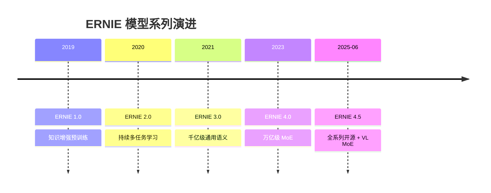
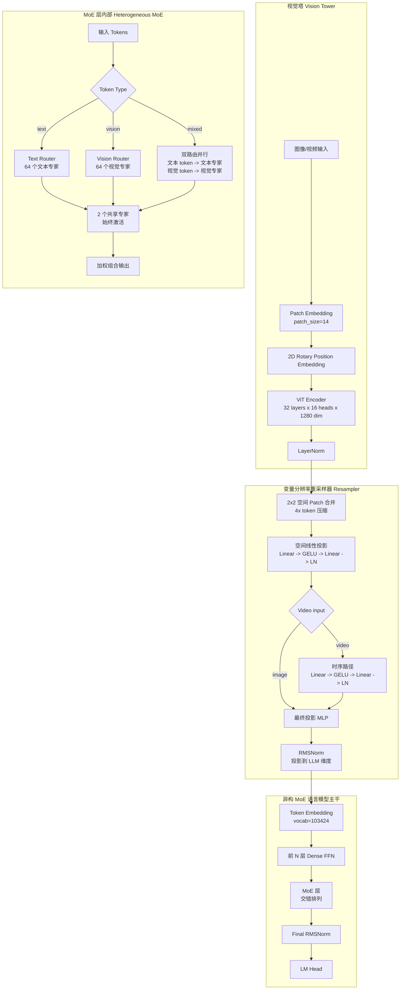
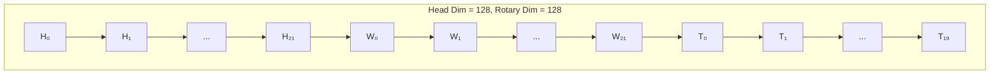
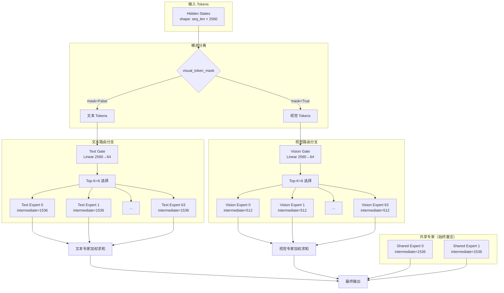
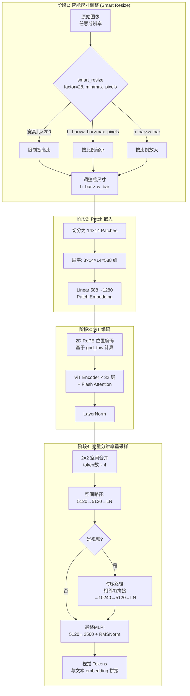
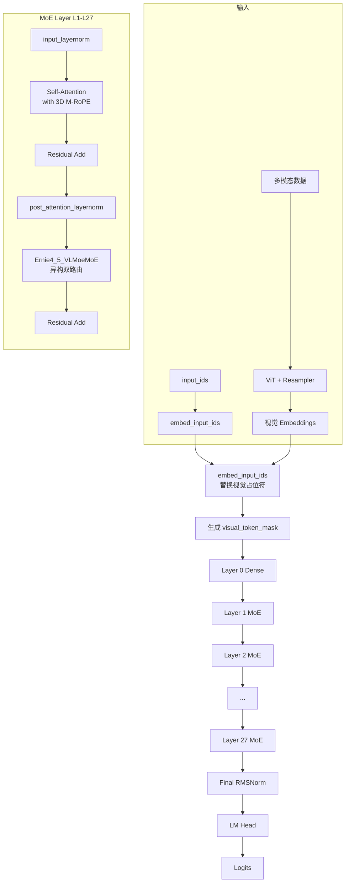
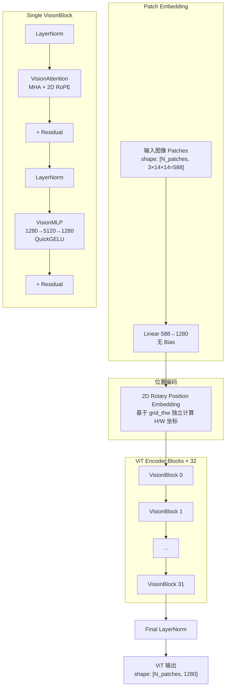
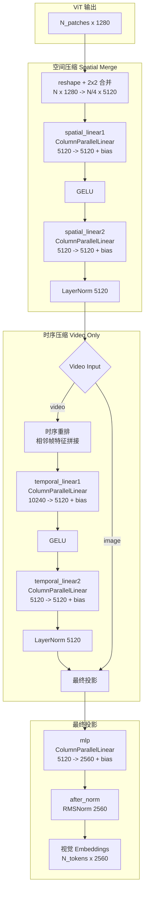
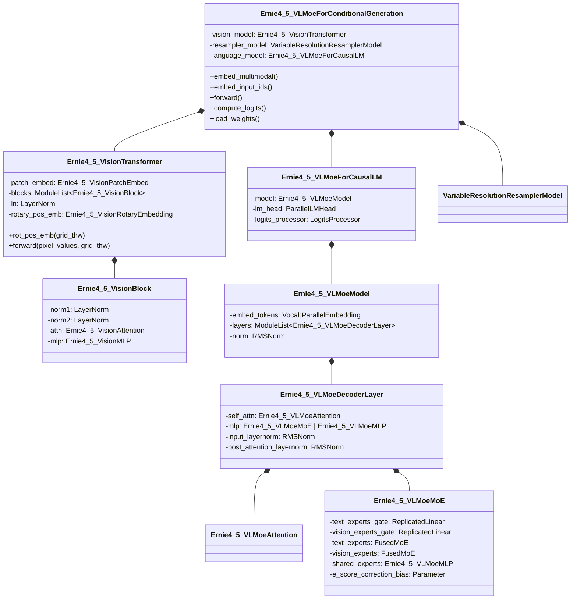

# vLLM ERNIE-4.5-VL 模型技术教程

> **文档版本**: 1.0
> **分析代码版本**: vLLM main 分支（截至 2025-06）
> **最后更新**: 2025-06-18
> **模型系列**: ERNIE 4.5
> **模型类型**: VLM-MoE（视觉语言异构混合专家模型）

---

## 文档概述

本文档深入剖析 ERNIE-4.5-VL 在 vLLM 中的完整技术实现，涵盖模型架构设计、多模态输入处理流程、ViT 视觉编码器计算细节、异构 MoE 路由机制，以及 vLLM 代码层面的关键实现。

**目标读者**：
- vLLM 贡献者：了解 ERNIE-4.5-VL 在 vLLM 中的代码结构，便于调试和优化
- 多模态模型研究者：理解异构 MoE 的视觉-语言融合策略
- 模型部署工程师：掌握模型配置和推理优化要点

**推荐阅读顺序**：第一部分（模型概述）→ 第五部分（ViT 计算流程，本文重点）→ 第二部分（架构详解）→ 第六部分（代码实现）→ 第三、四部分

---

# 第一部分: ERNIE-4.5-VL 模型系列概述与演进

## 1.1 模型系列发展历史

ERNIE（Enhanced Representation through kNowledge IntEgration）是百度自 2019 年迭代至今的大模型系列。ERNIE 4.5 于 2025 年 6 月发布，是该系列的重大里程碑——首次全面开源，涵盖从轻量级到旗舰级的完整模型矩阵。



ERNIE-4.5-VL 是 ERNIE 4.5 的多模态版本，核心设计理念是**模块化可拆卸架构**——移除 ViT 编码器、适配器和视觉专家后，模型退化为纯文本 ERNIE-4.5，实现了文本能力和多模态能力的优雅解耦。

## 1.2 同系列模型对比

| 模型名称 | 总参数量 | 激活参数量 | 隐藏维度 | 层数 | 注意力头 (Q/KV) | 上下文长度 | 核心创新点 | 架构类型 |
|---------|--------|-----------|---------|------|----------------|-----------|-----------|---------|
| ERNIE-4.5-VL-424B-A47B | 424B | 47B | 8,192 | 54 | 64/8 | 131K | 异构 MoE + 可变分辨率 ViT + 3D M-RoPE | VLM-MoE |
| ERNIE-4.5-VL-28B-A3B | 28B | 3B | 2,560 | 28 | 20/4 | 131K | 异构 MoE + 可变分辨率 ViT + 3D M-RoPE | VLM-MoE |

## 1.3 各模型能力对比

| 能力维度 | ERNIE-4.5-VL-424B-A47B | ERNIE-4.5-VL-28B-A3B |
|---------|------------------------|----------------------|
| 语言理解 | 旗舰级 | 高效级 |
| 多模态支持 | 图像 + 视频 | 图像 + 视频 |
| 推理模式 | 思考/非思考双模式 | 思考/非思考双模式 |
| ViT 参数 | ~630M | 同款 ViT（共享架构） |
| 文本专家（总数/激活） | 64/8 | 64/6 |
| 视觉专家（总数/激活） | 64/8 | 64/6 |
| 共享专家 | 2 | 2 |
| 单 GPU 部署 | 4×80GB (4-bit) | 1×80GB (BF16) |

## 1.4 技术报告与资源汇总

| 资源类型 | 链接 | 说明 |
|---------|------|------|
| 技术报告 | [ERNIE 4.5 Technical Report](https://yiyan.baidu.com/blog/publication/ERNIE_Technical_Report.pdf) | 官方技术报告（2025-06-29） |
| GitHub | [PaddlePaddle/ERNIE](https://github.com/PaddlePaddle/ERNIE) | 开源仓库（Apache 2.0） |
| HF 28B-A3B | [baidu/ERNIE-4.5-VL-28B-A3B-Thinking](https://huggingface.co/baidu/ERNIE-4.5-VL-28B-A3B-Thinking) | PyTorch Chat 模型 |
| vLLM 支持 | `vllm/model_executor/models/ernie45_vl.py` | vLLM 实现入口 |
| vLLM 文档 | [docs.vllm.ai](https://docs.vllm.ai/en/latest/models/supported_models/) | 官方支持模型列表 |

---

# 第二部分: ERNIE-4.5-VL 模型架构详解

## 2.1 整体架构概览

ERNIE-4.5-VL 采用**模块化异构 MoE 架构**，由三个核心子系统组成：ViT 视觉编码器、变量分辨率适配器（Resampler）、异构 MoE 语言模型主干。



> **关键洞察**: ERNIE-4.5-VL 的核心创新在于 **异构 MoE**——文本专家和视觉专家在同一个 MoE 层中共存，但具有不同的 FFN 中间维度（文本 1536 vs 视觉 512），且通过 `visual_token_mask` 实现模态隔离路由。这种设计避免了跨模态干扰，同时视觉专家仅 1/3 参数量，极大降低了视觉 token 的计算开销。

## 2.2 核心超参数

### ERNIE-4.5-VL-28B-A3B

| 参数 | 值 | 说明 |
|------|-----|------|
| Hidden Size | 2,560 | LLM 主干隐藏维度 |
| Num Layers | 28 | Transformer 层数 |
| Num Attention Heads (Q) | 20 | Query 头数 |
| Num KV Heads | 4 | Key/Value 头数 (GQA 5:1) |
| Head Dim | 128 | 每头维度 |
| Intermediate Size (Dense) | 12,288 | Dense FFN 中间维度 |
| Vocab Size | 103,424 | 词表大小 |
| Max Position Embeddings | 131,072 | 最大上下文长度 |
| Rope Theta | 500,000 | RoPE 基频 |
| Activation Function | SiLU (SwiGLU) | 激活函数 |
| Norm Type | RMSNorm | 归一化类型 |
| Norm Eps | 1e-5 | 归一化 epsilon |

### ERNIE-4.5-VL-424B-A47B

| 参数 | 值 | 说明 |
|------|-----|------|
| Hidden Size | 8,192 | LLM 主干隐藏维度 |
| Num Layers | 54 | Transformer 层数 |
| Num Attention Heads (Q) | 64 | Query 头数 |
| Num KV Heads | 8 | Key/Value 头数 (GQA 8:1) |
| Head Dim | 128 | 每头维度 |
| Intermediate Size (Dense) | 28,672 | Dense FFN 中间维度 |
| Vocab Size | 103,424 | 词表大小 |
| Max Position Embeddings | 131,072 | 最大上下文长度 |

### ViT 配置（两模型共享架构）

| 参数 | 值 | 说明 |
|------|-----|------|
| Patch Size | 14 | 每 patch 像素大小 |
| Embed Dim | 1,280 | ViT 嵌入维度 |
| Hidden Size | 1,280 | ViT 隐藏维度 |
| Depth | 32 | ViT 层数 |
| Num Heads | 16 | 注意力头数 |
| MLP Ratio | 4 | FFN 扩展比例 |
| Head Dim | 80 | ViT 每头维度 (=1280/16) |
| Activation | QuickGELU | ViT FFN 激活 |
| In Channels | 3 | RGB 输入 |
| Spatial Merge Size | 2 | 空间合并窗口 |
| Spatial Conv Size | 2 | 空间卷积窗口 |
| Temporal Conv Size | 2 | 时序卷积窗口 |

## 2.3 Attention 机制详解

### GQA (Grouped-Query Attention)

ERNIE-4.5-VL 采用分组查询注意力（GQA）以在推理效率和模型质量间取得平衡：

- **28B-A3B**: 20 Q heads / 4 KV heads = 5:1 压缩比
- **424B-A47B**: 64 Q heads / 8 KV heads = 8:1 压缩比

**KV Cache 计算**（28B-A3B, BF16）:
$$\text{KV Cache per token} = 2 \times \text{num\_kv\_heads} \times \text{head\_dim} \times \text{num\_layers} \times 2\text{ bytes}$$
$$= 2 \times 4 \times 128 \times 28 \times 2 = 57,344 \text{ bytes/token}$$

对于 131K 上下文，单请求 KV Cache 约 **7.2 GB**。

### 技术原理: 3D M-RoPE (Multi-dimensional Rotary Position Embedding)

ERNIE-4.5-VL 引入 **3D M-RoPE**——将旋转位置编码扩展到三个维度（时间 T、高度 H、宽度 W），编码视觉 token 的时空位置信息。

**频率分配**（`mrope_section = [22, 22, 20]`）：



- **高度维度 (H)**: 22 对频率分量（维度 0-43，步长 2 交错排列）
- **宽度维度 (W)**: 22 对频率分量（维度 1-43，步长 2 交错排列）
- **时间维度 (T)**: 20 对频率分量（维度 44-83，相邻排列）

**公式**：
$$\text{M-RoPE}(q, k, pos_h, pos_w, pos_t) = \text{ApplyRotary}(q, k, [freq_h(pos_h), freq_w(pos_w), freq_t(pos_t)])$$

其中每维度的频率分量独立计算，最终拼接为完整旋转矩阵。

与 Qwen2-VL 的 M-RoPE 对比：

| 维度 | Qwen2-VL M-RoPE | ERNIE 3D M-RoPE |
|------|----------------|-----------------|
| 频率分配 | 3-way 交错排列 | H/W 交错 + T 连续排布 |
| 时间维度 | 无 | 支持（20 对频率） |
| 旋转模式 | NORMAL | NORMAL |
| Section | `[16, 24, 24]` | `[22, 22, 20]` |

## 2.4 异构 MoE 机制详解

### 技术原理: Heterogeneous Multimodal MoE

ERNIE-4.5-VL 的 MoE 设计是其最核心的创新，与传统 MoE 的关键区别在于**专家异构化**和**模态隔离路由**。



**路由公式**：
$$y = \sum_{i \in \text{TopK}(g(x))} w_i \cdot E_i(x) + \sum_{j \in \text{Shared}} E_j(x)$$

其中 $g(x) = \text{softmax}(W_{\text{gate}} \cdot x + b_{\text{correction}})$ 为路由权重，$E_i$ 为第 i 个专家的 FFN，Shared 为共享专家集合。

**关键设计要点**：

1. **模态隔离路由**：文本 token 只经过文本 Gate 路由到文本专家；视觉 token 只经过视觉 Gate 路由到视觉专家。两者互不干扰，避免跨模态表示冲突。

2. **异构中间维度**：
   - 文本专家 `intermediate_size = 1536`（标准 SwiGLU FFN）
   - 视觉专家 `intermediate_size = 512`（约 1/3，减少 ~66% FLOPs）
   - 视觉 token 通常数量庞大（每张图可产生数百个 token），小专家设计显著降低视觉部分计算量

3. **e_score_correction_bias**：独立的专家分数修正偏置，形状 `[2, 64]`（2 组分别对应文本和视觉），用于辅助损失无关的负载均衡。

4. **MoE 层交错排列**：前几层为 Dense FFN（`moe_layer_start_index=[1, 1]`），之后每层均为 MoE（`moe_layer_interval=1`）。

| 维度 | 文本专家 | 视觉专家 | 共享专家 |
|------|---------|---------|---------|
| 数量 (28B) | 64 (Top-6) | 64 (Top-6) | 2 (始终激活) |
| 数量 (424B) | 64 (Top-8) | 64 (Top-8) | 2 (始终激活) |
| Intermediate Size | 1,536 | 512 | 1,536 × 2 |
| Gate 权重 | `text_experts_gate` (2560→64) | `vision_experts_gate` (2560→64) | 无 Gate |
| 激活函数 | SiLU (SwiGLU) | SiLU (SwiGLU) | SiLU (SwiGLU) |

## 2.5 其他关键技术组件

### RMSNorm 残差连接模式

ERNIE-4.5-VL 使用 vLLM 中常见的 pre-norm + 残差模式：

```python
# 文件: vllm/model_executor/models/ernie45_vl_moe.py
# Ernie4_5_VLMoeDecoderLayer.forward()
if residual is None:
    residual = hidden_states
    hidden_states = self.input_layernorm(hidden_states)
else:
    hidden_states, residual = self.input_layernorm(hidden_states, residual)
```

### SwiGLU FFN

所有专家 FFN 均使用 SwiGLU 激活（gate + up 双线性投影 + SiLU 门控）：

$$\text{SwiGLU}(x) = (xW_{\text{gate}} \odot \text{SiLU}(xW_{\text{up}}))W_{\text{down}}$$

vLLM 中使用 `MergedColumnParallelLinear` 将 gate 和 up 合并为单次矩阵乘法，通过 `SiluAndMul` 激活函数实现高效计算。

### tie_word_embeddings

模型采用 `tie_word_embeddings=True`，即 `lm_head.weight = embed_tokens.weight`，节省约 103,424 × 2,560 ≈ 265M 参数。

---

# 第三部分: 输入预处理流程

## 3.1 文本预处理


ERNIE-4.5-VL 使用自定义特殊 token 标记多模态内容的边界：

| 特殊 Token | Token ID | 用途 |
|-----------|----------|------|
| `<\|IMAGE_START\|>` | 101304 | 图像区域开始标记 |
| `<\|IMAGE_END\|>` | 101305 | 图像区域结束标记 |
| `<\|VIDEO_START\|>` | 101306 | 视频区域开始标记 |
| `<\|VIDEO_END\|>` | 101307 | 视频区域结束标记 |
| `<\|image@placeholder\|>` | - | 图像占位符（预处理阶段） |
| `<\|video@placeholder\|>` | - | 视频占位符（预处理阶段） |
| `<\|IMAGE_PLACEHOLDER\|>` | 100295 (`im_patch_id`) | 最终图像 patch 占位符 |

## 3.2 多模态输入处理（核心流程）

ERNIE-4.5-VL 的多模态处理是本教程的重点。下面是完整的端到端处理管道：



### 3.2.1 Smart Resize（智能尺寸调整）

`smart_resize` 函数是预处理的第一站，负责将任意分辨率的图像调整到适合 ViT 处理的尺寸：

```python
# 文件: vllm/model_executor/models/ernie45_vl.py
def smart_resize(height, width, factor=28, min_pixels=4*28*28, max_pixels=16384*28*28):
    MAX_RATIO = 200
    # 步骤1: 极端宽高比裁剪
    if max(height, width) / min(height, width) > MAX_RATIO:
        # 限制宽高比不超过 200:1
        ...

    # 步骤2: 按 factor=28 向上取整
    h_bar = max(factor, round_by_factor(height, factor))
    w_bar = max(factor, round_by_factor(width, factor))

    # 步骤3: 根据 max_pixels/min_pixels 缩放
    if h_bar * w_bar > max_pixels:
        beta = sqrt((height * width) / max_pixels)
        h_bar = floor_by_factor(height / beta, factor)
        w_bar = floor_by_factor(width / beta, factor)
    elif h_bar * w_bar < min_pixels:
        beta = sqrt(min_pixels / (height * width))
        h_bar = ceil_by_factor(height * beta, factor)
        w_bar = ceil_by_factor(width * beta, factor)

    return h_bar, w_bar
```

> **注意**: `factor=28` 由 `patch_size (14) × spatial_conv_size (2) = 28` 决定，确保最终 token 数为整数。

### 3.2.2 多模态占位符替换机制

预处理阶段使用两级占位符系统：

1. **before_placeholder** → 用户 prompt 中插入的临时占位符：
   - 图像: `<|image@placeholder|>`
   - 视频: `<|video@placeholder|>`

2. **after_placeholder** → 替换为实际的视觉 token 占位符：
   - `<|IMAGE_PLACEHOLDER|>` × N（N = 视觉 token 数）

```python
# 文件: vllm/model_executor/models/ernie45_vl.py
def get_replacement_ernie45vl(item_idx, modality):
    grid_thw = out_item[f"{modality}_grid_thw"]
    if modality == "video":
        num_tokens = int(grid_thw.prod()) // temporal_conv_size // merge_length
    else:
        num_tokens = int(grid_thw.prod()) // merge_length
    return after_placeholder[modality] * num_tokens
```

视觉 token 数量计算公式：

**图像**: $\text{num\_image\_tokens} = \frac{h \times w}{patch\_size^2 \times spatial\_conv\_size^2} = \frac{h \times w}{14^2 \times 4}$

**视频**: $\text{num\_video\_tokens} = \frac{t \times h \times w}{patch\_size^2 \times spatial\_conv\_size^2 \times temporal\_conv\_size} = \frac{t \times h \times w}{14^2 \times 4 \times 2}$

### 3.2.3 visual_token_mask 生成

`visual_token_mask` 是多模态路由的关键数据结构，标记每个 token 属于文本还是视觉模态：

```python
# 文件: vllm/model_executor/models/ernie45_vl.py
def _set_visual_token_mask(self, input_ids):
    visual_token_ids_tensor = torch.tensor([
        config.im_patch_id,           # 100295 (IMAGE_PLACEHOLDER)
        config.image_start_token_id,  # 101304
        config.image_end_token_id,    # 101305
        config.video_start_token_id,  # 101306
        config.video_end_token_id,    # 101307
    ])
    self.visual_token_mask = torch.isin(input_ids, visual_token_ids_tensor).reshape(-1, 1)
```

该 mask 在 `Ernie4_5_VLMoeMoE.forward()` 中用于决定路由策略：
- `mask.all()` → 纯视觉输入，只用视觉专家
- `mask.any()` → 混合输入，按 mask 分别路由
- 否则 → 纯文本输入，只用文本专家

### 3.2.4 像素值归一化

```python
# 文件: vllm/model_executor/models/ernie45_vl.py
def _pixel_values_norm(self, pixel_values, mm_kwargs):
    # 对每 patch 应用: (rescale * pixel - mean) / std
    pixel_values = (rescale_factor * pixel_values.to(float32) - image_mean) / image_std
    return pixel_values.to(hf_config.dtype)
```

> **注意**: 归一化在 patch flatten 之后进行，`mean/std` 按 patch 内像素重复（`repeat_interleave(patch_size²)`），而不是使用标准的逐通道归一化。

## 3.3 Tokenizer 配置

| 配置项 | 值 | 说明 |
|--------|-----|------|
| Tokenizer Type | SentencePiece (BPE) | tokenizer.model 文件 |
| Vocab Size | 103,424 | - |
| Pad Token | 0 | `<pad>` |
| BOS Token | 1 | `<s>` |
| EOS Token | 2 | `</s>` |
| IM Patch ID | 100,295 | 图像 patch 占位 token |
| Image Start | 101,304 | `<\|IMAGE_START\|>` |
| Image End | 101,305 | `<\|IMAGE_END\|>` |
| Video Start | 101,306 | `<\|VIDEO_START\|>` |
| Video End | 101,307 | `<\|VIDEO_END\|>` |
| Chat Template | 自定义 | 通过 `trust_remote_code=True` 加载 |

---

# 第四部分: 模型前向传播流程

## 4.1 整体 Forward 流程



## 4.2 单层 Transformer 计算流程

### Step 1: Pre-Norm + Self-Attention

- Input shape: `[batch, seq_len, hidden_size]`
- 经过 `input_layernorm (RMSNorm)` → `self_attn`
- QKV 投影: `QKVParallelLinear(hidden_size → q_size + kv_size + kv_size)`
- 3D M-RoPE 应用于 Q 和 K（完整 `head_dim=128`，无 pass-through 维度）
- Attention 使用 vLLM 的 `Attention` 后端（PagedAttention / Flash Attention）

### Step 2: Post-Norm + FFN/MoE

- 经过 `post_attention_layernorm (RMSNorm)` → `mlp`
- 使用 `visual_token_mask` 决定路由策略

### Tensor Shape 追踪 (28B-A3B)

| 阶段 | 形状 |
|------|------|
| Hidden States | `[batch, seq_len, 2560]` |
| Q 投影 | `[batch × seq_len, 20 × 128]` |
| K/V 投影 | `[batch × seq_len, 4 × 128]` |
| Attention Output | `[batch, seq_len, 2560]` |
| Gate Logits (文本) | `[N_text, 64]` |
| Gate Logits (视觉) | `[N_vision, 64]` |
| Expert FFN (文本) | `2560 → 1536 × 2 (gate+up) → 2560` |
| Expert FFN (视觉) | `2560 → 512 × 2 (gate+up) → 2560` |
| Layer Output | `[batch, seq_len, 2560]` |

## 4.3 vLLM 中的优化

### PagedAttention

标准的 vLLM PagedAttention 支持，KV Cache 分块管理，支持 prefix caching 和 chunked prefill。

### MoE 优化

- 使用 vLLM 的 `FusedMoE` 层，支持 fused expert kernel
- Expert Parallelism (EP) + Tensor Parallelism (TP) 混合并行
- 支持 EPLB (Expert Parallelism Load Balancing)

### Pipeline Parallelism

通过 `SupportsPP` 接口和 `make_empty_intermediate_tensors_factory` 支持流水线并行，中间状态为 `{"hidden_states", "residual"}`。

### torch.compile 限制

由于异构 MoE 的 `visual_token_mask` 动态路由机制，当前 VL 模型**不支持** `torch.compile`（见代码中被注释的 `@support_torch_compile` 装饰器）。

---

# 第五部分: ViT 计算流程（重点详解）

这是本文档的核心部分，深入分析 ERNIE-4.5-VL 的视觉编码器处理管道。

## 5.1 ViT 架构概览



## 5.2 Patch Embedding 详解

```python
# 文件: vllm/model_executor/models/ernie45_vl.py
class Ernie4_5_VisionPatchEmbed(nn.Module):
    def __init__(self, patch_size=14, in_channels=3, embed_dim=1280):
        self.proj = nn.Linear(in_channels * patch_size * patch_size, embed_dim, bias=False)
        # Linear(588, 1280), 无 bias
```

图像首先被切分为 14×14 的 patch，每个 patch 展平为 3×14×14=588 维向量，然后通过线性投影映射到 1280 维嵌入空间。

**Patch 数量计算**（单张图像）：
$$\text{num\_patches} = \frac{h}{14} \times \frac{w}{14}$$

例如，一张 560×560 的图像产生 40×40=1600 个 patch。

## 5.3 ViT 中的 2D Rotary Position Embedding

ViT 使用独立的 **2D RoPE**，仅编码高度和宽度位置（无时间维度）：

```python
# 文件: vllm/model_executor/models/ernie45_vl.py
class Ernie4_5_VisionRotaryEmbedding(nn.Module):
    def __init__(self, dim=40, theta=10000.0):  # dim = head_dim/2 = 80/2 = 40
        self.inv_freq = 1.0 / theta ** (arange(0, dim, 2, dtype=float32) / dim)

    def forward(self, seqlen):
        seq = arange(seqlen, dtype=float32)
        freqs = outer(seq, self.inv_freq)
        return freqs
```

位置索引通过 `rot_pos_emb` 方法计算，支持 Variable Resolution 的 2×2 spatial merge：

```python
# 文件: vllm/model_executor/models/ernie45_vl.py
def rot_pos_emb(self, grid_thw):
    pos_ids = []
    for t, h, w in grid_thw:
        hpos_ids = arange(h).unsqueeze(1).expand(-1, w)
        wpos_ids = arange(w).unsqueeze(0).expand(h, -1)
        # 按 spatial_merge_size=2 重组为 2×2 blocks
        hpos_ids = hpos_ids.reshape(h//2, 2, w//2, 2).permute(0,2,1,3).flatten()
        wpos_ids = wpos_ids.reshape(h//2, 2, w//2, 2).permute(0,2,1,3).flatten()
        pos_ids.append(stack([hpos_ids, wpos_ids], dim=-1).repeat(t, 1))
    pos_ids = cat(pos_ids, dim=0)
    rotary_pos_emb_full = self.rotary_pos_emb(max_grid_size)
    rotary_pos_emb = rotary_pos_emb_full[pos_ids].flatten(1)
    return rotary_pos_emb
```

> **关键细节**: spatial_merge_size=2 意味着位置编码在 2×2 的 patch 组内共享同一个位置索引。这是为了配合下游 Resampler 的 2×2 空间合并操作。

## 5.4 ViT Encoder 计算流程

### VisionAttention 详解

```python
# 文件: vllm/model_executor/models/ernie45_vl.py
class Ernie4_5_VisionAttention(nn.Module):
    def __init__(self, embed_dim=1280, num_heads=16, projection_size=1280):
        # QKV 联合投影: 1280 → 3 × 16 × 80 = 3840
        self.qkv = QKVParallelLinear(embed_dim, head_size=80, total_num_heads=16,
                                      total_num_kv_heads=16, bias=True)
        # Output 投影: 1280 → 1280
        self.proj = RowParallelLinear(1280, 1280)
        # 使用 MMEncoderAttention（区别于 LLM 的 Attention）
        self.attn = MMEncoderAttention(num_heads=16//TP, head_size=80, scale=80**-0.5)
```

**关键点**：
- VisionAttention 使用的是 `MMEncoderAttention`，这是 vLLM 为编码器场景特化的 Attention 实现
- QKV 投影包含 bias（`bias=True`），与 LLM 主干不同
- 支持 Tensor Parallelism（通过 `QKVParallelLinear` 和 TP-aware 的 `split_qkv`）
- 2D RoPE 通过 `ApplyRotaryEmb` 在 Q/K 合并后统一应用

### VisionBlock 完整前向传播

```python
# 文件: vllm/model_executor/models/ernie45_vl.py
class Ernie4_5_VisionBlock(nn.Module):
    def forward(self, hidden_states, cu_seqlens, rotary_pos_emb, max_seqlen):
        # 1. Pre-norm + Attention + Residual
        hidden_states = hidden_states + self.attn(
            self.norm1(hidden_states),
            cu_seqlens=cu_seqlens,
            rotary_pos_emb=rotary_pos_emb,
            max_seqlen=max_seqlen,
        )
        # 2. Post-norm + MLP + Residual
        hidden_states = hidden_states + self.mlp(self.norm2(hidden_states))
        return hidden_states
```

### ViT 整体前向传播

```python
# 文件: vllm/model_executor/models/ernie45_vl.py
class Ernie4_5_VisionTransformer(nn.Module):
    def forward(self, hidden_states, grid_thw, num_pad=0):
        # 1. Patch Embedding: [N, 588] → [N, 1280]
        hidden_states = self.patch_embed(hidden_states)

        # 2. 计算 2D RoPE
        rotary_pos_emb = self.rot_pos_emb(grid_thw)

        # 3. 构建 cu_seqlens（变长序列支持）
        cu_seqlens = repeat_interleave(
            grid_thw[:, 1] * grid_thw[:, 2], grid_thw[:, 0]
        ).cumsum(dim=0, dtype=int32)
        cu_seqlens = cat([zeros(1), cu_seqlens])

        # 4. 添加 batch 维度: [S, 1280] → [S, 1, 1280]
        if hidden_states.ndim == 2:
            hidden_states = hidden_states.unsqueeze(dim=1)

        # 5. 预计算 max_seqlen（用于 Flash Attention）
        max_seqlen = self.compute_attn_mask_seqlen(cu_seqlens)

        # 6. 逐层处理（共 32 层）
        for blk in self.blocks:
            hidden_states = blk(hidden_states, cu_seqlens, rotary_pos_emb, max_seqlen)

        # 7. 最终 LayerNorm
        return self.ln(hidden_states).squeeze(dim=1)
```

### Tensor Shape 追踪（ViT 阶段）

| 阶段 | 形状 | 说明 |
|------|------|------|
| 原始 Patches | `[N_patches, 588]` | N_patches = total patches over batch |
| Patch Embedded | `[N_patches, 1280]` | 投影到 ViT 维度 |
| 添加 Batch 维 | `[N_patches, 1, 1280]` | 适应 MMEncoderAttention |
| Q 投影 | `[N_patches, 1, 16×80=1280]` | 16 heads × 80 head_dim |
| K 投影 | `[N_patches, 1, 16×80=1280]` | MHA（非 GQA） |
| V 投影 | `[N_patches, 1, 16×80=1280]` | MHA（非 GQA） |
| 2D RoPE Applied | Q, K: `[N_patches, 1, 16, 80]` | 旋转前 80 维（全部） |
| Attention Output | `[N_patches, 1, 1280]` | 每 token 输出 |
| ViT Output | `[N_patches, 1280]` | squeeze batch 维度 |

## 5.5 视觉-语言融合策略（Resampler 详解）

变量分辨率重采样器（VariableResolutionResamplerModel）是连接 ViT 和 LLM 的关键桥梁：



### 代码实现关键路径

```python
# 文件: vllm/model_executor/models/ernie45_vl.py
class VariableResolutionResamplerModel(nn.Module):
    def __init__(self, in_dim=1280, out_dim=2560, spatial_conv_size=2,
                 temporal_conv_size=2, config=None):
        # 空间合并维度: 1280 × 2 × 2 = 5120
        self.spatial_dim = in_dim * spatial_conv_size * spatial_conv_size

        # 时序合并维度: 1280 × 2 × 2 × 2 = 10240
        self.temporal_dim = in_dim * spatial_conv_size * spatial_conv_size * temporal_conv_size

        # 空间路径
        self.spatial_linear1 = ColumnParallelLinear(5120, 5120, bias=True)
        self.spatial_gelu = nn.GELU()
        self.spatial_linear2 = ColumnParallelLinear(5120, 5120, bias=True)
        self.spatial_norm = nn.LayerNorm(5120)

        # 时序路径（可选）
        if self.use_temporal_conv:
            self.temporal_linear1 = ColumnParallelLinear(10240, 5120, bias=True)
            self.temporal_gelu = nn.GELU()
            self.temporal_linear2 = ColumnParallelLinear(5120, 5120, bias=True)
            self.temporal_norm = nn.LayerNorm(5120)

        # 最终投影到 LLM 维度
        self.mlp = ColumnParallelLinear(5120, 2560, bias=True)
        self.after_norm = RMSNorm(2560)
```

### 时序重排逻辑（`fwd_placeholder`）

视频帧交替采样并按时间步拼接：

```python
# 简化示意
# 输入: frame_0_patches, frame_1_patches, frame_2_patches, frame_3_patches ...
# 输出: concat([frame_0_patches, frame_1_patches], dim=-1),
#       concat([frame_2_patches, frame_3_patches], dim=-1), ...
```

每次取相邻两帧的空间位置对应的 token，在特征维度拼接，实现时序信息融合。

### Token 压缩率

| 阶段 | 操作 | Token 压缩比 |
|------|------|-------------|
| Patch Embedding | 14×14 patch → 1 token | 196:1 (像素→token) |
| Spatial Merge | 2×2 空间合并 | 4:1 |
| 总计（图像） | - | **784:1** (像素→视觉 token) |
| Temporal Merge | 2 帧合并 | 2:1 (额外) |
| 总计（视频） | - | **1568:1** (像素×帧→视觉 token) |

---

# 第六部分: vLLM 中的代码实现

## 6.1 模型注册与配置

```python
# 文件: vllm/model_executor/models/ernie45_vl.py
@MULTIMODAL_REGISTRY.register_processor(
    Ernie4_5VLMultiModalProcessor,
    info=Ernie4_5_VLProcessingInfo,
    dummy_inputs=Ernie4_5_VLDummyInputsBuilder,
)
class Ernie4_5_VLMoeForConditionalGeneration(
    nn.Module, SupportsMultiModal, SupportsLoRA, SupportsPP, SupportsMRoPE
):
```

模型通过 `MULTIMODAL_REGISTRY.register_processor` 注册，同时注册：
- **MultiModalProcessor**: `Ernie4_5VLMultiModalProcessor` —— 处理多模态数据的预处理
- **ProcessingInfo**: `Ernie4_5_VLProcessingInfo` —— 提供图像/视频 token 计数等元信息
- **DummyInputsBuilder**: `Ernie4_5_VLDummyInputsBuilder` —— 用于 memory profiling 的虚拟输入

## 6.2 核心模型类分析



## 6.3 关键计算流程代码分析

### 6.3.1 多模态嵌入生成

```python
# 文件: vllm/model_executor/models/ernie45_vl.py
def embed_multimodal(self, **kwargs):
    modalities = self._parse_and_validate_multimodal_inputs(**kwargs)

    for modality in modalities:
        if modality == "images":
            # 1. ViT 前向: 原始像素 → 视觉特征
            image_features = self._vision_forward(
                pixel_values=image_input["pixel_values"],
                grid_thw=image_input["image_grid_thw"],
            )
            # 2. Resampler: 视觉特征 → LLM 嵌入
            image_embeds = self.resampler_model(image_features, grid_thw)
            # 3. 按图像拆分
            multimodal_embeddings += image_embeds.split(sizes.tolist())

        if modality == "videos":
            # 视频处理流程相同，仅 grid_thw 和 split 逻辑不同
            video_features = self._vision_forward(
                pixel_values=video_input["pixel_values_videos"],
                grid_thw=video_input["video_grid_thw"],
            )
            video_embeds = self.resampler_model(video_features, grid_thw)
            multimodal_embeddings += video_embeds.split(sizes.tolist())

    return multimodal_embeddings
```

### 6.3.2 异构 MoE 前向传播

```python
# 文件: vllm/model_executor/models/ernie45_vl_moe.py
class Ernie4_5_VLMoeMoE(nn.Module):
    def forward(self, hidden_states, visual_token_mask):
        if visual_token_mask is not None and visual_token_mask.all():
            # 情况1: 纯视觉输入
            router_logits = self.vision_experts_gate(hidden_states)
            final_hidden_states = self.vision_experts(
                hidden_states=hidden_states, router_logits=router_logits)

        elif visual_token_mask is not None and visual_token_mask.any():
            # 情况2: 混合输入 —— 分别路由
            text_hidden_states = hidden_states[~visual_token_mask]  # 文本 tokens
            vision_hidden_states = hidden_states[visual_token_mask]  # 视觉 tokens

            # 文本 tokens → 文本专家
            text_router_logits = self.text_experts_gate(text_hidden_states)
            text_output = self.text_experts(text_hidden_states, text_router_logits)

            # 视觉 tokens → 视觉专家
            vision_router_logits = self.vision_experts_gate(vision_hidden_states)
            vision_output = self.vision_experts(vision_hidden_states, vision_router_logits)

            # 合并回原序列位置
            final_hidden_states[~visual_token_mask] = text_output.flatten()
            final_hidden_states[visual_token_mask] = vision_output.flatten()

        else:
            # 情况3: 纯文本输入
            router_logits = self.text_experts_gate(hidden_states)
            final_hidden_states = self.text_experts(hidden_states, router_logits)

        return final_hidden_states
```

### 6.3.3 M-RoPE 位置编码计算

```python
# 文件: vllm/model_executor/models/ernie45_vl.py
def get_mrope_input_positions(self, input_tokens, mm_features):
    llm_pos_ids_list = []
    st = 0

    for offset, llm_grid_t, llm_grid_h, llm_grid_w in self.iter_mm_grid_thw(mm_features):
        # 文本段: 直接递增的 3D 位置 ID
        text_len = offset - st
        st_idx = llm_pos_ids_list[-1].max() + 1 if llm_pos_ids_list else 0
        llm_pos_ids_list.append(broadcast_to(arange(text_len), (3, text_len)) + st_idx)

        # 视觉段: 3D 网格位置 ID
        grid_indices = indices((llm_grid_t, llm_grid_h, llm_grid_w)).reshape(3, -1)
        llm_pos_ids_list.append(grid_indices + text_len + st_idx)
        st = offset + llm_grid_t * llm_grid_h * llm_grid_w

    llm_positions = concatenate(llm_pos_ids_list, axis=1).reshape(3, -1)
    return torch.from_numpy(llm_positions), mrope_position_delta
```

### 6.3.4 权重加载与映射

模型在权重加载时需要进行复杂的名称映射，特别是将 HF checkpoint 的单一 expert 结构映射到 vLLM 的文本/视觉双专家结构：

```python
# 文件: vllm/model_executor/models/ernie45_vl.py
hf_to_vllm_mapper = WeightsMapper(
    orig_to_new_prefix={
        "lm_head.": "language_model.lm_head.",
        "model.": "language_model.model.",
        "language_model.model.resampler_model.": "resampler_model.",
    },
    orig_to_new_substr={
        "spatial_linear.0.": "spatial_linear1.",
        "spatial_linear.2.": "spatial_linear2.",
        "spatial_linear.3.": "spatial_norm.",
        "temporal_linear.0.": "temporal_linear1.",
        "temporal_linear.2.": "temporal_linear2.",
        "temporal_linear.3.": "temporal_norm.",
    },
)
```

在 `Ernie4_5_VLMoeForCausalLM.load_weights()` 中，关键逻辑是将 checkpoint 中统一的 `mlp.experts` 权重按编号区分，分别加载到 `text_experts` 或 `vision_experts`：

```python
# 文件: vllm/model_executor/models/ernie45_vl_moe.py
if "mlp.experts" in name:
    moe_offset = int(name.split(".")[-3])
    vision_expert_start_idx = self.config.moe_num_experts[0]  # 64
    is_text_expert = moe_offset <= vision_expert_start_idx - 1
    if is_text_expert:
        name = name.replace(".experts", f".text_experts{routed_experts}")
    else:
        delta = moe_offset - vision_expert_start_idx
        name = name.replace(f".experts.{moe_offset}",
                           f".vision_experts{routed_experts}.{delta}")
```

## 6.4 vLLM 特有优化

### 张量并行支持

- ViT 的 `VisionAttention` 支持 TP（`QKVParallelLinear` + TP-aware split_qkv）
- LLM 的 Attention 支持 TP（标准的 vLLM QKV partitioning）
- MoE 的 `FusedMoE` 支持 TP + EP 混合并行

### 多模态注册系统

使用 vLLM 的 `MULTIMODAL_REGISTRY` 统一管理多模态处理的三个组件（Processor / Info / DummyInputs），实现与 vLLM 调度器、Memory Profiler 的无缝集成。

### SupportsMRoPE 接口

实现 `SupportsMRoPE` 接口，提供 `get_mrope_input_positions()` 方法，使 vLLM 调度器能正确处理 3D 位置编码的序列组装。

---

# 附录

## A. 关键代码位置索引

| 组件 | 文件路径 | 关键类/函数 |
|------|---------|------------|
| VL 模型入口 | `vllm/model_executor/models/ernie45_vl.py` | `Ernie4_5_VLMoeForConditionalGeneration` |
| VL MoE 主干 | `vllm/model_executor/models/ernie45_vl_moe.py` | `Ernie4_5_VLMoeForCausalLM` |
| ViT 编码器 | `vllm/model_executor/models/ernie45_vl.py` | `Ernie4_5_VisionTransformer` |
| ViT Attention | `vllm/model_executor/models/ernie45_vl.py` | `Ernie4_5_VisionAttention` |
| ViT MLP | `vllm/model_executor/models/ernie45_vl.py` | `Ernie4_5_VisionMLP` |
| Resampler | `vllm/model_executor/models/ernie45_vl.py` | `VariableResolutionResamplerModel` |
| 异构 MoE 层 | `vllm/model_executor/models/ernie45_vl_moe.py` | `Ernie4_5_VLMoeMoE` |
| Decoder Layer | `vllm/model_executor/models/ernie45_vl_moe.py` | `Ernie4_5_VLMoeDecoderLayer` |
| VL Attention | `vllm/model_executor/models/ernie45_vl_moe.py` | `Ernie4_5_VLMoeAttention` |
| 3D M-RoPE | `vllm/model_executor/layers/rotary_embedding/ernie45_vl_rope.py` | `Ernie4_5_VLRotaryEmbedding` |
| 多模态 Processor | `vllm/model_executor/models/ernie45_vl.py` | `Ernie4_5VLMultiModalProcessor` |
| Processing Info | `vllm/model_executor/models/ernie45_vl.py` | `Ernie4_5_VLProcessingInfo` |
| 纯文本模型 | `vllm/model_executor/models/ernie45.py` | `Ernie4_5ForCausalLM` (继承 Llama) |
| 纯 MoE 模型 | `vllm/model_executor/models/ernie45_moe.py` | `Ernie4_5_MoeMoE` |

## B. 术语表

| 术语 | 英文 | 说明 |
|------|------|------|
| 多头注意力 | MHA | Multi-Head Attention — ViT 中使用（16 头，无 KV 压缩） |
| 分组查询注意力 | GQA | Grouped-Query Attention — LLM 中使用（Q:K = 5:1 或 8:1） |
| 混合专家 | MoE | Mixture of Experts — 稀疏激活的 FFN 替代方案 |
| 异构 MoE | Heterogeneous MoE | 不同类型专家共存（文本/视觉专家不同 intermediate_size） |
| 模态隔离路由 | Modality-Isolated Routing | 文本/视觉 token 分别路由到各自的专家池 |
| 旋转位置编码 | RoPE | Rotary Position Embedding |
| 多维 RoPE | M-RoPE | Multi-dimensional RoPE — 编码 3D (T,H,W) 位置 |
| 视觉 Transformer | ViT | Vision Transformer |
| 变量分辨率 | Variable Resolution | 支持不同尺寸/宽高比输入，动态调整 token 数 |
| SwiGLU | SwiGLU | SiLU-gated Linear Unit — FFN 激活函数 |
| 均方根归一化 | RMSNorm | Root Mean Square Normalization |
| QuickGELU | QuickGELU | GELU 的快速近似 — ViT FFN 激活 |
| 重采样器 | Resampler | 将 ViT 特征投影到 LLM 嵌入空间的适配器 |
| 专家并行 | EP | Expert Parallelism — 将 MoE 专家分布到多 GPU |
| 流水线并行 | PP | Pipeline Parallelism — 将模型层分布到多 GPU |

## C. Mermaid 图总结

| 编号 | 图表标题 | 类型 |
|------|---------|------|
| 1 | ERNIE 模型系列演进 | timeline |
| 2 | 整体架构概览 | flowchart TB (含 4 个 subgraph) |
| 3 | GQA/M-RoPE 频率分配 | flowchart LR |
| 4 | 异构 MoE 路由机制 | flowchart TB (含 5 个 subgraph) |
| 5 | 输入预处理流程 | flowchart TB (含 4 个 stage subgraph) |
| 6 | ViT 架构概览 | flowchart TB (含 3 个 subgraph) |
| 7 | Resampler 空间/时序压缩 | flowchart TB (含 4 个 subgraph) |
| 8 | 模型整体 Forward 流程 | flowchart TB (含 subgraph) |
| 9 | 类层次结构 | classDiagram |

## D. 参考资料

- [ERNIE 4.5 Technical Report](https://yiyan.baidu.com/blog/publication/ERNIE_Technical_Report.pdf) — 百度官方技术报告（2025-06-29）
- [PaddlePaddle/ERNIE GitHub](https://github.com/PaddlePaddle/ERNIE) — 开源仓库
- [baidu/ERNIE-4.5-VL-28B-A3B-Thinking (HF)](https://huggingface.co/baidu/ERNIE-4.5-VL-28B-A3B-Thinking) — HuggingFace 模型
- [vLLM ernie45_vl.py](https://github.com/vllm-project/vllm/blob/main/vllm/model_executor/models/ernie45_vl.py) — vLLM VL 模型实现
- [vLLM ernie45_vl_moe.py](https://github.com/vllm-project/vllm/blob/main/vllm/model_executor/models/ernie45_vl_moe.py) — vLLM VL MoE 主干实现
- [LLM Architecture Gallery](https://sebastianraschka.com/llm-architecture-gallery/) — 模型架构对比参考
- [ERNIE-4.5-VL-28B-A3B 规格](https://apxml.com/zh/models/ernie-45-vl-28b-a3b) — GPU 显存需求参考
