# vLLM Gemma3 模型技术教程

> **文档版本**: 1.0
> **分析代码版本**: vLLM main 分支（截至 2025-06）
> **最后更新**: 2025-06-15
> **模型系列**: Gemma（Google DeepMind）
> **模型类型**: VLM（Vision-Language Model, Dense Decoder + ViT Encoder）

---

## 文档概述

本文档深入分析 Google DeepMind 的 Gemma3 系列模型在 vLLM 中的实现，重点关注其**多模态输入处理流程**和 **ViT（SigLIP Vision Transformer）计算流程**。文档覆盖 Gemma3 全系列四个规格（1B / 4B / 12B / 27B），从模型架构、输入预处理、前向传播到 vLLM 代码实现进行系统性拆解。

**目标读者**：
- 希望在 vLLM 中部署或调试 Gemma3 的工程师
- 对多模态 LLM 架构感兴趣的研究者
- 需要为 Gemma3 贡献代码的 vLLM 开发者

**推荐阅读顺序**：
1. 先读第一部分了解模型系列全貌
2. 再读第二、五部分理解架构核心（ViT + LLM）
3. 最后读第三、四、六部分深入预处理流程和代码实现

---

# 第一部分: Gemma3 模型系列概述与演进

## 1.1 模型系列发展历史

Gemma 是 Google DeepMind 推出的轻量级开源模型系列，基于 Gemini 技术栈构建。Gemma3 是该系列的第三代，首次引入多模态能力。

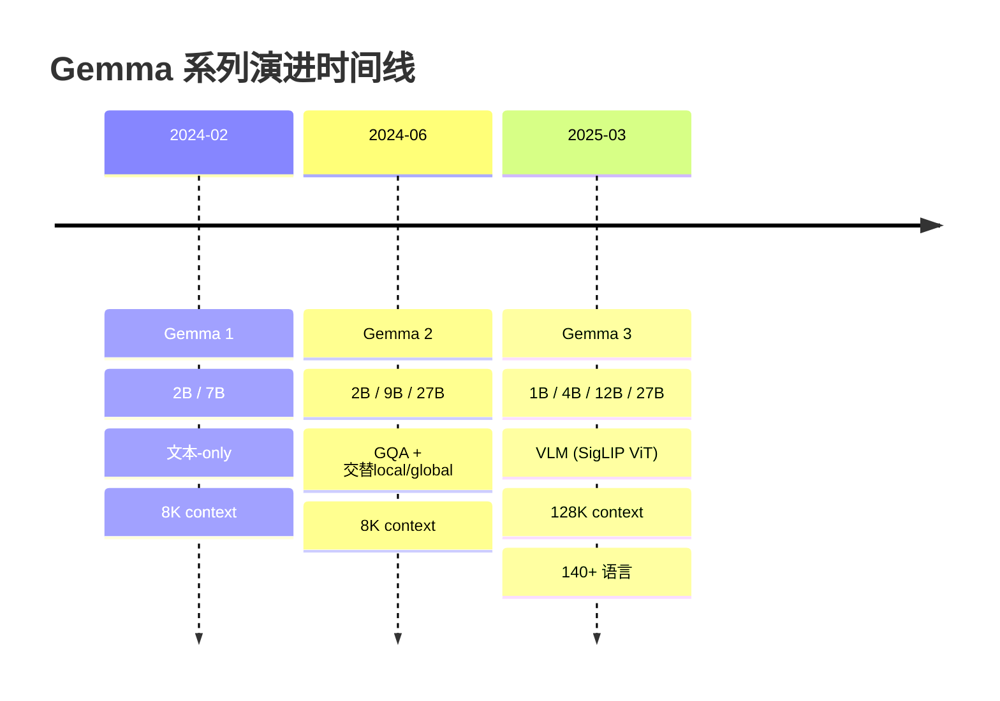

**Gemma1** 是纯文本模型，采用标准 MHA/MQA 架构。**Gemma2** 引入了 GQA 和交替式 local/global attention（1:1 比例），以及 logits soft-capping。**Gemma3** 在此基础上进行了大规模升级：视觉编码器、5:1 混合注意力、QK-Norm、RoPE 双频率设计、128K 长上下文。

## 1.2 同系列模型对比

| 模型名称 | 参数量 | 发布日期 | 核心创新点 | 架构类型 | 上下文长度 | 技术报告 | HuggingFace |
|---------|--------|---------|-----------|---------|-----------|---------|------------|
| Gemma 1 2B | 2B | 2024-02 | 首个 Gemma 系列 | Dense LLM | 8K | [Paper](https://arxiv.org/abs/2402.16828) | [HF](https://huggingface.co/google/gemma-2b) |
| Gemma 1 7B | 7B | 2024-02 | MHA, 标准解码器 | Dense LLM | 8K | 同上 | [HF](https://huggingface.co/google/gemma-7b) |
| Gemma 2 2B | 2B | 2024-06 | GQA, 交替local/global, soft-capping | Dense LLM | 8K | [Paper](https://arxiv.org/abs/2408.00118) | [HF](https://huggingface.co/google/gemma-2-2b) |
| Gemma 2 9B | 9B | 2024-06 | 同上 | Dense LLM | 8K | 同上 | [HF](https://huggingface.co/google/gemma-2-9b) |
| Gemma 2 27B | 27B | 2024-06 | 同上, 知识蒸馏 | Dense LLM | 8K | 同上 | [HF](https://huggingface.co/google/gemma-2-27b) |
| **Gemma 3 1B** | 1B | 2025-03 | 新分词器, 5:1混合注意力 | Dense LLM | 32K | [Paper](https://arxiv.org/abs/2503.19786) | [HF](https://huggingface.co/google/gemma-3-1b-it) |
| **Gemma 3 4B** | 4B+417M | 2025-03 | **SigLIP VLM**, Pan & Scan | VLM | 128K | 同上 | [HF](https://huggingface.co/google/gemma-3-4b-it) |
| **Gemma 3 12B** | 12B+417M | 2025-03 | 同上 | VLM | 128K | 同上 | [HF](https://huggingface.co/google/gemma-3-12b-it) |
| **Gemma 3 27B** | 27B+417M | 2025-03 | 同上, Chatbot Arena Elo 1338 | VLM | 128K | 同上 | [HF](https://huggingface.co/google/gemma-3-27b-it) |

> **关键洞察**: Gemma3 4B IT 在多个 benchmark 上超越了 Gemma2 27B IT，参数量仅为后者的 ~1/7，体现了极强的参数效率。视觉编码器在所有多模态规格中共享且冻结，不参与语言模型训练。

## 1.3 各代模型能力对比

| 能力维度 | Gemma 1 | Gemma 2 | Gemma 3 |
|---------|---------|---------|---------|
| 文本理解 | 基础 | GQA + 蒸馏提升 | 大幅提升（140+ 语言） |
| 多模态支持 | 无 | 无 | SigLIP ViT + Pan & Scan |
| 长上下文 | 8K | 8K | 128K（1B: 32K） |
| 推理能力 | 基础 | 改善 | 显著提升（27B MATH=89.0） |
| 代码能力 | 基础 | 改善 | LiveCodeBench 29.7（27B） |
| 多语言 | 英语为主 | 有限支持 | 140+ 语言 |
| 参数效率 | 基准 | 改善 | 4B 匹敌 Gemma2 27B |
| Agent 能力 | 无 | 无 | 函数调用 + 结构化输出 |

## 1.4 技术报告与论文汇总

| 文献 | 标题 | 链接 |
|------|------|------|
| Gemma3 技术报告 | Gemma 3 Technical Report | [arXiv:2503.19786](https://arxiv.org/abs/2503.19786) |
| Gemma2 技术报告 | Gemma 2: Improving Open Language Models at a Practical Size | [arXiv:2408.00118](https://arxiv.org/abs/2408.00118) |
| Gemma1 技术报告 | Gemma: Open Models Based on Gemini Research and Technology | [arXiv:2402.16828](https://arxiv.org/abs/2402.16828) |
| SigLIP | Sigmoid Loss for Language Image Pre-Training | [arXiv:2303.15343](https://arxiv.org/abs/2303.15343) |
| LLM Architecture Gallery | Sebastian Raschka | [Link](https://sebastianraschka.com/llm-architecture-gallery/) |

---

# 第二部分: Gemma3 模型架构详解

## 2.1 整体架构概览

Gemma3 的多模态变体（4B/12B/27B）采用 **ViT Encoder + Multimodal Projector + Decoder-only LLM** 架构。视觉和文本在嵌入层融合，LLM 主干统一处理。

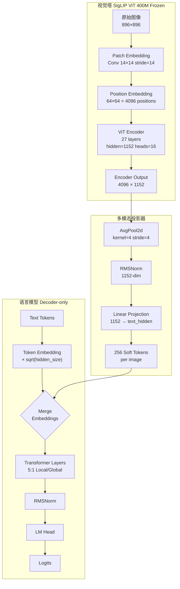

> **关键洞察**: Gemma3 的视觉塔和语言模型在训练时完全解耦——视觉编码器在语言模型预训练前冻结，视觉嵌入被预计算后直接注入文本序列，不增加 LLM 训练成本。

## 2.2 核心超参数

### 文本模型超参数

| 参数 | Gemma3 1B | Gemma3 4B | Gemma3 12B | Gemma3 27B | 说明 |
|------|-----------|-----------|-----------|-----------|------|
| Hidden Size | 1152 | 2560 | 3840 | 5376 | 隐藏层维度 |
| Num Layers | 26 | 34 | 48 | 62 | Transformer 层数 |
| Num Attention Heads | 4 | 8 | 16 | 32 | Query heads 数量 |
| Num KV Heads | 1 | 4 | 8 | 16 | KV heads (GQA) |
| Head Dim | 256 | 256 | 256 | 128 | 每 head 维度 |
| Q Size | 1024 | 2048 | 4096 | 4096 | Query 投影维度 |
| KV Size | 256 | 1024 | 2048 | 2048 | KV 投影维度 |
| Intermediate Size | 13824 | 10240 | 15360 | 21504 | FFN 中间层维度 |
| Vocab Size | 262208 | 262208 | 262208 | 262208 | 词表大小（Gemini 2.0 分词器） |
| Max Position | 32768 | 131072 | 131072 | 131072 | 最大位置编码 |
| Sliding Window | 512 | 1024 | 1024 | 1024 | 局部注意力窗口 |
| RoPE Theta (Global) | 1,000,000 | 1,000,000 | 1,000,000 | 1,000,000 | 全局层 RoPE 基频 |
| RoPE Theta (Local) | 10,000 | 10,000 | 10,000 | 10,000 | 局部层 RoPE 基频 |
| Activation | gelu_pytorch_tanh | gelu_pytorch_tanh | gelu_pytorch_tanh | gelu_pytorch_tanh | 激活函数 |
| Norm Type | RMSNorm | RMSNorm | RMSNorm | RMSNorm | 归一化类型 |

### 视觉模型超参数（所有多模态规格共享）

| 参数 | 值 | 说明 |
|------|-----|------|
| Hidden Size | 1152 | ViT 隐藏层维度 |
| Num Layers | 27 | ViT Encoder 层数 |
| Num Attention Heads | 16 | 注意力头数 |
| Head Dim | 72 | 1152/16 |
| Intermediate Size | 4304 | FFN 中间层 |
| Patch Size | 14 | 图像 patch 尺寸 |
| Image Size | 896 | 输入图像分辨率 |
| Num Channels | 3 | RGB |
| Activation | gelu_pytorch_tanh | 激活函数 |
| Norm Type | LayerNorm | ViT 使用 LayerNorm（非 RMSNorm） |
| Pooling | AvgPool 4×4 | 4096 → 256 tokens |
| Total Params | ~417M | 参数总量 |

### 关键设计特点

- **Head dim 独立于 hidden_size**：Q 投影输出维度 = `num_heads × head_dim`，不同于 `hidden_size`。例如 27B 中 hidden=5376，但 Q 维度 = 32×128 = 4096。
- **GQA 比例**：27B 为 2:1（32Q/16KV），12B 为 2:1（16Q/8KV），4B 为 2:1（8Q/4KV），1B 为 4:1（4Q/1KV）。
- **5:1 Local/Global 模式**：每 5 个局部滑动窗口层后接 1 个全局注意力层，从局部层开始。

## 2.3 Attention 机制详解

### 技术原理: GQA + QK-Norm + RoPE

Gemma3 的 Attention 机制融合了三个关键组件：Grouped-Query Attention（分组查询注意力）、QK-Norm（Query-Key 归一化）和双频率 Rotary Position Embedding。

**核心公式**：

$$\text{Attention}(Q, K, V) = \text{softmax}\left(\frac{\text{RoPE}(\text{Norm}(Q))\ \text{RoPE}(\text{Norm}(K))^T}{\sqrt{d_k \cdot s}}\right)V$$

其中 $s$ 为 `query_pre_attn_scalar`（缩放因子），Norm 为 RMSNorm。

**QK-Norm 机制**：Gemma3 在对 Q、K 应用 RoPE 之前，先通过 RMSNorm 对每个 head 进行归一化。这替代了 Gemma2 中的 logits soft-capping（tanh 截断），能更有效地稳定训练，同时不限制注意力分数的动态范围。

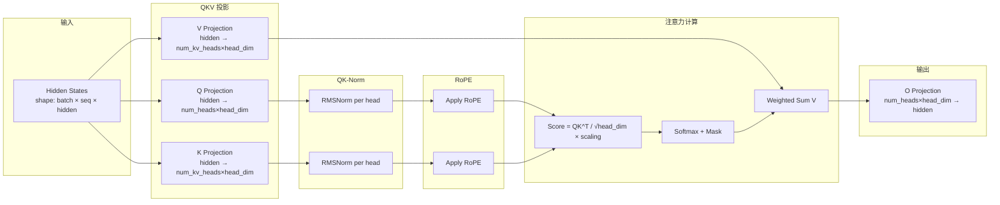

### 5:1 混合注意力模式

Gemma3 的核心创新之一是 **5:1 局部/全局注意力交错**。每 6 层为一个 pattern 周期：

```
Layer 0:  Sliding Window (local,  window=1024, RoPE θ=10K)
Layer 1:  Sliding Window (local,  window=1024, RoPE θ=10K)
Layer 2:  Sliding Window (local,  window=1024, RoPE θ=10K)
Layer 3:  Sliding Window (local,  window=1024, RoPE θ=10K)
Layer 4:  Sliding Window (local,  window=1024, RoPE θ=10K)
Layer 5:  Full Attention   (global, RoPE θ=1M, 8× rescaling)
Layer 6:  Sliding Window ...
...
```

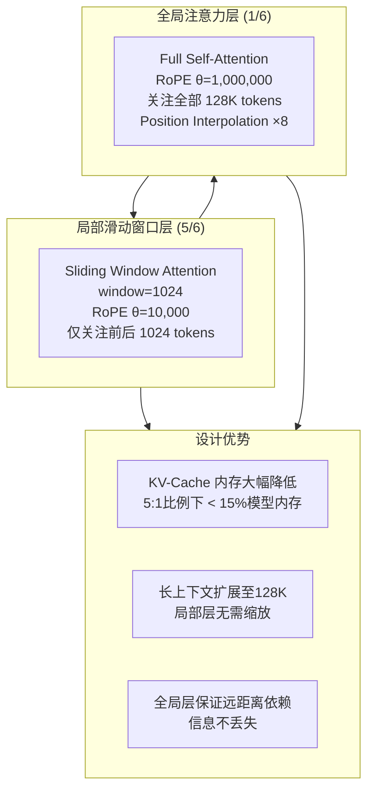

> **性能提示**: 5:1 比例下，在 32K 上下文时，KV-cache 仅占模型内存的不到 15%（纯全局模式为 ~60%）。论文实验表明即使使用 7:1 比例对 perplexity 影响也极小。

## 2.4 FFN 机制详解

Gemma3 使用标准的 **SwiGLU 风格 FFN**（Dense，非 MoE）：

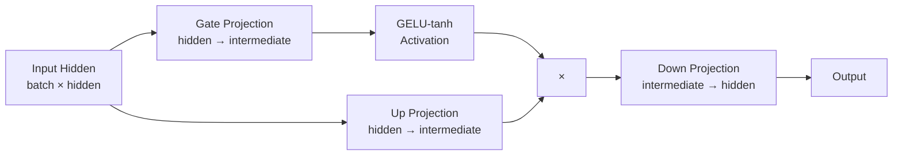

**公式**：

$$\text{FFN}(x) = \text{Down}(\text{GELU}(\text{Gate}(x)) \odot \text{Up}(x))$$

其中 Gate 和 Up 投影通过 `MergedColumnParallelLinear` 合并为单个矩阵乘法，减少 kernel launch 开销。

### Pre/Post Normalization 设计

Gemma3 采用 **pre-norm + post-norm** 双重归一化，每个 Transformer 层包含 4 个 RMSNorm：

```python
# 文件: vllm/model_executor/models/gemma3.py -> Gemma3DecoderLayer
self.input_layernorm = GemmaRMSNorm(hidden_size)         # Pre-Attention Norm
self.post_attention_layernorm = GemmaRMSNorm(hidden_size) # Post-Attention Norm
self.pre_feedforward_layernorm = GemmaRMSNorm(hidden_size) # Pre-FFN Norm
self.post_feedforward_layernorm = GemmaRMSNorm(hidden_size)# Post-FFN Norm
```

## 2.5 其他关键技术组件

### RoPE 双频率设计

| 组件 | 局部层 (5/6) | 全局层 (1/6) |
|------|------------|------------|
| RoPE Base Frequency | 10,000 | 1,000,000 |
| 位置插值 | 无 | ×8 缩放因子 |
| 适用上下文 | ≤ 1024 (窗口内) | ≤ 128K |

- 全局层使用 `theta=1,000,000` 的高基频，通过 Position Interpolation（factor=8）将 32K 预训练长度扩展到 128K
- 局部层使用 `theta=10,000`，因为滑动窗口仅覆盖 1024 token

### Embedding 缩放

```python
# 文件: vllm/model_executor/models/gemma3.py -> Gemma3Model.embed_input_ids
def embed_input_ids(self, input_ids):
    return self.embed_tokens(input_ids) * self.normalizer  # normalizer = sqrt(hidden_size)
```

文本嵌入乘以 `sqrt(hidden_size)` 进行缩放（视觉嵌入不缩放），这一技巧有助于稳定训练。

### Logits Soft Capping

输出层使用 soft capping 限制 logits 范围：

```python
self.logits_processor = LogitsProcessor(vocab_size, soft_cap=config.final_logit_softcapping)
```

---

# 第三部分: 输入预处理流程

## 3.1 文本预处理

Gemma3 使用 Gemini 2.0 同款 SentencePiece 分词器，vocab size = 262,208：

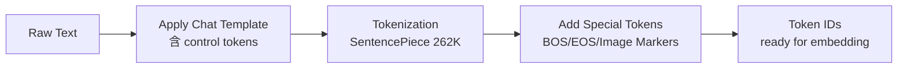

### 特殊 Token 与对话格式

| Token | ID | 用途 |
|-------|-----|------|
| `<bos>` | 2 | 序列开始 |
| `<eos>` | 1 | 序列结束（PT模型） |
| `<end_of_turn>` | 106 | 轮次结束（IT模型） |
| `<start_of_turn>user` | - | 用户轮次开始 |
| `<start_of_turn>model` | - | 模型轮次开始 |
| `<start_of_image>` | 255999 | 图像占位符 |
| `<end_of_image>` | 256000 | 图像结束标记 |
| `<pad>` | 0 | 填充 |
| `<unk>` | 3 | 未知 token |

**对话模板**：

```
<bos>
<start_of_turn>user
[用户消息内容，可包含 <start_of_image> 图像标记]
<end_of_turn>
<start_of_turn>model
[模型回复内容]
<end_of_turn>
```

## 3.2 多模态输入处理（本章重点）

Gemma3 的多模态输入处理是整个模型最复杂和最关键的部分，涉及 **图像预处理 → ViT 编码 → Token 压缩 → 嵌入融合** 四个阶段。

### 3.2.1 整体流程概览

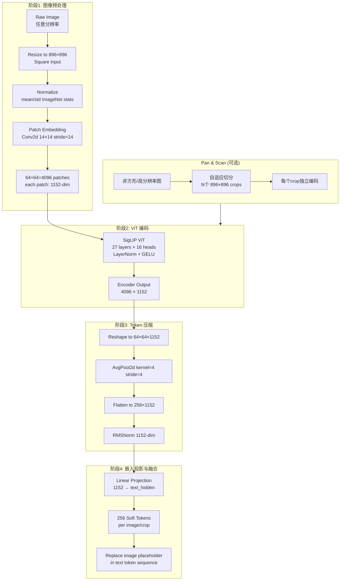

### 3.2.2 图像预处理详解

**输入规格**：
- 固定分辨率 896×896（正方形）
- 3 通道 RGB，归一化到 ImageNet 统计量
- Patch 大小 14×14 → 每张图产生 (896/14)^2 = 4096 个 patches

**Patch Embedding** 使用 Conv2d 实现（非简单的线性投影）：

```python
# 文件: vllm/model_executor/models/siglip.py -> SiglipVisionEmbeddings
self.patch_embedding = Conv2dLayer(
    in_channels=3,
    out_channels=1152,       # = vision_config.hidden_size
    kernel_size=14,          # = vision_config.patch_size
    stride=14,               # non-overlapping patches
    padding="valid",
)
# 输入: [batch, 3, 896, 896]
# 输出: [batch, 1152, 64, 64]
```

位置编码使用 learnable position embedding，支持 bicubic 插值以处理非标准分辨率：

```python
self.position_embedding = nn.Embedding(4096, 1152)  # 64×64 = 4096 positions
```

### 3.2.3 Pan & Scan 自适应裁剪

对于非正方形或高分辨率图像，Gemma3 在推理时可启用 Pan & Scan：

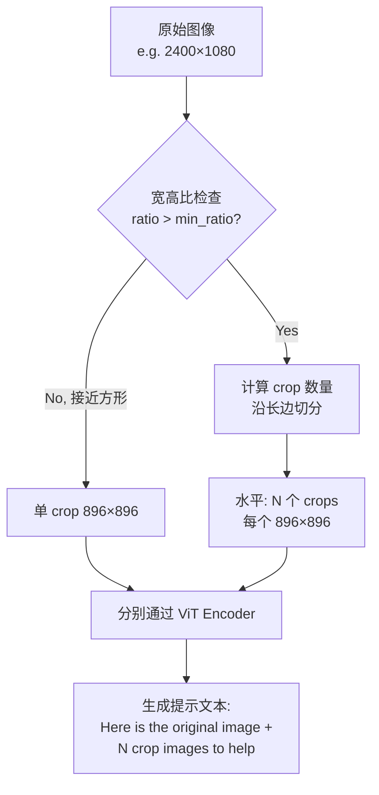

```python
# 文件: vllm/model_executor/models/gemma3_mm.py -> Gemma3ProcessingInfo.get_image_repl
if num_crops == 0:
    image_text = boi_token  # 仅原始图像
else:
    crops_image_tokens = " ".join(boi_token for _ in range(num_crops))
    image_text = (
        f"Here is the original image {boi_token} and here are some "
        f"crops to help you see better {crops_image_tokens}"
    )
```

Pan & Scan 将每个 crop 独立送入 ViT，每 crop 产生 256 个 soft token，所有 token 拼接后送入 LLM。

### 3.2.4 Token 压缩：4096 → 256

这是 Gemma3 设计中最精妙的部分之一。ViT 输出的 4096 个 patch tokens 通过 AvgPool2d 压缩到仅 256 个：

```python
# 文件: vllm/model_executor/models/gemma3_mm.py -> Gemma3MultiModalProjector
self.patches_per_image = 896 // 14    # 64
self.tokens_per_side = int(256 ** 0.5) # 16
self.kernel_size = 64 // 16           # 4

self.avg_pool = nn.AvgPool2d(kernel_size=4, stride=4)
# 输入:  [batch, 4096, 1152]  → reshape → [batch, 1152, 64, 64]
# 输出:  [batch, 1152, 16, 16] → flatten → [batch, 256, 1152]
```

这一 16× 压缩比（4096→256）极大降低了 LLM 的推理成本——每张图只增加 256 个 token 的上下文，而非 4096 个。

## 3.3 Tokenizer 配置

| 配置项 | 值 | 说明 |
|--------|-----|------|
| Tokenizer Type | SentencePiece | 与 Gemini 2.0 同款 |
| Vocab Size | 262,208 | 含特殊 token |
| BOS Token | `<bos>` (ID=2) | 需显式添加 |
| EOS Token | `<eos>` (ID=1) | PT 模型结束标记 |
| Pad Token | `<pad>` (ID=0) | 填充标记 |
| Control Tokens | `<start_of_turn>`, `<end_of_turn>` | 对话轮次控制 |
| Image Tokens | `<start_of_image>`, `<end_of_image>` | 图像边界标记 |
| 数字处理 | Split digits | 每位数字单独 tokenize |
| 空白处理 | Preserved whitespace | 保留空白字符 |
| 编码级别 | Byte-level | 覆盖所有 Unicode |

---

# 第四部分: 模型前向传播流程

## 4.1 整体 Forward 流程

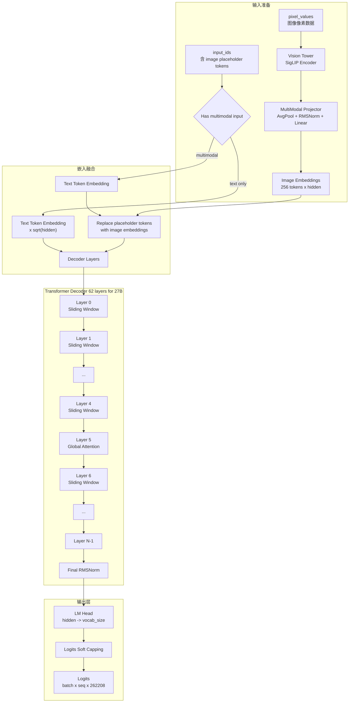

## 4.2 单层 Transformer 计算流程

Gemma3 的每个 Decoder Layer 采用 **双重 residual + 双重 norm** 设计：

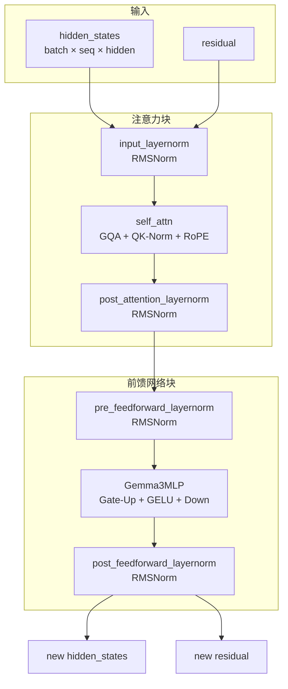

### Step-by-step with shapes (以 27B 为例)

**Step 1: Input RMSNorm**
- Input: `hidden_states [batch, seq, 5376]`, `residual [batch, seq, 5376]`
- `input_layernorm(hidden_states, residual)` → 对两者做 RMSNorm

**Step 2: Self-Attention**
- QKV 投影: `hidden [batch, seq, 5376]` → `[batch, seq, 4096+2048+2048]`
- Q: `[batch, 32, seq, 128]`, K: `[batch, 16, seq, 128]`, V: `[batch, 16, seq, 128]`
- QK-Norm: RMSNorm on Q and K per head
- RoPE: 对 Q、K 应用旋转位置编码（局部层 θ=10K, 全局层 θ=1M）
- Attention: `softmax(QK^T / sqrt(128 × scaling)) × V`
- O 投影: `[batch, seq, 4096]` → `[batch, seq, 5376]`
- Post-norm: `post_attention_layernorm(output)`

**Step 3: FFN**
- Pre-norm: `pre_feedforward_layernorm(hidden_states, residual)`
- Gate-Up: `[batch, seq, 5376]` → `[batch, seq, 21504×2]`
- GELU + Multiply: `[batch, seq, 21504]`
- Down: `[batch, seq, 21504]` → `[batch, seq, 5376]`
- Post-norm: `post_feedforward_layernorm(output)`

**Step 4: Output**
- 返回 `(new_hidden_states, new_residual)` 给下一层

## 4.3 vLLM 中的优化

| 优化技术 | 适用场景 | 说明 |
|---------|---------|------|
| PagedAttention | KV-cache 管理 | 分页管理 KV-cache，减少碎片 |
| Tensor Parallelism | 多 GPU 推理 | QKV/MLP 列并行 + 行并行 |
| `MergedColumnParallelLinear` | Gate+Up 合并 | 减少 50% kernel launch |
| `QKVParallelLinear` | QKV 合并投影 | 单次矩阵乘法完成 Q/K/V 投影 |
| Chunked Prefill | 长 prompt 处理 | 将 prefill 分块，与 decode 交错 |
| Prefix Caching | 共享前缀 | 复用相同前缀的 KV-cache |
| `support_torch_compile` | 整体模型 | 使用 `torch.compile` 优化 |
| `EncoderOnlyAttention` | ViT Encoder | 双向注意力（非因果），用于视觉编码 |

---

# 第五部分: ViT 计算流程（多模态核心）

> 本章是 Gemma3 多模态处理的核心。ViT（Vision Transformer）负责将图像转换为 LLM 可理解的 token 序列。

## 5.1 ViT 架构概览

Gemma3 使用 **SigLIP Vision Transformer**（Sigmoid-Loss CLIP 训练的 ViT），在 vLLM 中的类层次如下：

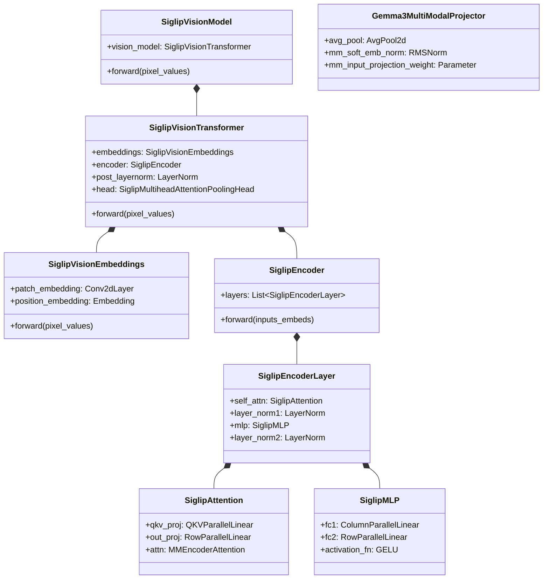

> **注意**：Gemma3 中 `SiglipVisionTransformer.use_head = False`，不使用 Attention Pooling Head，而是直接输出 encoder hidden states 并通过 `Gemma3MultiModalProjector` 进行压缩投影。

## 5.2 Patch Embedding 详解

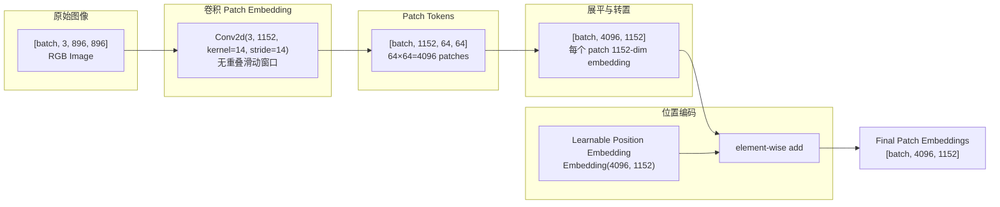

**关键实现**：

```python
# 文件: vllm/model_executor/models/siglip.py -> SiglipVisionEmbeddings
class SiglipVisionEmbeddings(nn.Module):
    def __init__(self, config: SiglipVisionConfig):
        self.patch_embedding = Conv2dLayer(
            in_channels=3,          # RGB
            out_channels=1152,      # vision hidden_size
            kernel_size=14,         # patch_size
            stride=14,              # non-overlapping
            padding="valid",
        )
        self.position_embedding = nn.Embedding(4096, 1152)
        # position_ids: [0, 1, 2, ..., 4095]

    def forward(self, pixel_values, interpolate_pos_encoding=False):
        # pixel_values: [batch, 3, 896, 896]
        patch_embeds = self.patch_embedding(pixel_values)  
        # → [batch, 1152, 64, 64]
        embeddings = patch_embeds.flatten(2).transpose(1, 2)  
        # → [batch, 4096, 1152]
        embeddings += self.position_embedding(self.position_ids)
        return embeddings  # [batch, 4096, 1152]
```

**Position Embedding Interpolation**：当输入图像分辨率非标准时（如 Pan & Scan 的 crop 处理），使用 bicubic 插值对 2D 位置编码进行重采样：

```python
# Position embedding: [4096, 1152] → reshape → [1, 64, 64, 1152]
# → permute → [1, 1152, 64, 64] → interpolate to [1, 1152, H', W'] 
# → permute back → [1, H'*W', 1152]
patch_pos_embed = nn.functional.interpolate(
    patch_pos_embed,
    size=(new_height, new_width),
    mode="bicubic",
    align_corners=False,
)
```

## 5.3 ViT Encoder 计算流程

Gemma3 的 ViT Encoder 由 27 层 SiglipEncoderLayer 堆叠而成，每层结构为：

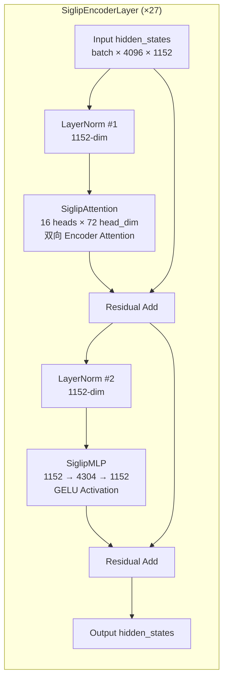

### ViT Attention（双向编码器注意力）

与 LLM 的因果注意力不同，ViT 使用 **双向（full）注意力**——每个 patch 可以看到所有其他 patches：

```python
# 文件: vllm/model_executor/models/siglip.py -> SiglipAttention
class SiglipAttention(nn.Module):
    def __init__(self, config, ...):
        self.embed_dim = 1152        # hidden_size
        self.num_heads = 16          # num_attention_heads
        self.head_dim = 72           # 1152 / 16 = 72
        self.scale = 72 ** -0.5      # 1 / sqrt(head_dim)
        
        self.qkv_proj = QKVParallelLinear(
            hidden_size=1152,
            head_size=72,             # head_dim
            total_num_heads=16,       # num_heads (no KV separation)
        )
        self.out_proj = RowParallelLinear(1152, 1152)
        self.attn = MMEncoderAttention(...)  # 双向注意力 + TP 支持

    def forward(self, hidden_states):
        # hidden_states: [batch, 4096, 1152]
        qkv, _ = self.qkv_proj(hidden_states)
        # qkv: [batch, 4096, 1152*3] (Q+K+V concatenated)
        q, k, v = qkv.chunk(3, dim=-1)
        # each: [batch, 4096, 1152]
        out = self.attn(q, k, v)      # 双向注意力
        attn_output, _ = self.out_proj(out)
        return attn_output, None
```

**关键差异 vs LLM Attention**：
1. **无 KV 头分离**：ViT 中 num_heads = num_kv_heads = 16（标准 MHA）
2. **无 RoPE**：ViT 使用 learned absolute position embeddings，不应用旋转位置编码
3. **无 QK-Norm**：ViT 不使用 QK 归一化
4. **双向注意力**：使用 `MMEncoderAttention`（无 causal mask）
5. **使用 LayerNorm**（非 RMSNorm），配合 `eps=1e-6`

### ViT FFN

```python
# 文件: vllm/model_executor/models/siglip.py -> SiglipMLP
class SiglipMLP(nn.Module):
    def __init__(self, config, ...):
        self.fc1 = ColumnParallelLinear(1152, 4304)   # hidden → intermediate
        self.fc2 = RowParallelLinear(4304, 1152)       # intermediate → hidden
        self.activation_fn = get_act_fn("gelu_pytorch_tanh")

    def forward(self, hidden_states):
        hidden_states, _ = self.fc1(hidden_states)
        hidden_states = self.activation_fn(hidden_states)
        hidden_states, _ = self.fc2(hidden_states)
        return hidden_states
```

### 完整 ViT Forward Trace

```python
# 文件: vllm/model_executor/models/siglip.py -> SiglipVisionTransformer.forward
def forward(self, pixel_values, ...):
    # Step 1: Patch Embedding
    hidden_states = self.embeddings(pixel_values)
    # [batch, 3, 896, 896] → [batch, 4096, 1152]
    
    # Step 2: Encoder (27 layers)
    for layer in self.encoder.layers:  # 27 × SiglipEncoderLayer
        hidden_states, _ = layer(hidden_states)
    # [batch, 4096, 1152] → [batch, 4096, 1152]
    
    # Step 3: Post LayerNorm (optional, enabled in Gemma3)
    if self.post_layernorm is not None:
        hidden_states = self.post_layernorm(hidden_states)
    
    # Step 4: Skip head (Gemma3 uses its own projector)
    # self.use_head = False in Gemma3
    return hidden_states  # [batch, 4096, 1152]
```

## 5.4 视觉-语言融合策略

Gemma3 采用 **Soft Token Concatenation** 策略，将压缩后的视觉 token 直接插入文本 token 序列中：

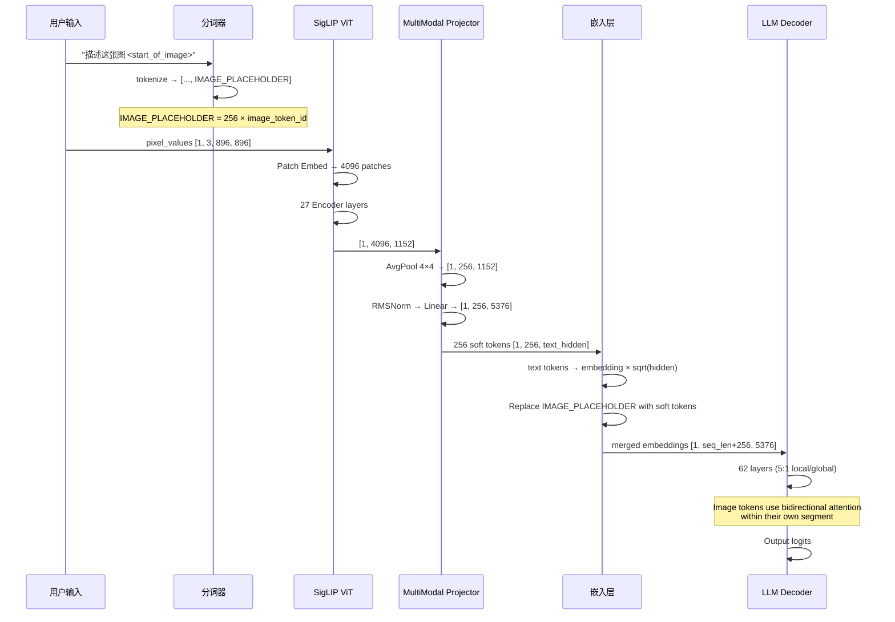

### 多模态嵌入融合代码

```python
# 文件: vllm/model_executor/models/gemma3_mm.py -> Gemma3ForConditionalGeneration

def _process_image_input(self, image_input):
    # Step 1: ViT encoding
    image_features = self._image_pixels_to_features(
        self.vision_tower,     # SiglipVisionModel
        pixel_values,          # [total_patches, 3, 896, 896]
    )
    # → [total_patches, 4096, 1152]
    
    # Step 2: Multimodal projection (AvgPool + Norm + Linear)
    image_embeds = self.multi_modal_projector(image_features)
    # → [total_patches, 256, text_hidden]
    
    # Step 3: Split per-image (handle multiple images/crops)
    return [e.flatten(0, 1) for e in image_embeds.split(num_patches.tolist())]

def embed_multimodal(self, **kwargs):
    image_input = self._parse_and_validate_image_input(**kwargs)
    return self._process_image_input(image_input)
```

### Gemma3MultiModalProjector 完整实现

```python
# 文件: vllm/model_executor/models/gemma3_mm.py -> Gemma3MultiModalProjector

class Gemma3MultiModalProjector(nn.Module):
    def __init__(self, config: Gemma3Config):
        # 投影矩阵: vision_hidden → text_hidden
        self.mm_input_projection_weight = nn.Parameter(
            torch.zeros(1152, text_hidden)  # e.g. [1152, 5376] for 27B
        )
        # Soft embedding normalization
        self.mm_soft_emb_norm = GemmaRMSNorm(1152)
        
        # AvgPool 参数
        self.patches_per_image = 896 // 14  # 64
        self.tokens_per_side = int(256 ** 0.5)  # 16
        self.kernel_size = 64 // 16  # 4
        
        self.avg_pool = nn.AvgPool2d(kernel_size=4, stride=4)

    def forward(self, vision_outputs):
        # vision_outputs: [batch, 4096, 1152]
        batch_size, _, seq_length = vision_outputs.shape
        
        # Reshape to 2D spatial: [batch, 4096, 1152] → [batch, 64, 64, 1152]
        reshaped = vision_outputs.transpose(1, 2)
        reshaped = reshaped.reshape(batch_size, seq_length, 64, 64)
        reshaped = reshaped.contiguous()
        
        # AvgPool: [batch, 1152, 64, 64] → [batch, 1152, 16, 16]
        pooled = self.avg_pool(reshaped)
        # Flatten back: [batch, 1152, 256] → [batch, 256, 1152]
        pooled = pooled.flatten(2).transpose(1, 2)
        
        # RMSNorm
        normed = self.mm_soft_emb_norm(pooled)
        
        # Linear projection: [batch, 256, 1152] @ [1152, text_hidden]
        projected = torch.matmul(normed, self.mm_input_projection_weight)
        # → [batch, 256, text_hidden]
        
        return projected.type_as(vision_outputs)
```

### Token 级别融合

在文本序列中，`<start_of_image>` 占位符被替换为 256 个实际视觉 soft token。vLLM 使用 `MultiModalEmbeddings` 接口处理此替换：

```python
# 嵌入融合伪代码（vLLM 内部机制）
# 1. 文本 token IDs 转换为 embeddings
text_embeds = embed_tokens(input_ids) * sqrt(hidden_size)

# 2. 找到 image placeholder 位置（image_token_index = 262144）
image_mask = (input_ids == image_token_index)  # [batch, seq_len]

# 3. 用视觉 embeddings 替换 placeholder
merged_embeds[image_mask] = image_embeds  # 256 tokens per image

# 4. 送入 LLM
hidden_states = language_model(inputs_embeds=merged_embeds, ...)
```

---

# 第六部分: vLLM 中的代码实现

## 6.1 模型注册与配置

Gemma3 在 vLLM 中有两个注册入口：

```python
# 文件: vllm/model_executor/models/gemma3.py
# 纯文本模型（用于 Gemma3 1B）
@support_torch_compile
class Gemma3ForCausalLM(nn.Module, SupportsLoRA, SupportsPP):
    ...

# 文件: vllm/model_executor/models/gemma3_mm.py
# 多模态模型（用于 Gemma3 4B/12B/27B）
@MULTIMODAL_REGISTRY.register_processor(
    Gemma3MultiModalProcessor,
    info=Gemma3ProcessingInfo,
    dummy_inputs=Gemma3DummyInputsBuilder,
)
class Gemma3ForConditionalGeneration(
    nn.Module, SupportsMultiModal, SupportsPP, SupportsLoRA
):
    ...
```

注册时 `Gemma3ForConditionalGeneration` 接收 `Gemma3Config`（含 `text_config` + `vision_config`），内部将 `text_config` 委托给 `Gemma3ForCausalLM`：

```python
def __init__(self, *, vllm_config, prefix=""):
    config = vllm_config.model_config.hf_config  # Gemma3Config
    
    # 视觉塔（被标记为 tower_model，用于权重加载和 TP 策略）
    with self._mark_tower_model(vllm_config, "image"):
        self.vision_tower = SiglipVisionModel(config.vision_config, ...)
        self.multi_modal_projector = Gemma3MultiModalProjector(config)
    
    # 语言模型（委托给纯文本 Gemma3ForCausalLM）
    with self._mark_language_model(vllm_config):
        self.language_model = init_vllm_registered_model(
            vllm_config=vllm_config,
            hf_config=config.text_config,  # Gemma3TextConfig
            prefix=maybe_prefix(prefix, "language_model"),
            architectures=["Gemma3ForCausalLM"],
        )
```

## 6.2 核心模型类分析

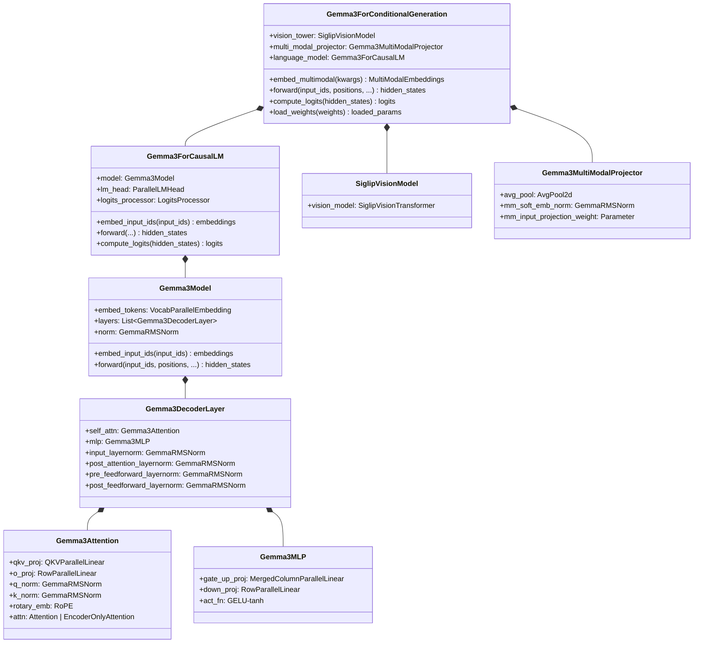

## 6.3 关键计算流程代码分析

### 6.3.1 多模态入口：embed_multimodal

```python
# 文件: vllm/model_executor/models/gemma3_mm.py -> Gemma3ForConditionalGeneration

def embed_multimodal(self, **kwargs: object) -> MultiModalEmbeddings:
    # 解析并验证图像输入
    image_input = self._parse_and_validate_image_input(**kwargs)
    if image_input is None:
        return []  # 无图像输入，返回空列表
    
    # 完整管线: ViT → Projector → Flatten
    return self._process_image_input(image_input)

def _image_pixels_to_features(self, vision_tower, pixel_values):
    # pixel_values: [total_patches, 3, 896, 896]
    # 调用 SigLIP ViT 前向传播
    return vision_tower(pixel_values)
    # → [total_patches, 4096, 1152]
```

### 6.3.2 嵌入融合：embed_input_ids

```python
# 文件: vllm/model_executor/models/gemma3_mm.py -> Gemma3ForConditionalGeneration

def embed_input_ids(self, input_ids, multimodal_embeddings=None, *, is_multimodal=None):
    # 文本-only 推理：直接走基类逻辑
    if multimodal_embeddings is None or is_multimodal is None:
        return super().embed_input_ids(input_ids)
    
    # 多模态推理：使用 OOV (Out-Of-Vocabulary) 处理
    # image_token_index (262144) 被视为"未知 token"
    # 其位置被替换为视觉 embeddings
    return super().embed_input_ids(
        input_ids,
        multimodal_embeddings=multimodal_embeddings,
        is_multimodal=is_multimodal,
    )
```

### 6.3.3 Decoder Layer Forward（含 layer type 判断）

```python
# 文件: vllm/model_executor/models/gemma3.py -> Gemma3DecoderLayer

def forward(self, positions, hidden_states, residual, **kwargs):
    # ===== 注意力块 =====
    if residual is None:
        residual = hidden_states
        hidden_states = self.input_layernorm(hidden_states)
    else:
        hidden_states, residual = self.input_layernorm(hidden_states, residual)
    
    hidden_states = self.self_attn(
        positions=positions,
        hidden_states=hidden_states,
    )
    hidden_states = self.post_attention_layernorm(hidden_states)
    
    # ===== FFN 块 =====
    hidden_states, residual = self.pre_feedforward_layernorm(
        hidden_states, residual
    )
    hidden_states = self.mlp(hidden_states)
    hidden_states = self.post_feedforward_layernorm(hidden_states)
    
    return hidden_states, residual
```

### 6.3.4 Attention Forward（含 layer type 判断）

```python
# 文件: vllm/model_executor/models/gemma3.py -> Gemma3Attention

def __init__(self, config, ...):
    layer_idx = extract_layer_index(prefix)
    layer_type = config.layer_types[layer_idx]  # "sliding_attention" or "full_attention"
    self.is_sliding = layer_type == "sliding_attention"
    sliding_window = config.sliding_window if self.is_sliding else None
    
    # 根据 layer_type 选择 RoPE 参数
    if self.is_sliding:
        rope_parameters = dict(rope_type="default", rope_theta=config.rope_local_base_freq)
    else:
        rope_parameters = config.rope_parameters  # rope_theta=1,000,000

def forward(self, positions, hidden_states, **kwargs):
    qkv, _ = self.qkv_proj(hidden_states)
    q, k, v = qkv.split([self.q_size, self.kv_size, self.kv_size], dim=-1)
    
    # QK-Norm: 对每个 head 进行 RMSNorm
    q = q.unflatten(-1, (self.num_heads, self.head_dim))
    q = self.q_norm(q)
    q = q.flatten(-2, -1)
    
    k = k.unflatten(-1, (self.num_kv_heads, self.head_dim))
    k = self.k_norm(k)
    k = k.flatten(-2, -1)
    
    # RoPE
    q, k = self.rotary_emb(positions, q, k)
    
    # Attention (sliding window or full)
    attn_output = self.attn(q, k, v)
    output, _ = self.o_proj(attn_output)
    return output
```

## 6.4 vLLM 特有优化

### 多模态权重映射

Gemma3 的 HuggingFace checkpoint 命名在不同 transformers 版本间有变化，vLLM 使用 `WeightsMapper` 进行适配：

```python
# 文件: vllm/model_executor/models/gemma3_mm.py
hf_to_vllm_mapper = WeightsMapper(
    orig_to_new_prefix={
        # transformers v4.52+ 的新命名 → vLLM 内部命名
        "model.language_model.": "language_model.model.",
        "model.vision_tower.": "vision_tower.",
        "model.multi_modal_projector.": "multi_modal_projector.",
        "lm_head.": "language_model.lm_head.",
    }
)
```

### Pan & Scan 的 Token 计数

```python
# 文件: vllm/model_executor/models/gemma3_mm.py

def get_num_image_tokens(self, *, image_width, image_height, processor, mm_kwargs):
    num_crops = self.get_num_crops(...)
    image_seq_len = processor.image_seq_length  # 256
    return (num_crops + 1) * image_seq_len
    # 无 crops: 256 tokens
    # 有 N crops: (N+1) × 256 tokens（原始图 + N 个 crops）
```

### ViT 数据并行

当 GPU 数量较多时，ViT 可以启用数据并行（而非张量并行）以提高效率：

```python
# 文件: vllm/model_executor/models/siglip.py -> SiglipAttention
use_data_parallel = is_vit_use_data_parallel()
self.qkv_proj = QKVParallelLinear(
    ...,
    disable_tp=use_data_parallel,  # 禁用 TP，使用 DP
)
```

---

# 附录

## A. 关键代码位置索引

| 组件 | 文件路径 | 关键类/函数 |
|------|---------|------------|
| 多模态模型入口 | `vllm/model_executor/models/gemma3_mm.py` | `Gemma3ForConditionalGeneration` |
| 纯文本模型 | `vllm/model_executor/models/gemma3.py` | `Gemma3ForCausalLM` |
| 多模态投影器 | `vllm/model_executor/models/gemma3_mm.py` | `Gemma3MultiModalProjector` |
| 多模态处理器 | `vllm/model_executor/models/gemma3_mm.py` | `Gemma3MultiModalProcessor` |
| 预处理信息 | `vllm/model_executor/models/gemma3_mm.py` | `Gemma3ProcessingInfo` |
| 视觉塔 (SigLIP) | `vllm/model_executor/models/siglip.py` | `SiglipVisionModel` |
| ViT Transformer | `vllm/model_executor/models/siglip.py` | `SiglipVisionTransformer` |
| ViT 编码器层 | `vllm/model_executor/models/siglip.py` | `SiglipEncoderLayer` |
| ViT 注意力 | `vllm/model_executor/models/siglip.py` | `SiglipAttention` |
| ViT MLP | `vllm/model_executor/models/siglip.py` | `SiglipMLP` |
| ViT Patch 嵌入 | `vllm/model_executor/models/siglip.py` | `SiglipVisionEmbeddings` |
| LLM 编解码器层 | `vllm/model_executor/models/gemma3.py` | `Gemma3DecoderLayer` |
| LLM 注意力 | `vllm/model_executor/models/gemma3.py` | `Gemma3Attention` |
| LLM MLP | `vllm/model_executor/models/gemma3.py` | `Gemma3MLP` |
| LLM 模型 | `vllm/model_executor/models/gemma3.py` | `Gemma3Model` |
| 权重加载 | `vllm/model_executor/models/gemma3_mm.py` | `AutoWeightsLoader` + `WeightsMapper` |

## B. 术语表

| 术语 | 英文 | 说明 |
|------|------|------|
| 视觉 Transformer | ViT / Vision Transformer | 基于自注意力的图像编码器 |
| SigLIP | Sigmoid Loss CLIP | 使用 Sigmoid Loss 的 CLIP 变体 |
| 分组查询注意力 | GQA / Grouped-Query Attention | 多个 Q heads 共享一个 KV head |
| QK 归一化 | QK-Norm | 对 Query 和 Key 应用 RMSNorm |
| 旋转位置编码 | RoPE / Rotary Position Embedding | 通过旋转变换编码位置信息 |
| 滑动窗口注意力 | Sliding Window Attention | 每个 token 仅关注窗口内的 tokens |
| Pan & Scan | P&S | 自适应图像裁剪算法 |
| 软 Token | Soft Token | 视觉编码器输出的连续向量，作为 LLM 输入 |
| 多模态投影器 | Multimodal Projector | 将视觉特征映射到文本嵌入空间 |
| 平均池化 | AvgPool / Average Pooling | 下采样操作，用于压缩 token 数量 |
| 均方根归一化 | RMSNorm / Root Mean Square Normalization | 简化的 LayerNorm |
| 张量并行 | TP / Tensor Parallelism | 将层内权重分布到多个 GPU |
| 管道并行 | PP / Pipeline Parallelism | 将层间计算分布到多个 GPU |

## C. 架构速查表

| 维度 | 1B | 4B | 12B | 27B |
|------|-----|-----|------|------|
| **文本模型** | | | | |
| Hidden Size | 1152 | 2560 | 3840 | 5376 |
| Layers | 26 | 34 | 48 | 62 |
| Q Heads | 4 | 8 | 16 | 32 |
| KV Heads | 1 | 4 | 8 | 16 |
| Head Dim | 256 | 256 | 256 | 128 |
| Intermediate | 13824 | 10240 | 15360 | 21504 |
| Sliding Window | 512 | 1024 | 1024 | 1024 |
| Max Context | 32K | 128K | 128K | 128K |
| **视觉模型** | | | | |
| ViT | 无 | SigLIP | SigLIP | SigLIP |
| ViT Layers | - | 27 | 27 | 27 |
| ViT Hidden | - | 1152 | 1152 | 1152 |
| ViT Heads | - | 16 | 16 | 16 |
| ViT Params | - | 417M | 417M | 417M |
| Soft Tokens | - | 256 | 256 | 256 |
| **训练** | | | | |
| Training Tokens | 2T | 4T | 12T | 14T |
| Distillation | ✓ | ✓ | ✓ | ✓ |
| **性能** | | | | |
| MMLU-Pro | - | 43.6 | 60.6 | 67.5 |
| MATH | - | 75.6 | 83.8 | 89.0 |
| MMMU (val) | - | 48.8 | 59.6 | 64.9 |

## D. 参考资料

- [Gemma 3 Technical Report](https://arxiv.org/abs/2503.19786) — Google DeepMind, 2025
- [Gemma 3 HuggingFace Blog](https://huggingface.co/blog/gemma3)
- [SigLIP Paper](https://arxiv.org/abs/2303.15343) — Sigmoid Loss for Language Image Pre-Training
- [Google Gemma 3 Official Page](https://ai.google.dev/gemma)
- [vLLM Supported Models](https://docs.vllm.ai/en/latest/models/supported_models/)
- [LLM Architecture Gallery](https://sebastianraschka.com/llm-architecture-gallery/)
- [HuggingFace Gemma3 Documentation](https://huggingface.co/docs/transformers/model_doc/gemma3)
- [Gemma3 27B IT on HuggingFace](https://huggingface.co/google/gemma-3-27b-it)
- [Gemma3 12B IT on HuggingFace](https://huggingface.co/google/gemma-3-12b-it)
- [Gemma3 4B IT on HuggingFace](https://huggingface.co/google/gemma-3-4b-it)
- [Gemma3 1B IT on HuggingFace](https://huggingface.co/google/gemma-3-1b-it)
