# vLLM Kimi-VL 模型技术教程

> **文档版本**: 1.0
> **分析代码版本**: vLLM main 分支（截至 2025-06）
> **最后更新**: 2025-06-08
> **模型系列**: Kimi-VL (Moonshot AI)
> **模型类型**: VLM-MoE (视觉语言模型 + 混合专家)

---

## 文档概述

本文档深入剖析 Moonshot AI 开源的 **Kimi-VL** 模型在 vLLM 中的完整实现，涵盖模型架构设计、多模态输入处理管线、ViT (MoonViT) 计算流程、MoE 语言模型、以及 vLLM 特有的工程优化。本文档特别侧重于 **MoonViT 视觉编码器** 对多模态输入的处理机制，包括 NaViT 风格 patch packing、双重位置编码、pixel shuffle 投影等技术细节。

**目标读者**:
- 希望理解 Kimi-VL 整体架构与设计理念的研究者与工程师
- 需要在 vLLM 中部署、调试或二次开发 Kimi-VL 的开发者
- 对 MoE-VLM 多模态处理流程感兴趣的学习者

**推荐阅读顺序**: 第一部分（模型概述）→ 第五部分（ViT 计算流程，核心关注）→ 第三部分（输入预处理）→ 第四部分（前向传播）→ 第六部分（代码实现）

---

# 第一部分: Kimi-VL 模型系列概述与演进

## 1.1 模型系列发展历史

Kimi-VL 由 Moonshot AI（月之暗面）Kimi 团队于 2025 年 4 月发布，是一个高效的 **MoE 视觉语言模型**。其发展脉络与 Kimi 系列的语言模型紧密相关：

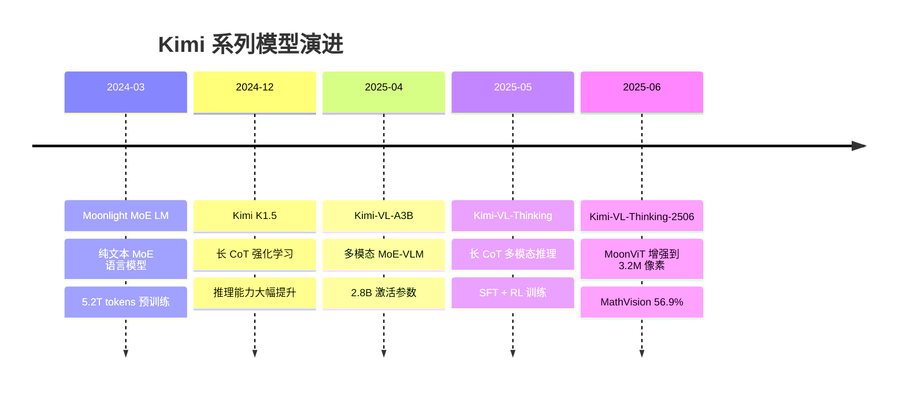

## 1.2 同系列模型对比

| 模型名称 | 总参数量 | 激活参数量 | 发布日期 | 核心创新点 | 上下文长度 | 视觉编码器 | 技术报告 | HuggingFace |
|---------|--------|-----------|---------|-----------|-----------|-----------|---------|------------|
| Kimi-VL-A3B-Instruct | 16B | ~3.2B | 2025-04 | MoE-VLM, NaViT 原生分辨率, 双重位置编码 | 128K | MoonViT (400M) | [arXiv 2504.07491](https://arxiv.org/abs/2504.07491) | [HF](https://huggingface.co/moonshotai/Kimi-VL-A3B-Instruct) |
| Kimi-VL-A3B-Thinking | 16B | ~3.2B | 2025-05 | 长 CoT SFT + RL, 多模态推理 | 128K | MoonViT (400M) | 同上 | [HF](https://huggingface.co/moonshotai/Kimi-VL-A3B-Thinking) |
| Kimi-VL-A3B-Thinking-2506 | 16B | ~3.2B | 2025-06 | MoonViT 增强 (3.2M 像素), 推理效率优化 | 128K | MoonViT 增强版 | 同上 | [HF](https://huggingface.co/moonshotai/Kimi-VL-A3B-Thinking-2506) |

## 1.3 各模型能力对比

| 能力维度 | Instruct | Thinking | Thinking-2506 |
|---------|----------|----------|---------------|
| MMMU (多学科理解) | 57.0 | 61.7 | 64.0 |
| MathVista (数学推理) | 68.7 | 71.3 | 80.1 |
| MathVision (数学视觉) | 21.7 | 36.8 | 56.9 |
| OCRBench (文字识别) | 867 | 864 | — |
| InfoVQA (信息问答) | 83.2 | — | — |
| ScreenSpot-V2 (Agent) | 92.8 | — | — |
| MMLongBench-Doc (长文档) | 35.1 | — | 42.1 |
| 最大图像像素 | ~0.8M | ~0.8M | ~3.2M |

> **关键洞察**: Kimi-VL 以仅 2.8B 激活参数（LLM）在多个基准上匹配甚至超越 GPT-4o-mini、Qwen2.5-VL-7B 等更大模型，体现了 MoE 架构在 VLM 场景下的效率优势。

## 1.4 技术报告与论文汇总

| 资源 | 链接 | 说明 |
|------|------|------|
| Kimi-VL 技术报告 | [arXiv 2504.07491](https://arxiv.org/abs/2504.07491) | 官方技术报告，涵盖架构、训练、评测 |
| Kimi-VL GitHub | [github.com/MoonshotAI/Kimi-VL](https://github.com/MoonshotAI/Kimi-VL) | 官方开源代码仓库 |
| DeepSeek-V2 论文 | [arXiv 2405.04434](https://arxiv.org/abs/2405.04434) | MLA 注意力机制原始论文 |
| NaViT 论文 | [arXiv 2307.06304](https://arxiv.org/abs/2307.06304) | Patch packing 方法原始论文 |
| SigLIP 论文 | [arXiv 2303.15343](https://arxiv.org/abs/2303.15343) | MoonViT 初始化基础模型 |
| Moonlight 技术报告 | [GitHub](https://github.com/MoonshotAI/Moonlight) | 语言模型骨干技术细节 |

---

# 第二部分: Kimi-VL 模型架构详解

## 2.1 整体架构概览

Kimi-VL 采用经典的 VLM 三段式架构：**MoonViT 视觉编码器** → **MLP 投影器** → **MoE 语言模型（DeepSeek-V2 架构）**。

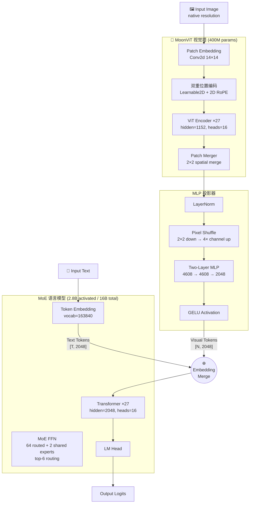

> **关键洞察**: Kimi-VL 的一个关键设计是语言模型采用 **DeepSeek-V2 的 MLA（Multi-head Latent Attention）** 架构，通过 KV 压缩大幅降低推理时的 KV Cache 内存占用。MoonViT 则通过 NaViT 风格 patch packing 高效处理可变分辨率图像。

## 2.2 核心超参数

### 2.2.1 MoonViT 视觉编码器

| 参数 | 值 | 说明 |
|------|-----|------|
| Hidden Size | 1152 | 每层隐藏维度 |
| Num Layers | 27 | ViT Encoder 层数 |
| Num Attention Heads | 16 | 每层注意力头数 |
| Head Dim | 72 | 1152 / 16 |
| Intermediate Size | 4304 | FFN 中间层维度 |
| Patch Size | 14 | 每个 patch 14×14 像素 |
| Init Pos Emb Size | 64×64 | 初始可学习位置编码尺寸 |
| Merge Kernel Size | (2, 2) | 空间合并窗口 |
| Activation | gelu_pytorch_tanh | GELU tanh 近似 |
| Params | ~400M | 视觉塔总参数量 |

### 2.2.2 MoE 语言模型

| 参数 | 值 | 说明 |
|------|-----|------|
| Hidden Size | 2048 | 每层隐藏维度 |
| Num Layers | 27 | Transformer 层数 |
| Num Attention Heads | 16 | Q 头数 |
| Num KV Heads | 16 | KV 头数 (MHA, 非 GQA) |
| Vocab Size | 163,840 | 词表大小 |
| Max Position Embeddings | 131,072 | 最大位置数 (128K) |
| RoPE Theta | 800,000 | RoPE 基频 (为长上下文调高) |
| Intermediate Size (Dense) | 11,264 | 前 1 层密集 FFN |
| MoE Intermediate Size | 1,408 | 每个专家 FFN 中间维度 |
| Num Routed Experts | 64 | 可路由专家数 |
| Num Shared Experts | 2 | 共享专家数 |
| Top-K | 6 | 每 token 激活的专家数 |
| First K Dense Replace | 1 | 前 1 层使用密集 FFN |
| KV Lora Rank | 512 | KV 压缩秩 (MLA) |
| QK Nope Head Dim | 128 | Q/K 无 RoPE 部分维度 |
| QK RoPE Head Dim | 64 | Q/K RoPE 部分维度 |
| V Head Dim | 128 | V 头维度 |
| Norm Type | RMSNorm | 归一化类型 |
| Activation | SiLU (SwiGLU) | 激活函数 |
| Routing Method | noaux_tc | 无辅助损失路由 |
| Scoring Function | sigmoid | 路由评分函数 |
| Norm Top-K Prob | true | 归一化 top-k 概率 |
| Total Params (LLM) | 16B | 语言模型总参数 |
| Activated Params (LLM) | ~2.8B | 每 token 激活参数 |

## 2.3 Attention 机制详解: MLA (Multi-head Latent Attention)

Kimi-VL 的语言模型骨干采用 DeepSeek-V2 提出的 **MLA (Multi-head Latent Attention)**，这是一种低秩 KV 压缩注意力机制。

### 技术原理: MLA

MLA 的核心思想是将 KV 投影到低维潜在空间，大幅减少 KV Cache 的内存占用。

**标准 MHA 的 KV Cache 大小** (每 token 每层):
$$S_{\text{MHA}} = 2 \times n_h \times d_h = 2 \times 16 \times 192 = 6144 \text{ 个 float16 值} = 12{,}288 \text{ bytes}$$

**MLA 的 KV Cache 大小** (每 token 每层):
$$S_{\text{MLA}} = d_{\text{kv\_lora}} + d_{\text{rope}} = 512 + 64 = 576 \text{ 个 float16 值} = 1{,}152 \text{ bytes}$$

**压缩比**: 12,288 / 1,152 ≈ **10.7×** KV Cache 节省。

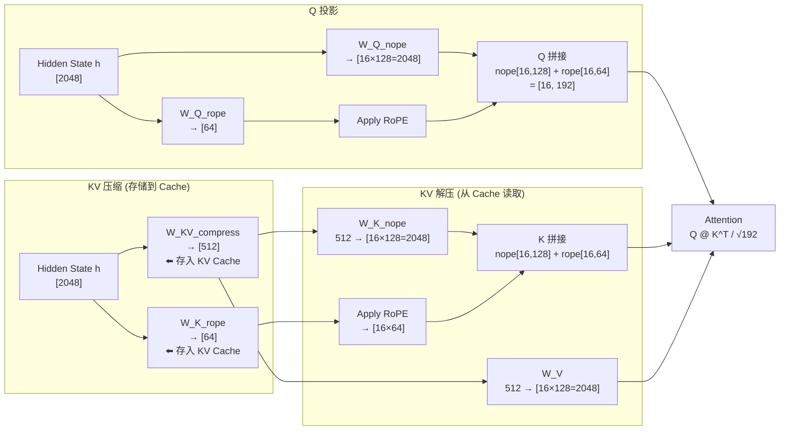

**MLA 注意力公式**:
$$\text{Attention}(Q, K, V) = \text{Softmax}\left(\frac{Q_{\text{nope}}K_{\text{nope}}^T + Q_{\text{rope}}K_{\text{rope}}^T}{\sqrt{d_h}}\right)V$$

其中：
- $c_t^{KV} = W^{DKV} \cdot h_t \in \mathbb{R}^{512}$ （压缩后的 KV 潜在表示）
- $K_{\text{nope}} = W^{UK} \cdot c_t^{KV} \in \mathbb{R}^{16 \times 128}$ （无位置编码的 Key）
- $V = W^{UV} \cdot c_t^{KV} \in \mathbb{R}^{16 \times 128}$ （Value）
- $K_{\text{rope}} = \text{RoPE}(W^{KR} \cdot h_t) \in \mathbb{R}^{64}$ （带 RoPE 的 Key 分量）
- $Q_{\text{rope}} = \text{RoPE}(W^{QR} \cdot h_t) \in \mathbb{R}^{64}$ （带 RoPE 的 Query 分量）

> **性能提示**: MLA 的 KV Cache 节省在长序列推理时尤为重要。在 128K 上下文下，相比标准 MHA，MLA 可将单层 KV Cache 从 ~1.5MB 降至 ~140KB，27 层累计节省约 37MB per sequence。

## 2.4 MoE 机制详解

Kimi-VL 的语言模型使用 **DeepSeek-V2 风格的 MoE**，每层 FFN 由 64 个可路由专家 + 2 个共享专家组成。

### MoE 路由机制

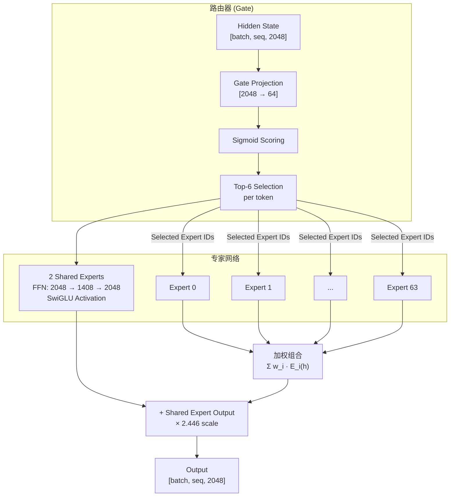

**MoE 计算数学表达**:
$$\text{MoE}(h) = h + \sum_{i \in \text{topK}} g_i \cdot E_i(h) + \alpha \cdot \sum_{j=1}^{N_{\text{shared}}} E_j^{\text{shared}}(h)$$

其中：
- $g_i = \frac{\exp(s_i)}{\sum_{k \in \text{topK}} \exp(s_k)}$ （归一化后的路由权重）
- $s_i = \sigma(W_{\text{gate}} \cdot h)_i$ （sigmoid 路由分数）
- $\alpha = 2.446$ （共享专家缩放因子）
- 每 token 激活 $\text{topK} = 6$ 个专家

### Kimi-VL MoE 设计特点

| 特性 | 实现 | 说明 |
|------|------|------|
| 路由评分函数 | **Sigmoid** (非 Softmax) | 避免专家间的零和竞争 |
| Top-K 选择 | **noaux_tc** (无辅助损失) | 通过 token choice 动态平衡负载 |
| 共享专家 | 2 个，始终激活 | 捕获通用知识，所有 token 共享 |
| 路由缩放因子 | 2.446 | 平衡路由专家和共享专家的贡献 |
| 首层密集 FFN | 第 1 层使用密集 FFN (非 MoE) | 输入分布不稳定时避免路由退化 |

> **关键洞察**: DeepSeek-V2 系列使用的 **noaux_tc (No Auxiliary Loss with Token Choice)** 路由策略避免了传统 MoE 中辅助负载均衡损失对主损失的干扰，通过让每个专家选择 top-C 个 token 来自然实现负载均衡。同时使用 sigmoid（而非 softmax）让专家选择更加独立。

## 2.5 位置编码与长上下文支持

Kimi-VL 使用 **RoPE** 作为位置编码，关键设计点：

- **RoPE 基频**: 从标准的 50,000 提升到 **800,000**，以支持 128K 上下文
- **上下文扩展**: 分两阶段各自扩展 4×（8K → 32K → 128K）
- **MLA 中的 RoPE 集成**: RoPE 仅应用于 Q/K 的 64 维 "rope" 分量，与 128 维 "nope" 分量解耦

---

# 第三部分: 输入预处理流程

## 3.1 文本预处理

Kimi-VL 使用 **TikToken 分词器**，词表大小为 **163,840**，采用类 ChatML 的对话模板格式。

### 3.1.1 Chat Template


对话格式示例：
```
<|im_system|>system<|im_middle|>You are a helpful assistant<|im_end|>
<|im_user|>user<|im_middle|>介绍一下这张图片<|media_start|>image<|media_content|><|media_pad|><|media_end|><|im_end|>
<|im_assistant|>assistant<|im_middle|>这张图片展示了...<|im_end|>
```

### 3.1.2 特殊 Token

| Token ID | 符号 | 用途 |
|----------|------|------|
| 163584 | `[BOS]` | 序列开始 |
| 163585 | `[EOS]` | 序列结束 |
| 163586 | `<\|im_end\|>` | 消息结束 |
| 163587 | `<\|im_user\|>` | 用户消息开始 |
| 163588 | `<\|im_assistant\|>` | 助手消息开始 |
| 163594 | `<\|im_system\|>` | 系统消息开始 |
| 163601 | `<\|im_middle\|>` | 角色与内容分隔 |
| 163602 | `<\|media_start\|>` | 媒体内容开始 |
| 163603 | `<\|media_content\|>` | 媒体内容标记 |
| 163604 | `<\|media_end\|>` | 媒体内容结束 |
| **163605** | `<\|media_pad\|>` | **图像占位符（关键）** |
| 163838 | `[PAD]` | 填充 |
| 163839 | `[UNK]` | 未知 |

## 3.2 多模态输入处理 (核心)

### 3.2.1 图像预处理管线

Kimi-VL 的图像预处理管线将原始图像转换为 MoonViT 可处理的 patch 序列：

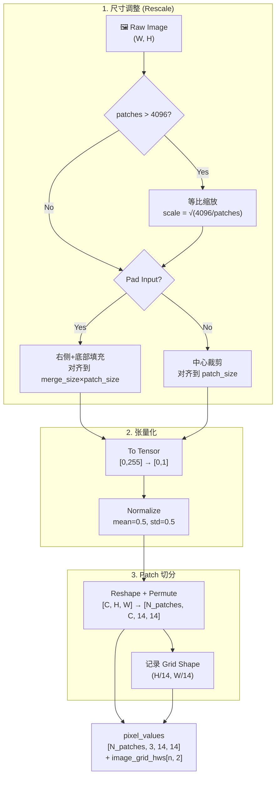

### 3.2.2 Token 替换机制

在文本中，`<|media_pad|>` token 会在预处理阶段被替换为正确数量的图像占位符：

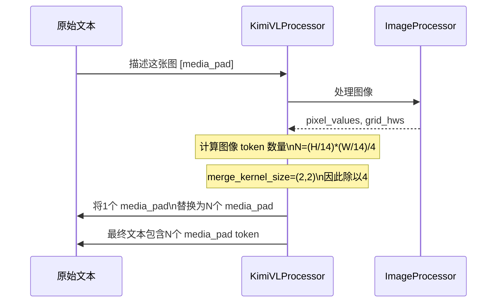

**关键代码** (`processing_kimi_vl.py`):
```python
if image_grid_hws is not None:
    merge_length = self.image_processor.merge_kernel_size[0] * \
                   self.image_processor.merge_kernel_size[1]  # = 4
    index = 0
    for i in range(len(text)):
        while self.image_token in text[i]:
            text[i] = text[i].replace(
                self.image_token,
                "<|placeholder|>" * (image_grid_hws[index].prod() // merge_length),
                1,
            )
            index += 1
        text[i] = text[i].replace("<|placeholder|>", self.image_token)
```

### 3.2.3 图像 Token 数量计算

vLLM 中计算给定图像大小的 token 数量：

```python
# 文件: vllm/model_executor/models/kimi_vl.py
class KimiVLProcessingInfo(BaseProcessingInfo):
    def get_num_image_tokens(self, *, image_width, image_height):
        patch_size = 14           # MoonViT patch size
        kernel_size = (2, 2)      # Merge kernel size
        in_token_limit = 4096     # Max patches before merging

        # 如果超过 token 限制，等比例缩放
        if (width // patch_size) * (height // patch_size) > in_token_limit:
            scale = math.sqrt(in_token_limit / patches)
            width, height = int(width * scale), int(height * scale)

        # Padding 到 kernel_size * patch_size 的倍数
        pad_h = (kernel[0] * 14 - height % (kernel[0] * 14)) % (kernel[0] * 14)
        pad_w = (kernel[1] * 14 - width  % (kernel[1] * 14)) % (kernel[1] * 14)

        # 最终输出 token 数 = 合并后的 grid 乘积
        token_h = (height + pad_h) // (kernel[0] * 14)
        token_w = (width  + pad_w) // (kernel[1] * 14)
        return token_h * token_w
```

### 3.2.4 vLLM 多模态输入格式

vLLM 中图像输入的 tensor schema：

```python
# 文件: vllm/model_executor/models/kimi_vl.py
class KimiVLImagePixelInputs(TensorSchema):
    """
    Dimensions:
        - np: Number of patches (所有图像 patch 拼接后)
        - 3:  RGB channels
        - ps: Patch size (14)
        - ni: Number of images
    """
    type: Literal["pixel_values"] = "pixel_values"
    pixel_values: torch.Tensor | list[torch.Tensor]  # shape: [np, 3, 14, 14]
    image_grid_hws: torch.Tensor                      # shape: [ni, 2]
```

---

# 第四部分: 模型前向传播流程

## 4.1 整体 Forward 流程

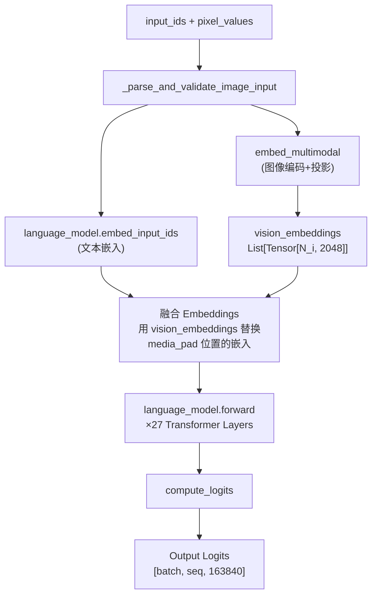

## 4.2 图像编码与投影详解

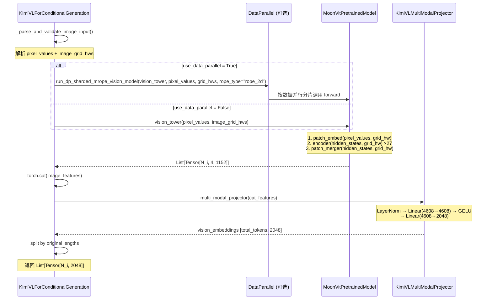

## 4.3 单层 Transformer 计算 (MLA + MoE)

```mermaid
flowchart TB
    subgraph Layer["Transformer Layer (MLA + MoE)"]
        Input["Hidden States<br/>[batch, seq, 2048]"]

        subgraph MLA["MLA Attention Block"]
            RMS1["RMSNorm"] --> QKV["Q/KV Projection"]
            QKV --> Q["Q: [16×128 nope + 64 rope]"]
            QKV --> KVComp["KV Compress: [512]"]
            QKV --> KRope["K Rope: [64]"]
            KVComp --> KCache["写入 KV Cache<br/>每 token: 576 values"]
            KRope --> KCache
            KVComp --> Decompress["K/V Decompress"]
            Decompress --> K_nope["K nope: [16×128]"]
            Decompress --> V["V: [16×128]"]
            Q & K_nope & KRope & V --> Attn["FlashAttention"]
        end

        subgraph MoE_FFN["MoE FFN Block"]
            RMS2["RMSNorm"] --> Gate["Gate: sigmoid scoring"]
            Gate --> Top6["Top-6 Expert Selection"]
            Top6 --> Dispatch["Expert Dispatch"]
            Dispatch --> E["64 Routed Experts<br/>SwiGLU: 2048→1408→2048"]
            E --> Combine["Weighted Sum"]
            Combine --> Shared["+ 2 Shared Experts"]
        end

        Attn --> Add1["+ Residual"] --> RMS2
        Shared --> Add2["+ Residual"] --> Output["Output<br/>[batch, seq, 2048]"]
    end

    Input --> RMS1
    Input --> Add1
    Add1 --> Add2
```

---

# 第五部分: ViT 计算流程 — MoonViT 深度解析

> 本章是本文档的核心部分，详细剖析 MoonViT 对多模态输入的处理机制。

## 5.1 MoonViT 架构概览

MoonViT 是一个 **原生分辨率视觉编码器**，继承了 SigLIP-SO-400M 的权重初始化，通过 NaViT 风格 patch packing 和双重位置编码实现对可变分辨率图像的高效处理。

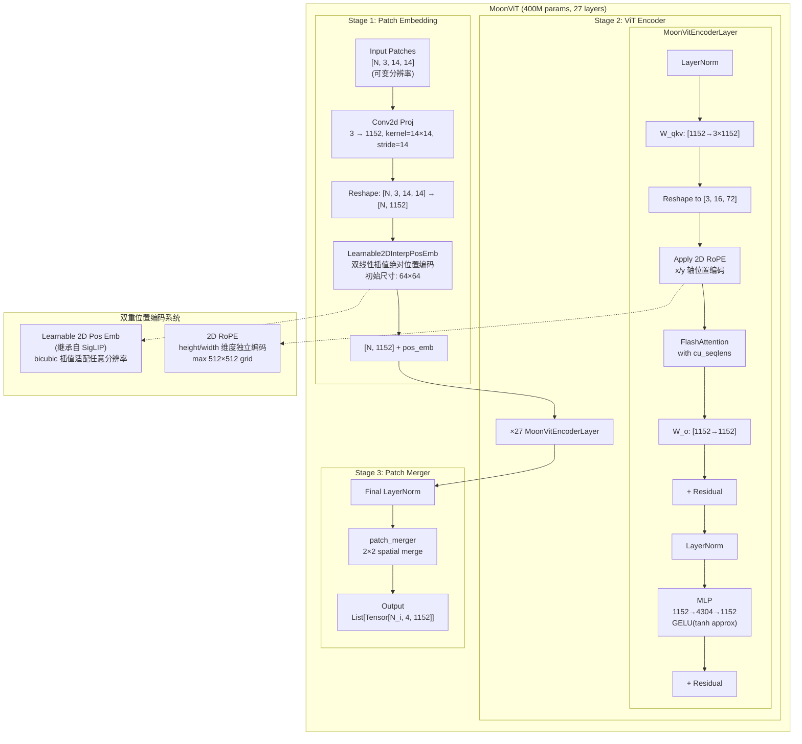

## 5.2 Patch Embedding 详解

### 5.2.1 MoonVisionPatchEmbed

```python
# 文件: vllm/model_executor/models/moonvit.py
class MoonVisionPatchEmbed(nn.Module):
    def __init__(self, out_dim=1152, in_dim=3, patch_size=14,
                 pos_emb_height=64, pos_emb_width=64):
        # Conv2d: 将图像 patch 线性投影到嵌入维度
        self.proj = Conv2dLayer(in_dim, out_dim,
                                kernel_size=14, stride=14)

        # 可学习 2D 绝对位置编码 (插值式)
        self.pos_emb = Learnable2DInterpPosEmb(
            height=64, width=64, dim=1152
        )

    def forward(self, x: torch.Tensor, grid_hw: torch.Tensor):
        # x: [total_patches, 3, 14, 14]
        # grid_hw: [num_images, 2]
        x = self.proj(x).view(x.size(0), -1)  # [total_patches, 1152]
        x = self.pos_emb(x, grid_hw)           # 添加插值位置编码
        return x
```

### 5.2.2 双重位置编码机制

MoonViT 最关键的创新之一是 **双重位置编码系统**：

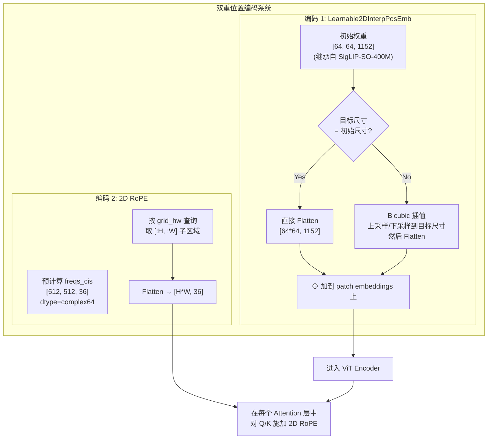

**Learnable2DInterpPosEmb** 的插值逻辑：

```python
# 文件: vllm/model_executor/models/moonvit.py
class Learnable2DInterpPosEmb(nn.Module):
    def __init__(self, height=64, width=64, dim=1152,
                 interpolation_mode="bicubic"):
        self.weight = nn.Parameter(torch.empty(height, width, dim))
        # 正态分布初始化

    def forward(self, x, grid_hws):
        pos_embs = []
        for shape in grid_hws.tolist():   # e.g., [(32, 32), (16, 48), ...]
            if shape == self.weight.shape[:-1]:
                # 初始尺寸匹配，直接使用
                pos_embs.append(self.weight.flatten(end_dim=1))
            else:
                # 需要插值: [64, 64, 1152] → [H, W, 1152]
                interpolated = F.interpolate(
                    self.weight.permute(2, 0, 1).unsqueeze(0),  # [1, 1152, 64, 64]
                    size=shape,              # 目标 (H, W)
                    mode="bicubic"
                )  # → [1, 1152, H, W]
                pos_embs.append(
                    interpolated.squeeze(0).permute(1, 2, 0).flatten(end_dim=1)
                    # → [H*W, 1152]
                )
        return x + torch.cat(pos_embs)
```

> **关键洞察**: Learnable2DInterpPosEmb 继承自 SigLIP 的绝对位置编码，保留了 SigLIP 预训练时的空间感知能力。然而，当图像分辨率远超初始 64×64 网格时，插值会引入近似误差。**2D RoPE 正是为了解决这一问题而引入的** — 它为高分辨率图像提供精确的相对位置信息，与插值后的绝对编码互补。

### 5.2.3 2D RoPE 设计与实现

MoonViT 中的 2D RoPE 是 ViT 领域的一个创新应用，将原本用于语言模型的 RoPE 扩展到 2D 空间：

```python
# 文件: vllm/model_executor/models/moonvit.py
class Rope2DPosEmb(nn.Module):
    def __init__(self, dim=72, max_height=512, max_width=512,
                 theta_base=10000):
        # dim 必须是 4 的倍数 (x/y 各占一半，每半为复数)
        assert dim % 4 == 0

    @cached_property
    def precomputed_freqs_cis(self):
        """预计算整个 512×512 网格的 cis 值"""
        # 频率计算: 前半给 height，后半给 width
        # theta_h[w] = exp(i * h * theta_base^(-4k/dim))
        # theta_w[h] = exp(i * w * theta_base^(-4k/dim))

        dim_range = torch.arange(0, dim, 4)[:dim//4]  # [0, 4, 8, ..., 68]
        freqs = 1.0 / (theta_base ** (dim_range / dim))  # [dim//4]

        # 分别计算 height 和 width 维度的 cis
        x_cis = torch.polar(torch.ones_like(x_freqs), x_freqs)  # [N, 18]
        y_cis = torch.polar(torch.ones_like(y_freqs), y_freqs)  # [N, 18]

        # 拼接为 [512, 512, 36] complex tensor
        freqs_cis = torch.cat([x_cis.unsqueeze(-1),
                               y_cis.unsqueeze(-1)], dim=-1)
        return freqs_cis.reshape(512, 512, -1)  # [512, 512, 36]

    def get_freqs_cis_by_seqlens(self, grid_hws):
        """按实际的 (height, width) 提取对应的 freqs_cis"""
        shapes = grid_hws.tolist()
        freqs_cis = torch.cat([
            self.precomputed_freqs_cis[:h, :w].reshape(-1, self.dim // 2)
            for h, w in shapes
        ], dim=0)
        return freqs_cis  # [total_tokens, 36]
```

**RoPE 在 Attention 中的应用**:

```python
# 文件: vllm/model_executor/models/moonvit.py
def apply_rope(xq, xk, freqs_cis):
    """
    Args:
        xq: [seqlen, num_heads, head_dim=72]
        xk: [seqlen, num_heads, head_dim=72]
        freqs_cis: [seqlen, head_dim/2=36], complex64
    """
    # 将 Q/K 视为复数 (每两个连续值作为实部和虚部)
    xq_ = torch.view_as_complex(xq.float().view(*xq.shape[:-1], -1, 2))
    xk_ = torch.view_as_complex(xk.float().view(*xk.shape[:-1], -1, 2))

    # 复数乘法 = 旋转
    xq_out = torch.view_as_real(xq_ * freqs_cis).flatten(-2)
    xk_out = torch.view_as_real(xk_ * freqs_cis).flatten(-2)

    return xq_out, xk_out
```

**2D RoPE 频率分配**:
$$\text{对于 head dim } d = 72, \text{ 频率维度 } d_{\text{freq}} = 36:$$
$$\text{位置 } (h, w) \text{ 的编码: } \begin{cases} \text{cis}(h \cdot \theta^{-4i/d}), & i = 0, 2, 4, ..., 34 \quad (\text{height 轴}) \\ \text{cis}(w \cdot \theta^{-4i/d}), & i = 1, 3, 5, ..., 35 \quad (\text{width 轴}) \end{cases}$$

## 5.3 ViT Encoder 层详解

### 5.3.1 MoonVitEncoderLayer

```python
# 文件: vllm/model_executor/models/moonvit.py
class MoonVitEncoderLayer(nn.Module):
    def __init__(self, num_heads=16, hidden_dim=1152, mlp_dim=4304):
        self.norm0 = nn.LayerNorm(1152)     # Pre-Attention Norm
        self.norm1 = nn.LayerNorm(1152)     # Pre-FFN Norm
        self.wqkv = QKVParallelLinear(       # QKV 联合投影
            hidden_size=1152,
            head_size=72,
            total_num_heads=16,
            total_num_kv_heads=16,          # MHA (非 GQA)
        )
        self.wo = RowParallelLinear(1152, 1152)
        self.attn = MMEncoderAttention(      # 多模态编码器专用 Attention
            num_heads=16, head_size=72, scale=72**-0.5
        )
        self.mlp = MLP2(
            [1152, 4304, 1152],
            activation=gelu_pytorch_tanh,    # GELU tanh 近似
        )
```

### 5.3.2 Attention 中的 cu_seqlens Packed 序列处理

由于 MoonViT 使用 NaViT 风格打包，同一 batch 内多个图像被拼接为一个长序列。`cu_seqlens` 用于标识每个子序列的边界：

```python
# 文件: vllm/model_executor/models/moonvit.py
class MoonVitEncoder(nn.Module):
    def forward(self, hidden_states, grid_hw):
        # hidden_states: [total_tokens, 1152]
        # grid_hw: e.g., [(32, 32), (28, 48)] — 2 images

        # 生成 cu_seqlens 用于 FlashAttention 变长序列
        lengths = torch.cat([
            torch.zeros(1),
            (grid_hw[:, 0] * grid_hw[:, 1]).to(device)
        ])
        # lengths = [0, 1024, 2368] (for two images)
        cu_seqlens = lengths.cumsum(dim=0, dtype=torch.int32)
        # cu_seqlens = [0, 1024, 2368]

        for block in self.blocks:
            hidden_states = block(hidden_states, cu_seqlens, rope_freqs_cis)

        return self.final_layernorm(hidden_states)
```

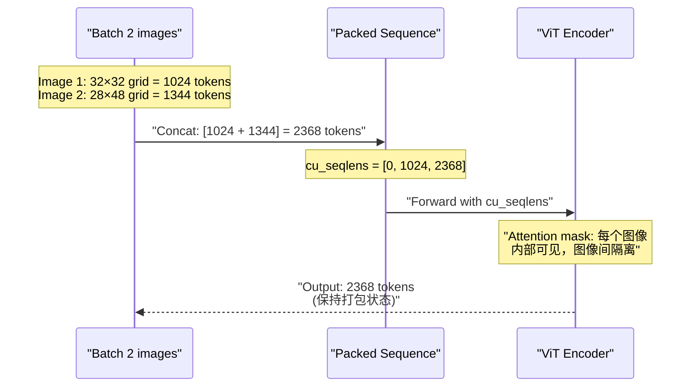

> **性能提示**: NaViT 风格打包允许 batch 内包含不同分辨率的图像，但要求使用 FlashAttention 的 varlen 模式。每张图像的 tokens 在 Attention 中只能看到同图像内的其他 tokens，图像之间通过 cu_seqlens 机制隔离。

## 5.4 Patch Merger — 空间压缩投影

Patch Merger 是 MoonViT 输出前的最后一步，通过空间合并减少视觉 token 数量：

```python
# 文件: vllm/model_executor/models/moonvit.py
def patch_merger(x, grid_hw, merge_kernel_size=(2, 2)):
    """2×2 空间合并: 每 2×2 的 patch 特征被拼接起来"""
    outputs = []
    pre_sum = 0
    for x_shape in grid_hw.tolist():
        height, width = x_shape[0], x_shape[1]

        # 提取当前图像的特征
        seq = x[pre_sum : pre_sum + height * width]  # [H*W, 1152]

        # Reshape 为 2D 空间布局，然后合并
        # [H, W, 1152] → [H/2, 2, W/2, 2, 1152]
        # → [H/2, W/2, 2, 2, 1152] → [H/2, W/2, 4*1152]
        reshaped = seq.view(new_height, 2, new_width, 2, 1152)
        reshaped = reshaped.permute(0, 2, 1, 3, 4).contiguous()
        merged = reshaped.view(new_height * new_width, 4, 1152)
        # merged: [H/2 * W/2, 4, 1152]

        outputs.append(merged)  # 每个图像一个 tensor
        pre_sum += height * width

    return outputs
```

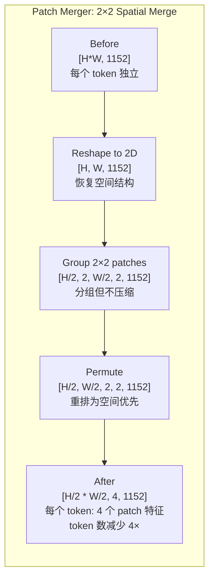

> **关键洞察**: Patch Merger 的 2×2 空间合并将视觉 token 数量减少 **4 倍**，同时将每个 token 的通道数扩大 4 倍（1152 → 4608）。这不同于简单的 stride-2 池化 — 它保留了所有信息，仅重新组织了 token 结构。后续 MLP 投影器的 pixel shuffle 操作正是为了处理这种分组通道格式。

## 5.5 MLP 投影器 — 视觉到语言的桥梁

```python
# 文件: vllm/model_executor/models/kimi_vl.py
class KimiVLMultiModalProjector(nn.Module):
    def __init__(self, config):
        # 输入维度: 合并后的通道数 = 1152 * 2 * 2 = 4608
        self.hidden_size = config.vision_config.hidden_size \
                         * config.vision_config.merge_kernel_size[0] \
                         * config.vision_config.merge_kernel_size[1]
        # hidden_size = 1152 * 2 * 2 = 4608

        self.pre_norm = nn.LayerNorm(1152)
        self.linear_1 = ReplicatedLinear(4608, 4608, bias=True)
        self.linear_2 = ReplicatedLinear(4608, 2048, bias=True)
        self.act = GELUActivation()

    def forward(self, image_features):
        # image_features: total tokens from all images, each [4, 1152]
        # Step 1: Pre-norm + Flatten
        hidden_states = self.pre_norm(image_features).view(-1, 4608)
        # [N, 4, 1152] → [N, 4608]

        # Step 2: Two-layer MLP
        hidden_states = self.linear_1(hidden_states)  # [N, 4608]
        hidden_states = self.act(hidden_states)
        hidden_states = self.linear_2(hidden_states)  # [N, 2048]

        return hidden_states
```

### 投影器数据流

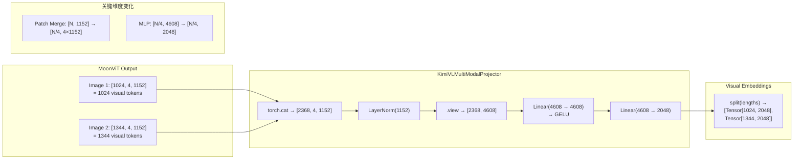

## 5.6 MoonViT 完整前向传播流程总结

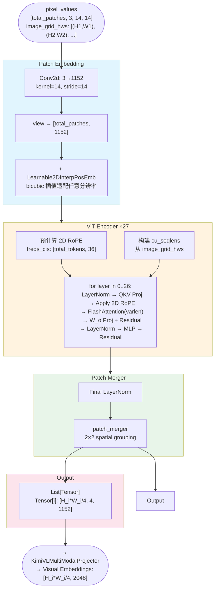

### 每一步的 Tensor Shape 变化

| 步骤 | 操作 | 输入 Shape | 输出 Shape |
|------|------|-----------|-----------|
| 1 | Image Processing | PIL Image (W, H) | `[N_patches, 3, 14, 14]` |
| 2 | Conv2d Proj | `[N, 3, 14, 14]` | `[N, 1152]` |
| 3 | + Abs Pos Emb | `[N, 1152]` | `[N, 1152]` |
| 4 | ViT Encoder ×27 | `[N, 1152]` | `[N, 1152]` |
| 5 | Final LayerNorm | `[N, 1152]` | `[N, 1152]` |
| 6 | Patch Merger | `[N, 1152]` | `[N/4, 4, 1152]` |
| 7 | Cat + Pre-norm | List of `[N_i/4, 4, 1152]` | `[total_N/4, 4608]` |
| 8 | MLP Layer 1 | `[M, 4608]` | `[M, 4608]` |
| 9 | GELU | `[M, 4608]` | `[M, 4608]` |
| 10 | MLP Layer 2 | `[M, 4608]` | `[M, 2048]` |
| 11 | Split to images | `[M, 2048]` | List of `[M_i, 2048]` |

### MoonViT 关键设计总结

| 设计要素 | 实现方式 | 解决的问题 |
|---------|---------|-----------|
| 原生分辨率 | NaViT patch packing | 避免固定分辨率导致的信息丢失或浪费 |
| 双重位置编码 | Learnable2D + 2D RoPE | 低分辨率用预训练先验，高分辨率用相对位置补充 |
| 可变序列 Attention | cu_seqlens + FlashAttention varlen | Batch 内混合分辨率的高效并行处理 |
| Patch Merger | 2×2 空间分组 | 压缩 token 数量（4×），同时保留全部信息 |
| 通道扩展投影 | 4608 → 2048 MLP | 将视觉语义空间对齐到语言模型的嵌入空间 |

---

# 第六部分: vLLM 中的代码实现

## 6.1 模型注册与配置

Kimi-VL 在 vLLM 中采用 **多模态注册机制**，通过 `MULTIMODAL_REGISTRY` 将模型、处理器、信息类绑定：

```python
# 文件: vllm/model_executor/models/kimi_vl.py
@MULTIMODAL_REGISTRY.register_processor(
    KimiVLMultiModalProcessor,       # 多模态处理器
    info=KimiVLProcessingInfo,       # 处理信息（token 数量计算等）
    dummy_inputs=KimiVLDummyInputsBuilder,  # 虚拟输入构建器
)
class KimiVLForConditionalGeneration(
    nn.Module, SupportsMultiModal, SupportsPP
):
    supports_encoder_tp_data = True   # 支持数据并行的编码器

    @classmethod
    def get_placeholder_str(cls, modality, i):
        if modality.startswith("image"):
            return "<|media_start|>image<|media_content|><|media_pad|><|media_end|>"
        raise ValueError("Only image modality is supported")
```

### 配置类层次

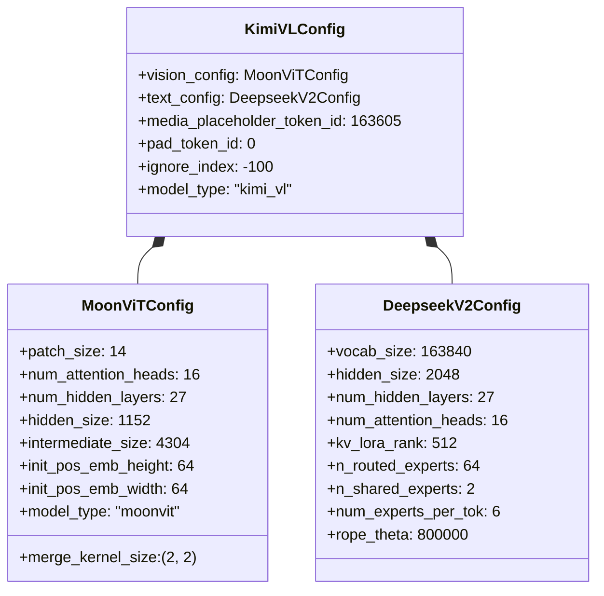

## 6.2 核心模型类分析

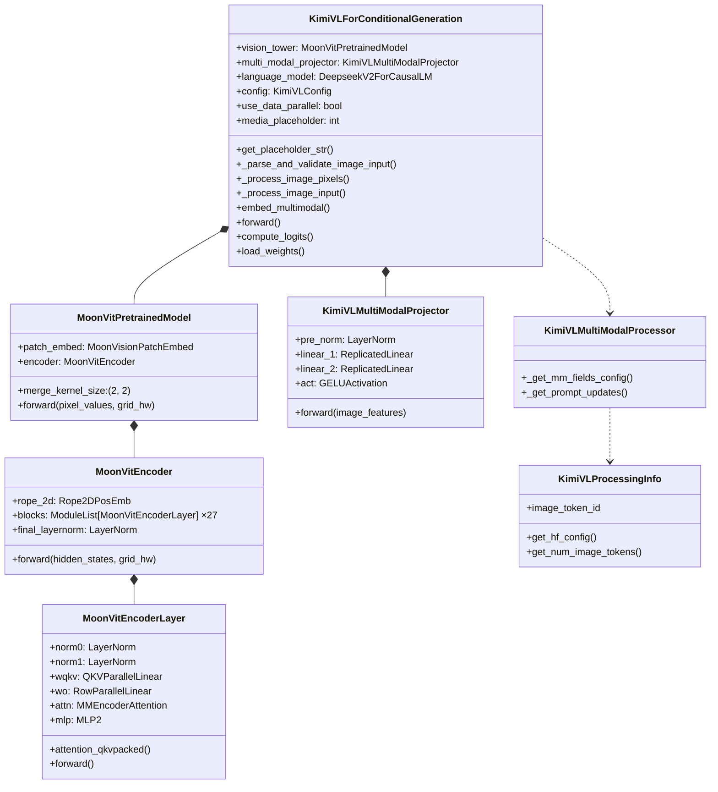

## 6.3 关键计算流程代码分析

### 6.3.1 图像编码入口

```python
# 文件: vllm/model_executor/models/kimi_vl.py
class KimiVLForConditionalGeneration:
    def embed_multimodal(self, **kwargs):
        # Step 1: 验证并解析图像输入
        image_input = self._parse_and_validate_image_input(**kwargs)
        if image_input is None:
            return None

        # Step 2: 图像编码 + 投影
        vision_embeddings = self._process_image_input(image_input)
        # vision_embeddings: List[Tensor[N_i, 2048]]

        return vision_embeddings

    def _process_image_input(self, image_input):
        # Step 2a: MoonViT 编码
        image_features = self._process_image_pixels(image_input)
        # image_features: List[Tensor[N_i, 4, 1152]]

        # Step 2b: Cat + MLP 投影
        lengths = [x.shape[0] for x in image_features]
        return self.multi_modal_projector(
            torch.cat(image_features)
        ).split(lengths)
```

### 6.3.2 数据并行 vs 张量并行

vLLM 支持两种 MoonViT 并行策略：

```python
# 文件: vllm/model_executor/models/kimi_vl.py
def _process_image_pixels(self, inputs):
    pixel_values = inputs["pixel_values"]
    image_grid_hws = inputs["image_grid_hws"]

    if self.use_data_parallel:
        # 数据并行: 每张 GPU 处理不同的图像
        return run_dp_sharded_mrope_vision_model(
            self.vision_tower,
            pixel_values,
            image_grid_hws.tolist(),
            rope_type="rope_2d",  # 关键: 标记为 2D RoPE 类型
        )
    else:
        # 张量并行: 每张 GPU 处理相同的图像的不同部分
        return self.vision_tower(pixel_values, image_grid_hws)
```

## 6.4 vLLM 特有优化

### 6.4.1 MMEncoderAttention

MoonViT 使用 vLLM 专用的 `MMEncoderAttention`，专门为多模态编码器优化：

- **变长序列支持**: 通过 `cu_seqlens` 参数高效处理 batch 内图像分辨率不一致的情况
- **FlashAttention 后端**: 自动选择最优的 FlashAttention 实现（FA2/FA3）
- **无 KV Cache**: 编码器只做双向自注意力，不缓存 KV

### 6.4.2 ReplicatedLinear vs ColumnParallelLinear

- **ReplicatedLinear** (在 Projector 中): 权重在每个 rank 上完整复制，用于数据并行模式
- **ColumnParallelLinear/RowParallelLinear** (在 ViT 中): 权重按列/行切分，用于张量并行模式

### 6.4.3 PagedAttention 集成

Kimi-VL 的语言模型作为标准 vLLM 模型运行，自动受益于：
- **PagedAttention**: KV Cache 分页管理，提高 GPU 内存利用率
- **Chunked Prefill**: 长 prefill 序列分块处理
- **Prefix Caching**: 相同 prefix 的 KV Cache 复用

### 6.4.4 多模态数据并行编码器

当 `mm_encoder_tp_mode = "data"` 时，MoonViT 使用数据并行策略：

- 图像被分配到不同的 GPU 上独立编码
- 减少了跨 GPU 通信开销
- 适用于 batch 中有多张图像的场景
- 通过 2D RoPE 特殊处理确保位置编码正确性

---

# 附录

## A. 关键代码位置索引

| 组件 | 文件路径 | 关键类/函数 |
|------|---------|------------|
| 模型入口 | `vllm/model_executor/models/kimi_vl.py` | `KimiVLForConditionalGeneration` |
| MoonViT 视觉塔 | `vllm/model_executor/models/moonvit.py` | `MoonVitPretrainedModel` |
| ViT Encoder | `vllm/model_executor/models/moonvit.py` | `MoonVitEncoder`, `MoonVitEncoderLayer` |
| Patch Embedding | `vllm/model_executor/models/moonvit.py` | `MoonVisionPatchEmbed` |
| 2D RoPE | `vllm/model_executor/models/moonvit.py` | `Rope2DPosEmb` |
| 可学习 2D 位置编码 | `vllm/model_executor/models/moonvit.py` | `Learnable2DInterpPosEmb` |
| Patch Merger | `vllm/model_executor/models/moonvit.py` | `patch_merger()` |
| RoPE 应用 | `vllm/model_executor/models/moonvit.py` | `apply_rope()` |
| MLP 投影器 | `vllm/model_executor/models/kimi_vl.py` | `KimiVLMultiModalProjector` |
| 多模态处理器 | `vllm/model_executor/models/kimi_vl.py` | `KimiVLMultiModalProcessor` |
| 处理信息 | `vllm/model_executor/models/kimi_vl.py` | `KimiVLProcessingInfo` |
| 模型配置 | `vllm/transformers_utils/configs/kimi_vl.py` | `KimiVLConfig` |
| MoonViT 配置 | `vllm/transformers_utils/configs/moonvit.py` | `MoonViTConfig` |
| 图像处理器 (HF) | `image_processing_kimi_vl.py` | `KimiVLImageProcessor` |
| 处理器 (HF) | `processing_kimi_vl.py` | `KimiVLProcessor` |
| 注意力层 | `vllm/model_executor/layers/attention.py` | `MMEncoderAttention` |
| 卷积层 | `vllm/model_executor/layers/conv.py` | `Conv2dLayer` |
| VLM 接口 | `vllm/model_executor/models/interfaces.py` | `SupportsMultiModal` |
| 视觉工具 | `vllm/model_executor/models/vision.py` | `run_dp_sharded_mrope_vision_model` |
| Tokenizer 工具 | `vllm/tokenizers/kimi_audio.py` | (TikToken 相关) |

## B. 术语表

| 术语 | 英文 | 说明 |
|------|------|------|
| 混合专家 | MoE (Mixture of Experts) | 稀疏激活的 FFN 架构 |
| 多头潜在注意力 | MLA (Multi-head Latent Attention) | DeepSeek-V2 的低秩 KV 压缩注意力 |
| 视觉 Transformer | ViT (Vision Transformer) | 基于 Transformer 的图像编码器 |
| 旋转位置编码 | RoPE (Rotary Position Embedding) | 通过旋转矩阵编码相对位置 |
| 分组查询注意力 | GQA (Grouped-Query Attention) | Q 头分组共享 KV 头 |
| SwiGLU | SwiGLU | Swish-Gated Linear Unit 激活函数 |
| RMS 归一化 | RMSNorm (Root Mean Square Normalization) | 简化版 LayerNorm |
| 数据并行 | Data Parallelism (DP) | 不同 GPU 处理不同数据 |
| 张量并行 | Tensor Parallelism (TP) | 单层权重张量切分到多个 GPU |
| 专家并行 | Expert Parallelism (EP) | 不同 GPU 持有不同 MoE 专家 |
| 分页注意力 | PagedAttention | KV Cache 分页内存管理 |
| 像素混洗 | Pixel Shuffle | 空间→通道维度重排操作 |

## C. 参考资料

- [Kimi-VL Technical Report (arXiv 2504.07491)](https://arxiv.org/abs/2504.07491)
- [Kimi-VL GitHub Repository](https://github.com/MoonshotAI/Kimi-VL)
- [Kimi-VL HuggingFace Model](https://huggingface.co/moonshotai/Kimi-VL-A3B-Instruct)
- [DeepSeek-V2 Paper (arXiv 2405.04434)](https://arxiv.org/abs/2405.04434)
- [Moonlight GitHub](https://github.com/MoonshotAI/Moonlight)
- [NaViT Paper (arXiv 2307.06304)](https://arxiv.org/abs/2307.06304)
- [SigLIP Paper (arXiv 2303.15343)](https://arxiv.org/abs/2303.15343)
- [LLM Architecture Gallery](https://sebastianraschka.com/llm-architecture-gallery/)
- [vLLM Documentation — Supported Models](https://docs.vllm.ai/en/latest/models/supported_models/)
- [vLLM Multimodal Guide](https://docs.vllm.ai/en/latest/features/multimodal_inputs/)
