# vLLM Llama 4 模型技术教程

> **文档版本**: 1.0
> **分析代码版本**: vLLM main 分支（截至 2025-05）
> **最后更新**: 2025-05-27
> **模型系列**: Meta Llama 系列
> **模型类型**: VLM-MoE（多模态 + Mixture of Experts）

---

## 文档概述

本教程深入分析 Meta Llama 4 系列模型在 vLLM 中的实现，重点关注其多模态 ViT 处理流程与 MoE 架构设计。内容涵盖：Llama 4 系列演进、iRoPE 注意力机制、MoE 路由与负载均衡、ViT 视觉编码器完整计算流程、以及 vLLM 中 Early Fusion 多模态融合策略。

**目标读者**: 对 vLLM 多模态推理有兴趣的工程师、研究者；需要理解 Llama 4 架构细节以进行部署优化的开发者。

**推荐阅读顺序**: 第一部分（系列概览）→ 第二部分（架构详解）→ 第五部分（ViT 计算流程）→ 第三部分（输入预处理）→ 第四部分（前向传播）→ 第六部分（代码实现）。

---

# 第一部分: Llama 4 模型系列概述与演进

## 1.1 模型系列发展历史

Meta 的 Llama 系列经历了从纯文本到原生多模态的演进：

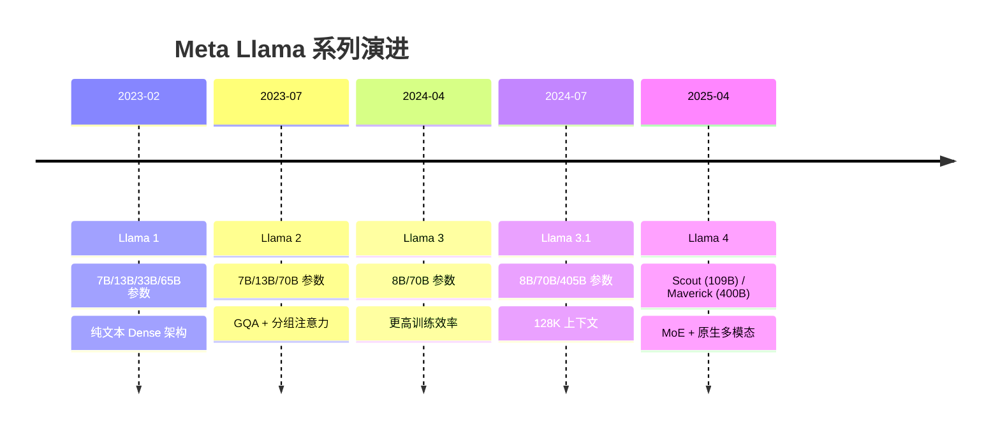

**关键转折点**: Llama 4 是系列中首次引入 MoE 架构和原生多模态（Early Fusion）的模型，标志着 Meta 从 Dense LLM 策略转向高效的 Sparse MoE 路线。

## 1.2 同系列模型对比

| 模型名称 | 总参数量 | 激活参数量 | 专家数 | 架构类型 | 上下文长度 | 多模态 | 发布日期 | HuggingFace |
|---------|---------|----------|--------|---------|-----------|--------|---------|------------|
| Llama 3.1 8B | 8B | 8B | - | Dense | 128K | 否 | 2024-07 | [meta-llama/Llama-3.1-8B](https://huggingface.co/meta-llama/Llama-3.1-8B) |
| Llama 3.1 70B | 70B | 70B | - | Dense | 128K | 否 | 2024-07 | [meta-llama/Llama-3.1-70B](https://huggingface.co/meta-llama/Llama-3.1-70B) |
| Llama 3.1 405B | 405B | 405B | - | Dense | 128K | 否 | 2024-07 | [meta-llama/Llama-3.1-405B](https://huggingface.co/meta-llama/Llama-3.1-405B) |
| **Llama 4 Scout** | **109B** | **17B** | **16** | **MoE** | **10M** | **是** | **2025-04** | [meta-llama/Llama-4-Scout-17B-16E-Instruct](https://huggingface.co/meta-llama/Llama-4-Scout-17B-16E-Instruct) |
| **Llama 4 Maverick** | **400B** | **17B** | **128+1** | **MoE** | **1M** | **是** | **2025-04** | [meta-llama/Llama-4-Maverick-17B-128E-Instruct](https://huggingface.co/meta-llama/Llama-4-Maverick-17B-128E-Instruct) |
| Llama 4 Behemoth | ~2T | 288B | 16 | MoE | — | 是 | 未发布（教师模型） | — |

## 1.3 Scout 与 Maverick 架构差异

| 维度 | Llama 4 Scout | Llama 4 Maverick |
|------|--------------|------------------|
| **MoE 层级模式** | `interleave_moe_layer_step=1`（每层都是 MoE） | `interleave_moe_layer_step=2`（MoE 与 Dense 交替） |
| **位置编码** | 全部使用 RoPE + Chunked Local Attention | iRoPE: 3/4 层用 RoPE, 1/4 层用 NoPE（全注意力） |
| **QK Normalization** | RoPE 层上启用 | RoPE 层上启用 |
| **Attention 温度调节** | 不适用（无 NoPE 层） | NoPE 层上启用（长上下文时自动缩放） |
| **上下文实现策略** | 全部 Chunked Local Attention → 极长上下文 | 混合 NoPE（全局注意力）+ RoPE（分块注意力） |
| **训练数据量** | ~40T tokens | ~22T tokens |
| **蒸馏来源** | Llama 4 Behemoth（Co-distillation） | Llama 4 Behemoth（Co-distillation） |

> **关键洞察**: Scout 通过全 Chunked Local Attention 实现 10M 超长上下文，而 Maverick 通过 iRoPE 混合策略在长上下文和全局理解之间取得平衡。

## 1.4 技术报告与论文汇总

Meta 截至 2025-05 尚未发布完整的 Llama 4 技术报告（类比 Llama 2 paper），主要信息来源为：

| 来源 | 链接 | 说明 |
|------|------|------|
| Meta 官方博客 | [The Llama 4 Herd](https://ai.meta.com/blog/llama-4-multimodal-intelligence/) | 架构概述、性能基准 |
| Meta 官方 Model Card | [GitHub: llama-models/models/llama4](https://github.com/meta-llama/llama-models/blob/main/models/llama4/MODEL_CARD.md) | 基础配置、部署要求 |
| HF 博客 | [Welcome Llama 4 Maverick & Scout](https://huggingface.co/blog/llama4-release) | 架构细节、HuggingFace 集成 |
| Attention 温度调节论文 | [arxiv: 2501.19399](https://arxiv.org/abs/2501.19399) | NoPE 层温度调节机制理论基础 |
| NVIDIA 技术博客 | [NVIDIA Accelerates Inference on Llama 4](https://developer.nvidia.com/blog/nvidia-accelerates-inference-on-meta-llama-4-scout-and-maverick/) | GPU 优化、FP8/INT4 推理 |
| vLLM Llama 4 初始支持 Issue | [vllm #16106](https://github.com/vllm-project/vllm/issues/16106) | vLLM 适配讨论 |
| vLLM 源码 PR | [vllm #20591](https://github.com/vllm-project/vllm/pull/20591) | 正式 Llama 4 支持合入 |

---

# 第二部分: Llama 4 模型架构详解

## 2.1 整体架构概览

Llama 4 采用 **Early Fusion 原生多模态** + **MoE Decoder-only** 架构：

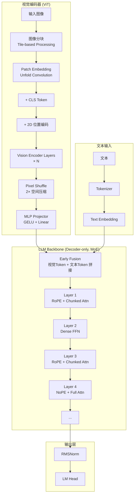

> **关键洞察**: 与 LLaVA 等模型的 "Late Fusion"（Cross-Attention 或独立的 Visual Resampler）不同，Llama 4 的 Early Fusion 将视觉 token 直接拼接到文本 token 序列的开头，视觉 token 与文本 token 共享同一个 Transformer Backbone，实现更深层次的跨模态交互。

## 2.2 核心超参数

| 参数 | Llama 4 Scout | Llama 4 Maverick | 说明 |
|------|--------------|------------------|------|
| `hidden_size` | 12,288 | 12,288 | 隐藏层维度 |
| `num_hidden_layers` | 120 | 120 | Decoder 层数 |
| `num_attention_heads` | 96 | 96 | Query 注意力头数 |
| `num_key_value_heads` | 8 | 8 | KV 注意力头数（GQA 压缩比 12:1） |
| `head_dim` | 128 | 128 | 每头维度（hidden_size/num_attention_heads） |
| `intermediate_size` | 8,192 | 8,192 | MoE 专家 FFN 中间维度 |
| `intermediate_size_mlp` | 8,192 | 8,192 | Dense 层 FFN 中间维度 |
| `num_local_experts` | 16 | 128 | 每层路由专家数（不含共享专家） |
| `num_experts_per_tok` | 2 | 2 | Top-K 激活专家数 |
| `interleave_moe_layer_step` | 1 | 2 | MoE 层间隔（1=每层MoE, 2=隔层MoE） |
| `vocab_size` | 202,048 | 202,048 | 词表大小 |
| `max_position_embeddings` | 10,485,760 (10M) | 1,048,576 (1M) | 最大位置编码 |
| `rms_norm_eps` | 1e-5 | 1e-5 | RMSNorm 稳定性参数 |
| `rope_theta` | 500,000 | 500,000 | RoPE 基频 |
| `attention_chunk_size` | 8,192 | 8,192 | Chunked Local Attention 分块大小 |
| `activation_function` | SiLU (SwiGLU) | SiLU (SwiGLU) | 激活函数 |

### ViT 视觉编码器参数

| 参数 | 值 | 说明 |
|------|-----|------|
| `image_size` | 560 | 每个 Tile 的图像尺寸（像素） |
| `patch_size` | 14 | 每个 Patch 的尺寸（像素） |
| `num_channels` | 3 | 输入通道数（RGB） |
| `vision_config.hidden_size` | 1,280 | ViT 隐藏层维度 |
| `vision_config.intermediate_size` | 5,120 | ViT FFN 中间维度 |
| `vision_config.num_hidden_layers` | 32 | ViT Encoder 层数 |
| `vision_config.num_attention_heads` | 16 | ViT 注意力头数 |
| `vision_config.head_dim` | 80 | ViT 每头维度 |
| `vision_config.pixel_shuffle_ratio` | 2 | Pixel Shuffle 空间压缩率 |
| `vision_config.projector_input_dim` | 5,120 | Projector MLP 输入维度 |
| `vision_config.projector_output_dim` | 12,288 | Projector 输出维度（= text hidden_size） |
| `vision_config.vision_output_dim` | 12,288 | Vision 最终输出维度 |
| `vision_config.rope_theta` | 10,000 | ViT RoPE 基频 |

## 2.3 注意力机制详解 — iRoPE（Interleaved RoPE）

Llama 4 的核心创新之一是 **iRoPE**（交错式 RoPE），将 Transformer 层分为两类：

### 技术原理: iRoPE 设计

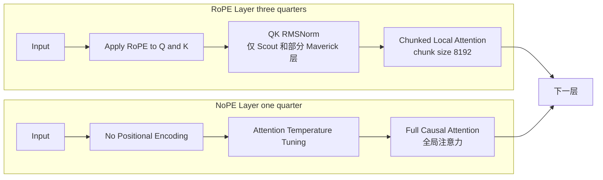

### RoPE 层的 Chunked Local Attention

在 RoPE 层中，Q 和 K 经过 RoPE 编码后，注意力计算被限制在 8,192 token 的局部窗口内：

$$\text{Attention}(Q, K, V) = \text{softmax}\left(\frac{QK^T}{\sqrt{d_k}} + \text{ChunkMask}\right)V$$

其中 ChunkMask 确保每个 token 只关注同一 Chunk 内的其他 token，大幅降低注意力矩阵的内存占用。

**RoPE 公式（标准 rotary encoding）**:

$$f_{\{q,k\}}(x_m, m) = R^m_{\Theta, m} W_{\{q,k\}} x_m$$

其中 $R^m_{\Theta, m}$ 是旋转矩阵，$\Theta = \{\theta_i = 500000^{-2i/d}\}$。

### NoPE 层的全局注意力与温度调节

NoPE 层完全不使用位置编码，依靠因果注意力掩码实现全局注意力。为防止长序列中注意力分数退化，引入了 **Attention Temperature Tuning**:

$$\text{attn\_scale}(pos) = \log\left(\left\lfloor\frac{pos + 1}{8192}\right\rfloor + 1\right) \times 0.1 + 1.0$$

$$Q' = Q \times \text{attn\_scale}(pos)$$

这确保了在超长上下文（>100K tokens）中，注意力分数不会因序列增长而衰减。

### GQA（Grouped-Query Attention）配置

Llama 4 使用分组查询注意力，96 个 Q 头共享 8 个 KV 头：

| 组件 | 数量 | 说明 |
|------|------|------|
| Q Heads | 96 (12 groups × 8 heads) | 查询头，提供丰富的表达能力 |
| KV Heads | 8 | 键值头，GQA 压缩比为 12:1 |
| Head Dim | 128 | 每头维度 |

$$\text{KV Cache 大小} = 2 \times \text{num\_kv\_heads} \times \text{head\_dim} \times \text{num\_layers} \times \text{bytes\_per\_element}$$

$$= 2 \times 8 \times 128 \times 120 \times 2 = 491,520 \text{ bytes/token}$$

> **性能提示**: GQA 将 KV Cache 从 96 头压缩到 8 头（压缩 12×），在 10M 上下文长度下，这相当于节省了 ~5.6 TB 的 KV Cache 内存。配合 Chunked Local Attention（仅存储当前 Chunk 的 KV Cache），实际上只需存储 8,192 token 的 KV Cache，进一步降低到 ~480 KB/token。

## 2.4 MoE 机制详解

Llama 4 采用 **Top-2 + Sigmoid 门控**的 Sparse MoE 架构，每个 token 激活 2 个专家。

### 技术原理: MoE with Sigmoid Gating

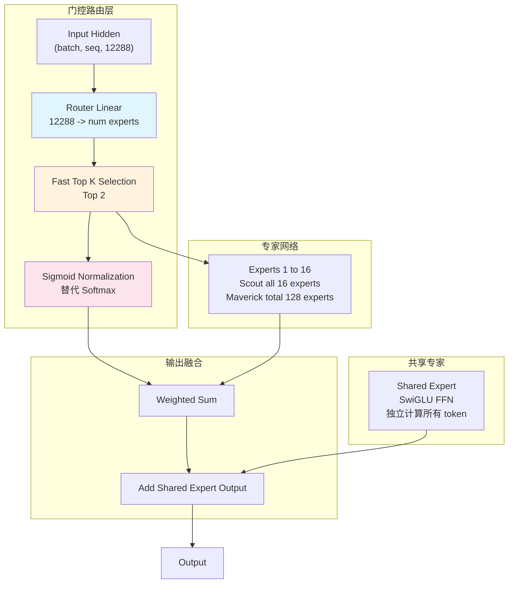

### vLLM 中的自定义路由函数

```python
# 文件: vllm/model_executor/models/llama4.py — Llama4MoE.custom_routing_function
@staticmethod
def custom_routing_function(
    hidden_states: torch.Tensor,
    gating_output: torch.Tensor,
    topk: int,
    renormalize: bool,
) -> tuple[torch.Tensor, torch.Tensor]:
    router_scores, router_indices = fast_topk(gating_output, topk, dim=-1)
    router_scores = torch.sigmoid(router_scores.float())
    return (router_scores, router_indices.to(torch.int32))
```

与标准 Softmax 门控不同，Llama 4 使用 **Sigmoid 门控 + Top-K**:
- `fast_topk()` 选出 Top-2 路由分数最高的专家
- `torch.sigmoid()` 独立归一化每个专家的路由分数
- 这意味着不同专家的权重可以独立地在 [0,1] 范围，而非 Softmax 的强制和为 1

**MoE 计算公式**:

$$\text{MoE}(x) = \sum_{i \in \text{TopK}} \sigma(g_i(x)) \cdot E_i(x) + E_{shared}(x)$$

其中 $\sigma$ 是 sigmoid 函数，$g_i(x)$ 是路由 logits，$E_i(x)$ 是专家 FFN 输出。

### Scout vs Maverick MoE 布局

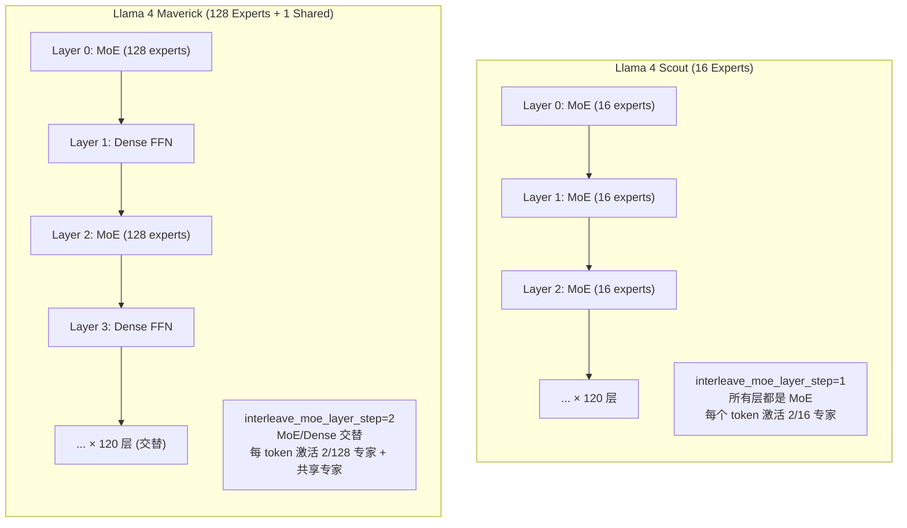

### MoE 并行化策略

vLLM 中的 Llama4MoE 支持两种并行模式：

| 并行模式 | 描述 | 适用场景 |
|---------|------|---------|
| **Tensor Parallelism (TP)** | 专家权重沿 TP 维度切分 | 单机多卡 |
| **Expert Parallelism (EP)** | 不同专家分布到不同 GPU | 大规模部署（尤其 Maverick 128 专家） |
| **Sequence Parallel MoE** | 序列维度并行 + TP All-Gather | 长序列场景 |

## 2.5 其他关键技术组件

### RMSNorm 归一化

Llama 4 全模型使用 RMSNorm（Root Mean Square Normalization），不含可学习参数：

$$\text{RMSNorm}(x) = \frac{x}{\sqrt{\frac{1}{n}\sum_{i=1}^{n} x_i^2 + \epsilon}}$$

### SwiGLU 激活函数

Dense FFN 和 MoE 专家内部均使用 SwiGLU（SiLU-gated Linear Unit）：

$$\text{SwiGLU}(x) = (xW_1 \cdot \text{SiLU}(xW_3))W_2$$

其中 $\text{SiLU}(x) = x \cdot \sigma(x)$。

### QK Normalization（QK 范数）

在 RoPE 层中可选择性地对 Q 和 K 应用额外的 RMSNorm：

```python
# qk_norm 仅应用于 RoPE 层（非 NoPE 层）
# 不含可学习参数（has_weight=False），dtype=torch.float32
if self.use_qk_norm:
    q = q.reshape(-1, self.head_dim)
    q = self.qk_norm(q.float()).reshape(-1, self.q_size).to(q.dtype)
    k = k.reshape(-1, self.head_dim)
    k = self.qk_norm(k.float()).reshape(-1, self.kv_size).to(k.dtype)
```

这一设计有助于稳定长序列训练中的注意力分数分布。

### Co-distillation（共同蒸馏）

Llama 4 Scout 和 Maverick 均由更大的 Llama 4 Behemoth（~2T 总参数，288B 激活）通过 Co-distillation 训练而得。蒸馏策略结合了软标签（Soft Labels）和硬标签（Hard Labels），动态调整损失权重。

---

# 第三部分: 输入预处理流程

## 3.1 文本预处理


### Chat Template

Llama 4 使用 Meta 标准的 Chat Template：

```
<|begin_of_text|><|start_header_id|>user<|end_header_id|>

{user_message}<|eot_id|><|start_header_id|>assistant<|end_header_id|>

{assistant_response}<|eot_id|>
```

## 3.2 多模态输入处理（Early Fusion）

Llama 4 的多模态处理是其最核心的特性，采用 **Early Fusion** 策略：

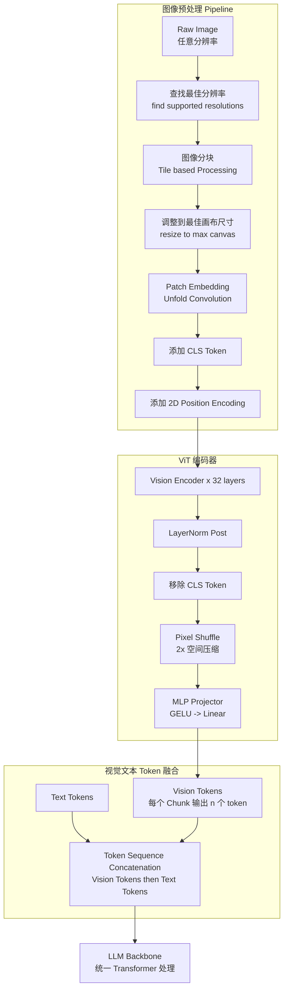

### 图像 Tile 化策略

Llama 4 将输入图像分割为固定大小的 Tile（560×560 像素），根据图像分辨率和宽高比自适应选择最佳分块方案：

| 图像比例 | Tile 布局 | 总 Chunks | 说明 |
|---------|----------|-----------|------|
| 1:1（正方形） | 1×1 | 1 | 小图像单 Tile |
| 4:3（横向） | 2×2 | 4 | 中等图像 4 Tiles |
| 16:9（宽屏） | 4×4 | 16 | 大图像 16 Tiles |
| 1:4（纵向） | 4×1 | 4+1=5 | 包含 1 个全局概览 Chunk |

> **关键洞察**: 当图像使用多个 Tile 时（>1 个），会额外添加一个表示整张图像的概览 Chunk（全局视图），使得视觉 token 总数 = `num_tiles × (raw_patches + 1) × patches_per_chunk`。

### 图像 Token 替换策略

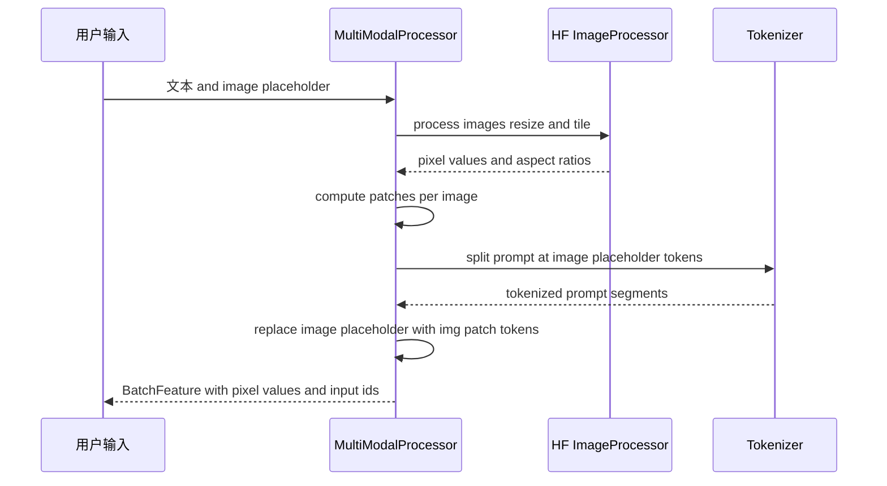

vLLM 使用 `PromptReplacement` 机制，将 `<|image|>` 占位符替换为对应数量的 `<|img_patch|>` token：

```python
# 文件: vllm/model_executor/models/mllama4.py
def get_replacement(item_idx: int):
    out_item = out_mm_kwargs["image"][item_idx]
    aspect_ratio = out_item["aspect_ratios"].data
    repl = hf_processor._prompt_split_image(
        aspect_ratio=aspect_ratio,
        num_patches_per_chunk=num_patches_per_chunk,
    )
    return PromptUpdateDetails.select_text(repl, img_patch_token)
```

## 3.3 Tokenizer 配置

| 配置项 | 值 | 说明 |
|--------|-----|------|
| Tokenizer Type | Tiktoken (BPE) | Meta 自研 BPE Tokenizer |
| Vocab Size | 202,048 | 大词表，支持多语言 |
| BOS Token | `<|begin_of_text|>` | 序列开始标记 |
| EOS Token | `<|eot_id|>` | 序列结束标记 |
| Chat Template | Llama 4 Chat Template | 多轮对话格式化模板 |
| Image Token | `<|image|>` | 图像占位符 |
| Image Patch Token | `<|img_patch|>` | 图像 Patch Token（实际视觉特征替换位置） |
| Fake Image Token | `<|image|>` | Dummy 输入中的占位 Token |

---

# 第四部分: 模型前向传播流程

## 4.1 整体 Forward 流程

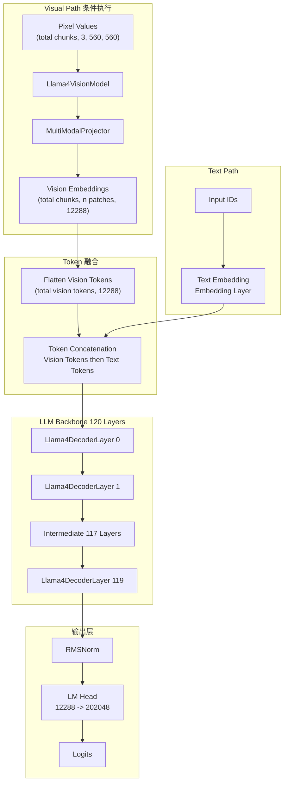

## 4.2 单层 Transformer 计算流程

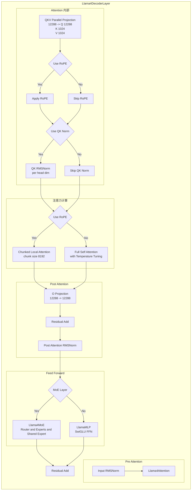

### Step 1: Input RMSNorm + Self-Attention

```python
# 文件: vllm/model_executor/models/llama4.py — Llama4DecoderLayer.forward
def forward(self, positions, hidden_states, residual=None):
    if residual is None:
        residual = hidden_states
        hidden_states = self.input_layernorm(hidden_states)
    else:
        hidden_states, residual = self.input_layernorm(hidden_states, residual)

    hidden_states = self.self_attn(positions=positions, hidden_states=hidden_states)
```

输入形状: `[total_seq_len, 12288]`

QKV 投影:
- Q: `[total_seq_len, 12288]` → `[total_seq_len, 96 × 128 = 12288]`
- K: `[total_seq_len, 12288]` → `[total_seq_len, 8 × 128 = 1024]`
- V: `[total_seq_len, 12288]` → `[total_seq_len, 8 × 128 = 1024]`

### Step 2: Attention 计算

```python
# 文件: vllm/model_executor/models/llama4.py — Llama4Attention.forward
def forward(self, positions, hidden_states):
    qkv, _ = self.qkv_proj(hidden_states)
    q, k, v = qkv.split([self.q_size, self.kv_size, self.kv_size], dim=-1)

    if self.rotary_emb is not None:
        q, k = self.rotary_emb(positions, q, k)  # RoPE 编码

    if self.qk_norm is not None:
        q = self.qk_norm(q.float()).to(q.dtype)  # QK RMSNorm
        k = self.qk_norm(k.float()).to(k.dtype)

    if self.attn_temperature_tuning and self.nope:
        attn_scale = self._get_attn_scale(positions)  # 温度调节
        q = (q * attn_scale).to(q.dtype)

    attn_output = self.attn(q, k, v)  # ChunkedLocalAttention 或 Full Attention
    output, _ = self.o_proj(attn_output)
    return output
```

### Step 3: Post-Attention Norm + FFN/MoE

```python
# 后注意力残差连接 + RMSNorm
hidden_states, residual = self.post_attention_layernorm(hidden_states, residual)

# 前馈网络（MoE 或 Dense）
hidden_states = self.feed_forward(hidden_states)
return hidden_states, residual
```

### MoE Forward（当层为 MoE 层时）

```python
# 文件: vllm/model_executor/models/llama4.py — Llama4MoE.forward
def forward(self, hidden_states):
    num_tokens = hidden_states.shape[0]

    if self.is_sequence_parallel:
        hidden_states = sequence_parallel_chunk(hidden_states)

    router_logits, _ = self.router(hidden_states)  # [num_tokens, num_experts]

    experts_out = self.experts(
        hidden_states=hidden_states,
        router_logits=router_logits,
    )  # FusedMoE: routing + expert compute + combine

    if self.is_sequence_parallel:
        experts_out = tensor_model_parallel_all_gather(experts_out, 0)
        experts_out = experts_out[:num_tokens]

    return experts_out
```

## 4.3 vLLM 中的优化

### PagedAttention

Llama 4 在 vLLM 中使用标准的 PagedAttention 进行 KV Cache 管理，将 KV Cache 分割为固定大小的 Block，按需分配、动态管理。

### Chunked Local Attention 优化

对于 RoPE 层的 ChunkedLocalAttention，vLLM 通过 `attention_chunk_size=8192` 配置分块大小，每个 Chunk 内部做全注意力，Chunk 之间不交互，显存占用从 O(n²) 降到 O(n × chunk_size)。

### FusedMoE

Llama4MoE 使用 vLLM 的 `FusedMoE` 层实现高效的专家路由和计算：
- 自定义 Top-K Sigmoid 路由
- 专家 FFN 融合（Gate + Up 权重合并为 `gate_up_proj`）
- 支持量化（FP8/INT4）

### Tensor Parallelism + Expert Parallelism

- TP 沿 Attention Heads 维度切分 QKV 权重
- EP 将不同专家分配到不同 GPU，减少跨设备通信
- Sequence Parallel 对 MoE 层使用序列维度切分

---

# 第五部分: ViT 计算流程（核心重点）

Llama 4 的 ViT 是其多模态能力的核心引擎。以下是完整的 ViT 计算流程分析。

## 5.1 ViT 架构概览

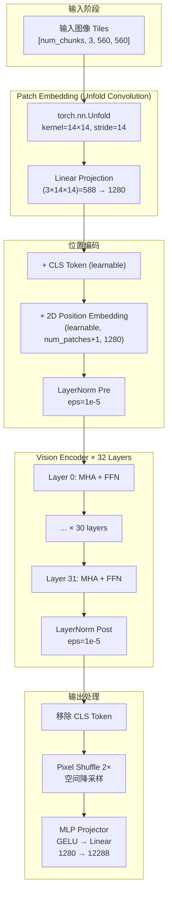

## 5.2 Patch Embedding 详解（Unfold Convolution）

Llama 4 使用 `torch.nn.Unfold` 实现 Patch 嵌入，而非传统的 Conv2D：

```python
# 文件: vllm/model_executor/models/mllama4.py — Llama4UnfoldConvolution
class Llama4UnfoldConvolution(nn.Module):
    def __init__(self, config: Llama4VisionConfig, ...):
        kernel_size = config.patch_size  # 14
        self.unfold = torch.nn.Unfold(
            kernel_size=(14, 14),
            stride=config.patch_size    # 14 (无重叠)
        )
        self.linear = ColumnParallelLinear(
            input_size=3 * 14 * 14,     # = 588
            output_size=config.hidden_size,  # = 1280
            bias=False,
        )

    def forward(self, hidden_states: torch.Tensor) -> torch.Tensor:
        # [N, 3, 560, 560] → Unfold → [N, 588, 1600]
        hidden_states = self.unfold(hidden_states)
        # Permute → [N, 1600, 588]
        hidden_states = hidden_states.permute(0, 2, 1)
        # Linear → [N, 1600, 1280]
        hidden_states, _ = self.linear(hidden_states)
        return hidden_states
```

**计算过程示例**:

| 步骤 | 输入形状 | 输出形状 | 说明 |
|------|---------|---------|------|
| 输入 Tile | `[N, 3, 560, 560]` | — | RGB 图像，560×560 像素 |
| Unfold | `[N, 3, 560, 560]` | `[N, 588, 1600]` | 14×14 窗口，步长 14 → 40×40=1600 patches |
| Permute | `[N, 588, 1600]` | `[N, 1600, 588]` | 转为序列格式 |
| Linear | `[N, 1600, 588]` | `[N, 1600, 1280]` | 投影到 ViT 隐藏维度 |

**Patch 数计算**:

$$\text{num\_patches} = \left(\frac{560}{14}\right)^2 = 40^2 = 1600$$

加上 CLS Token 后：`[N, 1601, 1280]`

## 5.3 ViT Encoder 计算流程

### 5.3.1 位置编码与预处理

```python
# 文件: vllm/model_executor/models/mllama4.py — Llama4VisionModel.forward
# Patch embedding
hidden_state = self.patch_embedding(images_flattened)

# 添加 CLS Token（可学习参数）
class_embedding = self.class_embedding.expand(hidden_state.shape[0], 1, -1)
hidden_state = torch.cat([hidden_state, class_embedding], dim=1)
# → [num_tiles, 1601, 1280]

# 添加 2D 位置编码（可学习参数）
hidden_state = hidden_state.reshape(num_tiles, 1, 1601, 1280)
positional_embedding = self.positional_embedding_vlm.to(dtype=hidden_state.dtype, ...)
hidden_state = hidden_state + positional_embedding
# Pre-norm
hidden_state = self.layernorm_pre(hidden_state)
hidden_state = hidden_state.view(num_tiles, -1, 1280)
```

### 5.3.2 单层 ViT Encoder 计算

```python
# 文件: vllm/model_executor/models/mllama4.py — Llama4VisionEncoderLayer
class Llama4VisionEncoderLayer(nn.Module):
    def forward(self, hidden_state):
        # --- Self-Attention with RoPE ---
        residual = hidden_state
        hidden_state = self.input_layernorm(hidden_state)   # LayerNorm
        hidden_state = self.self_attn(hidden_state)          # ViT Attention + RoPE
        hidden_state = residual + hidden_state               # Residual

        # --- FFN with GELU ---
        residual = hidden_state
        hidden_state = self.post_attention_layernorm(hidden_state)  # LayerNorm
        hidden_state = self.mlp(hidden_state)                       # GELU FFN
        hidden_state = residual + hidden_state                      # Residual

        return (hidden_state,)
```

### 5.3.3 ViT Attention 机制

ViT 的注意力使用 **RoPE + Mllama4 风格的 Rotary Encoding**：

```python
# 文件: vllm/model_executor/models/mllama4.py — Llama4VisionAttention
class Llama4VisionAttention(nn.Module):
    def __init__(self, config, ...):
        # ViT 中的注意力是全头注意力（MHA，非 GQA）
        self.embed_dim = config.hidden_size  # 1280
        self.num_heads = config.num_attention_heads  # 16
        self.head_dim = 1280 // 16  # = 80

    def forward(self, hidden_states):
        qkv, _ = self.qkv_proj(hidden_states)
        q, k, v = qkv.split([q_size, kv_size, kv_size], dim=-1)

        # 应用 RoPE（仅对 head_dim 的前半部分，partial_rotary_factor=0.5）
        q, k = self.rotary_emb(q, k)

        attn_output = self.attn(q, k, v)
        attn_output, _ = self.o_proj(attn_output)
        return attn_output
```

**ViT RoPE 参数**:
- `rope_type`: `"mllama4"`（自定义 RoPE 实现）
- `rope_theta`: `10,000`
- `partial_rotary_factor`: `0.5`（仅 50% 维度应用 RoPE）
- `dtype`: `torch.complex64`（复数域计算，提高精度）

## 5.4 视觉-语言融合策略：Pixel Shuffle + MLP Projector

这是 Llama 4 ViT 最独特的设计——使用 **Pixel Shuffle** 进行空间降采样后再通过 MLP 投射到 LLM 空间。

### Pixel Shuffle 工作原理

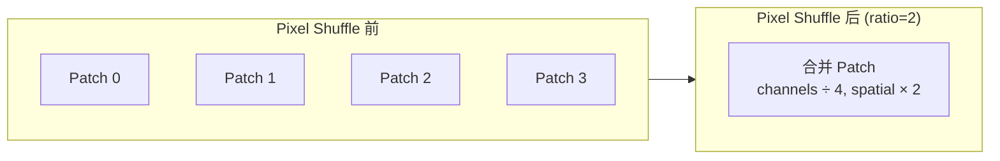

```python
# 文件: vllm/model_executor/models/mllama4.py
def pixel_shuffle(input_tensor, shuffle_ratio):
    # input_tensor: [batch_size, num_patches, channels]
    # num_patches = 40×40 = 1600
    # channels = 1280

    batch_size, num_patches, channels = input_tensor.shape
    patch_size = int(math.sqrt(num_patches))  # 40

    # 重塑为 2D 空间
    input_tensor = input_tensor.view(batch_size, 40, 40, 1280)

    # Pixel Shuffle: width × shuffle_ratio, channels / shuffle_ratio
    # → [batch, 40, 40×2, 1280/2]
    reshaped = input_tensor.view(batch_size, 40, 40*2, 1280/2)
    reshaped = reshaped.permute(0, 2, 1, 3)
    # → [batch, 40×2, 40×2, 1280/(2×2)]
    # → [batch, 80, 80, 1280/4]
    # → [batch, 6400, 320]
```

**Pixel Shuffle 形状变化表**（以 `pixel_shuffle_ratio=2` 为例）:

| 步骤 | 形状 | 说明 |
|------|------|------|
| 输入 | `[batch, 1600, 1280]` | ViT Encoder 输出（移除 CLS 后） |
| 重塑 | `[batch, 40, 40, 1280]` | 恢复为 2D 空间布局 |
| Pixel Shuffle | `[batch, 80, 80, 320]` | 空间上采样 ×2，通道压缩 ÷4 |
| 展平 | `[batch, 6400, 320]` | 每 Tile 6400 个视觉 Token |

> **关键洞察**: Pixel Shuffle 将 ViT 输出的 1600 patches（40×40 网格）重排为 6400 patches（80×80 网格），同时将每个 patch 的维度从 1280 压缩到 320（÷4）。这是一种无损的空间上采样+通道压缩操作，类似于图像超分辨率中的 sub-pixel convolution。

### MLP Projector

```python
# 文件: vllm/model_executor/models/mllama4.py — Llama4VisionPixelShuffleMLP
class Llama4VisionPixelShuffleMLP(nn.Module):
    def __init__(self, config, ...):
        self.pixel_shuffle_ratio = config.pixel_shuffle_ratio  # 2
        self.inner_dim = config.projector_input_dim // (2**2)  # 5120/4 = 1280
        self.output_dim = config.projector_output_dim  # 12288

        self.mlp = Llama4VisionMLP(
            input_size=config.intermediate_size,      # 5120
            intermediate_size=config.projector_input_dim,  # 5120
            output_size=config.projector_output_dim,  # 12288
            bias=config.multi_modal_projector_bias,
            output_activation=True,  # 最终输出经过 GELU
        )

    def forward(self, encoded_patches):
        # Step 1: Pixel Shuffle
        encoded_patches = pixel_shuffle(encoded_patches, self.pixel_shuffle_ratio)
        # [batch, 6400, 320]
        # Step 2: MLP (5120 → 5120 → 12288)
        return self.mlp(encoded_patches)
        # [batch, 6400, 12288]
```

### Multi-Modal Projector（最终对齐）

Pixel Shuffle MLP 之后，还有一个简单的 Linear 层将视觉特征最终对齐到 LLM 的隐藏空间：

```python
# 文件: vllm/model_executor/models/mllama4.py — Llama4MultiModalProjector
class Llama4MultiModalProjector(nn.Module):
    def __init__(self, config, ...):
        self.linear_1 = ColumnParallelLinear(
            input_size=config.vision_config.vision_output_dim,  # 12288
            output_size=config.text_config.hidden_size,         # 12288
            bias=False,
        )

    def forward(self, image_features):
        hidden_states, _ = self.linear_1(image_features)
        return hidden_states
```

### 完整 ViT 数据流形状追踪

| 步骤 | 组件 | 输入形状 | 输出形状 | 每 Tile Token 数 |
|------|------|---------|---------|-----------------|
| 1 | Unfold Convolution | `[N, 3, 560, 560]` | `[N, 1600, 1280]` | 1,600 |
| 2 | + CLS Token | `[N, 1600, 1280]` | `[N, 1601, 1280]` | 1,601 |
| 3 | + Position Encoding | `[N, 1601, 1280]` | `[N, 1601, 1280]` | 1,601 |
| 4 | LayerNorm Pre | `[N, 1601, 1280]` | `[N, 1601, 1280]` | 1,601 |
| 5 | Vision Encoder ×32 | `[N, 1601, 1280]` | `[N, 1601, 1280]` | 1,601 |
| 6 | LayerNorm Post | `[N, 1601, 1280]` | `[N, 1601, 1280]` | 1,601 |
| 7 | 移除 CLS | `[N, 1601, 1280]` | `[N, 1600, 1280]` | 1,600 |
| 8 | Pixel Shuffle 2× | `[N, 1600, 1280]` | `[N, 6400, 320]` | 6,400 |
| 9 | Vision MLP | `[N, 6400, 320]` | `[N, 6400, 12288]` | 6,400 |
| 10 | MultiModalProjector | `[N, 6400, 12288]` | `[N, 6400, 12288]` | 6,400 |

> **关键洞察**: 每个 560×560 Tile 经过 ViT 处理后，最终产生 **6,400 个视觉 Token**（每个维度为 12,288，与 LLM hidden_size 一致）。对于一张 4-Tile 的图像（2×2 布局），总视觉 Token 为 `4 × 6400 = 25,600`，加上概览 Chunk 则更多。这是 Llama 4 的 Early Fusion 设计的一个重要特点——视觉 Token 在序列开头占据了显著的位置。

## 5.5 多模态推理中的特殊优化

### Data Parallel ViT

vLLM 支持对 ViT 编码器使用 Data Parallel（而非 Tensor Parallel）：

```python
# 文件: vllm/model_executor/models/mllama4.py
class Llama4ForConditionalGeneration(nn.Module, SupportsMultiModal, ...):
    supports_encoder_tp_data = True  # 支持 ViT 使用 Data Parallel

    def __init__(self, *, vllm_config, ...):
        self.use_data_parallel = multimodal_config.mm_encoder_tp_mode == "data"
```

当启用 Data Parallel 时，ViT 在每个 GPU 上完整复制（而非切分重量），适合 ViT 较轻量（~600M 参数）而图像 batch 较大的场景。

### torch.compile 支持

ViT 编码器支持 `torch.compile` 加速：

```python
@support_torch_compile(
    dynamic_arg_dims={"images_flattened": 0},
    enable_if=should_torch_compile_mm_encoder,
    is_encoder=True,
)
class Llama4VisionModel(nn.Module):
    ...
```

---

# 第六部分: vLLM 中的代码实现

## 6.1 模型注册与配置

Llama 4 在 vLLM 中有两个注册入口：

| 注册名 | 类 | 用途 |
|--------|-----|------|
| `Llama4ForConditionalGeneration` | `Llama4ForConditionalGeneration` | 多模态模型（文本+图像） |
| `Llama4ForCausalLM` | `Llama4ForCausalLM` | 纯文本模型 |

```python
# 文件: vllm/model_executor/models/mllama4.py
@MULTIMODAL_REGISTRY.register_processor(
    Mllama4MultiModalProcessor,
    info=Mllama4ProcessingInfo,
    dummy_inputs=Mllama4DummyInputsBuilder,
)
class Llama4ForConditionalGeneration(
    nn.Module,
    SupportsMultiModal,
    SupportsPP,
    MixtureOfExperts,
    SupportsEagle3,
    SupportsLoRA,
):
    ...
```

## 6.2 核心模型类层次结构

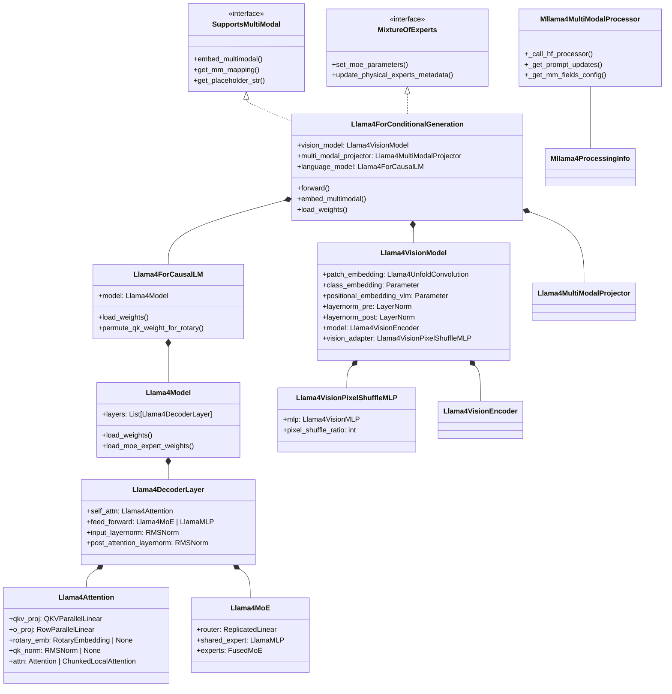

## 6.3 关键计算流程代码分析

### 多模态 Embedding 流程

```python
# 文件: vllm/model_executor/models/mllama4.py — Llama4ForConditionalGeneration

def embed_multimodal(self, **kwargs) -> MultiModalEmbeddings:
    # Step 1: 解析并验证图像输入
    image_input = self._parse_and_validate_image_input(**kwargs)
    if image_input is None:
        return []

    # Step 2: 处理图像输入（ViT 编码 + 投影）
    return self._process_image_input(image_input)

def _process_image_input(self, image_input):
    pixel_values = image_input["pixel_values"]
    patches_per_image = image_input["patches_per_image"].tolist()

    # ViT 前向传播（支持 Data Parallel 分片）
    if self.use_data_parallel:
        vision_embeddings_flat = run_dp_sharded_vision_model(
            pixel_values, self.vision_model
        )
    else:
        vision_embeddings_flat = self.vision_model(pixel_values)

    # 多模态投影
    vision_embeddings_flat = self.multi_modal_projector(vision_embeddings_flat)

    # 按图像拆分（每张图像可能对应不同数量的 chunks）
    return [
        img.flatten(0, 1)
        for img in vision_embeddings_flat.split(patches_per_image, dim=0)
    ]
```

### 整体 Forward 流程

```python
def forward(self, input_ids, positions, intermediate_tensors=None, inputs_embeds=None, **kwargs):
    # 多模态场景：input_ids 包含 <|img_patch|> 占位符
    # input_ids 在经过 embed_multimodal 后，视觉占位符被替换为实际视觉特征
    # vLLM 的 multimodal pipeline 自动处理这一替换过程

    if intermediate_tensors is not None:
        inputs_embeds = None

    # 委托给 language_model（Llama4ForCausalLM）进行 Transformer 前向传播
    return self.language_model(input_ids, positions, intermediate_tensors, inputs_embeds)
```

### 权重加载（Q/K Permute for RoPE）

```python
# 文件: vllm/model_executor/models/llama4.py — Llama4ForCausalLM.permute_qk_weight_for_rotary
def permute_qk_weight_for_rotary(self, name, loaded_weight):
    modules = name.split(".")
    is_weight = modules[-1] in ("weight", "weight_packed")
    is_k_proj = "wk" in modules or "k_proj" in modules
    is_q_proj = "wq" in modules or "q_proj" in modules

    if (is_weight or is_weight_scale) and (is_k_proj or is_q_proj):
        f_out, f_in = loaded_weight.shape
        n_heads = (
            self.config.num_key_value_heads  # K: 8 heads
            if is_k_proj
            else self.config.num_attention_heads  # Q: 96 heads
        )
        # 重排权重以适配 RoPE 的 interleaved 格式
        loaded_weight = (
            loaded_weight
            .view(n_heads, f_out // n_heads // 2, 2, f_in)
            .transpose(1, 2)
            .reshape(f_out, f_in)
        )
    return name, loaded_weight
```

这一权重排列确保 Q/K 的旋转维度对 (cos, sin) 在正确的维度上应用。

## 6.4 vLLM 特有优化

### 支持的量化方案

| 量化类型 | 支持状态 | 说明 |
|---------|---------|------|
| FP8 | 支持 | Maverick 官方发布 FP8 权重；vLLM 有完整的 FP8 weight_scale 处理 |
| INT4 (On-the-fly) | 支持 | Scout 支持运行时 INT4 量化，单 H100 即可部署 |
| BF16 | 支持 | 标准推理精度 |
| NVFP4 | 部分支持 | 需要特定 GPU 架构支持 |

### EAGLE3 投机解码支持

Llama 4 集成了 EAGLE3 投机解码（Speculative Decoding），利用辅助模型加速生成：

```python
class Llama4ForConditionalGeneration(..., SupportsEagle3, ...):
    def set_aux_hidden_state_layers(self, layers):
        self.language_model.set_aux_hidden_state_layers(layers)

    def get_eagle3_default_aux_hidden_state_layers(self):
        return self.language_model.get_eagle3_default_aux_hidden_state_layers()
```

### Expert Parallelism + EPLB

支持 Expert-Parallel Load Balancing（EPLB），在 Expert Parallel 模式下动态平衡各 GPU 上的专家负载：

```python
def set_eplb_state(self, expert_load_view, logical_to_physical_map, logical_replica_count):
    self.language_model.set_eplb_state(
        expert_load_view, logical_to_physical_map, logical_replica_count
    )
```

### ModelOpt FP8 Checkpoint 兼容

支持从 NVIDIA ModelOpt 导出的 FP8 Checkpoint 加载权重，通过 `_rename_weight_for_modelopt_checkpoint()` 方法进行权重名映射。

---

# 附录

## A. 关键代码位置索引

| 组件 | 文件路径 | 关键类/函数 |
|------|---------|------------|
| 纯文本模型 | `vllm/model_executor/models/llama4.py` | `Llama4ForCausalLM`, `Llama4Model`, `Llama4DecoderLayer` |
| 多模态模型 | `vllm/model_executor/models/mllama4.py` | `Llama4ForConditionalGeneration` |
| Attention | `vllm/model_executor/models/llama4.py` | `Llama4Attention` |
| MoE 层 | `vllm/model_executor/models/llama4.py` | `Llama4MoE` |
| ViT 视觉模型 | `vllm/model_executor/models/mllama4.py` | `Llama4VisionModel`, `Llama4VisionEncoder`, `Llama4VisionEncoderLayer` |
| ViT Attention | `vllm/model_executor/models/mllama4.py` | `Llama4VisionAttention` |
| Patch Embedding | `vllm/model_executor/models/mllama4.py` | `Llama4UnfoldConvolution` |
| Pixel Shuffle | `vllm/model_executor/models/mllama4.py` | `pixel_shuffle()`, `Llama4VisionPixelShuffleMLP` |
| 多模态投影 | `vllm/model_executor/models/mllama4.py` | `Llama4MultiModalProjector`, `Llama4VisionMLP` |
| 多模态处理器 | `vllm/model_executor/models/mllama4.py` | `Mllama4MultiModalProcessor`, `Mllama4ProcessingInfo` |
| 图像输入 Schema | `vllm/model_executor/models/mllama4.py` | `Llama4ImagePatchInputs` |
| 基础 Llama 模型 | `vllm/model_executor/models/llama.py` | `LlamaForCausalLM`, `LlamaModel`, `LlamaMLP` |
| MoE 工具函数 | `vllm/model_executor/layers/fused_moe.py` | `FusedMoE`, `fused_moe_make_expert_params_mapping` |
| 注意力层 | `vllm/model_executor/layers/attention.py` | `Attention`, `ChunkedLocalAttention`, `MMEncoderAttention` |
| vLLM 配置 | `vllm/config.py` | `VllmConfig`, `ModelConfig` |
| 视觉工具 | `vllm/model_executor/models/vision.py` | `is_vit_use_data_parallel`, `run_dp_sharded_vision_model` |
| 权重加载 | `vllm/model_executor/models/utils.py` | `AutoWeightsLoader`, `fast_topk` |
| Hf Image Processor | `transformers.models.llama4.image_processing_llama4_fast` | `find_supported_resolutions`, `get_best_fit` |
| 模型注册 | `vllm/multimodal/__init__.py` | `MULTIMODAL_REGISTRY` |
| 多模态接口 | `vllm/model_executor/models/interfaces.py` | `SupportsMultiModal`, `MixtureOfExperts`, `MultiModalEmbeddings` |

## B. 术语表

| 术语 | 英文全称 | 说明 |
|------|---------|------|
| 多头注意力 | Multi-Head Attention (MHA) | 标准的全头自注意力机制 |
| 分组查询注意力 | Grouped-Query Attention (GQA) | Q 头分组共享 KV 头的注意力变体 |
| 混合专家 | Mixture of Experts (MoE) | 稀疏激活的多专家前馈网络 |
| 交错式 RoPE | Interleaved RoPE (iRoPE) | RoPE 层与 NoPE 层交替的编码策略 |
| 无位置编码注意力 | No Positional Encoding (NoPE) | 不使用位置编码的全注意力层 |
| 旋转位置编码 | Rotary Position Embedding (RoPE) | 基于旋转矩阵的相对位置编码 |
| 分块局部注意力 | Chunked Local Attention | 仅在固定大小块内计算的注意力 |
| 视觉 Transformer | Vision Transformer (ViT) | 基于 Transformer 的图像编码器 |
| 像素重排 | Pixel Shuffle | 空间上采样+通道压缩的像素重排操作 |
| 早期融合 | Early Fusion | 视觉 Token 在 Transformer 入口即与文本 Token 拼接 |
| 共同蒸馏 | Co-distillation | 使用大教师模型同时训练多个学生模型 |
| 专家并行 | Expert Parallelism (EP) | 将 MoE 的不同专家分布到不同 GPU |
| 张量并行 | Tensor Parallelism (TP) | 将权重矩阵沿特定维度切分到多 GPU |
| 序列并行 | Sequence Parallelism (SP) | 将序列维度切分到多 GPU |
| 专家并行负载均衡 | Expert-Parallel Load Balancing (EPLB) | 动态调整专家-GPU 映射以实现负载均衡 |

## C. 参考资料

- [Meta 官方博客: The Llama 4 Herd](https://ai.meta.com/blog/llama-4-multimodal-intelligence/)
- [Meta 官方 GitHub: llama-models/models/llama4](https://github.com/meta-llama/llama-models/tree/main/models/llama4)
- [Meta 官方 Model Card](https://github.com/meta-llama/llama-models/blob/main/models/llama4/MODEL_CARD.md)
- [HuggingFace: Welcome Llama 4 Maverick & Scout](https://huggingface.co/blog/llama4-release)
- [vLLM Llama 4 支持 Issue #16106](https://github.com/vllm-project/vllm/issues/16106)
- [vLLM Llama 4 正式合入 PR #20591](https://github.com/vllm-project/vllm/pull/20591)
- [huggingface: meta-llama/Llama-4-Scout-17B-16E-Instruct](https://huggingface.co/meta-llama/Llama-4-Scout-17B-16E-Instruct)
- [huggingface: meta-llama/Llama-4-Maverick-17B-128E-Instruct](https://huggingface.co/meta-llama/Llama-4-Maverick-17B-128E-Instruct)
- [Attention Temperature Tuning 论文 (arxiv: 2501.19399)](https://arxiv.org/abs/2501.19399)
- [NVIDIA Accelerates Inference on Llama 4](https://developer.nvidia.com/blog/nvidia-accelerates-inference-on-meta-llama-4-scout-and-maverick/)
- [LLM Architecture Gallery](https://sebastianraschka.com/llm-architecture-gallery/)
- [vLLM 多模态处理文档](https://docs.vllm.ai/en/latest/design/mm_processing.html)
- [torchtune Llama 4 Vision Encoder 文档](https://meta-pytorch.org/torchtune/main/generated/torchtune.models.llama4.llama4_vision_encoder.html)
