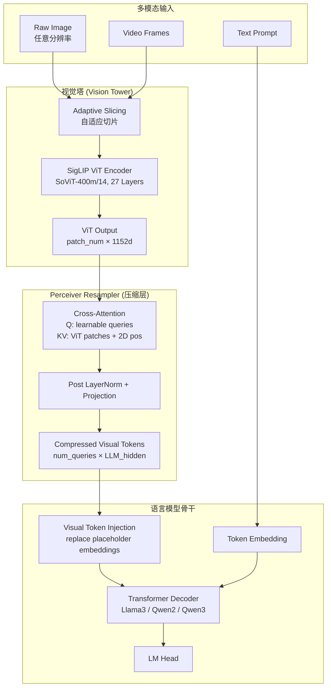
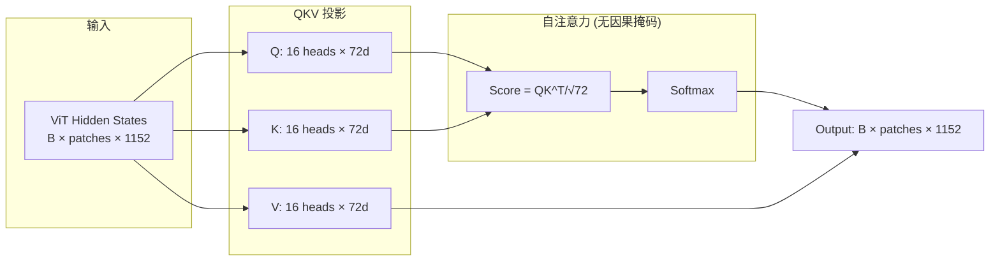
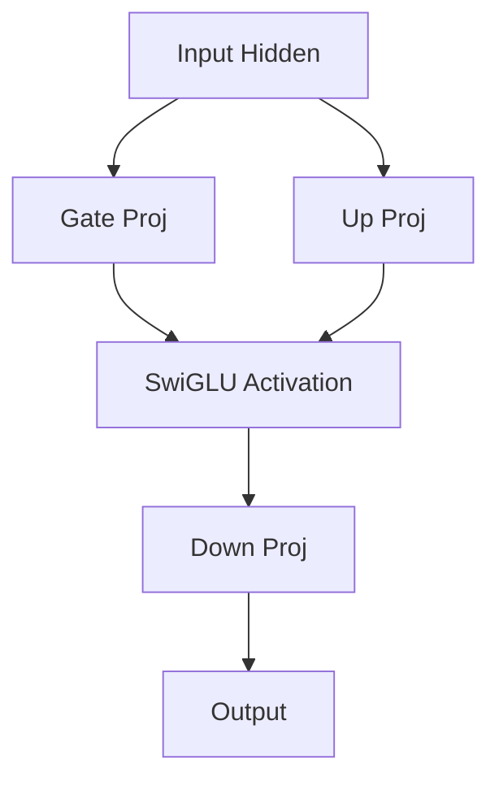
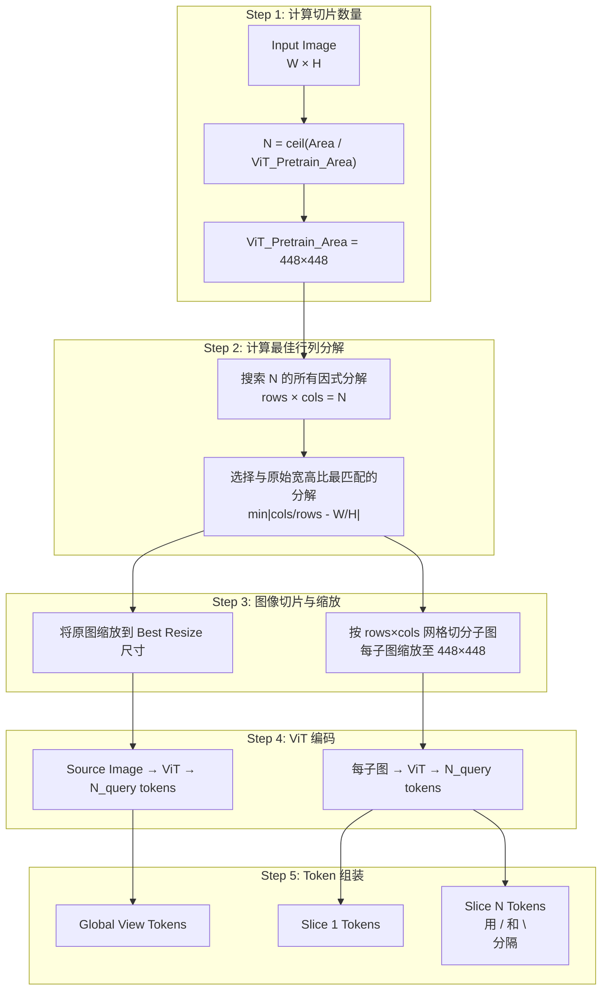
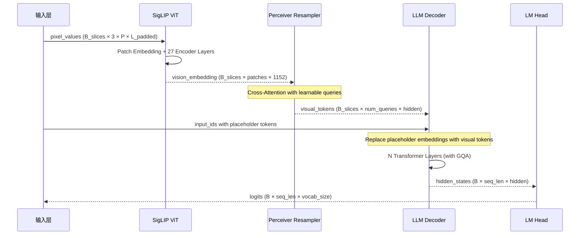
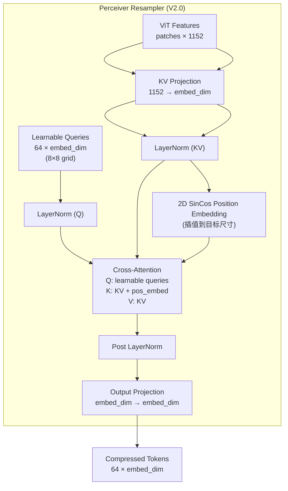
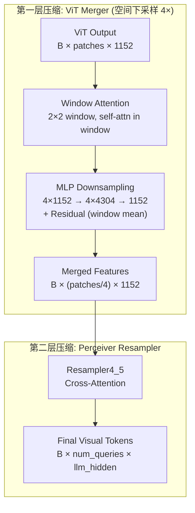
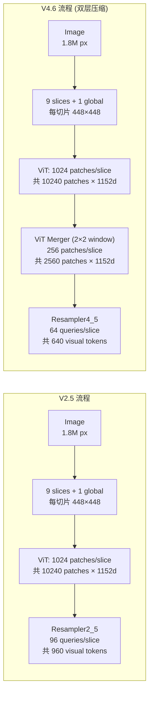
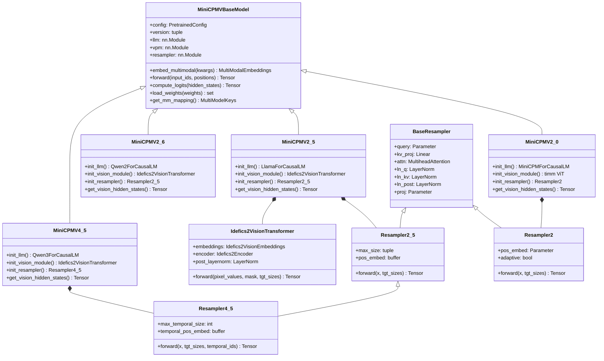

# vLLM MiniCPM-V 模型技术教程

> **文档版本**: 1.0
> **分析代码版本**: vLLM main 分支（截至 2025-12）
> **最后更新**: 2025-12-08
> **模型系列**: MiniCPM-V (OpenBMB / ModelBest)
> **模型类型**: VLM (Vision-Language Model)

---

## 文档概述

本文档深入剖析 MiniCPM-V 系列多模态大模型在 vLLM 中的完整技术实现，重点关注其 **Vision Transformer (ViT) 编码器**、**Perceiver Resampler 视觉压缩机制** 以及 **多模态输入处理流程**。

**目标读者**:
- 希望在 vLLM 中部署 MiniCPM-V 的工程师
- 想深入理解 VLM 视觉编码与压缩机制的研究者
- 需要在 MiniCPM-V 基础上进行二次开发的开发者

**阅读建议**: 第一、二部分适合快速了解模型全貌；第五部分（ViT 计算流程）是本文核心，建议结合代码仔细阅读。

---

# 第一部分: MiniCPM-V 模型系列概述与演进

## 1.1 模型系列发展历史

MiniCPM-V 由 **OpenBMB**（清华大学 NLP 组）与 **ModelBest Inc.** 联合开发，定位为 **端侧高效多模态大模型**。其核心设计哲学是：通过 **激进的视觉 Token 压缩** 实现移动端推理，同时保持接近 GPT-4V 级别的多模态理解能力。

```
2024.02  MiniCPM-V 1.0    → 首个版本，固定分辨率 224×224
2024.04  MiniCPM-V 2.0    → 引入自适应分辨率编码（最高 1.8M 像素）
2024.05  MiniCPM-V 2.5    → 升级 LLM 到 Llama3-8B，RLAIF-V 对齐
2024.08  MiniCPM-V 2.6    → 升级 LLM 到 Qwen2-7B，增加多图/视频支持
2025.03  MiniCPM-V 4.0    → 回归 Llama3-8B 架构
2025.06  MiniCPM-V 4.5    → 升级到 Qwen3-8B，引入 3D-Resampler
2025.09  MiniCPM-V 4.6    → 引入 ViT Window Attention Merger，双层 token 压缩
```

## 1.2 同系列模型对比

| 模型名称 | 总参数量 | 发布日期 | ViT 编码器 | LLM 骨干 | Query Token 数 | 图像分辨率 | 视频支持 | 技术报告 |
|---------|---------|---------|-----------|---------|---------------|-----------|---------|---------|
| MiniCPM-V 1.0 | ~3B | 2024.02 | SigLIP-400M | MiniCPM-2.4B | 64/slice | 224×224 固定 | ❌ | — |
| MiniCPM-V 2.0 | ~2.8B | 2024.04 | SigLIP-400M | MiniCPM-2.4B | 64/slice | 自适应 ≤1.8M px | ❌ | [Paper](https://arxiv.org/abs/2408.01800) |
| MiniCPM-V 2.5 | ~8B | 2024.05 | SigLIP-400M | **Llama3-8B** | 96/slice | 自适应 ≤1.8M px | ❌ | [Paper](https://arxiv.org/abs/2408.01800) |
| MiniCPM-V 2.6 | ~8.1B | 2024.08 | SigLIP-400M | **Qwen2-7B** | ~640 total | 自适应 ≤1.8M px | ✅ | [Paper](https://arxiv.org/abs/2408.01800) |
| MiniCPM-V 4.0 | ~8B | 2025.03 | SigLIP-400M | Llama3-8B | ~640 total | 自适应 ≤1.8M px | ✅ | — |
| MiniCPM-V 4.5 | ~8B | 2025.06 | SigLIP-400M | **Qwen3-8B** | 128-640 | 自适应 ≤1.8M px | ✅ (3D-Resampler) | [Paper](https://arxiv.org/abs/2509.18154) |
| MiniCPM-V 4.6 | ~8.5B | 2025.09 | SigLIP-400M + ViT Merger | Qwen3.5-8B (Mamba2 Hybrid) | 64-256 | 自适应 ≤1.8M px | ✅ | — |

> **关键洞察**: 所有版本的 ViT 编码器始终使用 **SigLIP SoViT-400m/14**，变化的是 LLM 骨干和 Resampler 压缩策略。

## 1.3 核心设计哲学对比

| 设计维度 | MiniCPM-V | Qwen2.5-VL | InternVL3 | LLaVA-1.6 |
|---------|-----------|------------|-----------|-----------|
| **ViT 编码器** | SigLIP-400M (1152d) | DFN ViT-bigG (1664d) | InternViT-6B (3200d) | CLIP ViT-L (1024d) |
| **压缩策略** | Perceiver Resampler (Cross-Attn) | MLP Projector + Pixel Shuffle | Pixel Unshuffle | MLP Projector |
| **Token 数 (1.8M px)** | ~640 | ~2500-3500 | ~1000-2000 | ~2880 |
| **压缩率** | 极高 | 中等 | 中等 | 低 |
| **多图推理** | ✅ (V2.6+) | ✅ | ✅ | ❌ |
| **端侧部署** | ✅ 核心目标 | ❌ | ❌ | ❌ |

## 1.4 技术报告与论文汇总

| 论文/报告 | 链接 | 核心内容 |
|----------|------|---------|
| MiniCPM-V Technical Report | [arXiv 2408.01800](https://arxiv.org/abs/2408.01800) | V2.0-V2.6 架构、训练、评测 |
| MiniCPM-V 4.5 Technical Report | [arXiv 2509.18154](https://arxiv.org/abs/2509.18154) | 4.5 架构、3D-Resampler、混合强化学习 |
| SigLIP Paper | [arXiv 2303.15343](https://arxiv.org/abs/2303.15343) | Sigmoid Loss for Language Image Pre-training |
| NaViT Paper | [arXiv 2307.06304](https://arxiv.org/abs/2307.06304) | Patch n' Pack 可变分辨率 ViT |
| LLaVA-UHD Paper | [arXiv 2403.11703](https://arxiv.org/abs/2403.11703) | 自适应图像切片策略 |

---

# 第二部分: MiniCPM-V 模型架构详解

## 2.1 整体架构概览

MiniCPM-V 采用经典的 **VLM 三段式架构**：冻结的 ViT 编码器 → Perceiver Resampler 压缩层 → 可训练的 LLM 解码器。



## 2.2 核心超参数

### ViT 编码器参数

| 参数 | 值 | 说明 |
|------|-----|------|
| 模型名称 | SigLIP SoViT-400m/14 | Shape-optimized ViT |
| Hidden Size (embed_dim) | **1152** | ViT 内部隐藏维度 |
| Num Layers | **27** | 比标准 ViT-L (24层) 更深 |
| Num Attention Heads | **16** | 每头维度 72（非常规设计） |
| Head Dimension | **72** | 非 64 整倍数，由 scaling law 推导 |
| MLP Intermediate Size | **4304** | 膨胀比 ~3.74× |
| Patch Size | **14×14** | 标准 patch 大小 |
| 预训练分辨率 | 224×224 / 384×384 | NaViT 支持动态分辨率 |
| 激活函数 | GELU | 标准激活 |
| 归一化 | LayerNorm (eps=1e-6) | 标准 LN |
| ViT 参数量 | ~400M (含 text encoder) | 仅 vision encoder ~205M |

### Resampler 参数（版本相关）

| 参数 | V2.0 | V2.5/V2.6/V4.0 | V4.5 | V4.6 |
|------|------|-----------------|------|------|
| Query 数 | 64 (8×8 grid) | 64 (默认) | 64 (默认) | 动态 (64-256) |
| 注意力头数 | embed_dim//128 | embed_dim//128 | embed_dim//128 | embed_dim//128 |
| 位置编码 | 2D SinCos (V2.0) | 2D SinCos (V2.5+) | 2D + 1D Temporal | 2D + 1D Temporal |
| Post Projection | ✅ | ✅ | ✅ | ✅ |
| Window Attention | ❌ | ❌ | ❌ | ✅ (ViT Merger) |
| 时间编码 | ❌ | ❌ | ✅ (1D SinCos) | ✅ (1D SinCos) |

## 2.3 Attention 机制详解

### LLM 侧 Attention

MiniCPM-V 的 LLM 骨干使用标准的 **Grouped-Query Attention (GQA)**：

| LLM 骨干 | Attention 类型 | Num Q Heads | Num KV Heads | Head Dim |
|----------|---------------|-------------|--------------|----------|
| MiniCPM-2.4B (V2.0) | MHA | 36 | 36 | 64 |
| Llama3-8B (V2.5/V4.0) | GQA | 32 | 8 | 128 |
| Qwen2-7B (V2.6) | GQA | 28 | 4 | 128 |
| Qwen3-8B (V4.5) | GQA | 32 | 8 | 128 |

**公式**:
$$\text{GQA}(Q, K, V) = \text{softmax}\left(\frac{QK^T}{\sqrt{d_k}} + \text{CausalMask}\right)V$$

GQA 中 K/V 头数少于 Q 头数，KV 头被多个 Q 头共享，显著降低 KV Cache 显存占用。

### ViT 侧 Attention

ViT 使用标准 **Multi-Head Self-Attention (MHA)**，所有头的 Q/K/V 独立，无分组共享：



## 2.4 FFN 机制

MiniCPM-V 的 LLM 骨干使用标准 **SwiGLU FFN**：



$$\text{SwiGLU}(x) = (xW_{\text{gate}} \odot \text{SiLU}(xW_{\text{up}})) W_{\text{down}}$$

| LLM 骨干 | Intermediate Size | FFN 类型 |
|----------|-------------------|---------|
| MiniCPM-2.4B | 5760 | SwiGLU |
| Llama3-8B | 14336 | SwiGLU |
| Qwen2-7B | 18944 | SwiGLU |
| Qwen3-8B | 12288 | SwiGLU |

## 2.5 其他关键技术组件

| 组件 | 说明 |
|------|------|
| **RoPE** | 所有 LLM 骨干使用 Rotary Position Embedding 进行位置编码 |
| **RMSNorm** | Llama3/Qwen2/Qwen3 均使用 RMS Layer Normalization |
| **NaViT 风格位置编码** | ViT 使用基于 Patch 坐标的 learnable position embedding，支持可变分辨率 |
| **Mamba2 Hybrid (V4.6)** | V4.6 的 Qwen3.5 骨干引入 Mamba2 层与 Attention 层交替 |

---

# 第三部分: 输入预处理流程

## 3.1 文本预处理

MiniCPM-V 使用独特的 **图像占位符替换机制**：


**关键占位符**:

| Token | 用途 | 版本 |
|-------|------|------|
| `(<image>./</image>)` | 图像占位符（用户输入） | V2.0-V4.5 |
| `<image>...</image>` | 图像视觉 Token 包裹 | 所有版本 |
| `<slice>...</slice>` | 子图切片 Token 包裹 | V2.0+ |
| `<\n>` | 切片换行分隔符 | V2.0+ |
| `<|image_pad|>` | V4.6 图像嵌入注入点 | V4.6 |
| `<|video_pad|>` | V4.6 视频嵌入注入点 | V4.6 |

## 3.2 多模态输入处理（核心）

### 3.2.1 自适应图像切片策略 (Adaptive Slicing)

这是 MiniCPM-V 多模态处理最精妙的设计。对于高分辨率图像，系统自动计算最优切片方案：



### 3.2.2 实际处理流程 (vLLM 代码)

```python
# 文件: vllm/model_executor/models/minicpmv.py (lines 467-535)

class MiniCPMVProcessingInfo(BaseProcessingInfo):
    image_pattern = "(<image>./</image>)"

    def get_sliced_grid(self, image_size, max_slice_nums=None):
        # 计算最优的行列切片数
        image_processor = self.get_image_processor()
        return image_processor.get_sliced_grid(image_size, max_slice_nums)

    def get_num_image_tokens(self, image_size, max_slice_nums=None):
        # 计算该图像将产生的视觉 token 总数
        grid = self.get_sliced_grid(image_size, max_slice_nums)
        # 对于 V2.5: (ncols*nrows + 1) * image_feature_size
        if grid is None:
            ncols = nrows = 0
        else:
            ncols, nrows = grid
        return (ncols * nrows + 1) * image_processor.image_feature_size
```

**压缩效果对比**（以 1920×1080 图像为例）:

| 模型 | 切片数 | 每切片 Token | 总视觉 Token | 压缩率 |
|------|--------|-------------|-------------|--------|
| MiniCPM-V 2.5 | 9 slices + 1 global | 96 | ~960 | ~97% |
| MiniCPM-V 2.6 | 6 slices + 1 global | ~96 | ~672 | ~98% |
| Qwen2.5-VL (MLP Proj) | ~16 slices | ~196 | ~3100 | ~91% |
| InternVL3 (Pixel Unshuffle) | ~6 tiles | ~256 | ~1500 | ~96% |
| LLaVA-1.6 (MLP Proj) | ~5 crops | ~576 | ~2880 | ~92% |

> **关键洞察**: MiniCPM-V 通过 Perceiver Resampler 将每个切片的 token 数压缩到 64-96，而 MLP Projector 方案需要 256-576 tokens/slice。这是其能在端侧部署的核心原因。

## 3.3 Tokenizer 配置

| 配置项 | 值 | 说明 |
|--------|-----|------|
| Tokenizer Type | LlamaTokenizer / Qwen2Tokenizer | 根据 LLM 骨干变化 |
| Vocab Size | 128256 (Llama3) / 151936 (Qwen2) | 版本相关 |
| 特殊 Token | `<|im_start|>`, `<|im_end|>`, `<|endoftext|>` | Chat 格式 |
| 视觉特殊 Token | `<image>`, `</image>`, `<slice>`, `</slice>`, `<|image_pad|>` | 多模态标记 |
| Chat Template | ChatML 风格 | `roles: user/assistant` |

---

# 第四部分: 模型前向传播流程

## 4.1 整体 Forward 流程



## 4.2 vLLM 中的核心 Forward 代码

```python
# 文件: vllm/model_executor/models/minicpmv.py (lines 1248-1265)

class MiniCPMVBaseModel(nn.Module, SupportsMultiModal, SupportsPP):
    def forward(
        self,
        input_ids: torch.Tensor | None,
        positions: torch.Tensor,
        intermediate_tensors: IntermediateTensors | None = None,
        inputs_embeds: torch.Tensor | None = None,
        **kwargs: Any,
    ) -> torch.Tensor:
        if intermediate_tensors is not None:
            inputs_embeds = None

        # 直接委托给 LLM 骨干的 forward
        # 多模态嵌入的注入由 vLLM runner 在 embed_multimodal 阶段完成
        hidden_states = self.llm.model(
            input_ids=input_ids,
            positions=positions,
            intermediate_tensors=intermediate_tensors,
            inputs_embeds=inputs_embeds,
        )
        return hidden_states
```

**多模态嵌入合并逻辑**:

```python
# 文件: vllm/model_executor/models/minicpmv.py (lines 1241-1246)

def embed_multimodal(self, **kwargs: object) -> MultiModalEmbeddings:
    modalities = self._parse_and_validate_multimodal_inputs(**kwargs)
    if not modalities:
        return []
    return self._process_multimodal_inputs(modalities)
```

## 4.3 vLLM 中的优化

| 优化技术 | 适用性 | 说明 |
|---------|-------|------|
| **PagedAttention** | ✅ 所有版本 | KV Cache 分页管理，提升吞吐 |
| **Chunked Prefill** | ✅ 所有版本 | 长 prompt 分块预填充 |
| **Prefix Caching** | ✅ 所有版本 | 共享前缀复用 KV Cache |
| **Tensor Parallelism** | ✅ 所有版本 | ViT 和 LLM 均支持 TP |
| **Encoder TP (Data Parallel)** | ✅ V2.5+ | ViT 编码器使用数据并行而非张量并行 |
| **Flash Attention** | ✅ 所有版本 | 通过 MMEncoderAttention 支持 |
| **BitsAndBytes 量化** | ✅ V2.6+ | INT4/INT8 LLM 量化 |
| **LoRA** | ✅ V2.5+ | 低秩适配微调 |

---

# 第五部分: ViT 计算流程（重点）

## 5.1 ViT 架构概览

MiniCPM-V 所有版本使用 **SigLIP SoViT-400m/14** 作为视觉编码器。在 vLLM 中，V2.0 通过 `timm` 加载原始 ViT，而 V2.5+ 使用 `Idefics2VisionTransformer`。

```mermaid
flowchart TB
    subgraph ViT_Overview["SigLIP Vision Transformer 总览"]
        subgraph PatchEmb["Patch Embedding 层"]
            I[Input Image<br/>B × 3 × H × W] --> Conv[Conv2D<br/>kernel=14, stride=14<br/>3 → 1152]
            Conv --> Flat["Flatten + Transpose<br/>B × patches × 1152"]
        end

        subgraph PosEmb["位置编码"]
            Flat --> PosAdd["+ Learnable Position Embedding<br/>NaViT 风格: 基于坐标 bucketize"]
        end

        subgraph EncoderBlocks["27× Encoder Blocks"]
            PosAdd --> LN1[LayerNorm 1]
            LN1 --> MHA[Multi-Head Self-Attention<br/>16 heads × 72d]
            MHA --> Res1[+ Residual]
            Res1 --> LN2[LayerNorm 2]
            LN2 --> MLP[FFN: 1152 → 4304 → 1152<br/>GELU Activation]
            MLP --> Res2[+ Residual]
        end

        subgraph Output["输出"]
            Res2 --> PostLN[Post LayerNorm]
            PostLN --> Out[Vision Features<br/>B × patches × 1152]
        end
    end

    I --> Conv --> Flat --> PosAdd --> EncoderBlocks --> PostLN --> Out
```



## 5.2 Patch Embedding 详解

```python
# 文件: vllm/model_executor/models/idefics2_vision_model.py (lines 46-119)

class Idefics2VisionEmbeddings(nn.Module):
    """
    NaViT 风格的自适应 Patch Embedding:
    支持任意宽高比和分辨率的输入图像
    """
    def __init__(self, config):
        self.embed_dim = 1152       # 输出维度
        self.image_size = 384       # 预训练图像尺寸
        self.patch_size = 14        # 每个 patch 14×14 像素

        # Conv2D 实现 Patch Embedding
        self.patch_embedding = Conv2dLayer(
            in_channels=3,
            out_channels=1152,
            kernel_size=14,
            stride=14,
            padding="valid",        # 无 padding
        )

        # NaViT 风格位置编码: 基于分数坐标的 learnable embedding
        self.num_patches_per_side = 384 // 14  # = 27
        self.num_positions = 27 * 27           # = 729
        self.position_embedding = nn.Embedding(729, 1152)

    def forward(self, pixel_values, patch_attention_mask, tgt_sizes=None):
        # Step 1: Conv2D Patch Embedding
        patch_embeds = self.patch_embedding(pixel_values)
        # Output: B × 1152 × H' × W'

        # Step 2: Flatten
        embeddings = patch_embeds.flatten(2).transpose(1, 2)
        # Output: B × (H'×W') × 1152

        # Step 3: NaViT 位置编码 - 核心创新
        # 使用 bucketize 将连续坐标映射到离散位置 ID
        boundaries = torch.arange(1/27, 1.0, 1/27)  # [0.037, 0.074, ..., 0.963]

        for batch_idx, p_attn_mask in enumerate(patch_attention_mask):
            nb_patches_h = tgt_sizes[batch_idx][0]
            nb_patches_w = tgt_sizes[batch_idx][1]

            # 计算 0 到 1 之间的等间距坐标
            fractional_coords_h = torch.arange(0, 1-1e-6, 1/nb_patches_h)
            fractional_coords_w = torch.arange(0, 1-1e-6, 1/nb_patches_w)

            # Bucketize 映射到预训练的 27×27 位置 grid
            bucket_coords_h = torch.bucketize(fractional_coords_h, boundaries, right=True)
            bucket_coords_w = torch.bucketize(fractional_coords_w, boundaries, right=True)

            # 计算最终位置 ID
            pos_ids = (bucket_coords_h[:, None] * 27 + bucket_coords_w).flatten()
            position_ids[batch_idx][p_attn_mask.view(-1)] = pos_ids

        embeddings += self.position_embedding(position_ids)
        return embeddings
```

> **关键洞察**: NaViT 风格位置编码是 MiniCPM-V 支持任意分辨率图像的关键。它不是学习每个可能位置的位置编码，而是将任意坐标 `bucketize` 映射到预训练的 27×27 位置 grid，使得模型可以用固定大小的位置编码表处理任意分辨率的图像。

**Patch 嵌入尺寸计算**:

| 输入图像尺寸 | Patch 网格 | 有效 Patch 数 | 填充后 Patch 数 |
|-------------|-----------|-------------|---------------|
| 448×448 | 32×32 | 1024 | 1024 |
| 1344×448 | 96×32 | 3072 | 3072 |
| 448×1344 | 32×96 | 3072 | 3072 |
| 1344×1344 | 96×96 | 9216 | 9216 (batch padded) |

## 5.3 ViT Encoder 计算流程

### 5.3.1 单层 Encoder 计算

```python
# 文件: vllm/model_executor/models/idefics2_vision_model.py (lines 251-292)

class Idefics2EncoderLayer(nn.Module):
    def forward(self, hidden_states, attention_mask=None):
        # Pre-Norm 架构 (与标准 ViT Post-Norm 不同)
        residual = hidden_states
        hidden_states = self.layer_norm1(hidden_states)
        hidden_states = self.self_attn(hidden_states, attention_mask=attention_mask)
        hidden_states += residual          # Residual connection

        residual = hidden_states
        hidden_states = self.layer_norm2(hidden_states)
        hidden_states = self.mlp(hidden_states)
        hidden_states += residual          # Residual connection
        return hidden_states
```

### 5.3.2 ViT Attention 实现

```python
# 文件: vllm/model_executor/models/idefics2_vision_model.py (lines 122-212)

class Idefics2VisionAttention(nn.Module):
    def __init__(self, config, quant_config=None, prefix=""):
        self.embed_dim = 1152
        self.num_heads = 16
        self.head_dim = 72         # 1152 / 16 = 72

        # QKV 合并投影（vLLM 优化：单次矩阵乘法替代三次）
        self.qkv_proj = QKVParallelLinear(
            1152, 72, 16,          # hidden, head_dim, num_heads
            quant_config=quant_config,
            prefix=f"{prefix}.qkv_proj",
        )
        self.out_proj = RowParallelLinear(1152, 1152, bias=True)

        # 使用 vLLM 统一 MMEncoderAttention（支持 Flash Attention 等优化）
        self.attn = MMEncoderAttention(16, 72, scale=72**-0.5)

    def forward(self, hidden_states, attention_mask=None):
        # QKV Projection: B × patches × 1152 → B × patches × (3 × 1152)
        qkv, _ = self.qkv_proj(hidden_states)
        query_states, key_states, value_states = qkv.chunk(3, dim=-1)

        # 当有 attention mask 时（变长 patch 场景），使用 SDPA
        if attention_mask is not None:
            # Reshape: B × L × (16×72) → B × 16 × L × 72
            query = query_states.view(B, L, 16, 72).transpose(1, 2)
            key = key_states.view(B, L, 16, 72).transpose(1, 2)
            value = value_states.view(B, L, 16, 72).transpose(1, 2)

            out = F.scaled_dot_product_attention(
                query, key, value,
                attn_mask=attention_mask,
                dropout_p=0.0,
                scale=72**-0.5,
            )
            out = out.transpose(1, 2).reshape(B, L, 1152)
        else:
            out = self.attn(query_states, key_states, value_states)

        attn_output, _ = self.out_proj(out)
        return attn_output
```

### 5.3.3 ViT 整体 Forward

```python
# 文件: vllm/model_executor/models/idefics2_vision_model.py (lines 354-453)

class Idefics2VisionTransformer(nn.Module):
    def forward(self, pixel_values, patch_attention_mask=None, tgt_sizes=None):
        batch_size = pixel_values.size(0)

        # Step 1: Patch Embedding + Position Encoding
        hidden_states = self.embeddings(
            pixel_values=pixel_values,
            patch_attention_mask=patch_attention_mask,
            tgt_sizes=tgt_sizes,
        )
        # Shape: B × max_patches × 1152

        # Step 2: 构建 Attention Mask（处理变长 patch 序列）
        if flat_patch_mask is not None and torch.any(~flat_patch_mask):
            # 被 padding 的位置设置为 -inf
            min_val = torch.finfo(hidden_states.dtype).min
            attention_mask = (~flat_patch_mask).to(dtype) * min_val
            attention_mask = attention_mask[:, None, None, :]
            # Shape: B × 1 × 1 × max_patches
        else:
            attention_mask = None

        # Step 3: 27 层 Encoder Forward
        encoder_outputs = self.encoder(hidden_states, attention_mask=attention_mask)

        # Step 4: Post LayerNorm
        last_hidden_state = self.post_layernorm(encoder_outputs)
        return last_hidden_state
        # Shape: B × max_patches × 1152
```

### 5.3.4 ViT Forward 中的形状变换（完整追踪）

以 V2.5+ 处理一张 1344×448 图像为例：

```
Step 0: 原始图像 → 切片处理
        1344×448 → 3 slices × 448×448 (global + 2 sub-slices)
        pixel_values shape: [3, 3, 448, 1344] (B=3, C=3, H=448, W=1344)

Step 1: Patch Embedding (Conv2D)
        [3, 3, 448, 1344] → Conv2D(14,14) → [3, 1152, 32, 96]
        patches_h = 448/14 = 32, patches_w = 1344/14 = 96

Step 2: Flatten + Transpose
        [3, 1152, 32, 96] → flatten(2) → [3, 1152, 3072] → transpose(1,2) → [3, 3072, 1152]

Step 3: Position Encoding (NaViT bucketize)
        tgt_sizes = [[32, 96], [32, 96], [32, 96]]
        pos_ids mapped to [0..728] via bucketize
        embeddings += position_embedding(pos_ids)  → [3, 3072, 1152]

Step 4: 27× Encoder Blocks
        [3, 3072, 1152] → LayerNorm → MHA(QKV) → Residual → LayerNorm → FFN → Residual
        × 27 layers → [3, 3072, 1152]

Step 5: Post LayerNorm
        [3, 3072, 1152] → Post LayerNorm → [3, 3072, 1152]

        总计: 3072 个 patch 特征向量，每个 1152 维
```

## 5.4 视觉-语言融合策略：Perceiver Resampler

### 5.4.1 为什么需要 Resampler？

标准 MLP Projector（如 LLaVA）直接将每个 ViT patch 投影到 LLM 维度，导致视觉 token 数量巨大：
- SigLIP-400M 在 448×448 输入下产生 1024 个 patch
- 9 个切片 × 1024 tokens = 9216 个视觉 token

MiniCPM-V 的 Perceiver Resampler 使用 **可学习的 Query Token + Cross-Attention** 将任意数量的 ViT patch 压缩为固定数量（64-96）的视觉 token。

### 5.4.2 Resampler 架构 (V2.0 - Resampler2)



**V2.0 Resampler 代码实现**:

```python
# 文件: vllm/model_executor/layers/resampler.py (lines 210-284)

class Resampler2(BaseResampler):
    """适用于 MiniCPM-V 2.0 和 Qwen-VL"""
    def __init__(self, grid_size, embed_dim, num_heads, kv_dim=None,
                 adaptive=False, do_post_projection=True):
        super().__init__(
            grid_size**2,     # num_queries = 64 (8×8 grid)
            embed_dim,        # LLM hidden dimension
            num_heads,
            kv_dim,           # ViT output dim (1152)
            do_post_projection=do_post_projection,
        )
        # 预计算固定 8×8 的 2D SinCos 位置编码
        pos_embed_arr = get_2d_sincos_pos_embed(embed_dim, grid_size, version=(2, 0))
        self.pos_embed = nn.Parameter(torch.from_numpy(pos_embed_arr))

    def forward(self, x, tgt_sizes=None, attn_mask=None):
        # Step 1: 自适应位置编码（插值到实际 patch 分辨率）
        pos_embed = get_abs_pos(self.pos_embed, tgt_sizes)

        # Step 2: KV 投影和 LayerNorm
        x, _ = self.kv_proj(x)         # patches × 1152 → patches × embed_dim
        x = self.ln_kv(x).permute(1, 0, 2)  # L × B × D

        # Step 3: Query 准备
        N = x.shape[1]
        q = self.ln_q(self.query)      # 64 × D

        # Step 4: Cross-Attention
        out = self.attn(
            self._repeat(q, N) + self.pos_embed.unsqueeze(1),  # Q + 位置编码
            x + pos_embed.unsqueeze(1),                         # K + 位置编码
            x,                                                    # V
            attn_mask=attn_mask,
        )[0]  # out: 64 × B × D

        # Step 5: Post Projection
        x = out.permute(1, 0, 2)      # B × 64 × D
        x = self.ln_post(x)
        x = x @ self.proj              # B × 64 × embed_dim
        return x
```

### 5.4.3 Resampler 架构 (V2.5+ - Resampler2_5)

V2.5+ 的 Resampler 引入更灵活的设计：
- 移除 grid_size 概念，使用可配置的 `num_queries`
- 位置编码改为动态计算（而非插值）
- 支持 key_padding_mask（处理变长 ViT 输出）

```python
# 文件: vllm/model_executor/models/minicpmv.py (lines 150-242)

class Resampler2_5(BaseResampler):
    def __init__(self, num_queries, embed_dim, num_heads, kv_dim=None,
                 max_size=(70, 70)):
        super().__init__(num_queries, embed_dim, num_heads, kv_dim)
        self.max_size = max_size
        self._set_2d_pos_cache(max_size)

    def forward(self, x, tgt_sizes):
        bs = x.shape[0]
        patch_len = tgt_sizes[:, 0] * tgt_sizes[:, 1]  # 每样本实际 patch 数

        # 动态调整位置编码 cache
        self._adjust_pos_cache(tgt_sizes, device=x.device)

        # 构建 key_padding_mask
        key_padding_mask = torch.zeros((bs, max_patch_len), dtype=torch.bool)
        for i in range(bs):
            key_padding_mask[i, patch_len[i]:] = True  # 标记 padding 位置

        # 提取每个样本的 2D 位置编码
        pos_embed = []
        for i in range(bs):
            tgt_h, tgt_w = tgt_sizes[i]
            pos_embed.append(
                self.pos_embed[:tgt_h, :tgt_w, :].reshape(tgt_h*tgt_w, -1)
            )
        pos_embed = pad_sequence(pos_embed).permute(1, 0, 2)

        # KV 投影
        x, _ = self.kv_proj(x)
        x = self.ln_kv(x).permute(1, 0, 2)

        # Cross-Attention with padding mask
        q = self.ln_q(self.query)
        out = self.attn(
            self._repeat(q, bs),       # Q × B × D
            x + pos_embed,             # K (with position)
            x,                         # V
            key_padding_mask=key_padding_mask,
        )[0]

        x = out.permute(1, 0, 2)      # B × Q × D
        x = self.ln_post(x)
        x = x @ self.proj
        return x
```

### 5.4.4 Resampler 架构 (V4.5 - 3D-Resampler)

V4.5 引入 **3D-Resampler**，同时处理图像的 2D 空间编码和视频的 1D 时间编码：

```python
# 文件: vllm/model_executor/models/minicpmv.py (lines 245-438)

class Resampler4_5(Resampler2_5):
    def __init__(self, num_queries, embed_dim, num_heads, kv_dim=None,
                 max_size=(70, 70), max_temporal_size=36000):
        super().__init__(num_queries, embed_dim, num_heads, kv_dim,
                         max_size=max_size)
        self.max_temporal_size = max_temporal_size
        self._set_temporal_pos_cache(max_temporal_size)

    def get_1d_sincos_pos_embed_from_temporal_size(self, embed_dim, pos):
        """1D SinCos 时间位置编码"""
        omega = np.arange(embed_dim // 2, dtype=np.float32)
        omega /= embed_dim / 2.0
        omega = 1.0 / 10000**omega
        pos = pos.reshape(-1)
        out = np.einsum("m,d->md", pos, omega)  # 外积
        emb_sin = np.sin(out)
        emb_cos = np.cos(out)
        return np.concatenate([emb_sin, emb_cos], axis=1)

    def forward(self, x, tgt_sizes, temporal_ids=None):
        # ... (2D 位置编码 + KV 投影，同 Resampler2_5)

        # 额外添加时间位置编码（视频场景）
        if temporal_ids is not None:
            temporal_ids_flatten = list(chain.from_iterable(temporal_ids))
            for i in range(bs):
                if temporal_ids_flatten[i] != -1:
                    temporal_embed = self.temporal_pos_embed[temporal_ids_flatten[i]]
                    pos_embed_2d[i] += temporal_embed  # 2D + 1D 编码叠加

        # 多帧合并（视频场景：将同视频的帧合并处理）
        if pos_embed_temporal:
            # 将同视频的多帧 K/V 合并，减少 batch 维度
            k = k + torch.stack(pos_embed_temporal, dim=0)
            # merge per video...
```

### 5.4.5 ViT Merger (V4.6 新增)

V4.6 在 ViT 输出和 Resampler 之间插入 **ViT Window Attention Merger**，实现双层压缩：



```python
# 文件: vllm/model_executor/models/minicpmv4_6.py (lines 673-801)

class MiniCPMV4_6ViTWindowAttentionMerger(nn.Module):
    def __init__(self, config):
        self.window_kernel_size = (2, 2)  # 2×2 窗口下采样
        self.embed_dim = 1152

        # Window Self-Attention
        self.self_attn = MiniCPMV4_6ViTWindowAttentionSelfAttn(config)

        # MLP Downsampler: 4×1152 → 4×4304 → 1152
        self.pre_norm = nn.LayerNorm(4 * 1152)
        self.linear_1 = nn.Linear(4 * 1152, 4 * 4304)
        self.act = GELU(tanh_approx=True)
        self.linear_2 = nn.Linear(4 * 4304, 1152)

    def _apply_window_attention(self, valid_states, H, W):
        """在 2×2 窗口内做 Self-Attention"""
        D = valid_states.shape[-1]
        wh, ww = 2, 2
        nh, nw = H // wh, W // ww  # 窗口数量

        # Reshape: H×W×D → nh×nw × wh×ww × D
        x = valid_states.view(H, W, D)
        x = x.view(nh, wh, nw, ww, D).permute(0, 2, 1, 3, 4)
        x = x.reshape(nh * nw, wh * ww, D)  # num_windows × 4 × D

        x = self.self_attn(x)  # Window Self-Attention
        return x.reshape(H * W, D)

    def _apply_mlp_downsample(self, valid_states, H, W):
        """2×2 窗口 Pooling + MLP 降维"""
        D = valid_states.shape[-1]
        nh, nw = H // 2, W // 2

        # 重排为窗口
        x = valid_states.view(H, W, D)
        x = x.view(nh, 2, nw, 2, D).permute(0, 2, 1, 3, 4)

        # Residual: 窗口内平均
        residual = x.reshape(nh * nw, 4, D).mean(dim=1)  # nh*nw × D

        # MLP: 将 4 个 token 的特征拼在一起，经过 MLP 压缩为 1 个
        x = x.reshape(nh * nw, 4 * D)  # nh*nw × 4608
        x = self.pre_norm(x)
        x = self.linear_1(x)            # 4608 → 17216
        x = self.act(x)
        x = self.linear_2(x)            # 17216 → 1152
        return x + residual              # Skip connection

    def forward(self, hidden_states, tgt_sizes, attention_mask):
        B, _L, D = hidden_states.shape
        all_merged = []
        new_tgt_sizes = torch.zeros_like(tgt_sizes)

        for b in range(B):
            H, W = tgt_sizes[b].tolist()
            hs = hidden_states[b, :H*W, :]

            # Window Self-Attention + Residual
            residual = hs
            hs = self.layer_norm1(hs)
            hs = residual + self._apply_window_attention(hs, H, W)

            # MLP Downsampling: 2×2 → 1 (每个窗口)
            all_merged.append(self._apply_mlp_downsample(hs, H, W))
            new_tgt_sizes[b] = torch.tensor([H//2, W//2])

        return new_hidden, new_tgt_sizes, new_attention_mask
```

> **关键洞察**: V4.6 的 ViT Merger 是 MiniCPM-V 系列视觉压缩的又一次升级。相比直接使用 Resampler 的 Cross-Attention 压缩，Window Attention Merger 在 ViT 特征空间中先用局部 Self-Attention 聚合信息，再用 MLP 进行空间下采样，保留了空间结构的同时减少了 4× token 数量。这引入了 **双层压缩** 策略：ViT Merger (4× 空间) + Perceiver Resampler (语义压缩)，使最终视觉 token 可以低至 64。

### 5.4.6 各版本视觉 Token 计算流程对比



## 5.5 ViT 计算成本分析

| 图像尺寸 | 切片方案 | ViT Patches (原始) | ViT Merger 后 (V4.6) | Resampler 输出 | LLM 输入 Token |
|---------|---------|-------------------|---------------------|---------------|---------------|
| 224×224 (小图) | 1 global | 256 | 64 (with merger) | 64 | 64 + text |
| 448×448 (标准) | 1 global | 1,024 | 256 | 64 | 64 + text |
| 1344×448 (宽图) | 3 slices + 1 global | 4,096 | 1,024 | 256 | 256 + text |
| 1344×1344 (大图) | 9 slices + 1 global | 10,240 | 2,560 | 640 | 640 + text |

**显存占用估算** (FP16, batch_size=1, 最大分辨率图像):

| 组件 | 中间激活大小 | 参数大小 |
|------|------------|---------|
| ViT (27 layers) | ~512 MB (10,240 patches × 1152 × 27 layers) | ~800 MB |
| ViT Merger (V4.6) | ~12 MB | ~50 MB |
| Resampler | ~8 MB | ~30 MB |
| LLM (8B, KV Cache) | 取决于生成长度 | ~16 GB (FP16) |

---

# 第六部分: vLLM 中的代码实现

## 6.1 模型注册与版本分发

MiniCPM-V 在 vLLM 中使用 **版本分发模式**，根据配置自动选择正确的实现类：

```python
# 文件: vllm/model_executor/models/minicpmv.py (lines 1794-1840)

_SUPPORT_VERSION = {
    (2, 0): MiniCPMV2_0,
    (2, 5): MiniCPMV2_5,
    (2, 6): MiniCPMV2_6,
    (4, 0): MiniCPMV4_0,
    (4, 5): MiniCPMV4_5,
}

class MiniCPMV(MiniCPMVBaseModel, SupportsMultiModal, SupportsLoRA):
    def __new__(cls, *, vllm_config: VllmConfig, prefix: str = ""):
        config = vllm_config.model_config.hf_config
        if not hasattr(config, "version"):
            # 旧 config 无 version 字段，通过 hidden_size 和 query_num 推断
            if config.hidden_size == 2304 and config.query_num == 64:
                version = (2, 0)
            else:
                version = (2, 5)
        else:
            version = tuple(int(x) for x in str(config.version).split("."))

        instance_cls = _SUPPORT_VERSION.get(version)
        if instance_cls is None:
            raise ValueError(f"Unsupported version: {version}")
        return instance_cls(vllm_config=vllm_config, prefix=prefix)
```

## 6.2 核心类层次结构



## 6.3 完整视觉处理流程 (V2.5 为例)

```python
# 文件: vllm/model_executor/models/minicpmv.py (lines 1406-1494)

class MiniCPMV2_5(MiniCPMVBaseModel, SupportsLoRA):
    def get_vision_hidden_states(self, data: MiniCPMVImagePixelInputs):
        # ---- Step 1: 数据准备 ----
        pixel_values = data["pixel_values"]   # list[Tensor], 每元素: [C, P, W_var]
        tgt_sizes = data["tgt_sizes"]         # Tensor [B, 2]: (H_patches, W_patches)

        B = len(pixel_values)
        P = pixel_values[0].shape[-2]         # Patch size (448 / 14 = 32)
        L = max(item.shape[-1] for item in pixel_values)  # Max width

        # ---- Step 2: 零填充对齐 ----
        all_pixel_values = torch.zeros((B, 3, P, L), dtype=dtype, device=device)
        for i, pixel_values_item in enumerate(pixel_values):
            L_item = pixel_values_item.shape[-1]
            all_pixel_values[i, ..., :L_item] = pixel_values_item

        # ---- Step 3: Patch Attention Mask ----
        num_patches = tgt_sizes.prod(-1)     # [B]: 每切片实际 patch 数
        max_patches = num_patches.max().item()
        patch_attn_mask = torch.zeros((B, max_patches), dtype=torch.bool)
        for i, num_patches_item in enumerate(num_patches):
            patch_attn_mask[i, :num_patches_item] = True  # True=有效 patch

        # ---- Step 4: ViT Forward ----
        vision_embedding = self.vpm(
            all_pixel_values,
            patch_attention_mask=patch_attn_mask.unsqueeze(1),
            tgt_sizes=tgt_sizes,
        )  # → [B, max_patches, 1152]

        # ---- Step 5: Resampler 压缩 ----
        return self.resampler(vision_embedding, tgt_sizes)
        # → [B, num_queries, embed_dim]
```

## 6.4 多模态嵌入注入机制

vLLM 通过 `embed_multimodal` 方法实现视觉 token 注入：

```python
# 文件: vllm/model_executor/models/minicpmv.py (lines 1210-1246)

def _process_vision_input(self, image_input):
    if image_input["type"] == "image_embeds":
        return image_input["image_embeds"]  # 预计算嵌入（离线场景）

    # 在线推理：ViT + Resampler
    image_features_flat = self.get_vision_hidden_states(image_input)

    # 按 num_slices 拆分回每个图像
    num_slices = image_input["num_slices"]
    return [e.flatten(0, 1) for e in image_features_flat.split(num_slices.tolist())]
```

vLLM 的 multimodal runner 负责：
1. 识别 `input_ids` 中的视觉占位符 token（`<unk>` 或 `<|image_pad|>` 的 token ID）
2. 将 `embed_multimodal` 返回的视觉嵌入替换到对应位置
3. 将修改后的 `inputs_embeds` 传给 LLM forward

---

# 附录

## A. 关键代码位置索引

| 组件 | 文件路径 | 关键类/函数 |
|------|---------|------------|
| **模型入口与版本分发** | `vllm/model_executor/models/minicpmv.py` | `MiniCPMV.__new__()`, `_SUPPORT_VERSION` |
| **基础模型类** | `vllm/model_executor/models/minicpmv.py` | `MiniCPMVBaseModel` |
| **V2.0 实现** | `vllm/model_executor/models/minicpmv.py` | `MiniCPMV2_0` |
| **V2.5 实现** | `vllm/model_executor/models/minicpmv.py` | `MiniCPMV2_5` |
| **V2.6 实现** | `vllm/model_executor/models/minicpmv.py` | `MiniCPMV2_6` |
| **V4.5 实现** | `vllm/model_executor/models/minicpmv.py` | `MiniCPMV4_5` |
| **V4.6 实现** | `vllm/model_executor/models/minicpmv4_6.py` | `MiniCPMV4_6ForCausalLM` |
| **SigLIP ViT** | `vllm/model_executor/models/idefics2_vision_model.py` | `Idefics2VisionTransformer`, `Idefics2VisionEmbeddings` |
| **ViT Window Merger (V4.6)** | `vllm/model_executor/models/minicpmv4_6.py` | `MiniCPMV4_6ViTWindowAttentionMerger` |
| **Resampler 基类** | `vllm/model_executor/layers/resampler.py` | `BaseResampler`, `Resampler2` |
| **Resampler2_5 (V2.5+)** | `vllm/model_executor/models/minicpmv.py` | `Resampler2_5` |
| **Resampler4_5 (V4.5+)** | `vllm/model_executor/models/minicpmv.py` | `Resampler4_5` |
| **多模态处理器** | `vllm/transformers_utils/processors/minicpmv.py` | `MiniCPMVProcessor` |
| **图像占位符处理** | `vllm/model_executor/models/minicpmv.py` | `MiniCPMVProcessingInfo`, `MiniCPMVMultiModalProcessor` |
| **位置编码工具** | `vllm/model_executor/layers/resampler.py` | `get_2d_sincos_pos_embed`, `get_abs_pos` |
| **多模态数据解析** | `vllm/model_executor/models/minicpmv.py` | `MiniCPMVMultiModalDataParser` |
| **模型注册** | `vllm/model_executor/models/minicpmv.py` | `@MULTIMODAL_REGISTRY.register_processor` |
| **LoRA 支持** | `vllm/model_executor/models/minicpmv.py` | `packed_modules_mapping` (V2.5/V2.6) |
| **V4.6 多模态处理器** | `vllm/model_executor/models/minicpmv4_6.py` | `MiniCPMV4_6MultiModalProcessor`, `MiniCPMV4_6ProcessingInfo` |

## B. 术语表

| 术语 | 英文 | 说明 |
|------|------|------|
| 视觉 Transformer | ViT (Vision Transformer) | 基于 Transformer 的图像编码器 |
| SigLIP | Sigmoid Loss for Language-Image Pre-training | Google 开发的视觉-语言预训练模型 |
| 形状优化 ViT | SoViT (Shape-optimized ViT) | 通过 scaling law 优化形状参数的 ViT |
| 感知器重采样器 | Perceiver Resampler | 基于 Cross-Attention 的视觉特征压缩模块 |
| 自适应切片 | Adaptive Slicing | 根据图像宽高比自动分片的高分辨率编码策略 |
| 分组查询注意力 | GQA (Grouped-Query Attention) | K/V 头被多个 Q 头共享的注意力机制 |
| 多头注意力 | MHA (Multi-Head Attention) | 标准多头自注意力 |
| 旋转位置编码 | RoPE (Rotary Position Embedding) | 通过旋转变换编码相对位置 |
| 视觉语言模型 | VLM (Vision-Language Model) | 同时处理图像和文本的多模态模型 |
| 任意分辨率 ViT | NaViT (Native Resolution ViT) | 支持任意宽高比和分辨率输入的 ViT |
| KV 缓存 | KV Cache | 缓存已计算的 Key/Value 以避免重复计算 |
| 因果掩码 | Causal Mask | 防止模型关注未来 token 的注意力掩码 |
| 张量并行 | TP (Tensor Parallelism) | 将模型参数切分到多个 GPU 的并行策略 |
| 数据并行 | DP (Data Parallelism) | 每个 GPU 持有完整模型副本，切分 batch |

## C. 各版本 Resampler 配置速查

| 版本 | Resampler 类 | Query 数 | 位置编码 | 时间编码 | Post Projection |
|------|-------------|---------|---------|---------|----------------|
| V2.0 | Resampler2 | 64 (8×8 grid) | 2D SinCos, 自适应插值 | ❌ | ✅ |
| V2.5 | Resampler2_5 | config.query_num (默认64) | 2D SinCos, 动态计算 | ❌ | ✅ |
| V2.6 | Resampler2_5 | config.query_num (默认64) | 2D SinCos, 动态计算 | ❌ | ✅ |
| V4.0 | Resampler2_5 | config.query_num (默认64) | 2D SinCos, 动态计算 | ❌ | ✅ |
| V4.5 | Resampler4_5 | config.query_num (默认64) | 2D SinCos, 动态计算 | ✅ 1D SinCos | ✅ |
| V4.6 | Resampler4_5 + ViT Merger | config.query_num | 2D + 1D | ✅ | ✅ |

## D. ViT 配置详细参数

| 参数 | 值 | 备注 |
|------|-----|------|
| 模型 | SigLIP SoViT-400m/14 | google/siglip-so400m-patch14-384 |
| Hidden Size | 1152 | ViT 内部维度 |
| Num Layers | 27 | 可配置 drop_vision_last_layer |
| Num Heads | 16 | 每头 72 维 |
| Head Dim | 72 | 非标准维度，scaling law 选择 |
| MLP Ratio | ~3.74× | 4304 / 1152 |
| Patch Size | 14 | 14×14 像素 |
| 预训练分辨率 | 384×384 | NaViT 可适应任意分辨率 |
| 参数量 | ~205M (vision only) | ~400M (含 text encoder) |
| 位置编码 | Learnable Embedding (729 个位置) | NaViT bucketize 策略 |

## E. 参考资料

- [MiniCPM-V Technical Report (V2.0-V2.6)](https://arxiv.org/abs/2408.01800)
- [MiniCPM-V 4.5 Technical Report](https://arxiv.org/abs/2509.18154)
- [SigLIP: Sigmoid Loss for Language Image Pre-Training](https://arxiv.org/abs/2303.15343)
- [NaViT: Patch n' Pack for Variable Resolution ViT](https://arxiv.org/abs/2307.06304)
- [vLLM PR #4087: Initial MiniCPM-V Support](https://github.com/vllm-project/vllm/pull/4087)
- [vLLM PR #12069: MiniCPM-V Refactoring + MiniCPM-o 2.6](https://github.com/vllm-project/vllm/pull/12069)
- [vLLM PR #23586: MiniCPM-V 4.5 Support](https://github.com/vllm-project/vllm/pull/23586)
- [HuggingFace: google/siglip-so400m-patch14-384](https://huggingface.co/google/siglip-so400m-patch14-384)
- [HuggingFace: openbmb/MiniCPM-V](https://huggingface.co/openbmb/MiniCPM-V)
- [LLM Architecture Gallery](https://sebastianraschka.com/llm-architecture-gallery/)
- [vLLM Documentation: MiniCPM-V Processor API](https://docs.vllm.ai/en/latest/api/vllm/transformers_utils/processors/minicpmv/)
