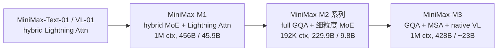
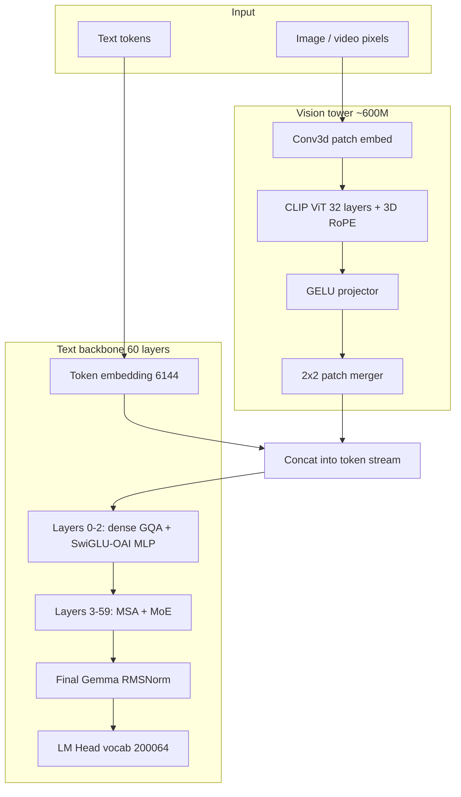
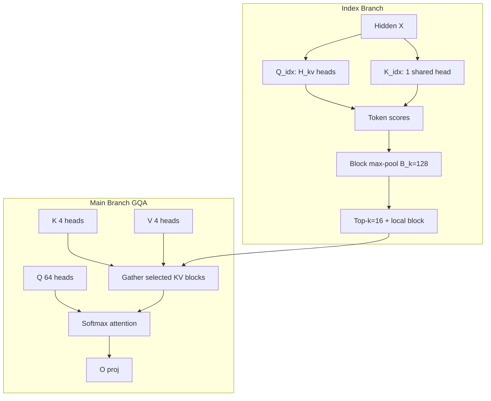
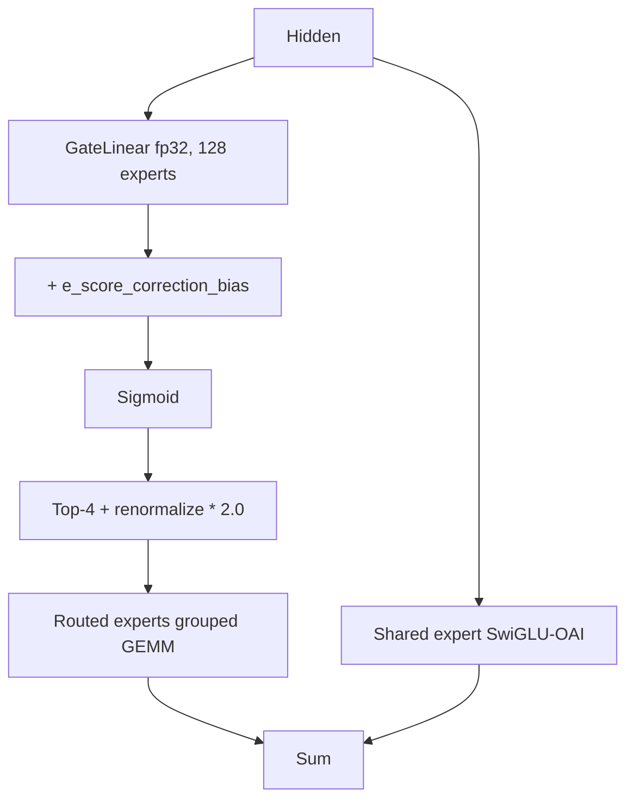
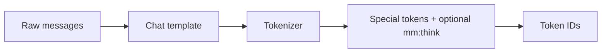
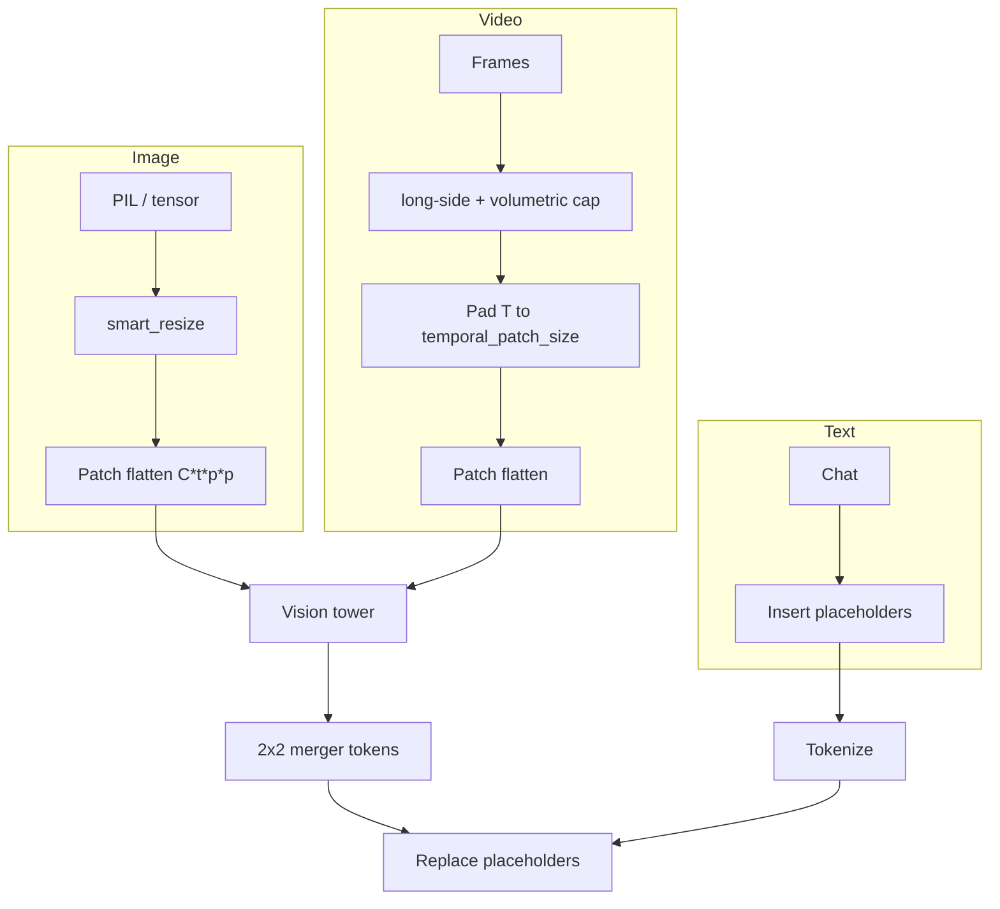
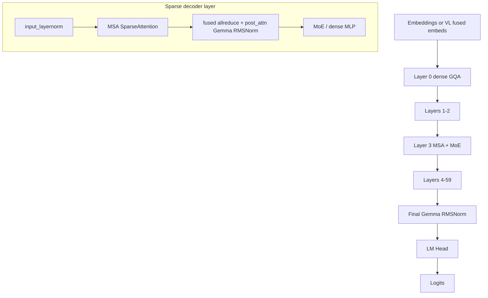
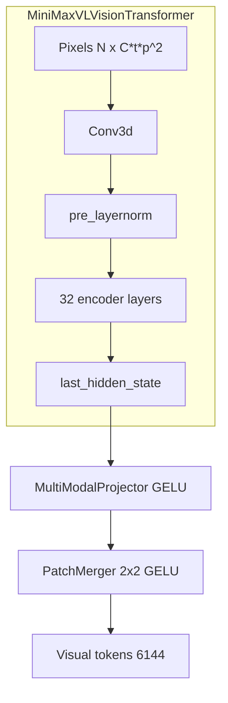
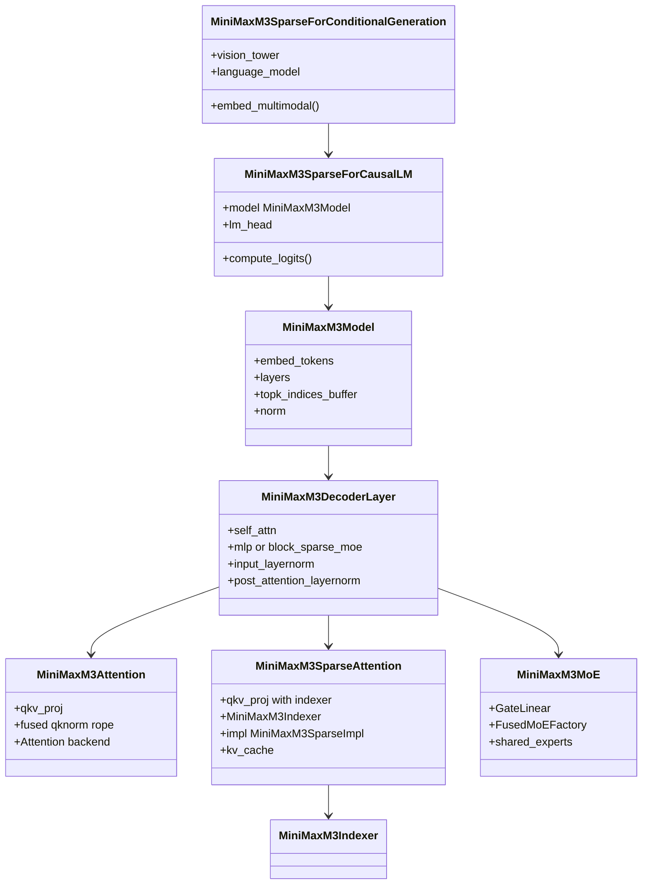

# vLLM MiniMax-M3 模型技术教程

> **文档版本**: 1.0
> **分析代码版本**: vLLM main 分支（截至 2026-09）
> **最后更新**: 2026-09-01
> **模型系列**: MiniMax-M（Text-01 / M1 / M2 / M3）
> **模型类型**: VLM-MoE（原生多模态 + 稀疏 MoE + MiniMax Sparse Attention）
> **重点平台**: AMD ROCm（gfx942 / gfx950），并对照 NVIDIA CUDA / SM100 MSA 路径

---

## 文档概述

本文面向需要理解 **MiniMax-M3** 架构、以及在 vLLM 中（尤其是 **ROCm**）如何落地的工程师。MiniMax-M3 是 MiniMax 发布的原生多模态 MoE 模型：约 **428B** 总参数、约 **23B** 激活参数、原生 **512K** 位置编码（可通过 YaRN 扩到 **1M**）、文本 / 图像 / 视频输入。注意力侧的核心不是 MLA，而是建立在 GQA 之上的 **MiniMax Sparse Attention (MSA)**：轻量 Index Branch 按 block 做 Top-k 检索，Main Branch 只对选中的 KV block 做精确 softmax attention。

vLLM 把该模型做成 **硬件隔离的双实现**：`vllm/models/minimax_m3/nvidia/` 与 `vllm/models/minimax_m3/amd/`，入口 `vllm/models/minimax_m3/__init__.py` 按 `current_platform.is_rocm()` 选择。ROCm 路径的关键差异是：FlashInfer / SM100 CuteDSL 不可用，因此 Gemma RMSNorm、SwiGLU-OAI、block-sparse prefill、indexer top-k 都落到 **Triton + HIP fused kernel +（可选）AITER**。

### 目标读者

- 需要把 MiniMax-M3 接到 vLLM serving / 评测的推理工程师
- 需要改 ROCm kernel、AITER 稀疏 PA、MoE fused shared expert 的平台开发者
- 想对照论文 MSA 与 vLLM 实现的研究者

### 推荐阅读顺序

- 只关心模型原理：第一、二部分
- 关心输入与 forward：第三、四、五部分
- 关心 vLLM / ROCm 落地：第六部分（建议精读）
- 部署与定位代码：附录 A、C

---

# 第一部分: MiniMax-M3 模型系列概述与演进

## 1.1 模型系列发展历史

MiniMax 的开源权重路线可以看成三次「注意力效率」实验，最后收敛到 M3 的 **GQA + 可学习 block-sparse indexer**：



1. **MiniMax-Text-01 / MiniMax-VL-01（2025 初）**  
   混合注意力：部分层用 Lightning Attention（线性注意力族），部分层用 softmax。VL-01 把视觉接到同一套 backbone。vLLM 仍通过 `MiniMaxVL01ForConditionalGeneration` 支持 VL-01。

2. **MiniMax-M1（2025-06，[arXiv:2506.13585](https://arxiv.org/abs/2506.13585)）**  
   在 Text-01 上做大规模 RL（CISPO）。456B 总参 / 45.9B 激活，原生 1M 上下文。Lightning Attention 让超长生成 FLOPs 远低于纯 softmax（论文对比 DeepSeek-R1：100K 生成长度约 25% FLOPs）。这是「用混合注意力换长上下文」的一代。

3. **MiniMax-M2 系列（2026，[arXiv:2605.26494](https://arxiv.org/abs/2605.26494)）**  
   明确放弃 hybrid attention，全面回到 **full GQA**。62 层、hidden 3072、256 experts / top-8、sigmoid + expert bias、MTP。总参 229.9B、激活 9.8B、原生 192K。定位是 agent / coding，后续 M2.1 / M2.5 / M2.7 主要改 post-training 与 RL，backbone 不变。vLLM 走 `MiniMaxM2ForCausalLM`（`vllm/model_executor/models/minimax_m2.py`）。

4. **MiniMax-M3（2026-06，MSA 论文 [arXiv:2606.13392](https://arxiv.org/abs/2606.13392)）**  
   在「全 GQA 质量」和「百万级上下文成本」之间给出第三条路：**不换线性注意力，只把 softmax 做成可学习的 block-sparse**。原生多模态（图 + 视频从 step 0 混训），428B / ~23B，MSA 相对稠密 GQA 在 1M 上下文上把 per-token attention 算量压到约 1/20。公开权重：[`MiniMaxAI/MiniMax-M3`](https://huggingface.co/MiniMaxAI/MiniMax-M3)、[`MiniMaxAI/MiniMax-M3-MXFP8`](https://huggingface.co/MiniMaxAI/MiniMax-M3-MXFP8)。

> **关键洞察**: M1 用 Lightning Attention 换 FLOPs，M2 用更小激活 + 全 GQA 换 agent 质量，M3 用 **MSA indexer** 把长上下文重新做回「质量接近 GQA、成本接近稀疏」。vLLM 实现上 M2 仍是标准 Attention backend；M3 必须自建 indexer side-cache + block-sparse main cache，并且 **page size 强制 128**。

## 1.2 同系列模型对比

| 模型名称 | 参数量（总 / 激活） | 发布日期 | 核心创新点 | 架构类型 | 上下文长度 | 技术报告 | HuggingFace | ModelScope |
|---------|-------------------|---------|-----------|---------|-----------|---------|------------|------------|
| MiniMax-Text-01 | 456B / 45.9B | 2025-01 | Hybrid Lightning Attention | Dense/MoE hybrid attn | 1M | [Text-01](https://arxiv.org/abs/2501.08313) | [HF](https://huggingface.co/MiniMaxAI/MiniMax-Text-01) | [MS](https://www.modelscope.cn/models/MiniMax/MiniMax-Text-01) |
| MiniMax-VL-01 | 同上 + ViT | 2025-01 | Lightning Attn + 视觉 | VLM | 1M | 同上 | [HF](https://huggingface.co/MiniMaxAI/MiniMax-VL-01) | [MS](https://www.modelscope.cn/models/MiniMax/MiniMax-VL-01) |
| MiniMax-M1 | 456B / 45.9B | 2025-06 | CISPO RL + Lightning Attn | MoE LLM | 1M | [2506.13585](https://arxiv.org/abs/2506.13585) | [HF](https://huggingface.co/MiniMaxAI/MiniMax-M1-80k) | [MS](https://www.modelscope.cn/models/MiniMax/MiniMax-M1-80k) |
| MiniMax-M2 | 229.9B / 9.8B | 2025–2026 | 全 GQA、256 experts、MTP、agent RL | MoE LLM | 192K | [2605.26494](https://arxiv.org/abs/2605.26494) | [HF](https://huggingface.co/MiniMaxAI/MiniMax-M2) | [MS](https://www.modelscope.cn/models/MiniMax/MiniMax-M2) |
| MiniMax-M2.5 / M2.7 | 同 M2 backbone | 2026 | Forge RL / 生产力 agent | MoE LLM | ~192K–205K | 同上 | [HF M2.5](https://huggingface.co/MiniMaxAI/MiniMax-M2.5) | — |
| **MiniMax-M3** | **~428B / ~23B**（ViT ~600M） | **2026-06** | **MSA、原生 VL、混合 dense/MoE、SwiGLU-OAI** | **VLM-MoE** | **原生 512K / YaRN 1M** | **[2606.13392](https://arxiv.org/abs/2606.13392)** | **[HF](https://huggingface.co/MiniMaxAI/MiniMax-M3)** | **[MS](https://www.modelscope.cn/models/MiniMax/MiniMax-M3)** |
| MiniMax-M3-MXFP8 | 同 M3，权重量化 | 2026 | NVIDIA MXFP8 checkpoint | VLM-MoE | 同上 | 同上 | [HF](https://huggingface.co/MiniMaxAI/MiniMax-M3-MXFP8) | — |

## 1.3 各模型能力对比

| 能力维度 | M1 | M2 系列 | M3 |
|---------|----|--------|----|
| 语言 / 推理 | 强 reasoning，长思维链 | 强 agent / coding | 前沿 coding + cowork；thinking / adaptive / disabled 三模式 |
| 多模态 | 文本为主（VL-01 是独立 VL） | 文本（M2.5 产品侧有多模态变体） | **原生图 + 视频**，从预训练第一步混训 |
| 长上下文机制 | Lightning Attention | 全 GQA（成本随 \(N^2\)） | **MSA block-sparse GQA** |
| 激活规模 | 45.9B | 9.8B | ~23B |
| vLLM 架构类 | MiniMaxText01 / 相关 | `MiniMaxM2ForCausalLM` | `MiniMaxM3SparseForCausalLM` / `...ConditionalGeneration` |
| KV page 约束 | 常规 | 常规 | **必须 `--block-size 128`** |

公开评测（模型卡 / recipe 口径，非本文复现）：SWE-Bench Pro 59.0%、Terminal-Bench 2.1 66.0%、相对 M2 在 1M 上下文约 **9× prefill / 15× decode**。

## 1.4 技术报告与论文汇总

| 文档 | 链接 | 说明 |
|------|------|------|
| MiniMax Sparse Attention | [arXiv:2606.13392](https://arxiv.org/abs/2606.13392) | MSA 架构、KL 对齐训练、H800 kernel、与 GQA 质量对比；生产模型即 M3 |
| MiniMax-M1 | [arXiv:2506.13585](https://arxiv.org/abs/2506.13585) | Lightning Attention + CISPO |
| MiniMax-M2 Series | [arXiv:2605.26494](https://arxiv.org/abs/2605.26494) | 全 GQA MoE + Forge agent RL |
| MiniMax-Text-01 | [arXiv:2501.08313](https://arxiv.org/abs/2501.08313) | 混合注意力前身 |
| NVIDIA 部署博客 | [developer.nvidia.com](https://developer.nvidia.com/blog/deploy-long-context-reasoning-and-agentic-workflows-with-minimax-m3-on-nvidia-accelerated-infrastructure/) | 428B / 22B active / ViT 600M 等产品规格 |
| vLLM Recipes | [recipes.vllm.ai/MiniMaxAI/MiniMax-M3](https://recipes.vllm.ai/MiniMaxAI/MiniMax-M3) | CUDA / ROCm 启动命令、YaRN 1M、AITER 开关 |
| 官方 MSA kernel | [github.com/MiniMax-AI/MSA](https://github.com/MiniMax-AI/MSA) | 训练 / 推理参考实现 |

---

# 第二部分: MiniMax-M3 模型架构详解

## 2.1 整体架构概览

M3 是 **CLIP 风格 ViT + 两级 projector/patch-merger + 60 层 decoder**。Decoder 前 3 层是 **dense MLP + 全 GQA**；后 57 层是 **MoE + MSA**。视觉 token 经 projector 对齐到文本 hidden（6144），再与文本 embedding 拼接进同一条 causal 序列。



> **为什么前 3 层 dense + full attention？**  
> 浅层需要全局、稠密的局部特征混合（和 DeepSeek-V3 前几层 dense 类似）。MSA 的 indexer 在深层长程检索更划算；checkpoint 用 `moe_layer_freq` / `sparse_attention_freq` 把两者对齐为 `[0,0,0,1,...,1]`。

## 2.2 核心超参数

数值来自 vLLM `MiniMaxM3TextConfig` 默认值（与 MiniMax-M3-preview / 公开 checkpoint 的 `text_config` 一致），视觉侧来自 Megatron Bridge / NVIDIA 产品说明。

| 参数 | 值 | 说明 |
|------|-----|------|
| Hidden Size | 6144 | 文本 backbone |
| Num Layers | 60 | 前 3 dense，后 57 MoE + MSA |
| Num Attention Heads \(H_q\) | 64 | GQA query |
| Num KV Heads \(H_{kv}\) | 4 | GQA group 数；TP 后每 rank 常为 1（TP=4/8） |
| Head Dim \(d_h\) | 128 | |
| GQA group size \(G\) | 16 | \(64/4\) |
| Dense MLP intermediate | 12288 | 仅 dense 层 |
| MoE expert intermediate | 3072 | 每个 routed expert |
| Shared expert intermediate | 3072 | `n_shared_experts=1` |
| Num routed experts | 128 | top-4 |
| Routed scaling factor | 2.0 | DeepSeek-V3 风格 |
| Vocab Size | 200064 | 与 M2 同词表量级 |
| Max Position Embeddings | 524288 | 原生 512K；1M 需 YaRN `factor=2` |
| RoPE \(\theta\) | \(5\times 10^6\) | 超大 base，服务长上下文 |
| Partial RoPE | 64 / 128 | `rotary_dim=64`, `partial_rotary_factor=0.5` |
| Norm | Gemma RMSNorm | \(x\cdot(1+w)/\mathrm{RMS}\) |
| QK Norm | per-head Gemma RMSNorm | |
| Activation | SwiGLU-OAI | \(\alpha=1.702\), \(\beta=1\), \(\mathrm{limit}=7\) |
| MSA block size \(B_k\) | 128 | 与 KV page 对齐 |
| MSA top-k | 16 | 每 query、每 GQA group |
| Index heads | 4 query + 1 shared key | `sparse_num_index_heads=4`, dim 128 |
| Index score | max-pool over block | `sparse_score_type="max"` |
| Local blocks | 1 | 当前 token 所在 block 必选 |
| Vision hidden | 1280 | CLIP-style ViT |
| Vision layers | 32 | Conv3d patch + 3D RoPE |
| Spatial merge | 2×2 | patch merger |
| Total / active params | ~428B / ~23B | NVIDIA 博客写 22B active |

## 2.3 Attention 机制详解

M3 同时使用两种 attention：

- **Layers 0–2**：标准 **GQA**（PagedAttention / Triton / AITER FA，取决于平台）。
- **Layers 3–59**：**MSA** = Index Branch + Main Branch。

### 技术原理: GQA

64 个 Q head 共享 4 个 KV head。每个 KV head 服务 \(G=16\) 个 Q head。KV cache 相对 MHA 缩小 \(64/4=16\times\)。

**公式**（单 head，因果）：

$$\mathrm{Attention}(Q,K,V)=\mathrm{softmax}\left(\frac{QK^\top}{\sqrt{d_h}}+\mathrm{Mask}\right)V$$

**KV cache 每 token（一层，bf16）**：

$$2 \times H_{kv} \times d_h \times 2\ \mathrm{bytes} = 2 \times 4 \times 128 \times 2 = 2048\ \mathrm{B}$$

60 层约 120 KB/token（未计 indexer side-cache）。MSA **并不减少 Main Branch 的 KV 存储**（选中的 block 仍要完整 K/V），它减少的是 **attention FLOPs 与 HBM 流量**。Indexer 另存一份 key-only cache（每 token 128 dim）。

### 技术原理: MiniMax Sparse Attention (MSA)

论文把稀疏注意力写成两阶段：

$$\mathcal{I}_i=\mathrm{Index}_\phi(q_i, K_{\le i}),\qquad o_i=\mathrm{Attn}(q_i, K[\mathcal{I}_i], V[\mathcal{I}_i])$$

MSA 在 **GQA group × block** 粒度上实例化。Index Branch 只加两套投影：

$$Q^{\mathrm{idx}}=X W_q^{\mathrm{idx}}\in\mathbb{R}^{N\times H_{kv}\times d_{\mathrm{idx}}},\qquad
K^{\mathrm{idx}}=X W_k^{\mathrm{idx}}\in\mathbb{R}^{N\times 1\times d_{\mathrm{idx}}}$$

对 group \(r\)、query \(i\)、key token \(j\)：

$$S^{\mathrm{idx},(r)}_{i,j}=\frac{(Q^{\mathrm{idx}})^{(r)}_i (K^{\mathrm{idx}})_j^\top}{\sqrt{d_{\mathrm{idx}}}},\qquad
M^{\mathrm{idx},(r)}_{i,b}=\max_{j\in\mathcal{B}_b,\,j\le i} S^{\mathrm{idx},(r)}_{i,j}$$

$$\mathcal{I}_i^{(r)}=\mathrm{TopK}_b(M^{\mathrm{idx},(r)}_{i,\cdot}, k)\;\cup\;\{\text{local block of } i\}$$

Main Branch 对 group \(r\) 内每个 Q head 做 **精确** block-sparse softmax，注意力长度上限为 \(k B_k = 16\times 128=2048\)，与序列长度 \(N\) 无关。



**复杂度（论文式 (12)）**：

$$F_{\mathrm{GQA}}(N)=2 H_q d_h N^2,\qquad
F_{\mathrm{MSA}}(N)=\underbrace{H_{kv} d_{\mathrm{idx}} N^2}_{\text{Index}}+\underbrace{4 H_q d_h N k B_k}_{\text{Main}}$$

代入 M3 数字：\(F_{\mathrm{GQA}}=16384 N^2\)，Index \(=512 N^2\)，Main \(=4\cdot 64\cdot 128\cdot N\cdot 2048\)。当 \(N=10^6\) 时 Main 相对全 GQA 约 \(2048/N\) 量级，整体接近论文宣称的数十倍 attention 算力下降。Index 仍是 \(O(N^2)\)，但 \(H_{kv} d_{\mathrm{idx}}\ll H_q d_h\)，常数小很多；推理时 indexer 也跑在 paged cache 上，用 Triton / AITER 实现。

训练时 Top-k 不可微，论文用 **KL 对齐**（teacher 为 Main Branch 在选中 token 上的平均分布）、**Index 输入 stop-gradient**、**indexer warmup**、**强制 local block**。推理不需要 KL。

> **注意**: M3 checkpoint 对所有 sparse 层设置 `sparse_disable_index_value`，因此 vLLM **不创建** `index_v_proj` / `index_o_proj`。Indexer 只产出 block id，不贡献一层额外 attention 输出。

## 2.4 FFN / MoE 机制详解

### Dense MLP（层 0–2）

`dense_intermediate_size=12288`，SwiGLU-OAI（与 GPT-OSS 同族）：

$$\mathrm{gate}=\mathrm{clamp}(g, \max=L),\quad
\mathrm{up}=\mathrm{clamp}(u,-L,L)$$

$$y=\mathrm{gate}\cdot\sigma(\alpha\cdot\mathrm{gate})\cdot(\mathrm{up}+\beta)$$

其中 \(\alpha=1.702\)，\(\beta=1\)（即 `(up+1)`），\(L=7\)。

### MoE（层 3–59）

DeepSeek-V3 风格 **sigmoid router + expert bias + top-4 + 1 shared expert**：

$$g_i=\sigma(w_i^\top h + b_i),\quad
\mathcal{T}=\mathrm{TopK}(g,4),\quad
\tilde{g}_j=\frac{g_j}{\sum_{k\in\mathcal{T}} g_k}\cdot s$$

其中 \(s=\) `routed_scaling_factor` \(=2.0\)。输出：

$$\mathrm{MoE}(h)=\mathrm{E}_{\mathrm{shared}}(h)+\sum_{j\in\mathcal{T}}\tilde{g}_j E_j(h)$$



Router 权重量化保持 **fp32**（`GateLinear(params_dtype=fp32)`）。Load balancing 训练时有 aux loss；推理只跑 top-k。

vLLM ROCm 可把 shared expert **熔进** routed MoE 的最后一个 slot（`VLLM_ROCM_USE_AITER_FUSION_SHARED_EXPERTS`），避免一次额外 MLP；**expert parallel 下关闭**，因为 EP 的 expert map 处理不了这个追加 slot。

## 2.5 其他关键技术组件

### Gemma-style RMSNorm

$$\mathrm{RMSNorm}_{\mathrm{Gemma}}(x)= \frac{x}{\sqrt{\mathrm{mean}(x^2)+\varepsilon}}\cdot(1+w)$$

`w` 初始化为 0，等价于单位缩放。NVIDIA 路径用 FlashInfer `gemma_rmsnorm`；ROCm 用 Triton（见 6.4）。

### Partial NeoX RoPE

只旋转 head 的前 64 维，后 64 维直通。\(\theta=5\times 10^6\)。超 512K 时必须在 **text_config** 上设 YaRN，否则 cos/sin cache 越界直接 worker crash。

### QK Norm

每个 head 独立 Gemma RMSNorm（`qk_norm_type="per_head"`），再 RoPE。Sparse 层对 index_q / index_k **同样**做 per-head norm + 同一套 RoPE 表。

### MTP

`num_mtp_modules=1`。独立架构 `MiniMaxM3MTP`：一层强制 sparse + MoE 的 decoder，作 speculative decoding draft。AMD / NVIDIA 各有一份 `mtp.py`，逻辑相同，import 各自的 `MiniMAXGemmaRMSNorm`。

### ATOM 跨层 index 共享（可选）

`--hf-overrides '{"use_index_cache": true, "index_topk_freq": 4}'`：每 4 个 sparse 层只算一次 indexer，其余层复用共享 `topk_indices_buffer`。代码注释称 GSM8K 上几乎无损。默认关闭。

---

# 第三部分: 输入预处理流程

## 3.1 文本预处理



- Tokenizer 与 M 系列一致，vocab **200064**。
- Reasoning：`<mm:think>...</mm:think>`。`thinking_mode=enabled` 时解析器假定生成已在 think block 内（可能不再发出开标签）。
- Tool call：命名空间前缀 `]<]minimax[>[<tool_call>`，Rust parser `MinimaxM3ToolParser`（不是 M2 改名）。Serving 应加 `--tool-call-parser minimax_m3 --reasoning-parser minimax_m3 --enable-auto-tool-choice`。

## 3.2 多模态输入处理

vLLM 把 HF remote code 的 processor **vendor** 进 `vllm/transformers_utils/processors/minimax_m3.py`，因此 **不需要 `--trust-remote-code`**。

图像 / 视频走 Qwen 风格 `smart_resize`（面积上限）以及 MiniMax 的 **长边约束**：

- `MIN_SHORT_SIDE_PIXEL = 112`
- `IMAGE_MAX_TOTAL_PIXELS = 3584²`
- `VIDEO_MAX_TOTAL_PIXELS = 301_056_000`（宽×高×帧，超限直接拒绝而非再缩小）

占位符（`MiniMaxM3VLProcessingInfo`）：

| Token | 字面值 |
|-------|--------|
| Image | `]<]image[>[` |
| Video | `]<]video[>[` |
| Vision start / end | `]<]start of image[>[` / `]<]end of image[>[` |



帧数会 pad 到 `temporal_patch_size`（默认 2）的倍数。token 数：

$$\mathrm{tokens}=\frac{T_{\mathrm{grid}}\cdot H_{\mathrm{grid}}\cdot W_{\mathrm{grid}}}{\mathrm{merge}^2}$$

## 3.3 Tokenizer 配置

| 配置项 | 值 | 说明 |
|--------|-----|------|
| Vocab Size | 200064 | |
| Chat Template | HF 仓库 `chat_template` | 支持 `thinking_mode` |
| Image / video tokens | 见上表 | processor 与 dummy builder 共用 |
| Sampling（官方） | T=1.0, top_p=0.95, top_k=40 | recipe 推荐 |

---

# 第四部分: 模型前向传播流程

## 4.1 整体 Forward 流程



Pipeline parallel 传递 `(hidden_states, residual)`。Residual 在 fused add-RMSNorm 中更新，与 Llama 族 pre-norm 习惯一致。

## 4.2 单层 Transformer 计算流程

令 \(B_{\mathrm{tok}}\) 为本 step 的 token 数（decode 多为 1/request，prefill 为 prompt 长度）。

### Step 1: Self-Attention（dense 层）

- Input: `[B_tok, 6144]`
- QKV: `QKVParallelLinear` → `[B_tok, (64+4+4)*128 / TP]`
- Fused kernel：per-head Gemma QK-norm + partial RoPE（可选写入 KV cache）
- Attention backend：常规 vLLM Attention（ROCm 上 recipe 指定 `TRITON_ATTN`）
- `o_proj`：`reduce_results=False`，all-reduce 与 post-LN 融合

### Step 2: Self-Attention（sparse 层）

形状按 **TP=8、每 rank 1 KV head** 叙述（M3 最常见）：

1. `MinimaxM3QKVParallelLinearWithIndexer` 一次 GEMM 得到  
   `[q | k | v | index_q | index_k]`
2. HIP/CUDA fused kernel：主支 + index 支 QK-norm + RoPE，并把 K/V、index-K scatter 进 **两套** paged cache  
   - Main cache: `[num_blocks, H_kv_local, 128, 2*128]`  
   - Index cache: `[num_blocks, 128, 128]`（MLAAttentionSpec，key-only）
3. Indexer：对每个 query、每个 local KV head，对可见 128-token block 做 max-pool 打分，写入 `topk_indices_buffer`，形状  
   `[num_index_heads_local, max_batched_tokens, 16]`
4. Main sparse attn：只 gather 这 16 个 page 做 softmax（prefill 一块算；decode 用 split-K + merge）
5. `o_proj` + fused AR-RMSNorm

`_run_attention` 标了 `@eager_break_during_capture`：indexer / split-K 读动态 metadata，**不能进标准 CUDA graph**。ROCm recipe 因此设 `VLLM_USE_BREAKABLE_CUDAGRAPH=0`，避免走会强制 eager 的 breakable 路径。

### Step 3: FFN / MoE

- Dense：`[B_tok, 6144] → gate_up [B_tok, 2*12288] → SwiGLU-OAI → down [B_tok, 6144]`
- MoE：fp32 gate `[B_tok, 128]` → top-4 dispatch → expert GEMM（MXFP8 时两段 GEMM 夹 SwiGLU）+ shared expert

## 4.3 vLLM 中的优化

| 优化 | 作用 |
|------|------|
| `--block-size 128` | 一 page = 一 MSA block，indexer 与 attend 无二次重排 |
| Fused QK-norm + RoPE + KV insert | 去掉 Python 上 4 次 norm + 2 次 RoPE + scatter |
| `fused_allreduce_gemma_rms_norm` | TP>1 时 AR + residual + RMSNorm；ROCm 无 FlashInfer 则退回 `all_reduce` + Triton Gemma |
| FP8 KV | recipe 称全原生上下文无损，KV 池约 1.5× |
| MXFP8 权重 | checkpoint 体积约减半；gfx950 有原生 MX 核 |
| ATOM `index_topk_freq` | 跨层复用 top-k |
| Spec decode / MTP | `MiniMaxM3MTP`；sparse metadata 支持 uniform decode（含 draft tokens） |
| Encoder TP data | `--mm-encoder-tp-mode data`，ViT 按序列 DP 切分 |

---

# 第五部分: ViT 计算流程

## 5.1 ViT 架构概览

`MiniMaxVLVisionModel`：Conv3d patch embed → CLIP ViT（LayerNorm + MHA + MLP）→ 两层 GELU projector（1280→6144）→ 2×2 patch merger（再一个 GELU MLP）。公开 checkpoint **没有** `post_layernorm` 权重，vLLM 显式关掉 post-LN，避免随机初始化污染视觉特征。



FLASHINFER ViT backend 在该模块标注为不支持；CUDA 默认 FLASH_ATTN，ROCm recipe 用 `--mm-encoder-attn-backend ROCM_AITER_FA`。

## 5.2 Patch Embedding 详解

`MiniMaxVLPatchEmbed`：`Conv3d(in=C, out=hidden, kernel=(t, p, p), stride=(t, p, p))`。  
输入先 reshape 为 `(N, C, t, p, p)`。图像相当于 \(T=1\) 或 pad 后的 temporal grid；视频 \(T=\lceil F/t\rceil\)。

## 5.3 ViT Encoder 计算流程

- MHA：**全头**（非 GQA），QKV **有 bias**。
- **Partial 3D RoPE**：把可旋转维均分给 t / h / w（`t_dim=h_dim=w_dim`，M3 上 `rotary_dim≈78 < head_dim`，余维直通）。频率表按 merge 后的空间网格重排，保证 2×2 merger 后位置仍一致。
- **ROCm 长视频**：HIP flash-attn Triton rotary 的 `grid.y = cdiv(seqlen, BLOCK_M)` 不能超过 65536。`BLOCK_M=8`（rotary_dim≤128）时上限 **524288** token。超限则按 `vision_segment_max_frames` 的 segment 逐段 RoPE，数学上等价（cos/sin 已按 token 预计算）。图像与短视频仍走单 kernel。

## 5.4 视觉-语言融合策略

**拼接而非 cross-attn**：projector + merger 把视觉特征映射到文本空间，processor 把 `]<]image[>[` 等占位替换成视觉 token。Decoder 用同一套 causal MSA/GQA 看待它们。这与 Qwen2-VL / Qwen3-VL 的「视觉 token 进 LLM」相同，和 Flamingo 式 cross-attn 不同。

`MiniMaxM3SparseForConditionalGeneration.embed_multimodal` 分别处理 image / video，再 `language_model` 吃 fused embeddings。

---

# 第六部分: vLLM 中的代码实现（含 ROCm）

## 6.1 模型注册与配置

```python
# vllm/model_executor/models/registry.py
"MiniMaxM3SparseForCausalLM": (
    "vllm.models.minimax_m3",
    "MiniMaxM3SparseForCausalLM",
),
"MiniMaxM3SparseForConditionalGeneration": (
    "vllm.models.minimax_m3",
    "MiniMaxM3SparseForConditionalGeneration",
),
"MiniMaxM3MTP": ("vllm.models.minimax_m3", "MiniMaxM3MTP"),
```

```python
# vllm/models/minimax_m3/__init__.py
if TYPE_CHECKING or not current_platform.is_rocm():
    from .nvidia.model import (
        MiniMaxM3SparseForCausalLM,
        MiniMaxM3SparseForConditionalGeneration,
    )
    from .nvidia.mtp import MiniMaxM3MTP
else:
    from .amd.model import (
        MiniMaxM3SparseForCausalLM,
        MiniMaxM3SparseForConditionalGeneration,
    )
    from .amd.mtp import MiniMaxM3MTP
```

配置：`vllm/transformers_utils/configs/minimax_m3.py`

- `MiniMaxM3TextConfig`（`minimax_m3_text`）
- `MiniMaxM3Config`（`minimax_m3_vl`，含 `text_config` + `vision_config` dict）
- `MiniMaxM3MTPConfig`

文档：`docs/models/supported_models.md` 将 M3 标为 V1 engine 支持；文本类 `MiniMaxM3SparseForCausalLM`，多模态 `MiniMaxM3SparseForConditionalGeneration`（T + I⁺ + V⁺）。

## 6.2 核心模型类分析



`MiniMaxM3SparseAttention` 同时是 `nn.Module` 和 `AttentionLayerBase`：自己注册进 `static_forward_context`、自己 `get_kv_cache_spec`，不包一层通用 `Attention`。Indexer 再注册 **第二套** cache（`prefix.attn.index_cache`）。

## 6.3 关键计算流程代码分析

### 平台分发：稀疏 attend / indexer kernel

```python
# vllm/models/minimax_m3/common/sparse_attention.py
if current_platform.is_rocm():
    from vllm.models.minimax_m3.amd.ops.sparse_attn import (
        minimax_m3_sparse_attn,
        minimax_m3_sparse_attn_decode,
    )
else:
    from vllm.models.minimax_m3.common.ops.sparse_attn import (
        minimax_m3_sparse_attn,
        minimax_m3_sparse_attn_decode,
    )
```

`select_main_backend_and_impl_cls`：

| 条件 | 实现 |
|------|------|
| ROCm + AITER shuffle KV + `num_kv_heads==1` | `MiniMaxM3SparseAiterPAImpl`（page-16 Gluon PA） |
| CUDA SM100 + topk in {4,8,16,32} + 非 e5m2 | NVIDIA MSA / CUTLASS / CuteDSL |
| 其他（含默认 ROCm） | `MiniMaxM3SparseTritonImpl` |

Indexer：SM100 + topk==16 用 `fmha_sm100`；**ROCm 永远是 Triton**（`MiniMaxM3IndexerTritonImpl`），index cache dtype 仅 bf16。

### Decoder layer residual

```python
# vllm/models/minimax_m3/amd/model.py  MiniMaxM3DecoderLayer.forward
hidden_states = self.self_attn(positions=positions, hidden_states=hidden_states)
hidden_states, residual = fused_allreduce_gemma_rms_norm(
    hidden_states, residual, self.post_attention_layernorm
)
ffn = self.block_sparse_moe if self.is_moe_layer else self.mlp
hidden_states = ffn(hidden_states)
```

### Sparse forward 骨架

```python
# MiniMaxM3SparseAttention.forward / _run_attention
qkv, _ = self.qkv_proj(hidden_states)  # [q|k|v|iq|ik]
ops.fused_minimax_m3_qknorm_rope_kv_insert(...)  # HIP/CUDA
# AITER PA: 改为 aiter.reshape_and_cache + minimax_m3_insert_index_cache
if not self.skip_index_topk:
    self.indexer(index_query)  # writes topk_indices_buffer
return self.impl.forward(self, query, self.kv_cache, output)
```

### SwiGLU-OAI（ROCm 刻意不用 bf16 HIP op）

```python
# MiniMaxM3MLP.forward
gate_up, _ = self.gate_up_proj(x)
x = swiglu_oai_split(gate_up, alpha=..., beta=..., limit=...)
x, _ = self.down_proj(x)
```

注释写明：`silu_and_mul_with_clamp` 在 ROCm 上会把中间结果打到 bf16（相对误差 ~3e-3），而 Triton fp32 ~1e-6；该激活后面接 MXFP8 quant，会伤 GSM8K。HIP graph 已抹平 launch 开销，e2e 吞吐几乎一样，因此保精度。

## 6.4 ROCm 后端深挖（相对 NVIDIA）

### 6.4.1 目录与职责

| 路径 | 角色 |
|------|------|
| `amd/model.py` | 文本 + VL wrapper；原生 Gemma RMSNorm；AITER FSE / sparse PA 接线 |
| `amd/ops/gemma_rmsnorm.py` | 单 pass Triton Gemma RMSNorm / fused add |
| `amd/ops/swiglu_oai.py` | SwiGLU-OAI + MXFP8 量化融合 |
| `amd/ops/sparse_attn.py` | **CDNA 特化 prefill**：KV block 再切 `SUB_K`（gfx950=64，gfx942=32）打 MFMA |
| `amd/ops/index_topk.py` | ROCm 版 indexer score / bitonic top-k / decode |
| `amd/ops/sparse_pa.py` | 逻辑 block → AITER page-16 table；Gluon sparse PA |
| `amd/sparse_attention_msa.py` | `MiniMaxM3SparseAiterPAImpl` |
| `common/*` | indexer 抽象、metadata、ViT、processor、Triton 通解 |
| `nvidia/*` | FlashInfer RMSNorm、SM100 MSA、CUTLASS decode、CuteDSL index score |
| `csrc/.../fused_minimax_m3_qknorm_rope_kv_insert_kernel.cu` | **同一份** CUDA/HIP 源，`USE_ROCM` 切 fp8 header / warp mask |

### 6.4.2 NVIDIA vs ROCm 对照

| 组件 | NVIDIA | ROCm |
|------|--------|------|
| Gemma RMSNorm | FlashInfer | Triton `gemma_rmsnorm` |
| Dense SwiGLU-OAI | `SiluAndMulWithClamp` | fp32 Triton `swiglu_oai_split` |
| Sparse indexer | SM100 `sparse_topk_select` 或 Triton | 仅 Triton（`amd.ops.index_topk`） |
| Sparse prefill attend | MSA KV-outer / CUTLASS | Triton；MI3xx 用 `num_warps=1`, `matrix_instr_nonkdim=16`, `kpack=2` |
| Sparse decode attend | Triton 或 CUTLASS SM100 | 同 Triton decode；可选 AITER page-16 |
| QK-norm+RoPE+insert | 同 fused C++ kernel | 同 kernel，HIP 编译 |
| MoE | FusedMoE / DeepGEMM 等 | FusedMoE；gfx950 可 aiter grouped top-k + FSE |
| ViT attention | FLASH_ATTN / 可选 FLASHINFER cuDNN | `ROCM_AITER_FA`；长视频分段 RoPE |
| CUDA graph | breakable capture 包 indexer | recipe：**关掉** breakable cudagraph |
| Indexer KV dtype | SM100 可 fp8 | Triton 仅 bf16 |

### 6.4.3 CDNA sparse prefill 为什么要 SUB_K

`amd/ops/sparse_attn.py` 只特化 **prefill**。每个选中的 128-token KV block 再切成 `SUB_K` 宽的 QK/PV MFMA：gfx950 切两半（64），gfx942 切四份（32）。`num_warps=1` 让小波驻留在小 GEMM 上；decode 仍复用 `common.ops` 的 split-K（query 维太短，prefill kernel 用不上）。

### 6.4.4 AITER sparse paged attention（可选，高并发长上下文）

开启条件（`minimax_m3_use_aiter_sparse_pa`）：

- `rocm_aiter_ops.is_enabled()`
- `is_shuffle_kv_cache_enabled()`（`VLLM_ROCM_SHUFFLE_KV_CACHE_LAYOUT=1`）
- **每 TP rank `num_kv_heads == 1`**（TP≥4 对 M3 的 4 个 KV head 成立）

数据路径：

1. Main KV 按 AITER shuffle / page-16 视图 unfold（`_ensure_aiter_sparse_pa_kv_cache`）。
2. `minimax_m3_build_sparse_block_table_*` 把 top-k 的 **逻辑 128-token block** 展开成 **8 个 16-token physical pages**（`PAGES_PER_SPARSE_BLOCK=8`）。
3. `aiter.reshape_and_cache` 写 K/V；Triton `minimax_m3_insert_index_cache` 写 index-K。
4. Prefill/decode 调 Gluon sparse PA，只扫选中 pages。

Recipe 明确：**isl≥8k 且 conc≥64 才划算**，短上下文会回退变慢。典型 MI355X：

```bash
export VLLM_USE_BREAKABLE_CUDAGRAPH=0
export VLLM_ROCM_USE_AITER=1
export VLLM_ROCM_USE_AITER_FUSION_SHARED_EXPERTS=1
export VLLM_ROCM_SHUFFLE_KV_CACHE_LAYOUT=1
```

### 6.4.5 Fused shared expert

`MiniMaxM3MoE`：`VLLM_ROCM_USE_AITER_FUSION_SHARED_EXPERTS=1` 且非 EP、量化兼容时，不建独立 `shared_experts` 模块，把 shared 当作 extra expert slot。gfx950 上再走 aiter biased grouped top-k（`num_expert_group=topk_group=1` 退化成普通 top-k，但 fused append + 内部 `routed_scaling_factor`）。

### 6.4.6 推荐 ROCm 启动（摘自官方 recipe）

**BF16 TP8（图文）**：

```bash
export VLLM_USE_BREAKABLE_CUDAGRAPH=0
vllm serve MiniMaxAI/MiniMax-M3 \
  --tensor-parallel-size 8 \
  --block-size 128 \
  --attention-backend TRITON_ATTN \
  --mm-encoder-tp-mode data \
  --mm-encoder-attn-backend ROCM_AITER_FA \
  --tool-call-parser minimax_m3 \
  --reasoning-parser minimax_m3 \
  --enable-auto-tool-choice
```

**1M 上下文**（原生 cache 只覆盖 512K，必须 YaRN 打在 **text_config**）：

```bash
VLLM_ALLOW_LONG_MAX_MODEL_LEN=1 \
  vllm serve MiniMaxAI/MiniMax-M3 \
  --block-size 128 --kv-cache-dtype fp8 --tensor-parallel-size 8 \
  --max-model-len 1048576 \
  --hf-overrides '{"text_config":{"rope_scaling":{"rope_type":"yarn","factor":2.0,"original_max_position_embeddings":524288}}}'
```

硬件：MI350X/MI355X（gfx950）、MI300X/MI325X（gfx942），ROCm 7.2+。BF16 通常 TP=8；MXFP8 可从 TP=4 起（每 rank 仍 1 KV head 才能开 AITER sparse PA）。

镜像：`vllm/vllm-openai-rocm:minimax-m3`（稳定版尚未合入时）。

> **性能提示**: 先用 Triton sparse + FP8 KV 跑通；只在长上下文高并发再开 shuffle KV + AITER PA。MoE FSE 与 EP 互斥。

### 6.4.7 测试入口

| 测试 | 覆盖 |
|------|------|
| `tests/kernels/attention/test_minimax_m3.py` | sparse attn 正确性 |
| `tests/kernels/test_minimax_m3_amd_ops.py` | AMD ops |
| `tests/kernels/test_minimax_m3_sparse_attn_fp8_scale.py` | FP8 KV scale（ROCm import amd.ops） |
| `tests/kernels/test_fused_minimax_m3_qknorm_rope_kv_insert.py` | fused pre-attn kernel |
| `tests/models/multimodal/processing/test_minimax_m3.py` | VL processor |
| `tests/tool_parsers/test_minimax_m3_tool_parser.py` | tool tags |
| `tests/reasoning/test_minimax_m3_reasoning_parser.py` | `<mm:think>` |

---

# 附录

## A. 关键代码位置索引

| 组件 | 文件路径 | 关键类/函数 |
|------|---------|------------|
| 平台入口 | `vllm/models/minimax_m3/__init__.py` | ROCm → `amd.model` |
| 注册 | `vllm/model_executor/models/registry.py` | `MiniMaxM3Sparse*` |
| 配置 | `vllm/transformers_utils/configs/minimax_m3.py` | `MiniMaxM3TextConfig` |
| AMD 模型 | `vllm/models/minimax_m3/amd/model.py` | `MiniMaxM3SparseAttention`, `MiniMaxM3MoE` |
| NVIDIA 模型 | `vllm/models/minimax_m3/nvidia/model.py` | 同名类，FlashInfer RMSNorm |
| Indexer | `vllm/models/minimax_m3/common/indexer.py` | `MiniMaxM3Indexer` |
| Sparse backend | `vllm/models/minimax_m3/common/sparse_attention.py` | `select_main_backend_and_impl_cls` |
| ROCm sparse prefill | `vllm/models/minimax_m3/amd/ops/sparse_attn.py` | `_gqa_sparse_fwd_kernel` |
| AITER PA | `vllm/models/minimax_m3/amd/ops/sparse_pa.py` | `minimax_m3_sparse_attn_*_aiter` |
| Fused QK-norm | `csrc/libtorch_stable/fused_minimax_m3_qknorm_rope_kv_insert_kernel.cu` | HIP/CUDA |
| ViT | `vllm/models/minimax_m3/common/vision_tower.py` | `MiniMaxVLVisionModel` |
| MM processor | `vllm/models/minimax_m3/common/mm_preprocess.py` | `MiniMaxM3VLMultiModalProcessor` |
| HF processor vendor | `vllm/transformers_utils/processors/minimax_m3.py` | `smart_resize` |
| MTP | `vllm/models/minimax_m3/amd/mtp.py` | `MiniMaxM3MTP` |
| Tool / reasoning | `vllm/tool_parsers/minimax_m3_tool_parser.py`, `vllm/reasoning/minimax_m3_reasoning_parser.py` | |
| Warmup | `vllm/model_executor/warmup/minimax_m3_msa_warmup.py` | MSA kernel warmup |

## B. 术语表

| 术语 | 英文 | 说明 |
|------|------|------|
| 分组查询注意力 | GQA | 多 Q head 共享 KV head |
| MiniMax 稀疏注意力 | MSA | Index Branch + block-sparse Main Branch |
| Lightning Indexer | Index Branch | 对 KV block 打分并 Top-k |
| Local block | Local block | query 所在 128-token 块，必选 |
| Gemma RMSNorm | Gemma RMSNorm | \(\times(1+w)\) |
| SwiGLU-OAI | SwiGLU-OAI | clamp + \(\sigma(\alpha g)\cdot(u+\beta)\) |
| 共享专家 | Shared expert | 每 token 必算的 MLP |
| FSE | Fused Shared Experts | 把 shared 熔进 routed MoE |
| AITER | AMD Inference Transformer Engine Runtime | ROCm 融合核 / Gluon PA |
| Page-16 | ASM page size 16 | AITER KV 写入粒度；MSA block=128=8 pages |
| MTP | Multi-Token Prediction | 投机解码 draft |
| ATOM index cache | `index_topk_freq` | 跨层复用 top-k |
| Partial RoPE | Partial rotary | 只旋 head 前一半（文本）或 3D 子集（ViT） |

## C. 参考资料

- [MiniMax Sparse Attention (arXiv:2606.13392)](https://arxiv.org/abs/2606.13392)
- [HuggingFace MiniMax-M3](https://huggingface.co/MiniMaxAI/MiniMax-M3)
- [HuggingFace MiniMax-M3-MXFP8](https://huggingface.co/MiniMaxAI/MiniMax-M3-MXFP8)
- [vLLM MiniMax-M3 Recipe](https://recipes.vllm.ai/MiniMaxAI/MiniMax-M3)
- [MiniMax-AI/MSA](https://github.com/MiniMax-AI/MSA)
- [MiniMax-M1 (arXiv:2506.13585)](https://arxiv.org/abs/2506.13585)
- [MiniMax-M2 Series (arXiv:2605.26494)](https://arxiv.org/abs/2605.26494)
- [Megatron Bridge MiniMax-M3 notes](https://docs.nvidia.com/nemo/megatron-bridge/nightly/models/minimax/minimax-m3.html)
- [LLM Architecture Gallery](https://sebastianraschka.com/llm-architecture-gallery/)
