# vLLM Qwen3-VL 模型技术教程

> **文档版本**: 1.0
> **分析代码版本**: vLLM main 分支（截至 2026-05）
> **最后更新**: 2026-05-27
> **模型系列**: Qwen3-VL
> **模型类型**: VLM (Vision-Language Model) — Dense + MoE
> **技术报告**: [Qwen3-VL Technical Report (arXiv: 2511.21631)](https://arxiv.org/abs/2511.21631)

---

## 文档概述

本文档深入剖析 Qwen3-VL 模型在 vLLM 中的完整实现，覆盖从宏观架构演进到微观算子级别的代码分析。文档聚焦以下几个方面：

- Qwen-VL 系列三代演进路线（Qwen-VL → Qwen2-VL → Qwen2.5-VL → Qwen3-VL）
- Qwen3-VL 整体架构与核心超参数
- **Interleaved-MRoPE** 位置编码的技术原理
- **DeepStack** 多尺度 ViT 特征融合机制
- 视觉编码器（ViT）完整计算流程
- 输入预处理 pipeline（文本 + 多模态）
- vLLM 中的代码实现与优化策略

**目标读者**：vLLM 开发者、多模态模型研究者、对 VLM 推理系统感兴趣的工程师。

**推荐阅读顺序**：第一部分（演进背景）→ 第二部分（架构总览）→ 第五部分（ViT 计算流程，重点）→ 第六部分（vLLM 代码实现）→ 第三/四部分（预处理与前向传播）。

---

# 第一部分: Qwen3-VL 模型系列概述与演进

## 1.1 模型系列发展历史

Qwen-VL 系列经历了从初步探索到技术飞跃的三代演进：

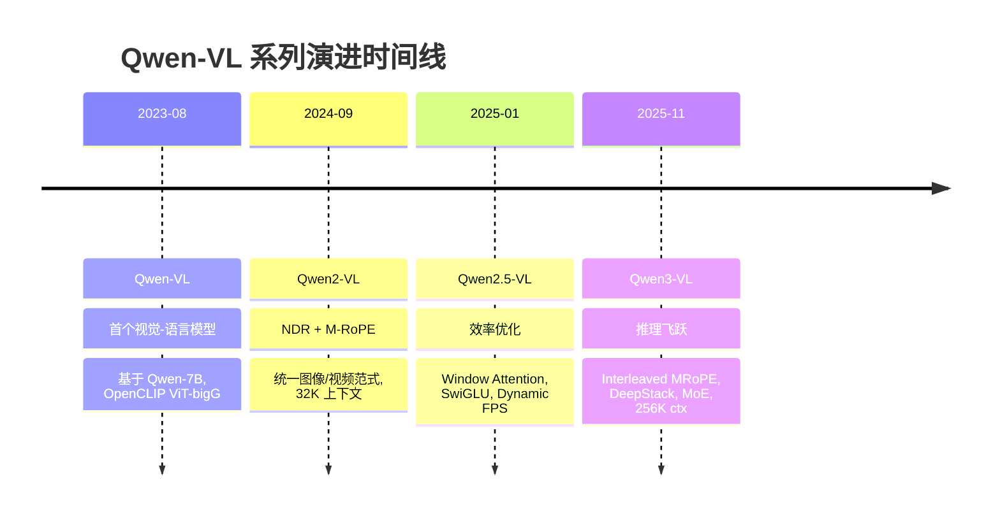

### 关键里程碑

| 代际 | 发布时间 | 核心技术突破 | 上下文长度 | 代表模型 |
|------|---------|-------------|-----------|---------|
| **Qwen-VL** | 2023-08 | OpenCLIP ViT-bigG + Cross-Attention 融合 | 2K | Qwen-VL (9.6B) |
| **Qwen2-VL** | 2024-09 | NDR (Naive Dynamic Resolution), M-RoPE, 统一图像/视频 | 32K | Qwen2-VL (2B/7B/72B) |
| **Qwen2.5-VL** | 2025-01 | Window+Full Attention, SwiGLU/RMSNorm 统一, Dynamic FPS, QwenVL HTML | 32K | Qwen2.5-VL (3B/7B/32B/72B) |
| **Qwen3-VL** | 2025-11 | Interleaved-MRoPE, DeepStack, Text Timestamps, MoE, Thinking Mode | **256K** | Qwen3-VL (2B/4B/8B/32B + 30B-A3B/235B-A22B) |

## 1.2 同系列模型对比

| 模型名称 | 总参数量 | 激活参数 | 架构类型 | 上下文长度 | ViT 规格 | 技术报告 | HuggingFace |
|---------|--------|---------|---------|-----------|---------|---------|------------|
| Qwen-VL | 9.6B | 9.6B | Dense | 2K | OpenCLIP ViT-bigG | — | [Qwen/Qwen-VL](https://huggingface.co/Qwen/Qwen-VL) |
| Qwen2-VL-2B | 2B | 2B | Dense | 32K | 675M ViT | [Paper](https://arxiv.org/abs/2409.12191) | [Qwen/Qwen2-VL-2B](https://huggingface.co/Qwen/Qwen2-VL-2B) |
| Qwen2-VL-7B | 7B | 7B | Dense | 32K | 675M ViT | [Paper](https://arxiv.org/abs/2409.12191) | [Qwen/Qwen2-VL-7B](https://huggingface.co/Qwen/Qwen2-VL-7B) |
| Qwen2.5-VL-7B | 7B | 7B | Dense | 32K | 675M ViT | [Paper](https://arxiv.org/abs/2502.13923) | [Qwen/Qwen2.5-VL-7B](https://huggingface.co/Qwen/Qwen2.5-VL-7B) |
| **Qwen3-VL-2B** | 2B | 2B | Dense | 256K | 24层, 1024d | [Paper](https://arxiv.org/abs/2511.21631) | [Qwen/Qwen3-VL-2B](https://huggingface.co/Qwen/Qwen3-VL-2B-Instruct) |
| **Qwen3-VL-4B** | 4B | 4B | Dense | 256K | 24层, 1024d | [Paper](https://arxiv.org/abs/2511.21631) | [Qwen/Qwen3-VL-4B](https://huggingface.co/Qwen/Qwen3-VL-4B-Instruct) |
| **Qwen3-VL-8B** | 8B | 8B | Dense | 256K | 27层, 1152d | [Paper](https://arxiv.org/abs/2511.21631) | [Qwen/Qwen3-VL-8B](https://huggingface.co/Qwen/Qwen3-VL-8B-Instruct) |
| **Qwen3-VL-32B** | 32B | 32B | Dense | 256K | 27层, 1152d | [Paper](https://arxiv.org/abs/2511.21631) | [Qwen/Qwen3-VL-32B](https://huggingface.co/Qwen/Qwen3-VL-32B-Instruct) |
| **Qwen3-VL-30B-A3B** | 30B | ~3B | MoE (64专家, Top-8) | 256K | 24层, 1024d | [Paper](https://arxiv.org/abs/2511.21631) | [Qwen/Qwen3-VL-30B-A3B](https://huggingface.co/Qwen/Qwen3-VL-30B-A3B-Instruct) |
| **Qwen3-VL-235B-A22B** | 235B | ~22B | MoE (128专家, Top-8) | 256K | 27层, 1152d | [Paper](https://arxiv.org/abs/2511.21631) | [Qwen/Qwen3-VL-235B-A22B](https://huggingface.co/Qwen/Qwen3-VL-235B-A22B-Instruct) |

## 1.3 各代模型能力对比

| 能力维度 | Qwen2-VL | Qwen2.5-VL | Qwen3-VL | 提升幅度 |
|---------|---------|------------|---------|---------|
| 视觉问答 (MMMU, 7B/8B级) | 54.1 | 58.6 | **70.2** | +29.8% |
| 视觉数学 (MathVista) | 58.2 | 68.3 | **79.4** | +36.4% |
| 文档理解 (DocVQA) | 94.5 | 96.4 | **97.1** | +2.8% |
| 视频理解 (Video-MME) | 63.3 | 67.2 | **76.8** | +21.3% |
| 视觉推理 (MathVision) | 16.3 | 19.2 | **38.1** | **+133.7%** |
| 视觉位置编码 | M-RoPE (分段) | M-RoPE (分段) | **Interleaved-MRoPE** | 频谱均衡 |
| ViT特征利用 | 末层 | 末层 | **多层 DeepStack** | 多尺度融合 |
| 视频时间对齐 | 相对帧索引 | T-RoPE | **文本时间戳** | 精确秒级 |
| Thinking 推理模式 | - | - | Thinking/Non-Thinking | 双模式 |

## 1.4 技术报告与论文汇总

| 模型 | 论文/报告 | 链接 |
|------|---------|------|
| Qwen2-VL | Qwen2-VL: Enhancing Vision-Language Model's Perception of the World at Any Resolution | [arXiv:2409.12191](https://arxiv.org/abs/2409.12191) |
| Qwen2.5-VL | Qwen2.5-VL Technical Report | [arXiv:2502.13923](https://arxiv.org/abs/2502.13923) |
| Qwen3-VL | Qwen3-VL Technical Report | [arXiv:2511.21631](https://arxiv.org/abs/2511.21631) |
| DeepStack | DeepStack: Deeply Stacking Visual Tokens is Surprisingly Simple and Effective for LMMs | [arXiv:2406.04334](https://arxiv.org/abs/2406.04334) |
| SigLIP-2 | Sigmoid Loss for Language Image Pre-Training 2 | 多语言/多尺度视觉编码器 |

---

# 第二部分: Qwen3-VL 模型架构详解

## 2.1 整体架构概览

Qwen3-VL 采用经典的 **三模块架构**：

1. **Vision Encoder (ViT)** — 基于 SigLIP-2 的 Vision Transformer，支持动态分辨率
2. **Vision-Language Merger** — MLP 投影层，将 2×2 空间合并的视觉特征投影到 LLM 空间
3. **LLM Backbone** — 基于 Qwen3 的大语言模型，支持 Dense 和 MoE 两种架构

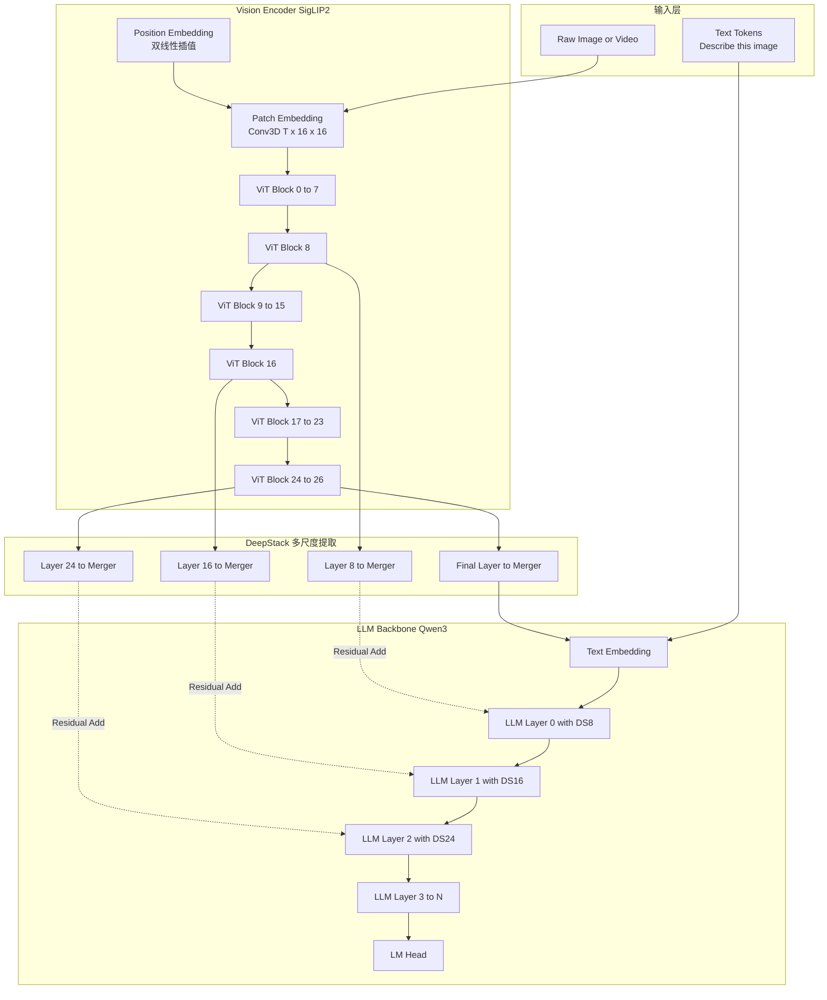

> **关键洞察**: DeepStack 将 ViT 中间层（layers 8, 16, 24）的特征通过独立 Merger 投影后，**直接注入 LLM 前三层的 hidden states**（残差相加），不引入额外 sequence length。这种设计让 LLM 能同时利用浅层的细节特征和深层的语义特征。

## 2.2 核心超参数

### LLM Backbone 超参数

| 参数 | 2B | 4B | 8B | 32B | 说明 |
|------|-----|-----|-----|-----|------|
| Hidden Size | 2048 | 2560 | 4096 | 5120 | 隐藏层维度 |
| Num Layers | 28 | 36 | 36 | 64 | Transformer 层数 |
| Num Attention Heads | 16 | 32 | 32 | 64 | 查询头数 |
| Num KV Heads | 8 | 8 | 8 | 8 | KV 头数 (GQA) |
| Head Dim | 128 | 128 | 128 | 128 | 每头维度 |
| Q:K Ratio | 2:1 | 4:1 | 4:1 | 8:1 | GQA 压缩比 |
| Intermediate Size | 6144 | 9728 | 12288 | 25600 | FFN 中间维度 |
| Vocab Size | 151936 | 151936 | 151936 | 151936 | 词表大小 |
| Max Position Embeddings | 262144 | 262144 | 262144 | 262144 | 最大位置编码 |
| RoPE theta | 5,000,000 | 5,000,000 | 5,000,000 | 5,000,000 | RoPE 基频 |
| Activation | SiLU | SiLU | SiLU | SiLU | 激活函数 |
| Norm Type | RMSNorm | RMSNorm | RMSNorm | RMSNorm | 归一化类型 |

### Vision Encoder 超参数

| 参数 | 2B / 4B | 8B / 32B | 说明 |
|------|---------|---------|------|
| ViT 规格 | SigLIP-2-Large | SigLIP-2-SO | 视觉编码器变体 |
| Depth | 24 | 27 | ViT Transformer 层数 |
| Hidden Size | 1024 | 1152 | ViT 隐藏维度 |
| Num Heads | 16 | 16 | ViT 注意力头数 |
| Head Dim | 64 | 72 | 每头维度 |
| Intermediate Size | 4096 | 4304 | ViT FFN 中间维度 |
| Patch Size | 16×16 | 16×16 | 图像 patch 大小 |
| Temporal Patch Size | 2 | 2 | 视频时间 patch |
| Spatial Merge Size | 2 | 2 | 空间合并因子 (2×2→1 token) |
| Out Hidden Size | 2048 / 2560 | 4096 / 5120 | 投影输出维度 (= LLM hidden) |
| Num Position Embeddings | 2304 | 2304 | 位置编码网格数 (48×48) |
| DeepStack Indexes | [5, 11, 17] | [8, 16, 24] | 多尺度特征提取层 |
| Activation | GeLU (tanh approx) | GeLU (tanh approx) | ViT 激活函数 |
| RoPE in ViT | partial_rotary_factor=0.5 | partial_rotary_factor=0.5 | ViT 内部 RoPE |

## 2.3 Attention 机制详解

### 技术原理: GQA (Grouped-Query Attention)

Qwen3-VL 的 LLM Backbone 使用 **Grouped-Query Attention (GQA)**，不同变体的 Q/KV 头比例不同：

| 变体 | Q Heads | KV Heads | GQA 组大小 |
|------|---------|----------|-----------|
| 2B | 16 | 8 | 2 Q heads / KV |
| 4B | 32 | 8 | 4 Q heads / KV |
| 8B | 32 | 8 | 4 Q heads / KV |
| 32B | 64 | 8 | 8 Q heads / KV |

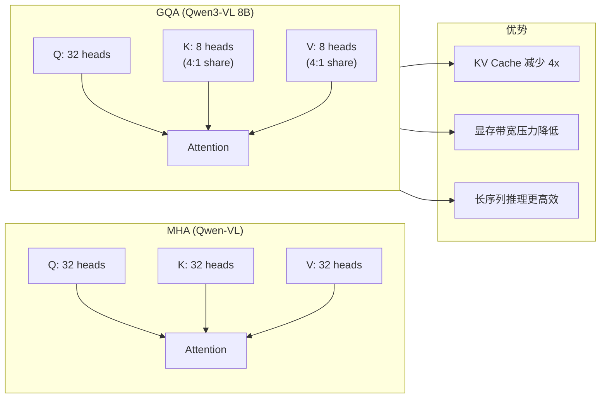

**公式**:

$$\text{Attention}(Q, K, V) = \text{softmax}\left(\frac{QK^T}{\sqrt{d_k}} + \text{Mask}\right)V$$

其中 Q 有 `num_heads` 个头，K/V 各只有 `num_kv_heads` 个头。每个 KV 头被 `num_heads / num_kv_heads` 个 Q 头共享。

**KV Cache 对比**（以 8B 为例，head_dim=128，36 层）：

| 注意力类型 | KV 头数 | 每 Token KV 字节数 (BF16) | 256K 上下文 KV 缓存 |
|-----------|---------|------------------------|-------------------|
| MHA (32Q/32KV) | 32 | 36 × 2 × 32 × 128 × 2 = 576 KB | ~144 GB |
| **GQA (32Q/8KV)** | 8 | 36 × 2 × 8 × 128 × 2 = 144 KB | **~36 GB** |

> **关键洞察**: Qwen3-VL 选择 8 个 KV 头的 GQA 配置，在 256K 超长上下文场景下将 KV 缓存控制在合理范围内，同时保持较好的注意力质量。

### QK-Norm

Qwen3 LLM Backbone 引入了 **QK-Norm**（对 Q 和 K 投影后进行 RMSNorm）：

```python
# 文件: vllm/model_executor/models/qwen3.py
class Qwen3Attention(nn.Module):
    def __init__(self, ...):
        self.q_norm = RMSNorm(self.head_dim, eps=rms_norm_eps)
        self.k_norm = RMSNorm(self.head_dim, eps=rms_norm_eps)
```

QK-Norm 的作用是稳定训练和推理中的注意力分数，尤其在长序列场景下防止 attention logits 漂移。

## 2.4 Position Encoding: Interleaved-MRoPE

### 技术原理

这是 Qwen3-VL 最重要的技术创新之一。传统的 M-RoPE（Qwen2-VL 引入）将位置编码维度分为独立的三个段（T/H/W），导致频谱不均衡。Interleaved-MRoPE 将三维位置信息交错分布到所有频率带上。

**维度分配对比**:

| 方案 | T (时间) | H (高度) | W (宽度) | 频谱分布 |
|------|---------|---------|---------|---------|
| M-RoPE (Qwen2-VL) | dims[0:24] | dims[24:44] | dims[44:64] | 低频偏T，高频偏W |
| **Interleaved-MRoPE** | interleaved | interleaved | interleaved | **三个维度均匀覆盖全频谱** |

**配置参数**: `mrope_section = [24, 20, 20]`，总共 64 维位置编码（对应 head_dim=128，partial_rotary_factor=0.5）。

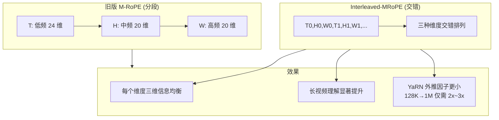

**MRoPE 位置 ID 计算**:

在 vLLM 中，MRoPE 的位置 ID 是一个 `(3, seq_len)` 的张量，分别表示每个 token 在 T、H、W 维度上的位置：

```python
# 文件: vllm/model_executor/models/qwen3_vl.py (Qwen3VLForConditionalGeneration._get_mrope_input_positions)
# 文本 token: 三个维度位置依次递增
text_pos = np.broadcast_to(np.arange(text_len), (3, text_len)) + st_idx

# 视觉 token: H/W 维度使用 2D 网格索引, T 维度对 image 固定为 0
grid_indices = np.indices((1, llm_grid_h, llm_grid_w)).reshape(3, -1)
```

## 2.5 其他关键技术组件

### DeepStack 多尺度视觉特征融合

DeepStack 是 Qwen3-VL 的核心创新之一（详见[第五部分](#第五部分-vit-计算流程)）。简而言之：

- 从 ViT 的 **3 个中间层**（如 8B 模型的 layers 8, 16, 24）提取特征
- 每个提取层通过独立的 `Qwen3_VisionPatchMerger` 投影到 LLM hidden 维度
- 投影后的特征作为 **残差信号直接加到 LLM 前 3 层的 hidden states**
- 最终层特征也通过主 Merger 投影，作为标准 visual tokens 拼接到 text embeddings

### Text-based Video Timestamps

取代 Qwen2.5-VL 的 T-RoPE 绝对时间编码：

| 模型 | 时间编码方式 | 限制 |
|------|------------|------|
| Qwen2-VL | 相对帧索引 (0, 1, 2, ...) | 无法区分 1 秒和 10 秒的区别 |
| Qwen2.5-VL | T-RoPE (sec×10) | 长视频 position ID 变得稀疏 (1小时=T=36000) |
| **Qwen3-VL** | 文本时间戳 Token (`<3.0 seconds>`) | 无限制，秒级精确索引 |

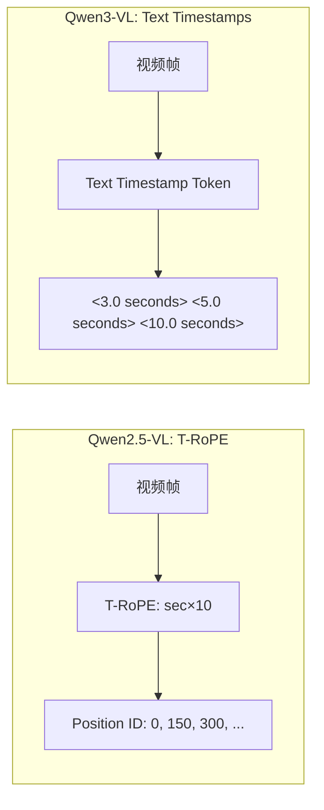

---

# 第三部分: 输入预处理流程

## 3.1 文本预处理

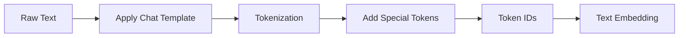

Qwen3-VL 使用与 Qwen3 相同的 tokenizer，词表大小为 151,936，支持多语言。

## 3.2 多模态输入处理

这是 VLM 推理中最复杂的部分。Qwen3-VL 在 vLLM 中的多模态处理采用了 `Qwen3VLMultiModalProcessor`：

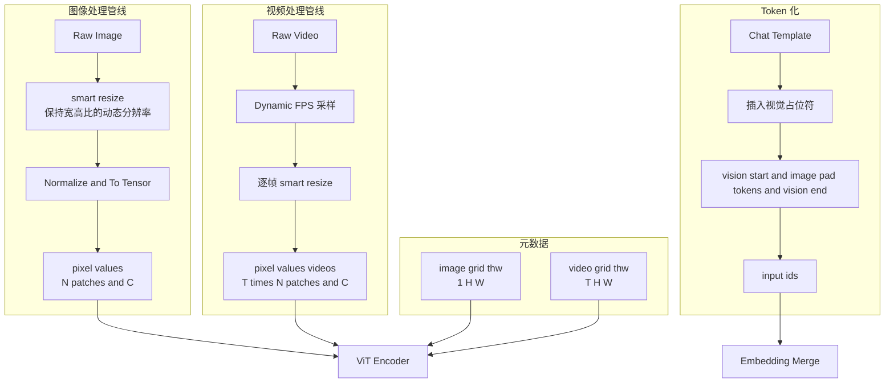

### 动态分辨率（NDR）处理

Qwen3-VL 继承了 Qwen2-VL 的 Naive Dynamic Resolution 策略：

```python
# 文件: vllm/model_executor/models/qwen3_vl.py
from transformers.models.qwen2_vl.image_processing_qwen2_vl import (
    smart_resize as image_smart_resize,
)
```

- **smart_resize**: 在保持原始宽高比的前提下，将图像缩放到 patch_size 的倍数
- **压缩比**: 每 16×16 像素 → 1 个视觉 patch → 经 2×2 spatial merge 后 → 1 个 visual token
- **整体压缩比**: 32× (16×16 → 1 token, 4 patches → 1 token after merge)

例如：1280×1280 图像 → 80×80 = 6400 patches → (80/2)×(80/2) = 40×40 = **200 visual tokens**

## 3.3 Tokenizer 配置

| 配置项 | 值 | 说明 |
|--------|-----|------|
| Tokenizer Type | BPE (Qwen3 tokenizer) | 基于 GPT-4 的 tokenization 方案 |
| Vocab Size | 151,936 | 含多种语言支持 |
| `vision_start_token_id` | 151652 | `<|vision_start|>` |
| `vision_end_token_id` | 151653 | `<|vision_end|>` |
| `image_token_id` | 151655 | `<|image_pad|>` |
| `video_token_id` | 151656 | `<|video_pad|>` |
| `bos_token_id` | 151643 | 序列开始 |
| `eos_token_id` | 151645 | 序列结束 |
| Chat Template | Qwen3 格式 | `role="user"/"assistant"` 交替 |
| Max Context | 262,144 tokens | 原生 256K，通过 YaRN 可扩展至 1M |

---

# 第四部分: 模型前向传播流程

## 4.1 整体 Forward 流程

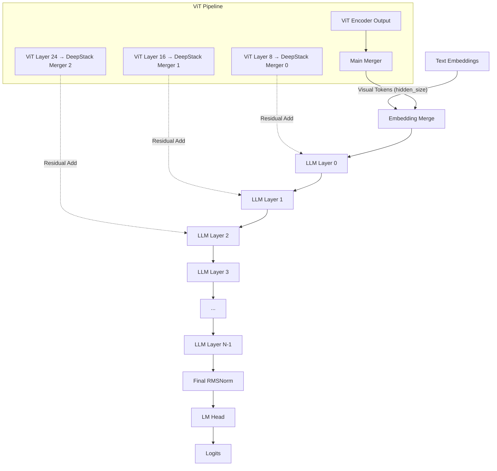

## 4.2 单层 LLM Transformer 计算流程

Qwen3-VL 的 LLM Backbone 层结构：

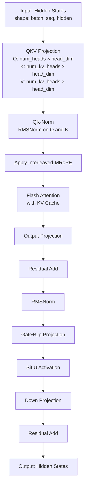

**Step-by-step shapes** (以 Qwen3-VL-8B 为例):

```
Step 1: Input                    [batch, seq, 4096]
Step 2: QKV Projection
  - Q = Linear(4096 → 32×128)    [batch, seq, 4096]
  - K = Linear(4096 → 8×128)     [batch, seq, 1024]
  - V = Linear(4096 → 8×128)     [batch, seq, 1024]
Step 3: QK-Norm
  - Q = RMSNorm(Q, dim=128)
  - K = RMSNorm(K, dim=128)
Step 4: Apply Interleaved-MRoPE  [batch, seq, head_dim]
Step 5: Flash Attention          [batch, seq, 4096]
Step 6: Output Projection        [batch, seq, 4096]
Step 7: Residual Add             [batch, seq, 4096]
Step 8: Gate+Up                  [batch, seq, 12288] × 2
Step 9: SiLU(Up) × Gate          [batch, seq, 12288]
Step 10: Down Projection          [batch, seq, 4096]
Step 11: Residual Add             [batch, seq, 4096]
```

## 4.3 vLLM 中的优化

| 优化技术 | 应用位置 | 效果 |
|---------|---------|------|
| **PagedAttention** | LLM Attention | 内存零碎片，支持 dynamic batching |
| **Flash Attention 2** | LLM + ViT Attention | 减少显存占用，加速长序列推理 |
| **Triton Fused Pos Embed** | ViT 位置编码 | 融合双线性插值，降低 kernel launch 开销 |
| **Chunked Prefill** | LLM Prefill | 将长 prefill 分块处理，降低延迟 |
| **CUDA Graph** | ViT Encoder | 消除 encoder 推理的 launch overhead |
| **FP8 Quantization** | ViT Attention | 降低 ViT 的显存和带宽开销 |
| **Data Parallel ViT** | ViT Encoder | 多 GPU 复制 ViT 权重并行推理 |
| **Prefix Caching** | LLM Prefill | 复用共享前缀的计算 |
| **Encoder TP** | ViT Encoder | 张量并行支持超大规模 ViT |

---

# 第五部分: ViT 计算流程（核心）

> 本章节是本文档的核心内容，深入剖析 Qwen3-VL 中 Vision Transformer 的完整计算流程，包括 Patch Embedding、位置编码插值、ViT Encoder 前向传播、DeepStack 多尺度特征提取、以及 Merger 投影。

## 5.1 ViT 架构概览

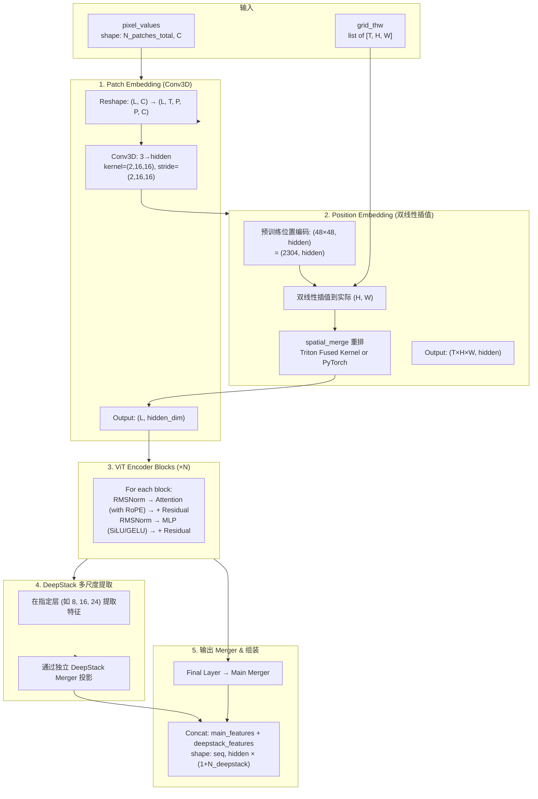

## 5.2 Patch Embedding 详解

Qwen3-VL 使用 **Conv3D** 进行 Patch Embedding，天然支持视频的时间维度：

```python
# 文件: vllm/model_executor/models/qwen3_vl.py
class Qwen3_VisionPatchEmbed(nn.Module):
    def __init__(
        self,
        patch_size: int = 14,         # 实际使用时为 16
        temporal_patch_size: int = 2,  # 时间 patch 大小
        in_channels: int = 3,
        hidden_size: int = 1152,       # ViT hidden dimension
    ) -> None:
        super().__init__()
        self.patch_size = patch_size
        self.temporal_patch_size = temporal_patch_size
        self.hidden_size = hidden_size

        kernel_size = (temporal_patch_size, patch_size, patch_size)  # (2, 16, 16)
        self.proj = Conv3dLayer(
            in_channels,
            hidden_size,
            kernel_size=kernel_size,
            stride=kernel_size,
            bias=True,
        )

    def forward(self, x: torch.Tensor) -> torch.Tensor:
        L, C = x.shape
        # 重排: (L, C) → (L, T, H, W, C)
        # 其中 T=temporal_patch_size, H=W=patch_size
        x = x.view(L, -1, self.temporal_patch_size, self.patch_size, self.patch_size)
        # Conv3D 投影 → (L, hidden_size)
        x = self.proj(x).view(L, self.hidden_size)
        return x
```

**关键细节**:
- 对于**静态图像**: `T=1`, pixel_values 被复制为 `[frame, frame_copy]` 两个时间帧
- 对于**视频**: `T≥2`，每 `temporal_patch_size=2` 个连续帧组成一个 temporal patch
- Conv3D kernel 的 `(2, 16, 16)` 意味着同时聚合 2 帧 × 16×16 空间区域的信息

**形状变化追踪**:

| 阶段 | 图像 (1280×1280) | 视频 (10 frames, 720×720) |
|------|------------------|--------------------------|
| 输入 | `(6400×2, 3)` = `(12800, 3)` | `(20250, 3)` |
| T=2 Patches/帧 | 12800 / 2 = 6400 frames | 20250 / (720/16)² = 10 frames |
| Patch Embed 输出 | `(12800, hidden)` | `(20250, hidden)` |

## 5.3 位置编码：双线性插值

Qwen3-VL 的 ViT 使用**可学习的绝对位置编码**，并通过**双线性插值**适配动态分辨率。这不同于 Qwen2-VL 中使用 RoPE 的方案。

### 核心思想

ViT 在预训练时使用固定的 `num_grid_per_side=48`（即 48×48=2304 个网格位置）。推理时，输入图像分辨率可以任意变化，需要将预训练的位置编码插值到实际网格大小。

```python
# 文件: vllm/model_executor/models/qwen3_vl.py
# 位置编码存储为 (2304, hidden_size) 的可学习参数
self.pos_embed = nn.Embedding(self.num_position_embeddings, self.hidden_size)
self.num_grid_per_side = int(self.num_position_embeddings**0.5)  # 48

def fast_pos_embed_interpolate(self, grid_thw: list[list[int]]) -> torch.Tensor:
    """对每个 (t, h, w) 网格进行双线性插值"""
    interpolate_fn = (
        triton_pos_embed_interpolate if HAS_TRITON else pos_embed_interpolate_native
    )
    outputs = []
    for t, h, w in grid_thw:
        outputs.append(
            interpolate_fn(
                self.pos_embed.weight,  # (2304, hidden)
                t, h, w,                 # 目标网格
                self.num_grid_per_side,  # 48
                self.spatial_merge_size, # 2
                self.dtype,
            )
        )
    return torch.cat(outputs, dim=0)  # → (total_patches, hidden)
```

### Triton Fused Kernel 优化

vLLM 实现了一个 **Triton 加速的双线性插值 + Spatial Merge** 融合 kernel，将原本需要多次 PyTorch kernel launch 的操作合并为一次：

```python
# 文件: vllm/model_executor/models/qwen3_vl.py
@triton.jit
def _bilinear_pos_embed_kernel(
    embed_ptr,      # 原始位置编码 (2304, hidden_dim)
    output_ptr,     # 输出插值后的位置编码
    H, W,           # 目标网格大小
    h_scale, w_scale,  # 插值缩放因子
    NUM_GRID: tl.constexpr,  # 48
    M_SIZE: tl.constexpr,    # spatial_merge_size = 2
    HIDDEN_DIM: tl.constexpr,
    BLOCK_D: tl.constexpr,
):
    """融合双线性插值 + spatial-merge 重排"""
    pid = tl.program_id(0)
    total_spatial = H * W
    spatial_idx = pid % total_spatial

    # 计算在 spatial_merge 后的 block 坐标
    num_blocks_w = W // M_SIZE
    block_idx = spatial_idx // (M_SIZE * M_SIZE)
    local_idx = spatial_idx % (M_SIZE * M_SIZE)
    br = block_idx // num_blocks_w
    bc = block_idx % num_blocks_w
    lr = local_idx // M_SIZE
    lc = local_idx % M_SIZE
    row = br * M_SIZE + lr
    col = bc * M_SIZE + lc

    # 计算双线性插值的分数坐标
    h_frac = row.to(tl.float32) * h_scale
    w_frac = col.to(tl.float32) * w_scale
    hf = tl.math.floor(h_frac).to(tl.int32)
    wf = tl.math.floor(w_frac).to(tl.int32)
    hc = tl.minimum(hf + 1, NUM_GRID - 1)
    wc = tl.minimum(wf + 1, NUM_GRID - 1)

    # 计算四个插值权重
    dh = h_frac - hf.to(tl.float32)
    dw = w_frac - wf.to(tl.float32)
    w11 = dh * dw
    w10 = dh - w11
    w01 = dw - w11
    w00 = 1.0 - dh - w01

    # 从预训练位置编码中双线性采样 + spatial-merge 重排输出
    ...
```

> **性能提升**: Triton fused kernel 消除了 PyTorch eager 模式下的多次小 kernel launch，在大批量图像推理时可将位置编码计算延迟降低 30-50%。

### 双线性插值数学原理

对于实际网格中位置 `(h, w)` 处的位置编码，通过以下公式插值计算：

$$\text{PosEmbed}(h, w) = \sum_{i \in \{f, c\}} \sum_{j \in \{f, c\}} \alpha_i \cdot \alpha_j \cdot \text{PosEmbed}_{\text{pretrained}}(h_i, w_j)$$

其中：
- `(h_f, w_f)` 和 `(h_c, w_c)` 分别是 `(h, w)` 映射到预训练 48×48 网格上后的 floor 和 ceil 坐标
- `α_h = h - h_f`, `α_w = w - w_f` 是分数部分

## 5.4 ViT Encoder 计算流程

### ViT Block 结构

每个 ViT Block 的结构与标准 Transformer 类似，但针对视觉任务做了定制：

```python
# 文件: vllm/model_executor/models/qwen3_vl.py
class Qwen3_VisionBlock(nn.Module):
    def __init__(self, dim, num_heads, mlp_hidden_dim, ...):
        self.norm1 = nn.LayerNorm(dim, eps=1e-6)
        self.norm2 = nn.LayerNorm(dim, eps=1e-6)
        self.attn = Qwen2_5_VisionAttention(
            embed_dim=dim,
            num_heads=num_heads,
            projection_size=dim,
        )
        self.mlp = Qwen3_VisionMLP(dim, mlp_hidden_dim, act_fn=SiLU/GELU)

    def forward(self, x, cu_seqlens, rotary_pos_emb_cos, rotary_pos_emb_sin, ...):
        # 1. Self-Attention with RoPE + Pre-Norm + Residual
        x = x + self.attn(
            self.norm1(x),
            cu_seqlens=cu_seqlens,
            rotary_pos_emb_cos=rotary_pos_emb_cos,
            rotary_pos_emb_sin=rotary_pos_emb_sin,
            max_seqlen=max_seqlen,
            sequence_lengths=sequence_lengths,
        )
        # 2. MLP with Pre-Norm + Residual
        x = x + self.mlp(self.norm2(x))
        return x
```

### ViT Attention: MMEncoderAttention with RoPE

ViT 内的 Attention 使用 vLLM 的 `MMEncoderAttention`，支持多种后端：

```python
# 文件: vllm/model_executor/models/qwen2_5_vl.py
class Qwen2_5_VisionAttention(nn.Module):
    def __init__(self, embed_dim, num_heads, projection_size, ...):
        self.qkv = QKVParallelLinear(
            hidden_size=embed_dim,
            head_size=head_dim,
            total_num_heads=num_heads,      # 16
            total_num_kv_heads=num_heads,   # MHA (Q=KV=16)
            bias=True,
        )
        self.attn = MMEncoderAttention(...)  # Vision-specific attention
        self.proj = RowParallelLinear(...)
```

**关键区别**: ViT 使用 **MHA**（所有 Q/KV 头数相同），与 LLM 的 GQA 不同。这是因为 ViT 的特征维度较小，不需要 GQA 的显存优化。

**ViT 内 RoPE**: 使用 `partial_rotary_factor=0.5`，即只对一半维度应用旋转位置编码。这与 Qwen2.5-VL 一致。

```python
# 文件: vllm/model_executor/models/qwen3_vl.py
self.rotary_pos_emb = get_rope(
    head_size=head_dim,
    max_position=8192,
    is_neox_style=True,
    rope_parameters={"partial_rotary_factor": 0.5},
)
```

### 完整 ViT Forward Pass

```python
# 文件: vllm/model_executor/models/qwen3_vl.py
class Qwen3_VisionTransformer(nn.Module):
    def forward(
        self,
        x: torch.Tensor,       # pixel_values: (total_patches, C)
        grid_thw,               # [(t1,h1,w1), (t2,h2,w2), ...]
        encoder_metadata=None,
    ) -> torch.Tensor:
        # Step 1: Patch Embedding
        hidden_states = x.to(device=self.device, dtype=self.dtype)
        hidden_states = self.patch_embed(hidden_states)  # (L, hidden)

        # Step 2: 添加位置编码 (双线性插值后的)
        pos_embeds = self.fast_pos_embed_interpolate(grid_thw_list)
        hidden_states = hidden_states + pos_embeds

        # Step 3: Unsqueeze 为 MMEncoderAttention 兼容格式
        hidden_states = hidden_states.unsqueeze(1)  # (L, 1, hidden)

        # Step 4: 逐层 ViT Block + DeepStack 特征提取
        deepstack_feature_lists = []
        for layer_num, blk in enumerate(self.blocks):
            hidden_states = blk(
                hidden_states,
                cu_seqlens=...,
                rotary_pos_emb_cos=...,
                rotary_pos_emb_sin=...,
                max_seqlen=...,
                sequence_lengths=...,
            )
            # DeepStack: 在指定层提取并投影特征
            if layer_num in self.deepstack_visual_indexes:
                merger_idx = self.deepstack_visual_indexes.index(layer_num)
                ds_feat = self.deepstack_merger_list[merger_idx](hidden_states)
                deepstack_feature_lists.append(ds_feat)

        # Step 5: 最终层特征通过主 Merger
        hidden_states = self.merger(hidden_states)

        # Step 6: 拼接主特征和 DeepStack 特征
        # shape: (seq_len, hidden_size * (1 + 3))
        hidden_states = torch.cat(
            [hidden_states] + deepstack_feature_lists, dim=1
        )
        return hidden_states
```

**形状变化完整追踪（以 Qwen3-VL-8B + 1280×1280 图像为例）**:

| 步骤 | 操作 | 输入形状 | 输出形状 |
|------|------|---------|---------|
| Patch Embed | Conv3D (2,16,16) | `(12800, 3)` | `(12800, 1152)` |
| Pos Embed | 双线性插值 | `(2304, 1152)` | `(12800, 1152)` |
| Add | Res + PosEmb | — | `(12800, 1152)` |
| Unsqueeze | 适配 encoder | `(12800, 1152)` | `(12800, 1, 1152)` |
| 27× ViT Blocks | Self-Attn + MLP | `(12800, 1, 1152)` | `(12800, 1, 1152)` |
| Layer 8 提取 | DeepStack Merger[0] | `(12800, 1, 1152)` | `(12800, 4096)` |
| Layer 16 提取 | DeepStack Merger[1] | `(12800, 1, 1152)` | `(12800, 4096)` |
| Layer 24 提取 | DeepStack Merger[2] | `(12800, 1, 1152)` | `(12800, 4096)` |
| Final Main Merger | 空间合并 2×2 + MLP | `(12800, 1, 1152)` | `(3200, 4096)` |
| Concat | 拼接四路特征 | — | `(3200, 16384)` |

## 5.5 DeepStack 多尺度特征融合

### 整体流程

DeepStack 是 Qwen3-VL 最核心的创新之一，它解决了传统 VLM 只使用 ViT 末层特征导致的细粒度信息丢失问题：

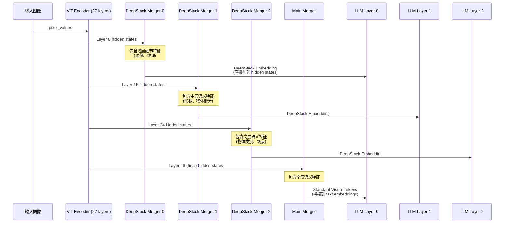

### DeepStack Merger 实现

DeepStack Merger 与主 Merger 结构相同，但使用 `use_postshuffle_norm=True`：

```python
# 文件: vllm/model_executor/models/qwen3_vl.py
class Qwen3_VisionPatchMerger(nn.Module):
    def __init__(
        self,
        d_model: int,                # LLM hidden_size (4096 / 5120)
        context_dim: int,            # ViT hidden_size (1024 / 1152)
        spatial_merge_size: int = 2, # 2×2 spatial merge
        use_postshuffle_norm: bool = False,  # DeepStack Merger 使用
        ...
    ):
        # 输入: spatial_merge_size^2 个相邻 patch 的特征拼接
        self.hidden_size = context_dim * (spatial_merge_size**2)
        # 例如: 1152 × 4 = 4608

        self.norm = nn.LayerNorm(...)
        self.linear_fc1 = Linear(self.hidden_size → self.hidden_size)  # 4608 → 4608
        self.act_fn = nn.GELU()
        self.linear_fc2 = Linear(self.hidden_size → d_model)           # 4608 → 4096

    def forward(self, x: torch.Tensor) -> torch.Tensor:
        # 将 2×2 相邻 patch 的特征拼接 → MLP 投影
        x = self.norm(x).view(-1, self.hidden_size)  # (N/4, hidden_dim × 4)
        x = self.linear_fc1(x)                        # (N/4, hidden_dim × 4)
        x = self.act_fn(x)                            # GELU
        out = self.linear_fc2(x)                      # (N/4, d_model)
        return out
```

**Spatial Merge 的物理意义**:
- 将原始图像网格中相邻 2×2 的 4 个 patch 合并为 1 个 visual token
- 输入: 80×80 patches (1280/16 = 80)
- 合并后: 40×40 = 1600 visual tokens
- 合并后每个 visual token 覆盖原始图像中 32×32 像素的区域

### 特征注入 LLM 的方式

```python
# 文件: vllm/model_executor/models/qwen3_vl.py (Qwen3VLForConditionalGeneration)
def embed_input_ids(self, input_ids, multimodal_embeddings, is_multimodal):
    # 1. 文本 embedding
    inputs_embeds = self._embed_text_input_ids(input_ids, ...)

    if self.use_deepstack:
        # 2. 拆分 multimodal_embeddings → main + deepstack
        # multimodal_embeddings 的维度是:
        # out_hidden_size * (1 + len(deepstack_indexes)) = 4096 * 4
        multimodal_embeddings_main, multimodal_embeddings_multiscale = torch.split(
            multimodal_embeddings_cat,
            [self.visual_dim, self.multiscale_dim],  # [4096, 4096*3]
            dim=-1,
        )

        # 3. DeepStack embeddings 被整理为 (3, seq, visual_dim)
        deepstack_input_embeds = ...   # → (3, seq, 4096)

        # 4. Main visual tokens 与 text embeddings 拼接
        inputs_embeds = _merge_multimodal_embeddings(
            inputs_embeds=inputs_embeds,
            multimodal_embeddings=multimodal_embeddings_main,
            is_multimodal=is_multimodal,
        )

        # 5. DeepStack embeddings 作为残差注入 LLM 前 3 层
        self._set_deepstack_input_embeds(deepstack_input_embeds)

    return inputs_embeds
```

LLM 的 forward pass 中注入 DeepStack 特征：

```python
# 文件: vllm/model_executor/models/qwen3.py (Qwen3Model.forward)
for layer_idx, layer in enumerate(self.layers):
    hidden_states, residual = layer(positions, hidden_states, residual)

    # DeepStack 注入: 在第 0, 1, 2 层分别加上 ViT 中间层的投影特征
    if deepstack_input_embeds is not None and layer_idx < len(deepstack_input_embeds):
        hidden_states = (
            hidden_states
            + deepstack_input_embeds[f"deepstack_input_embeds_{layer_idx}"]
        )
```

### DeepStack 不同层特征的作用

| ViT 层 | 特征层级 | 包含信息 | 注入 LLM 层 | 贡献 |
|--------|---------|---------|------------|------|
| Layer 8 (2B/4B: L5) | 浅层 | 边缘、纹理、局部颜色 | Layer 0 | 增强细粒度视觉细节感知 |
| Layer 16 (2B/4B: L11) | 中层 | 形状、部件、空间关系 | Layer 1 | 增强物体结构理解 |
| Layer 24 (2B/4B: L17) | 高层 | 语义类别、场景上下文 | Layer 2 | 增强视觉语义对齐 |

> **关键洞察**: DeepStack 的巧妙之处在于它**不增加 context length**。传统的做法（如 LLaVA-NeXT）是将多尺度特征作为额外的 visual tokens 拼接到序列中，消耗宝贵的上下文窗口。而 DeepStack 通过残差注入到 LLM 层的 hidden states，在不牺牲 KV Cache 的前提下提供了多尺度信息。

## 5.6 视觉-语言融合策略

Qwen3-VL 采用 **双重融合** 策略：

### 策略对比

| 融合方式 | 机制 | 信息流 | Context 开销 |
|---------|------|--------|-------------|
| **Standard Visual Tokens** | ViT → Main Merger → 拼接到 text embeddings | 标准 visual tokens | 占用 N 个 token 位置 |
| **DeepStack Injection** | ViT → DeepStack Merger → 残差加到 LLM hidden states | 多尺度特征 | **零开销** |

### 最终 Embedding 布局

```
[text_0, ..., text_k, <vision_start>, visual_0, ..., visual_N, <vision_end>, ..., text_m]

visual_i 的 embedding = MainMerger(ViT_final[spatial_merge_index(i)])
                       + DeepStack signals injected at LLM layers 0/1/2
```

---

# 第六部分: vLLM 中的代码实现

## 6.1 模型注册与配置

```python
# 文件: vllm/model_executor/models/qwen3_vl.py
@MULTIMODAL_REGISTRY.register_multimodal_processor(
    Qwen3VLMultiModalProcessor,
    processing_info=Qwen3VLProcessingInfo,
    dummy_inputs=Qwen3VLDummyInputsBuilder,
)
class Qwen3VLForConditionalGeneration(
    nn.Module,
    SupportsMultiModal,
    SupportsEncoderCudaGraph,
    SupportsLoRA,
    SupportsPP,
    SupportsMRoPE,
    SupportsEagle,
    SupportsEagle3,
    SupportsMultiModalPruning,
):
    ...
```

模型通过 `MULTIMODAL_REGISTRY` 注册，启用以下能力：
- **Pipeline Parallelism (SupportsPP)**: 支持多 GPU 流水线并行
- **MRoPE (SupportsMRoPE)**: 支持多模态旋转位置编码
- **Eagle/Eagle3**: 支持投机解码加速
- **Encoder CUDA Graph**: ViT encoder 支持 CUDA Graph 加速
- **MultiModal Pruning**: 支持视频 token 剪枝 (EVS)

## 6.2 核心类层次结构

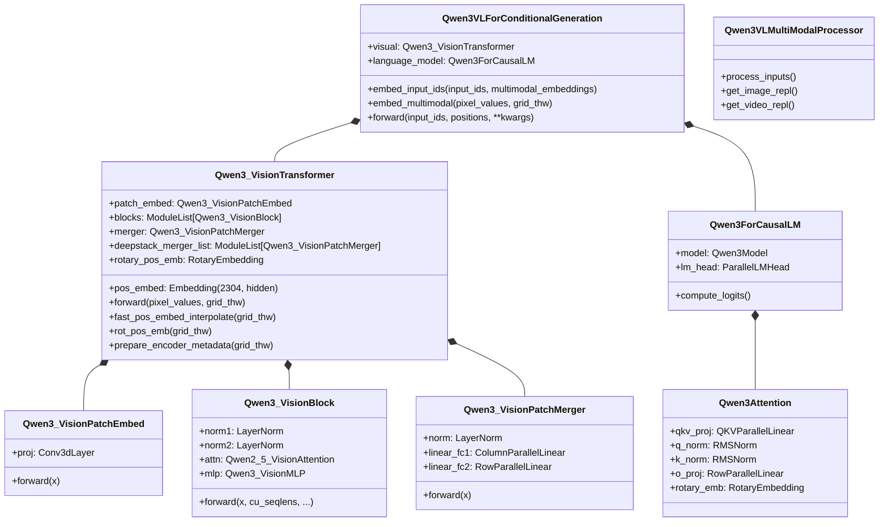

## 6.3 关键计算流程代码分析

### 完整推理流程

```python
# 文件: vllm/model_executor/models/qwen3_vl.py
# ===== Qwen3VLForConditionalGeneration.forward =====

def forward(
    self,
    input_ids: torch.Tensor | None,
    positions: torch.Tensor,       # shape: (3, seq_len) for MRoPE
    intermediate_tensors: IntermediateTensors | None = None,
    inputs_embeds: torch.Tensor | None = None,
    **kwargs,                      # pixel_values, image_grid_thw, etc.
) -> torch.Tensor | IntermediateTensors:

    # Step 1: 如果提供了 inputs_embeds（已包含视觉特征），直接使用
    if intermediate_tensors is not None:
        inputs_embeds = None

    # Step 2: 处理 DeepStack embeddings (如果是第一次迭代)
    if inputs_embeds is not None and get_pp_group().is_first_rank:
        deepstack_input_embeds = self._get_deepstack_input_embeds(
            inputs_embeds.size(0)
        )
    else:
        deepstack_input_embeds = None

    # Step 3: LLM forward pass
    hidden_states = self.language_model.model(
        input_ids=input_ids,
        positions=positions,
        intermediate_tensors=intermediate_tensors,
        inputs_embeds=inputs_embeds,
        deepstack_input_embeds=deepstack_input_embeds,  # DeepStack!
    )

    return hidden_states
```

### 多模态 Embedding 计算流程

```python
def embed_multimodal(self, **kwargs) -> MultiModalEmbeddings | None:
    """计算图像/视频的多模态 embedding"""

    # 1. 解析输入：区分 image 和 video
    mm_input_by_modality = self._parse_and_validate_multimodal_inputs(**kwargs)

    multimodal_embeddings = []

    for modality in mm_input_by_modality:
        if modality == "image":
            # 2. 处理图像：ViT forward → 应用 EVS 后处理
            image_embeddings = self._process_image_input(multimodal_input)
            image_embeddings = self._postprocess_image_embeds_evs(
                image_embeddings, multimodal_input
            )
            multimodal_embeddings.extend(image_embeddings)

        if modality == "video":
            # 3. 处理视频：ViT forward → 可选的 token 剪枝
            video_embeddings = self._process_video_input(multimodal_input)
            if self.is_multimodal_pruning_enabled:
                video_embeddings = self._postprocess_video_embeds_evs(
                    video_embeddings, multimodal_input
                )
            multimodal_embeddings.extend(video_embeddings)

    return tuple(multimodal_embeddings)

def _process_image_input(self, image_input) -> list[torch.Tensor]:
    """图像通过 ViT Forward"""
    pixel_values = image_input["pixel_values"]
    grid_thw = image_input["image_grid_thw"]
    return self.visual(pixel_values, grid_thw=grid_thw)
```

### MRoPE Position 重新计算

```python
def recompute_mrope_positions(
    self,
    input_ids: list[int],
    multimodal_embeddings: MultiModalEmbeddings,
    mrope_positions: torch.LongTensor,
    num_computed_tokens: int,
) -> tuple[MultiModalEmbeddings, torch.Tensor, int]:
    """
    当媒体 token 被剪枝后，需要重新计算 MRoPE 位置 ID。

    Qwen3-VL 的每个 multimodal embedding 包含两部分:
    - 前 hidden_size 维: 视觉特征
    - 后 5 维: 位置元信息 (t, h, w, is_vision_start, is_video)
    """
    mm_embeddings_out = []
    mm_embeddings_pos = []
    for mm in multimodal_embeddings:
        if mm.shape[0] > 0:
            mm_embeddings_out.append(mm[:, :-5])       # 特征部分
            mm_embeddings_pos.append(mm[:, -5:].permute(1, 0).long())  # 位置部分
        else:
            mm_embeddings_out.append(mm)
            mm_embeddings_pos.append(
                torch.empty(5, 0, device=device, dtype=torch.long)
            )

    # 调用通用的 mrope 位置重新计算函数
    positions, mrope_positions_delta = recompute_mrope_positions(
        input_ids_t,
        mm_embeddings_pos,
        mrope_positions,
        num_computed_tokens,
        vision_start_token_id,
        image_token_id,
        video_token_id,
    )
    return tuple(mm_embeddings_out), positions, mrope_positions_delta
```

## 6.4 vLLM 特有优化

### 1. Triton 融合位置编码 Kernel

```python
# 文件: vllm/model_executor/models/qwen3_vl.py
# 用 Triton 实现双线性插值 + spatial merge 的融合算子
# 替代原来的多步 PyTorch 操作: linspace + meshgrid + index + weighted sum + reshape + permute
# 优势: 单次 kernel launch, 减少 GPU 全局内存往返
```

### 2. Encoder CUDA Graph

```python
# ViT encoder 支持 CUDA Graph 捕获/重放
# 见 SupportsEncoderCudaGraph 接口
# 在 prefill 阶段消除 ViT encoder 的 kernel launch overhead
```

### 3. FP8 量化支持（ViT Attention）

```python
# 文件: vllm/model_executor/models/qwen3_vl.py
# FP8 padded hidden size 处理，确保量化后 Q/K/V 为独立连续张量
self.fp8_padded_hidden_size = get_fp8_padded_hidden_size(
    self.num_heads, head_dim
)
```

### 4. Data Parallel ViT

当使用多 GPU 时，ViT 可以配置为 data parallel 模式（而非 tensor parallel），降低通信开销：

```python
use_data_parallel = is_vit_use_data_parallel()
# 所有 ViT 线性层使用 disable_tp=use_data_parallel
```

### 5. EVS (Efficient Video Sampling)

```python
# 视频 token 剪枝：根据 video_pruning_rate 自适应减少视频 token 数量
# 通过 SupportsMultiModalPruning 接口支持
self.video_pruning_rate = multimodal_config.video_pruning_rate
```

### 6. Weight Loading 映射

```python
# 自动处理 HF checkpoint 到 vLLM 内部结构的权重映射
hf_to_vllm_mapper = WeightsMapper(
    orig_to_new_prefix={
        "model.visual.": "visual.",
        "lm_head.": "language_model.lm_head.",
        "model.language_model.": "language_model.model.",
    }
)
```

---

# 附录

## A. 关键代码位置索引

| 组件 | 文件路径 | 关键类/函数 |
|------|---------|------------|
| 模型入口 (Dense) | `vllm/model_executor/models/qwen3_vl.py` | `Qwen3VLForConditionalGeneration` |
| 模型入口 (MoE) | `vllm/model_executor/models/qwen3_vl_moe.py` | `Qwen3VLMoeForConditionalGeneration` |
| ViT 编码器 | `vllm/model_executor/models/qwen3_vl.py` | `Qwen3_VisionTransformer` |
| ViT Block | `vllm/model_executor/models/qwen3_vl.py` | `Qwen3_VisionBlock` |
| ViT Attention | `vllm/model_executor/models/qwen2_5_vl.py` | `Qwen2_5_VisionAttention` |
| ViT MLP | `vllm/model_executor/models/qwen3_vl.py` | `Qwen3_VisionMLP` |
| ViT Patch Embed | `vllm/model_executor/models/qwen3_vl.py` | `Qwen3_VisionPatchEmbed` |
| ViT Patch Merger | `vllm/model_executor/models/qwen3_vl.py` | `Qwen3_VisionPatchMerger` |
| 位置编码插值 | `vllm/model_executor/models/qwen3_vl.py` | `triton_pos_embed_interpolate`, `pos_embed_interpolate_native` |
| 多模态处理器 | `vllm/model_executor/models/qwen3_vl.py` | `Qwen3VLMultiModalProcessor` |
| LLM Backbone | `vllm/model_executor/models/qwen3.py` | `Qwen3ForCausalLM`, `Qwen3Model` |
| LLM Attention | `vllm/model_executor/models/qwen3.py` | `Qwen3Attention` (含 QK-Norm) |
| LLM MoE | `vllm/model_executor/models/qwen3_moe.py` | `Qwen3MoeSparseMoeBlock` |
| MRoPE 工具 | `vllm/multimodal/evs.py` | `compute_mrope_for_media`, `recompute_mrope_positions` |
| 多模态输入处理 | `vllm/multimodal/inputs.py` | `MultiModalFeatureSpec`, `MultiModalKwargsItems` |
| Encoder CudaGraph | `vllm/model_executor/models/qwen3_vl.py` | `SupportsEncoderCudaGraph` |
| Transformers Config | `transformers.models.qwen3_vl.configuration_qwen3_vl` | `Qwen3VLConfig`, `Qwen3VLVisionConfig` |

## B. 术语表

| 术语 | 英文 | 说明 |
|------|------|------|
| 视觉语言模型 | VLM | Vision-Language Model |
| 视觉Transformer | ViT | Vision Transformer |
| 分组查询注意力 | GQA | Grouped-Query Attention |
| 多头注意力 | MHA | Multi-Head Attention |
| 多模态旋转位置编码 | MRoPE | Multimodal Rotary Position Embedding |
| 动态分辨率 | NDR | Naive Dynamic Resolution |
| 键值缓存 | KV Cache | Key-Value Cache |
| 前馈网络 | FFN | Feed-Forward Network |
| 混合专家 | MoE | Mixture of Experts |
| 均方根归一化 | RMSNorm | Root Mean Square Layer Normalization |
| 张量并行 | TP | Tensor Parallelism |
| 流水线并行 | PP | Pipeline Parallelism |
| 投机解码 | Eagle | Extrapolation Algorithm for Greater Language-model Efficiency |
| 高效视频采样 | EVS | Efficient Video Sampling |
| 双线性插值 | Bilinear Interpolation | 用四个最近邻点的加权平均估计目标位置的值 |
| 跳跃连接 | Residual Connection | 将输入直接加到层输出的短路连接 |

## C. Qwen3-VL 变体超参数速查表

| 参数 | 2B | 4B | 8B | 32B | 30B-A3B | 235B-A22B |
|------|-----|-----|-----|-----|---------|-----------|
| **LLM** | | | | | | |
| hidden_size | 2048 | 2560 | 4096 | 5120 | 2560 | 4096 |
| num_layers | 28 | 36 | 36 | 64 | 48 | 96 |
| num_attn_heads | 16 | 32 | 32 | 64 | 32 | 64 |
| num_kv_heads | 8 | 8 | 8 | 8 | 8 | 8 |
| intermediate_size | 6144 | 9728 | 12288 | 25600 | 9728 | 12288 |
| **ViT** | | | | | | |
| depth | 24 | 24 | 27 | 27 | 24 | 27 |
| hidden_size | 1024 | 1024 | 1152 | 1152 | 1024 | 1152 |
| num_heads | 16 | 16 | 16 | 16 | 16 | 16 |
| intermediate_size | 4096 | 4096 | 4304 | 4304 | 4096 | 4304 |
| out_hidden_size | 2048 | 2560 | 4096 | 5120 | 2560 | 4096 |
| DeepStack | [5,11,17] | [5,11,17] | [8,16,24] | [8,16,24] | [5,11,17] | [8,16,24] |
| **MoE** | | | | | | |
| 总专家数 | — | — | — | — | 64 | 128 |
| 激活专家数 | — | — | — | — | 8 | 8 |

## D. 参考资料

- [Qwen3-VL Technical Report (arXiv: 2511.21631)](https://arxiv.org/abs/2511.21631)
- [Qwen2-VL Technical Report (arXiv: 2409.12191)](https://arxiv.org/abs/2409.12191)
- [Qwen2.5-VL Technical Report (arXiv: 2502.13923)](https://arxiv.org/abs/2502.13923)
- [DeepStack Paper (arXiv: 2406.04334)](https://arxiv.org/abs/2406.04334)
- [vLLM Qwen3-VL 源码](https://github.com/vllm-project/vllm/blob/main/vllm/model_executor/models/qwen3_vl.py)
- [vLLM Qwen3-VL-MoE 源码](https://github.com/vllm-project/vllm/blob/main/vllm/model_executor/models/qwen3_vl_moe.py)
- [vLLM Qwen3 LLM 源码](https://github.com/vllm-project/vllm/blob/main/vllm/model_executor/models/qwen3.py)
- [HuggingFace Qwen3-VL 文档](https://huggingface.co/docs/transformers/model_doc/qwen3_vl)
- [LLM Architecture Gallery](https://sebastianraschka.com/llm-architecture-gallery/)
- [QwenLM GitHub](https://github.com/QwenLM/Qwen3-VL)
