# vLLM Step3-VL 模型技术教程

> **文档版本**: 1.0
> **分析代码版本**: vLLM main 分支（截至 2025-12）
> **最后更新**: 2026-05-17
> **模型系列**: Step3 (StepFun / 阶跃星辰)
> **模型类型**: VLM-MoE (多模态 MoE 大模型)
> **总参数量**: 321B (VLM) / 316B (LLM)
> **激活参数**: 38B/token

---

## 文档概述

本文档深入剖析 Step3-VL 模型的技术架构和 vLLM 中的代码实现。Step3-VL 是阶跃星辰（StepFun）推出的旗舰级多模态推理大模型，以其独特的 **MFA（Multi-Matrix Factorization Attention）** 注意力机制和 **AFD（Attention-FFN Disaggregation）** 系统设计在推理效率和成本控制上实现了突破。

**目标读者**: 对 vLLM 模型实现感兴趣的算法工程师、系统工程师、研究者。

**推荐阅读顺序**: 
- 初级读者：第一部分（系列概述）→ 第二部分（架构概览）→ 第六部分（代码实现）
- 高级读者：第二部分（MFA/MoE 技术原理）→ 第四部分（前向传播）→ 第五部分（ViT）

---

# 第一部分: Step3 模型系列概述与演进

## 1.1 模型系列发展历史

Step3 是阶跃星辰（StepFun）推出的第三代大模型系列，由 Step-1（文本）→ Step-1V（多模态）→ Step-2（MoE）→ Step3（MoE + VLM）逐步演进而来。

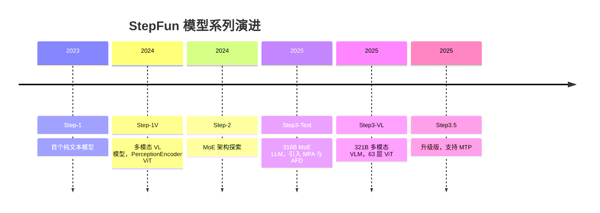

## 1.2 同系列模型对比

| 模型名称 | 参数量 | 模型类型 | 核心创新 | ViT | 注意力机制 | MoE | HuggingFace | ModelScope |
|---------|--------|---------|---------|-----|-----------|-----|------------|------------|
| Step-1 | — | Dense LLM | 首个文本模型 | — | MHA | — | — | — |
| Step-1V (step_vl) | — | VLM | PerceptionEncoder RoPE 2D ViT | RoPE 2D ViT | MHA | — | — | — |
| Step3-Text | 316B | MoE LLM | MFA + AFD + 共享专家 | — | MFA (1 KV head) | 48E × top-3 | [HF](https://huggingface.co/stepfun-ai/step3) | [MS](https://www.modelscope.cn/models/stepfun-ai/step3) |
| **Step3-VL** | **321B** | **VLM-MoE** | **63 层 ViT + MFA + MoE** | **63 层 ViT** | **MFA (1 KV head)** | **48E × top-3** | [HF](https://huggingface.co/stepfun-ai/step3) | [MS](https://www.modelscope.cn/models/stepfun-ai/step3) |
| Step3.5 | 300B+ | MoE LLM | MTP 多 Token 预测 | — | MFA | 48E × top-3 | — | — |
| Step3.5-MTP | 300B+ | MoE LLM | Flash MTP 加速 | — | MFA | 48E × top-3 | — | — |

## 1.3 各模型能力对比

| 能力维度 | Step-1V (step_vl) | Step3-VL |
|---------|-------------------|----------|
| 语言理解 | 基础 | 高级推理 |
| 多模态支持 | 图像 | 图像（高分辨率） |
| ViT Encoder | PerceptionEncoder + RoPE 2D | 63 层标准 ViT + 绝对位置编码 |
| ViT 下采样 | Conv stride 下采样 | 双 Conv 级联 + Linear 投影 |
| 推理效率 | 标准 | MFA 极致 KV Cache 压缩 |
| 分布式部署 | 标准 TP/DP | AFD 注意力-FFN 分离部署 |
| 上下文长度 | — | 65536 tokens |

## 1.4 技术报告与论文汇总

| 文档 | 链接 | 说明 |
|------|------|------|
| Step3 System Tech Report | [arXiv 2507.19427](https://arxiv.org/abs/2507.19427) | 系统架构、MFA、AFD 详解 |
| Step3 Blog | [stepfun.ai/research/step3](https://stepfun.ai/research/step3) | 官方博客介绍 |
| Step3 GitHub | [github.com/stepfun-ai/step3](https://github.com/stepfun-ai/step3) | 模型权重、部署指南 |
| Step3 HF Collection | [huggingface.co/collections/stepfun-ai/step3](https://huggingface.co/collections/stepfun-ai/step3) | 所有模型变体 |
| vLLM Step3-VL 实现 | `vllm/model_executor/models/step3_vl.py` | vLLM 代码实现 |
| StepMesh 通信库 | [github.com/stepfun-ai/StepMesh](https://github.com/stepfun-ai/StepMesh) | AFD 通信库开源 |

---

# 第二部分: Step3-VL 模型架构详解

## 2.1 整体架构概览

Step3-VL 是一个 **ViT + MoE LLM** 的双塔架构。视觉信号经 ViT 编码和下采样后，通过线性投影映射到 LLM 的隐空间，与文本 token 嵌入拼接后送入 MoE 语言模型。

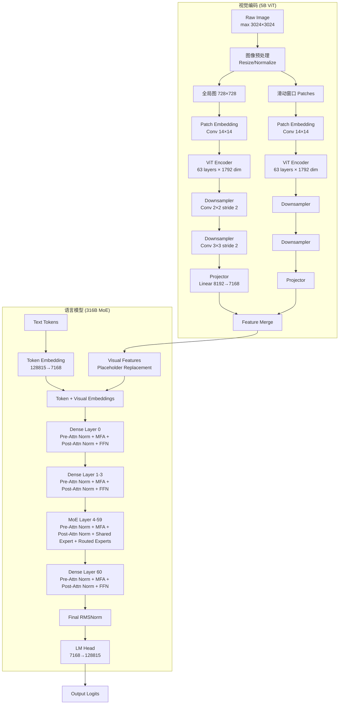

## 2.2 核心超参数

### 语言模型 (Step3TextConfig)

| 参数 | 值 | 说明 |
|------|-----|------|
| hidden_size | 7168 | 隐层维度 |
| num_hidden_layers | 61 | 总层数（5 dense + 56 MoE） |
| num_attention_heads | 64 | Query heads 数量 |
| num_kv_heads | 1 | KV heads 数量（极致压缩） |
| head_dim | 256 | 每个 head 的维度 |
| share_q_dim | 2048 | 低秩 Query 共享维度 |
| intermediate_size | 18432 | Dense FFN 中间维度 |
| moe_intermediate_size | 5120 | MoE 专家中间维度 |
| moe_num_experts | 48 | MoE 专家总数 |
| moe_top_k | 3 | 每 token 激活专家数 |
| share_expert_dim | 5120 | 共享专家中间维度 |
| vocab_size | 128815 | 词表大小（DeepSeek V3 tokenizer） |
| max_position_embedding | 65536 | 最大位置编码长度 |
| rms_norm_eps | 1e-5 | RMSNorm epsilon |

### 视觉编码器 (Step3VisionEncoderConfig)

| 参数 | 值 | 说明 |
|------|-----|------|
| hidden_size | 1792 | ViT 隐层维度 |
| intermediate_size | 3072 | ViT FFN 中间维度 |
| output_hidden_size | 4096 | 下采样后输出维度 |
| num_hidden_layers | 63 | ViT Encoder 层数 |
| num_attention_heads | 16 | ViT 注意力头数 |
| image_size | 728 | 输入图像尺寸 |
| patch_size | 14 | Patch 大小 |
| num_channels | 3 | 图像通道数 |
| hidden_act | quick_gelu | 激活函数 |

## 2.3 MFA (Multi-Matrix Factorization Attention) 机制详解

### 技术原理

MFA 是 Step3 最核心的创新，旨在**在保持注意力表达能力的同时，极致压缩 KV Cache**。其核心思想是对 Query 进行低秩分解，并采用极端的 1-head KV 共享策略。

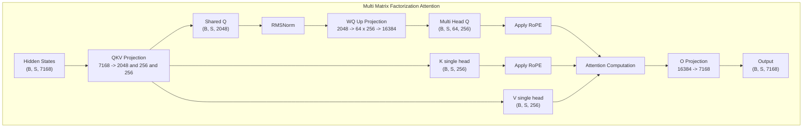

> **关键洞察**: MFA 的设计精妙之处在于：Q 的 low-rank 分解（7168 → 2048 → 16384）使得 Q 参数量大幅降低，同时 1-head KV 将 KV Cache 压缩到极致（每 token 仅 256 bytes FP8），但通过 64 个 Q heads 保持了注意力的高有效秩（16384），与 DeepSeek-V3 的 MLA 相同。

**公式**：

$$\text{MFA}(x) = \text{softmax}\left(\frac{Q_{\text{multi}} K^T}{\sqrt{d_k}}\right) V$$

其中：
$$Q_{\text{shared}} = x W_Q^{\text{down}} \in \mathbb{R}^{B \times S \times 2048}$$
$$Q_{\text{multi}} = \text{RMSNorm}(Q_{\text{shared}}) W_Q^{\text{up}} \in \mathbb{R}^{B \times S \times 64 \times 256}$$
$$K = x W_K \in \mathbb{R}^{B \times S \times 256}, \quad V = x W_V \in \mathbb{R}^{B \times S \times 256}$$

### MFA vs MLA vs GQA 对比

| 维度 | MFA (Step3-VL) | MLA (DeepSeek-V3) | GQA (Qwen3 MoE) |
|------|---------------|-------------------|-----------------|
| **Q 头数** | 64 | 128 | 32 |
| **KV 头数** | **1** | 1 (latent compressed) | 4 |
| **Head Dim** | 256 | 128 (compressed) | 128 |
| **KV Cache / Token** | **256 bytes** (FP8) | 576 bytes (FP8) | 1024 bytes (FP8) |
| **有效注意力秩** | **16384** | 16384 | 8192 |
| **算术强度** | **128** | 512 | 32 |
| **硬件偏好** | 均衡（H800/H20） | 计算密集型（H800） | 访存密集型 |
| **Q 参数压缩** | 7168→2048→16384 | 7168→1536→16384 | 直接投影 |

> **关键洞察**: MFA 的算术强度 (128) 恰好处于 MLA (512) 和 GQA (32) 之间。MLA 适合 H800 这类计算强的 GPU，GQA 适合访存带宽大的硬件，而 MFA 在两者之间取得了平衡，使得 Step3-VL 在 H800 和 H20 等多种 GPU 上都能高效运行。

### KV Cache 计算

对于 61 层、1 KV head、head_dim=256 的配置：
- **FP8 精度**: 61 × 256 × 2 (K+V) × 1 byte = **31,232 bytes/token**
- **BF16 精度**: 61 × 256 × 2 × 2 bytes = 62,464 bytes/token
- **32K 上下文**: 31,232 × 32768 ≈ **0.96 GB** (FP8)

作为对比，同样是 61 层的标准 GQA (4 KV heads × 128 dim)：
- 61 × 4 × 128 × 2 × 1 byte = 62,464 bytes/token
- MFA 的 KV Cache 仅为标准 GQA 的 **50%**。

## 2.4 MoE (Mixture of Experts) 机制详解

### 技术原理

Step3-VL 采用 **48 专家 + 1 共享专家** 的 MoE 设计，每 token 激活 top-3 路由专家加 1 个共享专家。

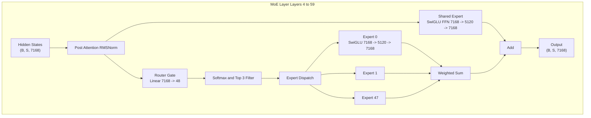

**MoE 公式**：

$$\text{MoE}(x) = \underbrace{E_{\text{shared}}(x)}_{\text{共享专家}} + \sum_{i \in \text{top-k}} \underbrace{\text{softmax}(W_g x)_i}_{w_i} \cdot \underbrace{E_i(x)}_{\text{路由专家}}$$

其中 $k=3$，$W_g \in \mathbb{R}^{7168 \times 48}$ 为路由权重矩阵。

### MoE 层配置

| 层范围 | 类型 | 配置 |
|--------|------|------|
| Layer 0-3 | Dense FFN | SwiGLU, 7168→18432→7168 |
| Layer 4-59 | MoE | 48 experts × top-3 + 1 shared expert, 7168→5120→7168 |
| Layer 60 | Dense FFN | SwiGLU, 7168→18432→7168 |

### 稀疏度分析

Step3-VL 的 MoE 稀疏度 ≈ (3 routed + 1 shared) / (48 + 1) ≈ **0.08**

> **性能提示**: 0.08 的稀疏度是经过精心设计的。根据论文推导，H800 上达到良好 MFU 的最优稀疏度下限为 0.058，Step3-VL 的 0.08 恰好在此之上。相比之下，DeepSeek-V3 的稀疏度约 0.035（理论最优需 ~0.055），在 H800 上可能因计算密度过低而浪费带宽。

## 2.5 其他关键技术组件

### Gated Attention (SwiGLU FFN)

Dense FFN 层使用标准 SwiGLU 激活：

$$\text{SwiGLU}(x) = (xW_1 \odot \text{SiLU}(xW_2)) W_3$$

### RMSNorm

所有归一化层使用 RMSNorm：

$$\text{RMSNorm}(x) = \frac{x}{\sqrt{\frac{1}{d}\sum_{i=1}^{d} x_i^2 + \epsilon}} \cdot \gamma$$

### RoPE (Rotary Position Embedding)

MFA 中的 Q 和 K 使用标准 RoPE 进行位置编码。RoPE 参数通过 `rope_parameters` 配置，默认 theta=500000。

---

# 第三部分: 输入预处理流程

## 3.1 文本预处理

Step3-VL 使用 **DeepSeek V3 Tokenizer**（vocab_size=128815），这是目前主流的 tokenizer 选择之一。

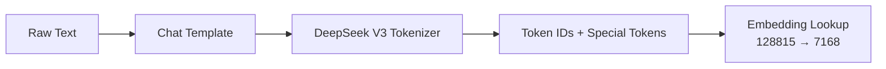

## 3.2 多模态输入处理

Step3-VL 的图像处理是其多模态能力的核心。其采用**全局图 + 滑动窗口 Patches** 的多尺度策略。

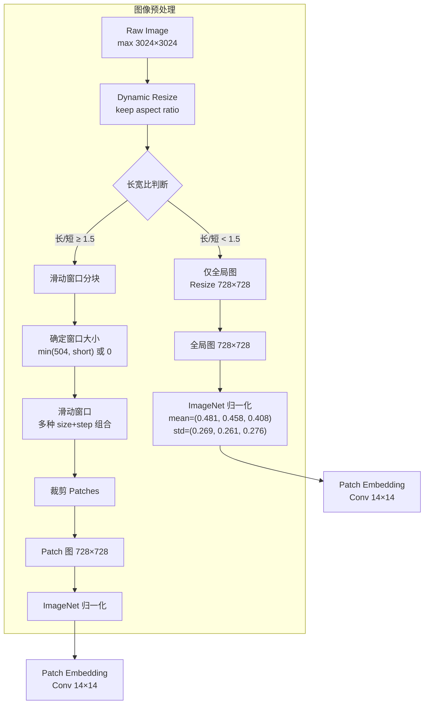

### 图像 Patches 策略

Step3-VL 采用智能的多尺度滑动窗口策略：
- **方形图** (ratio < 1.5)：仅使用全局 728×728 视图
- **细长图** (ratio ≥ 4)：窗口尺寸取 min(504, short_side)
- **中等长图** (1.5 ≤ ratio < 4)：窗口尺寸固定 504

滑动窗口使用多种 (size, step) 组合覆盖不同区域，确保不丢失细节信息。

### 视觉 Token 在文本中的占位

图像 token 使用 `<im_patch>` 占位符（token_id=128001）。在多模态处理器中，每个 `<im_patch>` 被替换为实际的视觉特征 token 序列。

```python
# vllm/model_executor/models/step3_vl.py (get_placeholder_str)
@classmethod
def get_placeholder_str(cls, modality: str, i: int) -> str | None:
    if modality.startswith("image"):
        return "<im_patch>"
    raise ValueError("Only image modality is supported")
```

## 3.3 Tokenizer 配置

| 配置项 | 值 | 说明 |
|--------|-----|------|
| Tokenizer Type | DeepSeek V3 Tokenizer | 128815 vocab |
| Vocab Size | 128815 | 词表大小 |
| Image Token | `<im_patch>` (id=128001) | 图像占位符 |
| Max Context Length | 65536 | 最大上下文长度 |
| Special Tokens | — | 通过 Processor 自动添加 |

---

# 第四部分: 模型前向传播流程

## 4.1 整体 Forward 流程

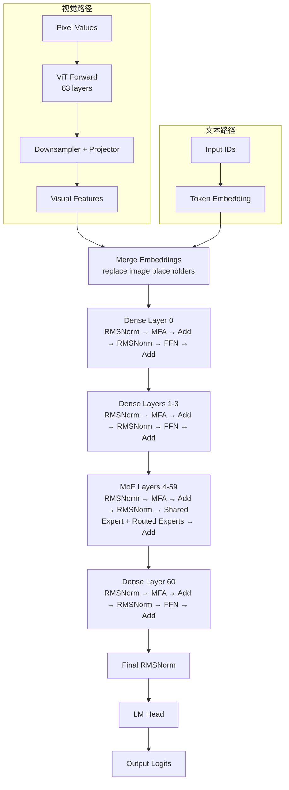

## 4.2 单层 Transformer 计算流程

### Dense Layer (Layer 0-3, 60)

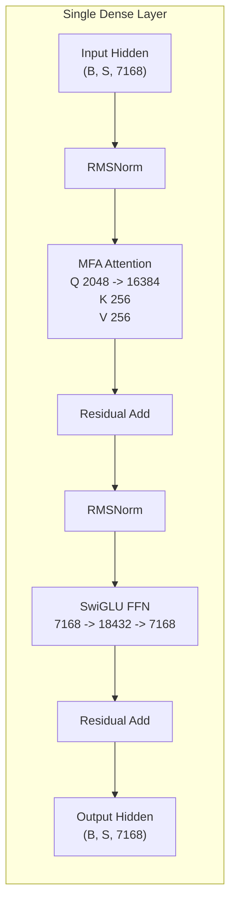

### MoE Layer (Layer 4-59)

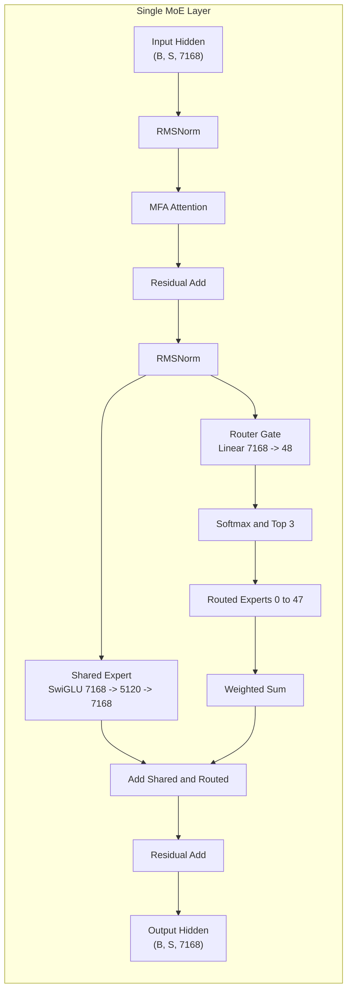

### Tensor Shape 追踪

以 batch_size=1, seq_len=8192 为例：

| 步骤 | 操作 | 输入 Shape | 输出 Shape |
|------|------|-----------|-----------|
| 1 | Token Embedding | `[1, 8192]` | `[1, 8192, 7168]` |
| 2 | QKV Proj (Q) | `[1, 8192, 7168]` | `[1, 8192, 2048]` |
| 3 | K Proj | `[1, 8192, 7168]` | `[1, 8192, 256]` |
| 4 | V Proj | `[1, 8192, 7168]` | `[1, 8192, 256]` |
| 5 | WQ Up-Proj | `[1, 8192, 2048]` | `[1, 8192, 16384]` |
| 6 | Reshape Q | `[1, 8192, 16384]` | `[1, 64, 8192, 256]` |
| 7 | Attention Output | — | `[1, 8192, 16384]` |
| 8 | O Proj | `[1, 8192, 16384]` | `[1, 8192, 7168]` |
| 9 | Router Gate | `[1, 8192, 7168]` | `[1, 8192, 48]` |
| 10 | Expert Output (×3) | `[N, 7168]` | `[N, 5120]` |
| 11 | LM Head | `[1, 8192, 7168]` | `[1, 8192, 128815]` |

## 4.3 vLLM 中的优化

### PagedAttention

MFA 尽管 KV head 数为 1，但仍然兼容 vLLM 的 PagedAttention 机制。单头 KV Cache 在 PagedAttention 中占用的页表条目极少，进一步提升了内存效率。

### Tensor 并行 (TP)

Step3-VL 在 vLLM 中支持标准的 Tensor 并行：
- **Attention**: QKV 通过 `ReplicatedLinear`（Q 共享部分）+ `ColumnParallelLinear`（Q 展开部分）+ 自定义 QKV 分割实现 TP
- **MoE**: 通过 `FusedMoE` 的 Expert Parallelism (EP) 进行专家分布
- **ViT**: 支持 `mm_encoder_tp_mode="data"` 进行 DP sharding

### FP8 量化

Step3-VL 官方提供 block-FP8 权重，支持端到端 FP8 推理（权重 + KV Cache），在 H800 上实现最佳性能和精度平衡。

---

# 第五部分: ViT 计算流程

## 5.1 ViT 架构概览

Step3-VL 的 ViT (Vision Transformer) 是一个 **63 层** 的深度 ViT 编码器，参数量约 **5B**。

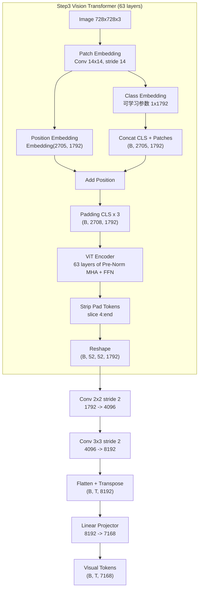

## 5.2 Patch Embedding 详解

图像 (728×728) 被切分为 14×14 的 patches：

$$\text{num\_patches} = \left(\frac{728}{14}\right)^2 = 52^2 = 2704$$

每个 patch 通过 `Conv2dLayer(3, 1792, kernel=14, stride=14)` 映射到 1792 维。

```python
# vllm/model_executor/models/step3_vl.py (Step3VisionEmbeddings)
self.patch_embedding = Conv2dLayer(
    in_channels=3,
    out_channels=self.embed_dim,  # 1792
    kernel_size=self.patch_size,  # 14
    stride=self.patch_size,       # 14
    bias=True,
)
```

### 位置编码

使用可学习的位置嵌入 (num_patches+1=2705, embed_dim=1792)。对于动态分辨率，通过 **bicubic 插值** 对位置编码进行重采样：

```python
# vllm/model_executor/models/step3_vl.py (get_abs_pos)
# 核心逻辑：将 2D 位置嵌入 reshape 后做 bicubic 插值
old_pos_embed = old_pos_embed.view(1, src_size, src_size, dim).permute(0, 3, 1, 2)
new_pos_embed = F.interpolate(
    old_pos_embed, size=(tgt_size, tgt_size),
    mode="bicubic", antialias=True, align_corners=False,
)
```

## 5.3 ViT Encoder 计算流程

每个 ViT Encoder Layer 包含标准的 Pre-Norm Attention + FFN 结构：

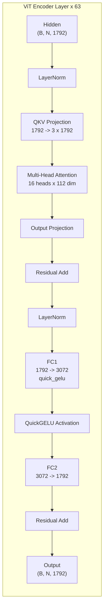

### ViT Attention 配置

| 参数 | 值 |
|------|-----|
| Num Heads | 16 |
| Head Dim | 112 (= 1792 / 16) |
| Scale | 1/√112 |
| Attention Type | Standard MHA (no RoPE in ViT) |

### CLS Token Padding

Step3-VL ViT 的一个特殊设计是 **CLS Token 填充**：在 forward 时，将 CLS token 复制 3 份（pad_tp_size=4），使序列长度从 2705 变为 2708。这是为了兼容 Tensor Parallel 的要求。

```python
# vllm/model_executor/models/step3_vl.py
embeddings = torch.cat(
    [
        embeddings[:, 0, :].unsqueeze(1).repeat(1, self.pad_tp_size - 1, 1),
        embeddings,
    ],
    dim=1,
)
```

最终输出时去掉前 4 个 token（3 padding + 1 CLS），只保留 patch features：

```python
return self.vision_model(input_tensor)[:, 4:]
```

## 5.4 视觉-语言融合策略

Step3-VL 采用 **直接拼接 (Direct Concatenation)** 的融合策略：

1. 视觉特征经投影器映射到 LLM 隐空间 (7168 维)
2. 文本 token 嵌入中的 `<im_patch>` 占位符被替换为视觉特征
3. 全局图特征和 Patch 特征按照 patch_newline_mask 提供的布局进行拼接

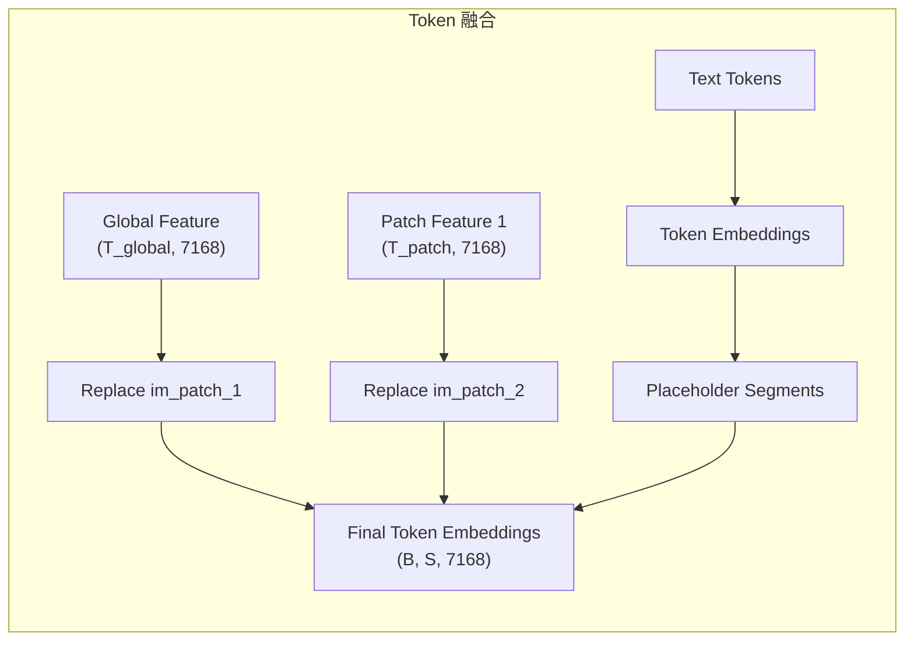

# 第六部分: vLLM 中的代码实现

## 6.1 模型注册与配置

Step3-VL 通过 `MULTIMODAL_REGISTRY` 在 vLLM 中注册：

```python
# vllm/model_executor/models/step3_vl.py
@MULTIMODAL_REGISTRY.register_processor(
    Step3VLMultiModalProcessor,
    info=Step3VLProcessingInfo,
    dummy_inputs=Step3VLDummyInputsBuilder,
)
class Step3VLForConditionalGeneration(nn.Module, SupportsMultiModal, SupportsPP):
    ...
```

配置类层级：
- `Step3VLConfig`: 顶层配置，包含 `vision_config` 和 `text_config`
- `Step3VisionEncoderConfig`: ViT 配置
- `Step3TextConfig`: LLM 配置

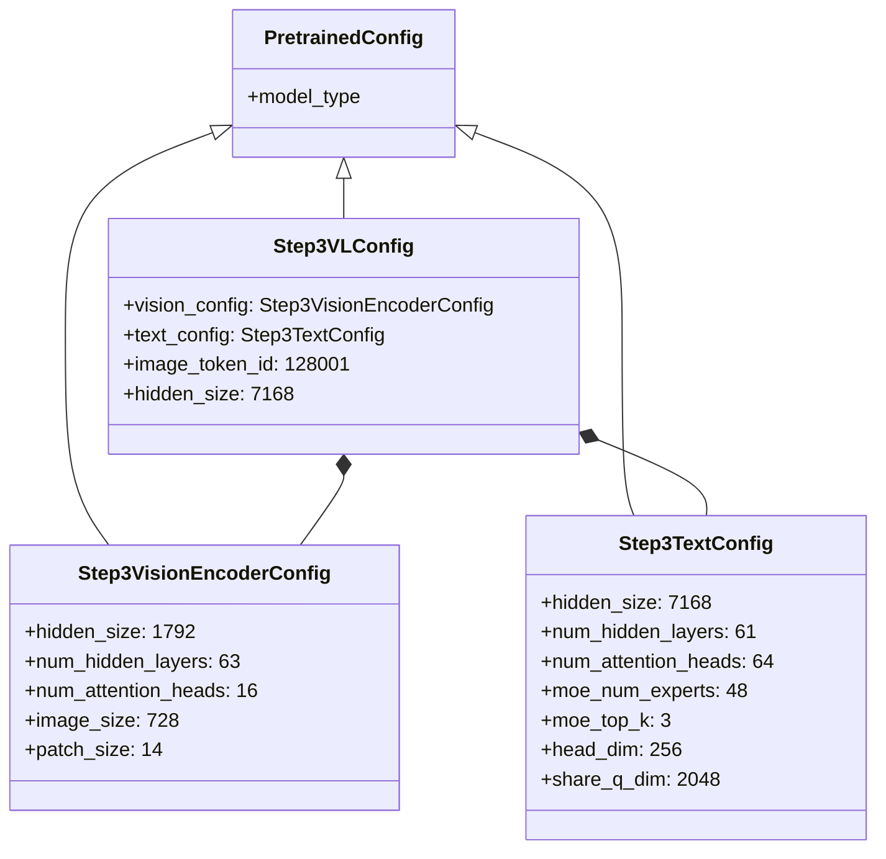

## 6.2 核心模型类分析

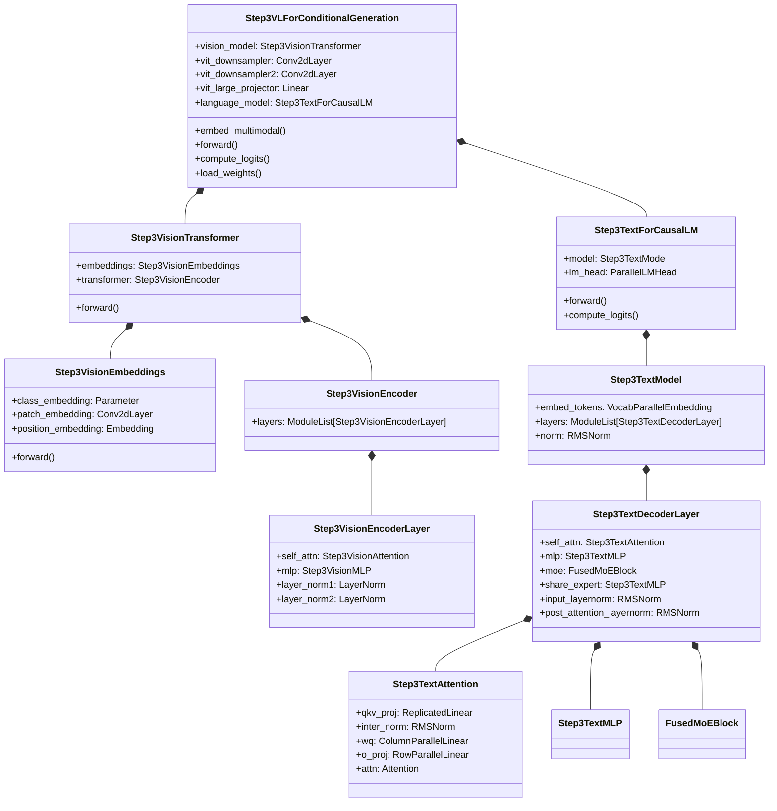

## 6.3 关键计算流程代码分析

### 视觉编码流程

```python
# vllm/model_executor/models/step3_vl.py (Step3VLForConditionalGeneration)

def _process_image_input(
    self, image_input: Step3VLImageInputs
) -> tuple[torch.Tensor, ...]:
    # Step 1: ViT 编码全局图和 Patch 图
    image_features = self._get_vision_model_output(image_input["pixel_values"])
    # Shape: [num_images, 2704, 1792]  (去掉 4 个 padding tokens 后)

    patch_image_features = (
        self._get_vision_model_output(image_input["patch_pixel_values"])
        if len(image_input["patch_pixel_values"]) > 0
        else None
    )

    # Step 2: 下采样 + 投影
    image_features = self._process_image_features(image_features)
    # Shape: [num_images, T_downsampled, 7168]

    patch_image_features = (
        self._process_image_features(patch_image_features)
        if patch_image_features is not None else None
    )

    # Step 3: 合并 Patch 特征和全局特征
    merged_image_features = []
    cur_patch_idx = 0
    for i, num_patch in enumerate(num_patches):
        cur_feature = []
        if num_patch > 0:
            patch_slice = patch_image_features[cur_patch_idx:cur_patch_idx + num_patch]
            cur_feature.append(patch_slice.view(-1, patch_slice.shape[-1]))
        cur_feature.append(image_features[i].view(-1, image_features.shape[-1]))
        cur_patch_idx += num_patch
        merged_image_features.append(torch.cat(cur_feature))

    return merged_image_features
```

### 视觉特征下采样

```python
# vllm/model_executor/models/step3_vl.py (Step3VLForConditionalGeneration)

def _process_image_features(self, image_features: torch.Tensor) -> torch.Tensor:
    B, P = image_features.shape[:2]          # [B, 2704, 1792]
    HW = int(sqrt(P))                        # 52
    image_features = image_features.permute(0, 2, 1).view(B, -1, HW, HW)
    # Shape: [B, 1792, 52, 52]

    # 第一层下采样: Conv2d(1792, 4096, kernel=2, stride=2)
    image_features = self.vit_downsampler(image_features)
    # Shape: [B, 4096, 26, 26]

    # 第二层下采样: Conv2d(4096, 8192, kernel=3, stride=2, padding=1)
    image_features = self.vit_downsampler2(image_features)
    # Shape: [B, 8192, 13, 13]

    n_dim = image_features.size(1)           # 8192
    image_features = image_features.view(B, n_dim, -1).permute(0, 2, 1)
    # Shape: [B, 169, 8192]  (13×13=169)

    # 线性投影到 LLM 隐空间
    image_features = self.vit_large_projector(image_features)
    # Shape: [B, 169, 7168]

    return image_features
```

### MFA Attention 实现

```python
# vllm/model_executor/models/step3_text.py (Step3TextAttention)

class Step3TextAttention(nn.Module):
    def __init__(self, hidden_size=7168, num_heads=64, num_kv_heads=1,
                 head_dim=256, share_q_dim=2048, ...):
        # QKV 投影: 7168 → 2048 (Q_shared) + 256 (K) + 256 (V)
        self.qkv_proj = ReplicatedLinear(
            hidden_size, share_q_dim + head_dim * 2, bias=False
        )
        # Q 共享维度归一化
        self.inter_norm = RMSNorm(share_q_dim)
        # Q 展开投影: 2048 → 64 × 256 = 16384
        self.wq = ColumnParallelLinear(
            share_q_dim, head_dim * num_heads, bias=False
        )
        self.rotary_emb = get_rope(head_dim, ...)
        self.attn = Attention(num_heads, head_dim, scaling, num_kv_heads, ...)

    def forward(self, positions, hidden_states):
        # Step 1: QKV 联合投影
        qkv, _ = self.qkv_proj(hidden_states)
        q, k, v = qkv.split([self.q_size, self.kv_size, self.kv_size], dim=-1)
        # q: [B, S, 2048], k: [B, S, 256], v: [B, S, 256]

        # Step 2: Q 低秩展开
        q = self.inter_norm(q)                 # RMSNorm
        q = self.wq(q)[0]                      # 2048 → 16384

        # Step 3: RoPE
        q, k = self.rotary_emb(positions, q, k)

        # Step 4: Attention (PagedAttention 自动选择后端)
        attn_output = self.attn(q, k, v)

        # Step 5: 输出投影
        residual, _ = self.o_proj(attn_output)
        return residual
```

### MoE 层实现

```python
# vllm/model_executor/models/step3_text.py (Step3TextDecoderLayer)

class Step3TextDecoderLayer(nn.Module):
    def forward(self, positions, hidden_states, residual):
        # Pre-Attention: RMSNorm → MFA → Residual
        if residual is None:
            residual = hidden_states
            hidden_states = self.input_layernorm(hidden_states)
        else:
            hidden_states, residual = self.input_layernorm(hidden_states, residual)

        hidden_states = self.self_attn(positions=positions, hidden_states=hidden_states)
        hidden_states, residual = self.post_attention_layernorm(hidden_states, residual)

        # MoE: Shared Expert + Routed Experts
        if self.use_moe:
            share_output = self.share_expert(hidden_states)
            moe_output = self.moe(hidden_states)
            hidden_states = share_output + moe_output
        else:
            # Dense: Standard FFN
            hidden_states = self.mlp(hidden_states)

        return hidden_states, residual
```

## 6.4 权重加载映射

Step3-VL 使用 `WeightsMapper` 进行 HuggingFace → vLLM 的权重名映射：

```python
# vllm/model_executor/models/step3_vl.py
hf_to_vllm_mapper = WeightsMapper(
    orig_to_new_prefix={
        "model.": "language_model.model.",
        "lm_head.": "language_model.lm_head.",
    }
)
```

对于 MFA 特有的 QKV 融合加载，`Step3TextModel.load_weights()` 实现了自定义的权重分割逻辑，将 HuggingFace 格式的分离式 Q/K/V 权重拼接为 vLLM 中的联合 QKV 投影权重。

## 6.5 vLLM 特有优化

### DP-sharded ViT

```python
# vllm/model_executor/models/step3_vl.py
self.use_data_parallel = multimodal_config.mm_encoder_tp_mode == "data"
```

当设置 `mm_encoder_tp_mode="data"` 时，ViT 在数据并行的方式下运行，避免 TP 通信开销。

### MMEncoderAttention

ViT 使用统一的 `MMEncoderAttention`，自动选择最优的注意力后端（FlashAttention 或等效实现）。

### Pipeline Parallelism (PP)

Step3-VL 支持 `SupportsPP`，可以在多 GPU 上进行流水线并行。`make_empty_intermediate_tensors` 机制确保 PP 中间状态的正确传递。

---

# 附录

## A. 关键代码位置索引

| 组件 | 文件路径 | 关键类/函数 |
|------|---------|------------|
| **Step3-VL 主模型** | `vllm/model_executor/models/step3_vl.py` | `Step3VLForConditionalGeneration` |
| **ViT Encoder** | `vllm/model_executor/models/step3_vl.py` | `Step3VisionTransformer`, `Step3VisionEmbeddings`, `Step3VisionEncoder`, `Step3VisionEncoderLayer` |
| **ViT 位置编码** | `vllm/model_executor/models/step3_vl.py` | `get_abs_pos()` |
| **图像下采样** | `vllm/model_executor/models/step3_vl.py` | `Step3VLForConditionalGeneration._process_image_features()` |
| **多模态处理器** | `vllm/model_executor/models/step3_vl.py` | `Step3VLMultiModalProcessor`, `Step3VLProcessingInfo` |
| **图像预处理** | `vllm/transformers_utils/processors/step3_vl.py` | `Step3VLImageProcessor`, `ImagePatcher`, `Step3VisionProcessor` |
| **ViT 配置** | `vllm/transformers_utils/configs/step3_vl.py` | `Step3VisionEncoderConfig` |
| **LLM 文本模型** | `vllm/model_executor/models/step3_text.py` | `Step3TextForCausalLM`, `Step3TextModel`, `Step3TextDecoderLayer` |
| **MFA Attention** | `vllm/model_executor/models/step3_text.py` | `Step3TextAttention` |
| **MoE Block** | `vllm/model_executor/models/step3_text.py` | `FusedMoEBlock` |
| **Dense MLP** | `vllm/model_executor/models/step3_text.py` | `Step3TextMLP` |
| **Step-VL 基类** | `vllm/model_executor/models/step_vl.py` | `StepVLForConditionalGeneration`, `PerceptionEncoder`, `PerceptionEncoderVisionTransformer` |
| **Step-1 模型** | `vllm/model_executor/models/step1.py` | Step-1 实现 |
| **Step3.5 模型** | `vllm/model_executor/models/step3p5.py` | Step3.5 实现 |
| **Step3.5 MTP** | `vllm/model_executor/models/step3p5_mtp.py` | Step3.5 + Multi-Token Prediction |

## B. 术语表

| 术语 | 英文 | 说明 |
|------|------|------|
| 多矩阵分解注意力 | MFA (Multi-Matrix Factorization Attention) | Step3 的自定义注意力，低秩 Q + 1-head KV |
| 注意力-FFN 分离 | AFD (Attention-FFN Disaggregation) | 将 Attention 和 FFN 部署在不同 GPU 组上的分布式推理架构 |
| 多头注意力 | MHA (Multi-Head Attention) | 标准的多头注意力机制 |
| 分组查询注意力 | GQA (Grouped-Query Attention) | 多 Q head 共享少 KV head |
| 多头潜在注意力 | MLA (Multi-head Latent Attention) | DeepSeek 的 KV Cache 压缩注意力 |
| 混合专家 | MoE (Mixture of Experts) | 稀疏激活的 FFN 架构 |
| 共享专家 | Shared Expert | 所有 token 共享的 FFN 专家 |
| 路由专家 | Routed Expert | 通过路由器选择的 token 专用专家 |
| 视觉 Transformer | ViT (Vision Transformer) | 图像编码器 |
| 滑动窗口 | Sliding Window | 图像分块策略 |
| 旋转位置编码 | RoPE (Rotary Position Embedding) | 位置编码方式 |
| 专家并行 | EP (Expert Parallelism) | MoE 模型的分布式策略 |
| 张量并行 | TP (Tensor Parallelism) | 单层权重切分到多 GPU |
| 流水线并行 | PP (Pipeline Parallelism) | 不同层分布到不同 GPU |
| KV 缓存 | KV Cache | 注意力 key/value 的推理缓存 |
| 每 Token 时间 | TPOT (Time Per Output Token) | 生成每个 token 的延迟 |

## C. 参考资料

- [Step3 System Tech Report (arXiv 2507.19427)](https://arxiv.org/abs/2507.19427) — 系统架构、MFA、AFD 官方论文
- [Step3 官方博客](https://stepfun.ai/research/step3) — 模型介绍与技术亮点
- [Step3 GitHub Repository](https://github.com/stepfun-ai/step3) — 模型权重、部署指南、技术细节
- [Step3 HuggingFace Collection](https://huggingface.co/collections/stepfun-ai/step3-688a3d652dbb45d868f9d42d) — 所有模型变体及权重
- [vLLM Step3-VL 代码](https://github.com/vllm-project/vllm/blob/main/vllm/model_executor/models/step3_vl.py) — vLLM 中的模型实现
- [StepMesh 通信库](https://github.com/stepfun-ai/StepMesh) — AFD 网络通信层开源实现
- [LLM Architecture Gallery](https://sebastianraschka.com/llm-architecture-gallery/) — 大模型架构对比参考
- [vLLM RFC: ATTN-FFN Disaggregation for MoE Models](https://github.com/vllm-project/vllm/issues/22799) — vLLM 中 AFD 设计讨论
- [vLLM RFC: Support ViT Full CUDA Graph](https://github.com/vllm-project/vllm/issues/38175) — ViT CUDA Graph 优化追踪
