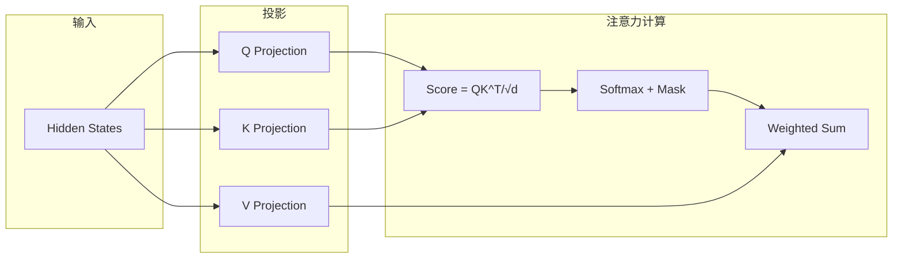
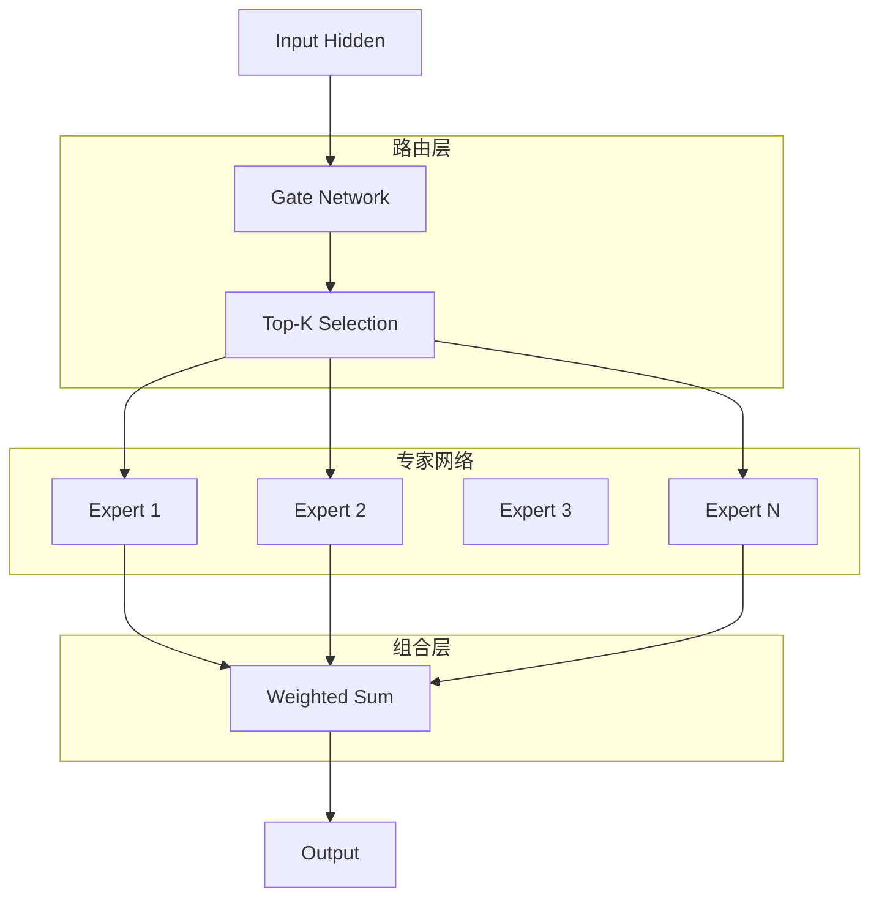
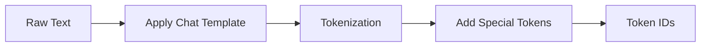
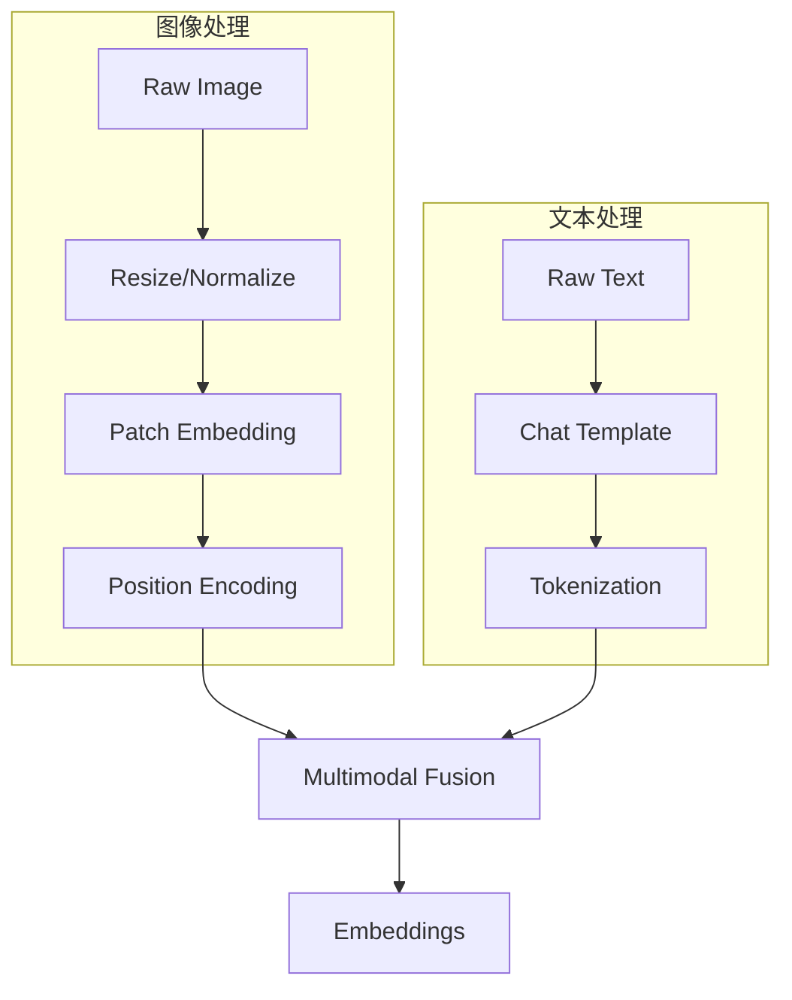
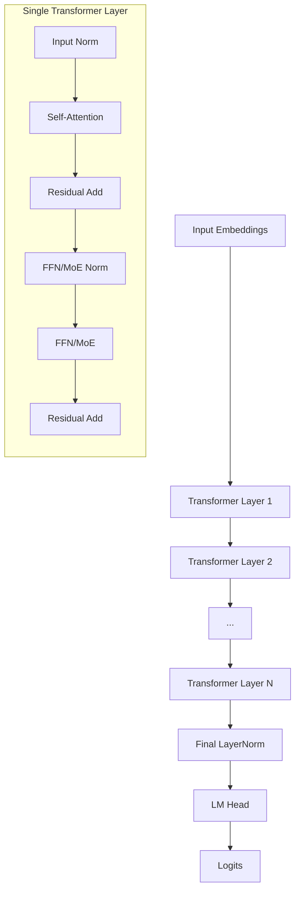
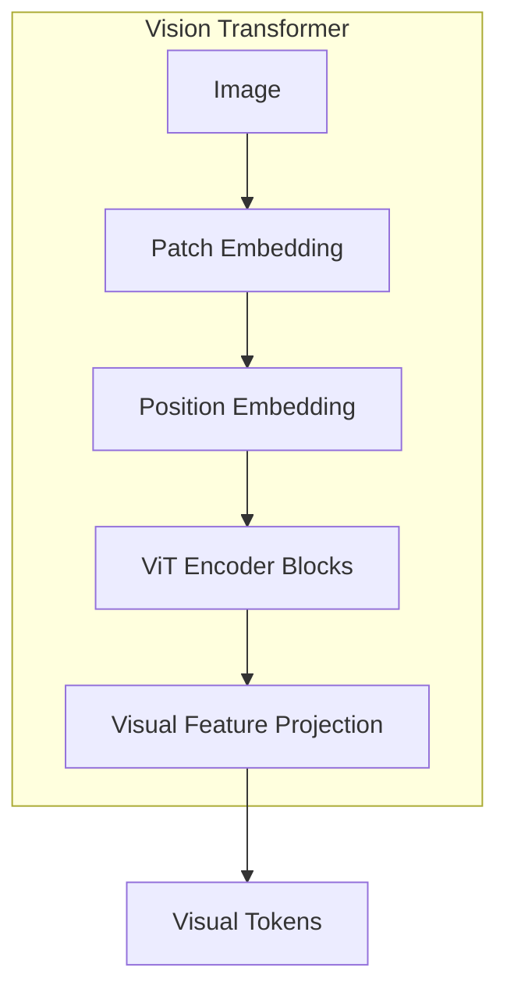
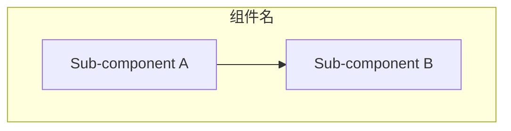
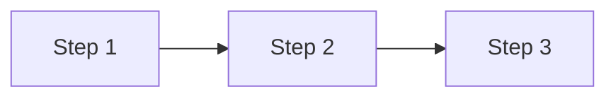
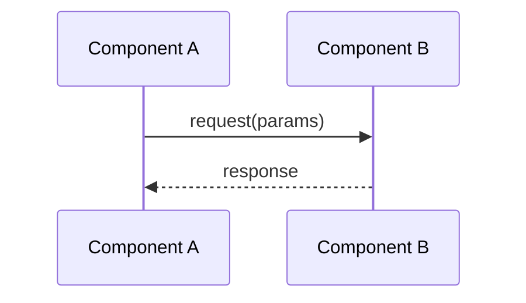
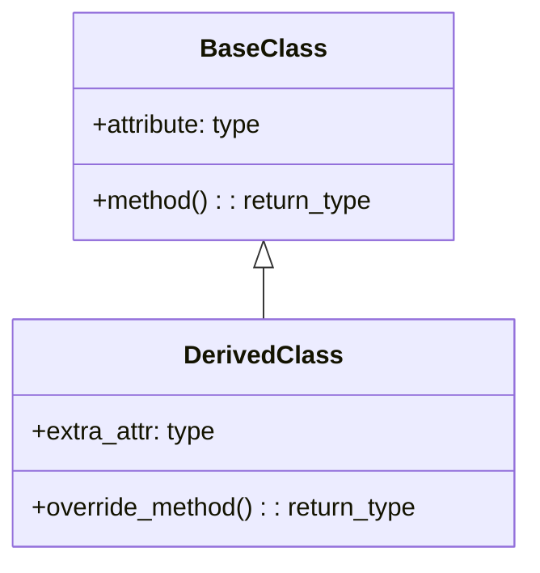

# vLLM Model Tutorial Style Guide

This reference defines the document structure, formatting conventions, and content patterns for vLLM model tutorial documents.

## Document Structure

A complete model tutorial follows this multi-part structure:

```
# vLLM [Model Name] 模型技术教程

> **文档版本**: 1.0
> **分析代码版本**: vLLM main 分支（截至 YYYY-MM）
> **最后更新**: YYYY-MM-DD
> **模型系列**: [Model Family]
> **模型类型**: [Dense LLM / MoE LLM / VLM / VLM-MoE]

---

## 文档概述

(Brief overview: what this document covers, target audience, recommended reading order)

---

# 第一部分: [Model Name] 模型系列概述与演进

## 1.1 模型系列发展历史

(Timeline of the model family evolution, key milestones)

## 1.2 同系列模型对比

(Comprehensive comparison table of all variants in the model family)

| 模型名称 | 参数量 | 发布日期 | 核心创新点 | 架构类型 | 上下文长度 | 技术报告 | HuggingFace | ModelScope |
|---------|--------|---------|-----------|---------|-----------|---------|------------|------------|
| ... | ... | ... | ... | ... | ... | [Paper](link) | [HF](link) | [MS](link) |

## 1.3 各模型能力对比

| 能力维度 | Model v1 | Model v2 | Model v3 |
|---------|---------|---------|---------|
| 语言理解 | ... | ... | ... |
| 多模态支持 | ... | ... | ... |
| 推理能力 | ... | ... | ... |

## 1.4 技术报告与论文汇总

(Table listing all technical reports/papers with links and brief descriptions)

---

# 第二部分: [Model Name] 模型架构详解

## 2.1 整体架构概览

(High-level architecture description with Mermaid diagram)

```mermaid
flowchart TB
    subgraph Input["输入层"]
        A[Text Tokens]
        B[Image Patches<br/>(VLM only)]
    end
    subgraph Embedding["嵌入层"]
        C[Token Embedding]
        D[Vision Encoder<br/>(VLM only)]
    end
    subgraph Backbone["主干网络 (N Layers)"]
        E[Transformer Block]
        F[...]
    end
    subgraph Output["输出层"]
        G[LM Head]
    end
    A --> C
    B --> D
    C --> Backbone
    D --> Backbone
    Backbone --> G
```

## 2.2 核心超参数

| 参数 | 值 | 说明 |
|------|-----|------|
| Hidden Size | ... | ... |
| Num Layers | ... | ... |
| Num Attention Heads | ... | ... |
| Num KV Heads | ... | ... |
| Intermediate Size | ... | ... |
| Vocab Size | ... | ... |
| Max Position Embeddings | ... | ... |
| Activation Function | ... | ... |
| Norm Type | ... | ... |

## 2.3 Attention 机制详解

(Detailed explanation of the attention mechanism used: MHA/GQA/MQA/MLA)

### 技术原理: [Attention Type]

(Explain the mechanism with formulas, diagrams, and analysis)

**公式**:
$$\text{Attention}(Q, K, V) = \text{softmax}\left(\frac{QK^T}{\sqrt{d_k}} + \text{Mask}\right)V$$

**架构图**:


## 2.4 FFN / MoE 机制详解

(For dense models: standard FFN explanation. For MoE: routing, expert computation, load balancing)

### 技术原理: MoE (Mixture of Experts)

(If applicable — explain routing mechanism, top-k selection, auxiliary loss, expert parallelism)



## 2.5 其他关键技术组件

(Cover: Gated Attention, RoPE, Sliding Window Attention, Norm layers, etc. — as applicable)

---

# 第三部分: 输入预处理流程

## 3.1 文本预处理

(Tokenizer, special tokens, chat template)



## 3.2 多模态输入处理 (VLM Only)

(Image/video/audio preprocessing pipeline)



## 3.3 Tokenizer 配置

| 配置项 | 值 | 说明 |
|--------|-----|------|
| Tokenizer Type | ... | ... |
| Vocab Size | ... | ... |
| Special Tokens | ... | ... |
| Chat Template | ... | ... |

---

# 第四部分: 模型前向传播流程

## 4.1 整体 Forward 流程



## 4.2 单层 Transformer 计算流程

(Detailed step-by-step computation with shape annotations)

### Step 1: Self-Attention
- Input shape: `[batch, seq_len, hidden]`
- QKV projection: ...
- Attention computation: ...

### Step 2: FFN / MoE
- For MoE: routing, expert dispatch, combine
- Shapes at each step

## 4.3 vLLM 中的优化

(PagedAttention, chunked prefill, prefix caching, tensor parallelism — as relevant)

---

# 第五部分: ViT 计算流程 (仅 VLM 模型)

(This part is ONLY for VLM models. Skip for text-only LLMs.)

## 5.1 ViT 架构概览

(Vision Transformer architecture with Mermaid diagram)



## 5.2 Patch Embedding 详解

(Patch size, embedding dimension, how patches are created)

## 5.3 ViT Encoder 计算流程

(ViT forward pass details, attention in ViT, any special components)

## 5.4 视觉-语言融合策略

(How visual tokens are combined with text tokens — cross-attention, concatenation, etc.)

---

# 第六部分: vLLM 中的代码实现

## 6.1 模型注册与配置

(How the model registers itself in vLLM, config classes)

```python
# vllm/model_executor/models/{model_file}.py
class {ModelName}Config(PretrainedConfig):
    ...
```

## 6.2 核心模型类分析

(Class hierarchy diagram with Mermaid, key method walkthrough)

```mermaid
classDiagram
    class VllmModel {
        +load_weights()
        +forward()
    }
    class {ModelForCausalLM} {
        +embed_input_ids()
        +compute_logits()
    }
    class {ModelAttention} {
        +forward()
    }
    class {ModelMLP_or_MoE} {
        +forward()
    }
    VllmModel <|-- {ModelForCausalLM}
    {ModelForCausalLM} *-- {ModelAttention}
    {ModelForCausalLM} *-- {ModelMLP_or_MoE}
```

## 6.3 关键计算流程代码分析

(Trace a forward pass through the actual vLLM code with annotated snippets)

## 6.4 vLLM 特有优化

(Model-specific optimizations in vLLM — custom ops, fused kernels, quantization support)

---

# 附录

## A. 关键代码位置索引

| 组件 | 文件路径 | 关键类/函数 |
|------|---------|------------|
| 模型入口 | `vllm/model_executor/models/{file}.py` | `{ClassName}` |
| Attention | ... | ... |
| FFN/MoE | ... | ... |
| ViT (VLM) | ... | ... |
| 多模态处理 | ... | ... |
| 量化支持 | ... | ... |

## B. 术语表

| 术语 | 英文 | 说明 |
|------|------|------|
| 多头注意力 | MHA | Multi-Head Attention |
| 分组查询注意力 | GQA | Grouped-Query Attention |
| ... | ... | ... |

## C. 参考资料

- [Technical Report](link)
- [vLLM PR: Support {ModelName}](link)
- [HuggingFace Model](link)
- [LLM Architecture Gallery](https://sebastianraschka.com/llm-architecture-gallery/)
```

Note: This is the full structure. For simpler models (dense LLMs), some subsections can be condensed. For complex MoE-VLMs, additional subsections may be needed.

## Formatting Conventions

### Mermaid Diagrams

Use extensively for architecture, flow, sequence, and class diagrams:

**Architecture Diagram** (flowchart TB with subgraphs):


**Flow Diagram** (flowchart LR for pipelines):


**Sequence Diagram** (for component interactions):


**Class Diagram** (for code structure):


### Tables

Use tables for comparisons, parameter references, and configuration:

```markdown
| 维度 | 方案A | 方案B | 方案C |
|------|-------|-------|-------|
| 原理 | ... | ... | ... |
| 优点 | ... | ... | ... |
| 缺点 | ... | ... | ... |
```

### Code Snippets

Include real vLLM code with file path annotations:

```python
# 文件: vllm/model_executor/models/some_model.py
class SomeModel(nn.Module):
    def forward(self, input_ids, positions, ...):
        # 关键逻辑
        hidden_states = self.model(input_ids, positions)
        return hidden_states
```

Always include line-level annotations for key logic using inline comments.

### Callout Blocks

Use blockquotes for emphasis:

```markdown
> **关键洞察**: Key insight about the architecture or design decision.

> **注意**: Important caveat or limitation.

> **性能提示**: Performance-related optimization advice.
```

### Mathematical Formulas

Use LaTeX for algorithm and mechanism explanations:

```markdown
$$\text{MoE}(x) = \sum_{i=1}^{k} g_i(x) \cdot E_i(x)$$

where $g_i(x)$ is the routing weight and $E_i(x)$ is the expert output.
```

## Language Convention

- Document body: Chinese (简体中文)
- Technical terms: Keep English original (e.g., Attention, KV Cache, RoPE, LayerNorm, Token)
- Code identifiers: Keep original English names unchanged
- Section titles: Chinese with English where needed (e.g., "## 2.3 Attention 机制详解")
- Mermaid diagrams: English labels preferred (shorter, renders better)

## Visual Element Density

Aim for these minimums in a complete tutorial:
- **4+ Mermaid diagrams**: At minimum — overall architecture, forward pass flow, attention mechanism, vLLM class hierarchy
- **5+ tables**: Model comparison, hyperparameters, tokenizer config, config parameters, code index
- **8+ code snippets**: Must cover model registration, attention, FFN/MoE, forward pass, and ViT (if VLM)
- **3+ LaTeX formulas**: Attention score, MoE routing, normalization

## Content Quality Principles

- **Explain the WHY**: Don't just describe what exists — explain why architectural choices were made
- **Start broad, then dive deep**: Each section begins with high-level overview, then drills into details
- **Cross-reference vLLM code**: Every architectural component should link to its vLLM implementation
- **Concrete shapes**: Include tensor shapes in forward pass walkthrough ([batch, seq, hidden])
- **Practical relevance**: End each section with implications for vLLM serving (memory, performance, compatibility)
