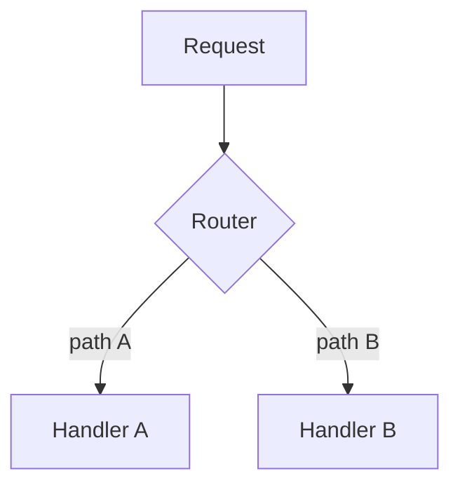

# vllm PR Summary

Fetch and analyze a `vllm-project/vllm` PR, then write a structured Markdown report to `./outputs/`.

Take `./reference/reference.md` as a reference for the report structure and style. Include Mermaid diagrams to illustrate architecture or flow when relevant.

## Workflow

1. **Fetch PR data** — run `scripts/fetch_pr_data.py`
2. **Read the JSON** — load the saved file into context
3. **Analyze** — synthesize PR description, comments, and diff
4. **Write report** — save to `./outputs/pr-<NUMBER>-summary.md`
5. **Confirm** — tell the user the output path

## Step 1: Fetch PR Data

```bash
python3 /Users/shanshan-shen/.claude/skills/vllm-pr-summary/scripts/fetch_pr_data.py <PR_NUMBER> \
    --output /tmp/vllm_pr_<PR_NUMBER>.json
```

Optional flags:
- `--token <token>` — GitHub PAT (not needed if `gh` CLI is authenticated)
- `--max-diff-chars <N>` — limit diff size (default 80 000)

## Step 2: Load and Analyze

Read `/tmp/vllm_pr_<PR_NUMBER>.json`. The JSON contains:

| Key | Content |
|-----|---------|
| `pr` | PR metadata: title, body, author, state, labels, additions/deletions, branch names, reviews |
| `diff` | Full unified diff of all changed files |
| `files` | Per-file stats: filename, status, additions, deletions, patch |
| `issue_comments` | General discussion comments |
| `review_comments` | Inline code review comments |

For large diffs, focus on the `files[].patch` fields grouped by module/directory.

## Step 3: Write the Report

Save to `/Users/shanshan-shen/.claude/skills/vllm-pr-summary/outputs/pr-<NUMBER>-summary.md`.

### Report Structure

```markdown
# PR #<NUMBER>: <Title>

> **Author**: @author | **State**: OPEN/MERGED/CLOSED | **Date**: YYYY-MM-DD
> **Branch**: `head` → `base` | **Labels**: label1, label2
> **Changes**: +X -Y lines across N files

---

## 1. 总结 (Summary)

2–4 sentences: what problem does this PR solve, and what is the core approach?

## 2. 背景与动机 (Background & Motivation)

Why is this change needed? Reference the PR description and any linked issues.

## 3. 代码修改分析 (Code Change Analysis)

### 3.1 修改的模块

List the changed files grouped by module/directory with a one-line description each.

### 3.2 架构 / 流程图 (Architecture / Flow Diagram)

Include at least one Mermaid diagram. Choose the most appropriate type:
- **flowchart TD** — for execution flow or decision logic
- **sequenceDiagram** — for interactions between components
- **classDiagram** — for new classes or interface changes
- **graph LR** — for data/dependency relationships

Example:


### 3.3 关键实现细节 (Key Implementation Details)

Bullet-point the most important code changes: new classes, changed APIs, algorithm changes, config additions.

## 4. 涉及的技术原理 (Technical Principles)

Explain relevant background concepts a reviewer needs to understand this PR (e.g., SPMD, paged attention, tensor parallelism, CUDA graphs, chunked prefill, etc.). 2–5 short paragraphs or bullets.

## 5. 评论区讨论亮点 (Discussion Highlights)

Summarize notable points from `issue_comments` and `review_comments`: reviewer concerns, design debates, requested changes, approvals. Skip trivial comments (lgtm, thanks).

## 6. 风险与潜在问题 (Risk Analysis)

Structured risk table:

| 风险 | 严重程度 | 说明 |
|------|---------|------|
| Risk description | High / Medium / Low | Details |

Categories to consider:
- **正确性**: edge cases, off-by-one errors, race conditions
- **性能**: regression in throughput/latency, memory overhead
- **兼容性**: breaking API changes, backend-specific behavior
- **测试覆盖**: missing unit/integration tests
- **可维护性**: complexity, missing documentation

## 7. 结论 (Conclusion)

1–2 sentences on the overall quality and readiness of the PR.
```

### Diagram Guidelines

- Always use fenced code blocks with `mermaid` language tag
- Keep diagrams focused — one diagram per concept
- Use Chinese labels when the report is in Chinese, English otherwise
- For very large PRs (> 20 files), draw a high-level module dependency graph rather than per-function flow

### Language

Write the report in **Chinese** (Simplified) unless the user explicitly requests English.

## Authentication

- **gh CLI available** (recommended): script auto-detects, no token needed
- **No gh CLI**: pass `--token <PAT>` with `repo` scope
- **No auth**: unauthenticated REST API used; rate limit applies (60 req/hr)
