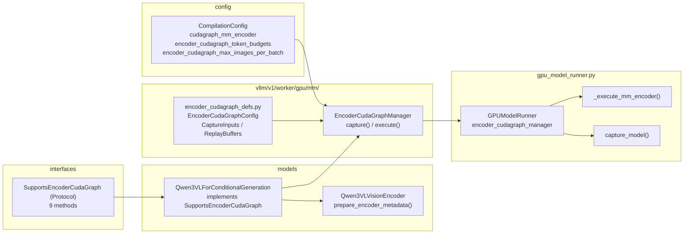
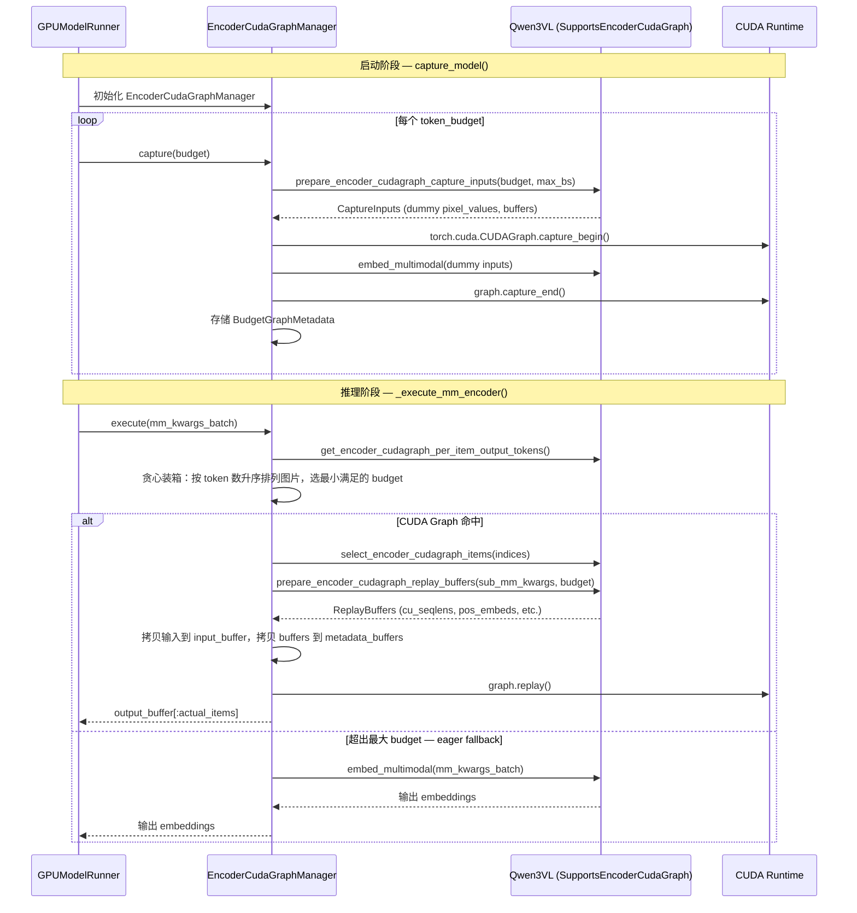
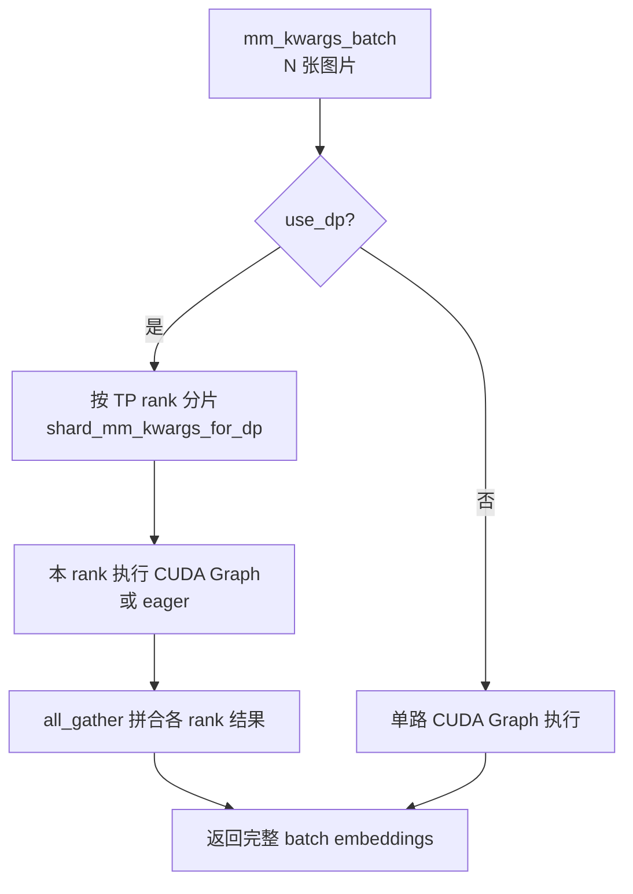

# PR #35963: [Feature] ViT Full CUDA Graph

> **作者**: @b-mu (Baorun Lauren Mu) | **状态**: OPEN | **日期**: 2026-03-04
> **Branch**: `bmu/vit-full-cudagraph-with-dp-fi` → `main` | **Labels**: `v1`, `multi-modality`, `qwen`, `nvidia`
> **变更规模**: +1495 -33 行，涉及 7 个文件

---

## 1. 总结 (Summary)

本 PR 为 vLLM 的视觉编码器（ViT）引入了完整的 **CUDA Graph** 支持，通过预先捕获 ViT 的完整前向计算图来消除逐 kernel 的启动开销，大幅降低多模态推理的 ViT 编码延迟。核心设计是基于「令牌预算（token budget）」的图捕获 + 贪心装箱（greedy bin-packing）调度，并通过 `SupportsEncoderCudaGraph` 协议实现了完全模型无关的管理器（`EncoderCudaGraphManager`），使其可被不同 ViT 模型复用。当前已在 `Qwen3VL` 上完成了协议实现，实测单卡延迟降低约 6–8%，4 卡 DP 场景降低约 38%。

---

## 2. 背景与动机 (Background & Motivation)

在多模态推理场景中，ViT 对每一张图片需要执行大量 CUDA kernel（Attention、FFN、位置编码等）。不同于 LLM 解码路径已经有 CUDA Graph 加速，ViT 前向每次都是动态执行的，存在大量 kernel 启动开销（尤其在 batch 中图片数量较多时）。

**具体痛点**：
- ViT 的输入形状（token 数）随图片分辨率变化，直接 CUDA Graph 捕获面临"输入形状不固定"问题。
- 多 GPU（TP）环境下，ViT 可以以数据并行（DP）模式独立运行，加速潜力更大，但协调复杂。
- 现有 `mm_encoder` 路径（`_execute_mm_encoder`）只有 eager 执行，没有任何图优化。

本 PR 通过引入「按预算捕获 + 填充输入至固定大小」的策略，解决了输入形状不固定的核心障碍。

---

## 3. 代码修改分析 (Code Change Analysis)

### 3.1 修改的模块

| 文件 | 操作 | 说明 |
|------|------|------|
| `vllm/config/compilation.py` | 修改 | 新增 3 个编译配置字段，用于开启和参数化 ViT CUDA Graph |
| `vllm/model_executor/models/interfaces.py` | 修改 | 新增 `SupportsEncoderCudaGraph` Protocol，定义 9 个协议方法 |
| `vllm/model_executor/models/qwen3_vl.py` | 修改 | 实现 `SupportsEncoderCudaGraph` 协议；重构 `forward` → `prepare_encoder_metadata` + `forward` |
| `vllm/v1/worker/gpu/mm/encoder_cudagraph_defs.py` | 新增 | 三个数据类：`EncoderCudaGraphConfig`、`EncoderCudaGraphCaptureInputs`、`EncoderCudaGraphReplayBuffers` |
| `vllm/v1/worker/gpu/mm/encoder_cudagraph.py` | 新增 | 核心管理器 `EncoderCudaGraphManager`：捕获、回放、贪心装箱、DP 分片 |
| `vllm/v1/worker/gpu_model_runner.py` | 修改 | 在 V1 ModelRunner 中集成管理器，在 `capture_model()` 和 `_execute_mm_encoder()` 阶段接入 |
| `tests/v1/cudagraph/test_encoder_cudagraph.py` | 新增 | 单元测试（预算选择、统计）+ GPU 测试（捕获、回放、fallback、DP） |

### 3.2 架构图 (Architecture Diagram)

#### 整体模块依赖关系

#### 运行时执行流程

#### DP（数据并行）分片流程

### 3.3 关键实现细节 (Key Implementation Details)

**配置层（`compilation.py`）**
- 新增 `cudagraph_mm_encoder: bool`、`encoder_cudagraph_token_budgets: list[int]`、`encoder_cudagraph_max_images_per_batch: int` 三个字段。
- `__post_init__` 中增加校验：启用时必须提供非空的 budgets 列表，max_images 必须为正数。

**协议层（`interfaces.py` — `SupportsEncoderCudaGraph`）**
- 9 个协议方法，覆盖：配置获取、batch 大小查询、per-item token/patch 数查询、items 子集选取、捕获输入准备、回放缓冲区准备、前向执行。
- `@runtime_checkable` + `ClassVar[Literal[True]] = True` 允许用 `isinstance` 快速检查，避免通过 `__getattr__` 转发无法匹配的问题。

**数据类层（`encoder_cudagraph_defs.py`）**
- `EncoderCudaGraphConfig`：模型在初始化时提供，描述支持的 modality、input_key、buffer_keys、output hidden size。
- `EncoderCudaGraphCaptureInputs`：捕获阶段用，包含 dummy mm_kwargs 和预计算 buffers。
- `EncoderCudaGraphReplayBuffers`：回放阶段每次生成，包含要拷贝进捕获 buffers 的新数据（`None` 表示保持不变）。

**管理器层（`encoder_cudagraph.py` — `EncoderCudaGraphManager`）**
- **捕获**：对每个 budget 分别用全零 dummy 输入 capture 完整 ViT forward。使用 `torch.cuda.CUDAGraph`，捕获期间记录 `input_buffer`、`metadata_buffers`、`output_buffer` 的张量地址。
- **贪心装箱**：执行时将图片按 output token 数升序排列，不断找最小满足 budget；每个 budget 图最多处理 `max_batch_size` 张图，超限时新开一个 graph 调用（同 budget 的多次回放）或拆分成多个子 batch。
- **Buffer 更新 + Replay**：replay 前先 `zero_()` 所有 metadata buffers，再 `copy_` 实际数据（保持张量地址不变，符合 CUDA Graph 要求）。
- **DP 支持**：`use_dp=True` 时，按 TP rank 对 items 均分，每个 rank 独立执行 graph，最后 `dist.all_gather` 合并结果。
- **Fallback 逻辑**：total tokens > 最大 budget 时自动降级为 eager 模式，`graph_misses` 计数，每 100 次记录 hit/miss 统计日志。
- **FlashInfer cuDNN 支持**：捕获时覆盖 FlashInfer buckets 为 `[token_budget]`，确保 cuDNN 注意力在 replay 时使用与捕获时相同的 bucket 配置。

**模型层（`qwen3_vl.py`）**
- `Qwen3VLVisionEncoder` 新增 `prepare_encoder_metadata()` 公共方法，将 cu_seqlens、pos_embeds、rotary_pos_emb 等元数据计算从 `forward` 中抽离，供 eager/capture/replay 三条路径共用。
- `Qwen3VLForConditionalGeneration` 实现协议的 9 个方法，包括：pixel_values 的拼接 patch 切片（`select_encoder_cudagraph_items`）、dummy 输入生成（`prepare_encoder_cudagraph_capture_inputs`）、回放缓冲区生成（`prepare_encoder_cudagraph_replay_buffers`）。

**集成层（`gpu_model_runner.py`）**
- `capture_model()` 中，通过 `get_model()`（unwrap CUDAGraphWrapper）调用 `supports_encoder_cudagraph(raw_model)` 检查，若支持则初始化 `EncoderCudaGraphManager` 并立即 capture 所有 budgets。
- `_execute_mm_encoder()` 中，优先尝试 CUDA Graph 执行，失败或不支持则回退到 `model.embed_multimodal(**mm_kwargs_batch)`。

---

## 4. 涉及的技术原理 (Technical Principles)

### 4.1 CUDA Graph

CUDA Graph 允许将一系列 CUDA 操作（kernel 启动、内存拷贝等）录制为一个有向无环图，后续通过 `graph.replay()` 一次性提交，绕过 CPU-GPU 同步和逐 kernel 调度开销。对于推理中计算图固定、输入形状稳定的模块（如固定 batch size 的 LLM decode 步骤、固定 token 数的 ViT forward）效果显著。

**关键约束**：
- 被捕获的 kernel 使用的张量地址在 replay 时必须不变——只能原地修改（`copy_`、`zero_`），不能重新分配。
- 不能在 capture 期间做 Python 控制流（if/for 等依赖运行时值的分支）。

### 4.2 Token Budget 策略

由于不同图片分辨率导致 ViT 输入 token 数不同，无法为每种 token 数都捕获一个图。本 PR 的方案：
- 预先定义若干 budget 级别（如 `[512, 1024, 2048, 4096]`），每个 budget 对应一张捕获好的 CUDA Graph。
- 输入不足 budget 时，对 `cu_seqlens` 等元数据进行 **padding**，使其满足捕获时的固定形状。
- 运行时贪心选择「最小满足当前 batch total tokens」的 budget，减少 padding 浪费。

### 4.3 贪心装箱（Greedy Bin-Packing）

将 batch 中的图片按 token 数升序排序，逐图贪心累加：只要累计 token 数 ≤ budget 且图片数 ≤ max_batch_size，就打包在一起回放同一张图。否则开始新的一组。目标是最大化单次 graph replay 覆盖的图片数，减少总的 replay 次数。

### 4.4 ViT 数据并行（DP）与 Tensor 并行（TP）

vLLM 支持 `mm_encoder_tp_mode=data`：多个 TP rank 各自独立处理不同图片，最后 all_gather 合并结果。这与 LLM 的 Tensor 并行（同一层权重在多 rank 间切分）不同——ViT DP 下每个 rank 持有完整的 ViT 权重副本，只是处理的图片不同。DP 场景下，CUDA Graph 对每个 rank 独立 capture 和 replay，本质上是对 ViT 做了"数据级流水"优化。

### 4.5 Qwen3-VL 的 MRoPE 与 ViT RoPE

Qwen3-VL 使用 3D Rotary Position Embedding（M-RoPE）处理时序（T）、高度（H）、宽度（W）三维位置信息。ViT 的 RoPE 计算涉及 `cu_seqlens`（累积序列长度），在 CUDA Graph 捕获时需要固定形状，因此需要对其进行 padding 并在 capture 时传入 `max_seqlen_override` 覆盖最坏情况的序列长度。这部分逻辑高度 Qwen3-VL 特定，也是评论区讨论的核心问题。

### 4.6 FlashInfer cuDNN Attention

FlashInfer 在 CUDA Graph 路径下需要预先固定 attention 的 bucket 大小。本 PR 在 capture 时覆盖 FlashInfer 的 bucket 为 `[token_budget]`，确保捕获和 replay 时 cuDNN Fused Attention kernel 的选择（内核配置）一致，避免 replay 时 dispatch 到不同 kernel 导致地址/参数不匹配。

---

## 5. 评论区讨论亮点 (Discussion Highlights)

### 核心争议：管理器是否过于 Qwen3-VL 特定？

**Isotr0py（vLLM Member）** 的首要关切：

> "I feel current implementation is too qwen3vl-specific (MRoPE + ViT RoPE), and it's difficult to broadcast this CG support to other ViTs."

**具体担忧**：
1. `gpu_model_runner.py` 中硬编码了特定的 `mm_kwargs` key 名，其他模型的 kwargs 命名不同会无法适配。
2. CG manager 内部直接包含了 dummy input 生成逻辑，这应该属于各模型自己的 `DummyInputsBuilder`。

**b-mu 的响应与设计演化**：

PR 作者采纳了这一意见，引入了 `SupportsEncoderCudaGraph` Protocol 做了架构重构：
- Manager 完全模型无关——所有模型特定逻辑（grid config、dummy inputs、embedding 计算）移入实现协议的模型类（`qwen3_vl.py`）。
- `gpu_model_runner.py` 改为通过 `mm_kwargs_batch` 和 `self.encoder_cudagraph_manager.supports_modality(modality)` 调用，不再依赖具体 key 名。
- Dummy input 生成通过协议方法 `prepare_encoder_cudagraph_capture_inputs()` 委托给模型。

### 代码质量建议：抽取 `prepare_encoder_metadata`

**Isotr0py** 指出 `qwen3_vl.py:621` 处的 `cu_seqlens`/`max_seqlen` 计算在 eager forward、capture、replay 三处重复：

> "I think we can add a `prepare_encoder_metadata` method to avoid duplicated implementation."

**b-mu** 随即添加了 `prepare_encoder_metadata()` 辅助方法，三条路径统一复用，有效减少了代码重复。

### Gemini Code Assist 自动 Review（整体正面）

> "This is a high-quality contribution that brings a significant performance enhancement."

同时指出因 PR 体量过大，安全审查未能运行。

### 当前状态

- PR 存在 merge conflicts（多次被 mergify bot 提示），需要 rebase。
- Pre-commit check 曾报错，已修复。
- 13 位 reviewer 被请求审查（含 vLLM 核心成员 WoosukKwon、njhill、youkaichao 等），目前尚无 Approved 状态的 review。

---

## 6. 风险与潜在问题 (Risk Analysis)

| 风险 | 严重程度 | 说明 |
|------|---------|------|
| **模型通用性受限** | Medium | 尽管引入了 Protocol，当前只有 Qwen3-VL 实现。其他 ViT 模型（LLaVA、InternVL 等）需要各自实现 9 个协议方法，实现成本不低，迁移难度未充分验证。 |
| **Buffer 地址变化导致 replay 崩溃** | High | CUDA Graph replay 要求所有 tensor 地址不变。若模型在 replay 路径中意外分配新 tensor（而非原地写入），会导致 replay 使用了旧地址的数据，出现静默数据错误或 CUDA 崩溃。需严格保证 `input_buffer`、`metadata_buffers`、`output_buffer` 的 identity 稳定。 |
| **贪心装箱拆分 batch 导致语义错误** | Medium | 当 batch 超过 max_batch_size 时会被拆分为多个子 batch 分次 replay，若拆分逻辑中 indices 计算有误，可能导致图片 embedding 错位（张冠李戴）。当前逻辑复杂，需要仔细验证多图片场景。 |
| **DP gather 正确性** | Medium | `all_gather` 后的 embedding 拼接需要与原始 batch 顺序严格对应。若各 rank 的 item 分配不均（余数处理），拼接顺序可能产生偏差，导致图片与序列位置不匹配。 |
| **FlashInfer bucket 覆盖副作用** | Medium | 在 capture 时强制覆盖 FlashInfer buckets 为 `[token_budget]`，可能影响其他使用 FlashInfer 的路径（如 LLM decode）的 bucket 配置。需确认 bucket 覆盖是局部/临时的，不会污染全局状态。 |
| **Padding 引入的计算浪费** | Low | 当实际 token 数远小于 budget 时（如 100 个 token 使用 4096 budget），填充的零向量仍会参与部分 kernel 计算（attention mask 等），增加不必要的计算量。选择合理的 budget 间隔很重要，文档应有指导。 |
| **测试覆盖不足** | Low | 现有测试以 mock/unit 为主，端到端 ViT 功能正确性（输出 embedding 是否与 eager 完全一致）的 GPU 测试依赖实际硬件（GB200）环境，CI 中可能无法覆盖，存在回归风险。 |
| **merge conflicts 悬而未决** | Low | PR 目前有 merge conflicts，需要 rebase 后才能合入，随着主分支持续演进，冲突可能进一步扩大。 |

---

## 7. 结论 (Conclusion)

PR #35963 是一个设计思路清晰、性能收益显著的功能性 PR，通过 budget-based CUDA Graph + Protocol 架构，在兼顾模型通用性的同时为 Qwen3-VL 带来了实质性的多模态编码加速（单卡 ~7%，4 卡 DP ~38%）。主要待改进点是需要解决现有 merge conflicts、等待核心成员对 Protocol 设计通用性的最终认可，以及补充端到端正确性回归测试；最终合入后预计会成为 vLLM V1 多模态性能的重要基础组件。
