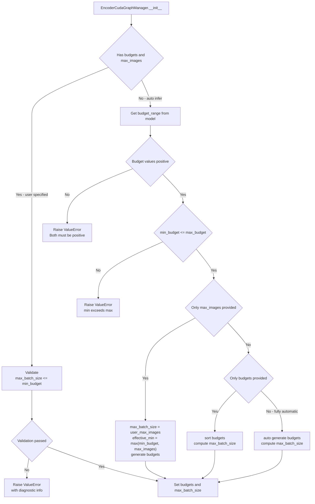
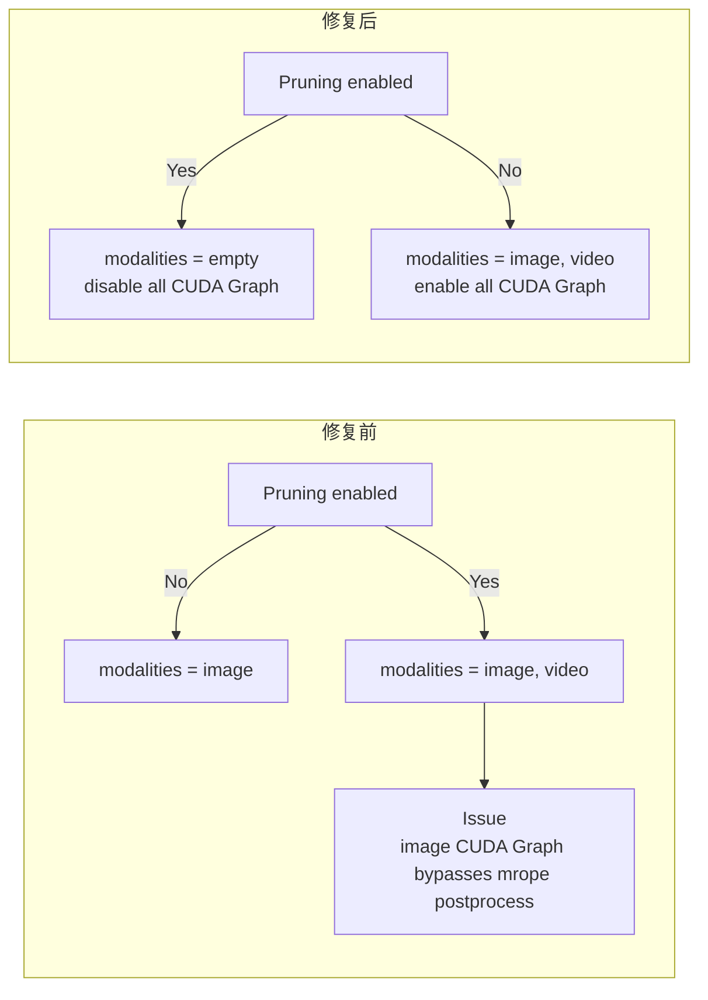

# PR #38040: [Fix] Misc Fixes in ViT CUDA Graph

> **Author**: @b-mu (Baorun Lauren Mu) | **State**: MERGED | **Date**: 2026-03-24 (merged 2026-05-14)
> **Branch**: `bmu/vit-full-cudagraph-fix-auto-infer-invariant` → `main` | **Labels**: `performance`, `ready`, `v1`, `multi-modality`, `qwen`, `nvidia`
> **Changes**: +242 -21 lines across 4 files

---

## 1. 总结 (Summary)

本 PR 是 PR #35963（ViT Full CUDA Graph）的修复补丁，解决了三个在 ViT CUDA Graph 启用后暴露的 Bug：① `max_batch_size` 在自动推断时可能超过 `min_token_budget`，导致 `per_image_output = 0`，进而触发空张量 reshape 崩溃；② 整数除法取整（floor）导致非整除场景下 buffer 分配不足；③ Qwen3-VL 开启 EVS pruning 时 CUDA Graph 路径绕过了 `embed_multimodal` 的后处理逻辑，导致 image 和 video embedding 格式与 eager 不一致。修复同时为 7 种配置路径新增了完整的单元测试，覆盖所有不变量边界。

---

## 2. 背景与动机 (Background & Motivation)

PR #35963 为 vLLM 的 ViT 引入了 CUDA Graph 加速，通过 `EncoderCudaGraphManager` 自动化管理 graph capture 和 replay。但在实际部署（Qwen3-VL-32B-Instruct, 4×GB200 NVLink）中发现了几个隐蔽的配置与正确性 bug：

1. **自动推断的 `max_batch_size` 违反不变量 `max_batch_size <= min_token_budget`**：当 `max_budget // min_budget` 大于 `min_budget` 时，`per_image_output = token_budget // max_batch_size = 0`，导致 `Qwen3_VisionPatchEmbed.forward` 对空张量执行 reshape 时报错崩溃。
2. **`per_mm_item_output` 使用 floor 除法**：当 `token_budget` 不能被 `max_batch_size` 整除时，buffer 分配偏小，可能导致 replay 时越界写。
3. **Qwen3-VL EVS pruning 模式下 CUDA Graph 不一致**：原代码只在 EVS 开启时禁用 video 的 CUDA Graph，但实际上 image embedding 同样会被 `embed_multimodal` 后处理（追加 mrope 位置），导致 CUDA Graph 输出格式与 eager 不兼容。

这些问题都是在上线前的实际测试中暴露的，修复对于 **ViT CUDA Graph 在生产环境的稳定运行** 至关重要。

---

## 3. 代码修改分析 (Code Change Analysis)

### 3.1 修改的模块

| 文件 | 操作 | 说明 |
|------|------|------|
| `vllm/v1/worker/encoder_cudagraph.py` | 修改 | 核心修复：重构 `__init__` 中 budget / max_batch_size 推断逻辑，分 4 条路径各自保证不变量 |
| `vllm/model_executor/models/qwen3_vl.py` | 修改 | ① 禁用 pruning 时所有模态的 CUDA Graph；② `per_mm_item_output` 改用 ceil 除法 |
| `vllm/config/compilation.py` | 修改 | 新增 `encoder_cudagraph_token_budgets` 的正值校验 |
| `tests/v1/cudagraph/test_encoder_cudagraph.py` | 修改 | 新增 114 行测试（13 个用例），覆盖 7 种配置路径的边界条件 |

### 3.2 核心逻辑流程图

#### encoder_cudagraph.py `__init__` 重构后的四条配置路径



#### Qwen3-VL pruning + CUDA Graph 互斥逻辑变更



### 3.3 关键实现细节

**`encoder_cudagraph.py` — `__init__` 不变量强制 (核心修复)**

修复前，代码只有一个简单的三元表达式：

```python
# 修复前
self.max_batch_size = (
    user_max_vision_items
    if user_max_vision_items > 0
    else max_budget // min_budget
)
```

这个 `max_budget // min_budget` 可以任意大，导致 `per_image_output = budget // max_batch_size = 0`。

修复后，分 4 条路径分别处理：

- **完全用户指定**：直接校验 `max_batch_size <= min_budget`，不通过则抛出带诊断信息的 `ValueError`
- **用户仅提供 `max_images`**：`effective_min = max(min_budget, user_max_images)`，从 `effective_min` 起生成 budgets，确保 `min(budgets) >= max_batch_size`
- **用户仅提供 budgets**：`max_batch_size = min(max_budget // min_budget, min(user_budgets))`，自动 cap
- **完全自动推断**：`max_batch_size = min(max_budget // min_budget, min(auto_budgets))`，同样自动 cap

同时新增 model budget range 的合法性校验（正值 & min ≤ max）。

**`qwen3_vl.py` — pruning 时禁用全部模态的 CUDA Graph**

```python
# 修复前
modalities = ["image"]
if not self.is_multimodal_pruning_enabled:
    modalities.append("video")

# 修复后
modalities = [] if self.is_multimodal_pruning_enabled else ["image", "video"]
```

原因：EVS pruning 启用时，`embed_multimodal` 会对 image 也追加 mrope 位置信息，但 CUDA Graph 路径直接使用 `Qwen3_VisionPatchEmbed` 的输出，格式不一致。

**`qwen3_vl.py` — `per_mm_item_output` 使用 ceil 除法**

```python
# 修复前
per_mm_item_output = token_budget // max_batch_size

# 修复后
per_mm_item_output = (token_budget + max_batch_size - 1) // max_batch_size
```

当 budget 不能被 `max_batch_size` 整除时（如 budget=5, max_batch_size=2），原来的 `5 // 2 = 2` 会少分配一个 token 的空间，导致 buffer 不够用。

**`compilation.py` — 新增 token_budgets 正数校验**

```python
if self.encoder_cudagraph_token_budgets and any(
    b <= 0 for b in self.encoder_cudagraph_token_budgets
):
    raise ValueError(...)
```

**测试覆盖 — `TestInitInvariantValidation`**

新增 13 个纯 CPU 测试用例，覆盖 7 种关键场景：
1. 完全自动推断（正常范围 & 窄范围）
2. 用户指定的非法组合抛出 `ValueError`
3. 用户指定的合法/边界组合
4. 仅提供 `max_images`（大于 & 小于 min_budget）
5. 仅提供 budgets（触发修复的核心场景）
6. model budget range 异常（零/负/倒置）
7. 用户 budgets 含非正值（零/负）

---

## 4. 涉及的技术原理 (Technical Principles)

### 4.1 CUDA Graph 不变量：`max_batch_size <= min_token_budget`

ViT CUDA Graph 对每个 token budget 单独 capture 一张图。执行时，每张图片的 `per_image_output = token_budget // max_batch_size` 决定了图内部为该图保留的 token buffer 大小。

- 若 `max_batch_size > min_budget`，则 `per_image_output = 0`，意味着 buffer 维度为 0，后续的 reshape/flatten 操作会直接在空张量上报错
- 正确的设计是 `max_batch_size <= min_budget`，即 batch 中最多装的图片数不超过最小 budget 能提供的每图 token 数

### 4.2 Qwen3-VL EVS Pruning 与 CUDA Graph 不兼容

Qwen3-VL 的 EVS (Efficient Video Sampling) pruning 是数据依赖的：根据帧间差异动态移除冗余 token，因此每个样本的最终 token 数在运行时才确定。

CUDA Graph 要求固定张量形状，因此无法直接支持动态 token 移除。原代码只考虑了 video 路径（EVS 主要针对视频），但实际上 `embed_multimodal` 对 image 也做了后处理（追加 mrope 位置信息），而 CUDA Graph 使用 `Qwen3_VisionPatchEmbed.forward` 直接输出，跳过了这部分。这导致两种路径下 embedding 的格式不一致（维度对齐错误或位置信息缺失）。

### 4.3 Ceil vs Floor 除法

```python
per_mm_item_output = (budget + batch_size - 1) // batch_size  # ceil
# vs
per_mm_item_output = budget // batch_size                      # floor
```

ceil 确保了 buffer 在最坏情况（某张图的实际 token 数大于平均分配值）下仍然有足够空间。Floor 会低估需求，导致 buffer 越界写。

---

## 5. 评论区讨论亮点 (Discussion Highlights)

### Gemini Code Assist 指出 token_budgets 正数校验缺失（已被采纳）

Gemini Code Assist bot 在首次提交时即发现两处 `user_budgets` 使用路径中缺少正数校验：

> "If a user provides a non-positive budget (e.g., `[0, 128]`), `min(self.token_budgets)` could be zero or negative. This can lead to a `ZeroDivisionError` later during CUDA graph capture preparation."

作者 **b-mu** 采纳建议，在 `vllm/config/compilation.py` 的 `__post_init__` 中统一添加了校验，而非在 `encoder_cudagraph.py` 中分散校验。

### wangshangsam 建议使用 Pydantic PositiveInt 类型（未被采纳）

> "I feel that the better way to handle this is through pydantic (cuz ultimately this is an input validation problem)"

建议在 `CompilationConfig` 中将 `encoder_cudagraph_token_budgets` 定义为 `list[PositiveInt]`。但最终作者选择了显式 `ValueError` 校验，原因可能是 `CompilationConfig` 使用 `@dataclass` 而非 Pydantic model。

### 评审过程

- **2026-03-24**: PR 提交，Gemini Code Assist 自动 review 提出正数校验建议
- **2026-03-25**: **wangshangsam** 评论（已解决）
- **2026-03-26**: mergify bot 提示需要 rebase（merge conflicts）
- **2026-03-27**: 作者回应所有 review 意见，**Isotr0py** 和 **wangshangsam** 均 Approved
- **2026-05-06**: 作者 rebase 并新增两个修复（pruning + ceil），**Isotr0py** 再次 Approved 并请求 force merge
- **2026-05-14**: 成功合入 main

---

## 6. 风险与潜在问题 (Risk Analysis)

| 风险 | 严重程度 | 说明 |
|------|---------|------|
| **Ceil 除法的 over-allocation** | Low | `per_mm_item_output` 改为 ceil 后，最坏情况每个 item 多分配 `max_batch_size - 1` 个 token slot，内存开销微不足道，但需确认 pad 区域不会参与实际计算或产生 NaN。 |
| **Pruning 禁用 CUDA Graph 导致性能回退** | Low | EVS pruning 开启时完全禁用 ViT CUDA Graph，可能影响剪枝用户的编码延迟。但这是正确性优先的权衡，后续可探索支持动态 token 数的 CUDA Graph 方案。 |
| **自动推断路径的 silent 调整** | Medium | 当 `max_batch_size` 被自动 cap 到 `min(budgets)` 时，用户可能不会察觉 `max_batch_size` 的实际值小于预期，导致吞吐低于预期。建议 `logger.warning` 提示。 |
| **测试覆盖：无 GPU 测试** | Low | 新增测试均为 CPU mock，不涉及实际 CUDA Graph capture/replay。critical path 的端到端验证依赖于开发者的本地 GPU 环境测试（4×GB200 NVLink），CI 无法覆盖。 |

---

## 7. 结论 (Conclusion)

PR #38040 是 PR #35963（ViT Full CUDA Graph）的必要补丁，修复了自动配置推断中的关键不变量违反和 Qwen3-VL pruning 模式下的正确性 bug，同时提升了输入校验的完备性和 buffer 分配的准确性。代码改动聚焦、逻辑清晰，新增测试覆盖完全，经过两轮 review 后成功合入。该修复使得 ViT CUDA Graph 功能在 Qwen3-VL 上达到生产就绪状态，实测 ViT Full CUDA Graph 在 Qwen3-VL-32B-Instruct (4×GB200 NVLink) 上相比 eager 基线带来约 20% 的 P99 编码延迟改善。
