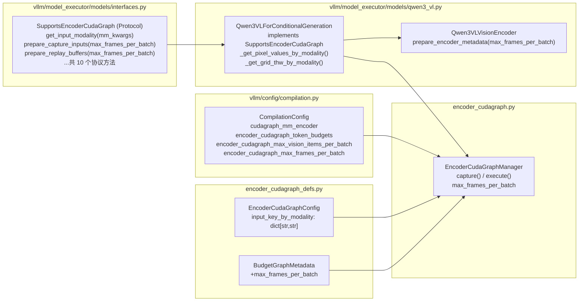
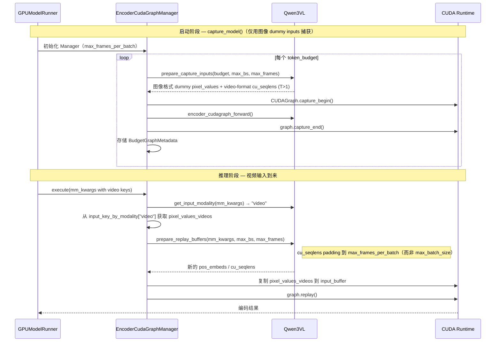

# PR #38061: Support ViT full CUDA graph for Qwen3-VL video inference

> **作者**: @shen-shanshan (Shanshan Shen) | **状态**: MERGED | **日期**: 2026-04-14
> **Branch**: `vit-cg` → `main` | **Labels**: `performance`, `documentation`, `v1`, `multi-modality`, `qwen`, `nvidia`
> **变更规模**: +583 -68 行，涉及 7 个文件

---

## 1. 总结 (Summary)

本 PR 在 PR #35963（仅支持图像推理的 ViT CUDA Graph）基础上，将 Encoder CUDA Graph 框架扩展以支持 **Qwen3-VL 的视频推理**。核心挑战在于：视频输入中每个视频 item 包含 T 帧，每帧对应一个独立的注意力序列，导致 `cu_seqlens` 缓冲区大小不能再简单地用 `max_batch_size` 来 padding，必须引入 `max_frames_per_batch` 维度；同时，视频（`pixel_values_videos` + `video_grid_thw`）和图像（`pixel_values` + `image_grid_thw`）使用不同的输入键，需要对管理器和协议层进行模态感知改造。最终，图像和视频通过**同一个 CUDA Graph Manager 和同一套捕获计算图**来处理，P99 尾延迟降低 60%~88%。

---

## 2. 背景与动机 (Background & Motivation)

### 前序工作

PR #35963 为 vLLM v1 引入了 `EncoderCudaGraphManager`，通过对 ViT 编码器进行「按 token budget 预捕获 + 贪心装箱（greedy bin-packing）回放」的策略，消除了逐 kernel 的启动开销，实现了图像推理的端到端 CUDA Graph 加速。

### 视频推理的新挑战

图像推理中，一张图片贡献 **1 个注意力序列**（1 行 `cu_seqlens`）；而视频推理中，一个视频贡献 **T 帧 = T 个注意力序列**（T 行 `cu_seqlens`）。若直接沿用图像模式对 `cu_seqlens` 只 padding 到 `max_batch_size`，视频回放时将**溢出缓冲区**（`num_seqs = sum(T_i) > max_batch_size`）。

此外，视频引入了：

- **不同的输入键**：图像用 `pixel_values` / `image_grid_thw`，视频用 `pixel_values_videos` / `video_grid_thw`，管理器原先只支持单一 `input_key`。
- **EVS（Efficient Video Sampling）约束**：EVS 是 Qwen3-VL 的视频帧间动态剪枝技术，保留的 token 数在运行时根据帧间差异动态决定——这使得 token 数量**数据依赖**，无法在捕获时固定，与 CUDA Graph 的静态输入要求不兼容。

---

## 3. 代码修改分析 (Code Change Analysis)

### 3.1 修改的模块

| 文件 | 变更规模 | 说明 |
| --- | --- | --- |
| `vllm/config/compilation.py` | +21 -3 | 新增 `encoder_cudagraph_max_frames_per_batch` 配置项；将 `encoder_cudagraph_max_images_per_batch` 重命名为 `encoder_cudagraph_max_vision_items_per_batch` |
| `vllm/model_executor/models/interfaces.py` | +10 -1 | Protocol 新增 `get_input_modality(mm_kwargs)` 方法；`prepare_encoder_cudagraph_capture_inputs()` 和 `prepare_encoder_cudagraph_replay_buffers()` 新增 `max_frames_per_batch` 参数 |
| `vllm/model_executor/models/qwen3_vl.py` | +159 -47 | 实现 `get_input_modality()`；新增 `_get_pixel_values_by_modality()` 和 `_get_grid_thw_by_modality()` 辅助方法；更新 capture/replay 逻辑支持视频格式；EVS 检测动态控制视频 CG 开关 |
| `vllm/v1/worker/encoder_cudagraph.py` | +32 -10 | `BudgetGraphMetadata` 增加 `max_frames_per_batch` 字段；Manager 初始化和捕获/回放流程更新为模态感知路由 |
| `vllm/v1/worker/encoder_cudagraph_defs.py` | +5 -2 | `EncoderCudaGraphConfig` 将 `input_key: str` 改为 `input_key_by_modality: dict[str, str]` |
| `docs/design/cuda_graphs_multimodal.md` | +59 -11 | 补充视频推理使用指南、支持模型表格、限制说明 |
| `tests/v1/cudagraph/test_encoder_cudagraph.py` | +316 行 | 新增 `SimpleMockViTVideoModel`（双模态 mock）、`TestGetInputModality`（CPU 测试）和 `TestEncoderCudaGraphVideoReplay`（GPU 测试） |

### 3.2 架构 / 流程图

#### 整体模块依赖关系



#### 视频推理执行流程（运行时）



### 3.3 关键实现细节

#### 1. `input_key_by_modality` 替换 `input_key`

```python
# Before (PR #35963)
input_key: str  # e.g. "pixel_values"

# After (PR #38061)
input_key_by_modality: dict[str, str]
# e.g. {"image": "pixel_values", "video": "pixel_values_videos"}
```

#### 2. `get_input_modality()` 协议方法

```python
def get_input_modality(self, mm_kwargs: dict[str, Any]) -> str:
    if "image_grid_thw" in mm_kwargs:
        return "image"
    return "video"
```

Manager 在回放时通过此方法决定从哪个键读取输入 tensor，实现了管理器对模态的透明处理。

#### 3. `cu_seqlens` 的 padding 策略

```python
# qwen3_vl.py - prepare_encoder_metadata()
pad_to = (
    max_frames_per_batch   # 视频：按总帧数 padding
    if max_frames_per_batch is not None
    else max_batch_size    # 图像：按 item 数 padding
)
```

这是解决视频 `cu_seqlens` 溢出的核心修复。

#### 4. 视频格式 capture grid 构建

```python
frames_per_item = max_frames_per_batch // max_batch_size
if frames_per_item > 1:
    # Video-format: T > 1，使 cu_seqlens 缓冲区在捕获时就足够大
    tokens_per_frame = (per_mm_item_output + frames_per_item - 1) // frames_per_item
    grid_config = [
        [frames_per_item, spatial_merge_size, tokens_per_frame * spatial_merge_size]
        for _ in range(max_batch_size)
    ]
else:
    # Image-format: T = 1
    grid_config = [
        [1, spatial_merge_size, per_mm_item_output * spatial_merge_size]
        for _ in range(max_batch_size)
    ]
```

#### 5. EVS 约束的自动处理

```python
def get_encoder_cudagraph_config(self):
    modalities = ["image"]
    # EVS 启用时 token 数据依赖 → 视频 CG 自动禁用
    if not self.is_multimodal_pruning_enabled:
        modalities.append("video")
    return EncoderCudaGraphConfig(
        modalities=modalities,
        input_key_by_modality={
            "image": "pixel_values",
            "video": "pixel_values_videos",
        },
        ...
    )
```

---

## 4. 技术难点深度解析 (Technical Challenges)

### 难点一：视频 cu_seqlens 缓冲区的设计

CUDA Graph 的核心约束是**所有 tensor 形状在捕获时必须固定**。`cu_seqlens` 是 Flash Attention 中的关键元数据，其长度等于 batch 中**注意力序列数 + 1**。

- **图像**：每个 item 1 帧 = 1 个注意力序列，所以 `len(cu_seqlens) = max_batch_size + 1`。
- **视频**：每个 item 有 T 帧，每帧 1 个注意力序列，所以 `len(cu_seqlens) = sum(T_i) + 1`，**最大可达 `max_frames_per_batch + 1`**。

如果在视频回放时沿用图像的 `cu_seqlens` buffer（size = max_batch_size + 1），当 `sum(T_i) > max_batch_size` 时会发生越界写入，导致崩溃或数据污染。解决方案是引入新参数 `max_frames_per_batch` 专门控制视频场景的 buffer 大小。

### 难点二：图像与视频共享同一套 CUDA Graph

直觉上，图像和视频使用不同的输入键和不同大小的 `cu_seqlens`，似乎应该捕获两套 CUDA Graph。但关键洞察是：**Qwen3-VL 的图像和视频在 patch 层面形状完全相同**（都经过同一个 `PatchEmbed`，每个 patch 的 shape 均为 `[C*T*P*P]`，其中 T=1 for image）。

因此可以：

1. 用**图像格式的 dummy inputs** 捕获 CUDA Graph（`pixel_values` 形状 `[total_patches, C*P*P]`）。
2. 视频回放时，将 `pixel_values_videos`（形状完全相同）**直接 copy 到同一个 `input_buffer`** 上执行 replay。
3. 通过在捕获时使用 **video-format grid_config（T>1）** 使 `cu_seqlens` 缓冲区在捕获阶段就足够大，视频回放不会溢出。

这个设计节省了 GPU 显存（不需要双倍的 CUDA Graph buffer），也减少了捕获耗时。

### 难点三：EVS 剪枝与 CUDA Graph 的不兼容性检测

EVS（Efficient Video Sampling）在视频推理中根据帧间差异动态选择需要保留的 token，使得同一配置下不同输入的 token 数量不同（数据依赖），直接破坏了 CUDA Graph"输入形状固定"的前提。

处理方案是在 `get_encoder_cudagraph_config()` 中通过 `self.is_multimodal_pruning_enabled` 动态决定是否在 `modalities` 列表中包含 `"video"`。当 Manager 初始化时，若 `"video"` 不在支持的 modality 列表中，视频输入将自动 fallback 到 eager 执行，无需用户手动干预。

### 难点四：协议层的向后兼容性改造

在已有图像 CUDA Graph（PR #35963）的基础上扩展视频支持，需要同时对 Protocol、Manager、Config 三层进行修改，同时保持现有的图像路径不受影响：

- `SupportsEncoderCudaGraph` Protocol 新增方法必须不破坏已有实现。
- Manager 对 `input_key` 的硬编码 → `input_key_by_modality` 字典查找 + 运行时路由，需在捕获路径（固定用 `"image"`）和回放路径（动态查询 `get_input_modality()`）采用不同策略。
- 配置字段重命名（`max_images_per_batch` → `max_vision_items_per_batch`）需同步更新文档和测试。

---

## 5. 技术亮点 (Technical Highlights)

### 亮点一：显著的 P99 尾延迟优化

| 场景 | 后端 | Eager P99 | CG P99 | 改善幅度 |
| --- | --- | --- | --- | --- |
| 单卡 Qwen3-VL-8B (1×A100) | FLASH_ATTN | 17.03 ms | 6.53 ms | **↓ 61.7%** |
| 单卡 Qwen3-VL-8B (1×A100) | FLASHINFER | 58.62 ms | 7.27 ms | **↓ 87.6%** |
| 多卡 Qwen3-VL-32B (4×A100 TP=4) | FLASH_ATTN | 51.25 ms | 8.60 ms | **↓ 83.2%** |
| 多卡 Qwen3-VL-32B (4×A100 TP=4) | FLASHINFER | 77.77 ms | 13.34 ms | **↓ 82.9%** |

P99 改善远大于 Mean 改善，原因是 CUDA Graph 消除了 kernel launch 的**抖动（jitter）**：视频帧数多（kernel 数量更多），eager 模式的 kernel launch 开销更集中在长尾请求上。

### 亮点二：模态无关的管理器设计

`EncoderCudaGraphManager` 自身不含任何模型特定或模态特定的逻辑。所有模态相关行为均通过 `SupportsEncoderCudaGraph` Protocol 下沉到模型实现层：

```text
Manager ← Protocol.get_input_modality()     → 知道用哪个 input_key
Manager ← Protocol.prepare_capture_inputs() → 知道如何构建 dummy inputs
Manager ← Protocol.prepare_replay_buffers() → 知道如何计算回放 metadata
```

新模型（如 Qwen2.5-VL、LLaVA 等）只需实现 Protocol 的 10 个方法，无需修改 Manager 代码，即可获得 CUDA Graph 加速。

### 亮点三：捕获复用技巧

利用 Qwen3-VL 的 patch 形状一致性（图像和视频共享 PatchEmbed），仅需捕获一套 CUDA Graph 即可覆盖两种模态，节省了一倍的 GPU 显存占用和捕获时间。这一设计需要对 ViT 模型内部结构有深入理解。

### 亮点四：完善的测试体系

```text
TestGetInputModality（无 GPU）
  ├── test_image_only_model_always_returns_image
  ├── test_video_model_returns_image_for_image_kwargs
  ├── test_video_model_returns_video_for_video_kwargs
  └── test_video_model_config_has_both_modalities

TestEncoderCudaGraphVideoReplay（需 GPU）
  ├── test_capture_creates_one_graph_per_budget
  ├── test_video_execute_returns_one_tensor_per_video
  ├── test_video_output_tokens_per_item
  ├── test_video_eager_fallback_when_tokens_exceed_all_budgets
  ├── test_video_hit_counter_increments_by_num_videos
  ├── test_video_miss_counter_increments_for_oversized_video
  └── test_image_and_video_share_manager   ← 关键：验证两个模态共享同一 Manager
```

覆盖了 CPU 侧的模态路由逻辑（不需要 GPU 环境即可运行）和 GPU 侧的完整 capture/replay/fallback/chunking 路径，共 36 个用例全部通过。

---

## 6. 评论区讨论亮点 (Discussion Highlights)

### Bug 修复：replay buffer 缓存失效

**审查者 @b-mu** 发现初版代码中 `_maybe_get_cached_replay_buffers()` 方法内部将 `self._replay_buffer_cache` 初始化为空 dict（每次调用都清空），导致缓存永远不会命中：

```python
# Bug: 每次调用都重置缓存
def _maybe_get_cached_replay_buffers(self, cache_key):
    self._replay_buffer_cache: dict = {}  # ← 问题所在
    return self._replay_buffer_cache.get(cache_key)
```

**作者 @shen-shanshan** 通过 benchmark 确认该缓存机制实际收益有限，决定在本 PR 中直接移除，留作后续单独 PR 进行更完善的设计（包括合适的 eviction 策略）。这体现了**在权衡实现复杂度和实际收益后果断精简的工程判断力**。

### 捕获路径使用图像 inputs 的解释

**审查者 @b-mu** 建议在 `_capture_budget_graph()` 中使用 `input_key_by_modality["image"]` 处添加注释，说明图像和视频模态的 per-patch 形状相同（通过共享的 PatchEmbed），因此可以用图像 dummy inputs 捕获视频适用的图。作者采纳并添加了注释，**提升了代码可维护性**。

### vLLM Member @ywang96 的最终审批

经过多轮迭代，成员 @ywang96 在最终版本上给予了 `APPROVED`（2026-04-14），随后 PR 顺利 Merge。

---

## 7. 风险与潜在问题 (Risk Analysis)

| 风险 | 严重程度 | 说明 |
| --- | --- | --- |
| 混合图像 + 视频输入当前不支持 | Medium | 文档中明确说明需 `--limit-mm-per-prompt '{"image": 0}'`，目前只支持纯图像或纯视频 batch |
| `max_frames_per_batch` 默认值待优化 | Low | 当前默认 `max_batch_size * 2`，实际最优值与视频帧数分布有关，有待进一步调研 |
| EVS 剪枝下视频 fallback 到 eager | Low | 自动处理，用户无感知；但当 EVS 和视频 CG 都开启时，用户可能困惑为何 CG 未生效 |
| FLASH_ATTN 单卡 Mean 延迟轻微回退 | Low | 1xA100 FLASH_ATTN 后端 mean 增加约 24.5%（3.67ms → 4.57ms），推测与小 batch 的 CG 调度开销有关；P99 仍大幅改善 |
| 仅在 FLASH_ATTN / FLASHINFER 后端验证 | Low | 文档注明仅在 Blackwell 和 A100 上测试；其他注意力后端未验证 |

---

## 8. 结论 (Conclusion)

本 PR 是对 ViT CUDA Graph 框架的一次高质量扩展：在不引入额外计算图的前提下，通过 `max_frames_per_batch` 维度和模态感知路由，以最小代价将视频推理纳入现有 CUDA Graph 加速体系，单卡 P99 尾延迟改善高达 87.6%，多卡 TP 场景改善 82.9%，并配套了完整的单元测试和文档更新，已通过 vLLM Member 审批并成功 Merge。
