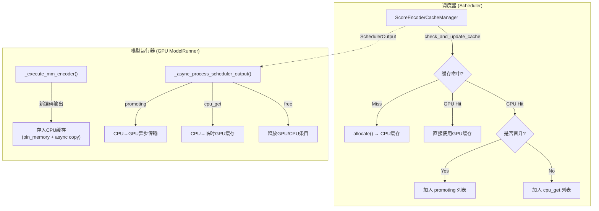
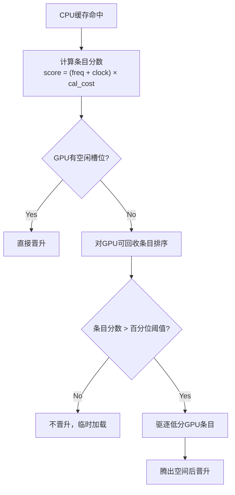

# PR #38330: [Core] Add score encoder cache manager

> **作者**: @hotTea123 (hotTea) | **状态**: OPEN | **日期**: 2026-03-27
> **Branch**: `main` → `main` | **Labels**: `v1`
> **变更规模**: +577 -17 行，涉及 5 个文件

---

## 1. 总结 (Summary)

本 PR 为 vLLM 引入了一个**基于分数的编码器缓存管理器（Score Encoder Cache Manager / CHIME）**，实现了 GPU-CPU 两级缓存架构，通过综合考虑访问频率、时钟老化和重计算成本对缓存条目进行价值评估，以解决现有 EMB Cache 在存储架构失配和缺乏价值感知调度方面的问题。实验结果显示，在 Qwen2.5-VL 模型上端到端吞吐提升高达 5.96%，TTFT 降低高达 32.29%。

---

## 2. 背景与动机 (Background & Motivation)

在多模态大模型推理中，高分辨率图片和长视频的重复视觉编码已成为推理延迟和计算成本的关键瓶颈。vLLM 虽然引入了 EMB Cache 来缓存编码器输出以避免重复计算，但其缓存管理机制仍沿用 KV/Prefix Cache 的设计范式，存在两个核心问题：

1. **存储架构失配**：EMB Cache 的效能主要由缓存命中率驱动，而 HBM（高带宽内存）容量有限，大量高价值条目被频繁驱逐，造成资源浪费。
2. **缺乏价值感知调度**：现有的 LRU 等基于时间局部性的策略仅以"最近访问时间"来近似缓存价值，但 EMB Cache 条目在重计算成本、内存占用和复用模式上存在显著异质性，简单的"命中"并不等同于"高价值"。

本 PR 通过引入两级缓存（GPU + CPU）和分数驱动的淘汰/晋升策略，解决了上述两个问题。

---

## 3. 代码修改分析 (Code Change Analysis)

### 3.1 修改的模块

| 文件 | 操作 | 说明 |
|------|------|------|
| `vllm/config/score_encoder_cache.py` | 新增 | 分数缓存管理器的配置类 `ScoreEncoderCacheConfig`，定义时钟衰减、晋升百分位、水位线等参数 |
| `vllm/v1/core/encoder_cache_manager.py` | 修改 | 核心实现：新增 `CacheEntry` 数据类和 `ScoreEncoderCacheManager` 类（~400 行），包含两级缓存管理、分数计算、晋升/驱逐逻辑 |
| `vllm/v1/core/sched/output.py` | 修改 | `SchedulerOutput` 新增 `promoting_mm_hashes` 和 `cpu_get_encoder_mm_hashes` 字段 |
| `vllm/v1/core/sched/scheduler.py` | 修改 | 调度器集成分数缓存管理器，新增缓存命中统计和调度输出字段 |
| `vllm/v1/worker/gpu_model_runner.py` | 修改 | ModelRunner 新增 CPU 缓存存储、异步晋升（CPU→GPU）、临时缓存等逻辑 |

### 3.2 架构 / 流程图 (Architecture / Flow Diagram)

#### 两级缓存整体架构

#### 分数计算与晋升决策流程

### 3.3 关键实现细节 (Key Implementation Details)

- **CacheEntry 数据类**：每个缓存条目包含 `mm_hash`（唯一标识）、`freq`（访问频率）、`clock`（时钟值）、`num_embeds`（占用槽位数）、`cal_cost`（理论重计算成本）。

- **分数公式**：`score = (freq + clock) × cal_cost`，综合考虑访问频率、时间新鲜度和重新计算的代价。

- **时钟衰减机制**：每隔 `clock_decay_every`（默认 64）次请求，所有 GPU 缓存条目的 clock 值减 1，防止历史热点长期占据缓存。

- **晋升策略**：CPU 缓存条目的分数需超过 GPU 可回收条目分数分布的指定百分位（默认 20%），才可晋升到 GPU。晋升时会按水位线驱逐低分 GPU 条目。

- **新编码输出默认存入 CPU**：`_execute_mm_encoder()` 中新计算的编码器输出首先通过 `pin_memory()` + `async copy` 存入 CPU 缓存，仅在满足晋升条件时同时保留 GPU 副本。

- **临时 GPU 缓存**（`tmp_encoder_cache`）：对于 CPU 命中但未晋升的条目，临时加载到 GPU 供当前请求使用，请求完成后释放。

- **异步传输**：CPU→GPU 的数据传输使用 `non_blocking=True` + `record_stream()` 确保异步安全。

- **不变量检查**：`_check_invariant()` 每 1000 次请求验证 CPU/GPU 缓存的槽位计数一致性。

---

## 4. 涉及的技术原理 (Technical Principles)

### 缓存价值评估与调度

传统的 LRU（Least Recently Used）策略仅基于访问时间进行缓存淘汰，适用于访问模式均匀的场景。但在多模态推理中，不同编码器输出的重计算成本差异巨大（高分辨率图片 vs 小图片），简单的 LRU 无法区分"驱逐代价高的条目"和"驱逐代价低的条目"。本 PR 引入了类似 GDSF（Greedy Dual Size Frequency）的思想，将频率、新鲜度和重计算成本纳入统一的分数模型。

### 两级缓存层次结构

GPU（HBM）带宽高但容量有限，CPU 内存容量大但访问延迟高。两级缓存通过将"冷"数据下沉到 CPU、"热"数据驻留 GPU 来最大化有效缓存容量。这种设计类似于 CPU 缓存中的 L1/L2 层次结构。

### 异步数据传输与 `record_stream()`

GPU 上的 `record_stream()` 调用确保在异步 H2D（Host to Device）拷贝完成之前，目标张量的内存不会被 CUDA 内存分配器回收。这是 PyTorch 异步操作中防止 use-after-free 的关键机制。

### 理论重计算成本估算

PR 使用 Vision Transformer 的 FLOPs 公式 `b×s[(4h+5a)s + (14h+8h²+6h×ffn)]` 的线性近似 `32 × (α×seq_len + β)` 来估算重新编码的计算代价，其中 α 和 β 由模型的注意力头数、隐藏层维度和 FFN 维度推导。除以硬件理论算力得到近似时间成本。

---

## 5. 评论区讨论亮点 (Discussion Highlights)

- **Gemini Code Review** 指出了多个关键问题：
  - `__init__` 中可能未正确初始化 `self.freed` 和 `self.cache_size`（实际代码中已通过 `super().__init__` 初始化）。
  - `record_stream()` 曾被注释掉，存在异步拷贝的 use-after-free 风险（作者后续已修复）。
  - `hardware_flops` 硬编码为 `4×10¹⁴`，建议做成可配置参数。
  - 日志统计间隔 `self.req_cnt % 1 == 0` 导致每次请求都打日志（作者已更新为 1000）。
  - 文档中的成本公式与实际实现不匹配（二次 vs 线性）。
  - 代码中存在中文注释，建议在开源项目中统一使用英文。

- **作者回复**：硬编码的 `hardware_flops` 仅用于归一化，不影响最终比较结果（所有条目除以相同的值）；已移除中文注释并更新日志频率。

---

## 6. 风险与潜在问题 (Risk Analysis)

| 风险 | 严重程度 | 说明 |
|------|---------|------|
| `SchedulerOutput` 中丢失 `new_block_ids_to_zero` | High | 构造 `SchedulerOutput` 时移除了 `new_block_ids_to_zero=new_block_ids_to_zero` 赋值，可能导致后续使用该字段时出错或使用默认值 |
| `reset()` 方法属性引用不一致 | High | `reset()` 引用 `self.freeable` 和 `self.freed`，但子类使用 `gpu_freeable`/`cpu_freeable`，可能导致 `AttributeError` 或逻辑错误 |
| 缺少单元测试 | High | PR 未包含任何测试文件，仅描述了端到端测试，缺少对分数计算、晋升逻辑、驱逐策略的单元测试覆盖 |
| `_update_states` 返回类型变更 | Medium | 函数签名从 `-> Callable \| None` 改为 `-> None`，可能影响调用方对返回值的使用 |
| `free_tmp_cache` 中条件逻辑 | Medium | 当 `score_encoder_cache` 未启用时直接 `self.cached.clear()` 清空全部缓存引用，可能影响其他请求 |
| CPU 内存消耗 | Medium | 默认 CPU 缓存槽位 `100×1024×10`（约 10GB），在内存受限的环境中可能造成 OOM |
| 硬编码硬件算力 | Low | `hardware_flops = 4e14` 对不同设备不准确，但作者解释仅用于归一化，不影响排序结果 |
| EVS 相关无关代码修改 | Low | 删除了 `requires_sequential_video_encoding` 相关条件判断，与本 PR 主题无关，可能引入回归 |

---

## 7. 结论 (Conclusion)

本 PR 提出了一个有价值的分数驱动两级编码器缓存管理方案，设计思路清晰，性能数据可观（吞吐 +5.96%，TTFT -32.29%）。但当前实现存在几个需要关注的问题：`SchedulerOutput` 构造中疑似丢失的 `new_block_ids_to_zero` 字段、`reset()` 方法中属性名引用不一致、缺少单元测试覆盖、以及与 PR 主题无关的 EVS 代码修改。建议在合并前补充单元测试、修复属性引用问题，并将无关改动拆分到独立 PR。
