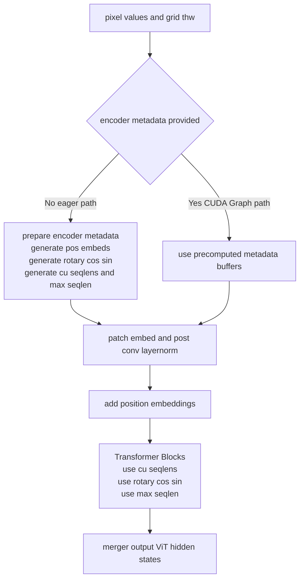
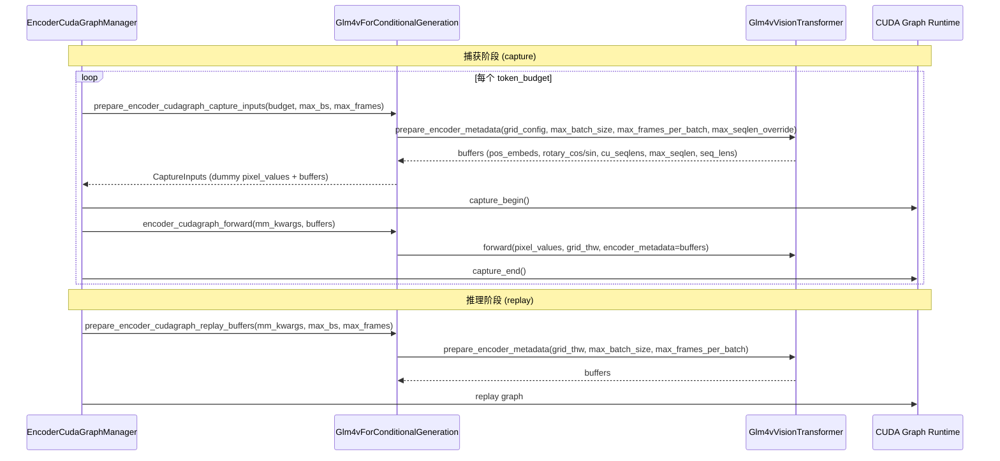

# PR #40576: [MM][Perf][CG] Support ViT full CUDA graph for glm4_1v image and video inference

> **作者**: @grYe99 | **状态**: OPEN | **日期**: 2026-04-22
> **Branch**: `support_vit_cudagraph_glm4_1v` → `main` | **Labels**: `documentation`, `multi-modality`, `nvidia`
> **变更规模**: +487 -56 行，涉及 4 个文件

---

## 1. 总结 (Summary)

本 PR 为 GLM-4.1V 系列模型（`GLM-4.1V-9B-Thinking` 和 `GLM-4.6V-Flash`）实现了 ViT CUDA Graph 支持，覆盖图像和视频两种模态的推理。核心工作是让 `Glm4vForConditionalGeneration` 实现 `SupportsEncoderCudaGraph` 协议，并重构 `Glm4vVisionTransformer` 的 forward 路径，将位置编码计算、cu_seqlens 构造等元数据准备逻辑抽取为 `prepare_encoder_metadata()` 方法，使 eager 路径与 CUDA Graph 捕获/回放路径共享同一实现。性能方面，单 GPU 图像推理 ViT 延迟（encoder_forward_ms）均值降低约 3%，多 GPU（TP=2 + DP）场景降低约 63%；视频推理单 GPU 降低约 37%，多 GPU 降低约 67%。

---

## 2. 背景与动机 (Background & Motivation)

本 PR 是 [Issue #38175](https://github.com/vllm-project/vllm/issues/38175) 的实现，参考了已有的 ViT CUDA Graph 实现：
- [PR #35963](https://github.com/vllm-project/vllm/pull/35963)：Qwen3-VL 的图像 CUDA Graph 支持（首个实现 `SupportsEncoderCudaGraph` 协议的模型）
- [PR #38061](https://github.com/vllm-project/vllm/pull/38061)：Qwen3-VL 的视频 CUDA Graph 支持

在多模态推理中，ViT 编码器的每个 forward 都涉及大量 CUDA kernel 启动（patch embedding、位置编码插值、多层 Attention/FFN 等）。与 LLM decode 阶段已有 CUDA Graph 加速不同，ViT 此前一直以 eager 模式执行，存在显著的 kernel launch overhead。GLM-4.1V 作为重要的大规模视觉语言模型，加入 CUDA Graph 支持可以显著降低其编码延迟，尤其是在多 GPU 数据并行场景下效果更为突出。

---

## 3. 代码修改分析 (Code Change Analysis)

### 3.1 修改的模块

| 文件 | 操作 | 说明 |
|------|------|------|
| `vllm/model_executor/models/glm4_1v.py` | 修改 | 核心变更：重构 `Glm4vVisionTransformer`（抽取 `prepare_encoder_metadata()`、`pos_embeds_interpolate()`），`Glm4vForConditionalGeneration` 实现 `SupportsEncoderCudaGraph` 协议的全部 9 个方法 |
| `tests/models/multimodal/generation/test_vit_cudagraph.py` | 修改 | 新增 `glm4_1v` 的 `VitCudagraphTestConfig` 测试配置（图像 + 视频 prompt） |
| `examples/generate/multimodal/vision_language_offline.py` | 修改 | 移除 `glm4_1v` 的 `enforce_eager=True` 限制；将 `glm4_1v` 加入支持 `--enable_vit_cuda_graph` 的模型列表 |
| `docs/design/cuda_graphs_multimodal.md` | 修改 | 在模型支持表中新增 `Glm4vForConditionalGeneration`（图像 ✅︎，视频 ✅︎） |

### 3.2 架构 / 流程图

#### ViT Forward 路径重构：eager 与 CUDA Graph 共享元数据准备

#### CUDA Graph 捕获与回放流程

### 3.3 关键实现细节

- **`Glm4vVisionTransformer` 重构**：新增 `prepare_encoder_metadata()` 方法，将位置编码插值（`pos_embeds_interpolate`）、旋转位置编码（`rot_pos_emb`）、cu_seqlens 构造、max_seqlen 计算等逻辑统一到一个方法中，支持 `max_batch_size`/`max_frames_per_batch`/`max_seqlen_override` 等 CUDA Graph 所需的填充参数。eager 路径和 CUDA Graph 捕获/回放路径共享同一实现，避免了代码重复。

- **`rot_pos_ids` 静态方法 + `lru_cache`**：将原本在 `rot_pos_emb` 中每次动态构造 position IDs 的逻辑抽取为 `@staticmethod` + `@lru_cache(maxsize=1024)`，避免对相同 (h, w) 形状重复计算 position IDs。

- **`pos_embeds_interpolate` 方法**：替代原始实现中使用 `VisionEmbeddings.forward()` 的 bicubic 插值方式，使用 `torch.nn.functional.interpolate` 实现等效插值，使得 position embeddings 可以提前批量计算，而非在 `VisionEmbeddings.forward()` 内部与其他逻辑耦合。

- **`SupportsEncoderCudaGraph` 协议实现**（9 个方法）：
  - `get_encoder_cudagraph_config()` — 定义模态（image + video，当 EVS pruning 关闭时）、input keys、buffer keys、out_hidden_size
  - `get_input_modality()` — 根据 `image_grid_thw` 或 `video_grid_thw` 区分模态
  - `get_encoder_cudagraph_budget_range()` — 最小 64 tokens（224×224 图像），最大由 `max_num_batched_tokens`/`max_model_len` 限制
  - `get_max_frames_per_video()` — 计算最大帧数（取 `max_model_len` 计算值、video/image size 比值、16 三者的最大值）
  - `get_encoder_cudagraph_num_items()` / `get_encoder_cudagraph_per_item_output_tokens()` / `get_encoder_cudagraph_per_item_input_sizes()` — 从 `grid_thw` 提取 item 数量、每 item 输出 token 数、每 item 输入 patch 数
  - `select_encoder_cudagraph_items()` — 按索引子集选择 pixel_values 和 grid_thw
  - `prepare_encoder_cudagraph_capture_inputs()` — 构造 dummy pixel_values 和 metadata buffers（区分视频/图像格式的 grid_config）
  - `prepare_encoder_cudagraph_replay_buffers()` — 从真实 `grid_thw` 计算 metadata buffers
  - `encoder_cudagraph_forward()` / `encoder_eager_forward()` — 分别在有/无 pre-computed buffers 时执行 ViT forward

- **Video CUDA Graph 的条件启用**：当 EVS（Efficient Video Sampling）pruning 开启时，视频 token 数量变为数据依赖（根据帧间差异动态选择保留的 token），因此无法被 CUDA Graph 捕获，仅在 `is_multimodal_pruning_enabled=False` 时启用视频 CUDA Graph。

- **测试与示例更新**：在 `test_vit_cudagraph.py` 中新增 `glm4_1v` 的 `VitCudagraphTestConfig`，包含图像和视频两种 prompt 格式（使用 GLM-4.1V 的 `[gMASK]<sop>` 等特殊 tokens）；在 `vision_language_offline.py` 中移除 `glm4_1v` 的 `enforce_eager=True`，并将其加入 CUDA Graph 支持模型列表。

---

## 4. 涉及的技术原理 (Technical Principles)

- **ViT CUDA Graph**：CUDA Graph 将一系列 CUDA kernel 调用预录制为一个图，回放时仅需一次 CPU 端调用即可执行全部 kernel，大幅减少 kernel launch overhead。挑战在于 ViT 的前向计算图依赖输入形状（token 数量），而输入形状随图像分辨率变化。解决方案是「按 token budget 捕获」：预先捕获覆盖不同 token 数量范围的多个 CUDA Graph，推理时通过贪心装箱（greedy bin-packing）选择最佳匹配的 graph。

- **`SupportsEncoderCudaGraph` Protocol**：vLLM V1 中定义的模型无关协议。任何 ViT 模型只要实现该协议的 9 个方法，即可复用 `EncoderCudaGraphManager` 的全部 CUDA Graph 捕获/回放/调度逻辑，无需修改管理器代码。

- **Data Parallel ViT (mm_encoder_tp_mode="data")**：在 TP > 1 时，ViT 编码器可以在所有 GPU 上以数据并行模式独立运行（每张 GPU 处理不同图片），而非张量并行切分，避免了 ViT 内部的 TP 通信开销。CUDA Graph 在 DP 场景下收益更大，因为每张 GPU 独立执行自己的 graph。

- **Position Embedding Interpolation**：GLM-4.1V 的 ViT 使用 learnable position embeddings，对于不同分辨率的输入图像，需要通过插值（bicubic）从预训练的位置编码网格（如 16×16）映射到实际输入 grid（如 h×w），插值后还需进行 spatial merge 重排序以匹配 patch embedding 的排列顺序。

- **Spatial Merge**：GLM-4.1V ViT 中的 `spatial_merge_size=2` 表示将相邻 2×2 的 patch tokens 合并处理，影响位置编码的排列方式和 cu_seqlens 的计算。

---

## 5. 评论区讨论亮点 (Discussion Highlights)

1. **插值方法一致性问题（gemini-code-assist + Isotr0py）**：Gemini Code Assist 的自动 review 指出，初版代码中的 Triton kernel 和 PyTorch native fallback 使用了 **bilinear** 插值，而原始 GLM-4.1V 实现使用的是 **bicubic** 插值（`F.grid_sample(mode="bicubic")`），这可能导致模型精度下降。之后 Isotr0py 也提出了相同的质疑，要求作者确认 Qwen3-VL（bilinear）和 GLM-4.1V（bicubic）的 VisionEmbedding 实现是否在数值上等效。作者确认了差异，并在后续更新中将插值改为 bicubic，通过了功能测试验证。

   > 这是本 PR 最重要的讨论点：**插值方式直接决定位置编码精度**，如果 bicubic 降级为 bilinear 可能导致模型输出质量显著下降，尤其是在高分辨率输入场景下。

2. **Reviewer 要求补充文档和测试（shen-shanshan）**：要求更新三处：`cuda_graphs_multimodal.md` 文档、`vision_language_offline.py` 示例、`test_vit_cudagraph.py` CI 测试。作者已全部完成。

3. **关于 accuracy benchmark 的开放问题（Isotr0py）**：最新评论（2026-05-20）中，Isotr0py 询问是否能提供 MMMU 等多模态 accuracy benchmark 结果。截至目前作者尚未回复。这个 benchmark 对于确保 CUDA Graph 不引入精度退化至关重要。

4. **FlashInfer 暂不支持**：作者在 PR 描述中提到 `Glm4vVisionAttention` 尚不支持 `--mm-encoder-attn-backend FLASHINFER`，将在后续 PR 中实现。

---

## 6. 风险与潜在问题 (Risk Analysis)

| 风险 | 严重程度 | 说明 |
|------|---------|------|
| 位置编码插值精度退化 | **高** | 从原始 `F.grid_sample(mode="bicubic")` 重构为自定义 PyTorch 实现，虽然最终版本使用了 bicubic，但需要更充分的精度验证（如 MMMU benchmark 或逐 token 对比）来确保数值等价性 |
| 缺少 accuracy benchmark | **中** | 已有性能 benchmark（encoder_forward_ms）和功能测试（正确输出），但缺少多模态 accuracy benchmark（MMMU 等），无法量化 CUDA Graph 对模型输出质量的潜在影响 |
| Video CUDA Graph 与 EVS pruning 互斥 | **中** | 当开启 EVS pruning 时自动禁用 video CUDA Graph，逻辑正确，但用户可能不清楚这个限制，需要文档说明 |
| 空输入边界条件 | **低** | Gemini Code Assist 指出 `prepare_encoder_metadata` 不接受空 `grid_thw_list`（会导致 `torch.cat([])` 报错）。虽然 CUDA Graph manager 可能保证非空调度，但 eager 路径如果被直接调用可能触发此问题 |
| FlashInfer 兼容性 | **低** | `Glm4vVisionAttention` 暂不支持 FlashInfer backend（仅支持 FLASH_ATTN），PR 明确说明了此限制，预计后续 PR 解决 |

---

## 7. 结论 (Conclusion)

本 PR 实现了 GLM-4.1V 系列模型的 ViT CUDA Graph 支持，代码结构清晰，严格遵循了 `SupportsEncoderCudaGraph` 协议规范，在多 GPU DP 场景下取得了约 60-67% 的 ViT 编码延迟降低。主要待解决事项是补充多模态 accuracy benchmark（如 MMMU）以验证 CUDA Graph 重构（特别是位置编码插值从 `VisionEmbeddings.forward` 内联到 `pos_embeds_interpolate`）不会引入精度退化。整体而言，代码质量良好，在通过 accuracy 验证后可以合并。
