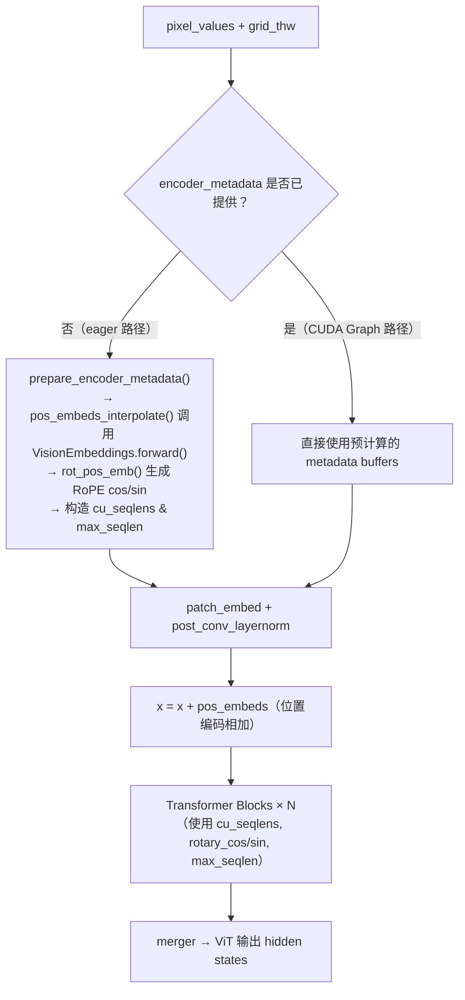
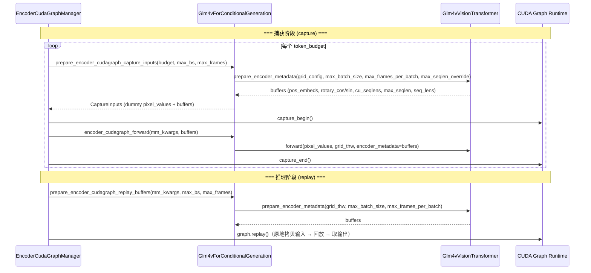

# PR #40576: [MM][Perf][CG] Support ViT full CUDA graph for glm4_1v image and video inference

> **作者**: @grYe99 | **状态**: OPEN | **日期**: 2026-04-22（最后更新 2026-05-26）
> **Branch**: `support_vit_cudagraph_glm4_1v` → `main` | **Labels**: `documentation`, `multi-modality`, `nvidia`
> **变更规模**: +467 -26 行，涉及 4 个文件

---

## 1. 总结 (Summary)

本 PR 为 GLM-4.1V 系列模型（`GLM-4.1V-9B-Thinking` 和 `GLM-4.6V-Flash`）实现了 ViT CUDA Graph 支持，覆盖图像和视频两种模态的推理。核心工作包括：重构 `Glm4vVisionTransformer` 的 forward 路径，将元数据准备逻辑抽取为 `prepare_encoder_metadata()` 方法；让 `Glm4vForConditionalGeneration` 实现 `SupportsEncoderCudaGraph` 协议的全部 9 个方法；支持 `--compilation-config '{"cudagraph_mm_encoder": true}'` 的自动推导（无需手动指定 token budgets 等参数）。性能方面，单 GPU 下图像推理 ViT 延迟（encoder_forward_ms）P99 降低约 48%，多 GPU（TP=2 + DP）降低约 62%；视频推理单 GPU P99 降低约 63%，多 GPU 降低约 62%。在 Serving 场景下，Mean TTFT 从 18770ms 降至 16884ms（约 10% 改善），总 token 吞吐从 4340 tok/s 提升至 4650 tok/s（约 7% 改善）。精度验证方面，MMStar benchmark 显示 PR 分支（average 0.6922）与 main 分支（average 0.6886）精度持平，无明显退化。

---

## 2. 背景与动机 (Background & Motivation)

本 PR 是 [Issue #38175](https://github.com/vllm-project/vllm/issues/38175) 的实现，参考了已有的 ViT CUDA Graph 实现：
- [PR #35963](https://github.com/vllm-project/vllm/pull/35963)：Qwen3-VL 的图像 CUDA Graph 支持（首个 `SupportsEncoderCudaGraph` 实现）
- [PR #38061](https://github.com/vllm-project/vllm/pull/38061)：Qwen3-VL 的视频 CUDA Graph 支持

在多模态推理中，ViT 编码器此前一直以 eager 模式执行，每个 forward 涉及大量 CUDA kernel 启动（patch embedding、位置编码插值、多层 Attention/FFN 等），存在显著的 kernel launch overhead。GLM-4.1V 作为重要的大规模视觉语言模型，加入 CUDA Graph 支持可以显著降低其编码延迟。GLM-4.1V 与 Qwen3-VL 共享相似的 ViT 架构（VisionEmbeddings + Spatial Merge + RoPE），但有一个关键差异：**GLM-4.1V 使用 bicubic 插值进行位置编码**（Qwen3-VL 使用 bilinear），这在初版实现中引发了精度讨论（见第 5 节）。

---

## 3. 代码修改分析 (Code Change Analysis)

### 3.1 修改的模块

| 文件 | 操作 | 说明 |
|------|------|------|
| `vllm/model_executor/models/glm4_1v.py` | 修改 | 核心变更：重构 `Glm4vVisionTransformer`（抽取 `prepare_encoder_metadata()`、`pos_embeds_interpolate()`），`Glm4vForConditionalGeneration` 实现 `SupportsEncoderCudaGraph` 协议的全部 9 个方法 |
| `tests/models/multimodal/generation/test_vit_cudagraph.py` | 修改 | 新增 `glm4_1v` 的 `VitCudagraphTestConfig` 测试配置（图像 + 视频 prompt，含 `needs_video_metadata=True`） |
| `examples/generate/multimodal/vision_language_offline.py` | 修改 | 移除 `glm4_1v` 的 `enforce_eager=True` 限制；将 `glm4_1v` 加入支持 `--enable_vit_cuda_graph` 的模型列表 |
| `docs/design/cuda_graphs_multimodal.md` | 修改 | 在模型支持表中新增 `Glm4vForConditionalGeneration`（图像 ✅︎，视频 ✅︎） |

### 3.2 架构 / 流程图

#### ViT Forward 路径重构：eager 与 CUDA Graph 共享元数据准备

#### CUDA Graph 捕获与回放流程

### 3.3 关键实现细节

- **`Glm4vVisionTransformer` 重构**：新增 `prepare_encoder_metadata()` 方法，统一处理位置编码插值（`pos_embeds_interpolate`）、旋转位置编码（`rot_pos_emb`）、cu_seqlens 构造、max_seqlen 计算。支持 `max_batch_size`/`max_frames_per_batch`/`max_seqlen_override` 参数，满足 CUDA Graph 捕获时的 padding 需求。eager 路径和 CUDA Graph 捕获/回放路径共享同一实现，无代码重复。

- **`pos_embeds_interpolate()` — 保留 bicubic 插值**：这是本 PR 与 Qwen3-VL 实现的关键差异点。GLM-4.1V 原始实现使用 `VisionEmbeddings.forward()` 内部的 `F.grid_sample(mode="bicubic")` 进行位置编码插值。初版 PR 曾引入 Triton kernel 和 PyTorch native fallback 使用 bilinear 插值，在 reviewer 指出精度风险后，**最终版本改为直接调用 `self.embeddings()`**（即原始 `VisionEmbeddings.forward`），确保与 eager 模式使用完全相同的 bicubic 插值逻辑，从而保证精度一致性。`pos_embeds_interpolate` 本质上是对 `VisionEmbeddings.forward()` 的封装，将 per-item 的位置编码计算从 `forward` 中分离出来以便提前批量计算。

- **`rot_pos_emb()` 签名变更**：参数从 `grid_thw: torch.Tensor` 改为 `grid_thw: list[list[int]]`，避免在 CUDA Graph 捕获路径中产生 tensor 操作。内部使用 Python `max()` 替代 PyTorch 的 `.max()` 计算 `max_grid_size`。

- **`forward()` 新增 `encoder_metadata` 参数**：当 `encoder_metadata is None` 时走 eager 路径（自动调用 `prepare_encoder_metadata`），否则直接使用预计算的 metadata buffers。位置编码从原来在 `VisionEmbeddings.forward()` 内部相加，改为在 ViT `forward()` 中显式执行 `x = x + pos_embeds`。

- **`SupportsEncoderCudaGraph` 协议实现**（9 个方法）：
  - `get_encoder_cudagraph_config()` — 定义模态（image + video，EVS pruning 启用时仅 image）、input keys（`pixel_values` / `pixel_values_videos`）、buffer keys（`pos_embeds`, `rotary_pos_emb_cos`, `rotary_pos_emb_sin`, `cu_seqlens`, `max_seqlen`, `sequence_lengths`）、out_hidden_size
  - `get_input_modality()` — 通过 `image_grid_thw` 是否存在区分图像/视频模态
  - `get_max_frames_per_video()` — 计算视频最大帧数，取 `max_model_len` 计算值、video/image size 比值、16 三者中的最大值
  - `get_encoder_cudagraph_budget_range()` — 最小 64 tokens（224×224 → 16×16 patches → spatial_merge 后 8×8），最大由 `max_num_batched_tokens` / `max_model_len` 限制
  - `get_encoder_cudagraph_num_items()` / `get_encoder_cudagraph_per_item_output_tokens()` / `get_encoder_cudagraph_per_item_input_sizes()` — 从 `grid_thw` 提取 item 级元信息
  - `select_encoder_cudagraph_items()` — 按 indices 子集切片 pixel_values（使用累积 patch 偏移量）和 grid_thw
  - `prepare_encoder_cudagraph_capture_inputs()` — 构造 dummy pixel_values 和 metadata buffers。对于视频格式（`frames_per_item > 1`），使用 `[T, H, W]` 的 grid_config 确保 cu_seqlens 从一开始就按视频 attention 序列数量分配缓冲区
  - `prepare_encoder_cudagraph_replay_buffers()` — 图像路径传 `max_batch_size`，视频路径传 `max_frames_per_batch`
  - `encoder_cudagraph_forward()` / `encoder_eager_forward()` — 分别在有/无 pre-computed metadata 时执行 ViT forward

- **`compilation-config` 自动推导支持**：最新代码支持仅设置 `{"cudagraph_mm_encoder": true}` 而无需手动指定 `encoder_cudagraph_token_budgets`、`encoder_cudagraph_max_vision_items_per_batch`、`encoder_cudagraph_max_frames_per_batch` 等参数，由 `get_encoder_cudagraph_budget_range()` 等方法自动推导合理配置。

- **Video CUDA Graph 与 EVS Pruning 互斥**：当 `is_multimodal_pruning_enabled=True`（Efficient Video Sampling 开启）时，视频 token 数量变为数据依赖（动态选择保留的帧），无法被 CUDA Graph 捕获，因此仅在 pruning 关闭时启用视频 CUDA Graph。

- **测试与示例更新**：在 `test_vit_cudagraph.py` 中新增 `glm4_1v` 配置（mark 为 `core_model`，设置 `needs_video_metadata=True`），包含 GLM-4.1V 特有的 `[gMASK]<sop>` 对话模板。在 `vision_language_offline.py` 中移除 `enforce_eager=True` 并将 `glm4_1v` 加入 CUDA Graph 模型列表。

---

## 4. 涉及的技术原理 (Technical Principles)

- **ViT CUDA Graph（token budget 策略）**：CUDA Graph 将一系列 CUDA kernel 预录制为图，回放时仅一次 CPU 调用。由于 ViT 输入形状随图像分辨率变化，解决方案是按「token budget」预先捕获多个 CUDA Graph（覆盖不同 token 数量范围），推理时通过贪心装箱选择最佳匹配的 graph。输入不足 budget 时对 cu_seqlens 等元数据做 padding，使形状与捕获时一致。

- **`SupportsEncoderCudaGraph` Protocol**：vLLM V1 中定义的模型无关协议，包含 9 个方法。任何 ViT 模型实现该协议后即可复用 `EncoderCudaGraphManager` 的全部捕获/回放/调度逻辑。本 PR 是继 Qwen3-VL 后第二个实现该协议的模型系列。

- **Data Parallel ViT（`mm_encoder_tp_mode="data"`）**：在多 GPU 场景下，ViT 编码器可在各 GPU 上以数据并行模式独立运行（每张 GPU 处理不同图片），而非张量并行切分。CUDA Graph 在 DP 场景下收益更大（多 GPU 下 ViT 延迟降低约 62-67% vs 单 GPU 的约 3-48%），因为每张 GPU 独立执行自己的 graph，无 TP 通信开销。

- **GLM-4.1V 位置编码：Bicubic Interpolation + Spatial Merge**：GLM-4.1V 的 ViT 使用 learnable position embeddings，对任意分辨率输入通过 `F.grid_sample(mode="bicubic")` 进行 bicubic 插值，区别于 Qwen3-VL 的 bilinear 插值。插值后还需 spatial merge（`spatial_merge_size=2`）重排序以匹配 patch embedding 的排列。这是本 PR 实现中最关键的精度敏感点。

- **Serving 场景下的 TTFT 改善**：CUDA Graph 降低 ViT 编码延迟后，直接影响 Time to First Token（TTFT），因为多模态请求的 TTFT = ViT 编码时间 + LLM prefill 时间 + 首 token 生成时间。Serving benchmark 中 Mean TTFT 从 18770ms 降至 16884ms（约 10%），验证了端到端收益。

---

## 5. 评论区讨论亮点 (Discussion Highlights)

1. **Bicubic vs Bilinear 插值精度问题（gemini-code-assist + Isotr0py）**：这是本 PR 最关键的讨论。初版代码使用自定义 Triton kernel 和 PyTorch native fallback 实现 **bilinear** 插值，而 GLM-4.1V 原始实现使用 **bicubic** 插值。Gemini Code Assist 的自动 review 首先指出此问题，随后 Isotr0py 也提出相同质疑，要求确认 Qwen3-VL（bilinear）与 GLM-4.1V（bicubic）的差异。**作者确认差异后重写了 `pos_embeds_interpolate()`，改为直接调用原始 `VisionEmbeddings.forward()`**（内部使用 bicubic），并通过了功能测试和 MMStar 精度验证。

2. **精度回归修复与 MMStar Benchmark（grYe99）**：作者在实现过程中发现初版实现导致了精度下降，调整实现后提供了 MMStar benchmark 结果，显示 PR 分支（average 0.6922）与 main 分支（average 0.6886）精度基本持平，部分子任务（fine-grained perception: 0.6530 vs 0.6388, science & technology: 0.5722 vs 0.5198）甚至略有提升。这一结果有效回应了 reviewer 对精度退化的担忧。

3. **auto-infer compilation-config 支持（grYe99）**：作者在 2026-05-06 更新中加入了 compilation-config 自动推导支持，用户只需设置 `{"cudagraph_mm_encoder": true}` 即可启用，无需手动指定 token budgets 等参数，降低了使用门槛。

4. **Review 进度与 PR 状态**：
   - 4/22: PR 创建，Gemini Code Assist 和 Claude 的自动 review
   - 4/25: shen-shanshan 要求补充文档、示例和 CI 测试 → 作者当天完成
   - 5/6: 作者更新代码（auto-infer compilation-config + bicubic 插值修复），请求 shen-shanshan 和 b-mu 重新 review
   - 5/8: Isotr0py 提出 bicubic 插值质疑 → 作者当天确认修复
   - 5/20: 作者 ping Isotr0py 询问是否还有其他需要修改的地方
   - 5/20: Isotr0py 要求提供 multimodal accuracy benchmark 结果
   - 5/21: 作者提供 MMStar benchmark 结果，确认精度无问题
   - **5/26: 作者再次 ping Isotr0py，等待最终 review**

   目前 PR 尚未获得 Approved 状态的 review，核心 reviewer（Isotr0py）仍在审查中。

5. **FlashInfer 暂不支持**：作者在 PR 描述中备注 `Glm4vVisionAttention` 尚不支持 `--mm-encoder-attn-backend FLASHINFER`，将在后续 PR 中实现。当前仅测试了 FLASH_ATTN backend。

---

## 6. 风险与潜在问题 (Risk Analysis)

| 风险 | 严重程度 | 说明 |
|------|---------|------|
| 精度回归风险已基本排除 | ~~高~~ → **低** | 最终版本直接复用原始 `VisionEmbeddings.forward()` 的 bicubic 插值，MMStar benchmark 显示精度与 main 分支基本持平。剩余风险在于 benchmark 仅覆盖 MMStar 一个数据集，其他下游任务精度未验证 |
| 空输入边界条件 | **低** | Gemini Code Assist 指出 `prepare_encoder_metadata()` 不接受空 `grid_thw_list`（`torch.cat([])` 会报错）。虽然 CUDA Graph manager 保证非空调度，但 eager 路径如被外部直接调用可能触发。实际触发概率低，可作为后续改进项 |
| Video CUDA Graph 与 EVS pruning 互斥 | **低** | 代码正确地在 EVS pruning 开启时自动禁用 video CUDA Graph，逻辑正确。但用户可能不清楚此限制，`cuda_graphs_multimodal.md` 文档中可补充说明 |
| FlashInfer 兼容性 | **低** | `Glm4vVisionAttention` 暂不支持 FlashInfer backend（仅 FLASH_ATTN），PR 已明确说明，预计后续 PR 解决 |
| `rot_pos_ids` 的 `lru_cache` 线程安全 | **极低** | `rot_pos_ids` 静态方法使用 `@lru_cache(maxsize=1024)` 缓存 position IDs 计算结果。`lru_cache` 的 dict 操作在 CPython 中受 GIL 保护，单进程推理场景无问题，但如需在多线程 serving 中使用需注意 |

---

## 7. 结论 (Conclusion)

本 PR 为 GLM-4.1V 系列模型成功实现了 ViT CUDA Graph 支持，在多 GPU DP 场景下取得约 62-67% 的 ViT 编码延迟降低，serving 场景下 TTFT 改善约 10%。代码严格遵循 `SupportsEncoderCudaGraph` 协议规范，并正确处理了 GLM-4.1V 与 Qwen3-VL 在位置编码插值（bicubic vs bilinear）上的关键差异。经过 reviewer 反馈驱动的迭代改进（bicubic 插值修复、auto-infer compilation-config、MMStar 精度验证），代码质量已达到较高水平。当前唯一阻塞项是等待核心 reviewer（Isotr0py）的最终 Approve，在获得通过后即可合并。
