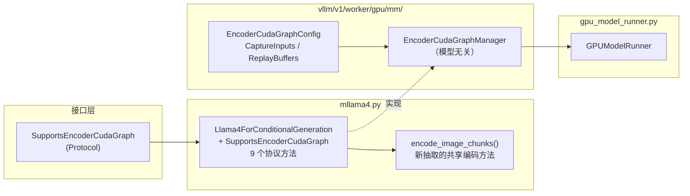
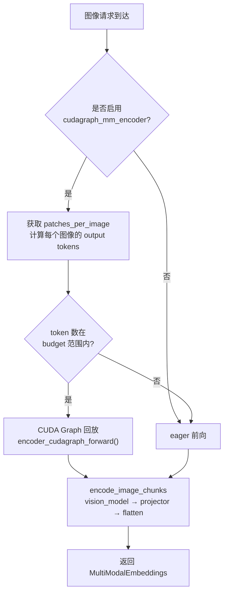
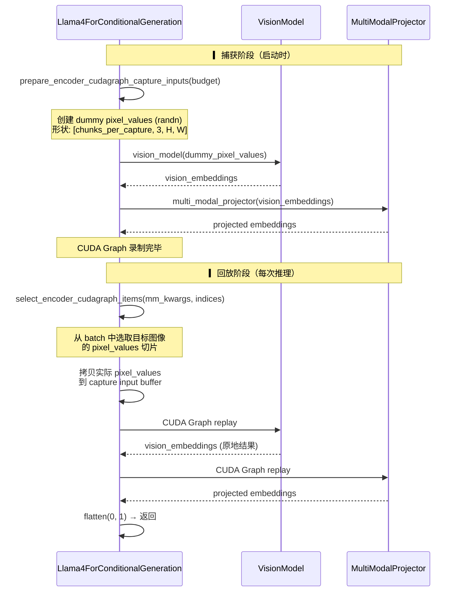

# PR #40660: [MM][Perf][CG] Support ViT full cudagraphs for mllama4

> **作者**: @allgather | **状态**: OPEN | **日期**: 2026-04-23
> **Branch**: `4` → `main` | **Labels**: `documentation`, `multi-modality`, `llama`, `nvidia`
> **变更规模**: +305 -11 行，涉及 6 个文件

---

## 1. 总结 (Summary)

本 PR 为 `Llama4ForConditionalGeneration`（mllama4）模型实现了 `SupportsEncoderCudaGraph` 协议，使其 Vision Transformer (ViT) 编码器支持 Full CUDA Graph 加速。核心改动是在 `mllama4.py` 中新增约 160 行代码，完整实现了协议的 9 个方法（包括配置获取、budget 范围计算、items 选取、捕获输入准备、回放缓冲区准备、CG/eager 前向等），并配套更新了文档、示例代码和测试。实测显示各项吞吐指标提升约 22%，TTFT 和 TPOT 延迟降低 16%-17%。

---

## 2. 背景与动机 (Background & Motivation)

vLLM 的 ViT Full CUDA Graph（FCG）基础设施由 PR #35963 首次引入，通过 `SupportsEncoderCudaGraph` Protocol 定义了模型无关的编码器 CUDA Graph 捕获与回放框架。该框架已在 Qwen3-VL 上验证了显著收益（单卡 ~7%，多卡 DP ~38%）。

本 PR 的目标是将此能力扩展到 Llama 4 系列模型，追踪 Issue #38175：
- Llama 4（Scout/Maverick）是多模态模型，ViT 编码器在每次推理中处理图像时需要执行大量 CUDA kernel，存在 kernel 启动开销。
- 通过 CUDA Graph 预先捕获 ViT 计算图，在推理时一次 replay 替代逐 kernel 执行，消除 CPU-GPU 同步开销。

mllama4 与 Qwen3-VL 的关键差异在于：mllama4 将图像划分为固定大小的 chunks（patches per chunk），且仅支持图像模态（不支持视频），这使得协议实现相对简单——不需要处理 MRoPE、cu_seqlens padding 等复杂逻辑。

---

## 3. 代码修改分析 (Code Change Analysis)

### 3.1 修改的模块

| 文件 | 操作 | 行数变化 | 说明 |
|------|------|----------|------|
| `vllm/model_executor/models/mllama4.py` | 修改 | +167/-10 | 核心实现：添加 `SupportsEncoderCudaGraph` 协议所有方法，重构 `_process_image_input` |
| `tests/models/multimodal/processing/test_mllama4.py` | 修改 | +112/-0 | 新增 4 个单元测试：metadata、items 选取、捕获输入准备、CG/eager 一致性 |
| `tests/models/multimodal/generation/test_vit_cudagraph.py` | 修改 | +15/-0 | 新增 llama4 的端到端 CUDA Graph 测试配置（TP=4） |
| `tests/models/multimodal/generation/test_common.py` | 修改 | +1/-1 | llava 模型的 marks 修正（添加 `core_model` mark） |
| `examples/generate/multimodal/vision_language_offline.py` | 修改 | +1/-0 | 将 `"llama4"` 加入 `MODELS_SUPPORT_VIT_CUDA_GRAPH` 列表 |
| `docs/design/cuda_graphs_multimodal.md` | 修改 | +9/-0 | 文档：Llama 4 加入支持列表，添加启动命令示例 |

### 3.2 架构 / 流程图

#### 整体集成关系

#### 运行时执行流程

#### ViT FCG 捕获 vs 回放对比

### 3.3 关键实现细节

**协议方法实现（`mllama4.py`）**

- **`get_image_patches_per_chunk()`**: 委托给 `Mllama4ProcessingInfo.get_patch_per_chunk()`，返回每个 chunk 的 patch 数（mllama4 的核心粒度单位）。
- **`encode_image_chunks()`**: 新抽取的共享编码方法，统一了 eager 和 CG 两条路径的 ViT 前向逻辑（vision_model → multi_modal_projector），支持 `use_data_parallel` 切换 DP 路径。
- **`get_encoder_cudagraph_config()`**: 返回 `EncoderCudaGraphConfig`，声明仅支持 `"image"` 模态，input key 为 `"pixel_values"`，无需额外 buffer keys。
- **`get_encoder_cudagraph_budget_range()`**: min_budget = patches_per_chunk（最小一个 chunk），max_budget = min(max_num_batched_tokens, max_model_len)。
- **`get_encoder_cudagraph_num_items()`**: 返回 `len(patches_per_image)`，即 batch 中的图像数量。
- **`get_encoder_cudagraph_per_item_output_tokens()`**: 每张图像输出 token 数 = 其 patch 数 × patches_per_chunk。
- **`get_encoder_cudagraph_per_item_input_sizes()`**: 直接返回 `patches_per_image.tolist()`，每张图像的 patch 数即为输入大小。
- **`select_encoder_cudagraph_items()`**: 根据索引从 batch 中选取子集。关键逻辑：通过累积 patches 数（cumsum）定位每张图像在平铺 `pixel_values` 中的起止位置，用 `torch.cat` 拼接选中的 patch 切片。空索引时返回零维张量。
- **`prepare_encoder_cudagraph_capture_inputs()`**: 根据 token_budget 计算需要的 chunks 数（向上取整），生成随机 dummy pixel_values 用于图捕获。使用 `torch.randn`（社区建议改用 `torch.zeros`）。
- **`encoder_cudagraph_forward()` / `encoder_eager_forward()`**: 均调用 `encode_image_chunks()`，区别在于 CG 版本额外接收 `buffers` 参数（此处为空）。两者都使用 `use_data_parallel=False`（CUDA Graph 路径不使用 DP）。

**重构 `_process_image_input()`**

将原来内联的 DP 分支逻辑（`if self.use_data_parallel` → `run_dp_sharded_vision_model` else → `self.vision_model`）替换为对 `self.encode_image_chunks()` 的统一调用，同时移除了冗余的 `assert self.vision_model and self.multi_modal_projector`。

**测试覆盖**

- `test_encoder_cudagraph_metadata`: 验证 config、budget_range、num_items、per_item_input_sizes、per_item_output_tokens。
- `test_select_encoder_cudagraph_items`: 验证正常选取单个图像和空选取两种 case。
- `test_prepare_encoder_cudagraph_capture_inputs_rounds_up`: 验证当 token_budget 超过一个 chunk 但不足两个时，chunks_per_capture 向上取整为 2。
- `test_encoder_cudagraph_forward_matches_eager`: 验证 CG forward 与 eager forward 输出完全一致。
- E2E 测试：使用 Llama-4-Scout-17B-16E-Instruct，TP=4，验证 CG 路径的实际运行。

**性能数据（benchmark）**

| 指标 | Eager | CG | 变化 |
|------|-------|-----|------|
| Request throughput (req/s) | 2.88 | 3.53 | **+22.6%** |
| Output token throughput (tok/s) | 114.72 | 140.43 | **+22.4%** |
| Total token throughput (tok/s) | 1509.80 | 1848.09 | **+22.4%** |
| Mean TTFT (ms) | 1428.66 | 1193.91 | **-16.4%** |
| Median TTFT (ms) | 262.50 | 170.35 | **-35.1%** |
| P99 TTFT (ms) | 14490.22 | 11661.93 | **-19.5%** |
| Mean TPOT (ms) | 48.83 | 40.52 | **-17.0%** |
| Median TPOT (ms) | 43.87 | 32.75 | **-25.3%** |
| P99 TPOT (ms) | 138.57 | 158.27 | **+14.2%** ⚠️ |
| Mean ITL (ms) | 48.21 | 40.22 | **-16.6%** |
| P99 ITL (ms) | 174.03 | 136.78 | **-21.4%** |

除了 P99 TPOT 出现约 14% 的退化外，所有指标均显著提升。

---

## 4. 涉及的技术原理 (Technical Principles)

### 4.1 ViT Full CUDA Graph 框架

vLLM V1 的 ViT FCG 框架由 PR #35963 建立，核心组件包括：
- **`SupportsEncoderCudaGraph` Protocol**: 定义 9 个方法的标准接口，各模型通过实现此协议接入 CUDA Graph 框架。
- **`EncoderCudaGraphManager`**（模型无关）: 负责捕获、回放、贪心装箱（greedy bin-packing）调度。
- **Token Budget 策略**: 预先定义若干 token 预算级别，对每个预算捕获一张 CUDA Graph。运行时选择最小满足实际 token 数的预算图来回放，不足部分用 padding 填充。

### 4.2 mllama4 的图像分块机制

Llama 4 将输入图像按固定大小切分为 patches，再将 patches 组合为固定大小的 chunks（spatial merging via pixel shuffle）。核心参数：
- `patch_size` / `image_size` → 每张图像的总 patch 数
- `pixel_shuffle_ratio` → patches per chunk（每个 chunk 包含的 patch 数）
- 这一固定 chunk 大小的特性使得 mllama4 的 CUDA Graph 实现相对简单——只需捕获 chunk 粒度的图，而无需处理变长序列的 padding。

### 4.3 CUDA Graph 的核心约束

- 捕获的张量（tensor）地址必须在 replay 时保持不变，只能通过 `copy_()`、`zero_()` 等原地操作修改。
- 捕获期间不能有 Python 控制流（if/for 依赖运行时值）。
- 这些约束由 `EncoderCudaGraphManager` 通过 buffer 管理（input_buffer、output_buffer、metadata_buffers）来满足，模型侧只需提供正确的 dummy 输入和 replay 逻辑。

---

## 5. 评论区讨论亮点 (Discussion Highlights)

### Gemini Code Assist 自动 Review — 两项改进建议

1. **使用 `torch.cumsum` 替代手动循环**: 建议将 `select_encoder_cudagraph_items()` 中手动计算累积 patches 的 for 循环替换为 `torch.cumsum()`，提升可读性和性能。

2. **使用 `torch.zeros` 替代 `torch.randn`**: 建议将 `prepare_encoder_cudagraph_capture_inputs()` 中的 dummy 输入从 `torch.randn` 改为 `torch.zeros`，避免大模型权重场景下可能的数值溢出或 NaN 问题。

### shen-shanshan (Reviewer) — 完整性要求

> "Please also update this model to: Doc, Example, CI test"

要求按照 vLLM 规范同时更新三类文件：
- 文档: `docs/design/cuda_graphs_multimodal.md`
- 示例代码: `examples/generate/multimodal/vision_language_offline.py`
- CI 测试: `tests/models/multimodal/generation/test_vit_cudagraph.py`

### allgather (Author) — 迅速响应

> "@shen-shanshan done"

作者已确认完成上述所有更新，且在最终的 diff 中均已体现。

### Mergify Bot

提供了文档预览链接: `https://vllm--40660.org.readthedocs.build/en/40660/`

---

## 6. 风险与潜在问题 (Risk Analysis)

| 风险 | 严重程度 | 说明 |
|------|---------|------|
| **Gemini Code Assist 建议未处理** | Medium | `torch.cumsum` 和 `torch.zeros` 两个改进建议在代码中未体现——`select_encoder_cudagraph_items` 仍使用手动 for 循环，`prepare_encoder_cudagraph_capture_inputs` 仍使用 `torch.randn`。虽然当前 batch 规模较小，但使用 `torch.zeros` 是 CUDA Graph 最佳实践，建议在合入前修复。 |
| **P99 TPOT 退化** | Medium | Benchmark 中 P99 TPOT 从 138.57ms 退化到 158.27ms（+14.2%），这可能与 CUDA Graph 的 padding 开销或贪心装箱策略在极端 case 下选取了过大的 budget 有关。需要进一步分析是否可接受或可优化。 |
| **select_encoder_cudagraph_items 的 patches_per_image 正确性** | Low | 该方法依赖于 `patches_per_image` 的累积和来切片 `pixel_values`。若上层传入的 `patches_per_image` 与 `pixel_values` 的实际行数不一致，会导致切片错位。当前实现假定输入已校验，但缺少防御性 assert。 |
| **仅支持图像，不支持视频** | Low | `get_max_frames_per_video()` 返回 0，`get_input_modality()` 硬编码返回 `"image"`。这是预期行为（Llama 4 不支持视频输入），但未来若 Llama 4 支持视频，需要额外改造。 |
| **DP 路径未在 CG 中使用** | Low | 在 `_process_image_input` 的重构中，eager 路径保持了 `use_data_parallel=self.use_data_parallel`，但 CG 的 `encoder_cudagraph_forward` / `encoder_eager_forward` 都硬编码 `use_data_parallel=False`。这意味着 CUDA Graph 路径不支持 ViT DP，对于多 GPU 部署可能损失部分加速潜力。 |
| **测试环境依赖** | Low | E2E 测试需要 4 GPU（TP=4）和 Llama-4-Scout-17B-16E-Instruct 模型（约 34GB），CI 中可能无法覆盖，实际正确性依赖作者本地验证。 |

---

## 7. 结论 (Conclusion)

PR #40660 是一个简洁、目标明确的功能实现，成功将 vLLM V1 的 ViT Full CUDA Graph 加速能力扩展到 Llama 4 系列模型。得益于 mllama4 固定的 chunk 大小特性和现有 CUDA Graph 框架的成熟度，新增代码量小（核心逻辑 ~160 行）且结构清晰。Benchmark 数据显示吞吐提升 ~22%，延迟降低 ~17%，收益显著。建议在合入前处理 Gemini Code Assist 的两个代码改进建议（`torch.zeros` + `torch.cumsum`），并关注 P99 TPOT 退化是否需要进一步调优。
