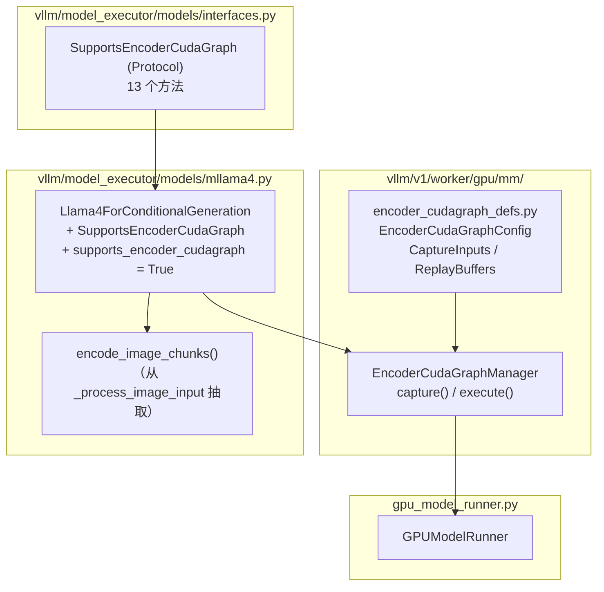
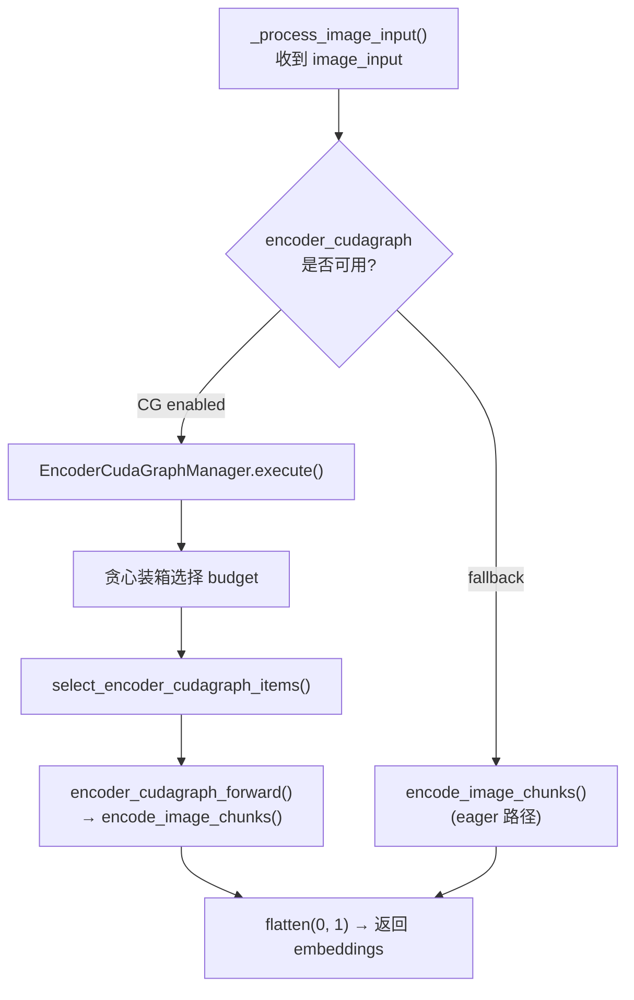
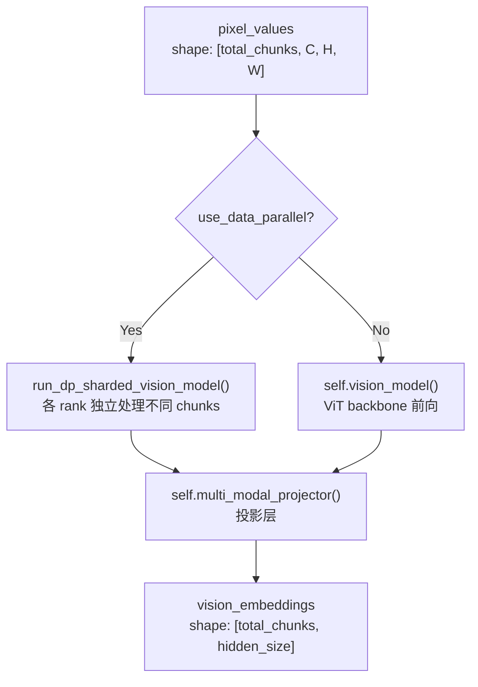

# PR #40660: [MM][Perf][CG] Support ViT full cudagraphs for mllama4

> **作者**: @allgather | **状态**: OPEN | **日期**: 2026-04-23
> **Branch**: `4` → `main` | **Labels**: `documentation`, `multi-modality`, `llama`, `nvidia`
> **变更规模**: +305 -11 行，涉及 6 个文件

---

## 1. 总结 (Summary)

本 PR 为 mllama4（Llama 4 系列）模型实现了 ViT 编码器的 **Full CUDA Graph (FCG)** 支持，通过实现 `SupportsEncoderCudaGraph` 协议接口，使 Llama 4 的视觉编码器路径能够被 CUDA Graph 捕获并加速。这是继 Qwen3-VL 之后第二个接入该框架的模型。核心改动在 `mllama4.py`，新增约 160 行协议实现代码，同时重构了原有的 `_process_image_input` 方法抽取出共享的 `encode_image_chunks`。实测在 Llama-4-Scout-17B-16E-Instruct（TP=8）上，CG 模式全面优于 eager 模式，总吞吐提升约 22.4%，TTFT 降低约 16.4%。

---

## 2. 背景与动机 (Background & Motivation)

vLLM 社区已通过 PR #35963 建立了 ViT Full CUDA Graph 的基础设施（`SupportsEncoderCudaGraph` Protocol + `EncoderCudaGraphManager`），但当时仅有 Qwen3-VL 一个模型实现了该协议。Issue #38175 跟踪了对 mllama4 的 FCG 支持需求。

**核心问题**：Llama 4 系列（Scout/Maverick）是 Meta 最新一代多模态模型，ViT 编码器前向执行涉及大量 CUDA kernel 启动，在多图片推理场景下编码延迟显著。将该模型接入 FCG 框架可以有效减少 kernel 启动开销，降低 TTFT（首 Token 延迟）并提升整体吞吐。

**技术背景**：
- Llama 4 的图像处理采用分块（chunk）机制：每张图片被切分为 patches，每 chunk 固定数量的 patches 送入 ViT 编码。
- 与 Qwen3-VL 的 MRoPE 不同，Llama 4 的 ViT 相对简单，没有复杂的 positional encoding 或 attention mask 元数据需求，因此协议实现更为简洁，`buffer_keys` 为空列表。

---

## 3. 代码修改分析 (Code Change Analysis)

### 3.1 修改的模块

| 文件 | 操作 | 说明 |
|------|------|------|
| `vllm/model_executor/models/mllama4.py` | 修改 (+167/-10) | 核心实现：实现 `SupportsEncoderCudaGraph` 协议的 13 个方法；重构 `_process_image_input`，抽取 `encode_image_chunks` 复用 |
| `tests/models/multimodal/processing/test_mllama4.py` | 修改 (+112/-0) | 新增 4 个单元测试（不含 GPU），用 stub 模型验证协议各方法逻辑正确性 |
| `tests/models/multimodal/generation/test_vit_cudagraph.py` | 修改 (+15/-0) | 新增 `llama4` 配置条目，接入 ViT CUDA Graph 端到端测试框架 |
| `tests/models/multimodal/generation/test_common.py` | 修改 (+1/-1) | 为 `mllama4` 测试配置添加 `pytest.mark.core_model` 标记 |
| `docs/design/cuda_graphs_multimodal.md` | 修改 (+9/-0) | 在兼容性表格中添加 Llama 4 行，补充服务启动示例命令 |
| `examples/generate/multimodal/vision_language_offline.py` | 修改 (+1/-0) | 将 `"llama4"` 加入 `MODELS_SUPPORT_VIT_CUDA_GRAPH` 列表，使离线示例支持 CG 模式 |

### 3.2 架构 / 流程图 (Architecture / Flow Diagram)

#### 类继承与协议关系

#### 编码执行流程（CG 路径 vs Eager 路径）

#### Image Chunk Encoding 子流程

### 3.3 关键实现细节 (Key Implementation Details)

**协议实现层**

- **`get_encoder_cudagraph_config()`**：指定 `modalities=["image"]`，`input_key_by_modality={"image": "pixel_values"}`，`buffer_keys=[]`。与 Qwen3-VL 不同，Llama 4 不需要 cu_seqlens、pos_embeds 等元数据缓冲区，因此 buffer_keys 为空，实现更简洁。

- **`get_encoder_cudagraph_budget_range()`**：最小 budget = `patches_per_chunk`（一个图像块对应的 patch 数），最大 budget = `min(max_num_batched_tokens, max_model_len)`。上限由调度器和模型配置共同约束。

- **`select_encoder_cudagraph_items()`**：核心子图选择逻辑。通过累积 patches 数计算每个图像在 `pixel_values` 中的起止位置，用 `torch.cat` 拼接选中索引的图像块。当 `indices` 为空时返回零尺寸张量。

  > **注意**：当前使用手动循环计算累积 patches 数（`cum_patches`），Gemini Code Assist 建议改用 `torch.cumsum` 以提升性能和可读性。

- **`prepare_encoder_cudagraph_capture_inputs()`**：根据 token_budget 计算需要捕获的 chunks 数（向上取整），生成 `torch.randn` dummy 输入。`max_batch_size` 和 `max_frames_per_batch` 在当前实现中未使用（因为不需要 batch 维度扩展）。

  > **注意**：Gemini Code Assist 建议改用 `torch.zeros` 替代 `torch.randn`，避免极端权重值下可能的数值溢出或 NaN。

- **`encoder_cudagraph_forward()` 与 `encoder_eager_forward()`**：两者逻辑一致——调用 `encode_image_chunks()` 后 flatten 输出。CG 版本额外接收 `buffers` 参数（当前为空）。分离为两个方法允许将来 CG 路径做特定优化而不影响 eager 路径。

**代码重构**

- 原 `_process_image_input()` 中的 ViT 编码 + 投影逻辑被抽取为独立方法 `encode_image_chunks()`，在 eager 路径、CG forward 和 CG capture 三条路径间复用，消除代码重复。
- 原方法中的 `assert self.vision_model and self.multi_modal_projector` 被移除（这两个模块始终存在）。

**测试覆盖**

| 测试文件 | 测试函数 | 类型 | 说明 |
|---------|---------|------|------|
| `test_mllama4.py` | `test_encoder_cudagraph_metadata` | Unit | 验证 config、budget_range、num_items、per_item 方法 |
| `test_mllama4.py` | `test_select_encoder_cudagraph_items` | Unit | 验证子图选取（选单张、空选）的正确性 |
| `test_mllama4.py` | `test_prepare_encoder_cudagraph_capture_inputs_rounds_up` | Unit | 验证 dummy 输入的 shape 向上取整逻辑 |
| `test_mllama4.py` | `test_encoder_cudagraph_forward_matches_eager` | Unit | 验证 CG 与 eager 前向输出一致 |
| `test_vit_cudagraph.py` | llama4 配置 | E2E | 集成到现有 ViT CG 测试框架（需 4 GPU） |

---

## 4. 涉及的技术原理 (Technical Principles)

### 4.1 ViT Full CUDA Graph（FCG）

vLLM V1 的 `EncoderCudaGraphManager` 基于 **token budget** 策略：预先对不同 token 数量级别捕获 CUDA Graph，运行时按需选择最合适的 graph 进行 replay。核心优势是将 ViT 的多个 CUDA kernel 启动合并为单次图提交，消除 CPU-GPU 同步和逐 kernel 调度开销。

### 4.2 SupportsEncoderCudaGraph Protocol

定义在 `interfaces.py` 中的 Protocol 类，包含 13 个方法，覆盖：模态配置、budget 范围、per-item 统计、子图选取、捕获输入准备、回放缓冲区准备、前向执行。模型只需实现该协议并设置 `supports_encoder_cudagraph = True`，`EncoderCudaGraphManager` 即可通过 `isinstance` 检查自动发现并管理。

### 4.3 Llama 4 Image Chunk 机制

Llama 4 的视觉编码采用分块策略：每张图片根据分辨率产生不同数量的 patches，每 `patch_per_chunk`（默认为 4）个 patch 组成一个 chunk，所有图片的 chunks 拼接后批量送入 ViT。这种方法避免了 padding 浪费，但也使得不同图片的 `pixel_values` 长度不固定——这正是 CUDA Graph 需要解决的核心问题。

### 4.4 贪心装箱（Greedy Bin-Packing）

`EncoderCudaGraphManager` 的调度核心：将 batch 中的图片按 output token 数升序排序，逐图贪心累加，只要累计 token 数不超过当前 budget 且图片数不超过 max_batch_size，就打包在同一组中回放。目标是最小化 graph replay 次数，减少 padding 浪费。

### 4.5 与 Qwen3-VL 实现的区别

| 维度 | Qwen3-VL | Llama 4 (本 PR) |
|------|----------|-----------------|
| Position Encoding | MRoPE (3D RoPE) | 无特殊 RoPE |
| buffer_keys | `cu_seqlens`, `pos_embeds`, `rotary_pos_emb` | `[]` (空) |
| Video 支持 | 支持 | 暂不支持（`get_max_frames_per_video()` 返回 0） |
| 协议方法数 | 13（含 RoPE 相关） | 13（更简洁） |
| DP 支持 | 有 `mm_encoder_tp_mode=data` | `use_data_parallel` 参数传递但 CG 路径未使用 |

---

## 5. 评论区讨论亮点 (Discussion Highlights)

### Gemini Code Assist 的代码优化建议

Gemini Code Assist bot 在 PR 提交后 6 分钟内自动生成了两条 review 建议：

1. **[High Priority] 使用 `torch.cumsum` 替代手动循环**：在 `select_encoder_cudagraph_items()` 中，累积 patches 计算可通过 `torch.cumsum(patches_per_image, dim=0)` 向量化实现，提升可读性和性能。当前实现在 batch size 较小时影响不大，但符合 vLLM 代码库偏好向量化操作的惯例。

2. **[High Priority] 使用 `torch.zeros` 替代 `torch.randn`**：在 `prepare_encoder_cudagraph_capture_inputs()` 中使用 `torch.randn` 生成 dummy 像素值，可能在某些极端权重值下导致数值溢出或 NaN。改用 `torch.zeros` 更为安全，且不影响 CUDA Graph 捕获的正确性（图捕获只关心张量形状和地址，不关心具体数值）。

### shen-shanshan 的完整性审查

@shen-shanshan 要求补充三个文件的更新：
- **文档**：在 `cuda_graphs_multimodal.md` 中添加 Llama 4 支持记录
- **示例**：在 `vision_language_offline.py` 的 `MODELS_SUPPORT_VIT_CUDA_GRAPH` 列表中添加 `"llama4"`
- **CI 测试**：在 `test_vit_cudagraph.py` 中添加 llama4 的测试配置

@allgather 回应 "done"，三个文件均已更新。

### Mergify bot

自动生成文档预览链接，供 reviewer 在线查看渲染后的文档效果。

### 当前状态

- PR 为 OPEN 状态，尚无 Approved 级别的 review。
- 请求了 @DarkLight1337 和 @ywang96 两位 reviewer 审查。
- Gemini Code Assist 的两条优化建议尚未被采纳或回应。

---

## 6. 风险与潜在问题 (Risk Analysis)

| 风险 | 严重程度 | 说明 |
|------|---------|------|
| **dummy 输入数值稳定性** | Medium | `torch.randn` 生成随机值作为 dummy 输入，极端权重值可能触发数值溢出或 NaN。建议采纳 Gemini Code Assist 的建议改用 `torch.zeros`。 |
| **累积 patches 计算可读性** | Low | 手动循环可读性不及 `torch.cumsum`，但 batch 中图片数量通常很小（<10），性能差异微乎其微。 |
| **DP 支持不完整** | Low | `encoder_cudagraph_forward()` 硬编码 `use_data_parallel=False`，而 `encoder_eager_forward()` 同样。虽然 `encode_image_chunks` 支持 DP 参数，但 CG 路径尚未启用 DP——这可能是故意的（CG 模式下 DP 由 `EncoderCudaGraphManager` 统一管理），文档中未明确说明。 |
| **Video 不支持** | Low | `get_max_frames_per_video()` 返回 0，明确表示当前仅支持图片模态。Llama 4 模型本身支持视频（多帧图像处理），若将来需要视频 CG 支持，需要额外开发。 |
| **P99 TPOT 轻微退化** | Low | Benchmark 显示 CG 模式下 P99 TPOT 从 138.57ms 退化到 158.27ms (+14.2%)。这可能是 token budget padding 导致部分请求多了不必要的计算量，属于预期内的 trade-off，需关注是否在可接受范围内。 |
| **测试覆盖** | Low | Unit 测试使用 stub 模型在 CPU 上验证逻辑正确性，覆盖良好。E2E 测试需要 4 GPU 环境（TP=4），CI 中可能受限。Gemini Code Assist 的两条建议尚未处理。 |

---

## 7. 结论 (Conclusion)

PR #40660 是一个实现质量较高的模型接入性 PR，以简洁清晰的方式将 Llama 4 接入了 vLLM 的 ViT Full CUDA Graph 框架，改动范围合理（核心 160 行 + 配套测试/文档），benchmark 显示约 22% 的吞吐提升和 16% 的 TTFT 改善。协议实现相对 Qwen3-VL 更为简洁（无 buffer 依赖），展示了该框架对不同 ViT 架构的良好适应性。建议在合入前处理 Gemini Code Assist 的两条优化建议（`torch.cumsum` + `torch.zeros`），并等待 @DarkLight1337 和 @ywang96 的正式审查。
