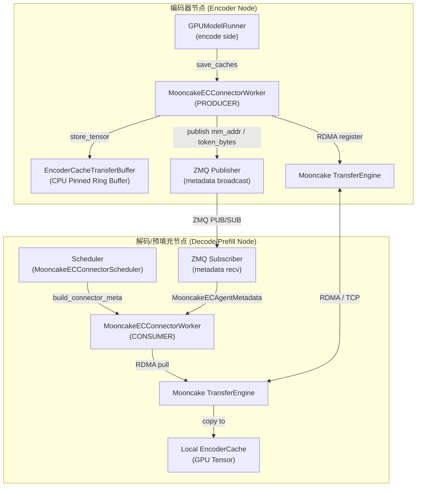
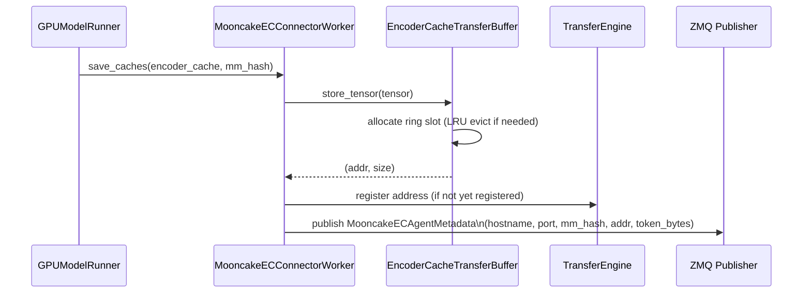
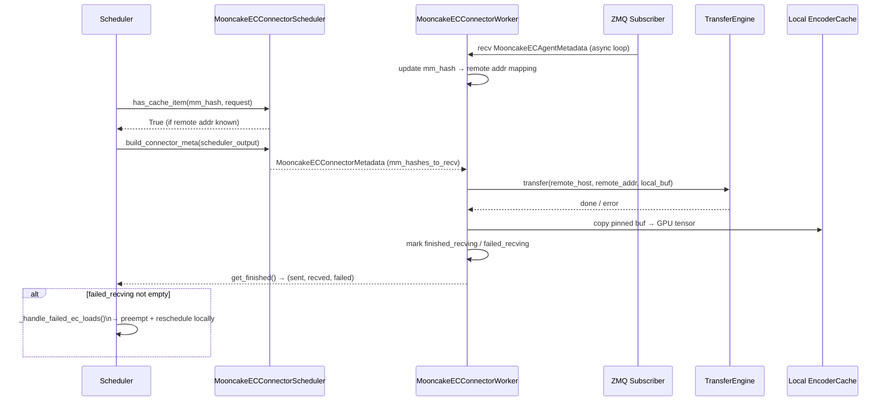
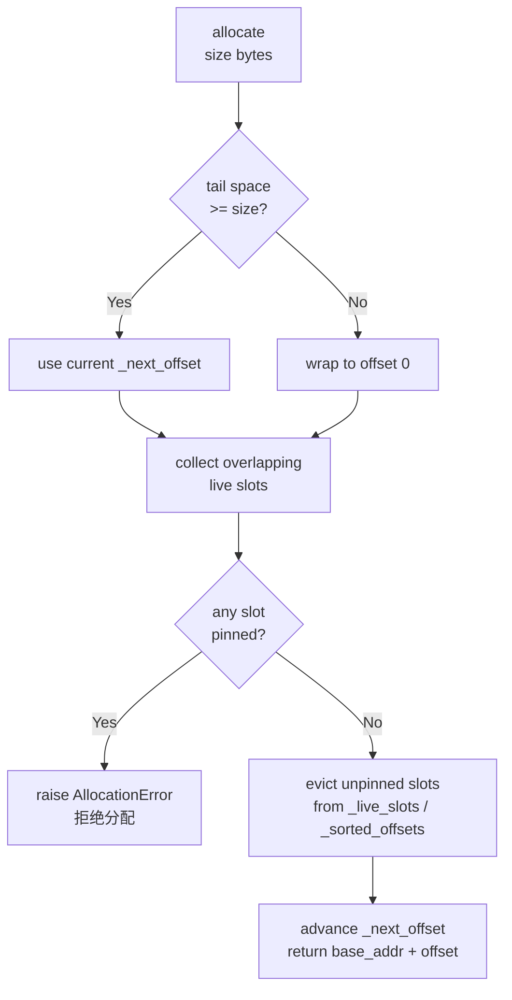

# PR #40695: [EC Connector] Mooncake EC Connector for Distributed Encoder-Cache Transfer

> **作者**: @fake0fan (Chenguang Zheng) | **状态**: OPEN | **日期**: 2026-04-23
> **Branch**: `epd-mooncake-clean` → `main` | **Labels**: `documentation`, `frontend`, `v1`, `kv-connector`
> **变更规模**: +4653 -177 行，涉及 31 个文件

---

## 1. 总结 (Summary)

本 PR 在 vLLM V1 引擎的 EPD（Encoder-Prefill-Decode）解耦架构基础上，引入 **Mooncake TransferEngine** 作为编码器缓存（Encoder Cache）的远程传输后端。核心思路是：编码器节点将多模态 embedding 写入 CPU pinned 环形缓冲区后，通过 Mooncake 的 RDMA 语义传输到解码/预填充节点，彻底摆脱对本地共享存储的依赖。同时，PR 为 EC 传输失败引入了完整的"乐观调度 + 本地重计算"恢复机制，确保在远程 cache miss 时系统能安全降级。

---

## 2. 背景与动机 (Background & Motivation)

### EPD 解耦与 Encoder Cache 传输问题

vLLM V1 的 EPD 架构将多模态请求的编码（Encoder Node）与解码（Decoder/Prefill Node）拆分到不同物理节点，以提升硬件利用率。但分离后，编码器产生的 embedding（视觉 token）需要跨节点传输到解码侧，原有的 `ECExampleConnector` 仅作为演示存根，不具备生产级别的传输能力。

### Mooncake 的角色

Mooncake 是一款面向 AI 推理的分布式 KV 传输引擎，基于 RDMA 提供高带宽、低延迟的内存到内存数据搬运能力，已被 vLLM 用于 KV Cache 传输（`MooncakeConnector`）。本 PR 将其扩展至 Encoder Cache 传输场景，复用相同的 `TransferEngine` 基础设施，形成统一的 Mooncake 传输体系。

### 核心设计约束

- 编码器节点 GPU 显存压力大，避免 CUDA 内存与传输缓冲区竞争：选用 **CPU Pinned Memory** 作为传输暂存区；
- 分布式部署下需要 RDMA 语义：Pinned Memory 满足 `TransferEngine` 注册要求；
- 生产可靠性要求：传输失败不能导致系统崩溃，需平滑降级为本地重计算。

---

## 3. 代码修改分析 (Code Change Analysis)

### 3.1 修改的模块

| 文件 | 操作 | 说明 |
|------|------|------|
| `vllm/distributed/ec_transfer/ec_connector/mooncake_connector.py` | **新增 (1412行)** | Mooncake EC Connector 核心实现，含调度侧与工作侧两个子类 |
| `vllm/distributed/ec_transfer/ec_connector/encoder_cache_transfer_buffer.py` | **新增 (448行)** | CPU Pinned 环形缓冲区管理器，负责传输内存的分配、pin/unpin 与 LRU 淘汰 |
| `vllm/distributed/ec_transfer/ec_connector/base.py` | 修改 | 新增 `wait_for_load()`、`maybe_update_remote_cache_state()` 抽象方法；`get_finished()` 返回三元组（新增 `failed_recving`）；`has_cache_item()` 签名增加 `request` 参数 |
| `vllm/distributed/ec_transfer/ec_connector/factory.py` | 修改 | 注册 `MooncakeECConnector` 至连接器工厂 |
| `vllm/distributed/ec_transfer/ec_connector/example_connector.py` | 修改 | 实现新增的抽象方法 stub（保持向后兼容） |
| `vllm/v1/core/sched/scheduler.py` | 修改 | 新增 `_handle_failed_ec_loads()` / `_ec_connector_finished()`；`update_from_output()` 接入 EC 失败处理；`_free_request()` 返回值扩展为二元组 |
| `vllm/v1/worker/gpu_model_runner.py` | 修改 | 新增 `ECLoadFailure` 异常；`_preprocess()` / `execute_model()` 增加 EC 失败捕获并返回部分输出 |
| `vllm/v1/worker/ec_connector_model_runner_mixin.py` | 修改 | 新增 `maybe_wait_for_ec_load()` 和 `get_finished_ec_transfers()` 静态方法 |
| `vllm/v1/core/encoder_cache_manager.py` | 修改 | 新增辅助方法供 `build_connector_meta` 使用 |
| `vllm/v1/outputs.py` / `vllm/outputs.py` | 修改 | `ECConnectorOutput` 增加 `failed_recving` 字段；`EngineCoreOutput` 增加 `ec_transfer_params` 字段 |
| `vllm/entrypoints/openai/*/protocol.py` | 修改 | Chat/Completion 响应协议增加 `ec_transfer_params` 透传 |
| `vllm/envs.py` | 修改 | 新增 Mooncake EC 相关环境变量 |
| `tests/v1/ec_connector/unit/test_ec_mooncake_connector.py` | **新增 (840行)** | Mooncake Connector 完整单元测试 |
| `tests/v1/core/test_scheduler_encoder_inputs.py` | **新增 (354行)** | 调度器 EC 路径与失败恢复单元测试 |
| `tests/v1/ec_connector/unit/test_encoder_cache_transfer_buffer.py` | **新增 (87行)** | 环形缓冲区单元测试 |
| `examples/online_serving/disaggregated_encoder/mooncake_connector/` | **新增** | 1E1PD / 1E1P1D 集成示例脚本 |
| `examples/online_serving/disaggregated_encoder/disagg_epd_proxy.py` | 修改 | Proxy 增加 Mooncake 路由与 EC 传输参数透传逻辑 |
| `docs/features/disagg_encoder.md` | 修改 | 文档更新 |

### 3.2 架构与流程图

#### 整体组件架构

#### 编码器端数据流（Producer）

#### 解码器端数据流（Consumer）

#### 环形缓冲区分配策略

### 3.3 关键实现细节

**EncoderCacheTransferBuffer（环形缓冲区）**
- 使用 `torch.empty(buffer_size, dtype=torch.uint8, pin_memory=True)` 分配 CPU Pinned Memory；
- 分配策略：写指针 `_next_offset` 单调前进，尾部空间不足则回绕（wrap），自然淘汰最旧的未 pin slot；
- Pin/Unpin：传输中的 slot 通过引用计数保护，防止被覆写；
- 使用 `bisect` 维护有序偏移列表，O(log n) 检测重叠 slot；
- 回调机制（`callbacks`）在 slot 被释放时通知上层更新状态映射。

**MooncakeECConnectorWorker（工作侧）**
- `PRODUCER` 模式：`save_caches()` → `store_tensor()` → ZMQ 广播元数据；
- `CONSUMER` 模式：异步 ZMQ 接收循环（`asyncio` + `ThreadPoolExecutor`）持续接收生产者元数据；`load_caches()` 触发 `TransferEngine` RDMA 拉取，完成后 copy 到 GPU；
- TP（张量并行）感知：每个 TP rank 独立广播/接收本 rank 的 encoder cache slice，通过端口偏移区分；
- 连接缓存（`_connected_hosts`）避免重复建立 `TransferEngine` 连接。

**MooncakeECConnectorScheduler（调度侧）**
- `has_cache_item(mm_hash, request)` 查询 worker 侧已知的远程地址映射；
- `build_connector_meta()` 遍历当前调度批次，为每个需要远程 EC 的 mm_hash 生成 `RecvMMHashMeta`，为生产者侧生成 `SaveMMHashMeta`；
- `request_finished()` 在请求完成时返回 `ec_transfer_params`（含 `do_remote_encode` 标记），供下游 Proxy 路由使用。

**调度器失败恢复（Scheduler）**
- `_handle_failed_ec_loads(failed_mm_hashes)`：将受影响的 running 请求全部 preempt 并重入队列；
- `_disable_remote_ec_for_failed_hashes()`：在请求的 `ec_transfer_params` 中将失败 hash 的 `do_remote_encode` 置为 `False`，下次调度将走本地编码路径。

**Worker 侧异常处理**
- 新增 `ECLoadFailure(RuntimeError)` 异常，携带 `failed_mm_hashes` 集合；
- `execute_model()` 捕获 `ECLoadFailure` 后构造一个仅含 `ec_connector_output.failed_recving` 的 `ModelRunnerOutput` 提前返回，跳过本次前向计算；调度器收到后触发恢复逻辑。

---

## 4. 涉及的技术原理 (Technical Principles)

### EPD 架构（Encoder-Prefill-Decode Disaggregation）

vLLM 的 EPD 解耦将多模态推理分为三类角色：Encoder Node 专注于图像/视频特征提取，Prefill Node 处理 KV Cache 生成，Decode Node 执行自回归解码。角色解耦后，各节点可针对自身工作负载独立优化（如 Encoder Node 可使用更大的 batch size），但随之引入了跨节点数据传输的需求。

### Mooncake TransferEngine

Mooncake 是 Moonshot AI 开源的分布式传输引擎，底层支持 RDMA（InfiniBand/RoCE）和 TCP fallback。其 `TransferEngine` 提供 "注册内存 → 建立连接 → 批量 transfer" 的编程模型：
- 发送方注册 CPU Pinned Buffer 地址，接收方指定目标地址，引擎负责 one-sided RDMA Read；
- CPU Pinned Memory 是 RDMA 操作的必要条件（操作系统不能换页）；
- 与 vLLM 已有的 `MooncakeConnector`（KV Cache 传输）共享同一套安装和配置体系。

### ZMQ PUB/SUB 元数据通道

大块 tensor 数据通过 Mooncake RDMA 传输，但控制元数据（mm_hash、远端地址、token 数量）体量极小，使用 ZMQ PUB/SUB 模式广播：生产者发布，消费者订阅，无需显式握手。`msgspec` 用于高效序列化 `MooncakeECAgentMetadata`。

### CPU Pinned Memory 策略

选用 CPU Pinned Memory 而非 GPU Memory 作为传输暂存区：
1. 避免与 KV Cache、Activation 等 GPU 内存竞争；
2. Mooncake RDMA 直接操作 Pinned Memory，省去 GPU→CPU 拷贝的开销；
3. 生命周期独立于 CUDA stream，管理更简单。

### 乐观调度（Optimistic Scheduling）

调度器在 `has_cache_item()` 返回 True 时就将该 mm_hash 列为"远程 EC 命中"，不等待实际传输完成。若后续传输失败，则通过 preempt + reschedule 恢复。这种乐观策略在传输成功率高时能最小化调度延迟，失败时代价是一轮额外的重调度。

---

## 5. 评论区讨论亮点 (Discussion Highlights)

### Gemini Code Assist 自动审查（关键问题）

**[Critical] EncoderCacheTransferBuffer 竞态条件**
> 在 `store_tensor` 中，`allocate()` 返回地址后，该 slot 尚未被 pin，若另一线程在 `copy_()` 执行期间触发 ring wrap 并淘汰此 slot，将导致静默数据损坏或崩溃。修复方案：分配后立即 pin，拷贝完成后再 unpin。

**[Critical] `ctypes.from_address` 不适用于 GPU 内存**
> `store_tensor` 中使用 `ctypes.from_address` + `torch.frombuffer` 仅对 CPU 内存有效。若 `device="cuda"`（构造函数支持此参数），通过主机端 buffer protocol 访问 GPU 地址将导致 segfault 或未定义行为。建议：对 GPU tensor 改用 tensor slicing/view 而非 ctypes。

**[High] ZMQ 异步 recv 超时不可靠**
> `zmq.asyncio` 的 `sock.recv()` 不总是遵守 `RCVTIMEO` socket 选项，若 producer 无响应可能导致 `receiver_loop` 无限挂起。建议改用 `asyncio.wait_for(sock.recv(), timeout=...)` 在事件循环层面强制超时。

### 总体审查结论

Gemini 总结指出：PR 实现了 Mooncake EC 传输的基础架构，但 `EncoderCacheTransferBuffer` 存在影响正确性的关键缺陷，需在合并前修复。

---

## 6. 风险与潜在问题 (Risk Analysis)

| 风险 | 严重程度 | 说明 |
|------|---------|------|
| `store_tensor` 竞态条件：slot 在拷贝完成前可能被淘汰 | **高** | 多线程并发分配时，allocate 后未立即 pin，ring 回绕可导致数据损坏（已由 Gemini 标记为 Critical） |
| GPU 设备上的 `ctypes.from_address` 非法访问 | **高** | 构造函数支持 `device="cuda"` 但 buffer copy 路径使用了 CPU-only 的 ctypes 接口，将触发 segfault |
| ZMQ `recv()` 超时在 asyncio 下不可靠 | **中** | receiver_loop 线程可能因 producer 异常而永久挂起，导致消费侧所有传输超时堆积 |
| `ec_both` 角色（双角色节点）未支持 | **中** | 当前强制要求节点为单角色（producer 或 consumer），限制了灵活部署拓扑，但有 assert 保护不会静默失效 |
| TP rank 端口偏移硬编码策略 | **中** | 每个 TP rank 使用 `base_port + rank_offset` 区分，若端口范围与外部服务冲突可能导致绑定失败，缺乏端口冲突检测 |
| 乐观调度下批次整体跳过前向计算 | **中** | `ECLoadFailure` 触发时整批请求都被跳过并 preempt，高 EC 失败率场景下可能引发调度抖动和尾延迟劣化 |
| `EncoderCacheTransferBuffer` 缺少显式 free 路径的内存安全保证 | **低** | `free()` 只从 tracking 结构移除，不清零内存，残留数据可能被下一次分配覆写前短暂可读，对安全性要求高的部署有隐患 |
| 测试缺少真实 Mooncake 环境的集成测试 | **低** | 单元测试通过 mock `TransferEngine`，无法覆盖真实 RDMA 路径的时序和错误场景；性能数据尚未提供 |

---

## 7. 结论 (Conclusion)

本 PR 为 vLLM 的 EPD 分布式架构补全了生产级 Encoder Cache 传输能力，整体设计思路清晰，乐观调度与本地重计算的失败恢复机制具有工程价值。但 `EncoderCacheTransferBuffer` 中存在竞态条件和 GPU 内存非法访问两个关键正确性缺陷，需要在合并前修复；ZMQ 超时可靠性问题也建议一并处理。
