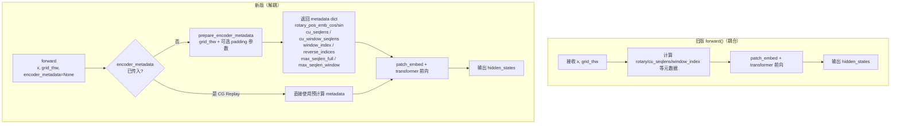
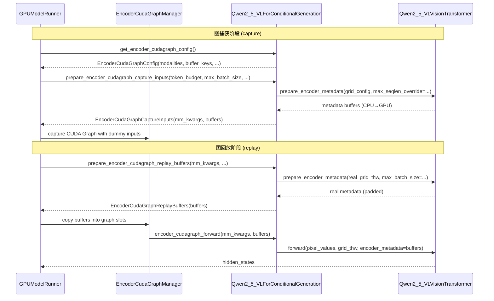

# PR #40830: [MM][CG] Support ViT CG for Qwen2.5-VL

> **作者**: @johncalesp (John Calderon) | **状态**: OPEN | **日期**: 2026-04-24
> **Branch**: `jcalderon/enable-cg-qwen-2-5-vl` → `main` | **Labels**: `multi-modality`, `qwen`
> **变更规模**: +441 -20 行，涉及 2 个文件

---

## 1. 总结 (Summary)

本 PR 为 Qwen2.5-VL 的视觉编码器（ViT）实现了 **CUDA Graph（CG）** 支持，参照 Qwen3-VL（PR #35963）已建立的 `SupportsEncoderCudaGraph` 协议进行适配。核心改动是将 `Qwen2_5_VLVisionTransformer.forward()` 中的元数据计算逻辑重构为独立方法 `prepare_encoder_metadata()`，使其可被 eager 推理、图捕获（capture）和图回放（replay）三条路径共同复用。E2E 测试显示，在编码器密集的 prefill 场景下，开启 ViT CG 后整体 token 吞吐量提升约 **2.5%**，TTFT（首 token 延迟）下降约 **3%**。

---

## 2. 背景与动机 (Background & Motivation)

Qwen2.5-VL 与 Qwen3-VL 同属 Qwen 系列多模态模型，其视觉编码器结构高度相似（均采用窗口注意力 + 全局注意力交错的 ViT）。在 PR #35963 中，vLLM 已为 Qwen3-VL 实现了完整的 ViT CUDA Graph 框架并定义了 `SupportsEncoderCudaGraph` 协议，但 Qwen2.5-VL 并未跟进，导致其 ViT 仍走低效的 eager 执行路径。

**具体问题：**
- 每张图片/视频帧的 ViT 前向都是动态启动数百个 CUDA kernel，kernel 启动开销不可忽略；
- Qwen2.5-VL 的 `Qwen2_5_VLVisionTransformer.forward()` 将元数据准备（rotary 位置编码、cu_seqlens 等）与实际前向计算耦合在一起，无法直接复用于 CUDA Graph 捕获；
- 视频输入（EVS 非零时，帧数据动态变化）无法进行图捕获，因此仅在关闭 EVS（`video_pruning_rate=0.0`）时才启用视频 CUDA Graph。

本 PR 通过最小侵入式重构解决了上述问题，使 Qwen2.5-VL 与框架已有的 `EncoderCudaGraphManager` 完全对接。

---

## 3. 代码修改分析 (Code Change Analysis)

### 3.1 修改的模块

| 文件 | 操作 | 说明 |
|------|------|------|
| `vllm/model_executor/models/qwen2_5_vl.py` | 修改 | 重构 ViT 元数据计算；实现 `SupportsEncoderCudaGraph` 协议全部方法 |
| `tests/models/multimodal/generation/test_qwen2_5_vl.py` | 修改 | 新增 CUDA Graph vs Eager 一致性测试用例 |

### 3.2 架构 / 流程图

#### ViT 前向路径重构（元数据分离）

#### SupportsEncoderCudaGraph 协议调用流程

### 3.3 关键实现细节

**`prepare_encoder_metadata()` 新方法（qwen2_5_vl.py:773+）**
- 将原 `forward()` 中从 `grid_thw` 计算 rotary 位置编码、`cu_seqlens`、`window_index` 等元数据的逻辑完整抽出
- 支持三个可选参数用于 CUDA Graph 场景：
  - `max_batch_size`：将 `cu_seqlens` 填充到固定长度，保证图回放不越界
  - `max_frames_per_batch`：视频输入时每 item 贡献 T 条注意力序列，需以帧数而非批次数决定填充长度
  - `max_seqlen_override`：捕获时强制设置 `max_seqlen_full` 为最坏情况上界，防止标量被"烘焙"进图中导致回放失败

**`prepare_encoder_cudagraph_capture_inputs()` 方法**
- 使用 ceiling 除法（`(token_budget + max_batch_size - 1) // max_batch_size`）计算每 item 的 token 分配，避免下取整导致 replay 时缓冲区不足
- 视频场景（`frames_per_item > 1`）构造 video 格式的 dummy `grid_config`（T > 1），确保 `cu_seqlens` 从捕获起就按视频 frame 数量分配

**`get_encoder_cudagraph_config()` 与 EVS 联动**
- 当 `is_multimodal_pruning_enabled`（即 EVS 剪枝开启）时，`modalities` 只包含 `image`，视频跳过 CG 走 eager 路径
- 定义了 8 个 `buffer_keys` 与 `prepare_encoder_metadata` 返回的 dict keys 完全对应

**`select_encoder_cudagraph_items()` 方法**
- 根据 `grid_thw` 中每 item 的 patch 数计算累计偏移量，支持从 `pixel_values` 中精确切片任意 item 子集

**测试新增（test_qwen2_5_vl.py）**
- `test_qwen2_5_vl_vision_transformer_cudagraph_matches_eager`：同一模型先跑 eager，再跑 CG，断言 greedy token ids 完全一致
- 通过 `@pytest.mark.skipif(not current_platform.is_cuda())` 限定 CUDA 环境运行
- 固定 `video_pruning_rate=0.0` 确保视频路径也能走 CG

---

## 4. 涉及的技术原理 (Technical Principles)

**CUDA Graph 与 ViT 的适配挑战**
CUDA Graph 要求捕获时的输入形状必须与回放时完全一致。ViT 的输入 token 数随图片分辨率变化（`total_tokens = T × H × W`），本质上是动态形状。解决方案是「按预算（token budget）捕获 + 填充到固定大小」：捕获时使用哑输入填满整个 budget；回放时将真实输入在 token 维度填充到相同大小，多余位置对输出无贡献。

**`cu_seqlens` 的填充策略**
FlashAttention 的 varlen 接口通过 `cu_seqlens` 指定 batch 内每条序列的边界（累计长度数组）。CUDA Graph 要求 `cu_seqlens` 数组长度固定，因此需将其填充到 `max_batch_size + 1`（图片）或 `max_frames_per_batch + 1`（视频）。填充值使用最后一个真实值（即总 token 数），效果等同于追加 0 长度的虚序列。

**`max_seqlen` 的处理**
FlashAttention 还需要 `max_seqlen` 标量张量。该值若直接从动态 `cu_seqlens` 计算，会产生依赖数据的标量（可能被 `.item()` 读出后作为常量烘焙进 CUDA Graph）。为此，捕获时用 `max_seqlen_override = token_budget × spatial_merge_size²` 作为安全上界，避免 host-device 同步，回放时使用真实值填充。

**窗口注意力（Window Attention）与全局注意力**
Qwen2.5-VL 的 ViT 交替使用窗口注意力（每 `temporal_window_size` 帧一组）和全局注意力。`prepare_encoder_metadata` 需同时维护两套 `cu_seqlens`（`cu_window_seqlens` 和 `cu_seqlens`）及对应的 `max_seqlen`，这是相比纯全局注意力 ViT 额外的复杂度。

**EVS（Efficient Video Sampling）与 CG 的互斥**
EVS 根据相邻帧差异动态丢弃冗余 token，每帧保留 token 数不固定，因此无法走 CUDA Graph（输入形状运行时才能确定）。本 PR 通过 `is_multimodal_pruning_enabled` 标志将视频 CG 条件化，EVS 开启时自动降级到 eager。

---

## 5. 评论区讨论亮点 (Discussion Highlights)

**Review 请求（Issue Comments）**
- @DarkLight1337（Member）：请求 @shen-shanshan 协助 review
- @shen-shanshan（Contributor）：接受 review 请求

**Inline 代码评论**
- **gemini-code-assist [高优先级]**：指出 `max_seqlen_full` 和 `max_seqlen_window` 两个张量在计算时尚未被 `.to(device=device)` 转移——当 `max_seqlen_override` 为 `None` 时，这两个值由 `compute_attn_mask_seqlen()` 从 CPU 上的 `cu_seqlens`/`cu_window_seqlens` 计算得到，结果仍在 CPU；当 `max_seqlen_override` 非 `None` 时，`torch.tensor(max_seqlen_override)` 默认创建在 CPU。bot 给出了明确的修复建议：在其他张量 `.to(device)` 之后追加对 `max_seqlen_full` 和 `max_seqlen_window` 的相同调用。
  
- **@johncalesp（PR 作者）**：回复"already reside on same device"——此回复存疑。从 diff 来看，`max_seqlen_full` 和 `max_seqlen_window` 的计算发生在 `cu_seqlens`/`cu_window_seqlens` 被 `.to(device)` **之前**，因此它们实际上仍是 CPU 张量。这一 bot 评论值得认真对待，属于**未解决的潜在 bug**。

---

## 6. 风险与潜在问题 (Risk Analysis)

| 风险 | 严重程度 | 说明 |
|------|---------|------|
| `max_seqlen_full` / `max_seqlen_window` 未移至目标设备 | **高** | 这两个张量被列入 `buffer_keys`，CUDA Graph 回放时需复制进 GPU buffer；若其在 CPU，回放时将触发隐式 H2D 同步或 copy 错误。作者回复"already on device"存疑，代码逻辑证明不成立，需修复后验证 |
| 视频 EVS 与 CG 条件逻辑耦合 | **中** | `is_multimodal_pruning_enabled` 的判断路径需覆盖所有配置组合（partial EVS 等），若未来 EVS 支持 per-modality 开关，此处逻辑需同步更新 |
| `per_mm_item_output` ceiling 计算仅用于 buffer sizing | **低** | Ceiling 分配使捕获时 dummy token 总数略大于 `token_budget`，实际不影响正确性，但在极端边界（如 budget=1）时值得单测覆盖 |
| 测试仅覆盖视频路径，图片路径无专项 CG 测试 | **低** | 新增的 `test_qwen2_5_vl_vision_transformer_cudagraph_matches_eager` 使用视频输入（`VIDEO_ASSETS`），图片 CG 路径的等价性未被显式断言 |
| `get_max_frames_per_video` 依赖 MM_REGISTRY 全局状态 | **低** | 该方法通过 `MULTIMODAL_REGISTRY` 获取 processing info，若 registry 未正确初始化（如某些 unit test 场景）可能抛出异常 |

---

## 7. 结论 (Conclusion)

本 PR 实现思路清晰、与 Qwen3-VL 的先例高度一致，成功将 `SupportsEncoderCudaGraph` 协议适配到 Qwen2.5-VL，`prepare_encoder_metadata()` 的抽取重构也体现了良好的代码设计。然而，**`max_seqlen_full`/`max_seqlen_window` 未移至目标设备**这一 gemini 评论指出的问题尚未得到正确处理，在合并前需明确修复或提供更充分的论证；建议同时补充图片模态的 CG 一致性测试。
