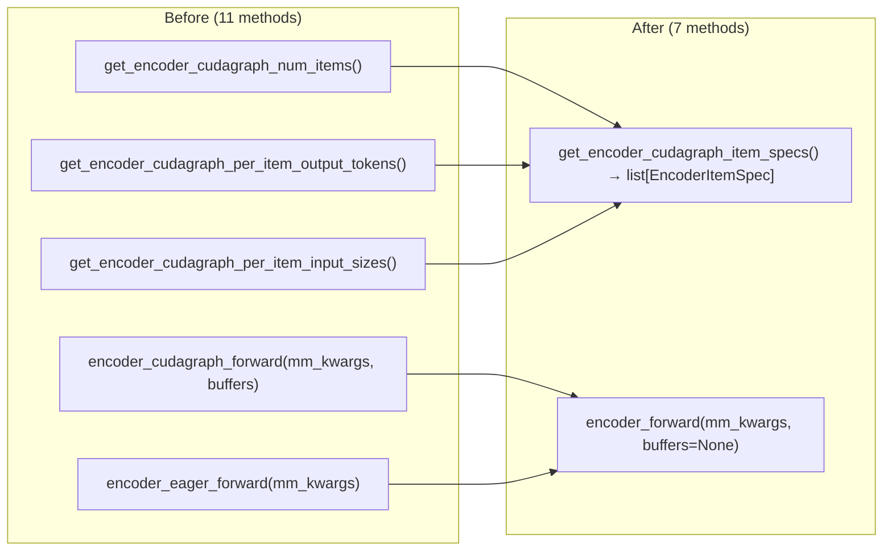
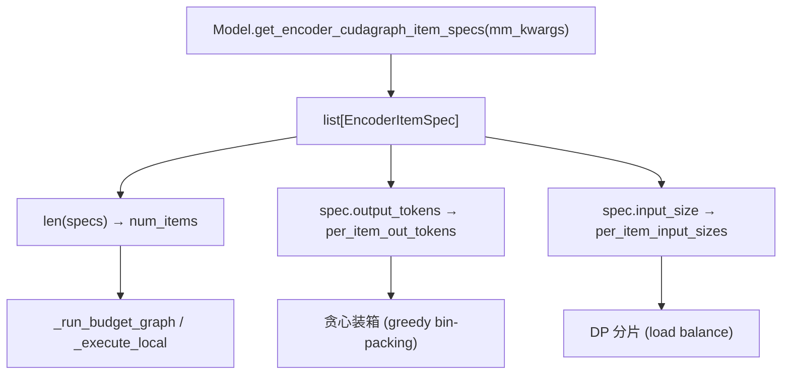
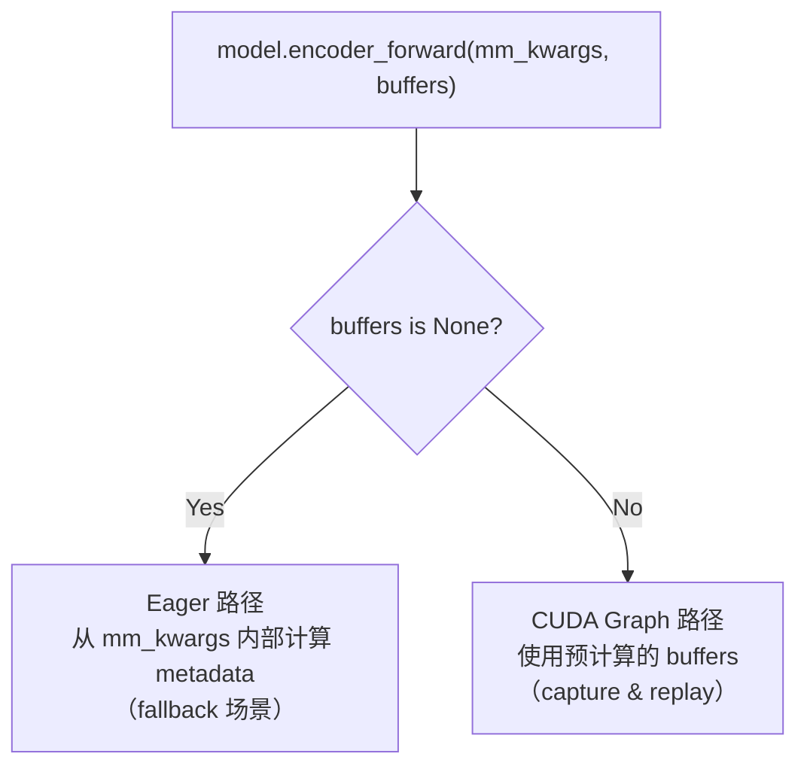

# PR #41234: [Multimodal] Simplify ViT CUDA graph interfaces

> **Author**: @Isotr0py | **State**: OPEN | **Date**: 2026-04-29
> **Branch**: `refactor-vit-cg` → `main` | **Labels**: `v1`, `multi-modality`, `qwen`, `nvidia`
> **Changes**: +109 -126 lines across 6 files

---

## 1. 总结 (Summary)

本 PR 对 vLLM 中 ViT CUDA Graph 的模型接口进行了简化重构。核心改动是将原先 3 个独立的方法（`get_encoder_cudagraph_num_items`、`get_encoder_cudagraph_per_item_output_tokens`、`get_encoder_cudagraph_per_item_input_sizes`）合并为一个 `get_encoder_cudagraph_item_specs`，返回 `EncoderItemSpec` 列表；同时将 `encoder_cudagraph_forward` 和 `encoder_eager_forward` 合并为一个 `encoder_forward`，通过 `buffers` 参数是否为空来区分 CUDA graph 和 eager 路径。对于模型实现者而言，需实现的方法数从约 11 个减少到了约 7 个，显著降低了接入门槛。

---

## 2. 背景与动机 (Background & Motivation)

PR #35963（ViT Full CUDA Graph）引入了 `SupportsEncoderCudaGraph` 协议，使得各 ViT 模型可以通过实现一组协议方法来接入 CUDA Graph 加速。但在实际推广过程中发现，协议要求模型实现的方法过多（约 11 个），其中：

- **`get_encoder_cudagraph_num_items`**、**`get_encoder_cudagraph_per_item_output_tokens`** 和 **`get_encoder_cudagraph_per_item_input_sizes`** 三个方法本质上都是对同一批 `grid_thw` 数据的不同维度聚合计算，逻辑高度重复。
- **`encoder_cudagraph_forward`** 和 **`encoder_eager_forward`** 在多数模型中只有 buffers 参数的有无区别，其余代码完全相同。

这种冗余设计增加了新模型接入的工作量，也使得现有实现（如 Qwen3-VL、测试 mock 类）中存在大量样板代码。本 PR 旨在通过接口整合来降低维护成本和接入门槛。

---

## 3. 代码修改分析 (Code Change Analysis)

### 3.1 修改的模块

| 文件 | 操作 | 说明 |
|------|------|------|
| `vllm/v1/worker/encoder_cudagraph_defs.py` | 修改 | 新增 `EncoderItemSpec` 数据类；`EncoderCudaGraphConfig` 新增 `max_frames_per_video` 字段 |
| `vllm/v1/worker/encoder_cudagraph.py` | 修改 | Manager 使用新 API：`_get_item_specs()` 统一获取 item 信息；`max_frames_per_video` 从 config 读取而非调用 model 方法 |
| `vllm/model_executor/models/interfaces.py` | 修改 | Protocol 定义更新：3 个方法合并为 1 个；2 个 forward 方法合并为 1 个 |
| `vllm/model_executor/models/qwen3_vl.py` | 修改 | 实现新的合并接口；`get_input_modality` 添加显式 elif/else 分支；config 中传入 `max_frames_per_video` |
| `tests/v1/cudagraph/test_encoder_cudagraph.py` | 修改 | 测试 mock 类适配新接口 |
| `tests/models/multimodal/generation/test_vit_cudagraph.py` | 修改 | 移除 `create_new_process_for_each_test` 装饰器（无关清理） |

### 3.2 架构 / 流程图 (Architecture / Flow Diagram)

#### 接口合并前后对比

#### EncoderItemSpec 数据流

#### encoder_forward 统一调用路径

### 3.3 关键实现细节 (Key Implementation Details)

**新数据类 `EncoderItemSpec`（`encoder_cudagraph_defs.py`）**
- 包含 `input_size: int`（输入 patches/rows 数）和 `output_tokens: int`（编码后 token 数）两个字段。
- 将原先分散在三个返回值中的数据聚合到一个结构体，manager 通过 `len(specs)`、`spec.output_tokens`、`spec.input_size` 分别获取所需信息。

**`EncoderCudaGraphConfig.max_frames_per_video` 新增字段**
- 原先 manager 在 `__init__` 中调用 `self.model.get_max_frames_per_video()` 获取该值。
- 现在由模型在构建 config 时直接传入，manager 从 `self.config.max_frames_per_video` 读取，减少了对 model 协议方法的依赖。

**Manager 新增 `_get_item_specs()` 辅助方法**
- 封装对 `self.model.get_encoder_cudagraph_item_specs(mm_kwargs)` 的调用。
- `_get_per_item_out_tokens()`、`_run_budget_graph()`、`_execute_local()`、`_dp_shard()` 均通过它获取 item 信息。

**Qwen3-VL 显式 modality 检查**
- `get_input_modality` 不再以 `return "video"` 作为 fallback，改为显式检查 `video_grid_thw`，并在不匹配时 `raise AssertionError`。
- `_get_pixel_values_by_modality` 和 `prepare_encoder_cudagraph_replay_buffers` 也采用显式 if/elif/else 分支。

**Protocol 接口简化（`interfaces.py`）**
- 3 个 getter 方法 → 1 个 `get_encoder_cudagraph_item_specs`。
- `encoder_cudagraph_forward` + `encoder_eager_forward` → 1 个 `encoder_forward(mm_kwargs, buffers=None)`。

---

## 4. 涉及的技术原理 (Technical Principles)

### 4.1 Protocol-based 多态设计

vLLM 使用 `SupportsEncoderCudaGraph` Protocol（`typing.Protocol`）来定义 ViT 模型与 `EncoderCudaGraphManager` 之间的契约。Protocol 是 Python 的结构化类型系统，允许多个不共享基类的模型类只要实现了相同的方法签名即可被 manager 统一调用。本 PR 的核心优化是减少协议中冗余的方法定义，降低实现者的认知负担。

### 4.2 CUDA Graph 的 Buffer 机制

`encoder_forward` 中 `buffers` 参数的设计是 CUDA Graph 的关键约束的体现：CUDA Graph replay 要求所有 tensor 地址不变，因此 capture 时预分配的 buffer 必须在 replay 时通过 `copy_` 写入新数据而非重新分配。当 `buffers` 为 `None` 时，模型内部自行计算 metadata（eager fallback 路径），不需要遵守地址不变约束。

### 4.3 EncoderItemSpec 的数据聚合模式

原先的三个方法各自遍历 `grid_thw` 列表做不同聚合（计数/输出 token 计算/输入 size 计算），相当于对同一数据做了三次迭代。合并后的 `get_encoder_cudagraph_item_specs` 一次遍历生成 `EncoderItemSpec` 列表，manager 按需从中提取字段，消除了重复计算。

---

## 5. 评论区讨论亮点 (Discussion Highlights)

### Gemini Code Assist 自动 Review

**建议 1：使用 `ValueError` 替代 `AssertionError`**
> 指出在 `qwen3_vl.py` 中对 unreachable code 使用 `raise AssertionError` 不推荐，建议改为 `raise ValueError` 或自定义异常，以提供更具描述性的错误信息。

**建议 2：错误消息应更具体**
> 指出 `encoder_cudagraph.py` 中 `_detect_input_key` 的 `ValueError` 消息应包含模型名称或具体 modality 上下文，以便调试时快速定位问题。

### 作者评论

作者 @Isotr0py cc 了 @shen-shanshan 和 @b-mu（PR #35963 的作者），说明本 PR 是对 ViT CUDA Graph 接口的后续清理工作。

---

## 6. 风险与潜在问题 (Risk Analysis)

| 风险 | 严重程度 | 说明 |
|------|---------|------|
| **接口兼容性断裂** | High | 任何已实现 `SupportsEncoderCudaGraph` 协议但尚未合并到主分支的模型（如 PR #35963 正在推进中的其他 ViT 模型分支）需要同步更新，否则会出现 `AttributeError`。所幸当前主分支上只有 `qwen3_vl.py` 实现了该协议，影响范围可控。 |
| **AssertionError 在 production code 中的使用** | Low | `qwen3_vl.py` 中多处使用 `raise AssertionError` 标注 unreachable 分支。Python 的 `-O` 优化模式会跳过 assert 语句但不会跳过 `raise AssertionError`，因此不会静默丢失检查，但不符合 Python 惯例。Gemini Code Assist 已指出此问题。 |
| **`input_key` 重复赋值** | Low | `encoder_cudagraph.py` 中存在 `input_key = input_key = ...` 的重复赋值（疑似编辑遗留），功能上无影响但影响可读性。 |
| **测试覆盖** | Low | 测试文件同步更新了 mock 类，覆盖了新旧接口的等价性验证。移除 `create_new_process_for_each_test` 是独立的测试基础设施改进，不影响覆盖率。 |

---

## 7. 结论 (Conclusion)

PR #41234 是一个目标明确、改动集中的接口重构，将 ViT CUDA Graph 协议方法从约 11 个减少到约 7 个，有效降低了新模型接入的样板代码量。改动范围小（+109/-126），对现有功能无逻辑变更——只是接口层面的等价合并。建议关注 Gemini Code Assist 提出的 `AssertionError` → `ValueError` 替换建议，以及 `encoder_cudagraph.py` 中的重复赋值问题。整体质量良好，适合在解决小问题后合入。
