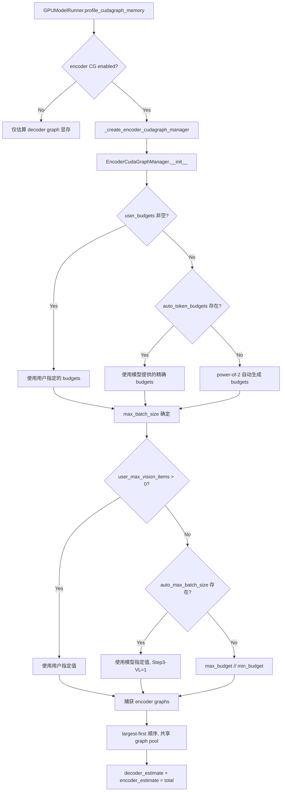
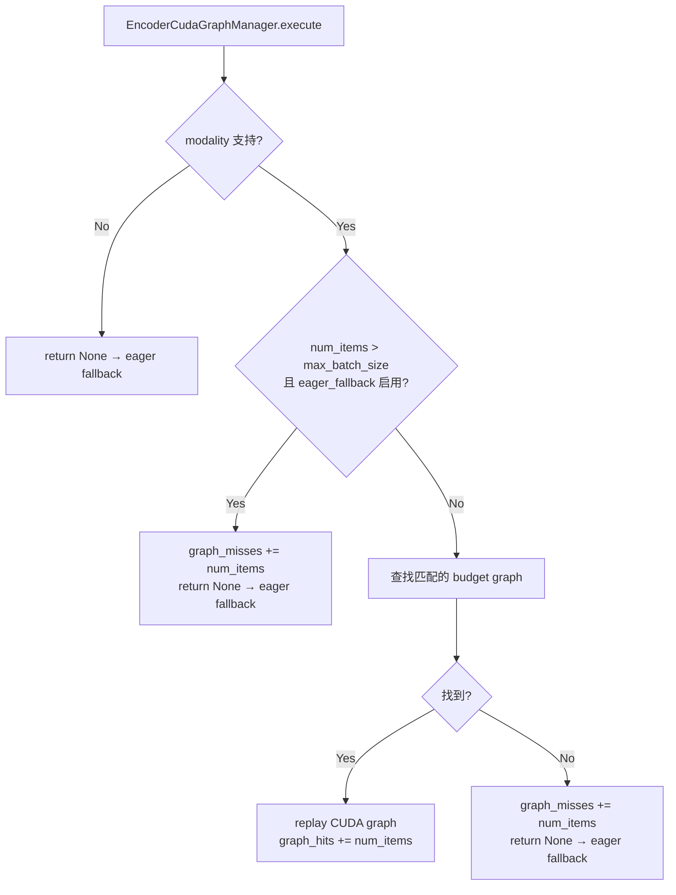
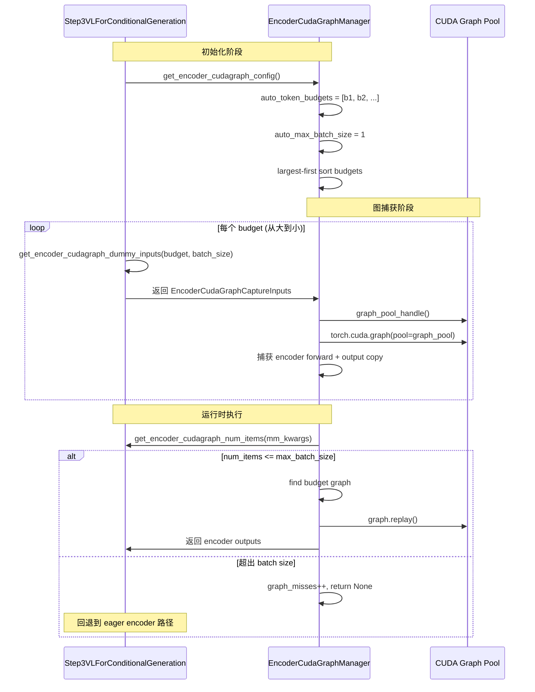

# PR #41714: [MM][CG] Support encoder CUDA graphs for Step3-VL

> **Author**: @BWAAEEEK (JooHo Lee) | **State**: OPEN | **Date**: 2026-05-05
> **Branch**: `step3-vl-vit-cudagraph-review` → `main` | **Labels**: `documentation`, `v1`, `multi-modality`, `nvidia`
> **Changes**: +1506 -110 lines across 9 files
> **Review Requests**: @DarkLight1337, @ywang96, @njhill

---

## 1. 总结 (Summary)

该 PR 为 Step3-VL / StepVL 模型添加了 image-only encoder CUDA Graph 支持。核心思路是将 Step3-VL 接入现有的 encoder CUDA Graph 框架，引入模型特定的 auto token budgets（基于图像和 patch 特征尺寸计算），限制 `max_batch_size=1` 进行图捕获，并在运行时对不支持的输入（如多图像批次、precomputed `image_embeds`）回退到 eager 执行路径。同时将 encoder CUDA graph 显存纳入 CUDA graph 显存预估，避免 KV cache 错误地高估可用显存。

## 2. 背景与动机 (Background & Motivation)

vLLM 的 encoder CUDA Graph 机制通过将视觉编码器（ViT）的前向传播捕获为 CUDA Graph 来减少 kernel launch overhead，目前已支持 Qwen2.5-VL、Qwen3-VL、Kimi-VL 等模型。Step3-VL / StepVL 作为 stepfun-ai 的多模态模型系列，尚未接入该框架。

该 PR 旨在填补这一空白，同时推动 encoder CUDA Graph 框架的几个通用改进：
- 模型可以提供**精确的 auto token budgets**（而非仅依赖 power-of-2 自动生成）
- encoder graph 共享 **CUDA graph memory pool**（largest-first 捕获顺序，小图复用大图的显存池）
- encoder CUDA graph 显存需纳入 `profile_cudagraph_memory()` 的预估中
- 支持 **eager fallback** 机制：当运行时 item 数量超过捕获的 batch size 时回退到 eager 路径

PR 作者在 A100 和 B200 上分别进行了 benchmark，单图场景有约 7% 的 encoder 延迟改善。

## 3. 代码修改分析 (Code Change Analysis)

### 3.1 修改的模块

| 文件 | 变更 | 说明 |
|------|------|------|
| `vllm/model_executor/models/step3_vl.py` | +390 -2 | 核心：实现 `SupportsEncoderCudaGraph` 接口，添加 budget 计算、图捕获输入准备、replay/eager forward 方法 |
| `vllm/model_executor/models/step_vl.py` | +25 -1 | StepVL 继承 Step3VL 的 CG 支持，覆盖 ViT 结构差异部分 |
| `vllm/v1/worker/encoder_cudagraph.py` | +70 -21 | 支持模型提供的 `auto_token_budgets` 和 `auto_max_batch_size`；添加 `min_budget` 正数校验；引入 shared graph pool；添加 `eager_fallback_for_excess_items` 逻辑 |
| `vllm/v1/worker/encoder_cudagraph_defs.py` | +15 -0 | `EncoderCudaGraphConfig` 新增三个字段：`auto_max_batch_size`、`auto_token_budgets`、`eager_fallback_for_excess_items` |
| `vllm/v1/worker/gpu_model_runner.py` | +130 -81 | 重构 encoder CG manager 初始化逻辑；将 encoder graph 显存纳入 CUDA graph profiling；提取 `_create_encoder_cudagraph_manager()` 和 `_maybe_init_encoder_cudagraph_manager()` |
| `tests/v1/cudagraph/test_encoder_cudagraph.py` | +647 -0 | 大量新增测试：`TestEncoderCudaGraphInit`（min_budget 校验、auto budgets 精确性、budget 排序）、`TestEncoderCudaGraphStep3Budget`（Step3-VL 特定 budget 计算）等 |
| `tests/v1/worker/test_gpu_model_runner.py` | +190 -0 | 新增 `test_profile_cudagraph_memory_with_encoder` 测试 encoder graph 显存预估逻辑 |
| `tests/models/multimodal/generation/test_vit_cudagraph.py` | +31 -2 | 新增 `step3_vl` e2e 测试配置，验证 encoder CG 初始化、budget 捕获、graph hits/misses |
| `docs/design/cuda_graphs_multimodal.md` | +8 -3 | 更新文档：说明 auto budgets 三种来源、shared pool、encoder profiling，更新模型支持表 |

### 3.2 架构 / 流程图 (Architecture / Flow Diagram)

### 3.3 关键实现细节 (Key Implementation Details)

- **Step3-VL budget 计算** (`step3_vl.py:get_encoder_cudagraph_config`)：基于 `_get_image_feature_size()` 和 `_get_projected_feature_size()` 计算图像 patch 特征维度，生成三个 budget 级别覆盖单 patch 到全尺寸图像的 token 数量。budget range 为 `[image_feature_size, vit_hidden_size * max_image_tokens]`。

- **`eager_fallback_for_excess_items`**：Step3-VL 设置 `auto_max_batch_size=1` 和 `eager_fallback_for_excess_items=True`。当运行时 item 数量超过 1（多图像请求），`execute()` 返回 `None`，触发上层 `gpu_model_runner` 回退到 eager encoder 路径，避免重复 replay 单 item graph 导致的性能倒退。

- **Shared CUDA graph memory pool** (`encoder_cudagraph.py:_capture_budget_graph`)：encoder graph 捕获从大到小进行，`graph_pool` 在首次 `_capture_budget_graph` 时创建并复用，小 budget graph 复用大 graph 的显存池而非各自独立分配。

- **Encoder graph 显存 profiling** (`gpu_model_runner.py:profile_cudagraph_memory`)：在 profiling 阶段创建临时 encoder CG manager，用相同 budget 列表和 largest-first 顺序捕获，将 encoder 估计值单独加到 decoder 估计值上（而非 overlay），因为两者使用独立的 graph pool。

- **正向校验**：`min_budget` 必须为正数，`auto_max_batch_size` 必须为正数（如果指定），`auto_token_budgets` 必须至少有一个值落在 `[min_budget, max_budget]` 范围内。

## 4. 涉及的技术原理 (Technical Principles)

- **CUDA Graph**：将一系列 CUDA kernel launch 预先录制为图（graph），运行时通过 `graph.replay()` 一次性提交所有 kernel，消除 CPU launch overhead。适用于固定输入形状的计算图（如 ViT encoder 对固定 token 数量的处理）。

- **Encoder CUDA Graph**：vLLM V1 中专门针对多模态视觉编码器的 CUDA Graph 机制。根据 token budget（即图像 token 数量）预先捕获多个 graph，运行时贪心 bin-packing 选择最匹配的 budget 执行。

- **Token Budget**：指 ViT encoder 输出的 token 数量。不同分辨率的图像产生不同数量的视觉 token，因此需要多个 budget 级别覆盖不同输入规模。Token budget 基于图像特征尺寸（image_feature_size/patch_count）和模型隐藏维度计算。

- **Shared Graph Pool**：CUDA Graph 需要预留显存来存储图中间激活值。通过 largest-first 捕获并使用共享 pool，小图可以直接复用大图已分配的显存区域，避免为每个 budget 级别单独分配显存池，减少总体显存占用。

- **Eager Fallback**：当运行时输入不匹配任何已捕获的 graph（如 batch size 超出、precomputed embeddings），回退到标准的 eager PyTorch 执行路径，保证功能正确性优先于性能。

## 5. 评论区讨论亮点 (Discussion Highlights)

- **Gemini Code Assist** 在 inline review 中指出了 `max_batch_size = max_budget // min_budget` 中潜在的 `ZeroDivisionError`（当 `min_budget=0` 时）。PR 作者回应已添加 `min_budget` 正数校验并编写了对应的单元测试 (`test_min_budget_must_be_positive`)。

- **PR 作者**在对性能回归问题的长篇回应中说明：起初的实现在多图像请求下存在严重性能倒退（CG ON 的 TTFT 比 CG OFF 高约 84%）。根本原因是 `max_batch_size=1` 对 Step3-VL 是故意保守的设计（当前 encoder graph budgets 是 single-item budgets），不能简单移除限制。解决方案是引入 `eager_fallback_for_excess_items` 机制，当运行时 item 数超过 batch size 时自动回退 eager 路径，避免多次 replay 单 item graph。修改后在 B200 上 2-image 场景的 TTFT 从 329ms 降至 192ms。

- **Merge conflicts**：Mergify 已标记该 PR 存在合并冲突，需要 rebase 到最新 main 分支。

- **与 #42224 的重叠**：PR 作者承认与 #42224 存在实现重叠（可能涉及类似的多图回退逻辑），表示愿意根据 maintainer 的偏好选择最终采用哪个实现。

## 6. 风险与潜在问题 (Risk Analysis)

| 风险 | 严重程度 | 说明 |
|------|---------|------|
| 合并冲突 | Medium | PR 当前与 main 分支存在合并冲突，需要 rebase。可能与其他 encoder CG 相关 PR（如 #41234 draft refactor、#42224）有进一步冲突 |
| 多图像性能未完全解决 | Medium | 虽然通过 eager fallback 避免了严重倒退，但 2-image CG ON (192ms) 仍略慢于 eager 基线 (178ms)。Step3-VL encoder CG 尚未成为通用性能提升方案 |
| `max_batch_size=1` 限制 | Low | 设计上故意保守，但可能限制了 encoder CG 在多图像批处理场景下的收益。PR 描述指出需要额外的 capture sizing 和 patch distribution 验证才能安全打开 |
| 视频支持缺失 | Low | PR 明确表示不支持 video input。如果未来需要视频 encoder CG，需要额外开发 |
| 与 #41234 的兼容性 | Low | #41234 是 encoder CG 接口的 draft refactor，如果该 PR 先合并，本 PR 需要相应调整 |
| `VLLM_ALLOW_INSECURE_SERIALIZATION` 测试依赖 | Low | e2e 测试通过 monkeypatch 设置该环境变量，仅在测试环境中使用 pickle 序列化，生产环境不受影响 |

## 7. 结论 (Conclusion)

该 PR 为 Step3-VL / StepVL 模型提供了完整且保守的 encoder CUDA Graph 支持，代码质量较好，包含详尽的单元测试和 e2e 测试。其框架层面的改进（auto token budgets、shared graph pool、eager fallback、encoder profiling）对其他模型也有复用价值。当前主要待解决的问题是合并冲突以及与 #42224 的实现选择协调。
