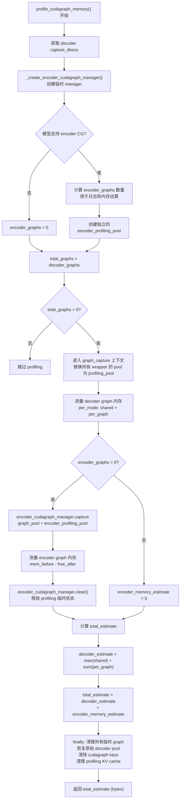
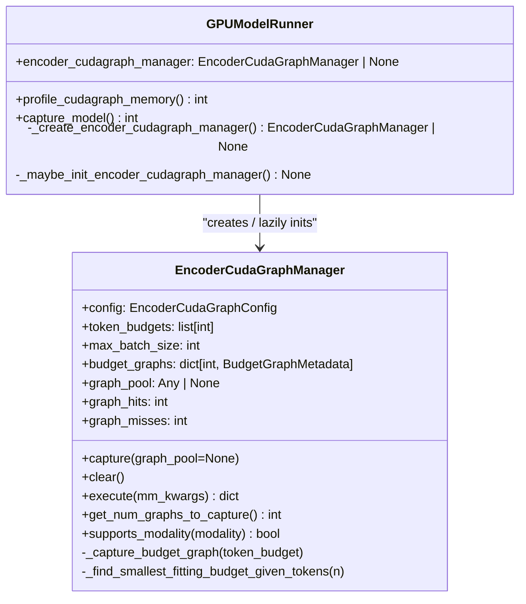
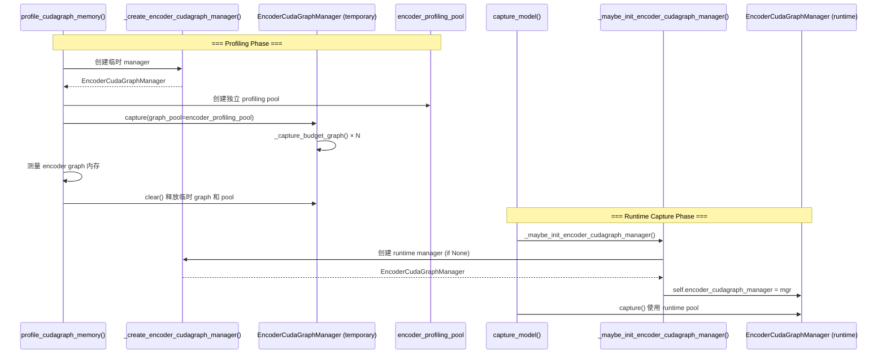

# PR #41714: [MM][CG] Profile encoder CUDA graph pool memory

> **Author**: @BWAAEEEK (JooHo Lee) | **State**: OPEN | **Date**: 2026-05-05
> **Branch**: `step3-vl-vit-cudagraph-review` → `main` | **Labels**: `documentation`, `v1`, `multi-modality`, `nvidia`
> **Changes**: +185 -89 lines across 3 files
> **Review Requests**: @DarkLight1337, @ywang96, @njhill

---

## 1. 总结 (Summary)

本 PR 为 vLLM 的 encoder CUDA graph 机制引入了 **graph pool 内存 profiling 支持**。核心改动包括：(1) `EncoderCudaGraphManager.capture()` 支持将 encoder graph 捕获到独立的 graph pool 中；(2) `profile_cudagraph_memory()` 在 profiling 阶段创建临时的 encoder CUDA graph manager，测量 encoder graph 的内存占用，并将其计入总的 CUDA graph 内存估算；(3) 将 encoder CUDA graph manager 的初始化逻辑抽取为可复用的 helper 方法。

该 PR 经历了多次迭代演进：最初包含完整的 Step3-VL/StepVL 模型 encoder CUDA graph 支持，在 #42224 合并后，按维护者建议精简为仅保留 graph-pool/profiling 部分，模型特定改动已全部移除。

---

## 2. 背景与动机 (Background & Motivation)

vLLM 的 CUDA graph 内存 profiling 机制（`GPUModelRunner.profile_cudagraph_memory()`）负责在模型加载阶段估算所有 CUDA graph 的总内存占用。在此之前，该机制仅覆盖 decoder graph（FULL 和 PIECEWISE 模式），**encoder CUDA graph 的内存占用未被纳入估算**。

当 `cudagraph_mm_encoder` 配置开启时，encoder graph 会使用独立的 graph pool，与 decoder graph pool 在内存上是分离的。如果不将其内存占用纳入总估算，实际运行时可能出现：

- GPU 内存超分（over-subscription），导致 OOM；
- 内存估算报告不准确，影响 KV cache 分配和资源规划。

本 PR 填补了这一空白，使得 encoder CUDA graph 的内存占用在 profiling 阶段被准确测量并累加到总估算中。

### PR 演进历史

| 时间 | 里程碑 |
|------|--------|
| 2026-05-05 | 初始提交：Step3-VL/StepVL encoder CUDA graph 完整支持（模型改动 + graph pool + profiling），共 9 个文件 +1506/-110 行 |
| 2026-05-11 | 第一次修订：修复多图场景下 encoder CG 导致 TTFT 严重倒退的问题（2 images CG ON 329ms vs CG OFF 178ms），`max_batch_size > 1` 时回退 eager |
| 2026-05-12 | 第一次 Review（@shen-shanshan）：ViT CG 整体流程 LGTM，但对模型特定逻辑提出若干改进建议（校验位置、接口合并、冗余代码移除） |
| 2026-05-12 | 第二次修订：采纳 review 意见，调整 budget 校验位置，移除冗余 `graph_pool` fallback，简化 `_get_projected_feature_size` API |
| 2026-05-16 | 第三次修订：引入 `item_capacity` 图选择机制，支持 `auto_max_batch_size=2`，解决 `bs=2` 场景 encoder 延迟回归（218ms → 132ms） |
| 2026-05-16 | 第二次 Review（@Isotr0py）：对 `auto_max_batch_size=1` 限制、`try` 语句必要性、`patch_pixel_values` 作为 buffer 的设计提出质疑 |
| 2026-05-22 | **关键转折**：@shen-shanshan 要求仅保留 graph-pool/profiling 部分（基于已合并的 #42224），移除所有模型特定代码 |
| 2026-05-22 | 第四次修订：PR 精简为 3 个文件 +185/-89 行，纯 graph-pool/profiling 支持 |
| 2026-05-29 | Mergify 报告存在合并冲突，需要 rebase |

---

## 3. 代码修改分析 (Code Change Analysis)

### 3.1 修改的模块

| 文件 | 操作 | 说明 |
|------|------|------|
| `vllm/v1/worker/encoder_cudagraph.py` | 修改 | 新增 `graph_pool` 字段、`clear()` 方法、`get_num_graphs_to_capture()` 方法；`capture()` 接受可选 `graph_pool` 参数并改为 largest-first 捕获顺序 |
| `vllm/v1/worker/gpu_model_runner.py` | 修改 | 抽取 `_create_encoder_cudagraph_manager()` 工厂方法和 `_maybe_init_encoder_cudagraph_manager()` 懒初始化方法；`profile_cudagraph_memory()` 重构以支持 encoder graph 内存测量；`capture_model()` 复用抽取的 helper |
| `tests/v1/cudagraph/test_encoder_cudagraph.py` | 修改 | 新增 `test_capture_uses_supplied_graph_pool`、`test_clear_releases_graphs_and_pool`、`test_num_graphs_to_capture_tracks_budgets` 测试；Mock 模型实现 `postprocess_encoder_output`；测试中传入显式 graph pool |

### 3.2 架构 / 流程图 (Architecture / Flow Diagram)

#### Encoder CUDA Graph Pool Memory Profiling 流程



#### EncoderCudaGraphManager 核心组件



#### Profiling 与 Runtime 的两阶段生命周期



### 3.3 关键实现细节

- **`capture()` 方法新增 `graph_pool` 参数**：允许调用方传入外部 graph pool。如果传入非 None 值，encoder graph 将捕获到该 pool 中；否则自动调用 `current_platform.graph_pool_handle()` 创建默认 pool。Profiling 阶段利用此参数传入独立的临时 pool。

- **Largest-first 捕获顺序**：`capture()` 改为 `sorted(self.token_budgets, reverse=True)`，按从大到小的顺序捕获 graph。大图先捕获，小图复用大图的 pool 空间，减少内存碎片。

- **新增 `clear()` 方法**：清空 `budget_graphs` 字典并将 `graph_pool` 置为 None。在 profiling 完成后调用，确保临时 graph 状态不会残留到运行时。Profiling 阶段创建的 pool 是临时的，清理后不影响运行时阶段重新创建的 pool。

- **新增 `get_num_graphs_to_capture()` 方法**：返回 `len(self.token_budgets)`，供 profiling 阶段计算总 graph 数量（与 decoder graph 数量合并后判断是否需要 profiling，以及日志输出）。

- **`_create_encoder_cudagraph_manager()` 工厂方法**：从 `GPUModelRunner.capture_model()` 中原有的 inline 初始化逻辑抽取而来。Check 编译配置、MM 输入支持、模型 protocol 支持后返回新的 `EncoderCudaGraphManager` 实例。Profiling 阶段用此工厂创建临时 manager，运行时也复用此工厂。

- **`_maybe_init_encoder_cudagraph_manager()` 懒初始化**：仅在 `self.encoder_cudagraph_manager is None` 时调用工厂创建并赋值。用于运行时阶段的一次性初始化，保证重复调用不产生副作用。

- **独立的 `encoder_profiling_pool`**：profiling 阶段为 encoder graph 创建独立的内存池（`current_platform.graph_pool_handle()`），与 decoder 的 `profiling_pool` 分离。由于 encoder 和 decoder 使用不同 pool，两者的内存不会重叠，因此 encoder 估算值直接**相加**到总估算中（而非取 max）。

- **Encoder memory 估算公式**：`encoder_memory_estimate = max(mem_before - free_after, 0)`。在 `graph_capture` 上下文内 snapshot 前后可用显存，差值即为所有 encoder graph 的总内存占用。

- **`try/finally` 保证资源清理**：整个 decoder + encoder profiling 逻辑包裹在 `try/finally` 中，确保无论哪个步骤失败，decoder graph wrapper 的原始 pool、cudagraph keys、KV cache 等临时状态都能正确恢复。`finally` 的目的不是 fallback to eager，而是保证资源清理的可靠性。

- **Profiling 日志增强**：profiling 日志从仅输出 decoder graph 信息改为同时输出 encoder graph 信息（如 `ENCODER=7 (largest=6784)`），方便定位内存占用来源。

---

## 4. 涉及的技术原理 (Technical Principles)

### CUDA Graph Pool Memory

CUDA Graph 在捕获时需要分配设备端内存来存储 graph 的结构和中间数据。PyTorch 的 `torch.cuda.CUDAGraph` 支持通过 `pool` 参数指定内存池：

```python
graph = torch.cuda.CUDAGraph()
with torch.cuda.graph(graph, pool=memory_pool):
    # captured operations
```

使用独立 pool 的核心优势：
- **内存隔离**：不同 graph 组之间不会相互碎片化；
- **精确测量**：可以为每组 graph 单独测量其独占的内存占用；
- **运行时效率**：避免 encoder 和 decoder graph 争抢同一 pool 空间。

### Encoder 与 Decoder Graph Pool 的关系

- **Decoder CUDA graph**（FULL / PIECEWISE 模式）在运行时共享一个全局 pool。由于它们不会并发回放，内存可以安全地 overlay。Profiling 时取 `max(shared_memory)` 来避免重复计算重叠部分。
- **Encoder CUDA graph** 使用自己的 manager-local pool，与 decoder pool 完全分离。因此 profiling 时 encoder 内存估算直接加到 decoder 估算之上，而非取 max。
- 两者使用 `total_estimate = decoder_estimate + encoder_memory_estimate` 的公式，与实际的物理内存布局一致。

### Profile-then-capture 两阶段模式

vLLM 的 CUDA graph 生命周期分为两个阶段：

1. **Profiling 阶段**（`profile_cudagraph_memory()`）：使用临时 pool 和临时 graph 测量内存占用，测量完成后清理所有临时状态。目标是在不污染运行时 pool 的前提下获得准确的内存估算。
2. **Capture 阶段**（`capture_model()`）：使用运行时 pool 重新捕获实际使用的 graph。此时 encoder CG manager 才正式初始化并绑定到运行时 pool。

本 PR 确保 encoder graph 也遵循这一两阶段模式，profiling 阶段创建的临时 manager 和 pool 在 profiling 结束时通过 `clear()` 完全释放。

### CUDA Graph Capture 的 Largest-First 策略

从大到小捕获 graph 可以优化内存池利用率。大 graph 先分配大块连续内存，小 graph 随后在剩余空间中分配。反之（smallest-first）可能导致大 graph 在最后需要分配时找不到足够的连续空间，触发额外的内存碎片或分配失败。

---

## 5. 评论区讨论亮点 (Discussion Highlights)

### 5.1 范围变更：从完整 Step3-VL 支持到纯 graph-pool/profiling

**@shen-shanshan**（2026-05-22）：
> "Since #42224 has been merged, would you mind only launching the part of graph pool support in profiling based on #42224?"

这是 PR 演进的决定性转折。此前 PR 包含大量 Step3-VL/StepVL 模型特定代码（约 400+ 行模型改动），在 #42224 已提供 Step3-VL encoder CG 基础支持的情况下，这些模型改动变得冗余。

**@BWAAEEEK** 积极响应，将 PR 从 9 个文件、+1506 行大幅精简至 3 个文件、+185 行，完全移除 `step3_vl.py` 和 `step_vl.py` 的改动。同时提到在验证过程中发现了一个 #42224 的 follow-up bug（Step3-VL patch-image capture sizing 问题），但没有混入此 PR。

### 5.2 关于 `_create_encoder_cudagraph_manager()` 的设计

**@shen-shanshan**（2026-05-12）：
> "Why don't call `_maybe_init_encoder_cudagraph_manager()` here? Maybe we can merge `_create_encoder_cudagraph_manager()` into `_maybe_init_encoder_cudagraph_manager()`?"

**@BWAAEEEK** 的回应解释了两个方法的职责分离：
- `_create_encoder_cudagraph_manager()` 是**工厂方法**，纯粹创建新实例，profiling 阶段用它创建不与运行时共享状态的临时 manager；
- `_maybe_init_encoder_cudagraph_manager()` 是**懒初始化方法**，仅在 `encoder_cudagraph_manager is None` 时调用并赋值给 `self`，用于运行时的一次性初始化；
- 两者不能合并，因为 profiling 需要一个独立的临时 manager，而运行时需要一个持久化的单例。

### 5.3 关于 `try` 语句的必要性

**@Isotr0py**（2026-05-16）：
> "Seems the `try` statement is redundant here. Since encoder cuda graph is not enabled by default, there is no need to fall back to eager model when graph capture failed."

该评论针对的是将整个 decoder + encoder profiling 逻辑包裹在 `try/finally` 中的做法。实际上 `finally` 块的目的不是 fallback to eager，而是**保证资源清理**：无论 encoder graph 捕获成功与否，都要恢复 decoder graph wrapper 的原始 pool、清除 cudagraph keys、清理 profiling KV cache。这些清理是 decoder profiling 原有的逻辑，现在必须在加入 encoder profiling 后依然可靠执行。

### 5.4 关于 `auto_max_batch_size=1` 的争论（已不再适用）

**@shen-shanshan**（2026-05-12）：
> "Why we have to set auto_max_batch_size=1 for this model? Please add some comments here for better understanding."

**@Isotr0py**（2026-05-16）：
> "+1, I don't think auto_max_batch_size=1 limitation is necessary."

**@BWAAEEEK** 在后续迭代中曾通过 `item_capacity` 图选择机制将 `auto_max_batch_size` 提升至 2，并通过 benchmark 验证了 `bs=2` 场景的性能改善（encoder mean 从 old CG 的 218.96ms 降至 132.43ms，与 eager 的 140.88ms 持平甚至更优）。该部分代码在范围缩减时被移除，当前版本不涉及模型特定的 batch size 逻辑。

### 5.5 关于 `patch_pixel_values` 作为 buffer 的设计

**@Isotr0py**（2026-05-16）：
> "IMO, patch_pixel_values shouldn't belong to precomputed buffers if it's coupled with pixel_values."

该评论针对的是早期版本中 Step3-VL 将 `patch_pixel_values` 放入 `buffer_keys` 的做法。`buffer_keys` 中的张量在 graph capture 时会被预创建为静态 buffer 并在 replay 时 reuse。如果 `patch_pixel_values` 与 `pixel_values` 强耦合，将其放入 buffer 可能在 replay 时产生正确性问题。该部分代码在范围缩减时被一并移除。

### 5.6 关于 stream 拆分

**@Isotr0py**（2026-05-16）：
> "QQ: do we need to split the stream as well?"

**@BWAAEEEK** 回应说明 encoder graph 捕获已在外部 `graph_capture(device=self.device)` 上下文中执行，该上下文已将捕获切换到专用 CUDA stream。Decoder 和 encoder graph 在同一上下文中顺序捕获，stream 拆分不会改变内存估算结果，反而增加不必要的同步复杂度。

### 5.7 早期 ZeroDivisionError 风险（已修复）

**gemini-code-assist**（2026-05-05）指出 `min_budget` 可能为 0 导致除零错误。**@BWAAEEEK** 在次日添加了 positive `min_budget` guard 并补充了单元测试。该校验在后续修订中被 @shen-shanshan 建议移至 `else` 分支（仅在 auto-budget 路径生效，用户显式提供 budget 时不强制校验），作者也相应调整了位置。

---

## 6. 风险与潜在问题 (Risk Analysis)

| 风险 | 严重程度 | 说明 |
|------|---------|------|
| 合并冲突 | **High** | 截至 2026-05-29，PR 存在合并冲突需要 rebase。`gpu_model_runner.py` 是高频修改文件（尤其是 profiling 相关代码），冲突可能涉及复杂的合并逻辑。 |
| 测试覆盖充分性 | Medium | 新增了 3 个单元测试覆盖 graph pool 和 clear 逻辑，但缺乏对 `profile_cudagraph_memory()` 中 encoder + decoder 联合 profiling 路径的端到端集成测试。Mock 模型的 `postprocess_encoder_output` 实现较简单（直接 delegate 给 `scatter_output_slices`），未覆盖复杂模型的输出后处理逻辑。 |
| encoder graph 捕获失败时的行为 | Medium | `try/finally` 确保清理，但 encoder graph 捕获失败时 `encoder_memory_estimate = max(mem_before - free_after, 0)` 在异常路径下给出 0 估算。虽然不会导致崩溃，但可能隐藏实际内存需求，在边缘配置下造成 OOM。 |
| 独立 pool 的内存碎片 | Low | Profiling 阶段额外创建 `encoder_profiling_pool` 增加了 GPU 内存碎片风险。由于 profiling 完成后 pool 和 graph 立即释放，实际影响有限。 |
| API 兼容性 | Low | `capture()` 新增的可选参数 `graph_pool` 是向后兼容的——不传参数时行为与原有逻辑一致（自动创建默认 pool）。现有调用方无需修改。 |

---

## 7. 结论 (Conclusion)

当前版本的 PR 是一个范围明确、实现简洁的改动：为 encoder CUDA graph 引入 graph pool profiling 支持，填补了 vLLM CUDA graph 内存估算中 encoder 部分的空白。代码质量良好，helper 方法抽取合理，`try/finally` 资源清理模式可靠。主要阻塞项是合并冲突（需 rebase 到最新 main 分支），合并后即可进入最终 review 和集成流程。该 PR 为未来 encoder CUDA graph 功能的进一步扩展（如多模型支持、更复杂的 pool 管理策略）奠定了 profiling 基础设施。
