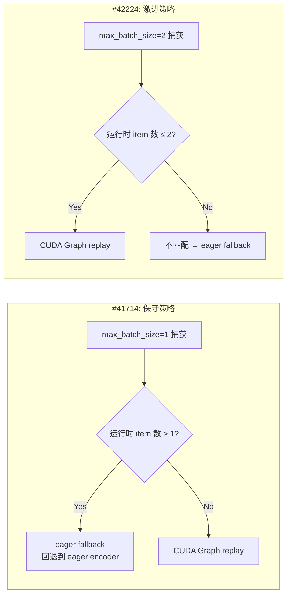

# PR #41714 vs PR #42224: Step3-VL Encoder CUDA Graph 实现对比

> **PR #41714**: [MM][CG] Support encoder CUDA graphs for Step3-VL — @BWAAEEEK (2026-05-05)
> **PR #42224**: [MM][CG] Enable encoder Cudagraph for Step3VL — @JisoLya (2026-05-10)

---

## 1. 总体差异一览

| 维度 | #41714 (BWAAEEEK) | #42224 (JisoLya) |
|------|-------------------|-------------------|
| **变更规模** | +1506 / -110 行, 9 个文件 | +328 / -10 行, 5 个文件 |
| **框架改动** | 有（`auto_token_budgets`、`auto_max_batch_size`、`eager_fallback`、shared graph pool、encoder memory profiling） | 无框架改动，仅模型接入 |
| **支持模型** | Step3-VL + StepVL | 仅 Step3-VL |
| **Budget 来源** | 模型提供精确 `auto_token_budgets`（3 级），用户可覆盖 | 用户手动指定或 power-of-2 自动生成 |
| **max_batch_size** | `auto_max_batch_size=1`，多图 eager fallback | 用户配置（benchmark 用 2） |
| **Encoder 显存预估** | 完整支持 encoder graph 显存 profiling | 无 |
| **测试覆盖** | +837 行单元测试 + e2e 测试 | +14 行 e2e 测试配置 |
| **已知 Bug** | 无 | `self.model_config` AttributeError、assert 放错位置 |
| **多图性能** | CG ON 略慢于 eager (192ms vs 178ms) | CG ON 明显优于 eager (556ms vs 712ms, ~22% TTFT 改善) |

## 2. 核心架构差异

### 2.1 多图像批处理策略

这是两个 PR 最根本的设计分歧。

- **#41714**: `max_batch_size=1`，通过 `eager_fallback_for_excess_items=True` 在多图请求时自动回退 eager 路径。**设计哲学：安全优先，避免 replay 多个 single-item graph 导致的严重性能倒退（之前测试中 CG ON 的 TTFT 比 eager 高 84%）**。

- **#42224**: `max_batch_size=2`（用户通过 `encoder_cudagraph_max_vision_items_per_batch: 2` 配置），直接在 CUDA Graph 内处理多图像 batch。**设计哲学：性能优先，通过扩大捕获 batch size 获得真实加速**。Benchmark 显示 2-image 场景下 Mean TTFT 从 712ms 降至 556ms（~22% 改善）。

### 2.2 Vision Encoder 前向路径与输出处理

```mermaid
flowchart TD
    subgraph PR41714_path["#41714: GPU-side patch merge + CPU-side scatter"]
        C1[pixel_values + patch_pixel_values] --> C2[_process_image_input_for_cudagraph]
        C2 --> C3[images_spatial_crop 拆分<br/>image + patches]
        C3 --> C4[_get_local_vision_model_output<br/>逐 item 编码]
        C4 --> C5["_compact_encoder_outputs<br/>(GPU 上 merge image/patch features)"]
        C5 --> C6[encoder_cudagraph.py:<br/>_scatter_output_slices<br/>按 per_item_out_tokens 切分]
    end

    subgraph PR42224_path["#42224: GPU-side raw output + CPU-side finalize"]
        D1[pixel_values + patch_pixel_values] --> D2[encoder_cudagraph_forward]
        D2 --> D3["vision_model(pixel_values)<br/>+ vision_model(patch_pixel_values)"]
        D3 --> D4[返回原始拼接 output]
        D4 --> D5[encoder_cudagraph.py 调用<br/>finalize_encoder_cudagraph_output]
        D5 --> D6["CPU-side: 按 indices + actual_np<br/>reshape + merge image/patch parts"]
    end
```

- **#41714**: 在模型层完成 `_compact_encoder_outputs`（GPU 上 merge image features 和 patch features），encoder_cudagraph.py 只需做标准的 `_scatter_output_slices`。encoder_cudagraph.py **不感知** patch merge 逻辑。

- **#42224**: 模型的 `encoder_cudagraph_forward` 直接返回原始拼接的 vision model outputs，由 `encoder_cudagraph.py` 在 replay 后调用模型的 `finalize_encoder_cudagraph_output` 做 **CPU-side** 的 scatter/merge。这意味着 encoder_cudagraph.py **新增了对 `finalize_encoder_cudagraph_output` 协议的支持**（#41714 后来也加入了这个机制，两者在此处有交集）。

### 2.3 Buffer 管理

| | #41714 | #42224 |
|------|---------|---------|
| `buffer_keys` | `["patch_pixel_values", "num_patches", "num_items"]` | `["patch_pixel_values"]` |
| `num_patches` 处理 | GPU-side buffer, 参与 CUDA Graph | CPU-side, 仅在 `finalize_encoder_cudagraph_output` 中使用 |
| `num_items` | GPU-side buffer | 从 `len(pixel_values)` 动态获取 |

### 2.4 Budget 计算方式

- **#41714** (`_get_image_feature_size` / `_get_patch_feature_size`):
  - 通过实际的 Conv2d 层参数（`patch_embedding` → `vit_downsampler` → `vit_downsampler2`）逐步计算卷积输出尺寸
  - 生成 3 个精确 budget: `[image_feature_size, image_feature_size + patch_feature_size, vit_hidden_size * max_image_tokens]`
  - `auto_token_budgets` 被存入 `EncoderCudaGraphConfig`

- **#42224** (`_compute_spatial_tokens`):
  - 简化版计算：`((image_size // patch_size)^2)` → 两次 `((spatial - N) // stride + 1)` 下采样
  - 使用 `understand_projector_stride` 参数
  - Budget range 输出给 power-of-2 自动生成

### 2.5 框架层面改进

**#41714 引入的框架变更（`encoder_cudagraph_defs.py` + `encoder_cudagraph.py`）**：

- `EncoderCudaGraphConfig` 新增三个字段：`auto_max_batch_size`、`auto_token_budgets`、`eager_fallback_for_excess_items`
- `EncoderCudaGraphManager.__init__` 支持三种 budget 来源优先级：用户指定 > 模型 auto > power-of-2
- Shared CUDA graph memory pool（largest-first 捕获，`torch.cuda.graph(pool=pool)`）
- `execute()` 中的 `eager_fallback_for_excess_items` 逻辑
- `gpu_model_runner.py` 中 encoder CG memory profiling（独立于 decoder 的显存估算）

**#42224 引入的框架变更（`encoder_cudagraph.py`）**：

- `_execute_local` 中新增 `finalize_encoder_cudagraph_output` 协议支持（让模型在 replay 后做 CPU-side scatter）

## 3. 优劣分析

### 3.1 #41714 的优势

| 优势 | 说明 |
|------|------|
| **更全面的测试覆盖** | +837 行测试，覆盖 init 校验、budget 计算、memory profiling、e2e CG hits/misses 验证 |
| **框架可复用性强** | `auto_token_budgets`、`eager_fallback`、shared pool、encoder profiling 等框架改进可被其他模型复用 |
| **安全边界清晰** | `min_budget` 正数校验、`auto_max_batch_size` 校验、budget 范围裁剪——多层防御 |
| **支持 StepVL** | 同时覆盖 Step3-VL 和 StepVL 两个模型 |
| **Encoder 显存预估** | 将 encoder graph 显存纳入 profiling，避免 KV cache 错误高估可用显存 |
| **文档完善** | 更新了 `cuda_graphs_multimodal.md` 中的 budget 生成策略、shared pool、profiling 说明 |

### 3.2 #41714 的劣势

| 劣势 | 说明 |
|------|------|
| **多图性能无优势** | `max_batch_size=1` + eager fallback 意味着多图请求完全不走 CUDA Graph，等于没有加速 |
| **代码量较大** | 9 个文件，1506 行增量，review 负担更重 |
| **合并冲突** | 当前存在 merge conflict，且与 #42224 有重叠需要协调 |
| **复杂度较高** | `eager_fallback_for_excess_items` 增加了一条新的代码路径，增加维护成本 |

### 3.3 #42224 的优势

| 优势 | 说明 |
|------|------|
| **多图性能显著改善** | Benchmark 显示 2-image 场景 Mean TTFT 从 712ms 降至 556ms（22% 改善），P99 TTFT 从 2107ms 降至 1586ms（25% 改善） |
| **代码简洁** | 仅 5 个文件，328 行增量，改动最小化 |
| **符合现有 pattern** | 未对框架做特殊改动，遵循 Qwen2.5-VL 等其他模型的接入模式 |
| **无合并冲突** | 当前可直接 review |
| **端到端验证充分** | 提供了完整的 online serving benchmark（200 requests, request-rate=5, 2 images/req） |

### 3.4 #42224 的劣势

| 劣势 | 说明 |
|------|------|
| **已知 Bug** | `get_encoder_cudagraph_budget_range` 中 `self.model_config.max_model_len` 应为 `vllm_config.model_config.max_model_len`，会导致 `AttributeError` |
| **示例脚本 Bug** | `assert model in MODELS_SUPPORT_VIT_CUDA_GRAPH` 放在 `if enable_vit_cuda_graph` 块外，会导致不支持 CG 的模型在离线脚本中崩溃 |
| **无 StepVL 支持** | 仅覆盖 Step3-VL，缺少对 StepVL 的兼容 |
| **测试覆盖不足** | 仅添加了 e2e 测试配置，缺少单元测试覆盖 budget 计算、CG 初始化、边界条件等 |
| **无内存 profiling** | 未将 encoder graph 显存纳入 CUDA graph profiling，可能导致 KV cache 高估可用显存 |
| **依赖用户精确配置** | 用户必须手动指定 `encoder_cudagraph_token_budgets` 和 `encoder_cudagraph_max_vision_items_per_batch` 才能获得良好效果 |

## 4. 关键设计权衡

### 多图 CG 的安全边界

#41714 的作者明确表示 `max_batch_size=1` 是"故意保守的"：

> "Opening `max_batch_size > 1` is not just removing the guard; capture sizing, patch distribution, and output compaction need additional validation for aggregate multi-item budgets."

这意味着 #42224 的 `max_batch_size=2` 方案虽然在 benchmark 中表现良好，但可能存在未充分验证的边界条件——例如不同分辨率组合、不同 patch 数量组合下的正确性问题。

### finalize 协议的二重性

两个 PR 都触及了 `finalize_encoder_cudagraph_output` 协议：
- #42224 在 `encoder_cudagraph.py:_execute_local` 中引入了对该协议的调用（CPU-side scatter）
- #41714 在模型层做了 GPU-side compact + 标准的 `_scatter_output_slices`

**#42224 的方式更灵活**——允许模型在 CUDA Graph replay 之后做任意的 CPU-side 后处理，这对 Step3-VL 这种需要 merge image + patch features 的架构更有意义。

## 5. 结论与推荐

两个 PR 各有侧重，实质上可以互补：

- **#42224** 的多图 CG 支持展示了实际的端到端性能提升（~22% TTFT 改善），但缺少防御性编程和测试覆盖
- **#41714** 的框架改进和测试覆盖更全面，但在多图场景下主动放弃了 CG 加速

**推荐合并路径**：

1. 采纳 **#41714** 的框架层改进（`auto_token_budgets`、`auto_max_batch_size`、`eager_fallback_for_excess_items`、shared pool、encoder profiling）
2. 采纳 **#42224** 的 benchmark 结果和多图捕获方向的可行性验证
3. 在框架就绪后，将 `auto_max_batch_size` 从 1 放宽到 2（需补充多分辨率组合的测试覆盖）
4. 采纳 **#42224** 的 `finalize_encoder_cudagraph_output` 协议（已在 #41714 的更新中被吸收）
5. 两个 PR 都需要 rebase 并解决相互之间的冲突
