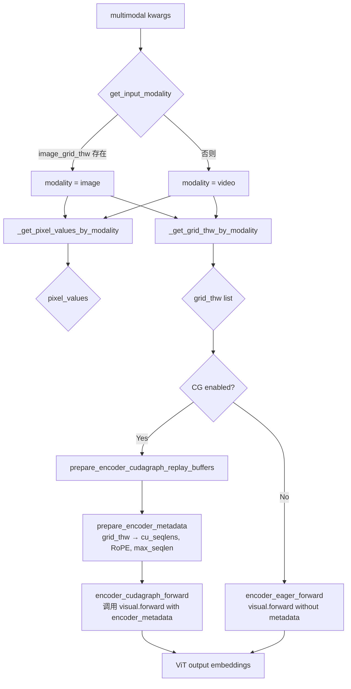
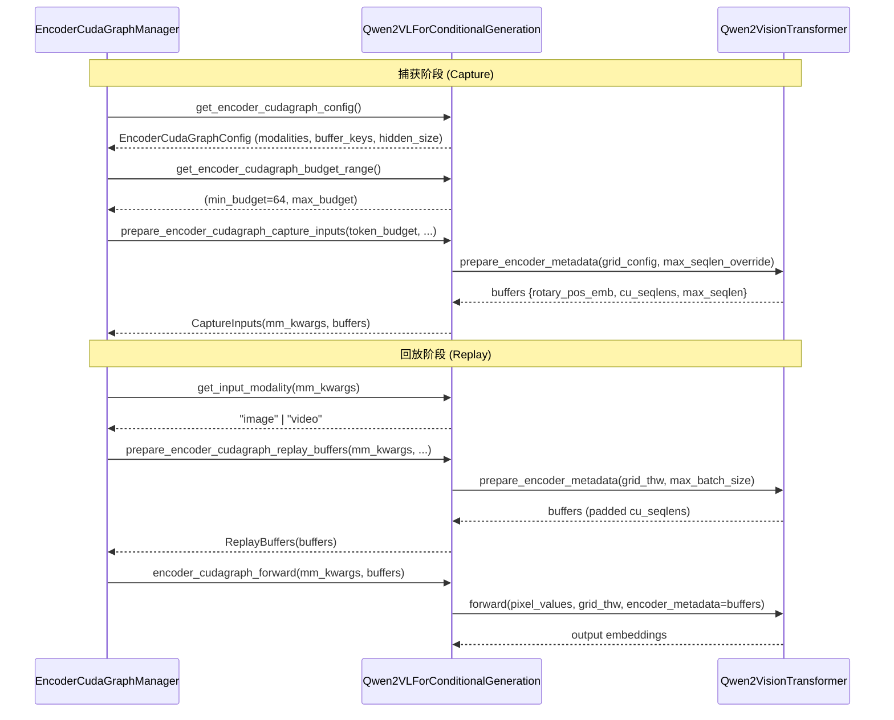

# PR #41736: [MM][CG] Support ViT CG for Qwen2-VL

> **作者**: @johncalesp (John Calderon) | **状态**: OPEN | **日期**: 2026-05-05
> **Branch**: `jcalderon/enable-cg-qwen2-vl` → `main` | **Labels**: `documentation`, `multi-modality`, `qwen`, `nvidia`
> **变更规模**: +315 -21 行，涉及 4 个文件

---

## 1. 总结 (Summary)

本 PR 为 Qwen2-VL 模型的 ViT（视觉编码器）启用 CUDA Graph 支持，遵循 PR #35963 为 Qwen2.5-VL 建立的 `SupportsEncoderCudaGraph` 协议模式。核心改动是在 `qwen2_vl.py` 中实现协议接口，并将 ViT 前向传播重构为「元数据预计算 + 图捕获回放」两阶段模式。基准测试显示，启用 CG 后 TTFT 降低约 52%（9910ms → 4768ms），总吞吐量提升约 9.6%（15841 tok/s → 17371 tok/s）。

---

## 2. 背景与动机 (Background & Motivation)

Qwen2.5-VL 已在 PR #35963 中获得了 ViT CUDA Graph 支持，但 Qwen2-VL 尚未适配。Qwen2-VL 与 Qwen2.5-VL 共享相同的 ViT 架构和绝大部分模型代码，因此移植成本低、收益明确：

- **消除 kernel 启动开销**：ViT 每次前向包含数十个 CUDA kernel（Attention、FFN、位置编码等），通过预先捕获完整计算图可消除逐 kernel 的启动延迟。
- **对齐 Qwen2.5-VL 能力**：两个架构代码高度共享，Qwen2-VL 理应获得同等的推理优化。
- **实测收益显著**：在 H100 上以 36 RPS 压测，TTFT 中位数从 11012ms 降至 4793ms（降幅 56.5%），并发峰值从 493 降至 311（更好的调度稳定性）。

---

## 3. 代码修改分析 (Code Change Analysis)

### 3.1 修改的模块

| 文件 | 变更 | 说明 |
|------|------|------|
| `vllm/model_executor/models/qwen2_vl.py` | +267/-14 | 核心实现：重构 ViT forward、新增 `prepare_encoder_metadata`、实现全部 `SupportsEncoderCudaGraph` 协议方法 |
| `tests/models/multimodal/generation/test_vit_cudagraph.py` | +12/-0 | 新增 `qwen2_vl` 测试配置（图片 + 视频 prompt） |
| `docs/design/cuda_graphs_multimodal.md` | +2/-1 | 在支持模型表格中添加 Qwen2-VL 行，更新 FA2/FA3 测试说明 |
| `examples/generate/multimodal/vision_language_offline.py` | +1/-0 | 将 `qwen2_vl` 加入 `MODELS_SUPPORT_VIT_CUDA_GRAPH` 列表 |

### 3.2 架构 / 流程图

#### ViT 前向传播：CG 路径 vs Eager 路径

#### 协议方法调用链

### 3.3 关键实现细节

- **`Qwen2VisionTransformer.prepare_encoder_metadata`**（新增）：将 RoPE 位置编码、cu_seqlens、max_seqlen 的计算从 `forward()` 中抽取出来，供捕获和回放阶段分别预计算。支持 `max_seqlen_override` 参数在捕获时固定序列长度，以及 `max_batch_size`/`max_frames_per_batch` 参数确保 cu_seqlens 形状稳定性。
- **`Qwen2VisionTransformer.forward` 重构**：新增 `encoder_metadata` 可选参数。当传入时直接使用预计算的 RoPE/cu_seqlens/max_seqlen，跳过重复计算；当为 `None` 时走原 eager 路径（向后兼容）。
- **9 个协议方法实现**：`get_encoder_cudagraph_config`、`get_input_modality`、`get_max_frames_per_video`、`get_encoder_cudagraph_budget_range`、`get_encoder_cudagraph_num_items`、`get_encoder_cudagraph_per_item_output_tokens`、`get_encoder_cudagraph_per_item_input_sizes`、`select_encoder_cudagraph_items`、`prepare_encoder_cudagraph_capture_inputs`、`prepare_encoder_cudagraph_replay_buffers`、`encoder_cudagraph_forward`、`encoder_eager_forward`。
- **cu_seqlens padding 策略**：当实际 batch 中 item 数量小于 `max_batch_size` 时，用 `cu_seqlens[-1]`（累积总长度）填充尾部，确保捕获图在回放时形状匹配。
- **Modality 识别**：通过检查 `mm_kwargs` 中是否存在 `image_grid_thw` 键来区分 image/video，替代为每个 modality 维护不同代码路径。
- **`select_encoder_cudagraph_items`**：支持按索引选取部分 item 用于贪心装箱调度，正确处理 pixel_values 的 patch 级拼接和 grid_thw 的子集选择。

---

## 4. 涉及的技术原理 (Technical Principles)

### CUDA Graph 基础

CUDA Graph 将一系列 CUDA kernel 操作记录为一个图（graph），后续回放时 CPU 只需单次调用即可提交整个图到 GPU，消除每次 kernel launch 的 CPU-GPU 同步开销。对于 kernel 数量多、单个 kernel 执行时间短的工作负载（如 ViT），优化效果尤为显著。

### Token Budget 与贪心装箱

由于 ViT 输入形状（token 数）随图片分辨率和数量变化，CUDA Graph 无法直接捕获动态形状。PR #35963 采用的方案是：
1. 按预定义的「令牌预算」（token budgets，如 [512, 768, 1024]）预先捕获多个固定形状的计算图。
2. 在线推理时用贪心装箱算法将实际请求中的图片分配到最合适的预算桶中，输入通过 padding 填充至捕获时的大小。

### Encoder CudaGraph 协议

`SupportsEncoderCudaGraph` Protocol 将模型特定的 ViT 结构（patch embedding、注意力机制、位置编码等）与通用的图管理器解耦。每个模型只需实现协议方法，管理器的捕获/回放/调度逻辑完全复用。

---

## 5. 评论区讨论亮点 (Discussion Highlights)

### Gemini Code Assist 审查建议

Gemini Code Assist（自动化审查 bot）在 `prepare_encoder_metadata` 方法中指出了一个潜在问题：当 `grid_thw` 为空列表时（多 GPU DP 场景下某些 rank 可能无数据），`np.array(grid_thw, dtype=np.int32)` 会生成 1D 空数组，后续 `grid_thw_np[:, 1]` 索引将引发 `IndexError`。建议使用 `.reshape(-1, 3)` 确保数组始终是 2D 的。

### 作者回应

@johncalesp 回应称 `encoder_cudagraph.py` 管理器层已经处理了 DP 场景下的空输入情况，因此此处的 crash 路径在实际执行中不会被触发。不过该建议作为防御性编程改进仍有讨论价值。

### 审查请求

作者已请求 @sighingnow、@vadiklyutiy、@DarkLight1337、@ywang96 四位 reviewer 审查，并特别 @b-mu（PR #35963 的原作者）和 @wangshangsam 关注。

---

## 6. 风险与潜在问题 (Risk Analysis)

| 风险 | 严重程度 | 说明 |
|------|---------|------|
| **空 grid_thw 处理** | Medium | `prepare_encoder_metadata` 未对空输入做防御性 reshape，虽声称管理器层已处理，但直接调用该方法（如 eager fallback 路径）仍可能触发 IndexError |
| **Qwen2-VL 与 Qwen2.5-VL 差异** | Medium | 代码假设两个架构的 ViT 完全相同，若存在细微差异（如 spatial_merge_size、patch_embed 参数）可能导致捕获图在 Qwen2-VL 上不正确 |
| **测试覆盖范围** | Medium | 仅新增一个测试配置（Qwen2-VL-7B-Instruct），未覆盖 Qwen2-VL-2B 或 Qwen2-VL-72B 等变体 |
| **max_seqlen_override 硬编码** | Low | 捕获时使用 `token_budget * (spatial_merge_size**2)` 作为 max_seqlen，假设 grid 维度精确匹配 token_budget。如果 grid_config 的总 token 数小于该值，FA 后端可能行为异常 |
| **pre-commit 检查失败** | Low | Mergify 自动检查失败，需运行 `pre-commit run --all-files` 修复格式问题后重新推送 |
| **兼容性** | Low | 纯增量改动，eager 路径完整保留，向后兼容无破坏性变更 |

---

## 7. 结论 (Conclusion)

本 PR 实现质量良好，结构清晰，严格遵循了 PR #35963 建立的协议模式，变更范围聚焦且风险可控。基准数据显示 TTFT 和吞吐量均有显著改善。建议关注 Gemini Code Assist 提出的空输入防御问题，即使当前管理器层已处理，在 `prepare_encoder_metadata` 中添加 `.reshape(-1, 3)` 作为防御性措施成本极低且能提升代码健壮性。同时需要修复 pre-commit 检查报错后重新提交。
