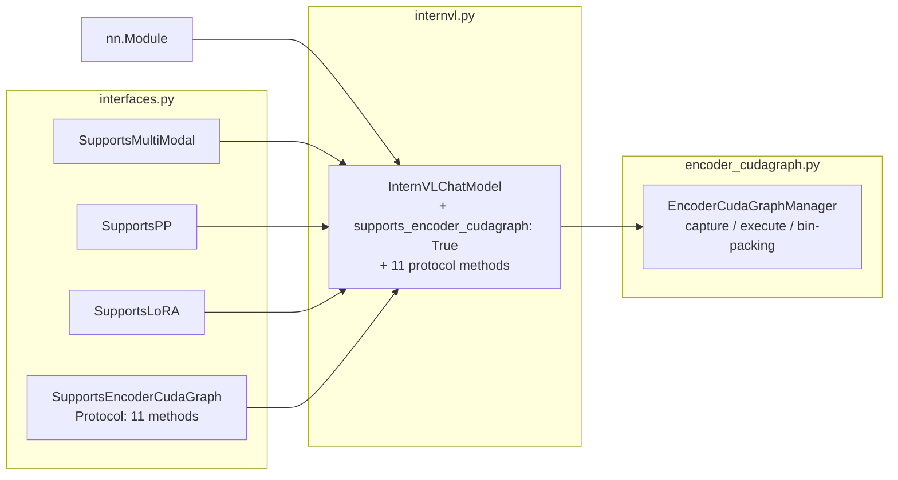
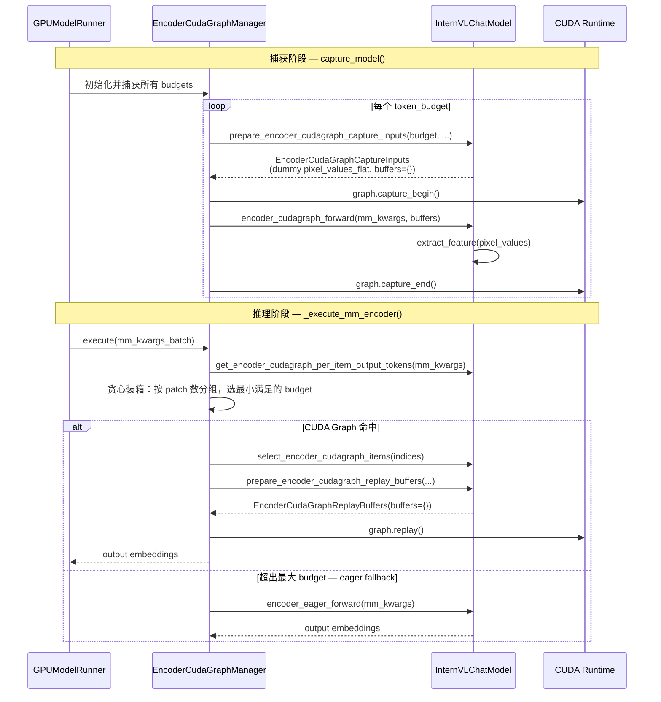

# PR #41759: [MM][Perf][CG] Support ViT full CUDA graph for InternVL

> **作者**: @oguzhankir (Oğuzhan KIR) | **状态**: OPEN | **日期**: 2026-05-05
> **Branch**: `oguzhankir/vit-cuda-graph-internvl` → `main` | **Labels**: `documentation`, `multi-modality`, `nvidia`
> **变更规模**: +197 -2 行，涉及 4 个文件

---

## 1. 总结 (Summary)

本 PR 为 InternVL 系列模型（InternVL3 / InternVL2.5 / InternVL2）的 ViT 视觉编码器引入了完整的 **CUDA Graph** 支持，通过实现 `SupportsEncoderCudaGraph` 协议将 InternVL 纳入 V1 编码器 CUDA Graph 加速框架。由于 InternVL 的 `InternVisionModel` 使用标准 ViT Attention（无 Rotary Embedding，无变长序列元数据），实现极为简洁——无需额外 buffer_keys，协议方法数量少且逻辑直接。RTX 4090 实测 TTFT 平均降低 6.3%，P99 降低 17.3%。

---

## 2. 背景与动机 (Background & Motivation)

本 PR 是以下两个 PR 的后续工作：

- **#38061**: Qwen3-VL 的 ViT CUDA Graph 支持（首个实现 `SupportsEncoderCudaGraph` 协议的模型）
- **#38175**: 跟踪多个 VL 模型适配 CUDA Graph 的 umbrella issue

在多模态推理中，ViT 编码器对每张图片/每帧视频执行大量的 Attention、FFN 等 CUDA kernel，逐 kernel 启动开销显著。vLLM 已为 LLM decode 路径提供了 CUDA Graph 加速，但 ViT 编码此前始终走 eager 路径。PR #35963 建立了基于「token budget」的通用 CUDA Graph 管理器框架，使得不同 ViT 模型只需实现协议方法即可接入。

InternVL 的 ViT 相比 Qwen3-VL 简单得多——没有 MRoPE、没有变长序列的 attention metadata，因此适配工作量极小，是实现成本最低的模型之一。

---

## 3. 代码修改分析 (Code Change Analysis)

### 3.1 修改的模块

| 文件 | 操作 | 说明 |
|------|------|------|
| `vllm/model_executor/models/internvl.py` | 修改 | 实现 `SupportsEncoderCudaGraph` 协议，添加 11 个方法；类声明增加协议继承 |
| `tests/models/multimodal/generation/test_vit_cudagraph.py` | 修改 | 新增 `internvl` 的 `VitCudagraphTestConfig` 测试条目 |
| `docs/design/cuda_graphs_multimodal.md` | 修改 | 文档表格中新增 `InternVLChatModel` 行 |
| `examples/generate/multimodal/vision_language_offline.py` | 修改 | `MODELS_SUPPORT_VIT_CUDA_GRAPH` 列表中添加 `"internvl_chat"` |

### 3.2 架构 / 流程图

#### 类继承与协议实现关系

#### 运行时执行流程

### 3.3 关键实现细节

**协议继承与类声明**
- `InternVLChatModel` 新增继承 `SupportsEncoderCudaGraph`
- 新增类变量 `supports_encoder_cudagraph: ClassVar[Literal[True]] = True`，使得 `isinstance(model, SupportsEncoderCudaGraph)` 可以快速检测

**配置方法 (`get_encoder_cudagraph_config`)**
- 支持 `image` 和 `video` 两种 modality
- `buffer_keys=[]` — InternVL 无 RoPE、无变长 attention metadata，不需要额外 buffer
- `input_key_by_modality` 映射 image→`pixel_values_flat`、video→`pixel_values_flat_video`

**Budget 范围计算 (`get_encoder_cudagraph_budget_range`)**
- 最小值：`self.num_image_token`（1 个 tile 的输出 token 数）
- 最大值：`min(max_num_batched_tokens, max_model_len)`

**Patch 列表辅助方法 (`_get_internvl_patches_list`)**
- 根据 modality 从 `image_num_patches` 或 `video_num_patches` 获取 per-item tile 数
- 兼容 `torch.Tensor` 和 `list[int]` 两种类型

**Item 子集选取 (`select_encoder_cudagraph_items`)**
- 通过累积 tile 偏移量（cumulative patches）对 flat pixel_values 做切片
- 使用 `torch.cat` 拼接被选中的 items 的 pixel_values
- 返回包含选中 pixel_values 和对应 patches 列表的 dict

**捕获输入准备 (`prepare_encoder_cudagraph_capture_inputs`)**
- 根据 token_budget 计算最大 tile 数：`total_tiles = max(token_budget // self.num_image_token, 1)`
- 生成 dummy `pixel_values_flat`（形状 `[total_tiles, 3, image_size, image_size]`）
- `buffers={}` — 无需额外 metadata buffer

**回放缓冲区 (`prepare_encoder_cudagraph_replay_buffers`)**
- 直接返回 `EncoderCudaGraphReplayBuffers(buffers={})`，无 metadata buffer

**CUDA Graph 前向 (`encoder_cudagraph_forward`)**
- 始终从 `pixel_values_flat` 读取（视频 replay 时，manager 已将视频 tiles 拷贝到此 buffer）
- `extract_feature` → `view(-1, hidden_size)` 展平输出

**Eager 前向 (`encoder_eager_forward`)**
- 根据 modality 选择 `pixel_values_flat`（image）或 `pixel_values_flat_video`（video）
- 同样经过 `extract_feature` → `view` 展平

---

## 4. 涉及的技术原理 (Technical Principles)

### 4.1 CUDA Graph 与 Token Budget 策略

CUDA Graph 将一系列 CUDA kernel 启动录制为有向无环图，replay 时一次性提交全部 kernel，消除 CPU-GPU 同步和逐 kernel 调度开销。由于 ViT 输入 token 数随图片分辨率变化，无法为每种可能形状都 capture 一张图。Token Budget 策略预设若干 budget 级别（如 `[256, 512, 1024]`），每个 budget 对应一张固定形状的图。输入不足 budget 时进行 padding（填充零像素或多 tile），满足固定形状约束。

### 4.2 InternVL ViT 的特点

InternVL 的 `InternVisionModel` 使用标准的 ViT Attention，与 Qwen3-VL 等相比有以下简化：
- **无 Rotary Position Embedding (RoPE)**：不需要 `cu_seqlens`、`pos_embeds` 等 attention metadata buffer
- **无变长序列元数据**：不需要 `max_seqlen` 等字段
- **`buffer_keys=[]`**：整个 CUDA Graph 只需要 `pixel_values_flat` 一个输入 buffer，是最简情况

### 4.3 贪心装箱 (Greedy Bin-Packing)

运行时将 batch 中的图片按 patch 数（即 token 数）升序排列，逐图贪心累加：只要累计 token 数 ≤ budget 且图片数 ≤ max_batch_size，就打包在一起回放同一张图。目标是最大化单次 graph replay 覆盖的图片数，减少总 replay 次数。此逻辑在 `EncoderCudaGraphManager` 中实现，模型无需关心。

---

## 5. 评论区讨论亮点 (Discussion Highlights)

### Isotrop0py 的 Review 意见：接口需要更新

**Isotr0py**（2026-05-25）指出 PR 需要跟进 #41234（一个近期的接口变更 PR）进行适配：

> "You need to update the interface after https://github.com/vllm-project/vllm/pull/41234"

**oguzhankir** 迅速回应：

> "Thanks for the review. Missed that #41234 landed. I'll update the interface and push shortly."

这目前是唯一的实质性 review 意见，PR 作者已确认将修改。

### DarkLight1337 的 Reviewer 指派

**DarkLight1337**（2026-05-25）在收到 ping 后将 review 指派给 `@Isotr0py` 和 `@shen-shanshan`，两位均为 vLLM 活跃的多模态贡献者。

### evezhier 的性能验证

**evezhier** 独立测试了相同实现并确认了性能收益：

> "I've tested this and can confirm the perf. My changes are identical."

表明该适配方案的性能和正确性已被社区成员独立复现。

### 当前状态

- **Merge conflicts**（Mergify bot 于 2026-05-23 提示），需 rebase 解决
- CI 尚未运行（等待 `ready` label）
- Gemini Code Assist 自动 review 结果为正面，无反馈点

---

## 6. 风险与潜在问题 (Risk Analysis)

| 风险 | 严重程度 | 说明 |
|------|---------|------|
| **接口变更适配 (#41234)** | Medium | Isotrop0py 指出需更新接口以适配 #41234。若 #41234 修改了 `SupportsEncoderCudaGraph` 协议的方法签名，当前实现需相应调整。PR 作者已确认将处理。 |
| **Merge conflicts** | Medium | 自 2026-05-23 起存在冲突，可能与 #41234 或其他 internvl.py 变更冲突。长时间不复用会积累更多冲突。 |
| **视频模式正确性** | Low | 视频回放时 manager 将 video tiles 拷贝到 `pixel_values_flat` buffer 再 replay。此逻辑依赖 manager 端实现正确性，且需确认 InternVL 视频的 flat pixel values 格式与图片一致。测试中 `needs_video_metadata=False` 说明 InternVL 不需要额外视频元数据，降低了风险。 |
| **不同 InternVL 版本兼容性** | Low | 协议实现依赖 `self.num_image_token` 和 `self.config.vision_config.image_size`，这些属性在 InternVL2/2.5/3 中应保持一致，但未对三个版本分别测试。测试仅覆盖 InternVL3-2B。 |
| **Eager fallback 路径** | Low | `encoder_eager_forward` 和 `encoder_cudagraph_forward` 的实现几乎相同，仅在输入 key 的来源上有差异。eager 路径作为 fallback 基本可靠。 |
| **Buffer 地址稳定性** | Low | `buffer_keys=[]` 意味着没有 metadata buffer，只依赖 `pixel_values_flat` 作为输入。Manager 通过 `copy_` 原地更新 buffer，地址不变，满足 CUDA Graph 约束。相比 Qwen3-VL 的复杂 buffer 管理，InternVL 风险更低。 |

---

## 7. 结论 (Conclusion)

PR #41759 是一个简洁高效的功能 PR，以仅 197 行改动将 InternVL 全系列模型纳入 ViT CUDA Graph 加速框架，得益于 InternVL 标准 ViT Attention 的简洁设计，实现极为干净。RTX 4090 实测 TTFT 降低 6.3%，P99 延迟降低 17.3%，并通过了全部 36 个单元测试。当前需解决 merge conflicts 并适配 #41234 的接口变更，完成后即可等待 CI 验证和正式 approval。
