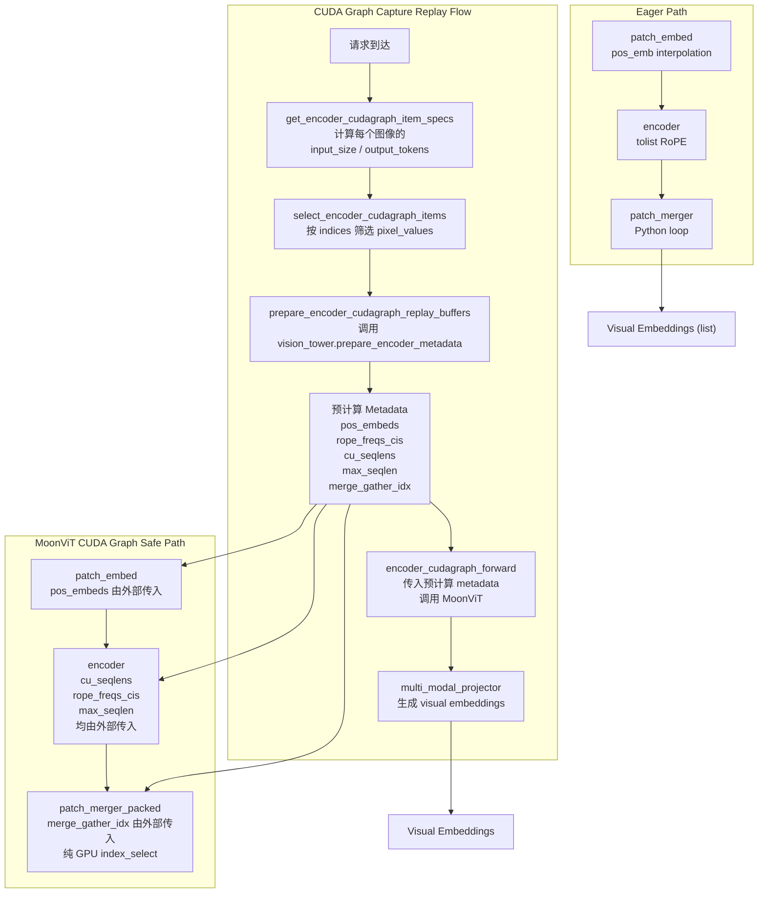

# PR #41992: [MM][Perf][CG] Support ViT full CUDA graph for Kimi-VL

> **作者**: @oguzhankir | **状态**: OPEN | **日期**: 2026-05-07
> **分支**: `oguzhankir/vit-cuda-graph-kimivl` → `main` | **标签**: `documentation`, `multi-modality`, `nvidia`
> **变更**: +477 -39 跨 5 个文件 | **评论**: 6 (含 2 次 merge conflict 提示)

---

## 1. 总结 (Summary)

本 PR 为 Kimi-VL 模型 (`KimiVLForConditionalGeneration`) 添加 **ViT 完整的 CUDA Graph 支持**，遵循之前在 #38061 (Qwen3-VL) 中建立、在 #41759 (InternVL) 中进一步完善的 `SupportsEncoderCudaGraph` 协议模式。核心挑战在于 Kimi-VL 的 `MoonVitPretrainedModel` forward 路径中包含多处 `.tolist()` 调用（位置编码插值、RoPE 频率计算、patch merging），这些 Python 列表操作与 CUDA graph capture 不兼容。解决方案是将所有依赖 grid 的元数据**预计算**到固定 shape 的 buffer 中，使 capture 后的 graph 内部只执行纯 GPU 操作。

E2E 基准测试显示：在 RTX 4090 上，mean TTFT 降低 **16.4%**（132.91 → 111.13 ms），P99 TTFT 降低 **33.5%**（290.47 → 193.25 ms）。

---

## 2. 背景与动机 (Background & Motivation)

### 什么是 Encoder CUDA Graph？

vLLM 的 CUDA Graph 机制通过预先录制 GPU 操作序列来消除 kernel launch overhead。对于 VLM 模型，视觉编码器（ViT）的 forward 路径也可以通过 CUDA Graph 加速，但前提是 forward 中**不包含 CPU-GPU 同步点**（如 `.tolist()`, `.item()`, Python 条件分支等）。

### Kimi-VL 的特殊挑战

Kimi-VL 的 MoonViT 有三个 CUDA Graph 不兼容点：

1. **Learnable2DInterpPosEmb**: `grid_hws.tolist()` + 逐图像 bicubic 插值
2. **Rope2DPosEmb**: `grid_hws.tolist()` + 逐图像截取预计算 freqs_cis
3. **patch_merger**: 逐图像 reshape/permute + Python list append

本 PR 是 tracker issue #38175 (Encoder CUDA Graph 全覆盖) 的子任务，目标是让 Kimi-VL 成为继 Qwen2-VL、Qwen2.5-VL、Qwen3-VL、InternVL 系列之后又一个支持 ViT CUDA Graph 的 VLM。

---

## 3. 代码修改分析 (Code Change Analysis)

### 3.1 修改的模块

| 文件 | 变更 | 说明 |
|------|------|------|
| `vllm/model_executor/models/moonvit.py` | +271 -37 | **核心改动**: 添加 CUDA Graph 安全路径，重构位置编码/RoPE/patch merging |
| `vllm/model_executor/models/kimi_vl.py` | +186 -2 | 实现 `SupportsEncoderCudaGraph` 协议的 8 个方法 |
| `tests/models/multimodal/generation/test_vit_cudagraph.py` | +18 -0 | 添加 Kimi-VL 测试配置 |
| `docs/design/cuda_graphs_multimodal.md` | +1 -0 | 文档: Kimi-VL 加入支持列表 |
| `examples/generate/multimodal/vision_language_offline.py` | +1 -0 | 示例: `kimi_vl` 加入 `MODELS_SUPPORT_VIT_CUDA_GRAPH` |

### 3.2 架构 / 流程图



### 3.3 关键实现细节

#### 3.3.1 moonvit.py: 元数据预计算 (`prepare_encoder_metadata`)

新增的核心方法，将 CUDA Graph 不兼容的操作全部提取到 capture graph 之外：

```python
def prepare_encoder_metadata(self, grid_hws_list, *, max_batch_size, ...):
    """预计算所有依赖 grid 的元数据"""
    normalized = [(int(h), int(w)) for h, w in grid_hws_list]
    metadata = {}

    # 1. 预计算位置编码 (替代 forward 中的 tolist + 逐图像插值)
    metadata["pos_embeds"] = self.patch_embed.pos_emb.get_pos_embeds(normalized)

    # 2. 预计算 2D RoPE 频率 (替代 get_freqs_cis_by_seqlens 中的 tolist)
    metadata["rope_freqs_cis"] = self.encoder.get_rope_freqs_cis(normalized)

    # 3. 预计算 cu_seqlens (替代 forward 中的 tensor 构造)
    metadata["cu_seqlens"] = ...

    # 4. 预计算 max_seqlen (替代 attention 中的 GPU scalar 计算)
    metadata["max_seqlen"] = torch.tensor(max_seqlen_val, dtype=torch.int32)

    # 5. 预计算 patch merger 的 gather indices (替代 Python 循环)
    metadata["merge_gather_idx"] = _build_merge_gather_idx(normalized, ...)

    return metadata
```

#### 3.3.2 moonvit.py: CUDA Graph 安全的 forward 路径

`MoonVitPretrainedModel.forward` 新增 `encoder_metadata` 参数，两种路径并存：

- **`encoder_metadata=None`**: 走原有 eager 路径（`.tolist()` + Python 循环），返回 `List[Tensor]`
- **`encoder_metadata` 传入**: 走 CUDA Graph 安全路径，所有元数据由外部预计算传入，forward 内部仅执行纯 GPU kernel，返回打包的 `Tensor`

#### 3.3.3 patch_merger_packed: 替代 Python 循环的 GPU 操作

原 `patch_merger` 对每个图像循环执行 reshape + permute。新的 `patch_merger_packed` 使用预计算的 `gather_idx` 通过单次 `index_select` 完成：

```python
def patch_merger_packed(x, gather_idx, merge_kernel_size):
    """纯 GPU 操作，无 Python 循环"""
    kh, kw = merge_kernel_size
    return x.index_select(0, gather_idx).view(-1, kh * kw, d_model)
```

#### 3.3.4 kimi_vl.py: 实现 SupportsEncoderCudaGraph 协议

KimiVLForConditionalGeneration 新增 8 个方法实现 `SupportsEncoderCudaGraph` 协议：

| 方法 | 功能 |
|------|------|
| `get_encoder_cudagraph_config` | 定义 modalities, buffer_keys, out_hidden_size |
| `get_input_modality` | 返回 `"image"` |
| `get_encoder_cudagraph_budget_range` | 返回 (64, max_tokens) budget 范围 |
| `get_encoder_cudagraph_item_specs` | 根据 grid_hws 计算每个图像的 input/output token 数 |
| `select_encoder_cudagraph_items` | 按 indices 筛选图像 |
| `prepare_encoder_cudagraph_capture_inputs` | 构造 capture 用的 dummy inputs |
| `prepare_encoder_cudagraph_replay_buffers` | 构造 replay 用的真实 inputs |
| `encoder_cudagraph_forward` | CUDA Graph 重播时的 forward |
| `encoder_eager_forward` | Eager 模式下的 forward |

#### 3.3.5 max_seqlen 的捕获友好设计

一个细节：`max_seqlen` 作为 CPU tensor 保存，避免在 captured graph 内部调用 `.item()`：

```python
# max_seqlen 作为 CPU tensor，在 captured graph 外部取值
metadata["max_seqlen"] = torch.tensor(max_seqlen_val, dtype=torch.int32)
# attention 中作为预计算值传入，不再从 cu_seqlens 动态计算
if max_seqlen is None:
    max_seqlen = (cu_seqlens[1:] - cu_seqlens[:-1]).max()  # eager 路径
```

---

## 4. 涉及的技术原理 (Technical Principles)

### CUDA Graph 对 VLM 编码器的约束

CUDA Graph 通过一次性录制完整的 GPU 操作序列来消除 kernel launch overhead，但录制过程要求：

- **无 CPU-GPU 同步**: 任何触发 CPU 读取 GPU 数据的操作（`.item()`, `.tolist()`, `.cpu()`, `print`）都会破坏 graph
- **无动态控制流**: 基于 tensor 值的 Python `if/for` 分支不能出现在 captured 范围内
- **固定内存地址**: 所有输入/输出 tensor 的地址必须在 replay 时保持不变

### NaViT Packing 与 CUDA Graph 的冲突

MoonViT 的 NaViT 风格 patch packing 天然需要处理可变分辨率的图像。在 eager 模式下，这是通过 Python 循环 + `.tolist()` 实现的灵活处理。但在 CUDA Graph 模式下，必须将所有"动态"计算预编译为固定 shape 的 GPU 操作。

### 预计算策略

本 PR 采用的策略是"预计算 + 固定 buffer"：
- **Capture 阶段**: 使用 worst-case grid shape 构造最大 shape 的 buffer，录制 graph
- **Replay 阶段**: 用预计算的真实 metadata 填充 buffer，replay 录制的 graph
- **Padding**: `cu_seqlens` 使用 right-padding 填充到 `max_batch_size` 以保证固定 shape

---

## 5. 评论区讨论亮点 (Discussion Highlights)

| 时间 | 作者 | 内容 |
|------|------|------|
| 2026-05-07 | mergify[bot] | PR 创建，自动生成文档预览 |
| 2026-05-23 | mergify[bot] | 首次 merge conflict 提示 |
| 2026-06-04 | mergify[bot] | 第二次 merge conflict 提示 |
| **2026-06-04** | **@oguzhankir** | **Rebase 到最新 main，迁移到新接口**：适配 `get_encoder_cudagraph_item_specs` (#41234) 和 single values dict API (#42288)，移除 `input_key_by_modality`，将 `pixel_values` 移入 `buffer_keys`。遵循 Qwen-VL/InternVL (#41759) 的已合并实现模式。请求 @DarkLight1337 @ywang96 添加 ready label |
| **2026-06-08** | **@shen-shanshan** | 确认将本周内 review 此 PR |

**关键观察**：
- PR 目前已 rebase 到最新 main 并适配了新接口
- 尚未获得正式 review approval，也没有 `ready` label
- 作者已主动跟进 vLLM encoder CUDA Graph 接口的持续演进（从最初的实现到 #41234 / #42288 的迁移）
- merge conflict 已由作者在 rebase 中解决

---

## 6. 风险与潜在问题 (Risk Analysis)

| 风险 | 严重程度 | 说明 |
|------|---------|------|
| **接口兼容性漂移** | Medium | Encoder CUDA Graph 接口在 vLLM v1 中仍在快速迭代。PR 已经历两次接口迁移（#41234, #42288），持续 rebase 成本可能增加 |
| **数据并行 (DP) 路径未覆盖** | Medium | `encoder_cudagraph_forward` 使用 `encoder_metadata` 路径，而原有 DP 路径 (`run_dp_sharded_mrope_vision_model`) 仅用于 eager。需确认 CUDA Graph 在 DP 模式下的行为 |
| **max_seqlen CPU tensor** | Low | `max_seqlen` 作为 CPU tensor 存储，attention wrappers 可能调用 `.item()`。注释称"每个 capture 的值恒定"，但需要在 replay 时确保该 tensor 不会被 graph 错误地作为 GPU tensor 访问 |
| **budget 范围下限 64** | Low | 最小 token budget 估计为 64（224×224 图像 → 8×8 merged tokens），极大或极小的极端分辨率可能需要调整 |
| **patch_merger_packed 正确性** | Medium | `_build_merge_gather_idx` 使用了 numpy 的 broadcasting 构造 indices，逻辑正确性高度依赖 grid_hw 和 merge_kernel_size 的对齐关系。需确保 `h % kh == 0` 和 `w % kw == 0`（上游 image processor 已保证） |
| **回归测试不足** | Medium | 新增的 `test_vit_cudagraph.py` 测试仅覆盖 CUDA Graph 模式。原有的 Kimi-VL eager 路径测试也应确保通过 |

---

## 7. 结论 (Conclusion)

这个 PR 设计思路清晰，严格遵循了 vLLM 已建立的 `SupportsEncoderCudaGraph` 协议模式（与已合并的 Qwen3-VL #38061 和 InternVL #41759 一致）。核心变更将 MoonViT forward 路径中的三个 CUDA Graph 不兼容点（位置编码插值、RoPE 频率计算、patch merging）全部通过 `prepare_encoder_metadata` 预计算化处理，eager 路径和 CUDA Graph 路径并存，向后兼容。性能收益验证充分（P99 TTFT 降低 33.5%）。当前需要等待 review 获批和 `ready` label 以触发 CI 全量测试。

---

> 📊 **报告生成时间**: 2026-06-08 | **数据来源**: GitHub REST API via `gh` CLI
