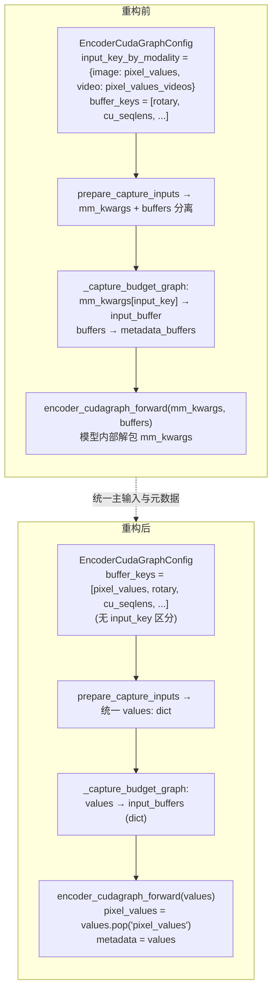
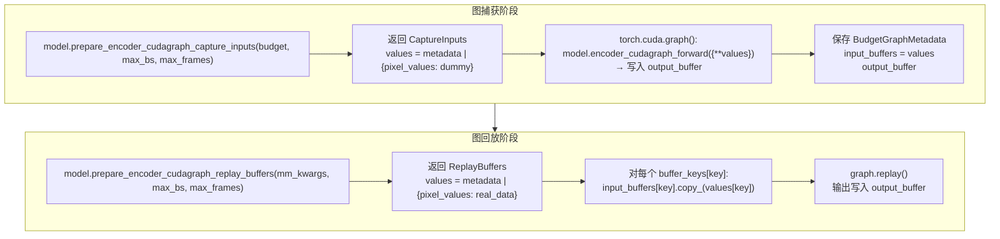

# PR #42288: Adjust design around encoder_cudagraph_forward

> **作者**: @wdhongtw (Weida Hong) | **状态**: OPEN (Ready for Review) | **日期**: 2026-05-11 (最后更新 2026-05-27)
> **Branch**: `mm-graph-input` → `main` | **Labels**: `ready`, `v1`, `qwen`, `nvidia`
> **变更规模**: +105 -152 行，涉及 8 个文件

---

## 1. 总结 (Summary)

本 PR 对 `encoder_cudagraph_forward` 的接口进行了简化重构：消除 "主输入张量" 与 "元数据缓冲" 的人为区分，将两者统一为 `values: dict[str, torch.Tensor]` 映射。同时移除了 `input_key_by_modality` 配置项，将「从 `mm_kwargs` 中提取实际输入张量」的职责完全交给 `prepare_encoder_cudagraph_replay_buffers`（现已重命名为返回 `values`）。这次重构不仅让接口语义更清晰、更易于理解和维护，还使得 DeepSeek OCR 等多输入张量模型能够自然地适配该框架，同时为 vLLM-TPU 等其他加速器直接对 `encoder_cudagraph_forward` 进行图追踪（如 `torchax.interop.jax_jit`）铺平了道路。

---

## 2. 背景与动机 (Background & Motivation)

本 PR 紧承 #35963（ViT Full CUDA Graph）和 #38175 的设计方向，对 encoder CUDA Graph 机制做进一步简化。

**核心问题**：在现有设计中存在三层不必要的复杂性：

1. **"主输入"与"元数据"的人为区分**：`encoder_cudagraph_forward` 接受 `mm_kwargs: dict`（含 `pixel_values`、`image_grid_thw` 等）和 `buffers: dict`（预计算的元数据张量）。但实际上 `image_grid_thw` 并不参与 CUDA Graph 的计算——它仅在 Python 层被用于判断 modality，不应出现在图捕获的输入中。

2. **`input_key_by_modality` 配置的冗余**：每个模型需要显式声明 `{"image": "pixel_values", "video": "pixel_values_videos"}`，但 Qwen 系列模型中 image 和 video 共享相同的 per-patch 计算，这个区分仅在字典键名层面有意义，对实际计算无影响。

3. **阻碍 TPU 等多平台的图编译**：vLLM-TPU 团队希望通过 `torchax.interop.jax_jit` 直接对 `encoder_cudagraph_forward` 进行 trace。而 `jax.jit` 严格要求输入张量的 pytree 结构固定——若不同 modality 使用不同的字典键（`pixel_values` vs `pixel_values_videos`），即使计算完全相同，JAX 也会生成两份独立的 computation graph，导致编译膨胀。

**设计决策**：将"主输入张量"和"元数据缓冲"合并为统一的 `values: dict[str, torch.Tensor]` 映射。模型在 `prepare_encoder_cudagraph_capture_inputs` 和 `prepare_encoder_cudagraph_replay_buffers` 中自行决定哪些张量需要传入，`EncoderCudaGraphManager` 不再关心哪个是"主输入"——所有张量统一通过 `buffer_keys` 管理。

---

## 3. 代码修改分析 (Code Change Analysis)

### 3.1 修改的模块

| 文件 | 操作 | 说明 |
|------|------|------|
| `vllm/v1/worker/encoder_cudagraph_defs.py` | 修改 | 数据类重构：`EncoderCudaGraphConfig` 移除 `input_key_by_modality`；`EncoderCudaGraphCaptureInputs` 合并 `mm_kwargs` + `buffers` → `values: dict`；`EncoderCudaGraphReplayBuffers` 重命名 `buffers` → `values` |
| `vllm/v1/worker/encoder_cudagraph.py` | 修改 | `BudgetGraphMetadata` 合并 `input_buffer` + `metadata_buffers` → `input_buffers`；`_capture_budget_graph` 和 `_run_budget_graph` 适配新接口 |
| `vllm/model_executor/models/interfaces.py` | 修改 | `encoder_cudagraph_forward` 签名从 `(mm_kwargs, buffers)` 改为 `(inputs: dict[str, torch.Tensor])` |
| `vllm/model_executor/models/qwen2_5_vl.py` | 修改 | 移除 `input_key_by_modality`；`pixel_values` 加入 `buffer_keys`；`prepare_encoder_cudagraph_capture_inputs` 合并 metadata + pixel_values 到 `values`；`encoder_cudagraph_forward` 简化为 `values.pop("pixel_values")` + `self.visual(pixel_values, None, encoder_metadata=metadata)` |
| `vllm/model_executor/models/qwen3_vl.py` | 修改 | 与 Qwen2.5-VL 一致的改动模式 |
| `vllm/model_executor/models/qwen2_vl.py` | 修改 | 新增适配：Visual.forward 的 `grid_thw` 参数改为 `Optional`；在 `encoder_metadata is None` 时 assert `grid_thw` 非空以保持 eager 路径兼容 |
| `vllm/model_executor/models/step3_vl.py` | 修改 | 适配新接口：`pixel_values` 加入 `buffer_keys`；`encoder_cudagraph_forward` 直接从 `values` 字典取值 |
| `tests/v1/cudagraph/test_encoder_cudagraph.py` | 修改 | 测试适配新 API：移除 `input_key_by_modality`；`buffer_keys` 加入 `pixel_values`；`EncoderCudaGraphCaptureInputs` 和 `EncoderCudaGraphReplayBuffers` 合并使用 `values` 字段 |

### 3.2 架构 / 流程图

#### 重构前后接口对比



#### GPU 图捕获与回放流程



#### 数据流对比（ASCII 原图）

```text
Before
                                                  mm-kwargs (input)
                                               -----------------------+
                                                                      |
                                                                      |
                                                                      v
                       +-----------------------+           +--------------------------+
          mm-kwargs    |                       | metadata  |                          |
         ------------> | prepare_replay_buffer | --------> |   encoder_graph_forward  |
                       |                       |           |                          |
                       +-----------------------+           +--------------------------+

--------------------------------------------------------------------------------------------------------
After
                       +-----------------------+   input   +--------------------------+
          mm-kwargs    |                       |  tensors  |                          |
         ------------> | prepare_replay_values | --------> |   encoder_graph_forward  |
                       |                       |           |                          |
                       +-----------------------+           +--------------------------+
```

### 3.3 关键实现细节

**数据类层（`encoder_cudagraph_defs.py`）**
- `EncoderCudaGraphConfig`：完全移除 `input_key_by_modality: dict[str, str]` 字段。现在模型只需声明 `modalities` 和 `buffer_keys` 即可。
- `EncoderCudaGraphCaptureInputs`：合并原来的 `mm_kwargs: dict[str, Any]` 和 `buffers: dict[str, torch.Tensor]` 为单一的 `values: dict[str, torch.Tensor]`。移除了不再需要的 `from typing import Any`。
- `EncoderCudaGraphReplayBuffers`：字段从 `buffers: dict[str, torch.Tensor | None]` 重命名为 `values: dict[str, torch.Tensor | None]`，与 capture 侧统一命名。

**管理器层（`encoder_cudagraph.py`）**
- `BudgetGraphMetadata`：合并 `input_buffer: torch.Tensor` 和 `metadata_buffers: dict[str, torch.Tensor]` 为单一的 `input_buffers: dict[str, torch.Tensor]`。
- `_capture_budget_graph`：使用 `{**values}` 解包传入（确保图中持有独立引用）；存储时直接 `input_buffers=values`。
- `_run_budget_graph`：现在内部自行调用 `model.prepare_encoder_cudagraph_replay_buffers(mm_kwargs, ...)` 获取 replay 数据。移除了 `replay_buffers` 参数，简化了调用者的职责。buffer 拷贝循环遍历 `config.buffer_keys`，支持 `None` 值跳过（保留捕获时的值不变）。

**模型层（Qwen 系列）**
- `prepare_encoder_cudagraph_capture_inputs`：metadata 字典（rotary_pos_emb、cu_seqlens、window_index 等）与 `pixel_values` 通过 `|` 运算符合并为统一的 `values` 字典。不再包含 `image_grid_thw`。
- `encoder_cudagraph_forward`：使用 `values.pop("pixel_values")` 提取 pixel values，剩余的 `values` 字典直接作为 `encoder_metadata` 传入 `self.visual()`。`grid_thw` 参数传 `None`，visual 内部仅在 `encoder_metadata is None` 的 eager 路径使用 grid_thw。

**Qwen2-VL 兼容**
- `Qwen2VLVisual.forward` 的 `grid_thw` 参数改为 `Optional`（`torch.Tensor | list[list[int]] | None`）。在 `encoder_metadata is None`（eager 模式）时 assert `grid_thw is not None`，保持 eager 路径不受影响。

**Step3-VL 适配**
- `buffer_keys` 新增 `pixel_values`，与原有的 `patch_pixel_values` 并列。`encoder_cudagraph_forward` 直接从 `values` 字典取值，不再区分"输入"与"缓冲"。`prepare_encoder_cudagraph_replay_buffers` 同时返回 `pixel_values` 和 `patch_pixel_values`。

---

## 4. 涉及的技术原理 (Technical Principles)

### 4.1 CUDA Graph 的固定计算图约束

CUDA Graph 在捕获时记录了 CUDA 操作序列及其所用张量的内存地址。回放时这些地址必须保持不变——只能通过 `copy_()`、`zero_()` 等原地操作更新数据。因此 `encoder_cudagraph_forward` 的输入中只能包含实际参与计算且形状在 capture/replay 间一致的张量。`image_grid_thw` 在 Qwen 模型中仅用于生成 metadata，不参与 encoder 的数学计算，不应出现在捕获图输入中。本 PR 将其排除在外，避免了 `jax.jit` 因 pytree 结构变化而产生不必要的多图编译。

### 4.2 JAX JIT 的形状与 PyTree 固定要求

`jax.jit` 在 trace 函数时，基于输入张量的抽象形状（abstract shape）和 PyTree 结构生成计算图。如果两个调用的输入字典键名不同（如 `pixel_values` vs `pixel_values_videos`），即使内部计算完全相同，JAX 也会产生两份独立的 graph。本 PR 统一使用 `values` 字典，且 image/video 共享相同的 `pixel_values` 键，确保 vLLM-TPU 通过 `torchax.interop.jax_jit` 桥接时只需一次编译。

### 4.3 SupportsEncoderCudaGraph Protocol 的加速器无关设计

尽管协议名称含 "CudaGraph"，它实际上是一组**纯描述性**的方法集合，要求实现者描述「在固定形状张量上的计算过程」。真正的 CUDA Graph 捕获/回放逻辑完全封装在 `EncoderCudaGraphManager` 中。这种设计使得同一套 Protocol 可被 CUDA（`torch.cuda.CUDAGraph`）、TPU（`jax.jit`）、Ascend NPU（ACL graph）等不同加速器复用。

### 4.4 "冻结" 设计：统一输入与元数据

本次重构的核心哲学变化：不再区分"主输入"（primary input）和"辅助元数据"（metadata）。所有传入 `encoder_cudagraph_forward` 的张量一视同仁——它们在捕获时被冻结，在回放时被更新。这种简化使得 DeepSeek OCR 等多输入模型可以自然适配（每个输入都是 `values` 中的一项），而无需引入"哪个是主输入"的不必要判断。

---

## 5. 评论区讨论亮点 (Discussion Highlights)

### Isotr0py 的关键反馈：多输入张量模型的兼容性

@Isotr0py 在初审中指出：原始方案（单 `values: torch.Tensor`）无法覆盖 DeepSeek OCR 等需要同时传入 `pixel_values` 和 `patch_embeds` 两个耦合张量的 ViT 架构。这一反馈直接触发了设计方案的重大调整。

### 三种方案的设计讨论

@wdhongtw 提出了三种解决方案并进行了详细对比：

- **方案一**：保持单一 `values` 张量，其他张量全部放入 metadata buffers（对 DeepSeek OCR 用 dummy input 占位）。Isotr0py 认为此方案 `metadata_buffers['pixel_values']` 语义混乱。
- **方案二**：将 `input_key` 改为 `input_keys`（复数），`BudgetGraphMetadata.input_buffers` 从单个 tensor 改为 tensor mapping。Isotr0py 倾向此方案但作者担心过度工程化。
- **方案三**（最终采纳）：取消"主输入"与"元数据"的区分，所有张量统一为 `values: dict[str, torch.Tensor]`。`EncoderCudaGraphManager` 不再关心语义分类——模型在 `prepare` 阶段全权负责组装 `values`。

方案三于 2026-05-19 提交实验性 commit，经 Isotr0py 确认"looks good"后正式更新到 PR。

### Step3-VL 的适配与验证

@JisoLya 协助测试了 Step3-VL 的兼容性。最初报告输出异常和性能回退，但 @wdhongtw 在 rebase 后的分支上验证 Step3-VL 输出与 main 分支一致（generate time 1.52s vs 1.54s），且确认 JisoLya 的 patch 涉及 ViT 输出处理而非本次接口调整。

### CI 问题与 Merge Conflict

- 早期 CI 失败（`test_can_initialize_large_subset`、`test_parse_chat_messages_*`）在本地无法复现，属 CI 环境问题。
- 2026-05-23 出现 merge conflict，已通过 rebase 解决。
- 当前 `docs/readthedocs.org:vllm` CI 在所有 pipeline 中失败，与本次改动无关。
- 存在一个 typo（`qwen2_vl.py` 的 `buffer_keys` 缺少逗号）被 depthfirst-app 机器人发现并已修复。

### 当前状态

PR 于 2026-05-24 标记为 ready for review，@shen-shanshan 于 2026-05-27 表示将在当天 review。

---

## 6. 风险与潜在问题 (Risk Analysis)

| 风险 | 严重程度 | 说明 |
|------|---------|------|
| **`grid_thw=None` 在 visual.forward 中的正确性** | Medium | Qwen2-VL/Qwen2.5-VL/Qwen3-VL 的 `visual.forward` 在 CUDA Graph 路径传入 `grid_thw=None`，依赖 `encoder_metadata is not None` 时跳过 grid_thw 处理。需确保所有支持 encoder CUDA Graph 的模型的 visual 实现正确遵循此约定。现已修改 Qwen2-VL 的 `forward` 签名将 `grid_thw` 改为 `Optional` 并在 eager 路径 assert 非空。 |
| **Step3-VL 性能回退** | Medium | @JisoLya 报告 Step3-VL 在修改后有显著效率回退，虽然 @wdhongtw 未能复现。需关注该模型的 `patch_pixel_values` 处理在 CUDA Graph 回放中的效率表现。 |
| **Qwen2-VL 新适配的测试覆盖** | Medium | Qwen2-VL 是本次更新新增的适配对象（原始 PR 仅覆盖 2.5/3-VL）。其 `visual.forward` 的 `grid_thw` Optional 化需要更充分的测试验证，特别是视频模态的回放路径。 |
| **与 #41234 的合并冲突** | Medium | 作者指出与 #41234（试图合并 graph tracing 和 eager 逻辑）存在设计冲突。本 PR 选择更彻底的设计——在接口层面直接切断无关输入。两者的取舍需要社区协调。若 #41234 先合入，本 PR 需要重大 rework。 |
| **buffer_keys 与 replay values 的一致性** | Low | 模型需要在 `buffer_keys` 中声明所有需要 graph 捕获的张量键名，且在 `prepare_encoder_cudagraph_replay_buffers` 返回值中提供对应数据。若两者不一致（如早期 `step3_vl.py` 遗漏 `pixel_values`），会导致回放时使用 stale data。已通过 depthfirst-app 的自动 review 发现并修复此类问题。 |
| **视频与音频等多模态扩展性** | Low | 当前设计假设 image/video 共享相同的 per-patch 计算。若未来需要为不同 modality 分配独立的计算图，当前统一的 `values` 设计可能需要扩展 modality 维度。作者在讨论中也提到"Maybe we need to consider whether to introduce different sets of graphs, partitioned by modality"。 |

---

## 7. 结论 (Conclusion)

PR #42288 经过两轮设计迭代后呈现出成熟的形态：通过统一 `values: dict[str, torch.Tensor]` 映射消除了"主输入"与"元数据"的人为区分，同时移除了 `input_key_by_modality` 配置，使接口更加简洁和通用。代码变更量适中（+105/-152 行），覆盖了 Qwen2-VL、Qwen2.5-VL、Qwen3-VL 和 Step3-VL 四个模型以及核心框架代码。设计方向已获 @Isotr0py 认可，待 @shen-shanshan 完成 final review。主要待解问题为 Step3-VL 的性能回退确认和与 #41234 的设计协调。
