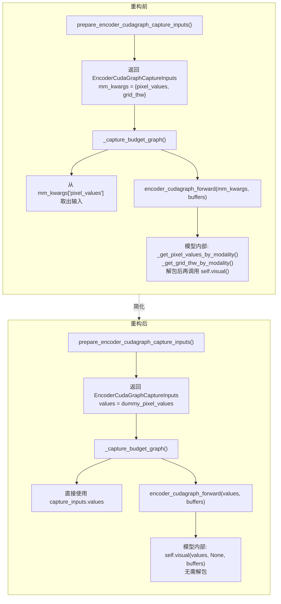
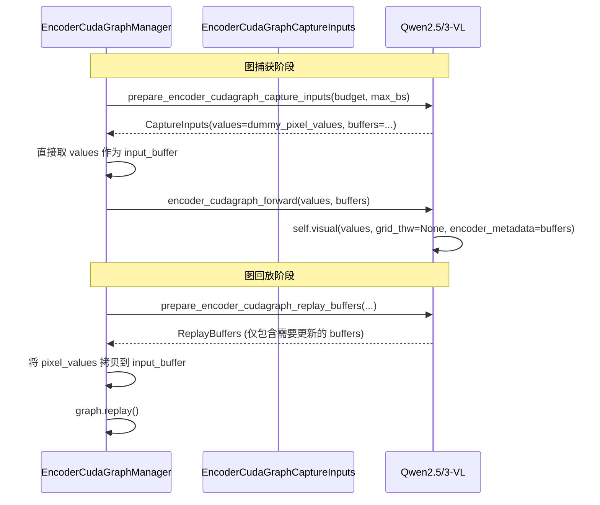

# PR #42288: Adjust design around encoder_cudagraph_forward

> **作者**: @wdhongtw (Weida Hong) | **状态**: OPEN | **日期**: 2026-05-11
> **Branch**: `mm-graph-input` → `main` | **Labels**: `v1`, `qwen`, `nvidia`
> **变更规模**: +16 -37 行，涉及 5 个文件

---

## 1. 总结 (Summary)

本 PR 对 `encoder_cudagraph_forward` 的接口进行了简化重构：将参数从 `mm_kwargs: dict[str, Any]` 改为 `values: torch.Tensor`，使该函数仅接受与 CUDA Graph 捕获计算相关的输入张量。同时将「从 `mm_kwargs` 中提取输入张量」的职责从各模型实现统一上移至 `EncoderCudaGraphManager`。这次重构不仅让接口语义更清晰、可维护，也为 vLLM-TPU 等其他加速器直接对 `encoder_cudagraph_forward` 进行图追踪（如 `torchax.interop.jax_jit`）铺平了道路。

---

## 2. 背景与动机 (Background & Motivation)

本 PR 紧承 #35963（ViT Full CUDA Graph）和 #38175 的设计方向，对 encoder CUDA Graph 机制做进一步简化。

**核心问题**：在现有设计中，`encoder_cudagraph_forward` 接受一个 `mm_kwargs` 字典，其中包含了 `pixel_values`、`image_grid_thw`、`video_grid_thw` 等字段。但实际上，`image_grid_thw` 和 `video_grid_thw` 并不参与 CUDA Graph 的计算——它们在图的捕获和回放过程中仅作为"元数据"存在，不会对 encoder 的数值输出产生任何影响。

**为什么需要改**：

1. **接口语义不准确**：`encoder_cudagraph_forward` 的契约理应是「执行在捕获阶段已固定的计算图」，因此它的参数应该只包含真正参与计算的值。传入无关的元数据增加了理解成本和误用风险。

2. **阻碍 TPU 等多平台的图编译**：vLLM-TPU 团队希望通过 `torchax.interop.jax_jit` 直接对 `encoder_cudagraph_forward` 进行 trace 来生成 TPU 编译图。而 `jax.jit` 严格要求输入张量形状固定——若两个请求的图片分辨率不同，`image_grid_thw` 的形状也会不同，即使它们在 padding 后产生相同的计算图，JAX 也会因为输入形状不同而生成两份独立的 computation graph，导致编译膨胀。

3. **简化模型侧实现**：改为直接传递 `values` 后，模型侧不再需要 `_get_pixel_values_by_modality()` / `_get_grid_thw_by_modality()` 等辅助方法来从字典中解包，代码更为简洁。

**设计决策**：尽管 `SupportsEncoderCudaGraph` 名称中含有 "CudaGraph"，但该 Protocol 本身是高度抽象的——它只关注「描述固定形状张量上的计算」，与底层加速器无关。CUDA 特定的逻辑仅存在于 `EncoderCudaGraphManager` 和 `GPUModelRunner` 中。

---

## 3. 代码修改分析 (Code Change Analysis)

### 3.1 修改的模块

| 文件 | 操作 | 说明 |
|------|------|------|
| `vllm/model_executor/models/interfaces.py` | 修改 | `SupportsEncoderCudaGraph.encoder_cudagraph_forward` 参数从 `mm_kwargs: dict[str, Any]` 改为 `values: torch.Tensor` |
| `vllm/model_executor/models/qwen2_5_vl.py` | 修改 | ① `prepare_encoder_cudagraph_capture_inputs` 直接返回 `values=dummy_pixel_values`；② `encoder_cudagraph_forward` 简化为直接调用 `self.visual(values, None, ...)` |
| `vllm/model_executor/models/qwen3_vl.py` | 修改 | 同上，与 Qwen2.5-VL 完全一致的改动模式 |
| `vllm/v1/worker/encoder_cudagraph.py` | 修改 | `_capture_budget_graph` 中直接使用 `capture_inputs.values`，移除字典键查找和 `input_key_by_modality` 依赖 |
| `vllm/v1/worker/encoder_cudagraph_defs.py` | 修改 | `EncoderCudaGraphCaptureInputs` 数据类：`mm_kwargs: dict[str, Any]` → `values: torch.Tensor`；移除 `from typing import Any`；更新 docstring |

### 3.2 架构 / 流程图

#### 重构前后接口对比

#### 数据流变化

### 3.3 关键实现细节

**接口层（`interfaces.py`）**
- `encoder_cudagraph_forward` 签名从 `mm_kwargs: dict[str, Any]` 改为 `values: torch.Tensor`。
- 语义更明确：该函数只接受一个输入张量和一组元数据缓冲。`values` 即为真正参与计算的 pixel_values。

**数据类层（`encoder_cudagraph_defs.py`）**
- `EncoderCudaGraphCaptureInputs.mm_kwargs` → `.values`，类型从 `dict[str, Any]` 改为 `torch.Tensor`。
- docstring 从 "Dummy forward inputs (model-specific keys)" 更新为 "Dummy values for the forward. For Qwen3-VL (image), this is mm_kwarg['pixel_values']."
- 移除了不再需要的 `from typing import Any` 导入。

**模型层（`qwen2_5_vl.py` / `qwen3_vl.py`）**
- `prepare_encoder_cudagraph_capture_inputs`：不再构造 `mm_kwargs = {"pixel_values": ..., "image_grid_thw": ...}` 字典，直接返回 `values=dummy_pixel_values`。删除了关于"image-modality dummy input 也兼容 video"的注释。
- `encoder_cudagraph_forward`：原先需要 `self._get_pixel_values_by_modality(mm_kwargs)` 和 `self._get_grid_thw_by_modality(mm_kwargs)` 两步提取，现在直接调用 `self.visual(values, None, encoder_metadata=buffers)`——`grid_thw` 参数传 `None`，因为在 CUDA Graph 固定形状场景下不需要 grid 信息。

**管理器层（`encoder_cudagraph.py`）**
- `_capture_budget_graph`：直接使用 `capture_inputs.values` 替代 `capture_inputs.mm_kwargs`。存储 `BudgetGraphMetadata` 时，`input_buffer` 直接赋值为 `values`，不再通过 `mm_kwargs[input_key]` 做字典查找。移除了 `input_key_by_modality` 相关的注释和逻辑。

---

## 4. 涉及的技术原理 (Technical Principles)

### 4.1 CUDA Graph 的"固定计算图"约束

CUDA Graph 在捕获（capture）时记录了一系列 CUDA 操作及所用张量的内存地址。回放（replay）时，这些张量的地址必须保持不变——只能通过 `copy_()`、`zero_()` 等原地操作来更新数据。因此，`encoder_cudagraph_forward` 的输入中只能包含实际参与计算且形状在 capture/replay 间保持一致的张量。`image_grid_thw` 作为元数据，其值在不同请求间变化且不参与 encoder 的数学计算，不应出现在捕获图的输入中。

### 4.2 JAX JIT 的形状固定要求

`jax.jit` 对函数进行 trace 时，会基于输入张量的抽象形状（abstract shape）生成一个计算图。如果两个调用的输入形状不同（即使内部计算逻辑相同），JAX 会产生两份独立的 graph，导致编译缓存膨胀。vLLM-TPU 通过 `torchax.interop.jax_jit` 桥接 PyTorch 代码到 JAX 域——若 `encoder_cudagraph_forward` 接受包含 `image_grid_thw` 的字典，不同分辨率的图片就会触发多次 JAX 编译，严重影响 TPU 上的部署效率。

### 4.3 SupportsEncoderCudaGraph Protocol 的"加速器无关"设计

尽管协议名称包含 "CudaGraph"，它实际上是一组**纯描述性**的方法集合，要求实现者描述「在固定形状张量上的计算过程」。真正的 CUDA Graph 捕获/回放逻辑完全封装在 `EncoderCudaGraphManager` 中。这种设计使得同一套 Protocol 可以被 CUDA（通过 `torch.cuda.CUDAGraph`）和 TPU（通过 `jax.jit`）等不同加速器复用，只需实现各自的后端管理器即可。

---

## 5. 评论区讨论亮点 (Discussion Highlights)

### Gemini Code Assist 自动 Review

机器人发现了 `encoder_cudagraph_defs.py` 中 `values` 字段的 docstring 仍然沿用了旧的 "model-specific keys" 措辞，建议改为 "Dummy forward input tensor (e.g. pixel_values)"。作者 @wdhongtw 已采纳该建议并标记为 "Addressed"（该修改已包含在当前 diff 中）。

### 协作邀请

作者主动 at 了 @shen-shanshan、@Isotr0py、@b-mu、@kyuyeunk 等人参与 review，表明 PR 处于早期讨论阶段，等待核心维护者给出设计层面的反馈。目前已有 3 位正式 reviewer 被请求审查：@sighingnow、@vadiklyutiy、@njhill。

### 与 #41234 的潜在冲突

作者在 PR 描述中特别指出：本 PR 与 #41234 存在设计上的 conflict。#41234 试图通过 "buffer 是否传入" 来合并 graph tracing 和 eager mode 的逻辑（`image_grid_thw` 和 `video_grid_thw` 仍可传入但在 tracing 时被忽略）。而本 PR 选择更彻底的设计——在接口层面直接切断无关输入，不接受多余的 `mm_kwargs` 字典。两者的取舍需要社区讨论。

---

## 6. 风险与潜在问题 (Risk Analysis)

| 风险 | 严重程度 | 说明 |
|------|---------|------|
| **grid_thw=None 在回放中的正确性** | Medium | `encoder_cudagraph_forward` 中 `self.visual(values, None, encoder_metadata=buffers)` 将 `grid_thw` 硬编码为 `None`。需要确保在 CUDA Graph 回放路径中 `self.visual` 内部完全不依赖 `grid_thw` 的任何属性（如 `.shape`、`.device` 等）。若 `visual` 方法中有对 `grid_thw` 的条件分支或属性访问，传入 `None` 可能导致 AttributeError 或静默跳过关键逻辑。 |
| **与其他模型（非 Qwen）的兼容性** | Medium | 当前只有 Qwen2.5-VL 和 Qwen3-VL 实现了 `SupportsEncoderCudaGraph`，改动直接作用于这两个模型。但未来其他模型（如 LLaVA、InternVL）实现该 Protocol 时，若它们的 `encoder_cudagraph_forward` 确实需要除 `pixel_values` 之外的输入（如 `aspect_ratio_ids`），单 `values: torch.Tensor` 参数可能不够用。 |
| **与 #41234 的合并冲突** | Medium | 作者已明确指出与 #41234 存在逻辑冲突。若 #41234 先合入，本 PR 需要重大 rework——因为 #41234 试图在接口层保留 `mm_kwargs`。相反，若本 PR 先合入，#41234 也需要调整其设计。两边的协调需要社区达成共识。 |
| **视频模态的覆盖** | Low | 原代码中 `prepare_encoder_cudagraph_capture_inputs` 的注释说明 image 的 dummy input 也兼容 video（因为两者 per-patch shape 相同）。重构后移除了该注释和用于区分 modality 的 `input_key` 查找。虽然这在当前 Qwen 模型中是正确的（视频帧最终也被处理为相同的 patch 形状），但未来若视频需要不同的预处理，当前简化可能成为障碍。 |
| **测试覆盖** | Low | PR 的测试计划仅提到本地手动测试（Qwen2.5-VL 图片输入、Qwen3-VL 图片+视频输入），未提供自动化测试用例。对于 CUDA Graph 路径的正确性验证（如 replay 输出与 eager 输出的一致性），缺乏可重复的回归测试。 |

---

## 7. 结论 (Conclusion)

PR #42288 是一次聚焦且设计清晰的接口简化重构——将 `encoder_cudagraph_forward` 的参数从 `mm_kwargs` 字典精炼为单一 `values` 张量，消除了 CUDA Graph 捕获中不参与计算的元数据传递，同时为 vLLM-TPU 的 JAX 图编译扫清了障碍。代码变更量小（+16/-37 行），改动范围可控，且与 #35963 的设计方向一致。主要待解决的问题是与 #41234 的设计冲突协调，以及等待核心 reviewer 对方案取舍的最终确认。
