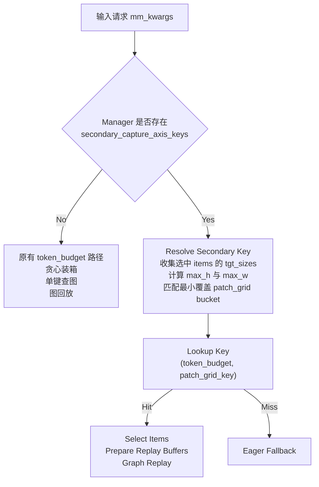
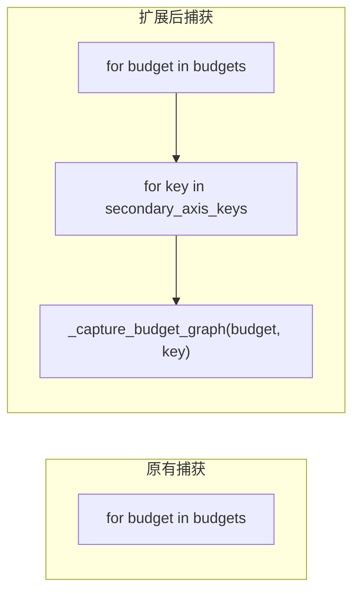
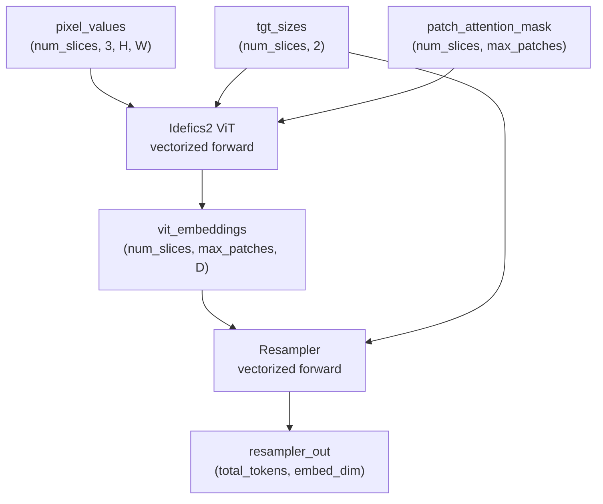

# PR #42785: [MM][CG] Enable encoder CUDA Graph for MiniCPM-V

> **作者**: @YunzhuLu | **状态**: OPEN | **日期**: 2026-05-15
> **Branch**: `minicpmv-encoder-cuda-graph` → `main` | **Labels**: `documentation`, `needs-rebase`, `v1`, `multi-modality`, `nvidia`
> **变更规模**: +774 -96 行，涉及 8 个文件

---

## 1. 总结 (Summary)

本 PR 为 MiniCPM-V 2.5、2.6、4.0 引入 **Encoder CUDA Graph 支持**，作为 tracker issue #38175 的一部分。核心创新是在 EncoderCudaGraphManager 中引入**第二捕获轴（secondary capture axis）** 机制——以 `(token_budget, secondary_capture_axis_key)` 替代单一 `token_budget` 作为图的缓存键，从而解决 MiniCPM-V 中因离散 patch-grid/pixel-layout tiers 导致的不同输入形状需要不同 CUDA Graph 捕获的问题。MiniCPM-V 2.0 和 4.5 暂不支持。

---

## 2. 背景与动机 (Background & Motivation)

### 问题

PR #38061 引入了通用的 Encoder CUDA Graph 框架，通过按 token budget 捕获 + 贪心装箱调度来消除 ViT 侧的 kernel 启动开销。该框架假设相同 token budget 的输入可以共享同一个捕获图。

然而，**MiniCPM-V 系列模型基于 Idefics2 Vision Transformer + Resampler 架构**，采用切块（slice-based）视觉编码，其 patch grid 形状（`nb_h × nb_w`）随图片分辨率呈**离散阶梯分布**。不同 patch grid 配置即使产生相同的 token budget，也需要不同的 CUDA Graph 捕获形状（因为 pixel buffer 的空间维度不同）。

如果不区分 patch grid，引擎只能按最坏情况填充，产生不必要的 padding 开销，削弱 CUDA Graph 加速效果。

### 解决方案

引入 `secondary_capture_axis_key` 概念——基于 patch grid `(nb_h, nb_w)` 的离散 bucket。每个 `(token_budget, patch_grid_key)` 对独立捕获一张图，实现形状精确匹配的高效回放。

---

## 3. 代码修改分析 (Code Change Analysis)

### 3.1 修改的模块

| 文件 | 操作 | 说明 |
|------|------|------|
| `vllm/v1/worker/encoder_cudagraph.py` | 修改 | 扩展图管理器支持 `secondary_capture_axis_key`；预算图键从 `int` 扩展为 `int \| tuple[int, Hashable]`；新增 `_prepare_encoder_cudagraph_capture_inputs` 和 `_select_encoder_cudagraph_items` 封装方法 |
| `vllm/v1/worker/encoder_cudagraph_defs.py` | 修改 | `BudgetGraphMetadata` 新增 `secondary_capture_axis_key` 字段；`EncoderItemSpec` 新增（若之前不存在） |
| `vllm/model_executor/models/minicpmv.py` | 修改 | **核心变更**：新增 `_MiniCPMVEncoderCudaGraphMixin` 类（~500 行），实现 `SupportsEncoderCudaGraph` 全部协议方法；重构 Resampler 的 `forward` 为静态形状兼容的向量化实现；`MiniCPMV2_5`、`MiniCPMV2_6`、`MiniCPMV4_0` 混入该 Mixin |
| `vllm/model_executor/models/idefics2_vision_model.py` | 修改 | 重构 `Idefics2VisionEmbeddings.forward` 为全向量化计算（去除逐 batch 循环）；简化 attention mask 生成逻辑 |
| `vllm/model_executor/models/interfaces.py` | 修改 | `select_encoder_cudagraph_items` 和 `prepare_encoder_cudagraph_capture_inputs` 文档字符串补充 `secondary_capture_axis_key` 参数说明 |
| `docs/design/cuda_graphs_multimodal.md` | 修改 | 更新支持模型表格，新增 MiniCPM-V 2.5/2.6/4.0；更新协议方法说明 |
| `examples/generate/multimodal/vision_language_offline.py` | 修改 | 添加 `minicpmv2_5_vl`、`minicpmv2_6_vl`、`minicpmv4_vl` 到 encoder cudagraph 模型列表 |
| `tests/models/multimodal/generation/test_vit_cudagraph.py` | 修改 | 新增 MiniCPM-V 2.5/2.6/4.0 的 `VitCudagraphTestConfig` 和 chat template |
| `tests/v1/cudagraph/test_encoder_cudagraph.py` | 修改 | 测试辅助函数新增 `_ordered_secondary_capture_axis_keys` 初始化 |

### 3.2 架构 / 流程图

#### 次级捕获轴的整体流程

#### 图捕获的二级循环

#### MiniCPM-V 数据流：encode → resample

### 3.3 关键实现细节

- **二级捕获轴设计**：`_ordered_secondary_capture_axis_keys` 由模型的 `get_encoder_cudagraph_secondary_capture_axis_keys()` 返回，MiniCPM-V 按 patch grid bucket 生成 `[(32,32), (32,64), (64,32), (60,60)]`；Manager 自动检测模型是否支持该特性
- **`_MiniCPMVEncoderCudaGraphMixin`**：一个 ~500 行的 Mixin，通过多继承混入三个模型子类，完整实现 `SupportsEncoderCudaGraph` 协议（~15 个方法），包括 `get_encoder_cudagraph_config`、`get_item_specs`、`select_*_items`、`prepare_*_capture_inputs`、`prepare_*_replay_buffers`、`encoder_cudagraph_forward`、`encoder_eager_forward` 等
- **Idefics2 ViT 向量化**：`forward` 方法从逐 batch 循环（`for batch_idx, p_attn_mask in enumerate(...)`）重构为全张量化计算，使用 `torch.bucketize` 在 batch 维度上广播运算
- **Resampler 静态形状适配**：`forward` 中 position embedding 从动态填充（`rnn.pad_sequence`）改为基于 `tgt_sizes` 的直接索引 + clamp 裁剪；在 CUDA Graph 捕获期间跳过 `_adjust_pos_cache`（因 warmup 阶段已扩展）
- **mm_kwargs 扁平化传输**：引入 `minicpmv_encoder_input_flat`（图像）和 `minicpmv_video_encoder_input_flat`（视频）键，将切块 pixel_values 扁平化为 `(num_slices, 3*H*W)` 一维向量，方便 Manager 在 capture/replay 之间传输
- **`_mcpmv_pack_flat_pixels`**：将多个切块 tensor 打包到固定尺寸 buffer，支持 patch 级别和原始像素两种输入格式
- **`supports_kw` 兼容性**：Manager 通过 `supports_kw(fn, "secondary_capture_axis_key")` 动态检测模型方法是否接受该参数，对不支持的老模型保持向后兼容

---

## 4. 涉及的技术原理 (Technical Principles)

- **CUDA Graph**：将一系列 GPU kernel 调用预录制为单个图，回放时仅需一次 CPU 提交，消除逐 kernel 启动开销。在 ViT 编码器中，每张图片需要执行数十个 Attention/FFN kernel，累积的 launch overhead 显著
- **Encoder CUDA Graph (token budget 策略)**：不同于 LLM decode 的固定序列长度图，ViT 输入形状多变。该框架按 token budget（编码器输出 token 数）分组，在捕获时使用足够大的填充 buffer，回放时将实际数据拷贝到 buffer 的对应位置
- **Secondary Capture Axis**：当 token budget 不足以唯一确定输入形状时（如 MiniCPM-V 中不同 patch grid 可产生相同 token 数），需要额外的离散维度来区分捕获图。本质上是对捕获空间的笛卡尔积扩展：`budgets × axis_keys → graphs`
- **Idefics2 Vision Transformer**：采用 patch embedding + position embedding（基于区间分桶）的方式编码视觉信息，与标准 ViT 的不同之处在于需要传入 `tgt_sizes` 和 `patch_attention_mask` 来处理动态分辨率的图像
- **MiniCPM-V Resampler**：使用 cross-attention + perceiver 风格的 resampler 将变长视觉特征压缩为固定数量的 query token，并通过位置编码感知各切块的空间关系
- **Greedy Bin-Packing**：为最大化 CUDA Graph 利用率，将多个输入按 token budget 装箱打包——选择刚好能容纳目标 token 数的最小预算图，最小化零填充开销

---

## 5. 评论区讨论亮点 (Discussion Highlights)

- **Gemini Code Assist bot 发现两处潜在问题**：
  1. **dtype 硬编码**：`select_encoder_cudagraph_items` 中空 indices 分支的 `flat_key` buffer 硬编码为 `torch.float32`，应与模型实际 dtype 一致。作者已修复（回复 "fixed"）
  2. **DP 路径 tgt_sizes 格式不一致**：`select_encoder_cudagraph_items` 返回的 `tgt_sizes` 是 `list[torch.Tensor]`，但 `_mcpmv_normalize_tgt_sizes` 在 DP 分片场景（其中 `mm_kwargs` 是前一次 select 的结果）可能收到 list 导致崩溃。作者通过扩展 `_mcpmv_normalize_tgt_sizes` 以同时接受 `list[torch.Tensor]` 输入来修复
- **合并冲突**：Mergify bot 于 2026-05-23 标记 `needs-rebase`，作者于 2026-06-07 完成 rebase 并请求 @shen-shanshan 审查
- **审查状态**：已请求 @DarkLight1337、@ywang96、@njhill、@AndreasKaratzas 四位 reviewer，@shen-shanshan 于 2026-06-08 表示本周内审查

---

## 6. 风险与潜在问题 (Risk Analysis)

| 风险 | 严重程度 | 说明 |
|------|---------|------|
| MiniCPM-V 4.5 不支持 | Low | MiniCPM-V 4.5 因动态帧融合引入输入相关编码器形状，不兼容当前静态形状捕获机制，继续走 eager 路径，无性能退化 |
| 捕获图数量膨胀 | Medium | 引入第二捕获轴后，总捕获图数量 = `len(budgets) × len(secondary_axis_keys)`。以 MiniCPM-V 为例，3 个 budgets × 4 个 patch buckets = 12 张图，内存开销可控但需关注 |
| `_mcpmv_normalize_tgt_sizes` 的 list 支持 | Low | 新增的 `list[torch.Tensor]` 处理路径尚未在所有调用场景下充分测试（特别是 DP + 视频混合模式） |
| Idefics2 `forward` 重构兼容性 | Medium | Idefics2 ViT 也被其他模型（Aria、Phi4）复用，其 forward 重构（去除 attention masking 的部分逻辑）虽声称保持兼容，但需确认 Aria/Phi4 的 eager 路径不受影响 |
| `needs-rebase` 标签 | Medium | PR 已标记为需要 rebase（虽然作者已完成一次 rebase），可能在合并前仍需再次同步 main |
| 缺少端到端集成测试 | Low | 仅有单元测试（`test_encoder_cudagraph.py`）和手动功能测试报告，未见自动化的 image/video 端到端测试 |
| 视频模式 secondary axis 覆盖 | Low | 视频输入与图片共享相同的 patch grid bucket，但视频帧可能产生不同的分布特征，当前 benchmark 仅覆盖 image bucket `(448, 448, 1)` |

---

## 7. 结论 (Conclusion)

本 PR 通过引入第二捕获轴机制，成功为 MiniCPM-V 2.5/2.6/4.0 启用 Encoder CUDA Graph。实现质量较高——通过 Mixin 模式保持代码组织清晰，向量化重构提升了 ViT 和 Resampler 的 eager 性能，benchmark 显示无回归。两个已修复的 review 问题处理得当。剩余关注点主要是捕获图数量膨胀和 Idefics2 重构对其他模型的兼容性验证。
