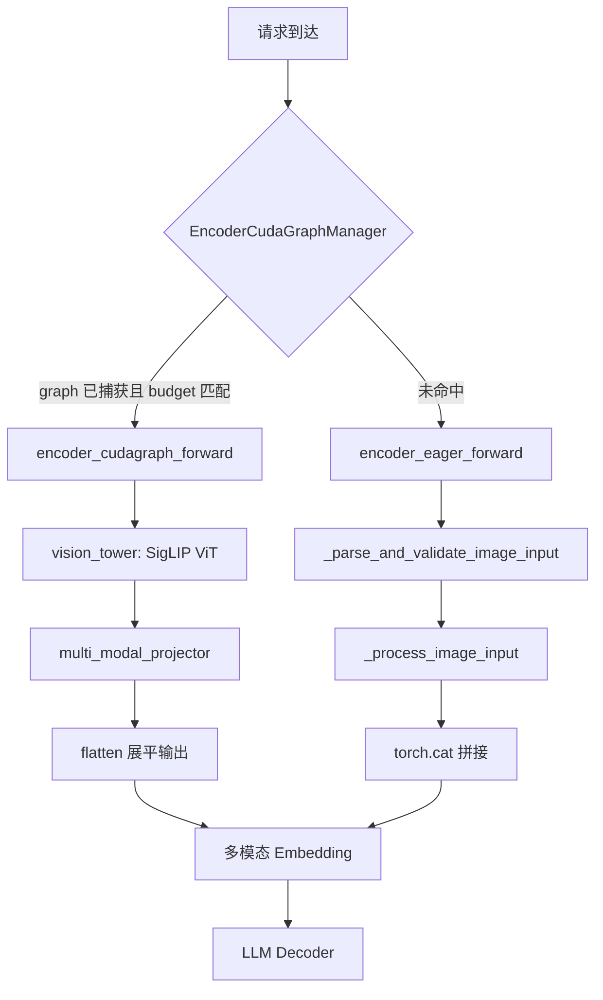
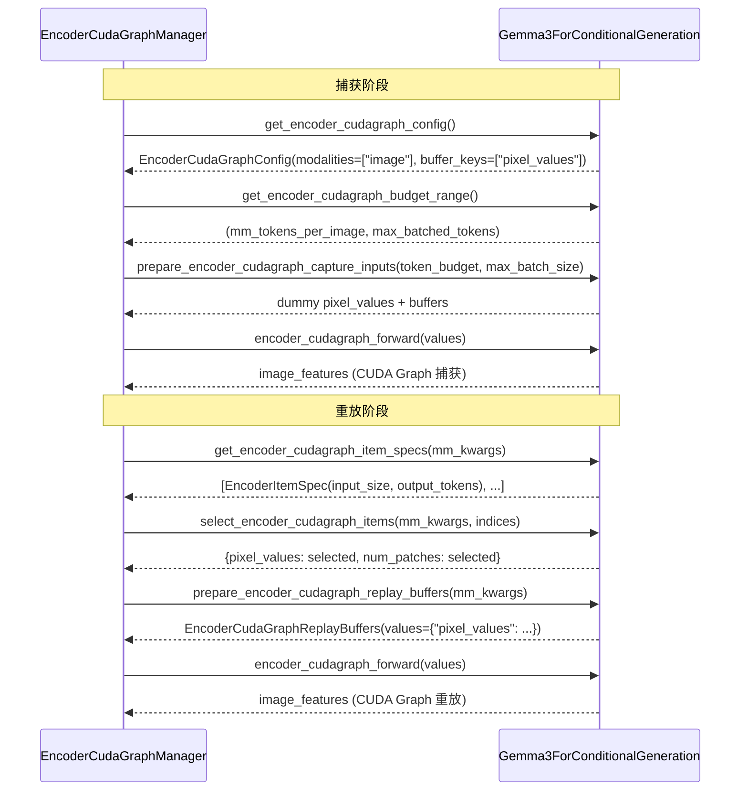

# PR #43591: [MM][CG] Gemma3 Encoder CUDA Graph

> **Author**: @JisoLya (Soyaazz) | **State**: OPEN | **Date**: 2026-05-25
> **Branch**: `gemma3-cg` → `main` | **Labels**: `documentation`, `multi-modality`, `nvidia`
> **Changes**: +162 -1 lines across 3 files
> **Reviewers**: @DarkLight1337, @ywang96, @AndreasKaratzas

---

## 1. 总结 (Summary)

该 PR 为 Gemma3 多模态模型实现了 Encoder CUDA Graph 支持，是 issue #38175 的部分实现。核心思路是让 `Gemma3ForConditionalGeneration` 实现 `SupportsEncoderCudaGraph` 接口，使 ViT 编码器的前向计算能够被 CUDA Graph 捕获和重放，从而减少 kernel launch overhead。基准测试显示 Mean TTFT 降低 **9.9%**，P99 TTFT 降低 **16.1%**，P99 ITL 降低 **24.3%**。

## 2. 背景与动机 (Background & Motivation)

vLLM 的 Encoder CUDA Graph 机制允许将多模态模型的视觉编码器（ViT）计算图捕获为 CUDA Graph，在推理时直接重放，避免了每次前向计算时的 kernel launch 开销。截至该 PR 提交时，Llama 4、InternVL 系列和 Qwen2-VL 已支持此特性，Gemma3 是多模态模型矩阵中的明显缺口。该 PR 填补了这一空白，为 Gemma3 用户带来显著的延迟改善。

## 3. 代码修改分析 (Code Change Analysis)

### 3.1 修改的模块

| 文件 | 变更 | 说明 |
|------|------|------|
| `vllm/model_executor/models/gemma3_mm.py` | +147 -1 | 核心实现：实现 `SupportsEncoderCudaGraph` 接口的 11 个方法 |
| `tests/models/multimodal/generation/test_vit_cudagraph.py` | +14 | 为 Gemma3 添加 ViT CUDA Graph 测试配置 |
| `docs/design/cuda_graphs_multimodal.md` | +1 | 将 Gemma3 加入已支持模型列表 |

### 3.2 架构 / 流程图 (Architecture / Flow Diagram)

**CUDA Graph 捕获与重放流程：**

### 3.3 关键实现细节 (Key Implementation Details)

- **接口继承**：`Gemma3ForConditionalGeneration` 新增 `SupportsEncoderCudaGraph` 继承，需实现 11 个方法
- **Modality 限定**：仅支持 `"image"` 模态，视频支持明确设为 0（Gemma3 不支持视频理解）
- **Token Budget 范围**：最小值 = `mm_tokens_per_image`（单张图片 token 数），最大值 = `min(max_num_batched_tokens, max_model_len)`
- **Item Specs**：根据 `num_patches` 计算每张图片的 ViT 输入大小和输出 token 数，支持多 patch（如高分辨率图片的 crop 场景）
- **select 逻辑**：通过累积 patch 索引来切片 `pixel_values` 张量，使用 `torch.cat` 拼接选中的图像
- **forward 路径分离**：
  - `encoder_cudagraph_forward`：直接接收 `values` dict，绕过图像输入解析，走 `vision_tower → projector → flatten` 路径
  - `encoder_eager_forward`：复用已有的 `_parse_and_validate_image_input` + `_process_image_input` 路径
- **Capture Inputs**：使用 `torch.randn` 生成 dummy pixel_values，形状为 `(num_images, 3, image_size, image_size)`
- **Replay Buffers**：直接将真实 `pixel_values` 填充到 buffers 中以备重放

## 4. 涉及的技术原理 (Technical Principles)

- **CUDA Graph**：NVIDIA CUDA 提供的一种机制，将一系列 GPU 操作预先录制为图（graph），后续通过单次 API 调用即可重放整个图。对于 ViT 这类计算图固定、输入形状确定的场景，CUDA Graph 可显著减少 CPU kernel launch 开销
- **Encoder CUDA Graph in vLLM**：vLLM V1 引擎中，`EncoderCudaGraphManager` 管理多模态编码器的 CUDA Graph 生命周期。模型通过实现 `SupportsEncoderCudaGraph` 接口来告知 manager 如何捕获和重放其视觉编码器
- **Token Budget**：指分配给视觉编码器处理的 token 预算。Manager 根据 budget 选择不同大小的预捕获 CUDA Graph。Budget 范围由模型的 `get_encoder_cudagraph_budget_range()` 方法定义
- **Gemma3 ViT 架构**：Gemma3 使用 SigLIP 风格的视觉编码器，图像被分割为固定 patch 后送入 ViT，输出经 multi-modal projector 映射到 LLM hidden 维度。其 connector 保持 1:1 token 映射（`mm_tokens_per_image = patches_per_image`）

## 5. 评论区讨论亮点 (Discussion Highlights)

- **@shen-shanshan**：表示惊讶于作者的速度，但由于有多个 ViT CG 集成 PR 在排队，审查可能延后 — 反映出社区对 Encoder CUDA Graph 特性的高度活跃
- **gemini-code-assist（自动审查）**：提出两个反馈：
  1. `select_encoder_cudagraph_items` 中的 `torch.cat` 在 list comprehension 中使用，对于大批量可能低效，但承认这是当前 `EncoderCudaGraphManager` 的通用模式
  2. `encoder_eager_forward` 缺少对 `image_input` 的 `None` 检查，如果 `pixel_values` 缺失会导致崩溃；建议添加防御性代码返回空张量
- **Mergify 冲突提醒**：PR 分别于 6/4 和 6/12 被提示存在 merge conflicts，需要 rebase

## 6. 风险与潜在问题 (Risk Analysis)

| 风险 | 严重程度 | 说明 |
|------|---------|------|
| `encoder_eager_forward` 缺少 null 检查 | **Medium** | `_parse_and_validate_image_input` 在 `pixel_values` 缺失时返回 `None`，导致 `_process_image_input` 崩溃。虽然 manager 通常保证输入存在，但防御性编程更安全 |
| Merge conflicts 未解决 | **Medium** | 自 6/12 起存在冲突，block 合入。需 rebase 到最新 main |
| `torch.cat` 在批处理中的性能 | **Low** | Gemini 审查指出对大批量可能有微小效率损失，但实际场景中视觉 batch size 通常较小，且为现有通用模式 |
| 仅支持图像模态 | **Low** | `get_max_frames_per_video` 返回 0，Gemma3 本身不支持视频，因此合理 |
| 缺少人工审查 | **Medium** | 仅有自动化审查，三位请求的 reviewer 尚未提交正式 review |
| 测试覆盖 | **Low** | 仅添加了 ViT CUDA Graph 测试配置，依赖已有测试框架；基准测试结果良好 |

## 7. 结论 (Conclusion)

该 PR 以简洁且遵循现有模式的方式为 Gemma3 添加了 Encoder CUDA Graph 支持，基准数据显示 TTFT 和尾部延迟均有显著改善（P99 TTFT -16.1%，P99 ITL -24.3%）。主要待办事项是：解决 merge conflicts、响应 gemini-code-assist 关于 `encoder_eager_forward` 空值防护的建议、等待人工 reviewer 审批。整体代码质量良好，与 Llama4/InternVL/Qwen2-VL 的实现模式一致。
