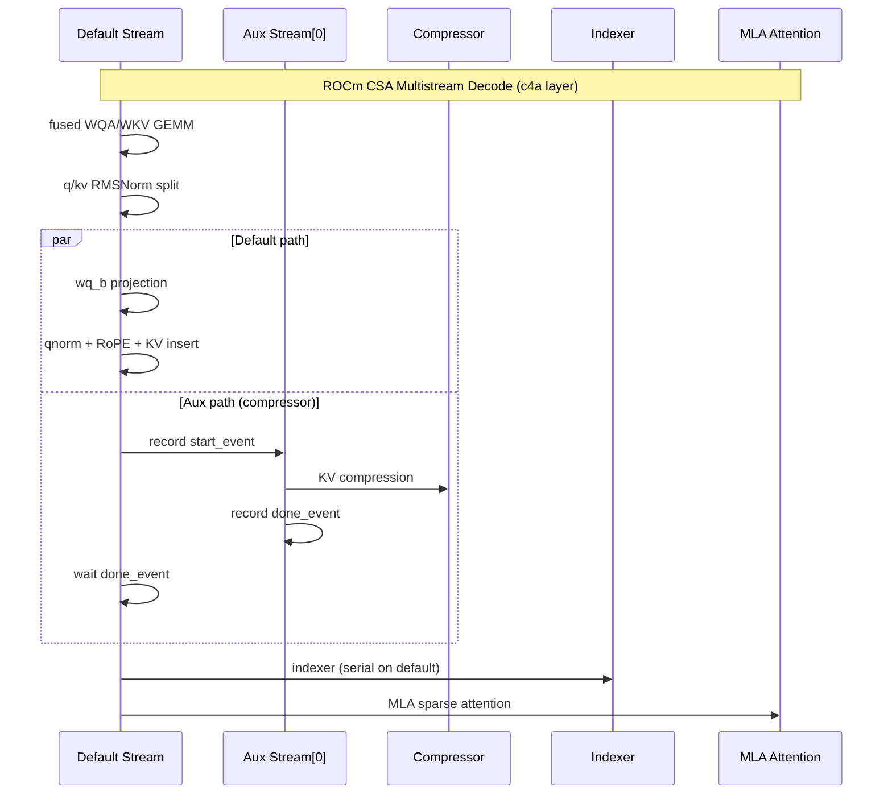
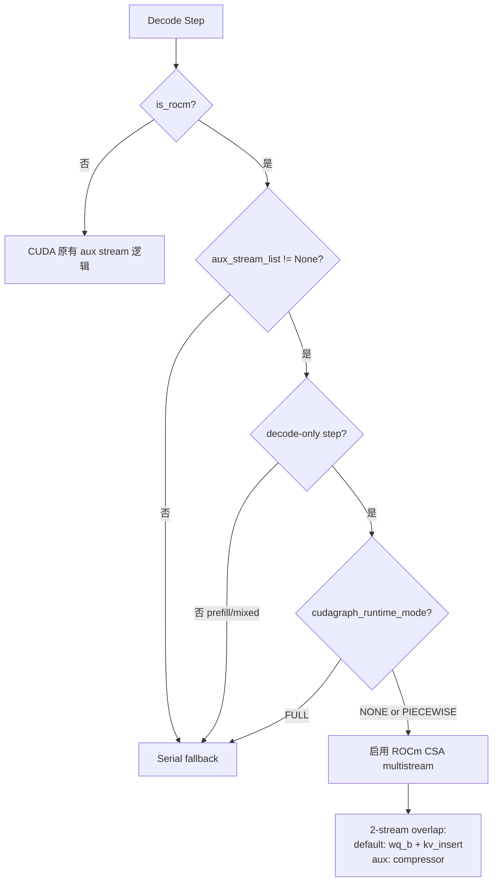

# PR #43718: [ROCm][DeepSeek-V4] WIP: Enable CSA multistream decode

> **作者**: @Fangzhou-Ai | **状态**: CLOSED（未合并，作者于 2026-08-02 关闭）| **日期**: 2026-05-26
> **Branch**: `rocm-dsv4-csa-multistream` → `main` | **Labels**: rocm, v1, deepseek, DSv4, needs-rebase, gpt-oss
> **变更规模**: +414 -64 行，涉及 4 个文件（最终版本）

---

## 1. 总结 (Summary)

本 PR 旨在为 **ROCm 后端 DeepSeek-V4 的 CSA（Compressed Sparse Attention）decode 路径**启用多 stream 并行调度，使 indexer、compressor、KV cache insert 等子路径能在 auxiliary stream 上与主路径重叠执行，从而改善 TTFT 和 TPOT。PR 历经 11+ 次 commit 的实验性迭代（从最初直接开启 aux stream 到 hang 排查、active-gating 修复、2-stream 精简策略），最终在 MI355X 上跑通了 GSM8K 正确性验证和 InferenceX benchmark（TTFT 改善约 40%+，TPOT 改善约 1–2%），但始终未能获得 maintainer approval，因 merge conflict 和架构分歧悬而未决，作者于 2026-08-02 自行关闭。

---

## 2. 背景与动机 (Background & Motivation)

### 2.1 上游 Issue 驱动

PR 对应 [Issue #41820](https://github.com/vllm-project/vllm/issues/41820) —— DeepSeek-V4 在 ROCm 后端的端到端 enablement 与性能优化 checklist。其中 Performance Checklist 明确列出未完成项：

> **Enable CSA multi-stream execution in Decode** (`default stream` + `indexer stream`) to overlap indexer and main attention paths, aligned with the DeepSeek-V4 blog design.

### 2.2 技术痛点

DeepSeek-V4 的 CSA 层 decode 步骤包含一条复杂的依赖链：

| 阶段 | 操作 | 典型 stream |
|------|------|-------------|
| Input GEMM | fused WQA/WKV 投影 | default stream |
| Post-RMSNorm | q/kv RMSNorm + RoPE + KV cache insert | default stream |
| Compressor | main KV compression | aux stream（CUDA 已有） |
| Indexer | sparse MLA indexer pipeline | aux stream（CUDA 已有） |
| Attention | MLA sparse attention | default stream |

在 **CUDA 路径**上，vLLM 已为 CSA 配置了 3 个 auxiliary stream，实现了 decode 阶段的 overlap choreography（c4a 层 overlap indexer + compressor + SWA insert；c128a 层 overlap compressor + SWA insert）。

但在 **ROCm 路径**上，由于历史 hang 问题，`amd/model.py` 中明确禁用了 aux stream：

```python
# Disable them on ROCm because of hang issues.
aux_stream_list = None if current_platform.is_rocm() else [...]
```

这意味着 ROCm 上 CSA decode 完全串行执行，无法利用 GPU 的多 stream 并行能力。

### 2.3 性能预期

作者在 InferenceX benchmark（TP=8, fp8 KV, 1k/1k random, MI355X）中报告：

| 指标 | Baseline (InferenceX) | This PR | Delta |
|------|----------------------|---------|-------|
| Output tok/s | 9.57 (c=4) | 9.70 | +1.4% |
| TPOT | 49.94 ms | 49.53 ms | -0.8% |
| TTFT | 583 ms | 326 ms | **-44%** |

TTFT 改善显著，TPOT/output throughput 改善较小（~1–2%）。

### 2.4 实验过程中的关键发现

PR 的 11 个 commit 记录了一条完整的探索路径：

1. **直接开启 aux stream → decode hang**：GPU 100% busy 但 0% memory bandwidth，NCCL watchdog timeout
2. **Workaround：完全禁用 aux stream → 稳定但无性能提升**
3. **Stream/event ordering 修复 + preallocated out= buffers → 可 launch 但 perf 无增益**
4. **SGLang-style 5-stream hierarchy + env knobs 调参 → 复杂度高，maintainer 反对 env flags**
5. **Active-gating bug 导致 GSM8K 精度失败 → 修复后 0.9613 strict-match**
6. **最终精简为 2-stream strategy**，移除所有 env knobs

---

## 3. 代码修改分析 (Code Change Analysis)

### 3.1 修改的模块

| 文件 | 操作 | 说明 |
|------|------|------|
| `vllm/models/deepseek_v4/amd/model.py` | 修改 | 移除 ROCm aux stream 禁用逻辑，改为创建 1 个 priority=-1 的 aux stream |
| `vllm/models/deepseek_v4/attention.py` | 修改 | 新增 ROCm CSA multistream decode 调度逻辑（+213/-37 行）：decode-only gating、post-RMSNorm stream 拆分、2-stream overlap 策略 |
| `vllm/utils/multi_stream_utils.py` | 修改 | 改进 stream/event 同步语义：显式 `wait_event`、side-stream tensor `record_stream`、default stream 优先 launch |
| `tests/models/test_deepseek_v4_rocm_multistream.py` | 新增 | ROCm-only 单元测试：decode policy gating、post-RMSNorm stream mapping |

### 3.2 架构 / 流程图

#### ROCm CSA Multistream Decode 执行流



#### Multistream 激活条件



### 3.3 关键实现细节

**amd/model.py**
- 移除 `if current_platform.is_rocm(): aux_stream_list = None` 的禁用逻辑
- 直接 inline 创建 `[torch.cuda.Stream(priority=-1)]`（1 个 aux stream，2-stream 策略）

**attention.py — ROCm CSA Multistream 核心逻辑**
- `_use_rocm_csa_multistream()`: 仅在 ROCm + aux streams 存在 + decode-only + graph mode 非 FULL 时激活
- `_post_rmsnorm_prepare()`: ROCm active 时用 `maybe_execute_in_parallel` 将 compressor 放到 aux stream，indexer 留在 default stream
- 拆分 q/kv post-RMSNorm path，使 KV insert 与 compressor 可并行

**multi_stream_utils.py — Stream 同步改进**
- `maybe_execute_in_parallel`: 改用 `stream.wait_event()` / `current_stream.wait_event()` 替代 `event.wait()`
- 新增 `_record_result_stream()`: side-stream 产出的 tensor 在返回 default stream 前调用 `record_stream`
- `execute_in_parallel`: default_fn 先于 aux_fns launch，避免 CPU launch overhead 延迟 critical path

---

## 4. 涉及的技术原理 (Technical Principles)

### 4.1 CSA (Compressed Sparse Attention)

DeepSeek-V4 的核心 attention 机制，结合 sparse MLA indexer 和 KV compressor。Decode 阶段每 token 需执行：input projection → RMSNorm → RoPE → KV cache write → sparse indexing → compressed KV attention。这些步骤间存在数据依赖，但部分子路径（compressor vs. q-path）可并行。

### 4.2 CUDA Multi-Stream Overlap

GPU 多 stream 并行的基本原理：不同 stream 上的 kernel 由 GPU scheduler 自动 overlap 执行（当资源允许时）。关键在于正确的 event 同步——producer stream record event，consumer stream wait event。ROCm (HIP) 的 stream/event 语义与 CUDA 基本一致，但在 CUDAGraph capture + replay 场景下行为有差异。

### 4.3 ROCm CUDAGraph + Multi-Stream 的特殊问题

PR 实验发现的核心障碍：
- **Side-stream GEMM 在 CUDAGraph capture 期间 allocate output → replay hang**（MI355X 上 GPU 100% busy, 0% memory bandwidth）
- **torch.compile + CUDAGraph → stream scheduling collapse 到 stream 0**（FULL graph mode 不可用）
- **External events 在 ROCm 上不支持**（`RuntimeError: External events are disallowed in rocm`）
- 解决方案：preallocated `out=` buffers + 仅 PIECEWISE/NONE graph mode

### 4.4 SGLang vs vLLM 的 Multistream 策略差异

作者指出 SGLang 在 MI355X 上获得更好性能的方式是 **fuse KV cache writes 和 indexer/compressor kernels**，而非仅 split GEMMs across streams。这意味着纯 Python 层的 stream 拆分收益有限，需要底层 kernel fusion 配合。

---

## 5. 评论区讨论亮点 (Discussion Highlights)

### tjtanaa（vLLM ROCm maintainer）— CHANGES_REQUESTED

核心审查意见（均未完全解决）：

1. **不要修改 nvidia/model.py** — "Modify only `vllm/models/deepseek_v4/amd/model.py`"
2. **不要添加 env flags** — "upstream the best configurations into code"
3. **测试不要用 monkeypatch** — 直接用 `current_platform.is_rocm()` + ROCm-only skip
4. **不要 wrapper 函数** — 测试和实现都应 inline
5. **compressor.py 改动不需要** — rebase 后 #43710 已修复
6. **attention.py 中清理所有条件分支** — "bake into the logic itself and always enable multistream"
7. **amd/model.py 中 inline stream 创建** — 不要抽象 helper

### ChuanLi1101（Collaborator）— 方向性认可 + 合入前要求

> "Thanks for the thorough work — split q/kv kernels, active-gating fix, and stream/event ordering improvements all look like the right direction."

合入前要求：
1. 考虑 default opt-in 为 off（hang/regression 历史）
2. PR 描述 vs commit benchmark 数字对齐
3. squash 11 commits
4. `multi_stream_utils` 变更影响非 ROCm 路径需说明
5. 保留 repro docs

### zyongye（vLLM Member）— 架构层面关切

> "If we introduce too much CUDA/ROCM divergence, we should consider split this file and only perform it in ROCM specific branch."

- 质疑 `multi_stream_utils.py` 为何需要修改
- 追问 CUDA 和 ROCm 做 multi-stream 是否有本质差异
- 作者回复会拆分，但 PR 关闭前未完成

### 作者后续动态

- 2026-05-29: 转为 Draft
- 2026-06-09: 标题加 "WIP:"
- 2026-05-29: 转向 AITER MHC 路径（[#43950](https://github.com/vllm-project/vllm/pull/43950)）
- 2026-08-02: 作者自行关闭 PR

---

## 6. 风险与潜在问题 (Risk Analysis)

| 风险 | 严重程度 | 说明 |
|------|---------|------|
| **ROCm decode hang 回归** | High | 历史已证明 aux stream 在 ROCm 上可导致 decode wedged（GPU 100% busy, 0% bandwidth）。即使修复了 ordering，FULL graph mode 仍不可用。 |
| **共享文件 CUDA/ROCm 分化** | High | `attention.py` 和 `multi_stream_utils.py` 是共享文件，ROCm 特定逻辑污染公共路径，影响 CUDA/XPU/LoRA 等其他 caller。maintainer 明确反对。 |
| **Active-gating 正确性** | Medium | 曾出现 GSM8K 精度失败（0.96 vs expected ~0.98+），根因是 multistream env flag 在非 active 步骤抑制了 indexer/compressor branch。修复后需持续验证。 |
| **Merge conflict 持续恶化** | Medium | PR 生命周期内 3 次被 mergify 标记 needs-rebase，DeepSeek-V4 代码快速演进（#40871, #41601, #42604, #42810 等先后合入），rebase 成本递增。 |
| **性能收益有限** | Medium | GEMM-only stream 拆分的 TPOT 改善仅 ~1–2%，主要收益在 TTFT（~40%）。SGLang 方案（kernel fusion）可能是更优路径。 |
| **测试覆盖不足** | Low | 仅 mock 级单元测试 + 作者本地 MI355X 验证，CI 无法覆盖 ROCm 硬件行为。 |
| **11 commits 实验 arc** | Low | 多次 force push 和策略 pivot，review 成本高，难以追溯最终设计的 rationale。 |

---

## 7. 不能 Merge 的原因分析

PR 未能合入是 **多重因素叠加**，而非单一 blocker：

### 7.1 直接 blocker

| Blocker | 详情 |
|---------|------|
| **CHANGES_REQUESTED** | tjtanaa 提交 formal review request changes，始终未 approve |
| **Merge conflicts** | 生命周期内至少 3 轮 needs-rebase，最终 close 时仍有 conflict |
| **Pre-commit CI failure** | pre-run-check 失败（2026-05-27） |
| **WIP 状态** | 作者自行标记 WIP 并转 Draft，信号是不再 actively push merge |

### 7.2 架构层面 blocker

| 问题 | maintainer 期望 | PR 现状 |
|------|----------------|---------|
| 代码位置 | ROCm 逻辑只在 `amd/` 路径 | 大量逻辑在共享 `attention.py` |
| 配置方式 | 最优配置 bake into code | 早期大量 env knobs（后期已移除） |
| 共享 utils | 不改动或独立 PR | `multi_stream_utils.py` 改动影响所有 platform |
| Commit 历史 | squash 为少量 logical commits | 11 commits 实验 arc |

### 7.3 作者放弃

- 2026-08-02 作者 @Fangzhou-Ai 自行 close（未 merge）
- 同期转向其他 ROCm DSV4 优化（AITER MHC #43950）
- Issue #41820 中 CSA multistream 项仍为 unchecked

---

## 8. 后续建议 (Recommended Next Steps)

### 8.1 短期：如果继续推进 CSA multistream

**推荐策略：拆分为 2–3 个小 PR，按依赖顺序合入**

#### PR-A: `multi_stream_utils.py` stream 同步修复（独立、platform-agnostic）

- 仅包含 `wait_event` / `record_stream` 改进
- 附带 CUDA smoke test 证明 LoRA 等现有 caller 无回归
- 这是最无争议的部分，ChuanLi1101 也认可 stream/event ordering 改进方向

#### PR-B: `amd/model.py` aux stream 启用 + ROCm attention 调度

- 所有 ROCm 特定逻辑放入 `vllm/models/deepseek_v4/amd/` 下的新文件（如 `amd/csa_multistream.py`）
- `attention.py` 中仅保留一个 `if current_platform.is_rocm()` 的 dispatch 入口
- inline stream 创建，无 env knobs，无 wrapper 函数
- ROCm-only 测试，不 monkeypatch

#### PR-C（可选）: q/kv split kernel + bounds masking

- split qnorm/rope 和 kv insert 的 ROCm kernel
- AITER sparse MLA bounds masking
- 可与 multistream 独立合入

### 8.2 中期：性能路径选择

PR 作者的实验表明 **纯 GEMM stream 拆分的 perf 收益天花板较低**（TPOT ~1–2%）。Issue #41820 checklist 中其他未完成项可能 ROI 更高：

| 优先级 | 方向 | 理由 |
|--------|------|------|
| 高 | Sparse MLA indexer Triton/AITER kernel | 当前 PyTorch native 实现是主要瓶颈 |
| 高 | Kernel fusion（norm+router, silu+mul, inv_rope） | 减少 kernel launch 数比 stream 拆分更直接 |
| 中 | CSA multistream（本 PR 方向） | TTFT 改善显著但 TPOT 有限；需 kernel fusion 配合 |
| 中 | AITER MHC / MoE 优化 | 作者已在 #43950 / #46122 推进 |

### 8.3 长期：ROCm CUDAGraph + Multi-Stream 基础设施

- 与 AMD/ROCm 团队合作解决 CUDAGraph capture 期间 side-stream allocation hang
- 建立 `tools/rocm_multistream_graph_repro.py` 作为 CI 回归工具
- 待 FULL graph + multistream 稳定后再 enable

### 8.4 协作建议

1. **先与 @tjtanaa 对齐设计** — 在写代码前确认文件拆分方案和 enable 策略
2. **Rebase 到最新 main** — DeepSeek-V4 代码结构已大幅变化（NVIDIA/AMD 分离、CuTeDSL compressor 等）
3. **Benchmark 对齐 InferenceX official baseline** — 用统一的 TP/concurrency/config 对比
4. **GSM8K + 高 concurrency 正确性 gate** — 每次改动必须过

---

## 9. 结论 (Conclusion)

PR #43718 是一次**方向正确但工程落地受阻**的 ROCm 性能优化尝试。作者在 MI355X 上验证了 CSA multistream decode 的可行性和 TTFT 显著改善，但 PR 因共享文件 CUDA/ROCm 分化、maintainer 架构要求、持续 merge conflict 和有限的 TPOT 收益而未能合入。Issue #41820 中 CSA multistream 项仍待完成。后续建议拆分为独立的小 PR（stream utils 修复 → amd/ 路径调度 → kernel fusion），并与 maintainer 提前对齐设计，同时评估 kernel fusion 路径是否比纯 stream 拆分有更高 ROI。
