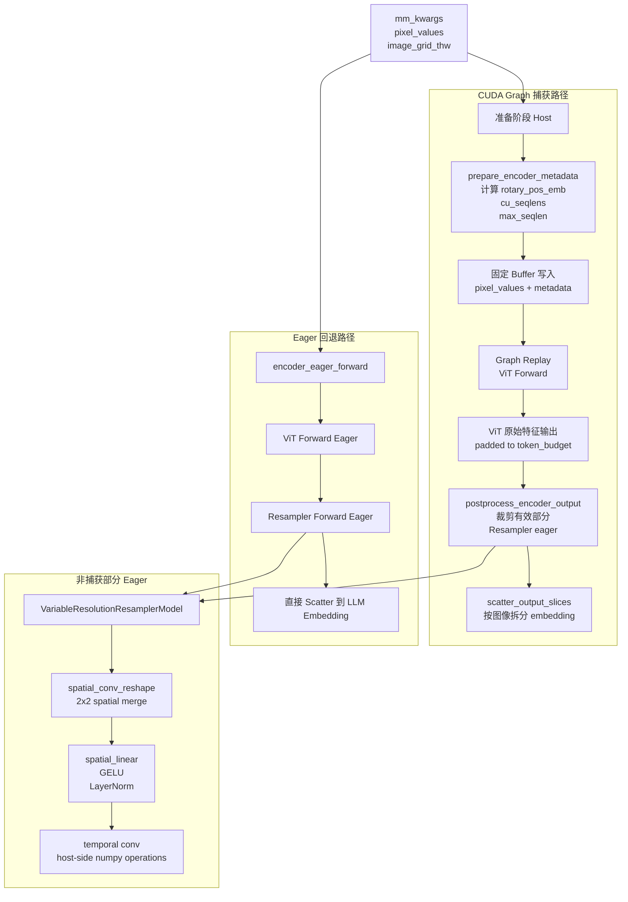

# PR #45254: [MM][CG] Support ViT full CUDA graph for Ernie-4.5-VL image inference

> **Author**: @qyYue1389 (Qiuyang Yue) | **State**: OPEN | **Date**: 2026-06-11
> **Branch**: `ernie45vl-encoder-cudagraph` → `main` | **Labels**: `documentation`, `multi-modality`, `nvidia`
> **Changes**: +310 -13 lines across 4 files
> **Tracker**: #38175 (ViT Full CUDA Graph)

---

## 1. 总结 (Summary)

本 PR 为 ERNIE-4.5-VL 的图像推理路径实现 ViT 编码器 CUDA Graph 支持。核心思路是将 ViT `forward()` 中与 batch 相关的元数据计算（RoPE、cu_seqlens、max_seqlen）抽取到 `prepare_encoder_metadata()` 方法中——CUDA Graph 捕获纯 ViT 计算，而无法被捕获的 Resampler（含 host-side numpy 索引和动态 `index_select`）保持 eager 执行。图像编码器延迟从 20.19ms 降至 5.33ms（**3.79× 加速**），精度无损失（AI2D/MMStar 均在标准误差范围内，94% greedy 输出逐字节一致）。

## 2. 背景与动机 (Background & Motivation)

- **Tracker #38175**: vLLM 正在系统性地为所有多模态模型添加 ViT CUDA Graph 支持，以减少编码器前向传播的 kernel launch overhead 和 CPU-GPU 同步开销。
- **ERNIE-4.5-VL 的特性**: 该模型的 ViT 和 Resampler 是分离的——ViT 做纯 attention + MLP 计算（适合 Graph 捕获），而 Resampler 的时序路径包含 `grid_thw.cpu().numpy()` 和动态 `index_select`，无法被 CUDA Graph 捕获。
- **只支持图像**: 视频路径中 Resampler 的 temporal conv 会改变输出 token 数量（`// temporal_conv_size`），无法使用固定 shape buffer，留待后续 PR 解决。参考 Step3-VL 的视频 CG 曾在 #42974 被 revert。

## 3. 代码修改分析 (Code Change Analysis)

### 3.1 修改的模块

| 文件 | 变更 | 说明 |
|------|------|------|
| `vllm/model_executor/models/ernie45_vl.py` | +281 -13 | 核心实现：抽取 `prepare_encoder_metadata()`，实现 `SupportsEncoderCudaGraph` 协议 |
| `tests/models/multimodal/generation/test_vit_cudagraph.py` | +27 | 添加 `ernie45_vl` 测试配置（`load_format=dummy`） |
| `docs/design/cuda_graphs_multimodal.md` | +1 | 文档：标记 ERNIE-4.5-VL 图像 CG 已支持 |
| `examples/generate/multimodal/vision_language_offline.py` | +1 | 示例：加入 `ernie45_vl` 模型名 |

### 3.2 架构 / 流程图 (Architecture / Flow Diagram)

**捕获边界说明**：
- **被捕获 (ViT)**: `patch_embed` → 32 层 `VisionBlock` → `LayerNorm`，共约 630M 参数
- **不被捕获 (Resampler)**: `VariableResolutionResamplerModel` —— 包含 host-side numpy 索引（`fwd_placeholder` 中的 `grid_thw_cpu.numpy()`）和动态 `index_select`，无法在 CUDA Graph 中执行

### 3.3 关键实现细节

- **`prepare_encoder_metadata()`**: 将原先内联在 `Ernie4_5_VisionTransformer.forward()` 中的 RoPE 计算、cu_seqlens 构建和 max_seqlen 预计算提取到独立方法，支持 capture/replay/eager 三条路径共用。

- **`SupportsEncoderCudaGraph` 协议**: 模型类 `Ernie4_5_VLMoeForConditionalGeneration` 新增实现该接口的 11 个方法：
  - `get_encoder_cudagraph_config()` → 返回 `EncoderCudaGraphConfig(modalities=["image"], buffer_keys=[...])`
  - `get_encoder_cudagraph_budget_range()` → min_budget=64（224×224 图像的 8×8 输出 token），max_budget 受 scheduler 限制
  - `prepare_encoder_cudagraph_capture_inputs()` → 构造固定 shape 的 dummy `pixel_values` + metadata
  - `prepare_encoder_cudagraph_replay_buffers()` → 用实际 batch 数据填充固定 shape buffer
  - `encoder_cudagraph_forward()` → Graph 内执行：仅 ViT forward
  - `encoder_eager_forward()` → Eager 回退：ViT + Resampler 全流程
  - `postprocess_encoder_output()` → Graph 后处理：裁剪有效 patches → Resampler → scatter

- **Buffer 设计**: 4 个固定 buffer key（`pixel_values`、`rotary_pos_emb`、`cu_seqlens`、`max_seqlen`），Ernie 使用单一 `freqs` tensor（非 cos/sin 对），比其他模型的 cos/sin 方案更简洁。

- **`max_seqlen` 烘焙策略**: CUDA Graph 捕获时使用 `max_seqlen_override = token_budget × 4`（`spatial_merge_size²`）作为 worst-case，replay 时继承此固定值，避免 GPU kernel 中 dynamic shape 导致的 recompilation。

- **`cu_seqlens` padding**: Graph 路径中 padded 到 `max_batch_size + 1` 个元素，确保 buffer shape 恒定。

- **`select_encoder_cudagraph_items()`**: 按累积 patch offset 从拼接的 `pixel_values` 中提取子集，支持 batch 内的 item selection。

## 4. 涉及的技术原理 (Technical Principles)

### CUDA Graph 捕获条件

CUDA Graph 要求被捕获的计算图中所有 tensor shapes 在 capture 和 replay 间保持一致。核心约束：
- **无 CPU 同步**: 不能在 graph 内调用 `.item()`、`.cpu()` 或任何触发 D2H copy 的操作
- **无动态控制流**: 不能在 graph 内使用依赖 tensor 值的 `if/else` 分支（依赖 shape 的 `if` 在 capture 时 bake）
- **固定 shape**: 所有中间 tensor 的 shape 必须在 capture 时确定

### ViT Full CUDA Graph 模式

vLLM 的 "encoder CUDA graph" 指的是仅捕获视觉编码器（ViT），而非整个模型。原因：
- LLM 主干已有成熟的 CUDA Graph 机制（vLLM 的 Piecewise CUDA Graph）
- ViT 处理的 batch 是动态拼接的（不同图像产生不同数量的 patch），传统 CUDA Graph 需要 shape padding

**ERNIE-4.5-VL 的特殊挑战**：Resampler 无法被捕获，因为：
1. `fwd_placeholder()` 中 `grid_thw.cpu().numpy()` 触发 host-side 计算
2. 视频的 `temporal_conv` 改变输出 token 数量（`// temporal_conv_size`），无法预分配固定 buffer

**解决方案**: 只捕获 ViT，Resampler 在 `postprocess_encoder_output()` 中 eager 执行，裁剪输出到实际有效范围。

### M-RoPE 与 CUDA Graph 的交互

ERNIE-4.5-VL 的 3D M-RoPE 需要在 host 端根据 `grid_thw` 计算 `(T, H, W)` 三维位置索引，再查表获取 cos/sin 值。CUDA Graph 路径将此计算移至 `prepare_encoder_metadata()`（host 端），作为固定 buffer 传入 graph。

## 5. 评论区讨论亮点 (Discussion Highlights)

| 时间 | 作者 | 内容 | 影响 |
|------|------|------|------|
| 2026-06-12 | @Isotr0py | "Can you verify the multimodal accuracy with ViT CG as well?" | 要求补充精度验证 |
| 2026-06-14 | @qyYue1389 | 完成 AI2D 和 MMStar 精度验证，CG ON/OFF 差异在标准误差内（~0.2σ），94% 贪婪解码输出逐字节一致 | PR 描述已更新，精度验证通过 |
| 2026-06-16 | @qyYue1389 | 请求 @shen-shanshan 和 @Isotr0py review | 等待 review |
| 2026-06-16 | @mergify[bot] | "This pull request has merge conflicts that must be resolved before it can be merged." | **需要 rebase** |

**Review 请求**：已请求 @DarkLight1337、@ywang96、@AndreasKaratzas 三人 review（均为 vLLM 核心维护者），同时作者也手动请求了 @shen-shanshan 和 @Isotr0py。目前尚无正式 review 意见。

## 6. 风险与潜在问题 (Risk Analysis)

| 风险 | 严重程度 | 说明 |
|------|---------|------|
| **Merge Conflict** | High | Mergify 标记存在冲突，必须在合并前 rebase |
| **视频路径不受益** | Medium | 仅图像路径加速，视频仍走 eager 路径。`get_input_modality()` 中只处理 `image_grid_thw`，视频会走到 `AssertionError` |
| **精度差异（可接受）** | Low | 94% 贪婪解码输出逐字节一致，3 个差异 case 是近 tie 选项的单字符翻转。`max_seqlen_override` 使用固定的 worst-case，导致 padding tokens 参与数值计算，可能引入微小的浮点舍入差异 |
| **budget_range 下界** | Low | `min_budget=64` 基于 224×224 图像（8×8=64 token），极小图像（如 28×28）会产生仅 1 token，可能超出 budget 范围 |
| **测试覆盖** | Low | 仅 `load_format=dummy` 测试（验证 CG capture/replay 机制），缺少真实模型权重的端到端精度回归测试 |
| **无 Dual-Path Graph** | Low | 配置中 `dual_path_graph` 默认为 false（表中标记 ❌），意味着图像和文本路径共享同一个 graph，多模态 batch 场景下 cache 命中率受限 |
| **Resampler eager 开销** | Low | Resampler 的计算量远小于 ViT（空间合并 + 2-3 层 MLP vs 32 层 ViT），eager 执行的开销在整体延迟中占比很小 |

## 7. 结论 (Conclusion)

这是一个质量较高的 PR，实现清晰、测试完备、文档齐全。**3.79× 的编码器加速**（H100 上 20.19ms → 5.33ms）是实打实的性能提升，精度验证也表明 CUDA Graph 对输出无显著影响。主要 blocker 是当前的 merge conflict（需要 rebase）和缺乏正式 code review。视频路径的支持需要单独的后续 PR 来解决 temporal conv 的动态 token 数问题。

---

*Report generated on 2026-06-18*
