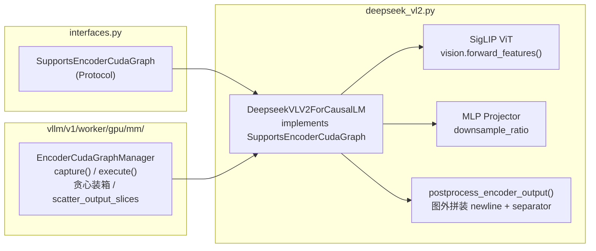
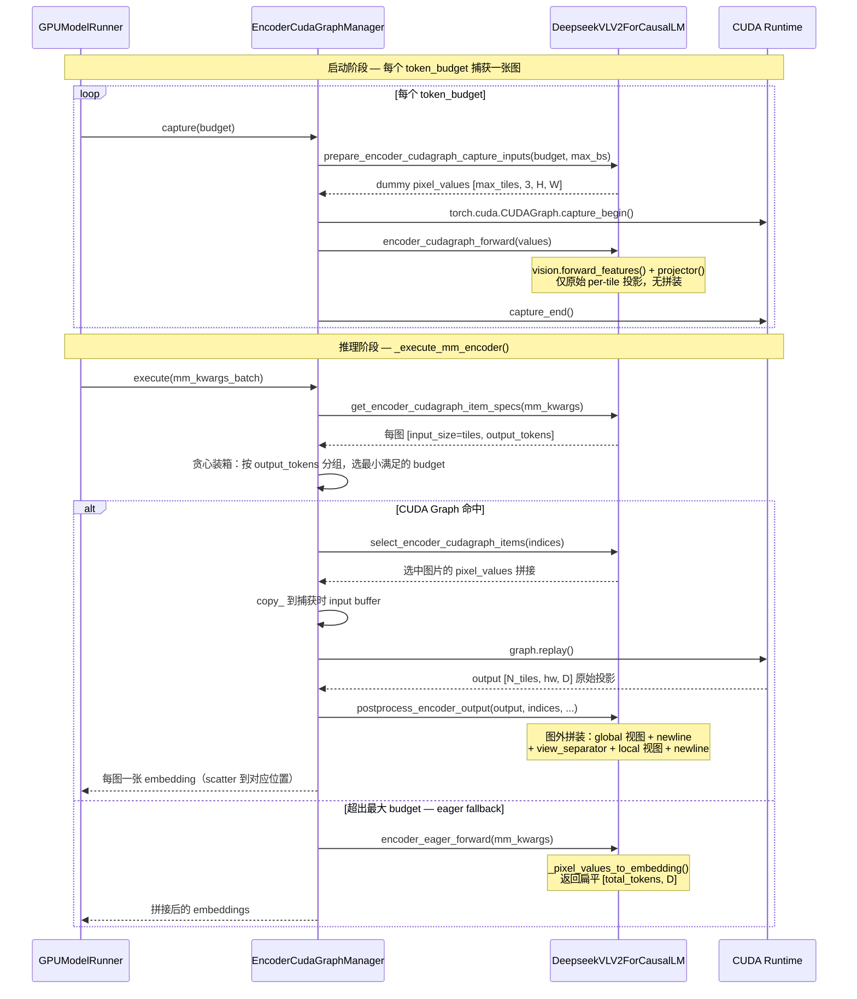
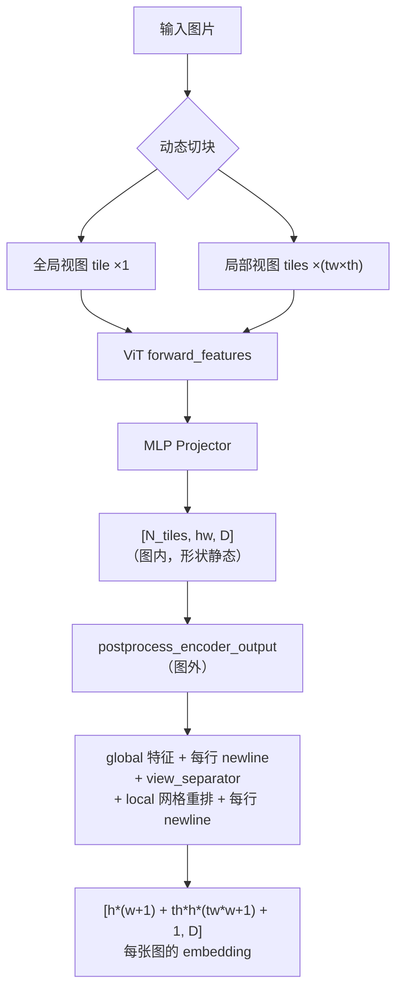

# PR #46005: [MM][CG] Support ViT full CUDA graph for DeepSeek-VL2

> **作者**: @littlecircle0730 | **状态**: OPEN | **日期**: 2026-06-18
> **Branch**: `littlecircle0730:feat/deepseek-vl2-encoder-cudagraph` → `vllm-project:main` | **Labels**: `v1`, `deepseek`, `nvidia`, `documentation`, `needs-rebase`, `verified`
> **变更规模**: +493 -3 行，涉及 3 个文件 | **Assignee**: @shen-shanshan
> **追踪 Issue**: #38175

---

## 1. 总结 (Summary)

本 PR 为 **DeepSeek-VL2**（`DeepseekVLV2ForCausalLM`）实现了 `SupportsEncoderCudaGraph` 协议，使 vLLM V1 的 `EncoderCudaGraphManager` 能够对 SigLIP ViT + MLP projector 的视觉编码前向做一次捕获、多次回放，消除每个 batch 重复的 CPU kernel 调度开销。核心设计是：CUDA Graph 内只做「per-tile 原始投影」（输出 `[N_tiles, hw, D]`），而 newline token 与 view-separator 的拼装在 `postprocess_encoder_output` 中于图外完成，从而保持捕获计算形状静态。PR 附带 7 个 GPU 单测（全部通过）和 `vllm bench mm-processor` 基准数据，但**目前存在 merge conflict（needs-rebase），且尚无任何人工 review**。

---

## 2. 背景与动机 (Background & Motivation)

DeepSeek-VL2 采用动态切块（dynamic tiling）：每张图片被切分为 1 个全局视图 tile + `tw × th` 个局部视图 tile，ViT（SigLIP 风格）+ MLP projector 对每个 tile 独立编码，最终按「全局视图 + newline + view_separator + 局部视图 + newline」的顺序拼装成视觉 token 序列。

**改动前的问题**：

- `DeepseekVLV2ForCausalLM` 每次前向都走 eager 的 `_pixel_values_to_embedding` 路径，ViT 的几十上百个 CUDA kernel（attention、FFN、layernorm 等）每张图都要重新逐 kernel 调度，CPU dispatch 开销显著。
- 自 #35963 引入 `EncoderCudaGraphManager` + `SupportsEncoderCudaGraph` 协议以来，Qwen3-VL、Gemma3、GLM-4.1V 等多个 VLM 已陆续接入，但 DeepSeek-VL2 一直缺席（追踪于 issue #38175）。
- DeepSeek-VL2 的「分块 + 拼装」结构与已接入的单塔模型不同：每张图的 tile 数（`1 + tw*th`）随分辨率变化，且拼装逻辑（newline/separator）包含数据依赖的分支，无法直接放进 CUDA Graph。

本 PR 将拼装逻辑移出图外，只对形状静态的「ViT + projector」部分做图捕获，解决了上述障碍。

---

## 3. 代码修改分析 (Code Change Analysis)

### 3.1 修改的模块

| 文件 | 操作 | 说明 |
|------|------|------|
| `vllm/model_executor/models/deepseek_vl2.py` | 修改 (+203 -3) | `DeepseekVLV2ForCausalLM` 实现 `SupportsEncoderCudaGraph` 协议的全部 9 个方法；新增 `_proj_hw()` 与 `postprocess_encoder_output()` |
| `tests/v1/cudagraph/test_encoder_cudagraph.py` | 修改 (+287) | 新增 `MockDeepseekVL2Model` + `TestDeepseekVL2CudaGraph` 7 个 GPU 测试；`_make_manager_with_budgets` 补齐 `mgr.config` |
| `docs/design/cuda_graphs_multimodal.md` | 修改 (+3) | 支持矩阵中加入 `DeepseekVLV2ForCausalLM` 行（Image ✅ / Video ❌ / Multi-Path ❌；四平台硬件支持待验证 ❔） |

### 3.2 架构 / 流程图 (Architecture / Flow Diagram)

#### 模块依赖关系

#### 捕获与回放流程

#### DeepSeek-VL2 视觉序列拼装结构

### 3.3 关键实现细节 (Key Implementation Details)

**模型层（`deepseek_vl2.py`）**

- `DeepseekVLV2ForCausalLM` 继承 `SupportsEncoderCudaGraph`，并在 `__init__` 中保存 `self.model_config`（供 budget range 计算使用）。
- **`_proj_hw()`**：从 config 推导 projector 输出空间尺寸 `h = w = ceil((image_size // patch_size) / downsample_ratio)`，与 `DeepseekVL2ProcessingInfo.get_num_image_tokens` 的 token 计数公式保持一致。
- **`get_encoder_cudagraph_config()`**：`modalities=["image"]`、`buffer_keys=["pixel_values"]`、`out_hidden_size=projector_config.n_embed`。
- **`get_encoder_cudagraph_budget_range()`**：
  - `min_budget = h*(w+1)*2 + 1` —— 最小合法图片（1 全局 + 1×1 局部）的 token 数；
  - `max_budget = min(max_num_batched_tokens, max_model_len)`。
- **`get_encoder_cudagraph_item_specs()`**：遍历 `images_spatial_crop` 每行 `[tw, th]`，遇 0 即停（padding 哨兵）；每张图 `input_size = 1 + tw*th`（tile 数）、`output_tokens = h*(w+1) + th*h*(tw*w+1) + 1`（含 newline 与 separator）。
- **`select_encoder_cudagraph_items()`**：按每图 tile 数累积偏移（cumsum），用 `torch.cat` 拼接被选中图片的 `pixel_values`，同时切片 `images_spatial_crop` 保持对齐。
- **`prepare_encoder_cudagraph_capture_inputs()`**：`max_tiles = ceil(token_budget / (h*w))`，生成 `[max_tiles, 3, image_size, image_size]` 的 dummy `pixel_values`。由于每个 tile 在图内只产出 `h*w` 个原始 token（newline 在图外补），用 `h*w` 作除数保证 tile 数只多不少（over-allocate，安全侧）。
- **`encoder_cudagraph_forward()`**：图内路径 = `vision.forward_features(pixel_values)` + `projector(features)`，返回原始 `[N_tiles, hw, D]`，**不含任何拼装**。
- **`encoder_eager_forward()`**：eager fallback 复用现有 `_pixel_values_to_embedding()`，返回所有图片 embedding 的扁平拼接 `[total_tokens, D]`，匹配 `scatter_output_slices` 的预期。
- **`postprocess_encoder_output()`**：图外拼装核心。按 `indices` 顺序消费 raw output：
  - 全局视图：`[h, w, D]` 每行后插 `image_newline`；
  - 局部视图：`[th, tw, h, w, D]` → `permute(0,2,1,3,4)` 网格重排 → 每行后插 `image_newline`；
  - 按 `global_view_pos`（head/tail）决定全局视图与 `view_seperator` 的前后顺序；
  - 结果写入 `dest[img_idx]`（dict 模式）或 `dest[rank]`（list 模式），支持 `clone` 标志。

**测试层（`test_encoder_cudagraph.py`）**

- `MockDeepseekVL2Model` 用小尺寸常量（h=w=2、dim=16、img=4×4、budgets=[16, 64]）模拟 batched-tile 模式，加速捕获。
- 7 个 GPU 测试覆盖：每 budget 一张图、每图一个输出张量、1×1 / 2×1 tile 的 token 数公式、多图混合尺寸、超出所有 budget 时的 eager fallback（`graph_misses` 计数）、graph hit 计数。
- 为 `_make_manager_with_budgets` 补上 `mgr.config`（`EncoderCudaGraphConfig`），使通用 mock 管理器满足新测试的需要。

---

## 4. 涉及的技术原理 (Technical Principles)

### 4.1 DeepSeek-VL2 动态切块与视觉序列结构

DeepSeek-VL2 借鉴 DeepSeek-VL 的 hybrid vision encoder 思路，采用 SigLIP 风格 ViT + MLP projector。为支持高分辨率，图片被动态切块：一个全局视图（整图缩放到固定尺寸）+ `tw × th` 个局部视图（等尺寸切块）。每个 tile 独立过 ViT + projector 得到 `h × w` 个 token（`h = w = ceil((image_size/patch_size)/downsample_ratio)`，downsample_ratio=2 时 336px 图得到 12×12）。

拼装规则（本 PR 的 `postprocess_encoder_output` 忠实复刻了 eager 路径）：
- 全局视图特征按行展开，每行末尾插一个 `image_newline` token；
- 局部视图特征按 `(th, tw, h, w)` 网格重排成 `(th*h, tw*w)` 大图，同样每行插 newline；
- 全局与局部之间插入 `view_seperator` token，前后顺序由 `global_view_pos`（head/tail）决定。

### 4.2 Token Budget 策略与「图内最小化」设计

`EncoderCudaGraphManager` 为每个预算级别捕获一张 CUDA Graph（本 PR 示例配置 `[64, 128, 256, 512, 1024]`）。CUDA Graph 要求捕获时的 tensor 形状与地址在 replay 时严格一致，因此图内计算必须形状静态。本 PR 的关键取舍是**把数据依赖的拼装逻辑（newline/separator）全部移出图外**：图内只保留形状只依赖 tile 数的 `ViT + projector`，输出 `[N_tiles, hw, D]`；图外的 `postprocess_encoder_output` 做视图重排与 token 插入。代价是图外多了一次内存重排，收益是图内无分支、无 `torch.cat` 变长操作，捕获/回放契约简单。

### 4.3 贪心装箱与 eager fallback

执行时 manager 将 batch 中图片按 `output_tokens` 升序排列，贪心选「最小满足累计 token 数」的 budget 图，最大化单次 replay 覆盖的图片数。当某张图的 `output_tokens` 超过最大 budget（或 batch 超出图容量）时，整批降级为 eager 路径——本 PR 的 `encoder_eager_forward` 即服务于该路径，其输出契约（扁平拼接）与图路径（per-item dict 写入）不同，由 manager 的 `scatter_output_slices` 分别处理。

---

## 5. 评论区讨论亮点 (Discussion Highlights)

本 PR 评论区**没有人工 review 记录**（`reviews: []`、`review_comments: []`），仅 4 条机器人评论：

1. **Mergify docs preview**（2026-06-18）：文档预览链接，说明 docs 变更已构建。
2. **Mergify「needs rebase」× 3**（2026-06-29 / 2026-08-06 / 2026-09-10）：PR 与 main 分支持续冲突，已三次提醒作者 rebase，目前 `mergeable_state: dirty`，`needs-rebase` 标签在列。

PR 描述本身质量较高：包含完整的 Purpose / Test Plan / Test Results 清单，并披露了 `deepseek-vl2-small` 存在与 PR 无关的既有 `TypeError (kv_lora_rank=None)`，故基准改用 tiny 模型。

---

## 6. 风险与潜在问题 (Risk Analysis)

| 风险 | 严重程度 | 说明 |
|------|---------|------|
| **merge conflict 悬而未决** | High | 已 open 近 3 个月、3 次 rebase 提醒，`mergeable_state: dirty`。若继续拖延，与 main 的 drift 会持续扩大，且作者最新 push 距今已超过一周。 |
| **无任何人工 review** | Medium | 无 reviewer 分配记录、无 review 评论。协议实现的正确性（尤其拼装逻辑与 eager 路径的数值一致性）缺乏独立验证。 |
| **`postprocess_encoder_output` 的索引约定依赖 manager 传参约定** | Medium | 方法内用 `images_spatial_crop[rank]` 索引（`rank` 是 `indices` 的枚举位序），隐含假设 `batch_mm_kwargs` 是**已按 indices 选取后的子集**（与 `select_encoder_cudagraph_items` 的返回值一致）。若 manager 实际传入的是完整 batch 的 mm_kwargs，多图且 indices 非连续时会产生静默错位（张冠李戴）。建议在 review 中确认 manager 调用 `postprocess_encoder_output` 时的传参。 |
| **图路径与 eager 路径缺乏数值一致性测试** | Medium | 7 个测试只断言输出 shape、命中/未命中计数，没有断言 `encoder_cudagraph_forward + postprocess` 与 `_pixel_values_to_embedding` 的输出数值一致。newline/separator 拼装是两套代码（eager 内联 vs 图外重放），长期存在 drift 风险。 |
| **性能收益未量化对比** | Medium | PR 基准只给出绝对值（A10 上 `encoder_forward_ms ≈ 31.65ms`），没有 before/after 对比，无法评估 CUDA Graph 的实际收益；且 31.65ms 中 GPU 计算占比未知（A10 上 tiny 模型可能以计算为主，dispatch 开销占比小，收益可能有限）。 |
| **budget range 的 min 值假设最小图片为 1×1 局部 tile** | Low | `min_budget = h*(w+1)*2 + 1` 假设任何图片至少含 1 个局部 tile。若存在「仅全局视图」的图片（`images_spatial_crop` 行 `[tw, th]` 为 `[0, 0]`），`get_encoder_cudagraph_item_specs` 的 `break` 会直接忽略该图，token 数不匹配。需确认 processor 是否保证局部 tile ≥ 1×1。 |
| **`h = int(hw**0.5)` 假设方形输出** | Low | `postprocess_encoder_output` 从 `hw` 开方还原 `h`/`w`，仅当 projector 输出为正方形（DeepSeek-VL2 满足）时成立。若未来配置支持非方形，会静默产生错误视图重排。 |
| **硬件支持矩阵全为 ❔** | Low | 文档中 Blackwell / Ampere / MI300X / MI350X 均为「待验证」；实际只在 A10（Ampere）上做过功能验证，无其他平台覆盖。 |

---

## 7. 结论 (Conclusion)

PR #46005 是一个实现克制、结构清晰的协议接入型 PR：把拼装逻辑移到图外是 DeepSeek-VL2 特有的多 tile 结构下最稳妥的 CG 化方案，单测覆盖了 capture/hit/miss/fallback 关键路径。但作为待合入状态尚不成熟——首要任务是 rebase 解决冲突；其次是补充图路径与 eager 路径的数值一致性测试、确认 `postprocess_encoder_output` 的传参约定，并给出 before/after 性能对比以佐证收益。整体质量良好，补齐上述事项后可进入正常 review 流程。
